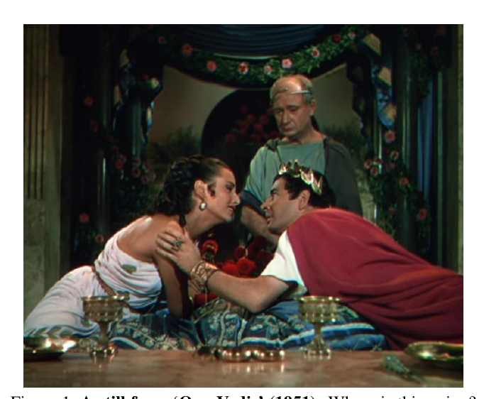
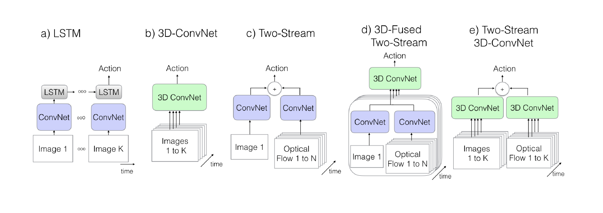
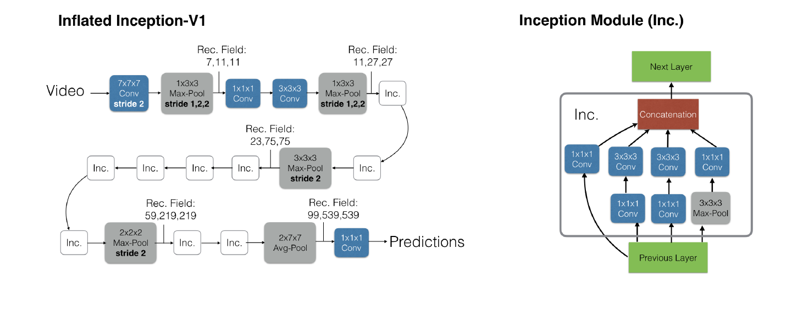
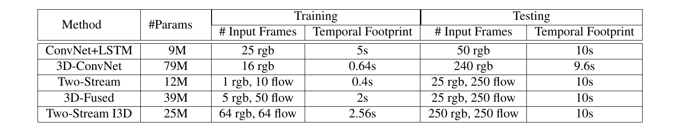
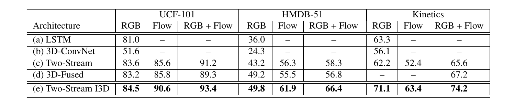
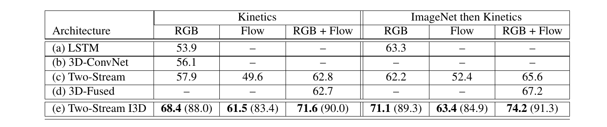
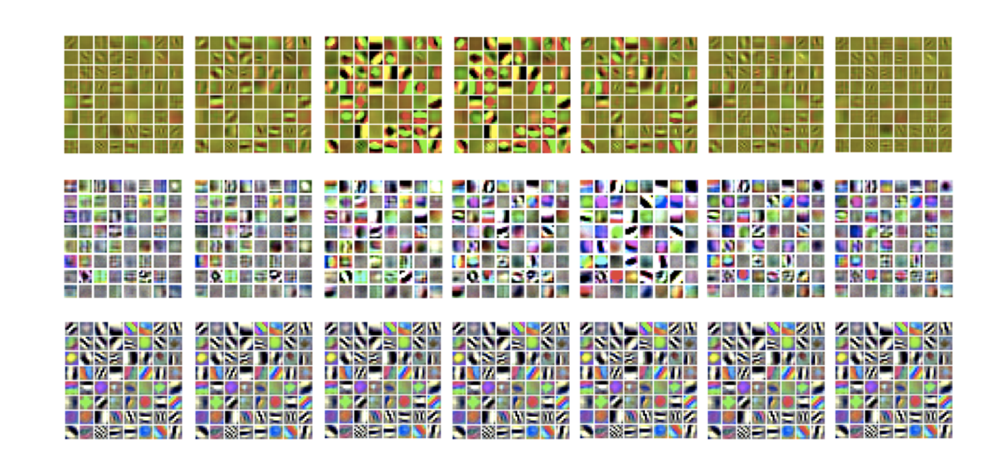
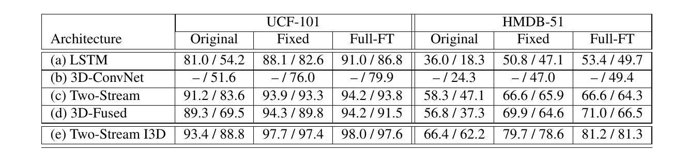
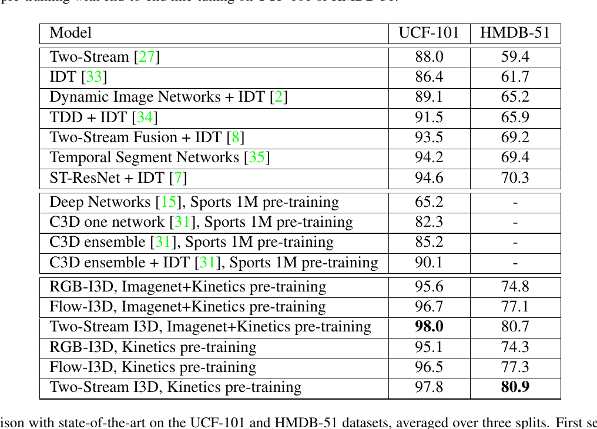

# Quo Vadis, Action Recognition? A New Model and the Kinetics Dataset

> Joa ̃o Carreira†    Andrew Zisserman†,∗

>†DeepMind ∗Department of Engineering Science, University of Oxford

# 摘要

># Abstract

当前动作分类数据集（UCF-101 和 HMDB-51）中视频的缺乏使得识别良好的视频架构变得困难，因为大多数方法在现有的小规模基准上获得了相似的性能。本文根据新的 Kinetics Human Action Video 数据集重新评估了最先进的架构。 Kinetics 拥有两个数量级以上的数据，包含 400 个人类动作类和每个类超过 400 个剪辑，并且是从逼真的、具有挑战性的 YouTube 视频中收集的。我们分析了当前架构在该数据集上的动作分类任务上的表现，以及在对 Kinetics 进行预训练后，在较小的基准数据集上性能提高了多少。

>The paucity of videos in current action classification datasets (UCF-101 and HMDB-51) has made it difficult to identify good video architectures, as most methods ob- tain similar performance on existing small-scale bench- marks. This paper re-evaluates state-of-the-art architec- tures in light of the new Kinetics Human Action Video dataset. Kinetics has two orders of magnitude more data, with 400 human action classes and over 400 clips per class, and is collected from realistic, challenging YouTube videos. We provide an analysis on how current architectures fare on the task of action classification on this dataset and how much performance improves on the smaller benchmark datasets after pre-training on Kinetics.

我们还引入了一种基于 2D ConvNet 膨胀的新的双流膨胀 3D ConvNet (I3D)：将非常深的图像分类 ConvNet 的过滤器和池化内核扩展到 3D，从而可以学习无缝空间- 从视频中提取时间特征，同时利用成功的 ImageNet 架构设计，甚至它们的参数。我们表明，在对 Kinetics 进行预训练后，I3D 模型大大提高了动作分类的最新技术，达到在HMDB-51上80.9%，在UCF-101上98.0%。

>We also introduce a new Two-Stream Inflated 3D Con- vNet (I3D) that is based on 2D ConvNet inflation: fil- ters and pooling kernels of very deep image classifica- tion ConvNets are expanded into 3D, making it possible to learn seamless spatio-temporal feature extractors from video while leveraging successful ImageNet architecture designs and even their parameters. We show that, after pre-training on Kinetics, I3D models considerably improve upon the state-of-the-art in action classification, reaching 80.9% on HMDB-51 and 98.0% on UCF-101.

## 1. 简介

>## 1. Introduction

ImageNet 挑战的意想不到的好处之一是发现在 1000 个类别的 1000 张图像上训练的深度架构可以用于其他任务和其他领域。早期的例子之一是使用在 ImageNet 上训练的网络的 fc7 特征来进行 PASCAL VOC 分类和检测挑战 [10, 23]。此外，深度架构的改进，从 AlexNet 到 VGG-16，立即反馈到 PASCAL VOC 性能的相应改进 [25]。从那时起，已经有许多 ImageNet 训练架构热启动或完全满足其他任务的例子，例如

>One of the unexpected benefits of the ImageNet chal- lenge has been the discovery that deep architectures trained on the 1000 images of 1000 categories, can be used for other tasks and in other domains. One of the early examples of this was using the fc7 features from a network trained on ImageNet for the PASCAL VOC classification and detec- tion challenge [10, 23]. Furthermore, improvements in the deep architecture, changing from AlexNet to VGG-16, im- mediately fed through to commensurate improvements in the PASCAL VOC performance [25]. Since then, there have been numerous examples of ImageNet trained architectures warm starting or sufficing entirely for other tasks, e.g. seg-

图 1.《Quo Vadis》（1951 年）的剧照。这是要去哪里？这些演员是要亲吻，还是刚刚亲吻？更重要的是，动作识别将走向何方？单个帧中的动作可能不明确，但现有动作识别数据集的局限性意味着性能最佳的视频架构不会显着偏离单图像分析，它们依赖于在 ImageNet 上训练的强大图像分类器。在本文中，我们证明了视频模型最好在视频上进行预训练，并通过使用在 Kinetics（一个新收集的、具有挑战性的大型人类动作视频数据集）上预训练的时空分类器来报告显着的改进。

>Figure 1. A still from ‘Quo Vadis’ (1951). Where is this going? Are these actors about to kiss each other, or have they just done so? More importantly, where is action recognition going? Actions can be ambiguous in individual frames, but the limitations of exist- ing action recognition datasets has meant that the best-performing video architectures do not depart significantly from single-image analysis, where they rely on powerful image classifiers trained on ImageNet. In this paper we demonstrate that video models are best pre-trained on videos and report significant improvements by using spatio-temporal classifiers pre-trained on Kinetics, a freshly collected, large, challenging human action video dataset.

分割，深度预测，姿势估计，动作分类。

>mentation, depth prediction, pose estimation, action classi- fication.

在视频领域，在足够大的数据集上训练动作分类网络是否会在应用于不同的时间任务或数据集时产生类似的性能提升，这是一个悬而未决的问题。构建视频数据集的挑战意味着大多数流行的动作识别基准都很小，大约有 10k 个视频。

>In the video domain, it is an open question whether train- ing an action classification network on a sufficiently large dataset, will give a similar boost in performance when ap- plied to a different temporal task or dataset. The chal- lenges of building video datasets has meant that most popu- lar benchmarks for action recognition are small, having on the order of 10k videos.

在本文中，我们旨在使用新的 Kinetics 人体动作视频数据集 [16] 为这个问题提供答案，该数据集比以前的数据集 HMDB-51 [18] 和 UCF-101 [29] 大两个数量级。 Kinetics 有 400 个人类动作类，每个类有 400 多个示例，每个示例都来自一个独特的 YouTube 视频。

>In this paper we aim to provide an answer to this question using the new Kinetics Human Action Video Dataset [16], which is two orders of magnitude larger than previous datasets, HMDB-51 [18] and UCF-101 [29]. Kinetics has 400 human action classes with more than 400 examples for each class, each from a unique YouTube video.

我们的实验策略是从文献中重新实现一些具有代表性的神经网络架构，然后通过首先在 Kinetics 上对每个架构进行预训练，然后在 HMDB-51 和 UCF-101 上进行微调来分析它们的传递行为。结果表明，预训练总能提高性能，但提升的程度随架构类型的不同而显着不同。基于这些发现，我们引入了一种新模型，该模型能够利用 Kinetics 的预训练，并且可以实现高性能。该模型称为“双流膨胀 3D 卷积网络”（I3D），建立在最先进的图像分类架构之上，但将它们的过滤器和池化内核（以及可选的参数）膨胀到 3D 中，从而导致非常深的、自然时空分类器。在对 Kinetics 进行预训练后，基于 Inception-v1 [13] 的 I3D 模型获得了远远超过最新技术的性能。

>Our experimental strategy is to reimplement a number of representative neural network architectures from the litera- ture, and then analyze their transfer behavior by first pre- training each one on Kinetics and then fine-tuning each on HMDB-51 and UCF-101. The results suggest that there is always a boost in performance by pre-training, but the ex- tent of the boost varies significantly with the type of archi- tecture. Based on these findings, we introduce a new model that has the capacity to take advantage of pre-training on Kinetics, and can achieves a high performance. The model termed a “Two-Stream Inflated 3D ConvNets” (I3D), builds upon state-of-the-art image classification architectures, but inflates their filters and pooling kernels (and optionally their parameters) into 3D, leading to very deep, naturally spatio- temporal classifiers. An I3D model based on Inception- v1 [13] obtains performance far exceeding the state-of-the- art, after pre-training on Kinetics.

在我们的模型比较中，我们没有考虑更经典的方法，例如视觉词袋表示 [6、19、22、33]。但是，Kinetics 数据集是公开的，因此其他人可以使用它进行此类比较。

>In our model comparisons, we did not consider more classic approaches such as bag-of-visual-words representa- tions [6, 19, 22, 33]. However, the Kinetics dataset is pub- licly available, so others can use it for such comparisons.

下一节概述了一组已实现的动作分类模型。第 3 节概述了 Kinetics 数据集。第 4 节报告了模型在以前的基准和 Kinetics 上的性能，第 5 节研究了在 Kinetics 上学习到的特征如何转移到不同的数据集。论文最后对结果进行了讨论。

>The next section outlines the set of implemented action classification models. Section 3 gives an overview of the Kinetics dataset. Section 4 reports the performance of mod- els on previous benchmarks and on Kinetics, and section 5 studies how well the features learned on Kinetics transfer to different datasets. The paper concludes with a discussion of the results.

## 2.动作分类架构

>## 2.Action Classification Architectures

虽然近年来图像表示架构的发展迅速成熟，但仍然没有明确的视频前端运行架构。当前视频架构的一些主要区别是卷积和层运算符是使用 2D（基于图像）还是 3D（基于视频）内核；网络的输入是否只是一个 RGB 视频，或者它还包括预先计算的光流；并且，在 2D ConvNets 的情况下，信息如何跨帧传播，这可以使用时间循环层（如 LSTM）或随时间的特征聚合来完成。

>While the development of image representation architec- tures has matured quickly in recent years, there is still no clear front running architecture for video. Some of the ma- jor differences in current video architectures are whether the convolutional and layers operators use 2D (image-based) or 3D (video-based) kernels; whether the input to the network is just an RGB video or it also includes pre-computed opti- cal flow; and, in the case of 2D ConvNets, how information is propagated across frames, which can be done either us- ing temporally-recurrent layers such as LSTMs, or feature aggregation over time.

在本文中，我们比较和研究了跨越大部分空间的模型子集。在 2D ConvNet 方法中，我们考虑了带有 LSTM 的 ConvNet [5, 37]，以及具有两种不同类型流融合的双流网络 [8, 27]。我们还考虑了一个 3D ConvNet [14, 30]：C3D

>In this paper we compare and study a subset of models that span most of this space. Among 2D ConvNet meth- ods, we consider ConvNets with LSTMs on top [5, 37], and two-stream networks with two different types of stream fu- sion [8, 27]. We also consider a 3D ConvNet [14, 30]: C3D

作为主要的技术贡献，我们介绍了双流膨胀 3D ConvNets (I3D)。由于其参数化的高维性和缺乏标记的视频数据，以前的 3D ConvNets 相对较浅（最多 8 层）。在这里，我们观察到非常深的图像分类网络，例如 Inception [13]、VGG-16 [28] 和 ResNet [12]，可以很容易地膨胀到时空特征提取器中，并且它们的预训练权重提供了有价值的初始化。我们还发现双流配置仍然有用。

>As the main technical contribution, we introduce Two- Stream Inflated 3D ConvNets (I3D). Due to the high- dimensionality of their parameterization and the lack of la- beled video data, previous 3D ConvNets have been rela- tively shallow (up to 8 layers). Here we make the obser- vation that very deep image classification networks, such as Inception [13], VGG-16 [28] and ResNet [12], can be trivially inflated into spatio-temporal feature extractors, and that their pre-trained weights provide a valuable initializa- tion. We also find that a two-stream configuration is still useful.

我们评估的五种架构的图形概述如图 2 所示，它们的时间接口的规范在表 1 中给出。

>A graphical overview of the five types of architectures we evaluate is shown in figure 2 and the specification of their temporal interfaces is given in table 1.

其中许多模型（除 C3D 之外的所有模型）都有一个 Imagenet 预训练模型作为子组件。我们的实验策略假设一个通用的 ImageNet 预训练图像分类架构作为骨干，为此我们选择了具有 batch 归一化 [13] 的 Inception-v1，并以不同的方式对其进行变形。期望有了这个共同的骨干，我们将能够梳理出最有利于动作分类的那些变化。

>Many of these models (all but C3D) have an Imagenet pre-trained model as a subcomponent. Our experimen- tal strategy assumes a common ImageNet pre-trained im- age classification architecture as back bone, and for this we chose Inception-v1 with batch normalization [13], and morph it in different ways. The expectation is that with this back bone in common, we will be able to tease apart those changes that benefit action classification the most.

### 2.1. The Old I: ConvNet+LSTM

图像分类网络的高性能使得尝试在对视频进行尽可能少的更改的情况下重用它们很有吸引力。这可以通过使用它们从每一帧中独立地提取特征然后在整个视频中汇集它们的预测来实现 [15]。这符合词袋图像建模方法 [19、22、33] 的精神；但是虽然在实践中很方便，但它存在完全忽略时间结构的问题（例如，模型无法潜在地区分开门和关门）。

>The high performance of image classification networks makes it appealing to try to reuse them with as minimal change as possible for video. This can be achieved by using them to extract features independently from each frame then pooling their predictions across the whole video [15]. This is in the spirit of bag of words image modeling approaches [19, 22, 33]; but while convenient in practice, it has the issue of entirely ignoring temporal structure (e.g. models can’t potentially distinguish opening from closing a door).

理论上，一种更令人满意的方法是在模型 [5, 37] 中添加一个循环层，例如 LSTM，它可以对状态进行编码，并捕获时间顺序和长期依赖关系。我们在 Inception-V1 的最后一个平均池化层之后放置一个具有 batch 归一化的 LSTM 层（如 Cooijmans 等人 [4] 提出的），具有 512 个隐藏单元。在分类器的顶部添加了一个全连接层。

>In theory, a more satisfying approach is to add a recur- rent layer to the model [5, 37], such as an LSTM, which can encode state, and capture temporal ordering and long range dependencies. We position an LSTM layer with batch nor- malization (as proposed by Cooijmans et al. [4]) after the last average pooling layer of Inception-V1, with 512 hid- den units. A fully connected layer is added on top for the classifier.

该模型在所有时间步的输出上使用交叉熵损失进行训练。在测试期间，我们只考虑最后一帧的输出。输入视频帧通过从原始每秒 25 帧的流中保留每 5 帧中的一帧进行二次采样。表 1 给出了所有模型的完整时间开销。

>The model is trained using cross-entropy losses on the outputs at all time steps. During testing we consider only the output on the last frame. Input video frames are sub- sampled by keeping one out of every 5, from an original 25 frames-per-second stream. The full temporal footprint of all models is given in table 1.

### 2.2. The Old II: 3D ConvNets

3D ConvNets 似乎是一种自然的视频建模方法，就像标准的卷积网络一样，但具有时空过滤器。以前[14,30,31,32]已经对它们进行了多次探索。它们有一个非常重要的特性：它们直接创建时空数据的层次表示。这些模型的一个问题是它们具有比 2D 更多的参数

>3D ConvNets seem like a natural approach to video mod- eling, and are just like standard convolutional networks, but with spatio-temporal filters. They have been explored sev- eral times, previously [14, 30, 31, 32]. They have a very im- portant characteristic: they directly create hierarchical rep- resentations of spatio-temporal data. One issue with these models is that they have many more parameters than 2D

图 2. 本文考虑的视频架构。 K 代表视频中的总帧数，而 N 代表视频相邻帧的子集。

>Figure 2. Video architectures considered in this paper. K stands for the total number of frames in a video, whereas N stands for a subset of neighboring frames of the video.

这使他们更难训练。此外，它们似乎排除了 ImageNet 预训练的好处，因此以前的工作已经定义了相对较浅的自定义架构并从头开始训练它们 [14、15、30、31]。基准测试的结果已经显示出前景，但与最先进的技术相比没有竞争力，这使得这种类型的模型成为在我们更大的数据集上进行评估的良好候选者。

>this makes them harder to train. Also, they seem to preclude the benefits of ImageNet pre-training, and consequently previous work has defined relatively shallow custom archi- tectures and trained them from scratch [14, 15, 30, 31]. Re- sults on benchmarks have shown promise but have not been competitive with state-of-the-art, making this type of mod- els a good candidate for evaluation on our larger dataset.

在本文中，我们实现了 C3D [31] 的一个小变体，它在顶部有 8 个卷积层、5 个池化层和 2 个全连接层。模型的输入是 16 帧短剪辑，裁剪为 112 × 112 像素，与原始实现相同。与 [31] 不同的是，我们在所有卷积层和全连接层之后使用了 batch 归一化。与原始模型的另一个不同之处在于第一个池化层，我们使用 2 而不是 1 的时间步长，这减少了内存占用并允许更大的 batches——这对于 batch 规范化很重要（尤其是在没有权重绑定的全连接层之后）。使用这个步幅，我们能够使用标准 K40 GPU 在每个 GPU 每个 batch 上训练 15 个视频。

>For this paper we implemented a small variation of C3D [31], which has 8 convolutional layers, 5 pooling layers and 2 fully connected layers at the top. The inputs to the model are short 16-frame clips with 112 × 112-pixel crops as in the original implementation. Differently from [31] we used batch normalization after all convolutional and fully con- nected layers. Another difference to the original model is in the first pooling layer, we use a temporal stride of 2 in- stead of 1, which reduces the memory footprint and allows for bigger batches – this was important for batch normal- ization (especially after the fully connected layers, where there is no weight tying). Using this stride we were able to train with 15 videos per batch per GPU using standard K40 GPUs.

### 2.3. The Old III: Two-Stream Networks

基于卷积网络最后一层特征的 LSTM 可以对高级变化进行建模，但可能无法捕获在许多情况下至关重要的精细低级运动。训练也很昂贵，因为它需要通过多个帧展开网络以进行反向传播。

>LSTMs on features from the last layers of ConvNets can model high-level variation, but may not be able to capture fine low-level motion which is critical in many cases. It is also expensive to train as it requires unrolling the network through multiple frames for backpropagation-through-time.

Simonyan 和 Zisserman [27] 引入了一种不同的、非常实用的方法，通过对单个 RGB 帧和一组 10 个外部计算的光流帧的，将它们通过ImageNet 预训练的 ConvNet 的两个副本，然后预测进行平均。流有一个自适应的输入卷积层，输入通道是流帧的两倍（因为流有两个通道，水平和垂直），并且在测试时从视频中采样多个快照并平均动作预测。这被证明在现有基准测试中获得了非常高的性能，同时训练和测试非常有效。

>A different, very practical approach, introduced by Si- monyan and Zisserman [27], models short temporal snap- shots of videos by averaging the predictions from a single RGB frame and a stack of 10 externally computed optical flow frames, after passing them through two replicas of an ImageNet pre-trained ConvNet. The flow stream has an adapted input convolutional layer with twice as many input channels as flow frames (because flow has two channels, horizontal and vertical), and at test time multiple snapshots are sampled from the video and the action prediction is av- eraged. This was shown to get very high performance on existing benchmarks, while being very efficient to train and test.

最近的一个改进 [8] 在最后一个网络卷积层之后融合了空间流和光流流，显示了 HMDB 的一些改进，同时需要更少的测试时间增强（快照采样）。我们的实现大致遵循这篇论文，使用 Inception-V1。网络的输入是相隔 10 帧采样的 5 个连续 RGB 帧，以及相应的光流片段。 Inception-V1 的最后一个平均池化层之前的空间和运动特征（5 × 7 × 7 特征网格，对应于时间、x 和 y 维度）通过一个 3 × 3 × 3 3D 卷积层，输出为 512通道，然后是 3 × 3 × 3 3D 最大池层和最终的全连接层。这些新层的权重用高斯噪声初始化。

>A recent extension [8] fuses the spatial and flow streams after the last network convolutional layer, showing some improvement on HMDB while requiring less test time aug- mentation (snapshot sampling). Our implementation fol- lows this paper approximately using Inception-V1. The in- puts to the network are 5 consecutive RGB frames sam- pled 10 frames apart, as well as the corresponding optical flow snippets. The spatial and motion features before the last average pooling layer of Inception-V1 (5 × 7 × 7 fea- ture grids, corresponding to time, x and y dimensions) are passed through a 3 × 3 × 3 3D convolutional layer with 512 output channels, followed by a 3 × 3 × 3 3D max-pooling layer and through a final fully connected layer. The weights of these new layers are initialized with Gaussian noise.

原始双流和 3D 融合版本这两种模型都是端到端训练的（包括原始模型中的双流平均过程）。

>Both models, the original two-stream and the 3D fused version, are trained end-to-end (including the two-stream averaging process in the original model).

### 2.4. The New: Two-Stream Inflated 3D ConvNets

通过这种架构，我们展示了 3D ConvNets 如何从 ImageNet 2D ConvNet 设计中受益，并且可以选择从它们的学习参数中受益。我们还采用了两个，虽然 3D ConvNets 可以直接从 RGB 流中学习时间模式，但通过包含光流流仍然可以大大提高它们的性能。

>With this architecture, we show how 3D ConvNets can benefit from ImageNet 2D ConvNet designs and, option- ally, from their learned parameters. We also adopt a two- that while 3D ConvNets can directly learn about temporal patterns from an RGB stream, their performance can still be greatly improved by including an optical-flow stream.

**将 2D ConvNets 膨胀为 3D**。多年来，已经开发了许多非常成功的图像分类架构，部分是通过艰苦的试验和错误。我们建议将成功的图像（2D）分类模型简单地转换为 3D ConvNet，而不是重复时空模型的过程。这可以通过从 2D 架构开始，膨胀所有过滤器和池化内核来完成——赋予它们额外的时间维度。过滤器通常是方形的，我们只是把它们做成立方的——N × N 过滤器变成 N × N × N。

>Inflating 2D ConvNets into 3D. A number of very success- ful image classification architectures have been developed over the years, in part through painstaking trial and error. Instead of repeating the process for spatio-temporal models we propose to simply convert successful image (2D) clas- sification models into 3D ConvNets. This can be done by starting with a 2D architecture, and inflating all the filters and pooling kernels – endowing them with an additional temporal dimension. Filters are typically square and we just make them cubic – N × N filters become N × N × N .

**从 2D 过滤器引导 3D 过滤器**。除了架构之外，人们可能还想从预训练的 ImageNet 模型中引导参数。为此，我们观察到可以通过将图像重复复制到视频序列中来将其转换为（无聊的）视频。然后可以通过满足我们所说的无聊视频固定点在 ImageNet 上隐式预训练 3D 模型：无聊视频上的池化激活应该与原始单图像输入上的相同。由于线性，这可以通过沿时间维度重复 2D 滤波器的权重 N 次，并通过除以 N 来重新缩放它们来实现。这确保了卷积滤波器的响应是相同的。由于无聊视频的卷积层的输出在时间上是恒定的，因此逐点非线性层以及平均和最大池化层的输出与 2D 情况相同，因此整体网络响应尊重无聊视频固定点。[21] 研究其他引导策略。

>Bootstrapping 3D filters from 2D Filters. Besides the ar- chitecture, one may also want to bootstrap parameters from the pre-trained ImageNet models. To do this, we observe that an image can be converted into a (boring) video by copying it repeatedly into a video sequence. The 3D models can then be implicitly pre-trained on ImageNet, by satisfy- ing what we call the boring-video fixed point: the pooled activations on a boring video should be the same as on the original single-image input. This can be achieved, thanks to linearity, by repeating the weights of the 2D filters N times along the time dimension, and rescaling them by dividing by N . This ensures that the convolutional filter response is the same. Since the outputs of convolutional layers for boring videos are constant in time, the outputs of pointwise non-linearity layers and average and max-pooling layers are the same as for the 2D case, and hence the overall network response respects the boring-video fixed point. [21] studies other bootstrapping strategies.

**在空间、时间和网络深度上加快感受野的增长**。无聊的视频固定点为如何沿时间维度膨胀池化算子以及如何设置卷积/池化时间步幅留下了足够的自由度——这些是影响特征接受域大小的主要因素。几乎所有图像模型都平等地对待两个空间维度（水平和垂直）——池化内核和步幅是相同的。这是很自然的，意味着网络中更深的特征同样受到两个维度上越来越远的图像位置的影响。然而，在考虑时间时，对称的感受野不一定是最佳的——这应该取决于帧速率和图像尺寸。如果它在时间上相对于空间增长太快，它可能会混淆来自不同对象的边缘，破坏早期的特征检测，而如果它增长太慢，它可能无法很好地捕捉场景动态。

>Pacing receptive field growth in space, time and net- work depth. The boring video fixed-point leaves ample freedom on how to inflate pooling operators along the time dimension and on how to set convolutional/pooling tempo- ral stride – these are the primary factors that shape the size of feature receptive fields. Virtually all image models treat the two spatial dimensions (horizontal and vertical) equally – pooling kernels and strides are the same. This is quite natural and means that features deeper in the networks are equally affected by image locations increasingly far away in both dimensions. A symmetric receptive field is however not necessarily optimal when also considering time – this should depend on frame rate and image dimensions. If it grows too quickly in time relative to space, it may conflate edges from different objects breaking early feature detec- tion, while if it grows too slowly, it may not capture scene dynamics well.

在 Inception-v1 中，第一个卷积层的步长为 2，然后有四个步长为 2 的最大池化层和一个 7×7 平均池化层，位于最后一个线性分类层之前，除了并行的最大池化层初始分支。在我们的实验中，输入视频以每秒 25 帧的速度处理；我们发现在前两个最大池化层中不执行时间池化（通过使用 1 × 3 × 3 内核和时间步长 1）是有帮助的，而在所有其他最大池化层中具有对称内核和步长。最终的平均池化层使用 2 × 7 × 7 内核。整体架构如图3所示。  我们使用 64 帧片段训练模型并使用整个视频进行测试，对预测进行时间平均。

>In Inception-v1, the first convolutional layer has stride 2, then there are four max-pooling layers with stride 2 and a 7 × 7 average-pooling layer preceding the last linear clas- sification layer, besides the max-pooling layers in parallel Inception branches. In our experiments the input videos were processed at 25 frames per second; we found it help- ful to not perform temporal pooling in the first two max- pooling layers (by using 1 × 3 × 3 kernels and stride 1 in time), while having symmetric kernels and strides in all other max-pooling layers. The final average pooling layer uses a 2 × 7 × 7 kernel. The overall architecture is shown in fig. 3. We train the model using 64-frame snippets and test using the whole videos, averaging predictions temporally.

**两个 3D 流**。虽然 3D ConvNet 应该能够直接从 RGB 输入中学习运动特征，但它仍然执行纯前馈计算，而光流算法在某种意义上是循环的（例如，它们对流场执行迭代优化）。也许是因为这种重复性的缺乏，实验上我们仍然发现拥有双流配置是有价值的——如图2, e 所示) – 一个 I3D 网络在 RGB 输入上进行训练，另一个在流输入上进行训练，该网络携带优化的平滑流信息。我们分别训练了这两个网络，并在测试时平均了它们的预测。

>Two 3D Streams. While a 3D ConvNet should be able to learn motion features from RGB inputs directly, it still per- forms pure feedforward computation, whereas optical flow algorithms are in some sense recurrent (e.g. they perform it- erative optimization for the flow fields). Perhaps because of this lack of recurrence, experimentally we still found it valu- able to have a two-stream configuration – shown in fig. 2, e) – with one I3D network trained on RGB inputs, and an- other on flow inputs which carry optimized, smooth flow information. We trained the two networks separately and averaged their predictions at test time.

### 2.5.实施细节

>### 2.5. Implementation Details

除了类 C3D 的 3D ConvNet 之外的所有模型都使用 ImageNet 预训练的 Inception-V1 [13] 作为基础网络。对于所有架构，我们在每个卷积层之后都跟着一个 batch 归一化 [13] 层和一个 ReLU 激活函数，除了为每个网络产生类分数的最后一个卷积层。

>All models but the C3D-like 3D ConvNet use ImageNet- pretrained Inception-V1 [13] as base network. For all ar- chitectures we follow each convolutional layer by a batch normalization [13] layer and a ReLU activation function, except for the last convolutional layers which produce the class scores for each network.

视频训练使用标准 SGD，动量在所有情况下都设置为 0.9，所有模型的 32 个 GPU 同步并行化，除了 3D ConvNets 接收大量输入帧，因此需要更多 GPU 来形成大批量 -我们为此使用了 64 个 GPU。我们在 Kinetics 上训练模型 110k 步，当验证损失饱和时学习率降低 10 倍。我们在 Kinetics 的验证集上调整了学习率超参数。模型在 UCF-101 和 HMDB-51 上使用与 Kinetics 类似的学习率适应过程进行了高达 5k 步的训练，但只使用了 16 个 GPU。所有模型都在 TensorFlow [1] 中实现。

>Training on videos used standard SGD with momen- tum set to 0.9 in all cases, with synchronous paralleliza- tion across 32 GPUs for all models except the 3D ConvNets which receive a large number of input frames and hence require more GPUs to form large batches – we used 64 GPUs for these. We trained models on on Kinetics for 110k steps, with a 10x reduction of learning rate when validation loss saturated. We tuned the learning rate hyperparameter on the validation set of Kinetics. Models were trained for up to 5k steps on UCF-101 and HMDB-51 using a similar learning rate adaptation procedure as for Kinetics but using just 16 GPUs. All the models were implemented in Tensor- Flow [1].

众所周知，数据增强对于深度架构的性能至关重要。在训练期间，我们在空间上使用随机裁剪——将较小的视频边调整为 256 像素，然后随机裁剪 224 × 224 patch——在时间上，在足够早的时间选择起始帧以保证所需的数量帧。对于较短的视频，我们根据需要循环播放视频多次以满足每个模型的输入接口。在训练过程中，我们还对每段视频进行了随机的左右翻转，并保持一致。在测试时间内

>Data augmentation is known to be of crucial importance for the performance of deep architectures. During train- ing we used random cropping both spatially – resizing the smaller video side to 256 pixels, then randomly cropping a 224 × 224 patch – and temporally, when picking the start- ing frame among those early enough to guarantee a desired number of frames. For shorter videos, we looped the video as many times as necessary to satisfy each model’s input interface. We also applied random left-right flipping con- sistently for each video during training. During test time

图 3. Inflated Inception-V1 架构（左）及其详细的 inception 子模块（右）。未指定说明的卷积和池化算子的步长为 1，并且未显示 batch 归一化层、ReLu 和最后的 softmax。网络中几层的感受野大小的理论大小以“time,x,y”的格式提供——单位是帧和像素。预测是在时间上卷积获得并平均的。

>Figure 3. The Inflated Inception-V1 architecture (left) and its detailed inception submodule (right). The strides of convolution and pooling operators are 1 where not specified, and batch normalization layers, ReLu’s and the softmax at the end are not shown. The theoretical sizes of receptive field sizes for a few layers in the network are provided in the format “time,x,y” – the units are frames and pixels. The predictions are obtained convolutionally in time and averaged.

表 1. 模型的参数数量和时间输入大小。

>Table 1. Number of parameters and temporal input sizes of the models.

这些模型以卷积方式应用于整个视频，采用 224 × 224 的中心裁剪，并对预测进行平均。我们简要地尝试了对 256 × 256 视频的空间卷积测试，但没有观察到改进。通过在测试时考虑左右翻转视频并在训练期间添加额外的增强（例如光度测量）可以获得更好的性能。我们把这个留给未来的工作。我们使用 TV-L1 算法 [38] 计算了光流。

>the models are applied convolutionally over the whole video taking 224 × 224 center crops, and the predictions are av- eraged. We briefly tried spatially-convolutional testing on the 256 × 256 videos, but did not observe improvement. Better performance could be obtained by also considering left-right flipped videos at test time and by adding addi- tional augmentation, such as photometric, during training. We leave this to future work. We computed optical flow with a TV-L1 algorithm [38].

## 3.Kinetics 人体动作视频数据集

>## 3.The Kinetics Human Action Video Dataset

Kinetics 数据集专注于人类行为（而不是活动或事件）。动作类列表包括： 人动作（单数），例如画画、喝酒、大笑、打拳；人对人的行动，例如拥抱、亲吻、握手；以及人-对象动作，例如打开礼物、修剪草坪、洗碗。有些动作是细粒度的，需要时间推理来区分，例如不同类型的游泳。其他动作需要更多地强调对象来区分，例如演奏不同类型的管乐器。

>The Kinetics dataset is focused on human actions (rather than activities or events). The list of action classes covers: Person Actions (singular), e.g. drawing, drinking, laugh- ing, punching; Person-Person Actions, e.g. hugging, kiss- ing, shaking hands; and, Person-Object Actions, e.g. open- ing presents, mowing lawn, washing dishes. Some actions are fine grained and require temporal reasoning to distin- guish, for example different types of swimming. Other ac- tions require more emphasis on the object to distinguish, for example playing different types of wind instruments.

该数据集有 400 个人类动作类，每个类有 400 个或更多剪辑，每个剪辑来自一个独特的视频，总共有 240k 个训练视频。剪辑持续大约 10 秒，并且没有未修剪的视频。测试集由每个类别的 100 个剪辑组成。数据集的完整描述及其构建方式在 [16] 中给出。

>The dataset has 400 human action classes, with 400 or more clips for each class, each from a unique video, for a total of 240k training videos. The clips last around 10s, and there are no untrimmed videos. The test set consists of 100 clips for each class. A full description of the dataset and how it was built is given in [16].

## 4.架构的实验比较

>## 4.Experimental Comparison of Architectures

在本节中，我们比较了第 2 节中描述的五种架构的性能，同时改变了用于训练和测试的数据集。

>In this section we compare the performance of the five ar- chitectures described in section 2 whilst varying the dataset used for training and testing.

表 2 显示了在 UCF-101、HMDB-51 或 Kinetics 上训练和测试时的分类准确度。我们在 UCF-101 和 HMDB-51 的 split 1 测试集以及 Kinetics 的保留测试集上进行测试。有几个值得注意的观察结果。 首先，我们的新I3D模型在所有的数据集中都表现最好，无论是RGB、光流还是RGB+光流模式，都是如此。

>Table 2 shows the classification accuracy when training and testing on either UCF-101, HMDB-51 or Kinetics. We test on the split 1 test sets of UCF-101 and HMDB-51 and on the held-out test set of Kinetics. There are several note- worthy observations. First, our new I3D models do best in all datasets, with either RGB, flow, or RGB+flow modali-

表 2. 架构比较：（左）UCF-101 拆分 1 上的训练和测试； （中）HMDB-51 第 1 部分的训练和测试； （右）Kinetics训练和测试。所有模型都基于 ImageNet 预训练的 Inception-v1，除了 3D-ConvNet，这是一个类似 C3D 的 [31] 模型，它具有自定义架构并在此从头开始训练。请注意，单个 RGB 和 Flow 流上的 Two-Stream 架构数字可以解释为一个简单的基线，它在 25 个均匀采样的帧上独立应用 ConvNet，然后对预测进行平均。

>Table 2. Architecture comparison: (left) training and testing on split 1 of UCF-101; (middle) training and testing on split 1 of HMDB-51; (right) training and testing on Kinetics. All models are based on ImageNet pre-trained Inception-v1, except 3D-ConvNet, a C3D-like [31] model which has a custom architecture and was trained here from scratch. Note that the Two-Stream architecture numbers on individual RGB and Flow streams can be interpreted as a simple baseline which applies a ConvNet independently on 25 uniformly sampled frames then averages the predictions.

表 3. 使用和不使用 ImageNet 预训练的 Kinetics 性能训练和测试。括号 () 中的数字是 Top-5 准确度，所有其他都是 Top-1。

>Table 3. Performance training and testing on Kinetics with and without ImageNet pretraining. Numbers in brackets () are the Top-5 accuracy, all others are Top-1.

这很有趣，因为它的参数数量非常多，而且 UCF-101 和 HMDB-51 非常小，并且表明 ImageNet 预训练的好处可以扩展到 3D ConvNets。

>ties. This is interesting, given its very large number of pa- rameters and that UCF-101 and HMDB-51 are so small, and shows that the benefits of ImageNet pre-training can extend to 3D ConvNets.

其次，所有模型在 Kinetics 上的性能都远低于 UCF-101，这表明两个数据集的难度不同。然而，它高于 HMDB-51；这可能部分是由于 HMDB-51 中缺乏训练数据，但也因为该数据集被故意构建为很难：许多剪辑在完全相同的场景中具有不同的动作（例如，“拔剑”示例取自相同的场景）视频为“剑”和“剑练习”）。第三，不同架构的排名基本一致。

>Second, the performance of all models is far lower on Ki- netics than on UCF-101, an indication of the different levels of difficulty of the two datasets. It is however higher than on HMDB-51; this may be in part due to lack of training data in HMDB-51 but also because this dataset was purposefully built to be hard: many clips have different actions in the ex- act same scene (e.g. “drawing sword” examples are taken from same videos as “sword” and “sword exercise”). Third, the ranking of the different architectures is mostly consis- tent.

此外，双流架构在所有数据集上都表现出卓越的性能，但 RGB 和光流的相对值在 Kinetics 和其他数据集之间存在显着差异。仅光流的贡献在 UCF-101 上略高于 RGB，在 HMDB-51 上高得多，而在 Kinetics 上则低得多。数据集的视觉检查表明 Kinetics 有更多的相机运动，这可能会使运动流的工作更加困难。与其他模型相比，I3D 模型似乎能够从流中获得更多收益，这可能可以通过其更长的时间感受野（训练期间 64 帧 vs 10）和更集成的时间特征提取来解释机械。虽然 RGB 流具有更多的判别性信息似乎是合理的——在Kinetics中，我们经常用自己的眼睛来区分动作和单独的流，而 RGB 很少出现这种情况——未来可能有机会研究整合一些信息。将运动稳定形式融入这些架构中。

>Additionally, two-stream architectures exhibit superior performance on all datasets, but the relative value of RGB and flow differs significantly between Kinetics and the other datasets. The contribution from flow alone, is slightly higher than that of RGB on UCF-101, much higher on HMDB-51, and substantially lower on Kinetics. Visual in- spection of the datasets suggests that Kinetics has much more camera motion which may make the job of the motion stream harder. The I3D model seems able to get more out of the flow stream than the other models, however, which can probably be explained by its much longer temporal re- ceptive field (64 frames vs 10 during training) and more integrated temporal feature extraction machinery. While it seems plausible that the RGB stream has more discrimina- tive information – we often struggled with our own eyes to discern actions from flow alone in Kinetics, and this was rarely the case from RGB – there may be opportunities for future research on integrating some form of motion stabi- lization into these architectures.

我们还从 ImageNet 预训练的权重与从头开始评估了 Kinetics 训练模型的价值——结果如表 3 所示。可以看出，ImageNet 预训练在所有情况下仍然有帮助，对于 RGB 流，这稍微更明显正如预期的那样。

>We also evaluated the value of training models in Kinet- ics starting from ImageNet-pretrained weights versus from scratch – the results are shown in table 3. It can be seen that ImageNet pre-training still helps in all cases and this is slightly more noticeable for the RGB streams, as would be expected.

## 5.特征的实验评估

>## 5.Experimental Evaluation of Features

在本节中，我们研究了在 Kinetics 上训练的网络的泛化性。我们考虑两种措施：首先，我们冻结网络权重并使用网络为 UCF-101/HMDB-51 数据集的（未见过的）视频生成特征。然后，我们为 UCF-101/HMDB-51 的类训练多路 soft-max 分类器（使用他们的训练数据），并在他们的测试集上进行评估；其次，我们 fine-tune UCF-101/HMDB-51 类的每个网络（使用 UCF-101/HMDB-51 训练数据），并再次评估 UCF-101/HMDB-51 测试集。我们还研究了在 ImageNet+Kinetics 上进行预训练的重要性，而不是只有Kinetics。

>In this section we investigate the generalizability of the networks trained on Kinetics. We consider two measures of this: first, we freeze the network weights and use the network to produce features for the (un- seen) videos of the UCF-101/HMDB-51 datasets. We then train multi-way soft-max classifiers for the classes of UCF-101/HMDB-51 (using their training data), and eval- uate on their test sets; Second, we fine-tune each net- work for the UCF-101/HMDB-51 classes (using the UCF- 101/HMDB-51 training data), and again evaluate on the UCF-101/HMDB-51 test sets. We also examine how important it is to pre-train on Im- ageNet+Kinetics instead of just Kinetics.

图 4. 在 Kinetics 训练后，每个 Inflated 3D ConvNet 的所有 64 个 conv1 过滤器（过滤器尺寸为 7 × 7 × 7，7 个时间尺寸在图中从左到右显示）。顶部的序列显示流网络过滤器，中间的序列显示来自 RGB I3D 网络的过滤器，底部一行显示原始的 Inception-v1 过滤器。请注意，I3D 过滤器具有丰富的时间结构。奇怪的是，流网络的过滤器更接近于原始 ImageNet 训练的 Inception-v1 过滤器，而 RGB I3D 网络中的过滤器不再可识别。请最好在电脑上看，彩色化并放大。

>Figure 4. All 64 conv1 filters of each Inflated 3D ConvNet after training on Kinetics (the filter dimensions are 7 × 7 × 7, and the 7 time dimensions are shown left-to-right across the figure). The sequence on top shows the flow network filters, the one in the middle shows filters from the RGB I3D network, and the bottom row shows the original Inception-v1 filters. Note that the I3D filters possess rich temporal structure. Curiously the filters of the flow network are closer to the original ImageNet-trained Inception-v1 filters, while the filters in the RGB I3D network are no longer recognizable. Best seen on the computer, in colour and zoomed in.

结果在表 4 中给出。明确的结果是所有架构都受益于对 Kinetics 附加视频数据的预训练，但有些架构比其他架构受益得多——尤其是 I3D-ConvNet 和 3D-ConvNet（尽管后者从低得多的基数开始）。在Ki- netics预训练（固定）之后只训练模型的最后一层也比直接在 UCF-101 和 HMDB-51 上为 I3D 模型训练带来更好的性能。

>The results are given in table 4. The clear outcome is that all architectures benefit from pre-training on the additional video data of Kinetics, but some benefit significantly more than the others – notably the I3D-ConvNet and 3D-ConvNet (although the latter starting from a much lower base). Train- ing just the last layers of the models after pretraining in Ki- netics (Fixed) also leads to much better performance than directly training on UCF-101 and HMDB-51 for I3D mod- els.

对 I3D 模型的特征显着更好的可迁移性的一种解释是它们的高时间分辨率——它们以每秒 25 帧的速度在 64 帧视频片段上进行训练，并在测试时处理所有视频帧，这使得它们可以捕获精细的动作的粒度时间结构。换句话说，具有稀疏视频输入的方法可能从对这个大型视频数据集的训练中获益较少，因为从他们的角度来看，视频与 ImageNet 中的图像没有太大差异。与类 C3D 模型的差异可以解释为我们的 I3D 模型更深，同时具有更少的参数，通过利用 ImageNet 热启动，在 4 倍长的视频上进行训练，以及在 2 倍的视频上进行操作更高空间分辨率的视频。

> One explanation for the significant better transferability of features of I3D models is their high temporal resolution – they are trained on 64-frame video snippets at 25 frames per second and process all video frames at test time, which makes it possible for them to capture fine-grained tempo- ral structure of actions. Stated differently, methods with sparser video inputs may benefit less from training on this large video dataset because, from their perspective, videos do not differ as much from the images in ImageNet. The difference over the C3D-like model can be explained by our I3D models being much deeper, while having much fewer parameters, by leveraging an ImageNet warm-start, by be- ing trained on 4× longer videos, and by operating on 2× higher spatial resolution videos.

即使从头开始训练（没有 ImageNet 或 Kinetics），双流模型的性能也出奇的好，这主要是由于流的准确性，这似乎不太容易过度拟合（未显示）。Kinetics预训练比 ImageNet 的帮助要大得多。

> The performance of the two-stream models is surpris- ingly good even when trained from scratch (without Ima- geNet or Kinetics), mainly due to the accuracy of the flow stream, which seems much less prone to overfitting (not shown). Kinetics pretraining helps significantly more than ImageNet.

### 5.1.与最先进的比较

>### 5.1. Comparison with the State-of-the-Art

我们在 UCF-101 和 HMDB-51 上的表 5 中展示了 I3D 模型和之前最先进方法的性能比较。我们包括在 Kinetics 数据集上进行预训练时的结果（有和没有 ImageNet 预训练）。训练模型的 conv1 过滤器如图 4 所示。

>We show a comparison of the performance of I3D mod- els and previous state-of-the-art methods in table 5, on UCF-101 and HMDB-51. We include results when pre- training on the Kinetics dataset (with and without ImageNet pre-training). The conv1 filters of the trained models are shown in fig. 4.

许多方法得到了类似的结果，但目前在这些数据集上表现最好的方法是 Feichtenhofer 及其同事 [7] 的方法，它在 RGB 和光流上使用 ResNet-50 模型，在这些数据集上获得 94.6%当与密集轨迹模型结合时，UCF-101 和 HMDB-51 上的 70.3% [33]。我们使用三个标准训练/测试拆分的平均准确度对我们的方法进行了基准测试。我们的 RGB-I3D 或 RGB-Flow 模型中的任何一个，当在 Kinetics 上进行预训练时，都优于之前发布的任何模型或模型组合所有性能。

>Many methods get similar results, but the best perform- ing method on these datasets is currently the one by Fe- ichtenhofer and colleagues [7], which uses ResNet-50 mod- els on RGB and optical flow streams, and gets 94.6% on UCF-101 and 70.3% on HMDB-51 when combined with the dense trajectories model [33]. We benchmarked our methods using the mean accuracy over the three standard train/test splits. Either of our RGB-I3D or RGB-Flow mod- els alone, when pre-trained on Kinetics, outperforms all pre- vious published performance by any model or model com-

表 4. UCF-101 和 HMDB-51 测试集（两者的第 1 部分）的性能，用于使用/不使用 ImageNet 预训练权重的架构。Original：在 UCF-101 或 HMDB-51 上训练；Fixed：来自 Kinetics 的特征，最后一层在 UCF-101 或 HMDB-51 上训练； Full-FT：在 UCF-101 或 HMDB-51 上使用端到端 fine-tuning 进行Kinetics预训练。

>Table 4. Performance on the UCF-101 and HMDB-51 test sets (split 1 of both) for architectures starting with / without ImageNet pretrained weights. Original: train on UCF-101 or HMDB-51; Fixed: features from Kinetics, with the last layer trained on UCF-101 or HMDB-51; Full-FT: Kinetics pre-training with end-to-end fine-tuning on UCF-101 or HMDB-51.

表 5. 与 UCF-101 和 HMDB-51 数据集上最先进的比较，平均超过三个拆分。第一组行包含在没有标记外部数据的情况下训练的模型的结果。

>Table 5. Comparison with state-of-the-art on the UCF-101 and HMDB-51 datasets, averaged over three splits. First set of rows contains results of models trained without labeled external data.

与以前的模型相比具有相当大的优势，使 UCF-101 上的整体性能达到 98.0，HMDB-51 上的整体性能达到 80.9，与以前最好的模型相比，分别减少了 63% 和 35% 的错误分类 [7] .

>the advantage over previous models considerably, bring- ing overall performance to 98.0 on UCF-101 and 80.9 on HMDB-51, which correspond to 63% and 35% misclassifi- cation reductions, respectively compared to the best previ- ous model [7].

Kinetics 预训练的 I3D 模型和之前的 3D ConvNets (C3D) 之间的差异甚至更大，尽管 C3D 是在更多视频上训练的，1M 来自 Sports-1M 的示例加上一个内部数据集，甚至在与 IDT 集成和结合时也是如此。这可以通过 Kinetics 更好的质量来解释，但也因为 I3D 只是一种更好的架构。

>The difference between Kinetics pre-trained I3D mod- els and prior 3D ConvNets (C3D) is even larger, although C3D is trained on more videos, 1M examples from Sports- 1M plus an internal dataset, and even when ensembled and combined with IDT. This may be explainable by the better quality of Kinetics but also because of I3D simply being a better architecture.

## 6. 讨论

>## 6. Discussion

我们回到引言中提出的问题，“从视频中进行迁移学习有好处吗？”。很明显，在（大型视频数据集）Kinetics 上进行预训练有相当大的好处，就像在 ImageNet 上为这么多任务预训练 ConvNet 所带来的好处一样。这演示了从一个数据集（Kinetics）到另一个数据集（UCF-101/HMDB-51）的迁移学习，以完成类似的任务（尽管针对不同的动作类）。然而，将Kinetics预训练用于其他视频任务（如语义视频分割、视频目标检测或光流计算）是否有好处仍有待观察。我们计划公开可用的 I3D 模型，该模型在官方 Kinetics 数据集的发布上进行了训练，以促进该领域的研究。

>We return to the question posed in the introduction, “is there a benefit in transfer learning from videos?”. It is evi- dent that there is a considerable benefit in pre-training on (the large video dataset) Kinetics, just as there has been such benefits in pre-training ConvNets on ImageNet for so many tasks. This demonstrates transfer learning from one dataset (Kinetics) to another dataset (UCF-101/HMDB-51) for a similar task (albeit for different action classes). How- ever, it still remains to be seen if there is a benefit in using Kinetics pre-training for other video tasks such as seman- tic video segmentation, video object detection, or optical flow computation. We plan to make publicly available I3D models trained on the official Kinetics dataset’s release to facilitate research in this area.

当然，我们没有对架构进行全面探索——例如，我们没有使用动作管 [11、17] 或注意力机制 [20] 来关注人类表演者。最近的工作提出了富有想象力的方法，以确定双流架构内行为者的空间和时间范围（检测），通过在时间上纳入链接对象检测[24, 26]。空间和时间的关系是一种神秘的关系。最近有几篇非常有创意的论文开箱即用，试图捕捉这种关系，例如通过学习动作类的框架排名函数并将其用作表示 [9]，通过在动作和转换之间进行类比 [36]，或通过创建帧序列的 2D 视觉快照 [2]——这个想法与 [3] 的经典运动历史工作有关。将这些模型也包括在我们的比较中会很有价值，但由于时间和空间不足，我们不能。

>Of course, we did not perform a comprehensive explo- ration of architectures – for example we have not employed action tubes [11, 17] or attention mechanisms [20] to fo- cus in on the human actors. Recent works have proposed imaginative methods for determining the spatial and tem- poral extent (detection) of actors within the two-stream architectures, by incorporating linked object detections in time [24, 26]. The relationship between space and time is a mysterious one. Several very creative papers have recently gone out of the box in attempts to capture this relationship, for example by learning frame ranking functions for action classes and using these as a representation [9], by making analogies between actions and transformations [36], or by creating 2D visual snapshots of frame sequences [2] – this idea is related to the classic motion history work of [3]. It would be of great value to also include these models in our comparison but we could not, due to lack of time and space.

## Acknowledgements:

我们要感谢 Kinetics 项目的每个人，特别是 Brian Zhang 和 Tim Green 为我们的实验设置数据的帮助，以及 Karen Simonyan 的有益讨论。

>We would like to thank everyone on the Kinetics project and in particular Brian Zhang and Tim Green for help set- ting up the data for our experiments, and Karen Simonyan for helpful discussions.
