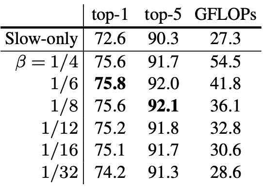
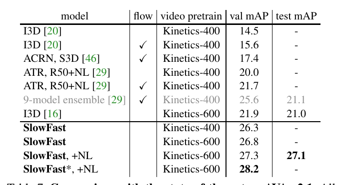

# SlowFast Networks for Video Recognition

>Christoph Feichtenhofer  Haoqi Fan  Jitendra Malik  Kaiming He
>
>Facebook AI Research (FAIR)

## 摘要

>## Abstract

我们介绍了用于视频识别的 SlowFast 网络。我们的模型涉及 (i) 一条慢速路径，以低帧率运行，以捕获空间语义，以及 (ii) 一条快速路径，以高帧率运行，以精细的时间分辨率捕获运动。 Fast 路径可以通过减少其通道容量来变得非常轻量级，但可以学习用于视频识别的有用时间信息。我们的模型在视频中的动作分类和检测方面都实现了强大的性能，并且我们的 SlowFast 概念明确表明了巨大的提升。我们报告了主要视频识别基准、Kinetics、Charades 和 AVA 的最高准确度。代码已在以下网址提供：https://github.com/facebookresearch/SlowFast。

>We present SlowFast networks for video recognition. Our model involves (i) a Slow pathway, operating at low frame rate, to capture spatial semantics, and (ii) a Fast path- way, operating at high frame rate, to capture motion at fine temporal resolution. The Fast pathway can be made very lightweight by reducing its channel capacity, yet can learn useful temporal information for video recognition. Our models achieve strong performance for both action classification and detection in video, and large improve- ments are pin-pointed as contributions by our SlowFast con- cept. We report state-of-the-art accuracy on major video recognition benchmarks, Kinetics, Charades and AVA. Code has been made available at: https://github.com/facebookresearch/SlowFast.

## 1.简介

>## 1. Introduction

在图像 I(x,y) 的识别中习惯于对称地处理两个空间维度 x 和 y。自然图像的统计数据证明了这一点，这些图像首先近似为各向同性——所有方向的可能性均等——并且是平移不变的 [41, 26]。但是视频信号 I(x, y, t) 呢？运动是方向 [2] 的时空对应表示，但并非所有时空方向都具有相同的可能性。慢动作比快动作更有可能（事实上，我们看到的大部分世界在给定时刻都是静止的），这在贝叶斯关于人类如何感知运动刺激的解释中得到了利用 [58]。例如，如果我们孤立地看到一个移动边缘，我们会认为它垂直于自身移动，即使原则上它也可能具有与自身相切的任意运动分量（光流中的孔径问题）。如果先验有利于慢速运动，这种看法是合理的。

>It is customary in the recognition of images I(x, y) to treat the two spatial dimensions x and y symmetrically. This is justified by the statistics of natural images, which are to a first approximation isotropic—all orientations are equally likely—and shift-invariant [41, 26]. But what about video signals I(x, y, t)? Motion is the spatiotemporal counterpart of orientation [2], but all spatiotemporal orientations are not equally likely. Slow motions are more likely than fast motions (indeed most of the world we see is at rest at a given moment) and this has been exploited in Bayesian accounts of how humans perceive motion stimuli [58]. For example, if we see a moving edge in isolation, we perceive it as moving perpendicular to itself, even though in principle it could also have an arbitrary component of movement tangential to itself (the aperture problem in optical flow). This percept is rational if the prior favors slow movements.

如果所有时空方向的可能性都不相同，那么我们就没有理由同样地处理空间和时间，但这在基于时空卷积的视频识别方法中是默认这样相同处理的[49, 5]。相反，我们可能会“分解”架构以分别处理空间结构和时间事件。为了具体起见，让我们在识别的背景下研究这一点。视觉内容的分类空间语义通常变化缓慢。

>If all spatiotemporal orientations are not equally likely, then there is no reason for us to treat space and time sym- metrically, as is implicit in approaches to video recognition based on spatiotemporal convolutions [49, 5]. We might instead “factor” the architecture to treat spatial structures and temporal events separately. For concreteness, let us study this in the context of recognition. The categorical spatial semantics of the visual content often evolve slowly.

图 1. SlowFast 网络具有低帧率、低时间分辨率的 Slow 路径和高帧率、α× 更高时间分辨率的 Fast 路径。 Fast 路径通过使用一小部分（β，例如 1/8）通道实现轻量化。横向连接将它们融合在一起。

>Figure 1. A SlowFast network has a low frame rate, low temporal resolution Slow pathway and a high frame rate, α× higher temporal resolution Fast pathway. The Fast pathway is lightweight by using a fraction (β, e.g., 1/8) of channels. Lateral connections fuse them.

例如，挥手不会在挥手动作的整个过程中改变“手”的标识，一个人即使可以从步行过渡到跑步，也始终属于“人”的范畴。因此，分类语义（以及它们的颜色、纹理、光照等）的识别可以相对缓慢地刷新。而另一方面，正在执行的动作可以比他们的主体标识变化得更快，例如拍手、挥手、摇晃、行走或跳跃。可能需要使用快速刷新帧（高时间分辨率）来有效地模拟可能快速变化的运动。

>For example, waving hands do not change their identity as “hands” over the span of the waving action, and a person is always in the “person” category even though he/she can transit from walking to running. So the recognition of the cat- egorical semantics (as well as their colors, textures, lighting etc.) can be refreshed relatively slowly. On the other hand, the motion being performed can evolve much faster than their subject identities, such as clapping, waving, shaking, walking, or jumping. It can be desired to use fast refreshing frames (high temporal resolution) to effectively model the potentially fast changing motion.

基于这种直觉，我们提出了一种用于视频识别的双路径 SlowFast 模型（图 1）。一种路径旨在捕获可以由图像或一些稀疏帧提供的语义信息，并且它以低帧速率和缓慢的刷新速度运行。相比之下，另一条路径负责通过以快速刷新速度和高时间分辨率运行来捕捉快速变化的运动。尽管它的时间速率很高，但这条路径非常轻量级，例如，约占总计算量的 20%。这是因为这条路径被设计成具有较少的通道和较弱的处理空间信息的能力，而这些信息可以由第一条路径以较少冗余的方式提供。我们将第一个称为慢速路径，将第二个称为快速路径，这是源于它们不同的时间速度。这两条路径通过横向连接融合在一起。

> Based on this intuition, we present a two-pathway SlowFast model for video recognition (Fig. 1). One path- way is designed to capture semantic information that can be given by images or a few sparse frames, and it operates at low frame rates and slow refreshing speed. In contrast, the other pathway is responsible for capturing rapidly changing motion, by operating at fast refreshing speed and high tem- poral resolution. Despite its high temporal rate, this pathway is made very lightweight, e.g., ∼20% of total computation. This is because this pathway is designed to have fewer chan- nels and weaker ability to process spatial information, while such information can be provided by the first pathway in a less redundant manner. We call the first a Slow pathway and the second a Fast pathway, driven by their different temporal speeds. The two pathways are fused by lateral connections.

我们的概念性想法导致视频模型的灵活和有效的设计。 Fast 路径由于其轻量级的特性，不需要执行任何时间 pooling——它可以在所有中间层的高帧率下运行并保持时间保真度。同时，由于时间速率较低，Slow 路径可以更专注于空间域和语义。通过以不同的时间速率处理原始视频，我们的方法允许这两种路径在视频建模方面拥有自己的专长知识。

> Our conceptual idea leads to flexible and effective designs for video models. The Fast pathway, due to its lightweight nature, does not need to perform any temporal pooling—it can operate on high frame rates for all intermediate layers and maintain temporal fidelity. Meanwhile, thanks to the lower temporal rate, the Slow pathway can be more focused on the spatial domain and semantics. By treating the raw video at different temporal rates, our method allows the two pathways to have their own expertise on video modeling.

还有另一种众所周知的视频识别架构，它具有双流设计 [44]，但提供了概念上不同的视角。双流方法 [44] 没有探索不同时间速度的潜力，而这是我们方法中的一个关键概念。双流方法对两个流采用相同的 backbone 结构，而我们的 Fast 路径更轻量级。我们的方法不计算光流，因此，我们的模型是从原始数据中端到端学习的。在我们的实验中，我们观察到 SlowFast 网络在经验上更有效。

>There is another well known architecture for video recog- nition which has a two-stream design [44], but provides con- ceptually different perspectives. The Two-Stream method [44] has not explored the potential of different temporal speeds, a key concept in our method. The two-stream method adopts the same backbone structure to both streams, whereas our Fast pathway is more lightweight. Our method does not compute optical flow, and therefore, our models are learned end-to-end from the raw data. In our experiments we observe that the SlowFast network is empirically more effective.

我们的方法部分受到对灵长类视觉系统中视网膜神经节细胞的生物学研究的启发 [27、37、8、14、51]，但不可否认，这种类比是粗略和不成熟的。这些研究发现，在这些细胞中，约 80% 是Parvocellular细胞（P 细胞），约 15-20% 是Magnocellular细胞（M 细胞）。 M 细胞以高时间频率运行并对快速时间变化做出响应，但对空间细节或颜色不敏感。 P 细胞提供精细的空间细节和颜色，但时间分辨率较低，对刺激反应缓慢。我们的框架是类似的：（i）我们的模型有两条路径分别在低和高时间分辨率下工作； (ii) 我们的 Fast 路径旨在捕捉快速变化的运动但空间细节较少，类似于 M 细胞； (iii) 我们的 Fast 路径是轻量级的，类似于 M 细胞的小比例。我们希望这些关系能够激发更多用于视频识别的计算机视觉模型。

>Our method is partially inspired by biological studies on the retinal ganglion cells in the primate visual system [27, 37, 8, 14, 51], though admittedly the analogy is rough and premature. These studies found that in these cells, ∼80% are Parvocellular (P-cells) and ∼15-20% are Magnocellular (M-cells). The M-cells operate at high temporal frequency and are responsive to fast temporal changes, but not sensitive to spatial detail or color. P-cells provide fine spatial detail and color, but lower temporal resolution, responding slowly to stimuli. Our framework is analogous in that: (i) our model has two pathways separately working at low and high tempo- ral resolutions; (ii) our Fast pathway is designed to capture fast changing motion but fewer spatial details, analogous to M-cells; and (iii) our Fast pathway is lightweight, similar to the small ratio of M-cells. We hope these relations will inspire more computer vision models for video recognition.

我们在 Kinetics-400 [30]、Kinetics-600 [3]、Charades [43] 和 AVA [20] 数据集上评估我们的方法。我们对Kinetics动作分类的综合消融实验证明了 SlowFast 的功效。 SlowFast 网络在所有数据集上设置了一个新的最先进的技术，与文献中以前的系统相比具有显着的收益。

>We evaluate our method on the Kinetics-400 [30], Kinetics-600 [3], Charades [43] and AVA [20] datasets. Our comprehensive ablation experiments on Kinetics action clas- sification demonstrate the efficacy contributed by SlowFast. SlowFast networks set a new state-of-the-art on all datasets with significant gains to previous systems in the literature.

## 2.相关工作

>## 2. Related Work

**时空过滤**。正如 HOG3D [31] 和 cuboids [10] 所做的那样，动作可以被表述为时空对象并通过时空中的定向过滤来捕获。 3D ConvNets [48、49、5] 将 2D 图像模型 [32、45、47、24] 扩展到时空域，类似地处理空间和时间维度。还有一些相关方法侧重于长期过滤和使用时间跨度进行pooling [52、13、55、62]，以及将卷积分解为单独的 2D 空间和 1D 时间过滤器 [12、50、61 , 39]。

> Spatiotemporal filtering. Actions can be formulated as spatiotemporal objects and captured by oriented filter- ing in spacetime, as done by HOG3D [31] and cuboids [10]. 3D ConvNets [48, 49, 5] extend 2D image models [32, 45, 47, 24] to the spatiotemporal domain, handling both spatial and temporal dimensions similarly. There are also related methods focusing on long-term filtering and pooling using temporal strides [52, 13, 55, 62], as well as decom- posing the convolutions into separate 2D spatial and 1D temporal filters [12, 50, 61, 39].

除了时空过滤或其可分离版本之外，我们的工作还通过使用两种不同的时间速度来追求更彻底地分离建模专长知识。

>Beyond spatiotemporal filtering or their separable ver- sions, our work pursuits a more thorough separation of mod- eling expertise by using two different temporal speeds.

**用于视频识别的光流**。有一个经典的研究分支专注于基于光流的手工的时空特征。这些方法，包括流直方图 [33]、运动边界直方图 [6] 和轨迹 [53]，在深度学习盛行之前已经显示出动作识别的竞争性能。

>Optical flow for video recognition. There is a classical branch of research focusing on hand-crafted spatiotemporal features based on optical flow. These methods, including histograms of flow [33], motion boundary histograms [6], and trajectories [53], had shown competitive performance for action recognition before the prevalence of deep learning.

在深度神经网络的背景下，双流方法 [44] 通过将光流视为另一种输入模式来利用光流。这种方法已成为文献中许多有竞争力的结果的基础 [12、13、55]。然而，鉴于光流是一种手工设计的表示，并且双流方法通常不是与光流一起端到端学习的，因此在方法论上并不令人满意。

>In the context of deep neural networks, the two-stream method [44] exploits optical flow by viewing it as another input modality. This method has been a foundation of many competitive results in the literature [12, 13, 55]. However, it is methodologically unsatisfactory given that optical flow is a hand-designed representation, and two-stream methods are often not learned end-to-end jointly with the flow.

## 3.SlowFast网络

>## 3. SlowFast Networks

SlowFast 网络可以描述为以两种不同帧速率运行的单流架构，但我们使用路径的概念来反映与生物细小细胞和大细胞对比方案的类比。我们的通用架构有一个慢速路径（第 3.1 节）和一个快速路径（第 3.2 节），它们通过横向连接融合到一个 SlowFast 网络（第 3.3 节）。图 1 说明了我们的概念。

>SlowFast networks can be described as a single stream architecture that operates at two different framerates, but we use the concept of pathways to reflect analogy with the bio- logical Parvo- and Magnocellular counterparts. Our generic architecture has a Slow pathway (Sec. 3.1) and a Fast path- way (Sec. 3.2), which are fused by lateral connections to a SlowFast network (Sec. 3.3). Fig. 1 illustrates our concept.

### 3.1.慢路径

>### 3.1. Slow pathway

慢速路径可以是任何卷积模型（例如，[12、49、5、56]），它在视频片段上作为时空volume起作用。我们的慢速路径中的关键概念是输入帧上的大时间跨度 τ，即它只处理 τ 帧中的一个。我们研究的 τ 的典型值为 16——对于 30-fps 视频，这种刷新速度大约是每秒采样 2 帧。将慢速路径采样的帧数表示为 T ，原始片段长度为 T × τ 帧。

>The Slow pathway can be any convolutional model (e.g., [12, 49, 5, 56]) that works on a clip of video as a spatiotem- poral volume. The key concept in our Slow pathway is a large temporal stride τ on input frames, i.e., it processes only one out of τ frames. A typical value of τ we studied is 16—this refreshing speed is roughly 2 frames sampled per second for 30-fps videos. Denoting the number of frames sampled by the Slow pathway as T , the raw clip length is T × τ frames.

### 3.2.快路径

>### 3.2. Fast pathway

与 Slow 路径并行，Fast 路径是另一种具有以下属性的卷积模型。

>In parallel to the Slow pathway, the Fast pathway is an- other convolutional model with the following properties.

**高帧率**。我们的目标是在时间维度上有一个很好的表示。我们的快速路径以 τ /α 的小时间步长工作，其中 α > 1 是快速路径和慢速路径之间的帧速率比。这两条路径在同一个原始片段上运行，因此 Fast 路径对 αT 帧进行采样，比 Slow 路径密集 α 倍。在我们的实验中，典型值是 α = 8。

>High frame rate. Our goal here is to have a fine representa- tion along the temporal dimension. Our Fast pathway works with a small temporal stride of τ /α, where α > 1 is the frame rate ratio between the Fast and Slow pathways. The two pathways operate on the same raw clip, so the Fast pathway samples αT frames, α times denser than the Slow pathway. A typical value is α = 8 in our experiments.

α 的存在是 SlowFast 概念的关键（图 1，时间轴）。它明确表明这两种路径在不同的时间速度下工作，因此推动了实例化这两种途径的两个子网的专长知识。

> The presence of α is in the key of the SlowFast concept (Fig. 1, time axis). It explicitly indicates that the two path- ways work on different temporal speeds, and thus drives the expertise of the two subnets instantiating the two pathways.

**高时间分辨率特征**。我们的 Fast 路径不仅具有高输入分辨率，而且还在整个网络层次结构中追求高分辨率特征。在我们的实例化中，我们在整个快速路径中不使用时间下采样层（既不使用时间 pooling 也不使用时间跨度卷积），直到分类之前的全局 pooling 层。因此，我们的特征张量在时间维度上始终具有 αT 帧，尽可能保持时间保真度。

>High temporal resolution features. Our Fast pathway not only has a high input resolution, but also pursues high- resolution features throughout the network hierarchy. In our instantiations, we use no temporal downsampling lay- ers (neither temporal pooling nor time-strided convolutions) throughout the Fast pathway, until the global pooling layer before classification. As such, our feature tensors always have αT frames along the temporal dimension, maintaining temporal fidelity as much as possible.

**信道容量低**。我们的 Fast 路径与现有模型的区别还在于它可以使用显着降低的通道容量来实现 SlowFast 模型的良好精度。这使它轻巧。

>Low channel capacity. Our Fast pathway also distin- guishes with existing models in that it can use significantly lower channel capacity to achieve good accuracy for the SlowFast model. This makes it lightweight.

简而言之，我们的 Fast 路径是一个类似于 Slow 路径的卷积网络，但具有 β (β < 1) 个通道与 Slow 路径的比率。在我们的实验中，典型值为 β = 1/8。请注意，一般层的计算量（浮点数运算或 FLOP）通常是其通道缩放比的二次方。这就是使 Fast 路径比 Slow 路径更具计算效率的原因。在我们的实例中，Fast 路径通常占总计算量的 ~20%。有趣的是，如第1节所述。 证据表明灵长类视觉系统中约 15-20% 的视网膜细胞是 M 细胞（对快速运动敏感但对颜色或空间细节不敏感）。

>In a nutshell, our Fast pathway is a convolutional network analogous to the Slow pathway, but has a ratio of β (β < 1) channels of the Slow pathway. The typical value is β = 1/8 in our experiments. Notice that the computation (floating- number operations, or FLOPs) of a common layer is often quadratic in term of its channel scaling ratio. This is what makes the Fast pathway more computation-effective than the Slow pathway. In our instantiations, the Fast pathway typically takes ∼20% of the total computation. Interestingly, as mentioned in Sec. 1, evidence suggests that ∼15-20% of the retinal cells in the primate visual system are M-cells (that are sensitive to fast motion but not color or spatial detail).

低信道容量也可以解释为表示空间语义的能力较弱。从技术上讲，我们的 Fast 路径在空间维度上没有特殊处理，因此它的空间建模能力应该低于 Slow 路径，因为通道较少。我们模型的良好结果表明，削弱 Fast 路径的空间建模能力同时加强其时间建模能力是一种理想的权衡。

>The low channel capacity can also be interpreted as a weaker ability of representing spatial semantics. Technically, our Fast pathway has no special treatment on the spatial dimension, so its spatial modeling capacity should be lower than the Slow pathway because of fewer channels. The good results of our model suggest that it is a desired tradeoff for the Fast pathway to weaken its spatial modeling ability while strengthening its temporal modeling ability.

受这种解释的启发，我们还探索了削弱 Fast 路径中空间容量的不同方法，包括降低输入空间分辨率和去除颜色信息。正如我们将通过实验展示的那样，这些版本都可以提供良好的准确性，这表明具有较少空间容量的轻量级 Fast 路径可能是有益的。

>Motivated by this interpretation, we also explore different ways of weakening spatial capacity in the Fast pathway, in- cluding reducing input spatial resolution and removing color information. As we will show by experiments, these versions can all give good accuracy, suggesting that a lightweight Fast pathway with less spatial capacity can be made beneficial.

### 3.3.横向连接

>### 3.3. Lateral connections

两条路径的信息融合在一起，因此一条路径不会不知道另一条路径学到的表征。我们通过横向连接实现这一点，横向连接已用于融合基于光流的双流网络 [12、13]。在图像目标检测中，横向连接 [35] 是一种流行的技术，用于合并不同级别的空间分辨率和语义。

>The information of the two pathways is fused, so one pathway is not unaware of the representation learned by the other pathway. We implement this by lateral connections, which have been used to fuse optical flow-based, two-stream networks [12, 13]. In image object detection, lateral con- nections [35] are a popular technique for merging different levels of spatial resolution and semantics.

与 [12、35] 类似，我们在每个“阶段”的两条路径之间附加一个横向连接（图 1）。特别是对于 ResNets [24]，这些连接就在 pool

，res

 , res

, 和 res

​之后。这两条路径具有不同的时间维度，因此横向连接执行转换以匹配它们（详见第 3.4 节）。我们使用单向连接将快速路径的特征融合到慢速路径中（图 1）。我们对双向融合进行了实验，发现了类似的结果。

>Similar to [12, 35], we attach one lateral connection be- tween the two pathways for every “stage" (Fig. 1). Specif- ically for ResNets [24], these connections are right after pool1, res2, res3, and res4. The two pathways have different temporal dimensions, so the lateral connections perform a transformation to match them (detailed in Sec. 3.4). We use unidirectional connections that fuse features of the Fast pathway into the Slow one (Fig. 1). We have experimented with bidirectional fusion and found similar results.

表 1. SlowFast 网络的实例化示例。核的维度用 {

} 表示，表示时间、空间和通道大小。步幅表示为 {temporal stride, spatial stride

}。这里速度比为 α = 8，通道比为 β = 1/8。 τ 为 16。对于 Fast 路径，绿色标记更高的时间分辨率，橙色标记更少的通道。非退化的时间过滤器带有下划线。Residual块用括号表示。 backbone 是 ResNet-50。

>Table 1. An example instantiation of the SlowFast network. The dimensions of kernels are denoted by {T ×S2, C} for temporal, spatial, and channel sizes. Strides are denoted as {temporal stride, spatial stride2}. Here the speed ratio is α = 8 and the channel ratio is β = 1/8. τ is 16. The green colors mark higher temporal resolution, and orange colors mark fewer channels, for the Fast pathway. Non-degenerate temporal filters are underlined. Residual blocks are shown by brackets. The backbone is ResNet-50.

最后，对每个路径的输出执行全局平均 pooling。然后将两个 pooled 特征向量concatenat起来作为全连接分类器层的输入。

>Finally, a global average pooling is performed on each pathway’s output. Then two pooled feature vectors are con- catenated as the input to the fully-connected classifier layer.

### 3.4.实例化

>### 3.4. Instantiations

我们对 SlowFast 的想法是通用的，它可以用不同的 backbone（例如，[45、47、24]）和实现细节来实例化。在本小节中，我们描述了网络架构的实例。

>Our idea of SlowFast is generic, and it can be instanti- ated with different backbones (e.g., [45, 47, 24]) and im- plementation specifics. In this subsection, we describe our instantiations of the network architectures.

表 1 中指定了一个示例 SlowFast 模型。我们用 

表示时空大小，其中 T 是时间长度，S 是正方形空间裁剪的高度和宽度。详细情况在后面叙述。

>An example SlowFast model is specified in Table 1. We denote spatiotemporal size by T ×S2 where T is the tempo- ral length and S is the height and width of a square spatial crop. The details are described next.

**慢路径**。表 1 中的慢速路径是时间跨度 3D ResNet，修改自 [12]。它有 T = 4 帧作为网络输入，从 64 帧原始片段中稀疏采样，时间跨度stride τ = 16。我们选择在这个实例化中不执行时间下采样，因为当输入stride大时这样是有害的。

>Slow pathway. The Slow pathway in Table 1 is a temporally strided 3D ResNet, modified from [12]. It has T = 4 frames as the network input, sparsely sampled from a 64-frame raw clip with a temporal stride τ = 16. We opt to not perform temporal downsampling in this instantiation, as doing so would be detrimental when the input stride is large.

与典型的 C3D / I3D 模型不同，我们仅在 res

 和 res

 中使用非退化时间卷积（时间内核大小 > 1，表 1 中下划线）；在此路径上从 conv

 到conv

 的所有过滤器都是基本的2d卷积核。这是因为我们的实验观察到，在较早的层中使用时间卷积会降低准确性。我们认为这是因为当物体快速移动且时间步幅较大时，除非空间感受野足够大（即在后面的层中），否则时间感受野内几乎没有相关性。

>Unlike typical C3D / I3D models, we use non-degenerate temporal convolutions (temporal kernel size > 1, underlined in Table 1) only in res4 and res5; all filters from conv1 to res3 are essentially 2D convolution kernels in this pathway. This is motivated by our experimental observation that using temporal convolutions in earlier layers degrades accuracy. We argue that this is because when objects move fast and the temporal stride is large, there is little correlation within a temporal receptive field unless the spatial receptive field is large enough (i.e., in later layers).

**快路径**。表 1 显示了 α = 8 和 β = 1/8 的快速路径示例。它具有更高的时间分辨率（绿色）和更低的信道容量（橙色）。

>Fast pathway. Table 1 shows an example of the Fast path- way with α = 8 and β = 1/8. It has a much higher temporal resolution (green) and lower channel capacity (orange).

快速路径在每个块中都有非退化时间卷积。这是由于观察到该路径为时间卷积捕捉详细运动提供了良好的时间分辨率。此外，快速路径在设计上没有时间下采样层。

>The Fast pathway has non-degenerate temporal convolu- tions in every block. This is motivated by the observation that this pathway holds fine temporal resolution for the temporal convolutions to capture detailed motion. Further, the Fast pathway has no temporal downsampling layers by design.

**横向连接**。我们的横向连接从快路径融合到慢路径。它需要在融合之前匹配特征的大小。将慢路径的特征形状表示为{

}，快速路径的特征形状为{

}。我们在带有横向连接的设置中尝试以下转换：

>Lateral connections. Our lateral connections fuse from the Fast to the Slow pathway. It requires to match the sizes of features before fusing. Denoting the feature shape of the Slow pathway as {T , S2, C}, the feature shape of the Fast pathway is {αT , S2, βC}. We experiment with the following transformations in the lateral connections:

(i) Time-to-channel：我们将 {

} reshape并transpose为 {

} ，这意味着我们将所有 α 帧打包到一帧的通道中。

>(i) Time-to-channel: We reshape and transpose {αT , S2, βC} into {T , S2, αβC}, meaning that we pack all α frames into the channels of one frame.

(ii) Time-strided sampling：我们简单地从每个 α 帧中采样一个，因此 {

} 变为 {

}。

>(ii) Time-strided sampling: We simply sample one out of every α frames, so {αT , S2, βC} becomes {T , S2, βC}.

(iii) Time-strided convolution：我们执行一个 5×1

 核的 3D 卷积，输出通道为 2βC，stride = α。

>(iii) Time-strided convolution: We perform a 3D convolution of a 5×12 kernel with 2βC output channels and stride = α.

横向连接的输出通过求和或 concatenation 融合到慢速路径中。

>The output of the lateral connections is fused into the Slow pathway by summation or concatenation.

## 4.实验：动作分类

>## 4.Experiments: Action Classification

我们使用标准评估协议在四个视频识别数据集上评估我们的方法。对于本节中介绍的动作分类实验，我们考虑了广泛使用的 Kinetics-400 [30]、最近的 Kinetics-600 [3] 和 Charades [43]。对于第5节中的动作检测实验，我们使用具有挑战性的 AVA 数据集 [20]。

>We evaluate our approach on four video recognition datasets using standard evaluation protocols. For the action classification experiments, presented in this section we con- sider the widely used Kinetics-400 [30], the recent Kinetics- 600 [3], and Charades [43]. For action detection experiments in Sec. 5, we use the challenging AVA dataset [20].

**训练**。我们的Kinetics模型是从随机初始化（“从头开始”）进行训练的，没有使用 ImageNet [7] 或任何预训练。我们按照 [19] 中的方法使用同步 SGD 训练。详见附录。

>Training. Our models on Kinetics are trained from random initialization (“from scratch”), without using ImageNet [7] or any pre-training. We use synchronized SGD training following the recipe in [19]. See details in Appendix.

对于时间域，我们从全长视频中随机采样一个片段（αT×τ帧），慢速和快速路径的输入分别是T和αT帧；对于空间域，我们从视频或其水平翻转中随机裁剪 224×224 像素，短边在 [256, 320] 像素间随机采样[45, 56] 。

> For the temporal domain, we randomly sample a clip (of αT ×τ frames) from the full-length video, and the input to the Slow and Fast pathways are respectively T and αT frames; for the spatial domain, we randomly crop 224×224 pixels from a video, or its horizontal flip, with a shorter side randomly sampled in [256, 320] pixels [45, 56].

**推理**。按照惯例，我们沿时间轴从视频中统一采样 10 个片段。对于每个片段，我们将较短的空间边缩放到 256 像素，并采用 3 次 256×256 的裁剪来覆盖空间维度，作为全卷积测试的近似值，遵循 [56] 的代码。我们平均预测的 softmax 分数。

>Inference. Following common practice, we uniformly sam- ple 10 clips from a video along its temporal axis. For each clip, we scale the shorter spatial side to 256 pixels and take 3 crops of 256×256 to cover the spatial dimensions, as an approximation of fully-convolutional testing, following the code of [56]. We average the softmax scores for prediction.

我们报告实际的推理时间计算。由于现有论文在空间和时间上的裁剪(cropping/clipping)推理策略不同。与之前的工作进行比较时，我们报告了推理时每个时空“view”（具有空间裁剪的时间片段）的 FLOP 和使用的view数量。回想一下，在我们的例子中，推理时间空间大小为 256

（而不是 224

训练）和 10 个时间片段，每个片段有 3 个空间裁剪（30 个view）。

>We report the actual inference-time computation. As existing papers differ in their inference strategy for crop- ping/clipping in space and in time. When comparing to previous work, we report the FLOPs per spacetime “view" (temporal clip with spatial crop) at inference and the number of views used. Recall that in our case, the inference-time spatial size is 2562 (instead of 2242 for training) and 10 temporal clips each with 3 spatial crops are used (30 views).

**数据集**。 Kinetics-400 [30] 由 400 个人类行为类别中的 ∼240k 训练视频和 20k 验证视频组成。 Kinetics-600 [3] 在 600 个类别中有 ∼392k 训练视频和 30k 验证视频。我们报告 top-1 和 top-5 分类准确率 (%)。我们报告了单个空间中心裁剪片段的计算成本（以 FLOP 为单位）。

>Datasets. Kinetics-400 [30] consists of ∼240k training videos and 20k validation videos in 400 human action cate- gories. Kinetics-600 [3] has ∼392k training videos and 30k validation videos in 600 classes. We report top-1 and top-5 classification accuracy (%). We report the computational cost (in FLOPs) of a single, spatially center-cropped clip.

Charades [43] 在平均跨越 30 秒的较长活动的多标签分类设置中，拥有 157 个类别的 ∼9.8k 训练视频和 18k 验证视频。性能以平均精度 (mAP) 衡量。

>Charades [43] has ∼9.8k training videos and 1.8k vali- dation videos in 157 classes in a multi-label classification setting of longer activities spanning ∼30 seconds on average. Performance is measured in mean Average Precision (mAP).

### 4.1.主要结果

>### 4.1. Main Results

**Kinetics-400**。表 2 显示了与使用各种输入采样 (T ×τ) 和 backbones: ResNet-50/101 (R50/101) [24] and Nonlocal (NL) [56] 的 SlowFast 实例化的最先进结果的比较。

>Kinetics-400. Table 2 shows the comparison with state-of- the-art results for our SlowFast instantiations using vari- ous input samplings (T ×τ ) and backbones: ResNet-50/101 (R50/101) [24] and Nonlocal (NL) [56].

与之前的最新技术[56]相比，我们最好的模型提供了 2.1% 的 top-1 准确度。值得注意的是，我们所有的结果都大大优于同样没有进行 ImageNet 预训练的现有结果。特别是，我们的模型 (79.8%) 比之前同类最佳结果 (73.9%) 高出 5.9%。我们已经对 SlowFast 网络使用 ImageNet 预训练进行了实验，发现它们对于预训练和从头开始训练（随机初始化）变体的表现相似 (±0.3%)。

>In comparison to the previous state-of-the-art [56] our best model provides 2.1% higher top-1 accuracy. Notably, all our results are substantially better than existing results that are also without ImageNet pre-training. In particular, our model (79.8%) is 5.9% absolutely better than the previous best result of this kind (73.9%). We have experimented with ImageNet pretraining for SlowFast networks and found that they perform similar (±0.3%) for both the pre-trained and the train from scratch (random initialization) variants.

我们的结果是以低推理时间成本实现的。我们注意到许多现有工作（如果有报道）沿时间轴使用极其密集的片段采样，这可能导致在推理时出现 >100 个view。这一成本在很大程度上被忽视了。相比之下，我们的方法不需要很多时间片段，因为时间分辨率高但轻量级快速路径。我们的每个时空view的成本可以很低（例如 36.1 GFLOPs），同时仍然是准确的。

>Our results are achieved at low inference-time cost. We notice that many existing works (if reported) use extremely dense sampling of clips along the temporal axis, which can lead to >100 views at inference time. This cost has been largely overlooked. In contrast, our method does not require many temporal clips, due to the high temporal resolution yet lightweight Fast pathway. Our cost per spacetime view can be low (e.g., 36.1 GFLOPs), while still being accurate.

表 2 中的 SlowFast 变体（具有不同的backbone和采样率）在图 2 中与其相应的 Slow-only 路径进行了比较，以评估 Fast 路径带来的改进。水平轴测量 256

空间大小的单个输入片段的模型容量，这是在整个推理时间中占1/30的比例。

>The SlowFast variants from Table 2 (with different back- bones and sample rates) are compared in Fig. 2 the with their corresponding Slow-only pathway to assess the improvement brought by the Fast pathway. The horizontal axis measures model capacity for a single input clip of 2562 spatial size, which is proportional to 1/30 of the overall inference cost.

表 2.**与 Kinetics-400 上的最新技术的比较**。在最后一列中，我们报告了单个“view”（具有空间裁剪的时间裁剪的片段）× 使用的此类view的数量的推理成本。SlowFast 模型具有不同的输入采样 (T ×τ ) 和 backbones ( R-50、R-101、NL）。“N/A”表示我们无法获得这些数量。

>Table 2. Comparison with the state-of-the-art on Kinetics-400. In the last column, we report the inference cost with a single “view" (temporal clip with spatial crop) × the numbers of such views used. The SlowFast models are with different input sampling (T ×τ ) and backbones (R-50, R-101, NL). “N/A” indicates the numbers are not available for us.

图 2.**Kinetics-400 上 SlowFast（绿色）vs. Slow-only（蓝色）架构的精度/复杂性权衡**。在所有情况下，SlowFast 始终优于其 Slow-only 对比方案（绿色箭头）。 SlowFast 比时间上繁重的 Slow-only（例如红色箭头）提供更高的准确性和更低的成本。复杂度是针对单个 256

 view，精度是通过 30 view测试获得的。

>Figure 2. Accuracy/complexity tradeoff on Kinetics-400 for the SlowFast (green) vs. Slow-only (blue) architectures. SlowFast is consistently better than its Slow-only counterpart in all cases (green arrows). SlowFast provides higher accuracy and lower cost than temporally heavy Slow-only (e.g. red arrow). The complexity is for a single 2562 view, and accuracy are obtained by 30-view testing.

图 2 显示，对于所有变体，Fast 路径能够以相对较低的成本持续提高 Slow 对应路径的性能。下一小节对 Kinetics-400 进行了更详细的分析。

>Fig. 2 shows that for all variants the Fast pathway is able to consistently improve the performance of the Slow counter- part at comparatively low cost. The next subsection provides a more detailed analysis on Kinetics-400.

**Kinetics-600** 相对较新，现有结果有限。因此，我们的目标主要是在表 3 中提供结果以供将来参考。请注意，Kinetics-600 验证集与 Kinetics-400 训练集重叠 [3]，因此我们不在 Kinetics-400 上进行预训练。最新的 ActivityNet Challenge 2018 [15] 的获奖工作 [21] 报告了一个最佳单模型、单模态准确率为 79.0%。我们的变体表现出良好的性能，最佳模型为 81.8%。最近的 Kinetics-700 [4] 的 SlowFast 结果在 [11] 中。

>Kinetics-600 is relatively new, and existing results are lim- ited. So our goal is mainly to provide results for future ref- erence in Table 3. Note that the Kinetics-600 validation set overlaps with the Kinetics-400 training set [3], and therefore we do not pre-train on Kinetics-400. The winning entry [21] of the latest ActivityNet Challenge 2018 [15] reports a best single-model, single-modality accuracy of 79.0%. Our vari- ants show good performance with the best model at 81.8%. SlowFast results on the recent Kinetics-700 [4] are in [11].

表 3.**与 Kinetics-600 上的最新技术的比较**。 SlowFast 模型与表 2 相同。

>Table 3. Comparison with the state-of-the-art on Kinetics-600. SlowFast models the same as in Table 2.

表 4.**与 Charades 上最先进的技术的比较**。我们所有的变体都基于 T ×τ = 16×8，R-101。

>Table 4. Comparison with the state-of-the-art on Charades. All our variants are based on T ×τ = 16×8, R-101.

**Charades** [43] 是一个具有更远距离活动的数据集。表 4 显示了我们在其上的 SlowFast 结果。为了公平比较，我们的baseline是具有 39.0 mAP 的 Slow-only 对比方案。 SlowFast 比该baseline增加了 3.1 mAP（达到 42.1），而额外的 NL 导致额外的 0.4 mAP。我们在 Kinetics-600 上进行预训练时也达到了 45.2 mAP。总的来说，我们在表 4 中的 SlowFast 模型以稳固的幅度和更低的开销优于之前的最佳模型 (STRG [57])。

>Charades [43] is a dataset with longer range activities. Ta- ble 4 shows our SlowFast results on it. For fair comparison, our baseline is the Slow-only counterpart that has 39.0 mAP. SlowFast increases over this baseline by 3.1 mAP (to 42.1), while the extra NL leads to an additional 0.4 mAP. We also achieve 45.2 mAP when pre-trained on Kinetics-600. Over- all, our SlowFast models in Table 4 outperform the previous best number (STRG [57]) by solid margins, at lower cost.

### 4.2.消融实验

>### 4.2. Ablation Experiments

本节提供了 Kinetics-400 的消融研究，比较了准确性和计算复杂性。

>This section provides ablation studies on Kinetics-400 comparing accuracy and computational complexity.

**Slow *vs*. SlowFast.** 我们首先旨在通过改变 Slow 路径的采样率 (T ×τ) 来探索 SlowFast 的互补性。因此，这种消融研究 α，即快速路径和慢速路径之间的帧速率比。图 2 显示了 Slow 和 SlowFast 模型的各种实例化的准确性 vs. 复杂性权衡。可以看出，将 Slow 路径中的帧数加倍会以双倍的计算成本（水平轴）提高性能（垂直轴），而 SlowFast 在计算成本的小幅增加下显着扩展所有变体的性能，即使 Slow路径以更高的帧速率运行。绿色箭头表示将快速路径添加到相应的仅慢速架构的收益。红色箭头说明 SlowFast 提供更高的准确性和更低的成本。

>Slow vs. SlowFast. We first aim to explore the SlowFast complementarity by changing the sample rate (T ×τ ) of the Slow pathway. Therefore, this ablation studies α, the frame rate ratio between the Fast and Slow paths. Fig. 2 shows the accuracy vs. complexity tradeoff for various instantiations of Slow and SlowFast models. It is seen that doubling the num- ber of frames in the Slow pathway increases performance (vertical axis) at double computational cost (horizontal axis), while SlowFast significantly extends the performance of all variants at small increase of computational cost, even if the Slow pathways operates on higher frame rate. Green arrows illustrate the gain of adding the Fast pathway to the corre- sponding Slow-only architecture. The red arrow illustrates that SlowFast provides higher accuracy and reduced cost.

接下来，表 5 显示了 Fast 路径设计上的一系列消融，使用默认的 SlowFast，T×τ = 4×16，R-50实例（在表1中指定），依次进行分析。

>Next, Table 5 shows a series of ablations on the Fast pathway design, using the default SlowFast, T ×τ = 4×16, R-50 instantiation (specified in Table 1), analyzed in turn.

(a)**SlowFast融合**。将慢速和快速通路与整个网络层次结构中的各种类型的横向连接相融合，始终比仅有慢速和快速的基线好。

> (a) SlowFast fusion: Fusing Slow and Fast pathways with various types of lateral connections throughout the network hierarchy is consistently better than the Slow and Fast only baselines.

(b)**通道容量比**。不同的β值，快速通道的信道容量比，使SlowFast轻量化。

> (b) Channel capacity ratio: Varying values of β, the channel capacity ratio of the Fast pathway to make SlowFast lightweight.

(c)**削弱对快速通路的空间输入**。在Slow-Fast模型中削弱对快速通路的空间输入的改变方式。β=1/8，除非特殊说明。

> (c) Weaker spatial input to Fast pathway: Alter- native ways of weakening spatial inputs to the Fast pathway in SlowFast models. β=1/8 unless speci- fied otherwise.

表 5. Kinetics-400 上快速路径设计的消融。我们展示了 top-1 和 top-5 分类准确度 (%)，以及以 GFLOPs 衡量的计算复杂度（浮点运算，乘法加法数×10

），用于空间大小的单个片段输入256

。推理时间计算成本与此成正比，因为使用了固定数量的 30 个view。Backbone：4×16，R-50。

>Table 5. Ablations on the Fast pathway design on Kinetics-400. We show top-1 and top-5 classification accuracy (%), as well as computational complexity measured in GFLOPs (floating-point operations, in # of multiply-adds ×109) for a single clip input of spatial size 256

. Inference-time computational cost is proportional to this, as a fixed number of 30 of views is used. Backbone: 4×16, R-50.

**单个路径**。表 5a 中的前两行显示了单独使用单个路径结构的结果。 Slow 和 Fast 路径的默认实例非常轻量级，只有 27.3 和 6.4 GFLOPs，32.4M 和 0.53M 参数，分别产生 72.6% 和 51.7% 的 top-1 精度。如果联合使用的话，路径的设计要有他们的特殊专长，就像接下来的消融。

>Individual pathways. The first two rows in Table 5a show the results for using the structure of one individual pathway alone. The default instantiations of the Slow and Fast path- way are very lightweight with only 27.3 and 6.4 GFLOPs, 32.4M and 0.53M parameters, producing 72.6% and 51.7% top-1 accuracy, respectively. The pathways are designed with their special expertise if they are used jointly, as is ablated next.

**SlowFast融合**。表 5a 显示了融合慢速和快速路径的各种方式。作为一个朴素的融合baseline，我们展示了一个不使用横向连接的变体：它只 concat 使两条路径的最终输出成为可能。这个变体有 73.5% 的准确率，比慢速变体略好 0.9%。

>SlowFast fusion. Table 5a shows various ways of fusing the Slow and Fast pathways. As a naïve fusion baseline, we show a variant using no lateral connection: it only concatenates the final outputs of the two pathways. This variant has 73.5% accuracy, slightly better than the Slow counterpart by 0.9%.

接下来，我们消融具有各种横向连接的 SlowFast 模型： time-to-channel (TtoC)、time-strided sampling (T-sample) 和time-strided convolution (T-conv)。对于可以匹配通道维度的 TtoC，我们还通过逐元素求和（TtoC，sum）报告了融合。对于所有其他变体，concatenation 用于融合。

>Next, we ablate SlowFast models with various lateral connections: time-to-channel (TtoC), time-strided sampling (T-sample), and time-strided convolution (T-conv). For TtoC, which can match channel dimensions, we also report fus- ing by element-wise summation (TtoC, sum). For all other variants concatenation is employed for fusion.

表 5a 显示这些 SlowFast 模型都优于 Slow-only 路径。有了 T-conv 最好的横向连接，SlowFast 网络比 Slow-only 好 3.0%。我们默认使用 T-conv。

>Table 5a shows that these SlowFast models are all bet- ter than the Slow-only pathway. With the best-performing lateral connection of T-conv, the SlowFast network is 3.0% better than Slow-only. We employ T-conv as our default.

有趣的是，仅 Fast 路径只有 51.7% 的准确率（表 5a）。但它为慢速路径带来了高达 3.0% 的改进，表明由快速路径建模的底层表示在很大程度上是互补的。我们通过下一组消融加强了这一观察。

>Interestingly, the Fast pathway alone has only 51.7% ac- curacy (Table 5a). But it brings in up to 3.0% improvement to the Slow pathway, showing that the underlying representa- tion modeled by the Fast pathway is largely complementary. We strengthen this observation by the next set of ablations.

**Fast 路径的信道容量**。设计快速通道的一个关键直觉是，它可以使用较低的通道容量来捕捉运动，而无需构建详细的空间表示。这是由通道比 β 控制的。表 5b 显示了不同 β 的影响。

>Channel capacity of Fast pathway. A key intuition for designing the Fast pathway is that it can employ a lower channel capacity for capturing motion without building a detailed spatial representation. This is controlled by the channel ratio β. Table 5b shows the effect of varying β.

表现最好的 β 值是 1/6 和 1/8（我们的默认值）。然而，令人惊讶的是，我们的 SlowFast 模型中从 β = 1/32 到 1/4 的所有值都可以改进仅 Slow-only 模型。特别是，当 β = 1/32 时，Fast 路径仅增加了 1.3 GFLOPs（~5% 相对），但带来了 1.6% 的改善。

>The best-performing β values are 1/6 and 1/8 (our de- fault). Nevertheless, it is surprising to see that all values from β=1/32 to 1/4 in our SlowFast model can improve over the Slow-only counterpart. In particular, with β=1/32, the Fast pathway only adds as small as 1.3 GFLOPs (∼5% relative), but leads to 1.6% improvement.

表 6. 从头开始训练的baseline：使用与 [56] 相同的网络结构，我们的训练方法在没有 ImageNet 预训练的情况下取得了有竞争力的结果。

>Table 6. Baselines trained from scratch: Using the same network structure as [56], our training recipe achieves comparable results without ImageNet pre-training.

**削弱Fast 路径的空间输入**。此外，我们尝试在我们的 SlowFast 模型中对 Fast 路径使用不同的较弱空间输入。我们考虑：(i) 半空间分辨率 (112×112)，β=1/4（vs. 默认 1/8）以大致保持 FLOPs； (ii) 灰度输入帧； (iii) “时间差”帧，通过将当前帧与前一帧相减来计算；以及 (iv) 使用光流作为 Fast 路径的输入。

>Weaker spatial inputs to Fast pathway. Further, we ex- periment with using different weaker spatial inputs to the Fast pathway in our SlowFast model. We consider: (i) a half spatial resolution (112×112), with β=1/4 (vs. default 1/8) to roughly maintain the FLOPs; (ii) gray-scale input frames; (iii) “time difference" frames, computed by subtracting the current frame with the previous frame; and (iv) using optical flow as the input to the Fast pathway.

表 5c 显示所有这些变体都具有竞争力，并且比 Slow-only baseline更好。特别是，Fast 路径的灰度版本几乎与 RGB 变体一样好，但将 FLOP 减少了约 5%。有趣的是，这也与 M 细胞对颜色不敏感的行为一致 [27、37、8、14、51]。

>Table 5c shows that all these variants are competitive and are better than the Slow-only baseline. In particular, the gray-scale version of the Fast pathway is nearly as good as the RGB variant, but reduces FLOPs by ∼5%. Interestingly, this is also consistent with the M-cell’s behavior of being insensitive to colors [27, 37, 8, 14, 51].

我们相信表 5b 和表 5c 都令人信服地表明，轻量级但时间高分辨率的快速路径是视频识别的有效组件。

>We believe both Table 5b and Table 5c convincingly show that the lightweight but temporally high-resolution Fast path- way is an effective component for video recognition.

**从头开始训练**。我们的模型是从头开始训练的，没有经过 ImageNet 训练。为了进行公平的比较，从头开始检查训练的潜在影响（正面或负面）是有帮助的。为此，我们使用从头开始训练的大规模 SGD 方法训练了与 [56] 中指定的完全相同的 3D ResNet-50 架构。

>Training from scratch. Our models are trained from scratch, without ImageNet training. To draw fair compar- isons, it is helpful to check the potential impacts (positive or negative) of training from scratch. To this end, we train the exact same 3D ResNet-50 architectures specified in [56], using our large-scale SGD recipe trained from scratch.

表 6 显示了使用此 3D R-50 baseline架构的比较。我们观察到，我们的训练配置取得了与 [56] 报告的 ImageNet 预训练对比方案相当好的结果，而 [56] 中的配置没有很好地调整以直接从头开始训练。这表明我们的训练系统作为我们实验的基础，对于这个baseline模型没有损失，尽管不是使用ImageNet的预训练。

>Table 6 shows the comparisons using this 3D R-50 base- line architecture. We observe, that our training recipe achieves comparably good results as the ImageNet pre- training counterpart reported by [56], while the recipe in [56] is not well tuned for directly training from scratch. This suggests that our training system, as the foundation of our experiments, has no loss for this baseline model, despite not using ImageNet for pre-training.

## 5.实验：AVA 动作检测

>## 5.Experiments: AVA Action Detection

**数据集**。 AVA 数据集 [20] 侧重于人类行为的时空定位。数据取自 437 部电影。为每秒一帧提供时空标签，每个人都用边界框和（可能是多个）动作进行注释。请注意，AVA 的难点在于动作检测，而表演者定位则不那么具有挑战性 [20]。我们使用的 AVA v2.1 中有 211k 训练和 57k 验证视频片段。我们遵循对 60 个类别进行评估的标准协议 [20]（见图 3）。性能指标是 60 个类别的平均精度 (mAP)，使用帧级 IoU 阈值 0.5。

>Dataset. The AVA dataset [20] focuses on spatiotemporal localization of human actions. The data is taken from 437 movies. Spatiotemporal labels are provided for one frame per second, with every person annotated with a bounding box and (possibly multiple) actions. Note the difficulty in AVA lies in action detection, while actor localization is less challenging [20]. There are 211k training and 57k validation video segments in AVA v2.1 which we use. We follow the standard protocol [20] of evaluating on 60 classes (see Fig. 3). The performance metric is mean Average Precision (mAP) over 60 classes, using a frame-level IoU threshold of 0.5.

**检测架构**。我们的检测器类似于 Faster R-CNN [40]，具有适用于视频的最小修改。我们使用 SlowFast 网络或其变体作为 backbone。我们将 res

 的空间步幅设置为 1（而不是 2），并为其过滤器使用 2 的dilation。这将 res

  的空间分辨率提高了 2 倍。我们在 res

  的最后一个特征图上提取感兴趣区域 (RoI) 特征 [17]。我们首先通过沿时间轴复制每个 2D RoI 将帧中的每个 2D RoI 扩展为 3D RoI，类似于 [20] 中提出的方法。随后，我们通过空间上的 RoIAlign [22] 和时间上的全局平均值 pooling 计算 RoI 特征。然后将 RoI 特征最大化 pooled 并馈送到每类、基于 sigmoid 的分类器以进行多标签预测。

>Detection architecture. Our detector is similar to Faster R-CNN [40] with minimal modifications adapted for video. We use the SlowFast network or its variants as the backbone. We set the spatial stride of res5 to 1 (instead of 2), and use a dilation of 2 for its filters. This increases the spatial resolution of res5 by 2×. We extract region-of-interest (RoI) features [17] at the last feature map of res5. We first extend each 2D RoI at a frame into a 3D RoI by replicating it along the temporal axis, similar to the method presented in [20]. Subsequently, we compute RoI features by RoIAlign [22] spatially, and global average pooling temporally. The RoI features are then max-pooled and fed to a per-class, sigmoid- based classifier for multi-label prediction.

我们遵循以前使用预先计算的建议的工作 [20、46、29]。我们的区域 proposal 是由现成的行人检测器计算得出的，也就是说，它没有与动作检测模型联合训练。我们采用用 Detectron [18] 训练的人体检测模型。它是一个具有 ResNeXt-101-FPN [60, 35] backbone 的 Faster R-CNN。它在 ImageNet 和 COCO 人体关键点图像 [36] 上进行了预训练。我们 fine-tune AVA 上的这个检测器用于人物（表演者）检测。人体检测器在 AVA 验证集上产生 93.9 AP@50。然后，用于动作检测的区域 proposals 是置信度 > 0.8 的检测到的人框，其召回率为 91.1%，人类的准确率为 90.7%。

>We follow previous works that use pre-computed pro- posals [20, 46, 29]. Our region proposals are computed by an off-the-shelf person detector, i.e., that is not jointly trained with the action detection models. We adopt a person- detection model trained with Detectron [18]. It is a Faster R-CNN with a ResNeXt-101-FPN [60, 35] backbone. It is pre-trained on ImageNet and the COCO human keypoint images [36]. We fine-tune this detector on AVA for person (actor) detection. The person detector produces 93.9 AP@50 on the AVA validation set. Then, the region proposals for action detection are detected person boxes with a confidence of > 0.8, which has a recall of 91.1% and a precision of 90.7% for the person class.

**训练**。我们从 Kinetics-400 分类模型初始化网络权重。我们使用step-wise逐步的学习率，当验证错误饱和时将学习率降低 10 倍。我们训练 14k 次迭代（68 epochs ~211k 数据），对前 1k 次迭代进行线性warm-up [19]。我们使用 

的权重衰减。所有其他超参数与Kinetics实验中的相同。Ground-truth框用作训练样本。输入是大小为 224×224 的特定于实例化的 αT ×τ 帧。

>Training. We initialize the network weights from the Kinetics-400 classification models. We use step-wise learn- ing rate, reducing the learning rate 10× when validation error saturates. We train for 14k iterations (68 epochs for ∼211k data), with linear warm-up [19] for the first 1k iterations. We use a weight decay of 10−7. All other hyper-parameters are the same as in the Kinetics experiments. Ground-truth boxes are used as the samples for training. The input is instantiation-specific αT ×τ frames of size 224×224.

**推理**。我们对要评估的帧周围具有 αT ×τ 帧的单个片段进行推理。我们调整空间维度的大小，使其短边为 256 像素。 backbone 特征提取器是完全卷积计算的，就像标准的 Faster R-CNN [40] 一样。

>Inference. We perform inference on a single clip with αT ×τ frames around the frame that is to be evaluated. We resize the spatial dimension such that its shorter side is 256 pixels. The backbone feature extractor is computed fully convolutionally, as in standard Faster R-CNN [40].

表 7.**与 AVA v2.1 上的最新技术的比较**。我们所有的变体都基于 T ×τ = 8×8，R101。这里“*”表示我们方法的一个版本，它使用我们的区域 proposals 进行训练。

>Table 7. Comparison with the state-of-the-art on AVA v2.1. All our variants are based on T ×τ = 8×8, R101. Here “*” indicates a version of our method that uses our region proposals for training.

表 8.**AVA v2.2 上的 SlowFast 模型**。这里的“++”表示我们的方法的一个版本，它经过多尺度和水平翻转增强测试。 backbone 是 R-101+NL，区域 proposal 用于训练。

>Table 8. SlowFast models on AVA v2.2. Here “++” indicates a version of our method that is tested with multi-scale and horizontal flipping augmentation. The backbone is R-101+NL and region proposals are used for training.

### 5.1.主要结果

>### 5.1. Main Results

我们在表 7 中与之前关于 AVA 的结果进行了比较。一个有趣的观察是关于使用光流的潜在好处（参见表 7 中的“flow”列）。现有工作已经观察到轻微的改进：[20] 中的 I3D 为 +1.1 mAP，[29] 中的 ATR 为 +1.7 mAP。相比之下，我们的baseline通过 Fast 路径提高了 +5.2 mAP（参见下一节消融实验中的表 9）。此外，使用光流的双流方法可以使计算成本加倍，而我们的快速路径是轻量级的。

>We compare with previous results on AVA in Table 7. An interesting observation is on the potential benefit of using optical flow (see column ‘flow’ in Table 7). Existing works have observed mild improvements: +1.1 mAP for I3D in [20], and +1.7 mAP for ATR in [29]. In contrast, our base- line improves by the Fast pathway by +5.2 mAP (see Table 9 in our ablation experiments in the next section). Moreover, two-stream methods using optical flow can double the com- putational cost, whereas our Fast pathway is lightweight.

作为系统级比较，我们的 SlowFast 模型仅使用 Kinetics-400 预训练就有 26.3 mAP。这比类似设置下的先前最佳数字（ATR [29] 的 21.7，单模型）高 5.6 mAP，比不使用光流时高 7.3 mAP（表 7）。

>As system-level comparisons, our SlowFast model has 26.3 mAP using only Kinetics-400 pre-training. This is 5.6 mAP higher than the previous best number under similar settings (21.7 of ATR [29], single-model), and 7.3 mAP higher than that using no optical flow (Table 7).

[16] 中的工作在更大的 Kinetics-600 上进行了预训练并达到了 21.9 mAP。为了公平比较，我们观察到使用 Kinetics-600 从 26.3 mAP 提高到 26.8 mAP。使用 NL 块 [56] 增强 SlowFast 将其增加到 27.3 mAP。我们在 train+val 上训练这个模型（并且长 1.5 倍）并将其提交给 AVA v2.1 测试服务器 [34]。它实现了 27.1 mAP 单裁剪测试集精度。

>The work in [16] pre-trains on the larger Kinetics-600 and achieves 21.9 mAP. For fair comparison, we observe an improvement from 26.3 mAP to 26.8 mAP for using Kinetics-600. Augmenting SlowFast with NL blocks [56] increases this to 27.3 mAP. We train this model on train+val (and by 1.5× longer) and submit it to the AVA v2.1 test server [34]. It achieves 27.1 mAP single crop test set accuracy.

通过使用预测的 proposals 与 ground-truth 框重叠 IoU > 0.9，除了 ground truth 框之外，对于训练，我们实现了 28.2 mAP 单裁剪验证精度，这是AVA上新的最先进的结果。

>By using predicted proposals overlapping with ground- truth boxes by IoU > 0.9, in addition to the ground truth boxes, for training we achieve 28.2 mAP single crop valida- tion accuracy, a new state-of-the-art on AVA.

使用 AVA v2.2 数据集（提供更一致的注释）将此数字提高到 29.0 mAP（表 8）。更长时间段的 SlowFast，16×8的模型产生29.8 mAP，使用多个空间尺度和水平翻转进行测试，这个数字增加到30.7 mAP。

>Using the AVA v2.2 dataset (which provides more con- sistent annotations) improves this number to 29.0 mAP (Ta- ble 8). The longer-term SlowFast, 16×8 model produces 29.8 mAP and using multiple spatial scales and horizontal flip for testing, this number is increased to 30.7 mAP.

图 3. AVA 上的每类别 AP：仅慢速baseline (19.0 mAP) vs. 其 SlowFast 对应方案 (24.2 mAP)。突出显示的类别是 5 个最高的绝对增长（黑色）或 5 个最高的相对增长是 Slow-only AP > 1.0（橙色）。类别按示例数量排序。请注意，此消融中的 SlowFast 实例化并不是我们性能最好的模型。

>Figure 3. Per-category AP on AVA: a Slow-only baseline (19.0 mAP) vs. its SlowFast counterpart (24.2 mAP). The highlighted categories are the 5 highest absolute increase (black) or 5 highest relative increase with Slow-only AP > 1.0 (orange). Categories are sorted by number of examples. Note that the SlowFast instantiation in this ablation is not our best-performing model.

表 9.**AVA 动作检测baseline**：Slow-only vs. SlowFast。

>Table 9. AVA action detection baselines: Slow-only vs. SlowFast.

最后，我们创建了一个包含 7 个模型的ensemble，并将其提交给 ActivityNet 挑战赛 2019 [1] 的官方测试服务器。如表 8 所示，该条目（SlowFast++，ensemble）在测试集上实现了 34.3 mAP 精度，在 2019 年 AVA 动作检测挑战中排名第一。有关我们获胜解决方案的更多详细信息，请参阅相应的技术报告 [11]。

>Finally, we create an ensemble of 7 models and submit it to the official test server for the ActivityNet challenge 2019 [1]. As shown in Table 8 this entry (SlowFast++, ensemble) achieved 34.3 mAP accuracy on the test set, ranking first in the AVA action detection challenge 2019. Further details on our winning solution are provided in the corresponding technical report [11].

### 5.2.消融实验

>### 5.2. Ablation Experiments

表 9 将 Slow-only baseline 与其 SlowFast 对比方案进行了比较，每个类别的 AP 如图 3 所示。我们的方法从 19.0 到 24.2 大幅提高了 5.2 mAP（相对 28%）。这完全是由我们的 SlowFast 想法贡献的。

>Table 9 compares a Slow-only baseline with its SlowFast counterpart, with the per-category AP shown in Fig. 3. Our method improves massively by 5.2 mAP (relative 28%) from 19.0 to 24.2. This is solely contributed by our SlowFast idea.

在类别方面（图 3），我们的 SlowFast 模型在 60 个类别中的 57 个类别中得到改进，vs. 它的 Slow-only 模型。观察到绝对收益较大的“*hand clap*" (+27.7 AP), “*swim*" (+27.4 AP), “*run/jog*" (+18.8 AP), “*dance*" (+15.9 AP), 和 “*eat*” (+12.5 AP)。 我们还观察到“*jump/leap*”, “*hand wave*”, “*put down*”,“*throw*”, “*hit*” or “*cut*”的相对增加较大。这些是建模动态至关重要的类别。 SlowFast 模型只有 3 个类别较差：“answer phone”（-0.1 AP）、“lie/sleep”（-0.2 AP）、“shoot”（-0.4 AP），和其它类别的增加相比它们的下降幅度相对较小。

>Category-wise (Fig. 3), our SlowFast model improves in 57 out of 60 categories, vs. its Slow-only counterpart. The largest absolute gains are observed for “hand clap" (+27.7 AP), “*swim*" (+27.4 AP), “*run/jog*" (+18.8 AP), “*dance*"(+15.9 AP), and “eat” (+12.5 AP). We also observe large relative increase in “jump/leap”, “hand wave”, “put down”, “throw”, “hit” or “cut”. These are categories where modeling dynamics are of vital importance. The SlowFast model is worse in only 3 categories: “answer phone" (-0.1 AP), “lie/sleep" (-0.2 AP), “shoot" (-0.4 AP), and their decrease is relatively small vs. others’ increase.

## 6.结论

>## 6. Conclusion

时间轴是一个特殊的维度。本文研究了一种架构设计，该架构设计对比了沿该轴的速度。它实现了视频动作分类和检测的最先进精度。我们希望这个 SlowFast 概念能够促进视频识别的进一步研究。

>The time axis is a special dimension. This paper has inves- tigated an architecture design that contrasts the speed along this axis. It achieves state-of-the-art accuracy for video ac- tion classification and detection. We hope that this SlowFast concept will foster further research in video recognition.

##  A. 附录

> ## A. Appendix

**实施细节**。我们研究 backbones，包括 ResNet-50 和更深的 ResNet-101 [24]，可选择使用non-local  (NL) 块 [56] 进行增强。对于涉及 R-101 的模型，我们使用 [256, 340] 的尺度抖动范围。 T×τ = 16×8 模型从 8×8 对应模型初始化，并训练一半的训练 epochs 以减少训练时间。对于所有涉及 NL 的模型，我们使用在没有 NL 的情况下训练的对应模型对其进行初始化，以促进收敛。我们只在 res

 的（融合的）Slow特征上使用 NL（而不是 res

+res

 [56]）。

>Implementation details. We study backbones including ResNet-50 and the deeper ResNet-101 [24], optionally aug- mented with non-local (NL) blocks [56]. For models involv- ing R-101, we use a scale jittering range of [256, 340]. The T ×τ = 16×8 models are initilaized from the 8×8 coun- terparts and trained for half the training epochs to reduce training time. For all models involving NL, we initialize them with the counterparts that are trained without NL, to facilitate convergence. We only use NL on the (fused) Slow features of res4 (instead of res3+res4 [56]).

在 Kinetics 上，我们按照 [19] 中的方法在 128 个 GPU 中采用同步 SGD 训练，我们发现它的准确性与在一台 8-GPU 机器中的典型训练一样好，但它的扩展性很好。 mini-batch 大小为每个 GPU 8 个片段（因此总 mini-batch 大小为 1024）。我们使用[23]中的初始化方法。我们使用批量归一化 (BN) [28] 进行训练，每 8 个片段中计算 BN 统计数据。我们采用学习率衰减的半周期余弦schedule[38]：第 n 次迭代的学习率为 
+1\right])
，其中 

 是最大训练迭代次数，基础学习率 η 设置为 1.6。我们还在前 8k 次迭代中使用线性warm-up策略 [19]。对于 Kinetic-400，当 T ≤ 4 帧时，我们训练 256 epochs（60k 次迭代，总 mini-batch 大小为 1024，在～240k Kinetics 视频中），当 T > 4 帧时训练 196 epochs：它是当片段有更多帧时，足以训练更短的时间。我们使用 0.9 的动量和 10

 的权重衰减。在最终分类器层之前使用 0.5 的 Dropout [25]。

>On Kinetics, we adopt synchronized SGD training in 128 GPUs following the recipe in [19], and we found its accu- racy is as good as typical training in one 8-GPU machine but it scales out well. The mini-batch size is 8 clips per GPU (so the total mini-batch size is 1024). We use the initialization method in [23]. We train with Batch Normal- ization (BN) [28] with BN statistics computed within each 8 clips. We adopt a half-period cosine schedule [38] of learn- ing rate decaying: the learning rate at the n-th iteration is η · 0.5[cos( nnmax π) + 1], where nmax is the maximum training iterations and the base learning rate η is set as 1.6. We also use a linear warm-up strategy [19] in the first 8k iterations. For Kinetic-400, we train for 256 epochs (60k iterations with a total mini-batch size of 1024, in ∼240k Kinetics videos) when T ≤ 4 frames, and 196 epochs when T > 4 frames: it is sufficient to train shorter when a clip has more frames. We use momentum of 0.9 and weight decay of 10-4. Dropout [25] of 0.5 is used before the final classifier layer.

对于 Kinetics-600，我们将训练 epochs（和调度）扩展 2 倍，并将基础学习率 η 设置为 0.8。

>For Kinetics-600, we extend the training epochs (and schedule) by 2× and set the base learning rate η to 0.8.

对于 Charades，我们 fine-tune Kinetics模型。每类 sigmoid 输出用于解释多类性质。我们使用大小为 16 的 batch 和 0.0375（Kinetics-400 预训练）和 0.02（Kinetics-600 预训练）的基础学习率在一台机器上训练 24k 次迭代，如果验证错误饱和。推理时，我们在时间上max-pool最后得分[56]。

>For Charades, we fine-tune the Kinetics models. A per- class sigmoid output is used to account for the mutli-class nature. We train on a single machine for 24k iterations using a batch size of 16 and a base learning rate of 0.0375 (Kinetics- 400 pre-trained) and 0.02 (Kinetics-600 pre-trained) with 10× step-wise decay if the validation error saturates. For inference, we temporally max-pool scores [56].
