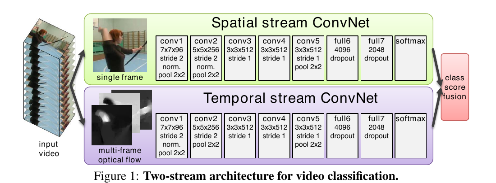
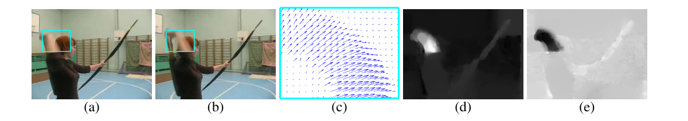
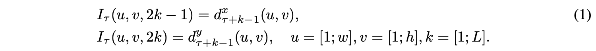
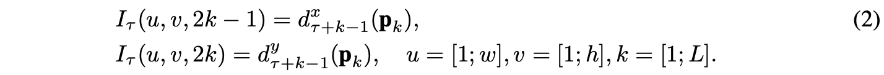
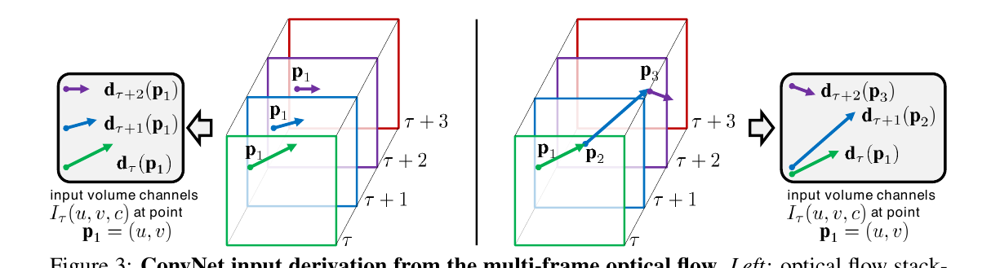
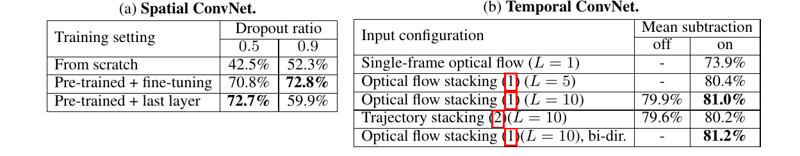
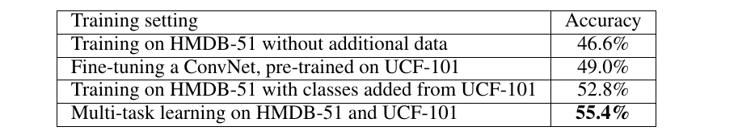
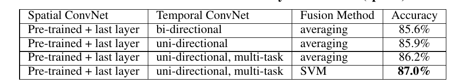
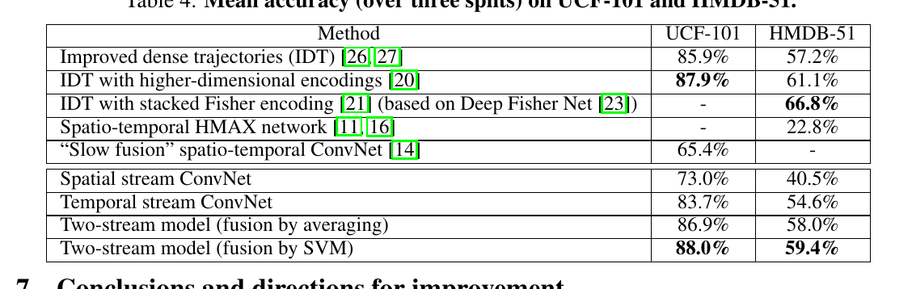

# Two-Stream Convolutional Networks for Action Recognition in Videos

> Karen Simonyan.    Andrew Zisserman
>
> Visual Geometry Group, University of Oxford

## 摘要

我们研究了用于视频动作识别的判别训练深度卷积网络 (ConvNets) 的架构。挑战是从静止帧和帧之间的运动中捕获关于外观的互补信息。我们还旨在在数据驱动的学习框架中概括表现最好的手工的特征。

> We investigate architectures of discriminatively trained deep Convolutional Net- works (ConvNets) for action recognition in video. The challenge is to capture the complementary information on appearance from still frames and motion be- tween frames. We also aim to generalise the best performing hand-crafted features within a data-driven learning framework.

我们的贡献是三个方面。首先，我们提出了一种包含空间和时间网络的双流 ConvNet 架构。其次，我们证明了在多帧密集光流上训练的 ConvNet 能够在训练数据有限的情况下实现非常好的性能。最后，我们展示了应用于两个不同动作分类数据集的多任务学习，可用于增加训练数据量并提高两者的性能。我们的架构在 UCF-101 和 HMDB-51 的标准视频动作基准上进行了训练和评估，与最先进的技术相比具有竞争力。它也大大超过了以前使用深度网络进行视频分类的尝试。

> Our contribution is three-fold. First, we propose a two-stream ConvNet architec- ture which incorporates spatial and temporal networks. Second, we demonstrate that a ConvNet trained on multi-frame dense optical flow is able to achieve very good performance in spite of limited training data. Finally, we show that multi- task learning, applied to two different action classification datasets, can be used to increase the amount of training data and improve the performance on both. Our architecture is trained and evaluated on the standard video actions benchmarks of UCF-101 and HMDB-51, where it is competitive with the state of the art. It also exceeds by a large margin previous attempts to use deep nets for video classifica- tion.

## 1 简介

>## 1 Introduction

识别视频中的人类行为是一项具有挑战性的任务，在研究界受到了极大的关注[11,14,17,26]。与静止图像分类相比，视频的时间分量为识别提供了额外的（也是重要的）线索，因为可以根据运动信息可靠地识别出许多动作。此外，视频为单个图像（视频帧）分类提供了自然的数据增强（抖动）。

>Recognition of human actions in videos is a challenging task which has received a significant amount of attention in the research community [11, 14, 17, 26]. Compared to still image classification, the temporal component of videos provides an additional (and important) clue for recognition, as a number of actions can be reliably recognised based on the motion information. Additionally, video provides natural data augmentation (jittering) for single image (video frame) classification.

在这项工作中，我们旨在将深度卷积网络（ConvNets）[19]（一种最先进的静止图像表示 [15]）扩展到视频数据中的动作识别。这项任务最近在 [14] 中通过使用堆叠的视频帧作为网络的输入来解决，但结果比最好的手工制作的浅层表示 [20, 26] 的结果要差得多。我们基于两个独立的识别流（空间和时间）研究不同的架构，然后通过后期融合将它们组合起来。空间流从静止视频帧中执行动作识别，而时间流被训练以从密集光流形式的运动中识别动作。两个流都实现为 ConvNet。解耦空间和时间网络还允许我们通过在 ImageNet 挑战数据集 [1] 上预训练空间网络来利用大量注释图像数据的可用性。我们提出的架构与双流假设[9]相关，根据该假设，人类视觉皮层包含两条通路：腹侧流（执行物体识别）和背侧流（识别运动）；尽管我们在这里没有进一步研究这种联系。

>In this work, we aim at extending deep Convolutional Networks (ConvNets) [19], a state-of-the- art still image representation [15], to action recognition in video data. This task has recently been addressed in [14] by using stacked video frames as input to the network, but the results were signif- icantly worse than those of the best hand-crafted shallow representations [20, 26]. We investigate a different architecture based on two separate recognition streams (spatial and temporal), which are then combined by late fusion. The spatial stream performs action recognition from still video frames, whilst the temporal stream is trained to recognise action from motion in the form of dense optical flow. Both streams are implemented as ConvNets. Decoupling the spatial and temporal nets also allows us to exploit the availability of large amounts of annotated image data by pre-training the spatial net on the ImageNet challenge dataset [1]. Our proposed architecture is related to the two-streams hypothesis [9], according to which the human visual cortex contains two pathways: the ventral stream (which performs object recognition) and the dorsal stream (which recognises motion); though we do not investigate this connection any further here.

本文的其余部分安排如下。 1.1 节我们回顾了使用浅层和深层架构进行动作识别的相关工作。第2部分中我们介绍了双流架构并指定了Spatial ConvNet。第 3 节介绍了 Temporal ConvNet，特别是它如何推广1.1节中回顾的先前架构。第4部分开发了一个多任务学习框架。 为了允许在多个数据集上轻松组合训练数据。实施细节在第 5 节中给出。 性能在第6部分中进行评估，并与现有技术相比。我们在两个具有挑战性的数据集（UCF-101 [24] 和 HMDB-51 [16]）上的实验表明，这两个识别流是互补的，我们的深度架构显着优于 [14]，并且与最先进的浅层表示 [20,21,26]技术能够竞争，尽管在相对较小的数据集上进行了训练。

>The rest of the paper is organised as follows. In Sect. 1.1 we review the related work on action recognition using both shallow and deep architectures. In Sect. 2 we introduce the two-stream architecture and specify the Spatial ConvNet. Sect. 3 introduces the Temporal ConvNet and in particular how it generalizes the previous architectures reviewed in Sect. 1.1. A mult-task learning framework is developed in Sect. 4 in order to allow effortless combination of training data over multiple datasets. Implementation details are given in Sect. 5, and the performance is evaluated in Sect. 6 and compared to the state of the art. Our experiments on two challenging datasets (UCF- 101 [24] and HMDB-51 [16]) show that the two recognition streams are complementary, and our deep architecture significantly outperforms that of [14] and is competitive with the state of the art shallow representations [20, 21, 26] in spite of being trained on relatively small datasets.

### 1.1 相关工作

>### 1.1 Related work

视频识别研究很大程度上是由图像识别方法的进步推动的，这些方法经常被改编和扩展以处理视频数据。一大类视频动作识别方法基于局部时空特征的浅层高维编码。例如，[17] 的算法包括检测稀疏时空兴趣点，然后使用局部时空特征进行描述：定向梯度直方图 (HOG) [7] 和光流直方图 (HOF)。然后将这些特征编码为特征袋（BoF）表示，该表示在几个时空网格（类似于空间金字塔池）上pooling，并与 SVM 分类器相结合。在后来的工作 [28] 中，表明局部特征的密集采样优于稀疏兴趣点。

>Video recognition research has been largely driven by the advances in image recognition methods, which were often adapted and extended to deal with video data. A large family of video action recognition methods is based on shallow high-dimensional encodings of local spatio-temporal fea- tures. For instance, the algorithm of [17] consists in detecting sparse spatio-temporal interest points, which are then described using local spatio-temporal features: Histogram of Oriented Gradients (HOG) [7] and Histogram of Optical Flow (HOF). The features are then encoded into the Bag Of Features (BoF) representation, which is pooled over several spatio-temporal grids (similarly to spa- tial pyramid pooling) and combined with an SVM classifier. In a later work [28], it was shown that dense sampling of local features outperforms sparse interest points.

最先进的浅层视频表示[20,21,26]不是在时空长方体上计算局部视频特征，而是利用密集点轨迹。该方法首先在 [29] 中引入，包括调整局部描述符支持区域，以便它们遵循使用光流计算的密集轨迹。基于轨迹的pipeline中的最佳性能是通过运动边界直方图 (MBH) [8] 实现的，这是一种基于梯度的特征，分别在光流的水平和垂直分量上计算。几个特征的组合被证明可以进一步提高准确性。最近对基于轨迹的手工表示的改进包括全局（相机）运动补偿[10、16、26]，以及使用Fisher向量编码[22]（在[26]中）或其更深层次的变体[23] （在 [21] 中）。

>Instead of computing local video features over spatio-temporal cuboids, state-of-the-art shallow video representations [20, 21, 26] make use of dense point trajectories. The approach, first in- troduced in [29], consists in adjusting local descriptor support regions, so that they follow dense trajectories, computed using optical flow. The best performance in the trajectory-based pipeline was achieved by the Motion Boundary Histogram (MBH) [8], which is a gradient-based feature, separately computed on the horizontal and vertical components of optical flow. A combination of several features was shown to further boost the accuracy. Recent improvements of trajectory-based hand-crafted representations include compensation of global (camera) motion [10, 16, 26], and the use of the Fisher vector encoding [22] (in [26]) or its deeper variant [23] (in [21]).

也有许多尝试开发用于视频识别的深度架构。在大多数这些工作中，网络的输入是一堆连续的视频帧，因此该模型有望在第一层隐式学习时空运动相关特征，这可能是一项艰巨的任务。在 [11] 中，提出了一种用于视频识别的 HMAX 架构，在第一层具有预定义的时空过滤器。后来，它与空间 HMAX 模型结合 [16]，从而形成空间（腹侧）和时间（背侧）识别流。然而，与我们的工作不同，流是作为手工的且相当浅的（3 层）HMAX 模型实现的。在 [4, 18, 25] 中，卷积 RBM 和 ISA 用于时空特征的无监督学习，然后将其插入到动作分类的判别模型中。视频 ConvNet 的判别式端到端学习已在 [12] 以及最近的 [14] 中得到解决，他们比较了几种用于动作识别的 ConvNet 架构。训练是在一个非常大的 Sports-1M 数据集上进行的，其中包括 110 万个 YouTube 体育活动视频。有趣的是，[14] 发现在单个视频帧上运行的网络的性能与输入是帧堆栈的网络相似。这可能表明学习到的时空特征不能很好地捕捉运动。在 UCF-101 数据集上微调的学习表示比手工的最先进的基于轨迹的表示 [20, 27] 的准确率低 20%。

>There has also been a number of attempts to develop a deep architecture for video recognition. In the majority of these works, the input to the network is a stack of consecutive video frames, so the model is expected to implicitly learn spatio-temporal motion-dependent features in the first layers, which can be a difficult task. In [11], an HMAX architecture for video recognition was proposed with pre-defined spatio-temporal filters in the first layer. Later, it was combined [16] with a spatial HMAX model, thus forming spatial (ventral-like) and temporal (dorsal-like) recognition streams. Unlike our work, however, the streams were implemented as hand-crafted and rather shallow (3- layer) HMAX models. In [4, 18, 25], a convolutional RBM and ISA were used for unsupervised learning of spatio-temporal features, which were then plugged into a discriminative model for action classification. Discriminative end-to-end learning of video ConvNets has been addressed in [12] and, more recently, in [14], who compared several ConvNet architectures for action recognition. Training was carried out on a very large Sports-1M dataset, comprising 1.1M YouTube videos of sports activities. Interestingly, [14] found that a network, operating on individual video frames, performs similarly to the networks, whose input is a stack of frames. This might indicate that the learnt spatio-temporal features do not capture the motion well. The learnt representation, fine- tuned on the UCF-101 dataset, turned out to be 20% less accurate than hand-crafted state-of-the-art trajectory-based representation [20, 27].

我们的时间流 ConvNet 在多帧密集光流上运行，通常通过求解位移场（通常在多个图像尺度上）在能量最小化框架中计算。我们使用了[2] 中的一种流行方法，该方法基于强度及其梯度的恒定假设以及位移场的平滑度来制定能量。最近，[30] 提出了一种图像 patch 匹配方案，它让人联想到深度卷积网络，但不包含学习。

>Our temporal stream ConvNet operates on multiple-frame dense optical flow, which is typically computed in an energy minimisation framework by solving for a displacement field (typically at multiple image scales). We used a popular method of [2], which formulates the energy based on constancy assumptions for intensity and its gradient, as well as smoothness of the displacement field. Recently, [30] proposed an image patch matching scheme, which is reminiscent of deep ConvNets, but does not incorporate learning.

## 2 用于视频识别的双流架构

>## 2 Two-stream architecture for video recognition

视频可以自然地分解为空间和时间分量。空间部分，以单个帧外观的形式，携带有关视频中描绘的场景和对象的信息。时间部分以跨帧运动的形式传达观察者（相机）和对象的运动。我们相应地设计了我们的视频识别架构，将其分为两个流，如图 1 所示。每个流都是使用深度 ConvNet 实现的，其 softmax 分数通过后期融合进行组合。我们考虑了两种融合方法：在堆叠的 L2 归一化 softmax 分数上平均和训练多类线性 SVM [6] 作为特征。

>Video can naturally be decomposed into spatial and temporal components. The spatial part, in the form of individual frame appearance, carries information about scenes and objects depicted in the video. The temporal part, in the form of motion across the frames, conveys the movement of the observer (the camera) and the objects. We devise our video recognition architecture accordingly, dividing it into two streams, as shown in Fig. 1. Each stream is implemented using a deep ConvNet, softmax scores of which are combined by late fusion. We consider two fusion methods: averaging and training a multi-class linear SVM [6] on stacked L2-normalised softmax scores as features.

**空间流 ConvNet** 对单个视频帧进行操作，有效地从静止图像中执行动作识别。静态外观本身就是一个有用的线索，因为某些动作与特定对象密切相关。事实上，正如将在第6部分中展示的那样，静止帧（空间识别流）的动作分类本身就具有相当的竞争力。由于空间卷积网络本质上是一种图像分类架构，我们可以在大规模图像识别方法 [15] 的最新进展的基础上，在大型图像分类数据集（例如 ImageNet 挑战数据集）上预训练网络。详细信息在第 5节中介绍。 接下来，我们描述时间流 ConvNet，它利用运动并显着提高准确性。

>**Spatial stream ConvNet** operates on individual video frames, effectively performing action recog- nition from still images. The static appearance by itself is a useful clue, since some actions are strongly associated with particular objects. In fact, as will be shown in Sect. 6, action classification from still frames (the spatial recognition stream) is fairly competitive on its own. Since a spatial ConvNet is essentially an image classification architecture, we can build upon the recent advances in large-scale image recognition methods [15], and pre-train the network on a large image classifica- tion dataset, such as the ImageNet challenge dataset. The details are presented in Sect. 5. Next, we describe the temporal stream ConvNet, which exploits motion and significantly improves accuracy.

## 3 光流卷积网络

>## 3 Optical flow ConvNets

在本节中，我们描述了一个 ConvNet 模型，它形成了我们架构的时间识别流（第 2 节）。与在 1.1节 中进行了回顾的 ConvNet 模型不同，我们模型的输入是通过在几个连续帧之间堆叠光流位移场形成的。这样的输入明确地描述了视频帧之间的运动，这使得识别更容易，因为网络不需要隐式估计运动。我们考虑了基于光流的输入的几种变体，我们将在下面进行描述。

>In this section, we describe a ConvNet model, which forms the temporal recognition stream of our architecture (Sect. 2). Unlike the ConvNet models, reviewed in Sect. 1.1, the input to our model is formed by stacking optical flow displacement fields between several consecutive frames. Such input explicitly describes the motion between video frames, which makes the recognition easier, as the network does not need to estimate motion implicitly. We consider several variations of the optical flow-based input, which we describe below.

图 2：**光流**（a），（b）：一对连续的视频帧，其中一个移动的手周围的区域用青色矩形勾勒出来(c)：轮廓区域内密集光流的特写； (d)：位移矢量场的水平分量 

（较高的强度对应于正值，较低的强度对应于负值）(e)：垂直分量

。注意（d）和（e）如何突出移动的手和弓。 ConvNet 的输入包含多个流（第 3.1 节）。

>Figure 2: Optical flow. (a),(b): a pair of consecutive video frames with the area around a mov- ing hand outlined with a cyan rectangle. (c): a close-up of dense optical flow in the outlined area; (d): horizontal component dx of the displacement vector field (higher intensity corresponds to pos- itive values, lower intensity to negative values). (e): vertical component dy. Note how (d) and (e) highlight the moving hand and bow. The input to a ConvNet contains multiple flows (Sect. 3.1).

### 3.1 ConvNet 输入配置

>### 3.1 ConvNet input configurations

**光流堆叠**。密集的光流可以看作是连续帧 t 和 t + 1 对之间的一组位移矢量场 

。我们用 
)
表示帧 t 中点 (u, v) 处的位移矢量，它将点移动到下一帧 t + 1 中的对应点。向量场的水平和垂直分量 

 和 

 可以看作是图像通道（如图 2 所示），非常适合使用识别一个卷积网络。为了表示跨帧序列的运动，我们堆叠 L 个连续帧的流通道 

 以形成总共 2L 个输入通道。更正式地说，设 w 和 h 是视频的宽度和高度；任意帧 τ 的 ConvNet 输入体 

 构造如下：

>Optical flow stacking. A dense optical flow can be seen as a set of displacement vector fields dt between the pairs of consecutive frames t and t + 1. By dt(u, v) we denote the displacement vector at the point (u, v) in frame t, which moves the point to the corresponding point in the following frame t + 1. The horizontal and vertical components of the vector field, dxt and dyt, can be seen as image channels (shown in Fig. 2), well suited to recognition using a convolutional network. To represent the motion across a sequence of frames, we stack the flow channels dx,yt of L consecutive frames to form a total of 2L input channels. More formally, let w and h be the width and height of a video; a ConvNet input volume Iτ ∈ Rw×h×2L for an arbitrary frame τ is then constructed as follows:

对于任意点 (u, v)，通道
,%20c=[1%20;%202%20L])
 在 L 帧序列上对该点的运动进行编码（如图 3-左所示）。

>For an arbitrary point (u, v), the channels Iτ (u, v, c), c = [1; 2L] encode the motion at that point over a sequence of L frames (as illustrated in Fig. 3-left).

**轨迹堆叠**。受基于轨迹的描述符 [29] 的启发，另一种运动表示将在多个帧的相同位置采样的光流替换为沿运动轨迹采样的流。在这种情况下，对应于帧 τ 的输入体 

 采用以下形式：

>Trajectory stacking. An alternative motion representation, inspired by the trajectory-based de- scriptors [29], replaces the optical flow, sampled at the same locations across several frames, with the flow, sampled along the motion trajectories. In this case, the input volume Iτ , corresponding to a frame τ , takes the following form:

其中 

 是沿轨迹的第 k 个点，它从帧 τ 中的位置 (u, v) 开始，由以下递归关系定义：

>where pk is the k-th point along the trajectory, which starts at the location (u, v) in the frame τ and is defined by the following recurrence relation:

与输入体表示 (1) 相比，其中通道 
)
 存储位置 (u, v) 处的位移向量，输入体 (2) 存储在位置 

 处采样的向量沿轨迹（如图 3-右所示）。

>Compared to the input volume representation (1), where the channels Iτ (u, v, c) store the displace- ment vectors at the locations (u, v), the input volume (2) stores the vectors sampled at the locations pk along the trajectory (as illustrated in Fig. 3-right).

图 3：**来自多帧光流的 ConvNet 输入推导**。左：光流堆叠（1）在多帧中对同一位置的位移向量 d 进行采样。右图：轨迹堆叠 (2) 沿轨迹对向量进行采样。框架和相应的位移矢量以相同的颜色显示。

>Figure 3: ConvNet input derivation from the multi-frame optical flow. Left: optical flow stack- ing (1) samples the displacement vectors d at the same location in multiple frames. Right: trajectory stacking (2) samples the vectors along the trajectory. The frames and the corresponding displace- ment vectors are shown with the same colour.

**双向光流**。光流表示 (1) 和 (2) 处理前向光流，即帧 t 的位移场 

 指定其像素在下一帧 t + 1 中的位置。很自然地考虑扩展到 双向光流，可以通过计算一组额外的相反方向的位移场来获得。然后，我们通过堆叠帧 τ 和 τ +L/2 之间的 L/2 前向流与帧 τ - L/2 和 τ 之间的 L/2 后向流来构造输入体 

。因此，输入 

 具有与之前相同数量的通道 (2L)。可以使用两种方法（1）和（2）中的任何一种来表示流。

>Bi-directional optical flow. Optical flow representations (1) and (2) deal with the forward optical flow, i.e. the displacement field dt of the frame t specifies the location of its pixels in the following frame t + 1. It is natural to consider an extension to a bi-directional optical flow, which can be obtained by computing an additional set of displacement fields in the opposite direction. We then construct an input volume Iτ by stacking L/2 forward flows between frames τ and τ +L/2 and L/2 backward flows between frames τ − L/2 and τ . The input Iτ thus has the same number of channels (2L) as before. The flows can be represented using either of the two methods (1) and (2).

**平均流相减**。对网络输入执行零中心化通常是有益的，因为它允许模型更好地利用校正非线性。在我们的例子中，位移矢量场分量可以取正值和负值，并且自然居中，因为在多种运动中，一个方向的运动与相反方向的运动一样可能。然而，给定一对框架，它们之间的光流可以由特定的位移控制，例如相机移动引起的。相机运动补偿的重要性之前已在 [10, 26] 中强调过，其中估计了全局运动分量并从密集流中减去。在我们的例子中，我们考虑一种更简单的方法：从每个位移场 d 中减去它的平均向量。

>Mean flow subtraction. It is generally beneficial to perform zero-centering of the network input, as it allows the model to better exploit the rectification non-linearities. In our case, the displacement vector field components can take on both positive and negative values, and are naturally centered in the sense that across a large variety of motions, the movement in one direction is as probable as the movement in the opposite one. However, given a pair of frames, the optical flow between them can be dominated by a particular displacement, e.g. caused by the camera movement. The importance of camera motion compensation has been previously highlighted in [10, 26], where a global motion component was estimated and subtracted from the dense flow. In our case, we consider a simpler approach: from each displacement field d we subtract its mean vector.

**架构**。上面我们已经描述了将多个光流位移场组合成单个体 

的不同方法。考虑到 ConvNet 需要固定大小的输入，我们从

 中采样一个 224 × 224 × 2L 的子体，并将其作为输入传递给网络。隐藏层配置与空间网络中使用的配置基本相同，如图 1 所示。测试类似于空间 ConvNet，并在第5节中详细描述。

>Architecture. Above we have described different ways of combining multiple optical flow displace- ment fields into a single volume Iτ ∈ Rw×h×2L. Considering that a ConvNet requires a fixed-size input, we sample a 224 × 224 × 2L sub-volume from Iτ and pass it to the net as input. The hid- den layers configuration remains largely the same as that used in the spatial net, and is illustrated in Fig. 1. Testing is similar to the spatial ConvNet, and is described in detail in Sect. 5.

### 3.2 时间卷积网络架构与先前表示的关系

>### 3.2 Relation of the temporal ConvNet architecture to previous representations

在本节中，我们将我们的时间 ConvNet 架构置于现有技术的背景下，绘制与视频表示的连接，在 1.1节中进行了回顾。基于特征编码的方法 [17, 29] 通常结合几个时空局部特征。这些特征是从光流中计算出来的，因此可以被我们的时间卷积网络泛化。实际上，HOF 和 MBH 局部描述符基于光流方向或其梯度的直方图，可以使用单个卷积层（包含方向敏感滤波器）从位移场输入 (1) 中获得，然后是rectification层和pooling层[10] 的运动学特征（发散、卷曲和剪切）也是从光流梯度计算出来的，并且可以再次被我们的卷积模型捕获。最后，通过沿轨迹堆叠位移向量来计算轨迹特征[29]，这对应于轨迹堆叠（2）。在补充材料中，我们可视化了在时间网络的第一层学习的卷积滤波器。这提供了进一步的证据，证明我们的表示概括了手工制作的特征。

>In this section, we put our temporal ConvNet architecture in the context of prior art, drawing con- nections to the video representations, reviewed in Sect. 1.1. Methods based on feature encod- ings [17, 29] typically combine several spatio-temporal local features. Such features are computed from the optical flow and are thus generalised by our temporal ConvNet. Indeed, the HOF and MBH local descriptors are based on the histograms of orientations of optical flow or its gradient, which can be obtained from the displacement field input (1) using a single convolutional layer (containing orientation-sensitive filters), followed by the rectification and pooling layers. The kinematic features of [10] (divergence, curl and shear) are also computed from the optical flow gradient, and, again, can be captured by our convolutional model. Finally, the trajectory feature [29] is computed by stacking the displacement vectors along the trajectory, which corresponds to the trajectory stacking (2). In the supplementary material we visualise the convolutional filters, learnt in the first layer of the temporal network. This provides further evidence that our representation generalises hand-crafted features.

就深度网络而言，[16] 的双流视频分类架构包含两个 HMAX 模型，这些模型是手工制作的，比我们经过判别训练的 ConvNets 深度更小，可以看作是 HMAX 的可学习泛化[12, 14] 的卷积模型没有解耦空间和时间识别流，而是依赖于从数据中学习的运动敏感卷积滤波器。在我们的例子中，运动是使用光流位移场明确表示的，该位移场是基于强度恒定和流动平滑度的假设来计算的。将这些假设纳入 ConvNet 框架可能能够提高端到端基于 ConvNet 的方法的性能，并且是未来研究的一个有趣方向。

>As far as the deep networks are concerned, a two-stream video classification architecture of [16] contains two HMAX models which are hand-crafted and less deep than our discriminatively trained ConvNets, which can be seen as a learnable generalisation of HMAX. The convolutional models of [12, 14] do not decouple spatial and temporal recognition streams, and rely on the motion- sensitive convolutional filters, learnt from the data. In our case, motion is explicitly represented using the optical flow displacement field, computed based on the assumptions of constancy of the intensity and smoothness of the flow. Incorporating such assumptions into a ConvNet framework might be able to boost the performance of end-to-end ConvNet-based methods, and is an interesting direction for future research.

## 4 多任务学习

>## 4 Multi-task learning

与可以在大型静止图像分类数据集（例如 ImageNet）上进行预训练的空间流 ConvNet 不同，时间 ConvNet 需要在视频数据上进行训练——并且用于视频动作分类的可用数据集仍然相当小。在我们的实验（第 6 节）中，训练是在 UCF-101 和 HMDB-51 数据集上进行的，它们分别只有：9.5K 和 3.7K 视频。为了减少过度拟合，可以考虑将两个数据集合二为一；然而，由于类集之间的交集，这并不简单。一种选择（我们稍后会评估）是只添加类中的图像，这些图像不会出现在原始数据集中。然而，这需要手动搜索此类类别并限制额外训练数据的数量。

>Unlike the spatial stream ConvNet, which can be pre-trained on a large still image classification dataset (such as ImageNet), the temporal ConvNet needs to be trained on video data – and the available datasets for video action classification are still rather small. In our experiments (Sect. 6), training is performed on the UCF-101 and HMDB-51 datasets, which have only: 9.5K and 3.7K videos respectively. To decrease over-fitting, one could consider combining the two datasets into one; this, however, is not straightforward due to the intersection between the sets of classes. One option (which we evaluate later) is to only add the images from the classes, which do not appear in the original dataset. This, however, requires manual search for such classes and limits the amount of additional training data.

组合多个数据集的更原则性方法是基于多任务学习 [5]。其目的是学习（视频）表示，它不仅适用于相关任务（例如 HMDB-51 分类），还适用于其他任务（例如 UCF-101 分类）。附加任务充当正则化器，并允许利用附加训练数据。在我们的例子中，ConvNet 架构经过修改，使其在最后一个全连接层之上有两个 softmax 分类层：一个 softmax 层计算 HMDB-51 分类分数，另一个计算 UCF-101 分数。每个层都配备了自己的损失函数，该函数仅对来自各自数据集的视频进行操作。整体训练损失计算为各个任务损失的总和，并且可以通过反向传播找到网络权重导数。

>A more principled way of combining several datasets is based on multi-task learning [5]. Its aim is to learn a (video) representation, which is applicable not only to the task in question (such as HMDB-51 classification), but also to other tasks (e.g. UCF-101 classification). Additional tasks act as a regulariser, and allow for the exploitation of additional training data. In our case, a ConvNet architecture is modified so that it has two softmax classification layers on top of the last fully- connected layer: one softmax layer computes HMDB-51 classification scores, the other one – the UCF-101 scores. Each of the layers is equipped with its own loss function, which operates only on the videos, coming from the respective dataset. The overall training loss is computed as the sum of the individual tasks’ losses, and the network weight derivatives can be found by back-propagation.

## 5 实现细节

>## 5 Implementation details

**卷积网络配置**。我们的时空卷积网络的层配置如图 1 所示。它对应于 [3] 的 CNN-M-2048 架构，类似于 [31] 的网络。所有隐藏的权重层都使用校正（ReLU）激活函数；最大池化在 3 × 3 空间窗口上执行，步幅为 2；局部响应归一化使用与 [15] 相同的设置。空间和时间 ConvNet 配置之间的唯一区别是我们从后者中删除了第二个归一化层以减少内存消耗。

>ConvNets configuration. The layer configuration of our spatial and temporal ConvNets is schemat- ically shown in Fig. 1. It corresponds to CNN-M-2048 architecture of [3] and is similar to the network of [31]. All hidden weight layers use the rectification (ReLU) activation function; max- pooling is performed over 3 × 3 spatial windows with stride 2; local response normalisation uses the same settings as [15]. The only difference between spatial and temporal ConvNet configurations is that we removed the second normalisation layer from the latter to reduce memory consumption.

**训练**。训练过程可以看作是[15]对视频帧的适应，并且对于空间和时间网络通常是相同的。网络权重是使用带有动量（设置为 0.9）的 mini-batch 随机梯度下降来学习的。在每次迭代中，通过对 256 个训练视频（均匀地跨类）进行采样构建 256 个样本的 mini-batch，从每个训练视频中随机选择一个帧。在空间网络训练中，从所选帧中随机裁剪出一个 224 × 224 的子图像；然后它会经历随机水平翻转和 RGB 抖动。视频预先重新缩放，使帧的最小边等于 256。我们注意到，与 [15] 不同，子图像是从整个帧采样的，而不仅仅是它的 256 × 256 中心。在时间网络训练中，我们为选定的训练帧计算光流体 

，如第 3 节所述。  从那个体中，一个固定大小的 224 × 224 × 2L 输入被随机裁剪和翻转。学习率最初设置为 

，然后根据固定时间表降低，对于所有训练集保持相同。也就是说，从头开始训练 ConvNet 时，50K 次迭代后速率变为 

，70K 次迭代后变为

，80K 次迭代后停止训练。在 fine-tuning 场景中，14K 次迭代后速率变为 

，20K 次迭代后停止训练。

>Training. The training procedure can be seen as an adaptation of that of [15] to video frames, and is generally the same for both spatial and temporal nets. The network weights are learnt using the mini-batch stochastic gradient descent with momentum (set to 0.9). At each iteration, a mini-batch of 256 samples is constructed by sampling 256 training videos (uniformly across the classes), from each of which a single frame is randomly selected. In spatial net training, a 224 × 224 sub-image is randomly cropped from the selected frame; it then undergoes random horizontal flipping and RGB jittering. The videos are rescaled beforehand, so that the smallest side of the frame equals 256. We note that unlike [15], the sub-image is sampled from the whole frame, not just its 256 × 256 center. In the temporal net training, we compute an optical flow volume I for the selected training frame as described in Sect. 3. From that volume, a fixed-size 224 × 224 × 2L input is randomly cropped and flipped. The learning rate is initially set to 10−2, and then decreased according to a fixed schedule, which is kept the same for all training sets. Namely, when training a ConvNet from scratch, the rate is changed to 10−3 after 50K iterations, then to 10−4 after 70K iterations, and training is stopped after 80K iterations. In the fine-tuning scenario, the rate is changed to 10−3 after 14K iterations, and training stopped after 20K iterations.

**测试**。在测试时，给定一个视频，我们采样固定数量的帧（在我们的实验中为 25 个），它们之间的时间间隔相等。然后，我们通过裁剪和翻转帧的四个角和中心，从每个帧中获得 10 个 ConvNet 输入 [15]。然后通过对采样帧和裁剪中的分数进行平均来获得整个视频的类分数。

>Testing. At test time, given a video, we sample a fixed number of frames (25 in our experiments) with equal temporal spacing between them. From each of the frames we then obtain 10 ConvNet inputs [15] by cropping and flipping four corners and the center of the frame. The class scores for the whole video are then obtained by averaging the scores across the sampled frames and crops therein.

**ImageNet ILSVRC-2012 上的预训练**。在预训练空间卷积网络时，我们使用与上述相同的训练和测试数据增强（裁剪、翻转、RGB 抖动）。这在 ILSVRC-2012 验证集上产生了 13.5% 的 top-5 错误，这与 [31] 中报告的类似网络的 16.0% 相比是有利的。我们认为改进的主要原因是从整个图像中采样 ConvNet 输入，而不仅仅是其中心。

>Pre-training on ImageNet ILSVRC-2012. When pre-training the spatial ConvNet, we use the same training and test data augmentation as described above (cropping, flipping, RGB jittering). This yields 13.5% top-5 error on ILSVRC-2012 validation set, which compares favourably to 16.0% reported in [31] for a similar network. We believe that the main reason for the improvement is sampling of ConvNet inputs from the whole image, rather than just its center.

**多 GPU 训练**。我们的实现源自公开可用的 Caffe 工具包 [13]，但包含许多重要的修改，包括在单个系统中安装的多个 GPU 上的并行训练。我们利用数据并行性，并将每个 SGD batch 拆分到多个 GPU 上。在具有 4 个 NVIDIA Titan 卡的系统上训练单个时间 ConvNet 需要 1 天时间，这构成了单 GPU 训练的 3.2 倍加速。

>Multi-GPU training. Our implementation is derived from the publicly available Caffe toolbox [13], but contains a number of significant modifications, including parallel training on multiple GPUs installed in a single system. We exploit the data parallelism, and split each SGD batch across several GPUs. Training a single temporal ConvNet takes 1 day on a system with 4 NVIDIA Titan cards, which constitutes a 3.2 times speed-up over single-GPU training.

**光流**是使用 OpenCV 工具箱中 [2] 的现成 GPU 实现计算的。尽管计算时间很快（一对帧为 0.06 秒），但如果即时完成它仍然会引入瓶颈，因此我们在训练之前预先计算了流程。为了避免将位移场存储为浮点数，流的水平和垂直分量被线性重新缩放到 [0, 255] 范围并使用 JPEG 压缩（解压缩后，流重新缩放回其原始范围）。这将 UCF-101 数据集的流大小从 1.5TB 减少到 27GB。

>Optical flow is computed using the off-the-shelf GPU implementation of [2] from the OpenCV toolbox. In spite of the fast computation time (0.06s for a pair of frames), it would still introduce a bottleneck if done on-the-fly, so we pre-computed the flow before training. To avoid storing the displacement fields as floats, the horizontal and vertical components of the flow were linearly rescaled to a [0, 255] range and compressed using JPEG (after decompression, the flow is rescaled back to its original range). This reduced the flow size for the UCF-101 dataset from 1.5TB to 27GB.

## 6 评估

>## 6 Evaluation

**数据集和评估协议**。评估是在 UCF-101 [24] 和 HMDB-51 [16] 动作识别基准上进行的，它们是最大的可用注释视频数据集之一。 UCF-101 包含 13K 视频（平均 180 帧/视频），注释为 101 个动作类； HMDB-51 包含 51 个动作的 6.8K 视频。两个数据集的评估协议是相同的：组织者提供训练和测试数据的三个拆分，并且性能通过拆分的平均分类精度来衡量。每个 UCF-101 拆分包含 9.5K 训练视频； HMDB-51 拆分包含 3.7K 训练视频。我们首先在 UCF-101 数据集的第一次拆分上比较不同的架构。为了与最先进的技术进行比较，我们遵循标准评估协议并报告 UCF-101 和 HMDB-51 上三个分割的平均准确度。

>Datasets and evaluation protocol. The evaluation is performed on UCF-101 [24] and HMDB-51 [16] action recognition benchmarks, which are among the largest available annotated video datasets1. UCF-101 contains 13K videos (180 frames/video on average), annotated into 101 action classes; HMDB-51 includes 6.8K videos of 51 actions. The evaluation protocol is the same for both datasets: the organisers provide three splits into training and test data, and the performance is measured by the mean classification accuracy across the splits. Each UCF-101 split contains 9.5K training videos; an HMDB-51 split contains 3.7K training videos. We begin by comparing different architectures on the first split of the UCF-101 dataset. For comparison with the state of the art, we follow the standard evaluation protocol and report the average accuracy over three splits on both UCF-101 and HMDB-51.

**空间卷积网络**。首先，我们测量空间流 ConvNet 的性能。考虑了三个场景：(i) 在 UCF-101 上从头开始训练，(ii) 在 ILSVRC-2012 上进行预训练，然后在 UCF-101 上进行 fine-tuning，(iii) 保持预训练网络固定且仅训练最后（分类）层。对于每个设置，我们尝试将 dropout 正则化比率设置为 0.5 或 0.9。从表 1a 所示的结果可以看出，仅在 UCF-101 数据集上训练 ConvNet 会导致过度拟合（即使存在高 dropout），并且不如在大型 ILSVRC-2012 数据集上进行预训练。有趣的是，fine-tuning 整个网络仅比仅训练最后一层提供了边际改进。在后一种情况下，较高的 dropout 会使学习过度规范化并导致更差的准确性。在以下实验中，我们选择在预训练的 ConvNet 之上训练最后一层。

>Spatial ConvNets. First, we measure the performance of the spatial stream ConvNet. Three sce- narios are considered: (i) training from scratch on UCF-101, (ii) pre-training on ILSVRC-2012 followed by fine-tuning on UCF-101, (iii) keeping the pre-trained network fixed and only training the last (classification) layer. For each of the settings, we experiment with setting the dropout regu- larisation ratio to 0.5 or to 0.9. From the results, presented in Table 1a, it is clear that training the ConvNet solely on the UCF-101 dataset leads to over-fitting (even with high dropout), and is inferior to pre-training on a large ILSVRC-2012 dataset. Interestingly, fine-tuning the whole network gives only marginal improvement over training the last layer only. In the latter setting, higher dropout over-regularises learning and leads to worse accuracy. In the following experiments we opted for training the last layer on top of a pre-trained ConvNet.

**时间卷积网络**。在评估了空间 ConvNet 变体之后，我们现在转向时间 ConvNet 架构，并评估输入配置的效果，如第 3.1 节所述。特别是，我们测量了以下效果： 使用多个 (L = {5, 10}) 堆叠光流；轨迹堆叠；平均位移相减；使用双向光流。这些架构是在 UCF-101 数据集上从头开始训练的，因此我们使用了 0.9 的激进 dropout 比来帮助提高泛化能力。结果如表1b所示。首先，我们可以得出结论，在输入中叠加多个（L > 1）位移场是非常有益的，因为它为网络提供了长期运动信息，这比一对帧之间的流动更具辨别力 (L = 1).

>Temporal ConvNets. Having evaluated spatial ConvNet variants, we now turn to the temporal ConvNet architectures, and assess the effect of the input configurations, described in Sect. 3.1. In particular, we measure the effect of: using multiple (L = {5, 10}) stacked optical flows; trajectory stacking; mean displacement subtraction; using the bi-directional optical flow. The architectures are trained on the UCF-101 dataset from scratch, so we used an aggressive dropout ratio of 0.9 to help improve generalisation. The results are shown in Table 1b. First, we can conclude that stacking multiple (L > 1) displacement fields in the input is highly beneficial, as it provides the network with long-term motion information, which is more discriminative than the flow between a pair of frames

> Table 1: Individual ConvNets accuracy on UCF-101 (split 1).

将输入流的数量从 5 增加到 10 会导致较小的改进，因此我们在接下来的实验中将 L 固定为 10。其次，我们发现平均相减是有帮助的，因为它减少了帧之间全局运动的影响。我们在以下实验中默认使用它。不同堆叠技术之间的差异是微不足道的；事实证明，光流堆叠比轨迹堆叠性能更好，并且使用双向光流仅比单向前向流好一点。最后，我们注意到时间卷积网络明显优于空间卷积网络（表 1a），这证实了运动信息对于动作识别的重要性。

> (L = 1 setting). Increasing the number of input flows from 5 to 10 leads to a smaller improvement, so we kept L fixed to 10 in the following experiments. Second, we find that mean subtraction is helpful, as it reduces the effect of global motion between the frames. We use it in the following experiments as default. The difference between different stacking techniques is marginal; it turns out that optical flow stacking performs better than trajectory stacking, and using the bi-directional optical flow is only slightly better than a uni-directional forward flow. Finally, we note that temporal ConvNets significantly outperform the spatial ConvNets (Table 1a), which confirms the importance of motion information for action recognition.

我们还实现了 [14] 的“慢融合”架构，这相当于将 ConvNet 应用于一堆 RGB 帧（在我们的例子中为 11 帧）。在 UCF-101 上从头开始训练时，它达到了 56.4% 的准确率，优于从头开始训练的单帧架构 (52.3%)，但与在光流上从头开始训练的网络仍有很大差距。这表明虽然多帧信息很重要，但以适当的方式将其呈现给 ConvNet 也很重要。

>We also implemented the “slow fusion” architecture of [14], which amounts to applying a ConvNet to a stack of RGB frames (11 frames in our case). When trained from scratch on UCF-101, it achieved 56.4% accuracy, which is better than a single-frame architecture trained from scratch (52.3%), but is still far off the network trained from scratch on optical flow. This shows that while multi-frame information is important, it is also important to present it to a ConvNet in an appropriate manner.

**时间卷积网络的多任务学习**。由于训练集的规模较小，在 UCF-101 上训练时间卷积网络具有挑战性。更大的挑战是在 HMDB-51 上训练 ConvNet，其中每个训练分割比 UCF-101 小 2.6 倍。在这里，我们评估了增加 HMDB-51 有效训练集大小的不同选项：（i）fine-tuning 在 UCF-101 上预训练的时间网络； (ii) 从 UCF-101 中添加 78 个类，这些类是手动选择的，因此这些类与原生 HMDB-51 类之间没有交叉； (iii) 使用多任务公式（第 4 节）来学习视频表示，在 UCF-101 和 HMDB-51 分类任务之间共享。结果如表 2 所示。正如预期的那样，它有利于

>Multi-task learning of temporal ConvNets. Training temporal ConvNets on UCF-101 is challeng- ing due to the small size of the training set. An even bigger challenge is to train the ConvNet on HMDB-51, where each training split is 2.6 times smaller than that of UCF-101. Here we evaluate different options for increasing the effective training set size of HMDB-51: (i) fine-tuning a temporal network pre-trained on UCF-101; (ii) adding 78 classes from UCF-101, which are manually selected so that there is no intersection between these classes and the native HMDB-51 classes; (iii) using the multi-task formulation (Sect. 4) to learn a video representation, shared between the UCF-101 and HMDB-51 classification tasks. The results are reported in Table 2. As expected, it is beneficial to

>Table 2: Temporal ConvNet accuracy on HMDB-51 (split 1 with additional training data).

利用完整（所有拆分组合）UCF-101 数据进行训练（通过借用图像显式或通过预训练隐式）。多任务学习表现最好，因为它允许训练过程利用所有可用的训练数据。

>utilise full (all splits combined) UCF-101 data for training (either explicitly by borrowing images, or implicitly by pre-training). Multi-task learning performs the best, as it allows the training procedure to exploit all available training data.

我们还在 UCF-101 数据集上尝试了多任务学习，通过训练网络对完整的 HMDB-51 数据（所有拆分组合）和 UCF-101 数据（单个拆分）进行分类。在 UCF-101 的第一次拆分中，准确度测量为 81.5%，比使用相同设置实现的 81.0% 有所提高，但没有额外的 HMDB 分类任务（表 1b）。

>We have also experimented with multi-task learning on the UCF-101 dataset, by training a network to classify both the full HMDB-51 data (all splits combined) and the UCF-101 data (a single split). On the first split of UCF-101, the accuracy was measured to be 81.5%, which improves on 81.0% achieved using the same settings, but without the additional HMDB classification task (Table 1b).

**双流卷积网络**。在这里，我们评估完整的双流模型，它结合了两个识别流。组合网络的一种方法是在两个网络的 full6 或 full7 层之上训练一个全连接层的联合堆栈。然而，由于过度拟合，这在我们的案例中是不可行的。因此，我们使用平均或线性 SVM 融合了 softmax 分数。从表 3 中我们得出结论：（i）时间和空间识别流是互补的，因为它们的融合在两者上都有显着提高（时间网络上 6%，空间网络上 14%）； (ii) 基于 SVM 的 softmax 分数融合通过平均优于融合； (iii) 在 ConvNet 融合的情况下，使用双向流是不利的； (iv) 使用多任务学习训练的时间卷积网络在单独和与空间网络融合时表现最好。

>Two-stream ConvNets. Here we evaluate the complete two-stream model, which combines the two recognition streams. One way of combining the networks would be to train a joint stack of fully-connected layers on top of full6 or full7 layers of the two nets. This, however, was not feasible in our case due to over-fitting. We therefore fused the softmax scores using either averaging or a linear SVM. From Table 3 we conclude that: (i) temporal and spatial recognition streams are complementary, as their fusion significantly improves on both (6% over temporal and 14% over spatial nets); (ii) SVM-based fusion of softmax scores outperforms fusion by averaging; (iii) using bi-directional flow is not beneficial in the case of ConvNet fusion; (iv) temporal ConvNet, trained using multi-task learning, performs the best both alone and when fused with a spatial net.

**与现有先进技术的比较**。我们通过比较 UCF-101 和 HMDB-51 的三个拆分上的最新技术来结束实验评估。为此，我们使用了在 ILSVRC 上进行预训练的空间网络，最后一层在 UCF 或 HMDB 上进行了训练。时间网络使用多任务学习在 UCF 和 HMDB 上进行训练，输入使用平均相减的单向光流堆叠计算。使用平均或 SVM 组合两个网络的 softmax 分数。从表 4 中可以看出，我们的空间和时间网络都大大优于 [14, 16] 的深层架构。两个网络的组合进一步改进了结果（与上面的单拆分实验一致），并且与最近最先进的手工模型[20、21、26]相当。

>Comparison with the state of the art. We conclude the experimental evaluation with the com- parison against the state of the art on three splits of UCF-101 and HMDB-51. For that we used a spatial net, pre-trained on ILSVRC, with the last layer trained on UCF or HMDB. The temporal net was trained on UCF and HMDB using multi-task learning, and the input was computed using uni-directional optical flow stacking with mean subtraction. The softmax scores of the two nets were combined using averaging or SVM. As can be seen from Table 4, both our spatial and temporal nets alone outperform the deep architectures of [14, 16] by a large margin. The combination of the two nets further improves the results (in line with the single-split experiments above), and is comparable to the very recent state-of-the-art hand-crafted models [20, 21, 26].

> Table 3: Two-stream ConvNet accuracy on UCF-101 (split 1).

>Table 4: Mean accuracy (over three splits) on UCF-101 and HMDB-51.

## 7 结论和改进方向

>## 7 Conclusions and directions for improvement

我们提出了一种具有竞争性能的深度视频分类模型，它结合了基于 ConvNets 的单独的空间和时间识别流。目前看来，在光流上训练时间卷积网络（如这里）明显优于在原始堆叠帧上训练 [14]。后者可能太具有挑战性，并且可能需要架构更改（例如，与 [30] 的深度匹配方法相结合）。尽管使用光流作为输入，我们的时间模型不需要大量的手工制作，因为流是使用基于恒定性和平滑性的一般假设的方法计算的。

>We proposed a deep video classification model with competitive performance, which incorporates separate spatial and temporal recognition streams based on ConvNets. Currently it appears that training a temporal ConvNet on optical flow (as here) is significantly better than training on raw stacked frames [14]. The latter is probably too challenging, and might require architectural changes (for example, a combination with the deep matching approach of [30]). Despite using optical flow as input, our temporal model does not require significant hand-crafting, since the flow is computed using a method based on the generic assumptions of constancy and smoothness.

正如我们所展示的，额外的训练数据对我们的时间卷积网络是有益的，因此我们计划在大型视频数据集上训练它，例如最近发布的 [14] 集。然而，由于训练数据量巨大（多个 TB），这本身就构成了重大挑战。

>As we have shown, extra training data is beneficial for our temporal ConvNet, so we are planning to train it on large video datasets, such as the recently released collection of [14]. This, however, poses a significant challenge on its own due to the gigantic amount of training data (multiple TBs).

最先进的浅层表示[26]仍然存在一些基本要素，这些要素在我们当前的架构中被遗漏了。最突出的一个是时空tubes上的局部特征pooling，以轨迹为中心。尽管输入 (2) 捕获了沿轨迹的光流，但我们网络中的空间池化并未考虑轨迹。另一个潜在的改进领域是对相机运动的显式处理，在我们的例子中是通过平均位移相减来补偿的。

>There still remain some essential ingredients of the state-of-the-art shallow representation [26], which are missed in our current architecture. The most prominent one is local feature pooling over spatio-temporal tubes, centered at the trajectories. Even though the input (2) captures the opti- cal flow along the trajectories, the spatial pooling in our network does not take the trajectories into account. Another potential area of improvement is explicit handling of camera motion, which in our case is compensated by mean displacement subtraction.

这项工作得到了 ERC 赠款 VisRec 228180 号的支持。我们非常感谢 NVIDIA 公司对用于这项研究的 GPU 的捐赠的支持。

>This work was supported by ERC grant VisRec no. 228180. We gratefully acknowledge the support of NVIDIA Corporation with the donation of the GPUs used for this research.
