# Aggregated Residual Transformations for Deep Neural Networks

> Saining Xie1 Ross Girshick2 Piotr Dolla ́r2 Zhuowen Tu1 Kaiming He2
>
> 1UC San Diego 2Facebook AI Research

## Abstract

我们提出了一个简单的、高度模块化的图像分类网络架构。我们的网络是通过重复一个构建块来构建的，该构建块聚合了一组具有相同拓扑的转换。我们简单的设计产生了一个同质的多分支架构，只需设置几个超参数。这个策略暴露了一个新的维度，我们称之为“基数(cardinality)”（转换集的大小），作为深度和宽度维度之外的一个重要因素。在 ImageNet-1K 数据集上，我们凭经验表明，即使在保持复杂性的限制条件下，增加基数也能够提高分类精度。此外，当我们增加容量时，增加基数比更深或更宽更有效。我们的模型名为 ResNeXt，是我们进入 ILSVRC 2016 分类任务的基础，在该任务中我们获得了第二名。我们在 ImageNet-5K 集和 COCO 检测集上进一步研究 ResNeXt，也显示出比 ResNet 更好的结果。代码和模型可在线公开获得。

> We present a simple, highly modularized network architecture for image classification. Our network is constructed by repeating a building block that aggregates a set of transformations with the same topology. Our simple design results in a homogeneous, multi-branch architecture that has only a few hyper-parameters to set. This strategy exposes a new dimension, which we call “cardinality” (the size of the set of transformations), as an essential factor in addition to the dimensions of depth and width. On the ImageNet-1K dataset, we empirically show that even under the restricted condition of maintaining complexity, increasing cardinality is able to improve classification accuracy. Moreover, increasing cardinality is more effective than going deeper or wider when we increase the capacity. Our models, named ResNeXt, are the foundations of our entry to the ILSVRC 2016 classification task in which we secured 2nd place. We further investigate ResNeXt on an ImageNet-5K set and the COCO detection set, also showing better results than its ResNet counterpart. The code and models are publicly available online1 .

## 1.Introduction

视觉识别研究正在经历从“特征工程”到“网络工程”的转变[25,24,44,34,36,38,14]。与传统的手工设计特征（例如，SIFT [29] 和 HOG [5]）相比，神经网络从大规模数据 [33] 中学习到的特征在训练过程中需要最少的人工参与，并且可以转移到各种识别任务中[7、10、28]。尽管如此，人类的努力已经转移到为学习表示设计更好的网络架构上。

> Research on visual recognition is undergoing a transition from “feature engineering” to “network engineering” [25, 24, 44, 34, 36, 38, 14]. In contrast to traditional handdesigned features (e.g., SIFT [29] and HOG [5]), features learned by neural networks from large-scale data [33] require minimal human involvement during training, and can be transferred to a variety of recognition tasks [7, 10, 28]. Nevertheless, human effort has been shifted to designing better network architectures for learning representations.

随着超参数（宽度、过滤器大小、步幅等）数量的增加，设计架构变得越来越困难，尤其是在有很多层的情况下。 VGG-nets [36] 展示了一种简单而有效的构建非常深网络的策略：堆叠构建-形状相同的块。该策略由 ResNets [14] 继承，它堆叠相同拓扑的模块。这个简单的规则减少了超参数的自由选择，深度被暴露为神经网络中的一个基本维度。此外，我们认为该规则的简单性可以降低将超参数过度适应特定数据集的风险。 VGGnets 和 ResNets 的鲁棒性已通过各种视觉识别任务 [7, 10, 9, 28, 31, 14] 以及涉及语音 [42, 30] 和语言 [4, 41, 20] 的非视觉任务得到证明。

>Designing architectures becomes increasingly difficult with the growing number of hyper-parameters (width2 , filter sizes, strides, etc.), especially when there are many layers. The VGG-nets [36] exhibit a simple yet effective strategy of constructing very deep networks: stacking build- ing blocks of the same shape. This strategy is inherited by ResNets [14] which stack modules of the same topology. This simple rule reduces the free choices of hyperparameters, and depth is exposed as an essential dimension in neural networks. Moreover, we argue that the simplicity of this rule may reduce the risk of over-adapting the hyperparameters to a specific dataset. The robustness of VGGnets and ResNets has been proven by various visual recognition tasks [7, 10, 9, 28, 31, 14] and by non-visual tasks involving speech [42, 30] and language [4, 41, 20].

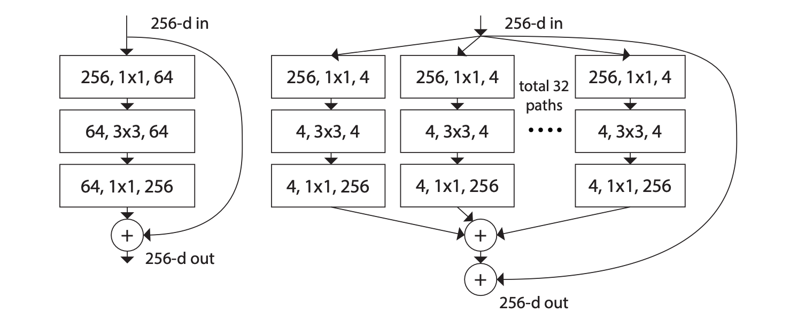

图 1. 左：ResNet [14] 块。右图：基数 = 32 的 ResNeXt 块，复杂度大致相同。每一层显示为 (# 输入通道数, 核大小, # 输出通道数).

>Figure 1. Left: A block of ResNet [14]. Right: A block of ResNeXt with cardinality = 32, with roughly the same complexity. A layer is shown as (# in channels, filter size, # out channels ).

与 VGG 网络不同，Inception 模型系列 [38、17、39、37] 已经证明，精心设计的拓扑能够以较低的理论复杂度实现令人信服的精度。 Inception 模型随着时间的推移而发展 [38, 39]，但一个重要的共同属性是拆分-转换-合并策略。在 Inception 模块中，输入被分成几个低维嵌入（通过 1×1 卷积），由一组专门的过滤器（3×3、5×5 等）进行转换，并通过连接合并。可以看出，该架构的解空间是在高维嵌入上运行的单个大层（例如，5×5）的解空间的严格子空间。预计 Inception 模块的拆分-变换-合并行为将接近大型和密集层的表示能力，但计算复杂度要低得多。

>Unlike VGG-nets, the family of Inception models [38, 17, 39, 37] have demonstrated that carefully designed topologies are able to achieve compelling accuracy with low theoretical complexity. The Inception models have evolved over time [38, 39], but an important common property is a split-transform-merge strategy. In an Inception module, the input is split into a few lower-dimensional embeddings (by 1×1 convolutions), transformed by a set of specialized filters (3×3, 5×5, etc.), and merged by concatenation. It can be shown that the solution space of this architecture is a strict subspace of the solution space of a single large layer (e.g., 5×5) operating on a high-dimensional embedding. The split-transform-merge behavior of Inception modules is expected to approach the representational power of large and dense layers, but at a considerably lower computational complexity.

尽管有很好的准确性，但在实现Inception模式的同时，也出现了一系列复杂的因素——过滤器的数量和尺寸是为每个单独的转换量身定制的，并且模块是逐级定制的。尽管这些组件的仔细组合产生了出色的神经网络配置，但通常不清楚如何使 Inception 架构适应新的数据集/任务，尤其是当需要设计许多因素和超参数时。

>Despite good accuracy, the realization of Inception mod- els has been accompanied with a series of complicating fac-tors — the filter numbers and sizes are tailored for each individual transformation, and the modules are customized stage-by-stage. Although careful combinations of these components yield excellent neural network recipes, it is in general unclear how to adapt the Inception architectures to new datasets/tasks, especially when there are many factors and hyper-parameters to be designed.

在本文中，我们提出了一个简单的架构，它采用了 VGG/ResNets 的重复层策略，同时以一种简单、可扩展的方式利用了拆分-变换-合并策略。我们网络中的一个模块执行一组转换，每个转换都在一个低维嵌入上，其输出通过求和聚合。我们追求这个想法的简单实现——要聚合的变换都是相同的拓扑结构（例如，图 1（右））。这种设计允许我们在没有专门设计的情况下扩展到任何大量的转换。

>In this paper, we present a simple architecture which adopts VGG/ResNets’ strategy of repeating layers, while exploiting the split-transform-merge strategy in an easy, extensible way. A module in our network performs a set of transformations, each on a low-dimensional embedding, whose outputs are aggregated by summation. We pursuit a simple realization of this idea — the transformations to be aggregated are all of the same topology (e.g., Fig. 1 (right)). This design allows us to extend to any large number of transformations without specialized designs.

有趣的是，在这种简化的情况下，我们表明我们的模型还有另外两种等价形式（图 3）。图 3(b) 中的重新表述与 InceptionResNet 模块 [37] 相似，因为它连接了多个路径；但是我们的模块与所有现有的 Inception 模块的不同之处在于我们所有的路径共享相同的拓扑，因此可以轻松地将路径的数量隔离为要研究的因素。在更简洁的重新表述中，我们的模块可以通过 Krizhevsky 等人的分组卷积 [24]（图 3（c））重新塑造，然而，它已被开发为一种工程折衷方案。

>Interestingly, under this simplified situation we show that our model has two other equivalent forms (Fig. 3). The reformulation in Fig. 3(b) appears similar to the InceptionResNet module [37] in that it concatenates multiple paths; but our module differs from all existing Inception modules in that all our paths share the same topology and thus the number of paths can be easily isolated as a factor to be investigated. In a more succinct reformulation, our module can be reshaped by Krizhevsky et al.’s grouped convolutions [24] (Fig. 3(c)), which, however, had been developed as an engineering compromise.

我们凭经验证明，我们的聚合转换优于原始 ResNet 模块，即使在保持计算复杂性和模型大小的限制条件下——例如，图 1（右）旨在保持图 1 的 FLOP 复杂性和参数数量（左）。我们强调，虽然通过增加容量（更深或更宽）来提高准确性相对容易，但在文献中很少使用在保持（或降低）复杂性的同时提高准确性的方法。

>We empirically demonstrate that our aggregated transformations outperform the original ResNet module, even under the restricted condition of maintaining computational complexity and model size — e.g., Fig. 1(right) is designed to keep the FLOPs complexity and number of parameters of Fig. 1(left). We emphasize that while it is relatively easy to increase accuracy by increasing capacity (going deeper or wider), methods that increase accuracy while maintaining (or reducing) complexity are rare in the literature.

我们的方法表明，除了宽度和深度的维度之外，基数（变换集的大小）是一个具体的、可测量的维度，它具有核心重要性。实验表明，增加基数是获得准确性的一种更有效的方法，而不是更深或更宽，特别是当深度和宽度开始为现有模型带来递减收益时。

>Our method indicates that cardinality (the size of the set of transformations) is a concrete, measurable dimension that is of central importance, in addition to the dimensions of width and depth. Experiments demonstrate that increasing cardinality is a more effective way of gaining accuracy than going deeper or wider, especially when depth and width starts to give diminishing returns for existing model 。

我们的神经网络名为 ResNeXt（建议下一个（next）维度），在 ImageNet 分类数据集上优于 ResNet-101/152 [14]、ResNet200 [15]、Inception-v3 [39] 和 Inception-ResNet-v2 [37]。特别是，101 层的 ResNeXt 能够达到比 ResNet-200 [15] 更好的准确度，但复杂度只有 50%。此外，ResNeXt 的设计比所有 Inception 模型都简单得多。 ResNeXt 是我们提交给 ILSVRC 2016 分类任务的基础，在比赛中我们获得了第二名。本文进一步在更大的 ImageNet-5K 集和 COCO 对象检测数据集 [27] 上评估 ResNeXt，显示出始终比 ResNet 同类产品更好的准确性。我们希望 ResNeXt 也能很好地推广到其他视觉（和非视觉）识别任务。

>Our neural networks, named ResNeXt (suggesting the next dimension), outperform ResNet-101/152 [14], ResNet200 [15], Inception-v3 [39], and Inception-ResNet-v2 [37] on the ImageNet classification dataset. In particular, a 101-layer ResNeXt is able to achieve better accuracy than ResNet-200 [15] but has only 50% complexity. Moreover, ResNeXt exhibits considerably simpler designs than all Inception models. ResNeXt was the foundation of our submission to the ILSVRC 2016 classification task, in which we secured second place. This paper further evaluates ResNeXt on a larger ImageNet-5K set and the COCO object detection dataset [27], showing consistently better accuracy than its ResNet counterparts. We expect that ResNeXt will also generalize well to other visual (and non-visual) recognition tasks.

## 2.Related Work

**多分支卷积网络**。 Inception 模型 [38, 17, 39, 37] 是成功的多分支架构，其中每个分支都经过精心定制。 ResNets [14] 可以被认为是两个分支网络，其中一个分支是恒等映射。深度神经决策森林 [22] 是具有学习分裂功能的树型多分支网络。

> **Multi-branch convolutional networks.** The Inception models [38, 17, 39, 37] are successful multi-branch architectures where each branch is carefully customized. ResNets [14] can be thought of as two-branch networks where one branch is the identity mapping. Deep neural decision forests [22] are tree-patterned multi-branch networks with learned splitting functions.

**分组卷积**。分组卷积的使用可以追溯到 AlexNet 论文 [24]，如果不是更早的话。 Krizhevsky 等人给出的动机[24]是用于将模型分布在两个 GPU 上。 Caffe [19]、Torch [3] 和其他库支持分组卷积，主要是为了与 AlexNet 兼容。据我们所知，几乎没有证据表明利用分组卷积来提高准确性。分组卷积的一个特殊情况是通道卷积，其中组数等于通道数。通道卷积是 [35] 中可分离卷积的一部分

>**Grouped convolutions.** The use of grouped convolutions dates back to the AlexNet paper [24], if not earlier. The motivation given by Krizhevsky et al. [24] is for distributing the model over two GPUs. Grouped convolutions are supported by Caffe [19], Torch [3], and other libraries, mainly for compatibility of AlexNet. To the best of our knowledge, there has been little evidence on exploiting grouped convolutions to improve accuracy. A special case of grouped convolutions is channel-wise convolutions in which the number of groups is equal to the number of channels. Channel-wise convolutions are part of the separable convolutions in[35]

**压缩卷积网络**。分解（在空间 [6, 18] 和/或通道 [6, 21, 16] 级别）是一种广泛采用的技术，用于减少深度卷积网络的冗余并加速/压缩它们。约安努等人 [16] 提出了一个“根”模式的网络来减少计算，根中的分支是通过分组卷积实现的。这些方法 [6, 18, 21, 16] 已经显示出准确度的优雅折衷，具有较低的复杂性和较小的模型尺寸。我们的方法不是压缩，而是一种在经验上显示出更强表示能力的架构。

>**Compressing convolutional networks**. Decomposition (at spatial [6, 18] and/or channel [6, 21, 16] level) is a widely adopted technique to reduce redundancy of deep convolutional networks and accelerate/compress them. Ioannou et al. [16] present a “root”-patterned network for reducing computation, and branches in the root are realized by grouped convolutions. These methods [6, 18, 21, 16] have shown elegant compromise of accuracy with lower complexity and smaller model sizes. Instead of compression, our method is an architecture that empirically shows stronger representational power.

**集成**。对一组独立训练的网络进行平均是提高准确性的有效解决方案 [24]，在识别比赛中被广泛采用 [33]。维特等人[40] 将单个 ResNet 解释为较浅网络的集合，这是由 ResNet 的附加行为 [15] 产生的。我们的方法利用添加来聚合一组转换。但我们认为，将我们的方法视为集成是不精确的，因为要聚合的成员是联合训练的，而不是独立训练的。

>**Ensembling**. Averaging a set of independently trained networks is an effective solution to improving accuracy [24], widely adopted in recognition competitions [33]. Veit et al. [40] interpret a single ResNet as an ensemble of shallower networks, which results from ResNet’s additive behaviors [15]. Our method harnesses additions to aggregate a set of transformations. But we argue that it is imprecise to view our method as ensembling, because the members to be aggregated are trained jointly, not independently.

## 3. Method

### 3.1. Template

我们采用 VGG/ResNets 之后的高度模块化设计。我们的网络由一堆残差块组成。这些块具有相同的拓扑结构，并且受 VGG/ResNets 启发的两个简单规则的约束：（i）如果生成相同大小的空间图，则这些块共享相同的超参数（宽度和过滤器大小），以及（ii ) 每次将空间图下采样 2 倍时，块的宽度乘以 2 倍。第二条规则确保计算复杂度，以 FLOPs（浮点运算，#次乘加），对于所有块大致相同。

>We adopt a highly modularized design following VGG/ResNets. Our network consists of a stack of resid- ual blocks. These blocks have the same topology, and are subject to two simple rules inspired by VGG/ResNets: (i) if producing spatial maps of the same size, the blocks share the same hyper-parameters (width and filter sizes), and (ii) each time when the spatial map is downsampled by a factor of 2, the width of the blocks is multiplied by a factor of 2. The second rule ensures that the computational complexity, in terms of FLOPs (floating-point operations, in # of multiply-adds), is roughly the same for all blocks.

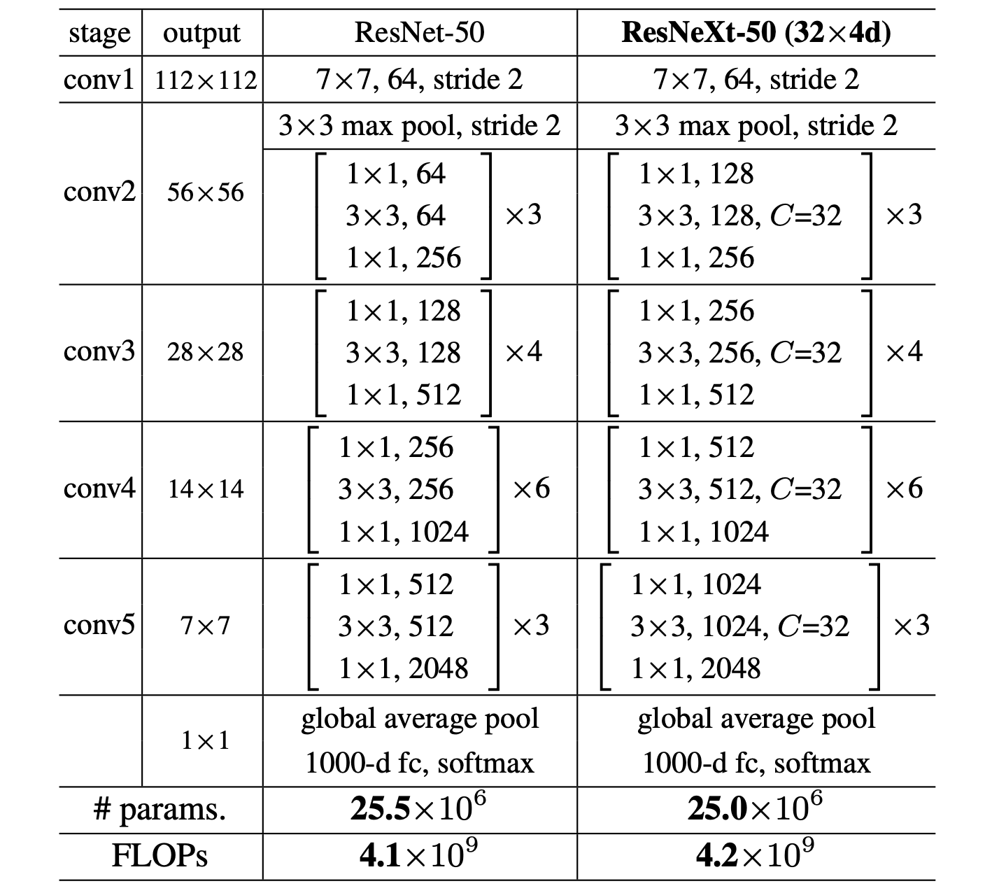

表 1.（左）ResNet-50（右）带有 32×4d 模板的 ResNeXt-50（使用图 3(c) 中的重新表述）。括号内是残差块的形状，括号外是阶段上堆叠的块数。 “C = 32”表示具有 32 个组的分组卷积 [24]。这两个模型的参数和 FLOP 数量相似。

>Table 1. (Left) ResNet-50. (Right) ResNeXt-50 with a 32×4d template (using the reformulation in Fig. 3(c)). Inside the brackets are the shape of a residual block, and outside the brackets is the number of stacked blocks on a stage. “C=32” suggests grouped convolutions [24] with 32 groups. The numbers of parameters and FLOPs are similar between these two models.

有了这两条规则，我们只需要设计一个模板模块，一个网络中的所有模块都可以据此确定。所以这两条规则极大地缩小了设计空间，让我们可以专注于几个关键因素。由这些规则构建的网络如表 1 所示。

>With these two rules, we only need to design a template module, and all modules in a network can be determined accordingly. So these two rules greatly narrow down the design space and allow us to focus on a few key factors. The networks constructed by these rules are in Table 1.

### 3.2. Revisiting Simple Neurons

人工神经网络中最简单的神经元执行内积（加权和），这是由全连接层和卷积层完成的基本变换。内积可以被认为是一种聚合转换的形式：

>The simplest neurons in artificial neural networks perform inner product (weighted sum), which is the elementary transformation done by fully-connected and convolutional layers. Inner product can be thought of as a form of aggregating transformation:

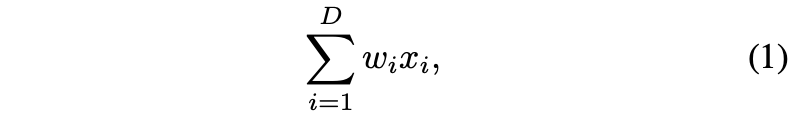

其中 

是神经元的 D 通道输入向量，

 是第 i 个通道的滤波器权重。这种操作（通常包括一些输出非线性性）被称作一个“神经元”，见表2.

>where x = [x1 , x2 , ..., xD ] is a D-channel input vector to the neuron and wi is a filter’s weight for the i-th chan- nel. This operation (usually including some output non- linearity) is referred to as a “neuron”. See Fig. 2.

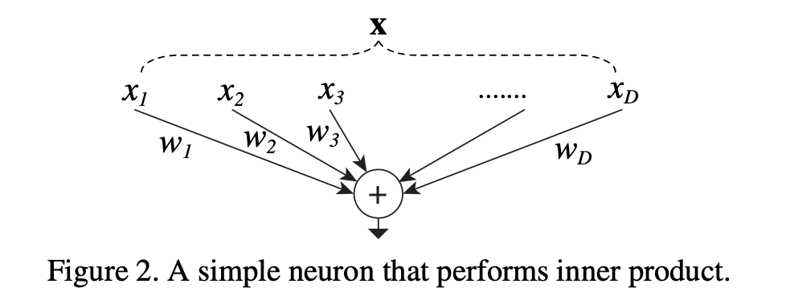

上述操作可以重构为拆分、转换和聚合的组合。(i) 拆分：向量 x 被切片为低维嵌入，在上面，它是一个单维子空间

。(ii) 变换：对低维表示进行变换，在上面，它只是简单地缩放：

。(iii) 聚合：所有嵌入中的转换由

 聚合。

>The above operation can be recast as a combination of splitting, transforming, and aggregating. (i) Splitting: the vector x is sliced as a low-dimensional embedding, and in the above, it is a single-dimension subspace x i. (ii) Transforming: the low-dimensional representation is transformed, and in the above, it is simply scaled: w ix i. (iii) Aggregating: the transformations in all embeddings are aggregated by 。

### 3.3. Aggregated Transformations

鉴于上述对简单神经元的分析，我们考虑将基本变换 (

) 替换为更通用的函数，该函数本身也可以是一个网络。与原来增加深度维度的“Network-in-Network”[26] 相比，我们表明我们的“Network-in-Neuron”沿着一个新维度扩展。形式上，我们将聚合转换表示为：

>Given the above analysis of a simple neuron, we consider replacing the elementary transformation (wi xi ) with a more generic function, which in itself can also be a network. In contrast to “Network-in-Network” [26] that turns out to increase the dimension of depth, we show that our “Network-in-Neuron” expands along a new dimension. Formally, we present aggregated transformations as:

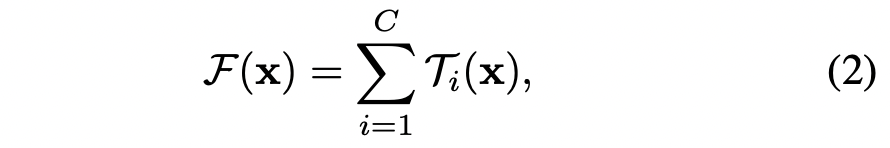

其中
)
可以是任意函数。类似于一个简单的神经元，

 应该将 x 投影到一个（可选的低维）嵌入中，然后对其进行转换。

>where T i(x) can be an arbitrary function. Analogous to a simple neuron, T ishould project x into an (optionally lowdimensional) embedding and then transform it.

在 Eqn.(2) 中，C 是要聚合的变换集的大小。我们将 C 称为基数（cardinality） [2]。在 Eqn.(2) 中，C 的位置类似于 Eqn.(1) 中的 D，但 C 不必等于 D，可以是任意数。虽然宽度的维度与简单转换（内积）的数量有关，但我们认为基数维度控制更复杂转换的数量。我们通过实验表明，基数是一个基本维度，并且比宽度和深度维度更有效。

>In Eqn.(2), C is the size of the set of transformations to be aggregated. We refer to C as cardinality [2]. In Eqn.(2) C is in a position similar to D in Eqn.(1), but C need not equal D and can be an arbitrary number. While the dimension of width is related to the number of simple transformations (inner product), we argue that the dimension of cardinality controls the number of more complex transformations. We show by experiments that cardinality is an essential dimension and can be more effective than the dimensions of width and depth.

在本文中，我们考虑了一种设计变换函数的简单方法：所有

具有相同的拓扑。这扩展了 VGG 风格的重复相同形状层的策略，这有助于隔离一些因素并扩展到任何大量的转换。我们将单个变换 

设置为瓶颈型架构 [14]，如图 1（右）所示。在这种情况下，每个

中的第一个 1×1 层产生低维嵌入。

>In this paper, we consider a simple way of designing the transformation functions: all T i’s have the same topology. This extends the VGG-style strategy of repeating layers of the same shape, which is helpful for isolating a few factors and extending to any large number of transformations. We set the individual transformation T ito be the bottleneckshaped architecture [14], as illustrated in Fig. 1 (right). In this case, the first 1×1 layer in each T iproduces the lowdimensional embedding.

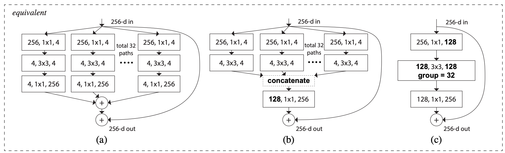

图3. ResNeXt的等效块。（a）: 聚合的残差转换，与图1右侧相同。(b): 相当于(a)的模块，以早期串联的方式实现。(c): 相当于(a,b)的一个块，以分组卷积的方式实现[24]。粗体字的符号强调了重新表述的变化。一个层表示为（#输入通道，过滤器大小，#输出通道）。

> Figure 3. Equivalent building blocks of ResNeXt. (a): Aggregated residual transformations, the same as Fig. 1 right. (b): A block equivalent to (a), implemented as early concatenation. (c): A block equivalent to (a,b), implemented as grouped convolutions [24]. Notations in bold text highlight the reformulation changes. A layer is denoted as (# input channels, filter size, # output channels).

Eqn.(2) 中的聚合变换用作残差函数 [14]（图 1 右）：

>The aggregated transformation in Eqn.(2) serves as the residual function [14] (Fig. 1 right):

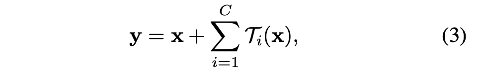

其中y是输出。

> Where y is the output.

与 Inception-ResNet 的关系。一些张量操作表明图 1（右）中的模块（也显示在图 3（a）中）等效于图 3（b）。图 3(b) 看起来类似于 Inception-ResNet [37] 块，因为它涉及残差函数中的分支和连接。但与所有 Inception 或 Inception-ResNet 模块不同，我们在多个路径之间共享相同的拓扑。我们的模块需要不需要的额外工作来设计每条路径。

>Relation to Inception-ResNet. Some tensor manipulations show that the module in Fig. 1(right) (also shown in Fig. 3(a)) is equivalent to Fig. 3(b). 3Fig. 3(b) appears similar to the Inception-ResNet [37] block in that it involves branching and concatenating in the residual function. But unlike all Inception or Inception-ResNet modules, we share the same topology among the multiple paths. Our module requires minimal extra effort designing each path.

与分组卷积的关系。使用分组卷积[24]的符号，上述模块变得更加简洁。 4 这种重新表述如图 3(c) 所示。所有低维嵌入（前 1×1 层）都可以替换为单个更宽的层（例如，图 3（c）中的 1×1、128-d）。拆分本质上是由分组卷积层在将其输入通道分成组时完成的。图 3（c）中的分组卷积层执行 32 组卷积，其输入和输出通道是 4 维的。分组卷积层将它们连接起来作为该层的输出。图 3（c）中的块看起来像图 1（左）中的原始瓶颈残差块，除了图 3（c）是一个更宽但连接稀疏的模块。

>Relation to Grouped Convolutions. The above module becomes more succinct using the notation of grouped convolutions [24]. 4This reformulation is illustrated in Fig. 3(c). All the low-dimensional embeddings (the first 1×1 layers) can be replaced by a single, wider layer (e.g., 1×1, 128-d in Fig 3(c)). Splitting is essentially done by the grouped convolutional layer when it divides its input channels into groups. The grouped convolutional layer in Fig. 3(c) performs 32 groups of convolutions whose input and output channels are 4-dimensional. The grouped convolutional layer concatenates them as the outputs of the layer. The block in Fig. 3(c) looks like the original bottleneck residual block in Fig. 1(left), except that Fig. 3(c) is a wider but sparsely connected module.

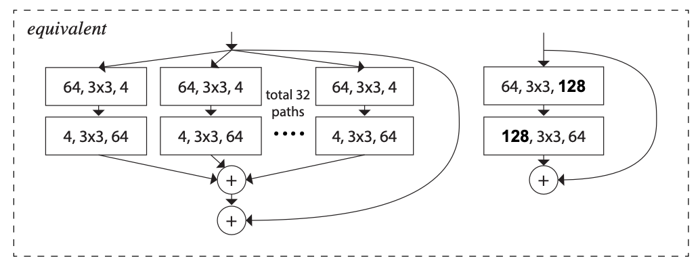

图 4.（左）：深度 = 2 的聚合变换。（右）：一个等效块，稍微宽一些。

>Figure 4. (Left): Aggregating transformations of depth = 2. (Right): An equivalent block, which is trivially wider.

我们注意到，仅当块的深度≥3 时，等价构建才会产生非平凡拓扑。如果块的深度 = 2（例如，[14] 中的基本块），等价构建述会导致平凡的宽、密集模块。请参见图 4 中的插图。

>We note that the reformulations produce nontrivial topologies only when the block has depth ≥3. If the block has depth = 2 (e.g., the basic block in [14]), the reformulations lead to trivially a wide, dense module. See the illustration in Fig. 4.

讨论。我们注意到，尽管我们提出了表现出串联（图 3（b））或分组卷积（图 3（c））的等价构建，但这种等价构建并不总是适用于等式（3）的一般形式，例如，如果变换

采用任意形式并且是异质的。我们在本文中选择使用同质形式，因为它们更简单且可扩展。在这种简化的情况下，图 3（c）形式的分组卷积有助于简化实现。

>Discussion. We note that although we present reformulations that exhibit concatenation (Fig. 3(b)) or grouped convolutions (Fig. 3(c)), such reformulations are not always applicable for the general form of Eqn.(3), e.g., if the transformation T itakes arbitrary forms and are heterogenous. We choose to use homogenous forms in this paper because they are simpler and extensible. Under this simplified case, grouped convolutions in the form of Fig. 3(c) are helpful for easing implementation.

### 3.4. Model Capacity

我们在下一节中的实验将表明我们的模型在保持模型复杂性和参数数量时提高了准确性。这不仅在实践中很有趣，更重要的是，参数的复杂性和数量代表了模型的固有容量，因此经常作为深度网络的基本属性进行研究 [8]。

>Our experiments in the next section will show that our models improve accuracy when maintaining the model complexity and number of parameters. This is not only interesting in practice, but more importantly, the complexity and number of parameters represent inherent capacity of models and thus are often investigated as fundamental properties of deep networks [8].

当我们在保持复杂性的同时评估不同的基数 C 时，我们希望最小化其他超参数的修改。我们选择调整瓶颈宽度（例如，图 1（右）中的 4-d），因为它可以与块的输入和输出隔离。该策略不会对其他超参数（块的深度或输入/输出宽度）进行任何更改，因此有助于我们关注基数的影响。

>When we evaluate different cardinalities C while preserving complexity, we want to minimize the modification of other hyper-parameters. We choose to adjust the width of the bottleneck (e.g., 4-d in Fig 1(right)), because it can be isolated from the input and output of the block. This strategy introduces no change to other hyper-parameters (depth or input/output width of blocks), so is helpful for us to focus on the impact of cardinality.

表 2. 基数和宽度之间的关系（对于 conv2 的模板），在残差块上大致保留了复杂度。 conv2 的模板参数数量约为 70k。 FLOP 的数量约为 2.2 亿（对于conv2为 #参数量×56×56 ）

>Table 2. Relations between cardinality and width (for the template of conv2), with roughly preserved complexity on a residual block. The number of parameters is ∼70k for the template of conv2. The number of FLOPs is ∼0.22 billion (# params×56×56 for conv2)

在图 1（左）中，原始 ResNet 瓶颈块 [14] 具有 256·64+3·3·64·64+64·256 ≈ 70k 个参数和成比例的 FLOP（在相同的特征图大小上）。对于瓶颈宽度 d，我们在图 1（右）中的模板具有：

>In Fig. 1(left), the original ResNet bottleneck block [14] has 256 · 64 + 3 · 3 · 64 · 64 + 64 · 256 ≈ 70k parameters and proportional FLOPs (on the same feature map size). With bottleneck width d, our template in Fig. 1(right) has:

参数和成比例 FLOPs。当 C = 32 且 d = 4 时，Eqn.(4) ≈ 70k。表 2 显示了基数 C 和瓶颈宽度 d 之间的关系。

>parameters and proportional FLOPs. When C = 32 and d = 4, Eqn.(4) ≈ 70k. Table 2 shows the relationship between cardinality C and bottleneck width d.

因为我们在 Sec 3.1中采用了这两个规则，所以上述近似等式在 ResNet 瓶颈块和我们的 ResNeXt 之间在所有阶段都是有效的（除了特征图大小发生变化的子采样层）。表 1 比较了原始 ResNet-50 和我们具有相似容量的 ResNeXt-50。 我们注意到复杂度只能近似保留，但复杂度的差异很小，不会影响我们的结果。

>Because we adopt the two rules in Sec. 3.1, the above approximate equality is valid between a ResNet bottleneck block and our ResNeXt on all stages (except for the subsampling layers where the feature maps size changes). Table 1 compares the original ResNet-50 and our ResNeXt-50 that is of similar capacity. 5We note that the complexity can only be preserved approximately, but the difference of the complexity is minor and does not bias our results.

## 4. Implementation details

我们的实现遵循[14]和fb.resnet.torch的公开代码[11]。在 ImageNet 数据集上，输入图像是使用 [11] 实现的 [38] 的比例和纵横比增强从调整大小的图像中随机裁剪的 224×224。捷径是恒等连接，除了那些增加维度的投影（[14] 中的类型 B）。如 [11] 中所建议的，conv3、4 和 5 的下采样是在每个阶段的第一个块的 3×3 层中通过 stride-2 卷积完成的。我们在 8 个 GPU（每个 GPU 32 个）上使用小批量大小为 256 的 SGD。权重衰减为 0.0001，动量为 0.9。我们从 0.1 的学习率开始，使用 [11] 中的调度器将其除以 10 三次。我们采用[13]的权重初始化。在所有消融比较中，我们从短边为 256 的图像中评估单个 224×224 中心裁剪的误差。

>Our implementation follows [14] and the publicly available code of fb.resnet.torch [11]. On the ImageNet dataset, the input image is 224×224 randomly cropped from a resized image using the scale and aspect ratio augmentation of [38] implemented by [11]. The shortcuts are identity connections except for those increasing dimensions which are projections (type B in [14]). Downsampling of conv3, 4, and 5 is done by stride-2 convolutions in the 3×3 layer of the first block in each stage, as suggested in [11]. We use SGD with a mini-batch size of 256 on 8 GPUs (32 per GPU). The weight decay is 0.0001 and the momentum is 0.9. We start from a learning rate of 0.1, and divide it by 10 for three times using the schedule in [11]. We adopt the weight initialization of [13]. In all ablation comparisons, we evaluate the error on the single 224×224 center crop from an image whose shorter side is 256.

我们的模型是通过图 3（c）的形式实现的。我们在图3（c）中的 卷积之后立即执行批量归一化 (BN) [17]。ReLU 在每个 BN 之后立即执行，期望在添加到捷径之后执行 ReLU 的块的输出，如 [14]。

>Our models are realized by the form of Fig. 3(c). We perform batch normalization (BN) [17] right after the con-volutions in Fig. 3(c). 6ReLU is performed right after each BN, expect for the output of the block where ReLU is performed after the adding to the shortcut, following [14].

我们注意到，当 BN 和 ReLU 如上所述被适当处理时，图 3 中的三种形式是严格等价的。我们训练了所有三种形式并获得了相同的结果。我们选择通过图 3(c) 来实现，因为它比其他两种形式更简洁和快速。

>We note that the three forms in Fig. 3 are strictly equivalent, when BN and ReLU are appropriately addressed as mentioned above. We have trained all three forms and obtained the same results. We choose to implement by Fig. 3(c) because it is more succinct and faster than the other two forms.

## 5.Experiments

### 5.1. Experiments on ImageNet-1K

我们对 1000 类 ImageNet 分类任务 [33] 进行了消融实验。我们按照 [14] 构建 50 层和 101 层的残差网络。我们只需用我们的块替换 ResNet-50/101 中的所有块。

> We conduct ablation experiments on the 1000-class ImageNet classification task [33]. We follow [14] to construct 50-layer and 101-layer residual networks. We simply replace all blocks in ResNet-50/101 with our blocks.

**符号**。因为我们在 Sec 3.1 中采用了这两个规则。 我们通过模板引用一个架构就足够了。例如，表 1 显示了由基数 = 32 且瓶颈宽度 = 4d 的模板构建的 ResNeXt-50（图 3）。为简单起见，该网络被表示为 ResNeXt-50 (32×4d)。我们注意到模板的输入/输出宽度固定为 256-d（图 3），并且每次对特征图进行下采样时，所有宽度都会加倍（见表 1）。

>**Notations**. Because we adopt the two rules in Sec. 3.1, it is sufficient for us to refer to an architecture by the template. For example, Table 1 shows a ResNeXt-50 constructed by a template with cardinality = 32 and bottleneck width = 4d (Fig. 3). This network is denoted as ResNeXt-50 (32×4d) for simplicity. We note that the input/output width of the template is fixed as 256-d (Fig. 3), and all widths are doubled each time when the feature map is subsampled (see Table 1).

**基数与宽度**。我们首先评估基数 C 和瓶颈宽度之间的权衡，在表 2 中列出的保留复杂度下。表 3 显示了结果，图 5 显示了误差与时期的曲线。与 ResNet-50（上表 3 和左图 5）相比，32×4d ResNeXt-50 的验证误差为 22.2%，比 ResNet 基线的 23.9% 低 1.7%。随着基数 C 从 1 增加到 32，同时保持复杂性，错误率不断降低。此外，32×4d ResNeXt 的训练误差也比 ResNet 对应物低得多，这表明收益不是来自正则化，而是来自更强的表示。

>**Cardinality vs. Width**. We first evaluate the trade-off between cardinality C and bottleneck width, under preserved complexity as listed in Table 2. Table 3 shows the results and Fig. 5 shows the curves of error vs. epochs. Comparing with ResNet-50 (Table 3 top and Fig. 5 left), the 32×4d ResNeXt-50 has a validation error of 22.2%, which is 1.7% lower than the ResNet baseline’s 23.9%. With cardinality C increasing from 1 to 32 while keeping complexity, the error rate keeps reducing. Furthermore, the 32×4d ResNeXt also has a much lower training error than the ResNet counterpart, suggesting that the gains are not from regularization but from stronger representations.

在 ResNet-101 的情况下也观察到了类似的趋势（图 5 右，表 3 底部），其中 32×4d ResNeXt101 的性能比 ResNet-101 高 0.8%。虽然这种验证误差的改进小于 50 层的情况，但训练误差的改进仍然很大（ResNet-101 为 20%，32×4d ResNeXt-101 为 16%，图 5 右）。事实上，更多的训练数据会扩大验证误差的差距，正如我们在下一小节中的 ImageNet-5K 集上展示的那样。

>Similar trends are observed in the case of ResNet-101 (Fig. 5 right, Table 3 bottom), where the 32×4d ResNeXt101 outperforms the ResNet-101 counterpart by 0.8%. Although this improvement of validation error is smaller than that of the 50-layer case, the improvement of training error is still big (20% for ResNet-101 and 16% for 32×4d ResNeXt-101, Fig. 5 right). In fact, more training data will enlarge the gap of validation error, as we show on an ImageNet-5K set in the next subsection.

表 3 还表明，在保留复杂性的情况下，以减小宽度为代价增加基数开始显示出饱和精度。我们认为在这种权衡中不断减小宽度是不值得的。所以下面我们采用不小于4d的瓶颈宽度。

>Table 3 also suggests that with complexity preserved, increasing cardinality at the price of reducing width starts to show saturating accuracy when the bottleneck width is small. We argue that it is not worthwhile to keep reducing width in such a trade-off. So we adopt a bottleneck width no smaller than 4d in the following.

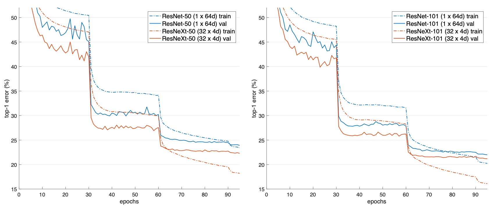

图5. ImageNet-1K的训练曲线（左）。ResNet/ResNeXt-50，保留了复杂性（41亿FLOPs，2500万参数）；（右）。保留复杂性的ResNet/ResNeXt-101（78亿FLOPs, ∼4400万参数）。

> Figure 5. Training curves on ImageNet-1K. (Left): ResNet/ResNeXt-50 with preserved complexity (∼4.1 billion FLOPs, ∼25 million parameters); (Right): ResNet/ResNeXt-101 with preserved complexity (∼7.8 billion FLOPs, ∼44 million parameters).

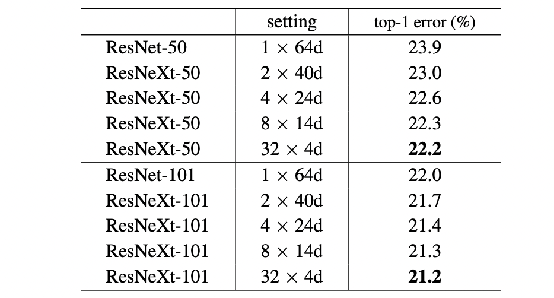

表 3. ImageNet-1K 上的消融实验（上）：保留复杂度的 ResNet50（~41 亿 FLOPs）； （下）：保留复杂度的 ResNet-101（~78 亿次浮点数）。在 224×224 像素的单次裁剪上评估错误率。

>Table 3. Ablation experiments on ImageNet-1K. (Top): ResNet50 with preserved complexity (∼4.1 billion FLOPs); (Bottom): ResNet-101 with preserved complexity (∼7.8 billion FLOPs). The error rate is evaluated on the single crop of 224×224 pixels.

**增加基数与更深/更宽**。接下来，我们通过增加基数 C 或增加深度或宽度来研究增加的复杂性。下面的比较也可以看作是参考 ResNet-101 基线的 2× FLOPs。我们比较了以下具有约 150 亿次 FLOP 的变体(i) **增加深度**到 200 层。我们采用 [11] 中实现的 ResNet-200 [15]. (ii)通过增加瓶颈宽度来增加**宽度**.(iii) 通过加倍 C 来**增加基数**。

>**Increasing Cardinality vs. Deeper/Wider.** Next we investigate increasing complexity by increasing cardinality C or increasing depth or width. The following comparison can also be viewed as with reference to 2× FLOPs of the ResNet-101 baseline. We compare the following variants that have ∼15 billion FLOPs. (i) **Going deeper** to 200 layers. We adopt the ResNet-200 [15] implemented in [11]. (ii) **Going wider** by increasing the bottleneck width. (iii) **Increasing cardinality** by doubling C.

表 4 显示，与 ResNet-101 基线 (22.0%) 相比，将复杂度增加 2 倍可以持续减少错误。但是当更深（ResNet200，0.3%）或更宽（更宽的 ResNet-101，0.7%）时，改进很小。

>Table 4 shows that increasing complexity by 2× consistently reduces error vs. the ResNet-101 baseline (22.0%). But the improvement is small when going deeper (ResNet200, by 0.3%) or wider (wider ResNet-101, by 0.7%).

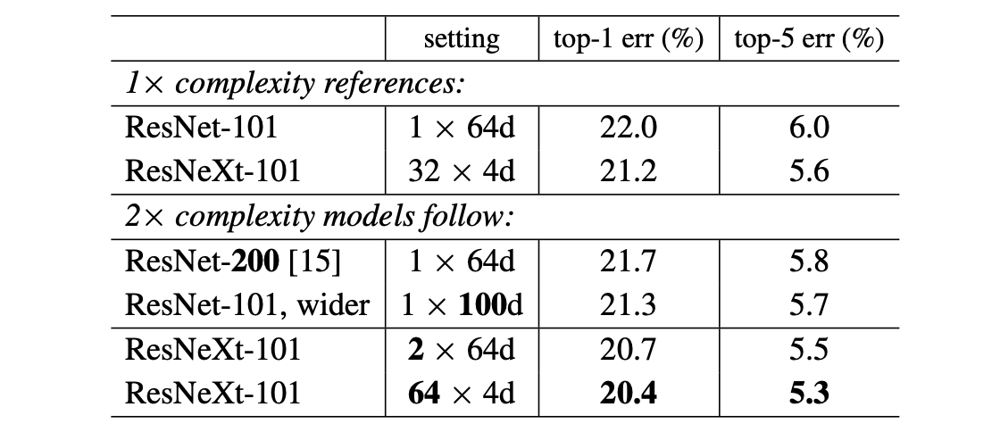

表 4. 当 FLOP 数量增加到 ResNet-101 的 2 倍时 ImageNet-1K 上的比较。在 224×224 像素的单次裁剪上评估错误率。突出显示的因素是增加复杂性的因素。

>Table 4. Comparisons on ImageNet-1K when the number of FLOPs is increased to 2× of ResNet-101’s. The error rate is evaluated on the single crop of 224×224 pixels. The highlighted factors are the factors that increase complexity.

相反，增加基数比更深或更广的结果更好。 2×64d ResNeXt-101（即在 1×64d ResNet-101 基线上加倍 C 并保持宽度）将 top-1 误差降低 1.3% 至 20.7%。 64×4d ResNeXt-101（即在 32×4d ResNeXt-101 上加倍 C 并保持宽度）将 top-1 误差降低到 20.4%。

>On the contrary, *increasing cardinality* C *shows much* better results than going deeper or wider. The 2×64d ResNeXt-101 (i.e., doubling C on 1×64d ResNet-101 baseline and keeping the width) reduces the top-1 error by 1.3% to 20.7%. The 64×4d ResNeXt-101 (i.e., doubling C on 32×4d ResNeXt-101 and keeping the width) reduces the top-1 error to 20.4%.

我们还注意到，32×4d ResNet-101 (21.2%) 比更深的 ResNet-200 和更宽的 ResNet101 表现更好，尽管它只有～50% 的复杂度。这再次表明基数是比深度和宽度维度更有效的维度。

>We also note that 32×4d ResNet-101 (21.2%) performs better than the deeper ResNet-200 and the wider ResNet101, even though it has only ∼50% complexity. This again shows that cardinality is a more effective dimension than the dimensions of depth and width.

**残差连接**。下表显示了残差（捷径）连接的影响。

> **Residual connections.** The following table shows the ef- fects of the residual (shortcut) connections:

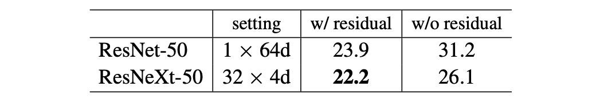

从ResNeXt-50中去掉捷径后，错误率增加了3.9个点，达到26.1%。从ResNet-50中删除捷径的情况要差得多（31.2%）。这些比较表明，残差连接有助于优化，而聚合转换是更强的表示，正如它们始终比有或没有残差连接的对应物表现更好的事实所示。

>Removing shortcuts from the ResNeXt-50 increases the er- ror by 3.9 points to 26.1%. Removing shortcuts from its ResNet-50 counterpart is much worse (31.2%).These comparisons suggest that the residual connections are helpful for optimization, whereas aggregated transformations are stronger representations, as shown by the fact that they perform consistently better than their counterparts with or without residual connections.

**性能**。为简单起见，我们使用 Torch 内置的分组卷积实现，无需特殊优化。我们注意到这个实现是蛮力的，对并行化不友好。在 NVIDIA M40 的 8 个 GPU 上，训练表 3 中的 32×4d ResNeXt-101 每个 mini-batch 需要 0.95 秒，而具有相似 FLOP 的 ResNet-101 基线需要 0.70 秒。我们认为这是一个合理的开销。我们期望精心设计的低级实现（例如，在 CUDA 中）将减少这种开销。我们还预计 CPU 上的推理时间会带来更少的开销。训练 2×复杂度模型 (64×4d ResNeXt-101) 每个 mini-batch 需要 1.7 秒，在 8 个 GPU 上总共需要 10 天。

>**Performance**. For simplicity we use Torch’s built-in grouped convolution implementation, without special optimization. We note that this implementation was brute-force and not parallelization-friendly. On 8 GPUs of NVIDIA M40, training 32×4d ResNeXt-101 in Table 3 takes 0.95s per mini-batch, vs. 0.70s of ResNet-101 baseline that has similar FLOPs. We argue that this is a reasonable overhead. We expect carefully engineered lower-level implementation (e.g., in CUDA) will reduce this overhead. We also expect that the inference time on CPUs will present less overhead. Training the 2×complexity model (64×4d ResNeXt-101) takes 1.7s per mini-batch and 10 days total on 8 GPUs.

**与最先进的结果进行比较**。表 5 显示了在 ImageNet 验证集上进行单裁剪测试的更多结果。除了测试 224×224 的裁剪外，我们还按照 [15] 评估了 320×320 裁剪。我们的结果与 ResNet、Inception-v3/v4 和 Inception-ResNet-v2 相媲美，实现了 4.4% 的单裁剪 top-5 错误率。此外，我们的架构设计比所有 Inception 模型都简单得多，并且需要手动设置的超参数要少得多。

>**Comparisons with state-of-the-art results**. Table 5 shows more results of single-crop testing on the ImageNet validation set. In addition to testing a 224×224 crop, we also evaluate a 320×320 crop following [15]. Our results compare favorably with ResNet, Inception-v3/v4, and Inception-ResNet-v2, achieving a single-crop top-5 error rate of 4.4%. In addition, our architecture design is much simpler than all Inception models, and requires considerably fewer hyper-parameters to be set by hand.

ResNeXt 是我们进入 ILSVRC 2016 分类任务的基础，在该任务中我们获得了第 2 名。我们注意到，在使用多尺度和/或多裁剪测试后，许多模型（包括我们的模型）开始在该数据集上饱和。使用 [14] 中的多尺度密集测试，我们的单模型 top-1/top-5 错误率为 17.7%/3.7%，与 Inception-ResNet-v2 的单模型结果 17.8%/3.7 相当%，采用多尺度、多裁剪试验。我们在测试集上得到了 3.03% 的 top-5 错误率，与获胜者的 2.99% 和 Inception-v4/InceptionResNet-v2 的 3.08% [37] 相当。

>ResNeXt is the foundation of our entries to the ILSVRC 2016 classification task, in which we achieved 2 ndplace. We note that many models (including ours) start to get saturated on this dataset after using multi-scale and/or multicrop testing. We had a single-model top-1/top-5 error rates of 17.7%/3.7% using the multi-scale dense testing in [14], on par with Inception-ResNet-v2’s single-model results of 17.8%/3.7% that adopts multi-scale, multi-crop testing. We had an ensemble result of 3.03% top-5 error on the test set, on par with the winner’s 2.99% and Inception-v4/InceptionResNet-v2’s 3.08% [37].

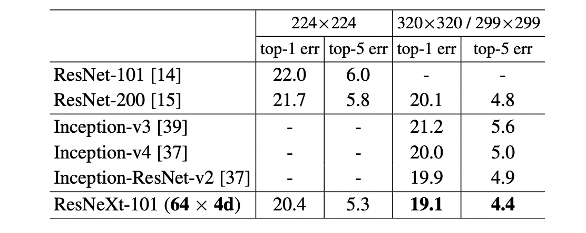

表 5. ImageNet-1K 验证集上的最先进模型（单裁剪测试）。 ResNet/ResNeXt 的测试大小为 [15] 中的 224×224 和 320×320，Inception 模型的测试大小为 299×299。

>Table 5. State-of-the-art models on the ImageNet-1K validation set (single-crop testing). The test size of ResNet/ResNeXt is 224×224 and 320×320 as in [15] and of the Inception models is 299×299.

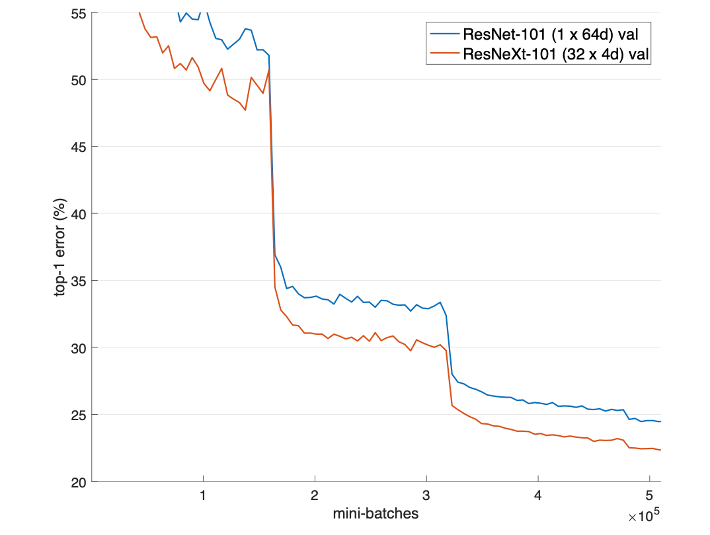

图 6. ImageNet-5K 实验。模型在 5K 集上进行训练，并在原始 1K 验证集上进行评估，绘制为 1K 路分类任务。 ResNeXt 和它的 ResNet 对应物具有相似的复杂性。

>Figure 6. ImageNet-5K experiments. Models are trained on the 5K set and evaluated on the original 1K validation set, plotted as a 1K-way classification task. ResNeXt and its ResNet counterpart have similar complexity.

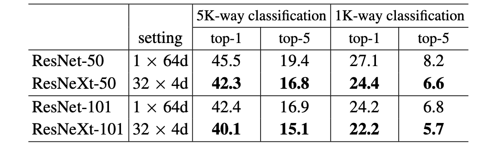

表 6. ImageNet-5K 上的错误 (%)。这些模型在 ImageNet-5K 上训练并在 ImageNet-1K 验证集上进行测试，在测试时被视为 5K 路分类任务或 1K 路分类任务。 ResNeXt 和它的 ResNet 对应物具有相似的复杂性。误差是在 224×224 像素的单次裁剪上评估的。

>Table 6. Error (%) on ImageNet-5K. The models are trained on ImageNet-5K and tested on the ImageNet-1K val set, treated as a 5K-way classification task or a 1K-way classification task at test time. ResNeXt and its ResNet counterpart have similar complexity. The error is evaluated on the single crop of 224×224 pixels.

### 5.2. Experiments on ImageNet-5K

ImageNet-1K 上的性能似乎已经饱和。但我们认为这不是因为模型的能力，而是因为数据集的复杂性。接下来，我们在具有 5000 个类别的更大 ImageNet 子集上评估我们的模型。

>The performance on ImageNet-1K appears to saturate. But we argue that this is not because of the capability of the models but because of the complexity of the dataset. Next we evaluate our models on a larger ImageNet subset that has 5000 categories.

我们的 5K 数据集是完整 ImageNet-22K 集 [33] 的子集。这 5000 个类别由原始 ImageNet1K 类别和附加的 4000 个类别组成，这些类别在整个 ImageNet 集中具有最多图像。 5K 集有 680 万张图像，大约是 1K 集的 5 倍。没有可用的官方 train/val 拆分，因此我们选择在原始 ImageNet-1K 验证集上进行评估。在这个 1K 类验证集上，可以将模型评估为 5K 路分类任务（所有预测为其他 4K 类的标签都是自动错误的）或 1K 路分类任务（softmax 仅应用于 1K类）在测试时间。

>Our 5K dataset is a subset of the full ImageNet-22K set [33]. The 5000 categories consist of the original ImageNet1K categories and additional 4000 categories that have the largest number of images in the full ImageNet set. The 5K set has 6.8 million images, about 5× of the 1K set. There is no official train/val split available, so we opt to evaluate on the original ImageNet-1K validation set. On this 1K-class val set, the models can be evaluated as a 5K-way classification task (all labels predicted to be the other 4K classes are automatically erroneous) or as a 1K-way classification task (softmax is applied only on the 1K classes) at test time.

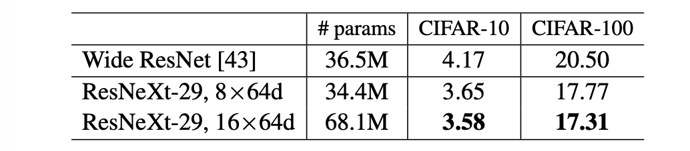

表 7. CIFAR 上的测试误差 (%) 和模型大小。我们的结果是 10 次运行的平均值。

>Table 7. Test error (%) and model size on CIFAR. Our results are the average of 10 runs.

实现细节与第二节中的相同。 4. 5K 训练模型全部从零开始训练，并且训练与 1Ktraining 模型相同数量的小批量（所以 1/5× epochs）。表 6 和图 6 显示了保留复杂度下的比较。与 ResNet-50 相比，ResNeXt-50 将 5K-way top-1 误差降低了 3.2%，与 ResNet-101 相比，ResNetXt-101 将 5K-way top-1 误差降低了 2.3%。在 1K 路误差上观察到类似的差距。这些展示了 ResNeXt 更强的表现力。

>The implementation details are the same as in Sec. 4. The 5K-training models are all trained from scratch, and  are trained for the same number of mini-batches as the 1Ktraining models (so 1/5× epochs). Table 6 and Fig. 6 show the comparisons under preserved complexity. ResNeXt-50 reduces the 5K-way top-1 error by 3.2% comparing with ResNet-50, and ResNetXt-101 reduces the 5K-way top-1 error by 2.3% comparing with ResNet-101. Similar gaps are observed on the 1K-way error. These demonstrate the stronger representational power of ResNeXt.

此外，我们发现在 5K 集上训练的模型（表 6 中的 1K-路误差为 22.2%/5.7%）与在 1K 集上训练的模型（表 3 中的 21.2%/5.6%）相比表现具有竞争力，评估验证集上相同的 1K 路分类任务。这个结果是在不增加训练时间（由于相同数量的小批量）和微调的情况下实现的。我们认为这是一个有希望的结果，因为对 5K 类别进行分类的训练任务更具挑战性。

>Moreover, we find that the models trained on the 5K set (with 1K-way error 22.2%/5.7% in Table 6) perform competitively comparing with those trained on the 1K set (21.2%/5.6% in Table 3), evaluated on the same 1K-way classification task on the validation set. This result is achieved without increasing the training time (due to the same number of mini-batches) and without fine-tuning. We argue that this is a promising result, given that the training task of classifying 5K categories is a more challenging one .

### 5.3. Experiments on CIFAR

我们在 CIFAR-10 和 100 个数据集上进行了更多实验 [23]。我们使用 [14] 中的架构，并用 

 的瓶颈模板替换基本残差块我们的网络从一个单一的3×3 conv层，然后是 3 个阶段，每个阶段有 3 个残差块，最后以平均池化和一个完全连接的分类器（总共 29 层深度）结束，遵循 [14]。我们采用与[14]相同的翻译和翻转数据增强。实施细节在附录中。

>We conduct more experiments on CIFAR-10 and 100 datasets [23]. We use the architectures as in [14] and replace the basic residual block by the bottleneck template of .Our networks start with a single 3×3 conv layer, followed by 3 stages each having 3 residual blocks, and end with average pooling and a fully-connected classifier (total 29-layer deep), following [14]. We adopt the same translation and flipping data augmentation as [14]. Implementation details are in the appendix.

我们基于上述基线比较了两种复杂度增加的情况：（i）增加基数并固定所有宽度，或（ii）增加瓶颈宽度并固定基数 = 1。我们在这些变化下训练和评估一系列网络。图 7 显示了测试错误率与模型大小的比较。我们发现增加基数比增加宽度更有效，这与我们在 ImageNet-1K 上观察到的一致。表 7 显示了结果和模型大小，与已发表的最佳记录 Wide ResNet [43] 进行了比较。我们具有相似模型大小 (34.4M) 的模型显示出比 Wide ResNet 更好的结果。我们更大的方法在 CIFAR-10 上实现了 3.58% 的测试错误（10 次运行的平均值），在 CIFAR-100 上实现了 17.31%。据我们所知，这些是包括未发表的技术报告在内的文献中最先进的结果（具有类似的数据增强）。

>We compare two cases of increasing complexity based on the above baseline: (i) increase cardinality and fix all widths, or (ii) increase width of the bottleneck and fix cardinality = 1. We train and evaluate a series of networks under these changes. Fig. 7 shows the comparisons of test error rates vs. model sizes. We find that increasing cardinality is more effective than increasing width, consistent to what we have observed on ImageNet-1K. Table 7 shows the results and model sizes, comparing with the Wide ResNet [43] which is the best published record. Our model with a similar model size (34.4M) shows results better than Wide ResNet. Our larger method achieves 3.58% test error (average of 10 runs) on CIFAR-10 and 17.31% on CIFAR-100. To the best of our knowledge, these are the state-of-the-art results (with similar data augmentation) in the literature including unpublished technical reports.

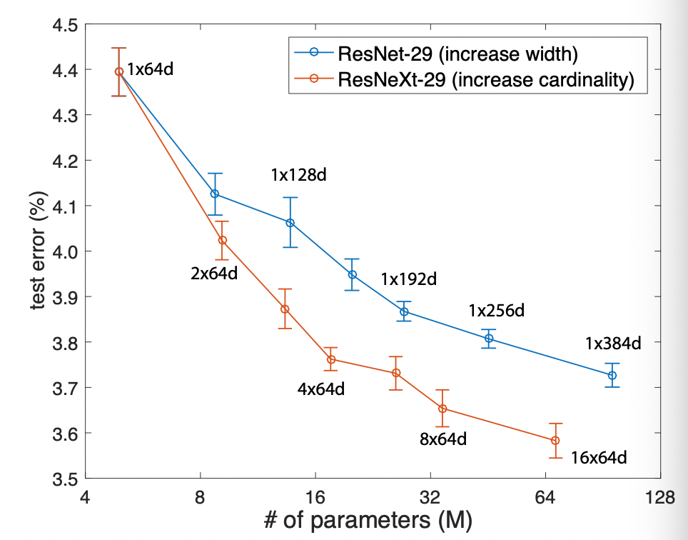

图 7. CIFAR-10 上的测试误差与模型大小的关系。结果用 10 次运行计算，用标准误差条显示。标签显示模板的设置。

>Figure 7. Test error vs. model size on CIFAR-10. The results are computed with 10 runs, shown with standard error bars. The labels show the settings of the templates.

表 8. COCO minival 集上的目标检测结果。 ResNeXt 和它的 ResNet 对应物具有相似的复杂性。

>Table 8. Object detection results on the COCO minival set. ResNeXt and its ResNet counterpart have similar complexity.

### 5.4. Experiments on COCO object detection

接下来我们评估 COCO 对象检测集 [27] 的泛化性。我们按照 [1] 在 80k 训练集和 35k val 子集上训练模型，并在 5k val 子集（称为 minival）上进行评估。我们评估 COCOstyle 平均精度 (AP) 以及 AP@IoU=0.5 [27]。我们采用基本的 Faster R-CNN [32] 并按照 [14] 将 ResNet/ResNeXt 插入其中。这些模型在 ImageNet-1K 上进行了预训练，并在检测集上进行了微调。实施细节在附录中。

>Next we evaluate the generalizability on the COCO object detection set [27]. We train the models on the 80k training set plus a 35k val subset and evaluate on a 5k val subset (called minival), following [1]. We evaluate the COCOstyle Average Precision (AP) as well as AP@IoU=0.5 [27]. We adopt the basic Faster R-CNN [32] and follow [14] to plug ResNet/ResNeXt into it. The models are pre-trained on ImageNet-1K and fine-tuned on the detection set. Implementation details are in the appendix.

表 8 显示了比较。在 50 层基线上，ResNeXt 将 AP@0.5 提高了 2.1%，AP 提高了 1.0%，而不会增加复杂度。 ResNeXt 在 101 层基线上显示出较小的改进。正如在 ImageNet-5K 集上观察到的，我们推测更多的训练数据将导致更大的差距。

>Table 8 shows the comparisons. On the 50-layer baseline, ResNeXt improves AP@0.5 by 2.1% and AP by 1.0%, without increasing complexity. ResNeXt shows smaller improvements on the 101-layer baseline. We conjecture that more training data will lead to a larger gap, as observed on the ImageNet-5K set.

还值得注意的是，最近 ResNeXt 已在 Mask R-CNN [12] 中采用，在 COCO 实例分割和对象检测任务上取得了最先进的结果。

>It is also worth noting that recently ResNeXt has been adopted in Mask R-CNN [12] that achieves state-of-the-art results on COCO instance segmentation and object detection tasks.

## Acknowledgment

S.X. Z.T. 的研究得到了 NSF IIS-1618477 的部分支持。作者要感谢 Tsung-Yi Lin 和 Priya Goyal 的宝贵讨论。

> S.X. and Z.T.’s research was partly supported by NSF IIS-1618477. The authors would like to thank Tsung-Yi Lin and Priya Goyal for valuable discussions.

## A. Implementation Details: CIFAR

我们在 50k 训练集上训练模型并在 10k 测试集上进行评估。输入图像是从零填充的 40×40 图像或其翻转中随机裁剪的 32×32，遵循 [14]。没有使用其他数据增强。第一层是 3×3 卷积，有 64 个过滤器。有 3 个阶段，每个阶段有 3 个残差块，每个阶段的输出图大小为 32、16 和 8 [14]。网络以全局平均池化和全连接层结束。当阶段改变（下采样）时，宽度增加 2 倍，如 Sec. 3.1。这些模型在 8 个 GPU 上训练，mini-batch 大小为 128，权重衰减为 0.0005，动量为 0.9。我们从 0.1 的学习率开始，训练模型 300 个 epoch，降低第 150 和 225 个 epoch 的学习率。其他实现细节见[11]。

> We train the models on the 50k training set and evaluate on the 10k test set. The input image is 32×32 randomly cropped from a zero-padded 40×40 image or its flipping, following [14]. No other data augmentation is used. The first layer is 3×3 conv with 64 filters. There are 3 stages each having 3 residual blocks, and the output map size is 32, 16, and 8 for each stage [14]. The network ends with a global average pooling and a fully-connected layer. Width is increased by 2× when the stage changes (downsampling), as in Sec. 3.1. The models are trained on 8 GPUs with a mini-batch size of 128, with a weight decay of 0.0005 and a momentum of 0.9. We start with a learning rate of 0.1 and train the models for 300 epochs, reducing the learning rate at the 150-th and 225-th epoch. Other implementation details are as in [11].

## B. Implementation Details: Object Detection

我们采用 Faster R-CNN 系统 [32]。为简单起见，我们不共享 RPN 和 Fast R-CNN 之间的特征。在 RPN 步骤中，我们在 8 个 GPU 上进行训练，每个 GPU 每个 mini-batch 保存 2 个图像，每个图像 256 个锚点。我们以 0.02 的学习率和下一个 60k 的 0.002 的学习率训练 120k 小批量的 RPN 步骤。在 Fast R-CNN 步骤中，我们在 8 个 GPU 上进行训练，每个 GPU 保存 1 个图像和每个 mini-batch 64 个区域。我们以 0.005 的学习率和下一个 60k 的学习率为 0.0005 训练 120k 小批量的 Fast R-CNN 步骤，我们使用 0.0001 的权重衰减和 0.9 的动量。其他实现细节见 https://github.com/rbgirshick/py-faster-rcnn。

> We adopt the Faster R-CNN system [32]. For simplicity we do not share the features between RPN and Fast R-CNN. In the RPN step, we train on 8 GPUs with each GPU holding 2 images per mini-batch and 256 anchors per image. We train the RPN step for 120k mini-batches at a learning rate of 0.02 and next 60k at 0.002. In the Fast R-CNN step, we train on 8 GPUs with each GPU holding 1 image and 64 regions per mini-batch. We train the Fast R-CNN step for 120k mini-batches at a learning rate of 0.005 and next 60k at 0.0005, We use a weight decay of 0.0001 and a momentum of 0.9. Other implementation details are as in https:// github.com/rbgirshick/py-faster-rcnn.
