# AN IMAGE IS WORTH 16X16 WORDS: TRANSFORMERS FOR IMAGE RECOGNITION AT SCALE

> Alexey Dosovitskiy∗,†, Lucas Beyer∗, Alexander Kolesnikov∗, Dirk Weissenborn∗, Xiaohua Zhai∗, Thomas Unterthiner, Mostafa Dehghani, Matthias Minderer,
>
> Georg Heigold, Sylvain Gelly, Jakob Uszkoreit, Neil Houlsby∗,† ∗equal technical contribution, †equal advising
>  Google Research, Brain Team {adosovitskiy, neilhoulsby}@google.com

### ABSTRACT

虽然 Transformer 架构已成为自然语言处理任务的事实标准，但其在计算机视觉中的应用仍然有限。 在视觉上，注意力要么与卷积网络结合使用，要么用于替换卷积网络的某些组件，同时保持其整体结构不变。 我们表明，这种对 CNN 的依赖是不必要的，直接应用于图像块序列的纯transformer可以在图像分类任务上表现得非常好。 当对大量数据进行预训练并转移到多个中型或小型图像识别基准（ImageNet、CIFAR-100、VTAB 等）时，与 state-of-the- 相比，Vision Transformer (ViT) 获得了出色的结果，同时需要大大减少训练的计算资源。

> While the Transformer architecture has become the de-facto standard for natural language processing tasks, its applications to computer vision remain limited. In vision, attention is either applied in conjunction with convolutional networks, or used to replace certain components of convolutional networks while keeping their overall structure in place. We show that this reliance on CNNs is not necessary and a pure transformer applied directly to sequences of image patches can perform very well on image classification tasks. When pre-trained on large amounts of data and transferred to multiple mid-sized or small image recognition benchmarks (ImageNet, CIFAR-100, VTAB, etc.), Vision Transformer (ViT) attains excellent results compared to state-of-the-art convolutional networks while requiring sub- stantially fewer computational resources to train.

### 1 INTRODUCTION

基于自注意力的架构，尤其是 Transformer（Vaswani 等人，2017 年），已成为自然语言处理 (NLP) 的首选模型。 主要方法是在大型文本语料库上进行预训练，然后在较小的特定任务数据集上进行微调（Devlin 等人，2019）。 由于 Transformers 的计算效率和可扩展性，训练具有超过 100B 参数的前所未有的模型成为可能（Brown 等人，2020；Lepikhin 等人，2020）。 随着模型和数据集的增长，仍然没有饱和性能的迹象。

> Self-attention-based architectures, in particular Transformers (Vaswani et al., 2017), have become the model of choice in natural language processing (NLP). The dominant approach is to pre-train on a large text corpus and then fine-tune on a smaller task-specific dataset (Devlin et al., 2019). Thanks to Transformers’ computational efficiency and scalability, it has become possible to train models of unprecedented size, with over 100B parameters (Brown et al., 2020; Lepikhin et al., 2020). With the models and datasets growing, there is still no sign of saturating performance.

然而，在计算机视觉中，卷积架构仍然占主导地位。 受 NLP 成功的启发，多项工作尝试将类似 CNN 的架构与自我注意相结合（Wang 等人，2018；Carion 等人，2020），其中一些完全取代了卷积（Ramachandran 等人，2019；Wang 等人）。 , 2020a)。 后一种模型虽然理论上有效，但由于使用了专门的注意力模式，尚未在现代硬件加速器上有效地扩展。 因此，在大规模图像识别中，经典的类 ResNet 架构仍然是最先进的（Mahajan 等人，2018；Xie 等人，2020；Kolesnikov 等人，2020）。

> In computer vision, however, convolutional architectures remain dominant. Inspired by NLP successes, multiple works try combining CNN-like architectures with self-attention (Wang et al., 2018; Carion et al., 2020), some replacing the convolutions entirely (Ramachandran et al., 2019; Wang et al., 2020a). The latter models, while theoretically efficient, have not yet been scaled effectively on modern hardware accelerators due to the use of specialized attention patterns. Therefore, in large-scale image recognition, classic ResNet- like architectures are still state of the art (Mahajan et al., 2018; Xie et al., 2020; Kolesnikov et al., 2020).

受 NLP 中 Transformer 缩放成功的启发，我们尝试将标准 Transformer 直接应用于图像，并尽可能减少修改。 为此，我们将图像分割成块，并提供这些块的线性嵌入序列作为转换器的输入。 图像块的处理方式与 NLP 应用程序中的标记（单词）相同。 我们以监督方式训练模型进行图像分类。

> Inspired by the Transformer scaling successes in NLP, we experiment with applying a standard Transformer directly to images, with the fewest possible modifications. To do so, we split an image into patches and provide the sequence of linear embeddings of these patches as an input to a Trans- former. Image patches are treated the same way as tokens (words) in an NLP application. We train the model on image classification in supervised fashion.

当在没有强正则化的 ImageNet 等中型数据集上进行训练时，这些模型产生的准确度比同等大小的 ResNet 低几个百分点。 这种看似令人沮丧的结果可能是意料之中的：Transformers 缺乏 CNN 固有的一些归纳偏置，例如平移等效性和局部性，因此在数据量不足的情况下训练时不能很好地泛化。

> When trained on mid-sized datasets such as ImageNet without strong regularization, these mod- els yield modest accuracies of a few percentage points below ResNets of comparable size. This seemingly discouraging outcome may be expected: Transformers lack some of the inductive biases inherent to CNNs, such as translation equivariance and locality, and therefore do not generalize well when trained on insufficient amounts of data.

但是，如果模型在更大的数据集（14M-300M 图像）上训练，情况就会发生变化。 我们发现大规模训练胜过归纳偏置。 我们的 Vision Transformer (ViT) 在以足够的规模进行预训练并转移到数据点较少的任务时获得了出色的结果。 当在公共 ImageNet-21k 数据集或内部 JFT-300M 数据集上进行预训练时，ViT 在多个图像识别基准上接近或超过了最先进的水平。 特别是，最好的模型在 ImageNet 上达到 88:55% 的准确率，在 ImageNet-ReaL 上达到 90:72%，在 CIFAR-100 上达到 94:55%，在 19 个任务的 VTAB 上达到 77:63%。

> However, the picture changes if the models are trained on larger datasets (14M-300M images). We find that large scale training trumps inductive bias. Our Vision Transformer (ViT) attains excellent results when pre-trained at sufficient scale and transferred to tasks with fewer datapoints. When pre-trained on the public ImageNet-21k dataset or the in-house JFT-300M dataset, ViT approaches or beats state of the art on multiple image recognition benchmarks. In particular, the best model reaches the accuracy of 88:55% on ImageNet, 90:72% on ImageNet-ReaL, 94:55% on CIFAR-100, and 77:63% on the VTAB suite of 19 tasks.

### 2 RELATED WORK

Transformers是由 Vaswani 等人提出的。 （2017）用于机器翻译，并已成为许多 NLP 任务中最先进的方法。 基于大型 Transformer 的模型通常在大型语料库上进行预训练，然后针对手头的任务进行微调：BERT (Devlin et al., 2019) 使用去噪自监督预训练任务，而 GPT 工作线 使用语言建模作为其预训练任务（Radford et al., 2018; 2019; Brown et al., 2020）。

> Transformers were proposed by Vaswani et al. (2017) for machine translation, and have since be- come the state of the art method in many NLP tasks. Large Transformer-based models are often pre-trained on large corpora and then fine-tuned for the task at hand: BERT (Devlin et al., 2019) uses a denoising self-supervised pre-training task, while the GPT line of work uses language mod- eling as its pre-training task (Radford et al., 2018; 2019; Brown et al., 2020).

将自注意力简单地应用于图像需要每个像素都关注其他每个像素。由于与像素数量的平方开销，这不能扩展到实际的输入大小。因此，为了在图像处理的上下文中应用 Transformer，过去曾尝试过几种近似方法。帕尔马等人。 （2018）仅在每个查询像素的局部邻域中应用自我注意，而不是全局。这种局部多头点积自注意力块可以完全替代卷积（Hu et al., 2019; Ramachandran et al., 2019; Zhao et al., 2020）。在另一项工作中，Sparse Transformers (Child et al., 2019) 采用可扩展的近似全局自注意力，以便适用于图像。扩展注意力的另一种方法是将其应用于不同大小的块（Weissenborn 等人，2019 年），在极端情况下仅沿单个轴应用（Ho 等人，2019 年；Wang 等人，2020a）。许多这些专门的注意力架构在计算机视觉任务上展示了有希望的结果，但需要复杂的工程才能在硬件加速器上有效实施。

> Naive application of self-attention to images would require that each pixel attends to every other pixel. With quadratic cost in the number of pixels, this does not scale to realistic input sizes. Thus, to apply Transformers in the context of image processing, several approximations have been tried in the past. Parmar et al. (2018) applied the self-attention only in local neighborhoods for each query pixel instead of globally. Such local multi-head dot-product self attention blocks can completely replace convolutions (Hu et al., 2019; Ramachandran et al., 2019; Zhao et al., 2020). In a different line of work, Sparse Transformers (Child et al., 2019) employ scalable approximations to global self- attention in order to be applicable to images. An alternative way to scale attention is to apply it in blocks of varying sizes (Weissenborn et al., 2019), in the extreme case only along individual axes (Ho et al., 2019; Wang et al., 2020a). Many of these specialized attention architectures demonstrate promising results on computer vision tasks, but require complex engineering to be implemented efficiently on hardware accelerators.

与我们最相关的是 Cordonnier 等人的模型。 (2020)，它从输入图像中提取大小为 2 x2 的patch，并在顶部应用完全自注意力。 该模型与 ViT 非常相似，但我们的工作进一步证明了大规模的预训练使 vanilla Transformer 可以与（甚至优于）最先进的 CNN 竞争。 此外，Cordonnier 等人。 (2020) 使用 2 x 2pixels 的小块大小，这使得该模型仅适用于小分辨率图像，而我们的工作可处理中等分辨率图像。

> Most related to ours is the model of Cordonnier et al. (2020), which extracts patches of size 22 from the input image and applies full self-attention on top. This model is very similar to ViT, but our work goes further to demonstrate that large scale pre-training makes vanilla transformers competitive with (or even better than) state-of-the-art CNNs. Moreover, Cordonnier et al. (2020) use a small patch size of 22pixels, which makes the model applicable only to small-resolution images, while we handle medium-resolution images as well.

将卷积神经网络 (CNN) 与自我注意形式相结合也引起了很多兴趣，例如 通过为图像分类增加特征图（Bello et al., 2019）或通过使用自我注意进一步处理 CNN 的输出，例如 用于对象检测（Hu et al., 2018; Carion et al., 2020）、视频处理（Wang et al., 2018; Sun et al., 2019）、图像分类（Wu et al., 2020）、无监督对象 发现（Locatello 等人，2020）或统一的文本视觉任务（Chen 等人，2020c；Lu 等人，2019；Li 等人，2019）。

> There has also been a lot of interest in combining convolutional neural networks (CNNs) with forms of self-attention, e.g. by augmenting feature maps for image classification (Bello et al., 2019) or by further processing the output of a CNN using self-attention, e.g. for object detection (Hu et al., 2018; Carion et al., 2020), video processing (Wang et al., 2018; Sun et al., 2019), image classification (Wu et al., 2020), unsupervised object discovery (Locatello et al., 2020), or unified text-vision tasks (Chen et al., 2020c; Lu et al., 2019; Li et al., 2019).

另一个最近的相关模型是图像 GPT (iGPT) (Chen et al., 2020a)，它在降低图像分辨率和色彩空间后将 Transformers 应用于图像像素。 该模型作为生成模型以无监督方式进行训练，然后可以对生成的表示进行微调或线性探测以提高分类性能，在 ImageNet 上实现 72% 的最大准确度。

> Another recent related model is image GPT (iGPT) (Chen et al., 2020a), which applies Transformers to image pixels after reducing image resolution and color space. The model is trained in an unsu- pervised fashion as a generative model, and the resulting representation can then be fine-tuned or probed linearly for classification performance, achieving a maximal accuracy of 72% on ImageNet.

我们的工作增加了越来越多的论文，这些论文探索了比标准 ImageNet 数据集更大规模的图像识别。 使用额外的数据源可以在标准基准上获得最先进的结果（Mahajan 等人，2018；Touvron 等人，2019；Xie 等人，2020）。 此外，孙等人。 (2017) 研究 CNN 性能如何随数据集大小扩展，以及 Kolesnikov 等人。 （2020）； Djolonga 等人。 (2020) 对 ImageNet-21k 和 JFT-300M 等大规模数据集的 CNN 迁移学习进行了实证探索。 我们也关注后两个数据集，但训练 Transformer 而不是之前工作中使用的基于 ResNet 的模型。

> Our work adds to the increasing collection of papers that explore image recognition at larger scales than the standard ImageNet dataset. The use of additional data sources allows to achieve state-of- the-art results on standard benchmarks (Mahajan et al., 2018; Touvron et al., 2019; Xie et al., 2020). Moreover, Sun et al. (2017) study how CNN performance scales with dataset size, and Kolesnikov et al. (2020); Djolonga et al. (2020) perform an empirical exploration of CNN transfer learning from large scale datasets such as ImageNet-21k and JFT-300M. We focus on these two latter datasets as well, but train Transformers instead of ResNet-based models used in prior works.

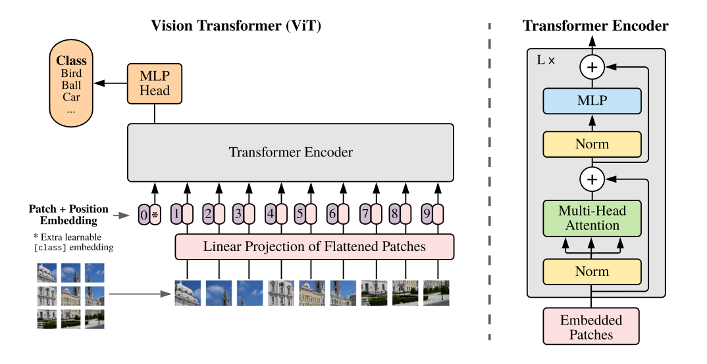

图 1：模型概述。 我们将图像分割成固定大小的块，线性嵌入每个块，添加位置嵌入，并将生成的向量序列馈送到标准的 Transformer 编码器。 为了执行分类，我们使用向序列添加额外可学习的“分类token”的标准方法。 Transformer 编码器的插图受到 Vaswani 等人的启发。 （2017）。

> Figure 1: Model overview. We split an image into fixed-size patches, linearly embed each of them, add position embeddings, and feed the resulting sequence of vectors to a standard Transformer encoder. In order to perform classification, we use the standard approach of adding an extra learnable “classification token” to the sequence. The illustration of the Transformer encoder was inspired by Vaswani et al. (2017).

### 3 METHOD

在模型设计中，我们尽可能地遵循原始的 Transformer (Vaswani et al., 2017)。 这种故意简单设置的一个优点是可扩展的 NLP Transformer 架构及其高效的实现几乎可以开箱即用。

> In model design we follow the original Transformer (Vaswani et al., 2017) as closely as possible. An advantage of this intentionally simple setup is that scalable NLP Transformer architectures – and their efficient implementations – can be used almost out of the box.

#### 3.1 VISION TRANSFORMER (VIT)

该模型的概述如图 1 所示。标准 Transformer 接收 1D 的token嵌入序列作为输入。 为了处理 2D 图像，我们将的图像

重塑为
})
的扁平 2D 块序列，其中 (H; W) 是原始图像的分辨率，C 是通道数 , (P,P) 是每个图像块的分辨率，

是生成的块数，也可以作为 Transformer 的有效输入序列长度。 Transformer 在其所有层中使用恒定的潜在向量大小 D，因此我们将补丁展平并使用可训练的线性投影映射到 D 维（方程式 1）。 我们将此投影的输出称为patch embeddings。

> An overview of the model is depicted in Figure 1. The standard Transformer receives as input a 1D HWC sequence of token embeddings. To handle 2D images, we reshape the image x 2 R                into a N(P2C) sequence of flattened 2D patches xp 2 R                , where (H; W) is the resolution of the original image, C is the number of channels, (P; P) is the resolution of each image patch, and N =HW=P2 is the resulting number of patches, which also serves as the effective input sequence length for the Transformer. The Transformer uses constant latent vector size D through all of its layers, so we flatten the patches and map to D dimensions with a trainable linear projection (Eq. 1). We refer to the output of this projection as the patch embeddings.

与 BERT 的 [class] token类似，我们在 嵌入序列之前添加一个可学习的embedding,

，其在 Transformer 编码器 输
)
出处的状态用作图像表示 y (Eq. 4）。 在预训练和微调期间，分类头都附加到

上。 分类头由 MLP 实现，在预训练时具有一个隐藏层，在微调时由单个线性层实现。

> Similar to BERT’s [class] token, we prepend a learnable embedding to the sequence of embed- = x ded patches (z0 0     class), whose state at the output of the Transformer encoder (z0L ) serves as the image representation y (Eq. 4). Both during pre-training and fine-tuning, a classification head is at- tached to z0L . The classification head is implemented by a MLP with one hidden layer at pre-training time and by a single linear layer at fine-tuning time.

位置embeddings被添加到patch embeddings中以保留位置信息。 我们使用标准的可学习 1D 位置嵌入，因为我们没有观察到使用更高级的 2D 感知位置嵌入带来的显着性能提升（附录 D.4）。 生成的嵌入向量序列用作编码器的输入。

> Position embeddings are added to the patch embeddings to retain positional information. We use standard learnable 1D position embeddings, since we have not observed significant performance gains from using more advanced 2D-aware position embeddings (Appendix D.4). The resulting sequence of embedding vectors serves as input to the encoder.

Transformer 编码器（Vaswani 等人，2017）由多头自注意力（MSA，见附录 A）和 MLP 块（等式 2、3）的交替层组成。 在每个块之前应用 Layernorm (LN)，在每个块之后应用残差连接 (Wang et al., 2019; Baevski & Auli, 2019)。

> The Transformer encoder (Vaswani et al., 2017) consists of alternating layers of multiheaded self- attention (MSA, see Appendix A) and MLP blocks (Eq. 2, 3). Layernorm (LN) is applied before every block, and residual connections after every block (Wang et al., 2019; Baevski & Auli, 2019).

MLP 包含两个具有 GELU 非线性的层。

> The MLP contains two layers with a GELU non-linearity.

**归纳偏置**。 我们注意到，与 CNN 相比，Vision Transformer 的图像特定归纳偏置要少得多。 在 CNN 中，局部性、二维邻域结构和平移等效性被强制作用到整个模型的每一层中。 在 ViT 中，只有 MLP 层是局部的和平移等变的，而自注意力层是全局的。 二维邻域结构的使用非常谨慎：在模型开始时通过将图像切割成块，并在微调时调整不同分辨率图像的位置嵌入（如下所述）。 除此之外，初始化时的位置嵌入不携带有关patch的 2D 位置的信息，并且必须从头开始学习patch之间的所有空间关系。

> **Inductive bias**. We note that Vision Transformer has much less image-specific inductive bias than CNNs. In CNNs, locality, two-dimensional neighborhood structure, and translation equivariance are baked into each layer throughout the whole model. In ViT, only MLP layers are local and transla- tionally equivariant, while the self-attention layers are global. The two-dimensional neighborhood structure is used very sparingly: in the beginning of the model by cutting the image into patches and at fine-tuning time for adjusting the position embeddings for images of different resolution (as de- scribed below). Other than that, the position embeddings at initialization time carry no information about the 2D positions of the patches and all spatial relations between the patches have to be learned from scratch.

**混合架构**。 作为原始图像patch的替代方案，输入序列可以由 CNN 的特征图形成（LeCun 等人，1989）。 在这个混合模型中，patch embedding投影 E（等式 1）应用于从 CNN 特征图中提取的patches。 作为一种特殊情况，patch 可以具有 1x1 的空间大小，这意味着输入序列是通过简单地将特征图的空间维度展平并投影到 Transformer 维度来获得的。 如上所述添加分类输入嵌入和位置嵌入。

> **Hybrid Architecture**. As an alternative to raw image patches, the input sequence can be formed from feature maps of a CNN (LeCun et al., 1989). In this hybrid model, the patch embedding projection E (Eq. 1) is applied to patches extracted from a CNN feature map. As a special case, the patches can have spatial size 1x1, which means that the input sequence is obtained by simply flattening the spatial dimensions of the feature map and projecting to the Transformer dimension. The classification input embedding and position embeddings are added as described above.

#### 3.2 FINE-TUNING AND HIGHER RESOLUTION

通常，我们在大型数据集上预训练 ViT，并微调到（较小的）下游任务。 为此，我们移除了预训练的预测头并附加了一个零初始化的 D x K 前馈层，其中 K 是下游分类的数量。 与预训练相比，以更高的分辨率进行微调通常是有益的（Touvron 等人，2019；Kolesnikov 等人，2020）。 当提供更高分辨率的图像时，我们保持patch大小相同，从而产生更大的有效序列长度。 Vision Transformer 可以处理任意序列长度（直至内存限制），但是，预训练的位置嵌入可能不再有意义。 因此，我们根据它们在原始图像中的位置对预训练的位置嵌入进行 2D 插值。 请注意，这种分辨率调整和patch提取，是将有关图像 2D 结构的直观差别手动引入 Vision Transformer的，唯一不同点。

> Typically, we pre-train ViT on large datasets, and fine-tune to (smaller) downstream tasks. For this, we remove the pre-trained prediction head and attach a zero-initialized D K feedforward layer, where K is the number of downstream classes. It is often beneficial to fine-tune at higher resolution than pre-training (Touvron et al., 2019; Kolesnikov et al., 2020). When feeding images of higher resolution, we keep the patch size the same, which results in a larger effective sequence length. The Vision Transformer can handle arbitrary sequence lengths (up to memory constraints), however, the pre-trained position embeddings may no longer be meaningful. We therefore perform 2D interpolation of the pre-trained position embeddings, according to their location in the original image. Note that this resolution adjustment and patch extraction are the only points at which an inductive bias about the 2D structure of the images is manually injected into the Vision Transformer.

#### 4 EXPERIMENTS

我们评估了 ResNet、Vision Transformer (ViT) 和混合的表示学习能力。 为了了解每个模型的数据要求，我们对不同大小的数据集进行预训练并评估许多基准任务。 在考虑预训练模型的计算成本时，ViT 表现非常出色，以较低的预训练成本在大多数识别基准上达到了最先进的水平。 最后，我们使用自我监督进行了一个小型实验，并表明自我监督的 ViT 对未来充满希望。

> We evaluate the representation learning capabilities of ResNet, Vision Transformer (ViT), and the hybrid. To understand the data requirements of each model, we pre-train on datasets of varying size and evaluate many benchmark tasks. When considering the computational cost of pre-training the model, ViT performs very favourably, attaining state of the art on most recognition benchmarks at a lower pre-training cost. Lastly, we perform a small experiment using self-supervision, and show that self-supervised ViT holds promise for the future.

##### 4.1 SETUP

**数据集**。 为了探索模型的可扩展性，我们使用具有 1k 类和 1.3M 张图像的 ILSVRC-2012 ImageNet 数据集（以下我们将其称为 ImageNet），它的超集 ImageNet-21k 具有 21k 类和 14M张图像（Deng et al., 2009 ) 和具有 18k 类和 303M 高分辨率图像的 JFT (Sun et al., 2017)。 我们对预训练数据集进行去重。 Kolesnikov 等人的下游任务的测试集。 （2020 年）。 我们将在这些数据集上训练的模型转移到几个基准任务：原始验证标签上的 ImageNet 和清理后的 RealL 标签（Beyer 等人，2020）、CIFAR-10/100（Krizhevsky，2009）、Oxford-IIIT Pets (Parkhi et al., 2012) 和 Oxford Flowers-102 (Nilsback & Zisserman, 2008)。 对于这些数据集，预处理遵循 Kolesnikov 等人。 （2020 年）。

> **Datasets**. To explore model scalability, we use the ILSVRC-2012 ImageNet dataset with 1k classes and 1.3M images (we refer to it as ImageNet in what follows), its superset ImageNet-21k with 21k classes and 14M images (Deng et al., 2009), and JFT (Sun et al., 2017) with 18k classes and 303M high-resolution images. We de-duplicate the pre-training datasets w.r.t. the test sets of the downstream tasks following Kolesnikov et al. (2020). We transfer the models trained on these dataset to several benchmark tasks: ImageNet on the original validation labels and the cleaned-up ReaL labels (Beyer et al., 2020), CIFAR-10/100 (Krizhevsky, 2009), Oxford-IIIT Pets (Parkhi et al., 2012), and Oxford Flowers-102 (Nilsback & Zisserman, 2008). For these datasets, pre-processing follows Kolesnikov et al. (2020).

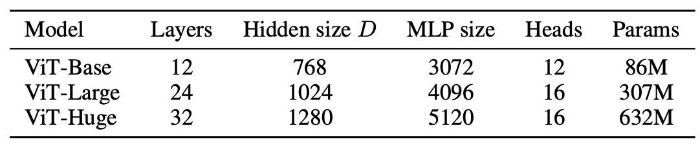

表 1：Vision Transformer 模型变体的详细信息。

我们还评估了 19 个任务 的VTAB 分类任务组（Zhai 等人，2019b）。 VTAB 评估向不同任务的低数据传输，每个任务使用 1000 个训练示例。 这些任务分为三组：普通 - 上述任务、宠物、CIFAR 等。专业 - 医学和卫星图像，以及结构化 - 需要几何理解的任务，如定位。

> We also evaluate on the 19-task VTAB classification suite (Zhai et al., 2019b). VTAB evaluates low-data transfer to diverse tasks, using 1 000 training examples per task. The tasks are divided into three groups: Natural – tasks like the above, Pets, CIFAR, etc. Specialized – medical and satellite imagery, and Structured – tasks that require geometric understanding like localization.

**模型变体**。 我们将 ViT 配置基于用于 BERT 的配置（Devlin 等人，2019 年），如表 1 所示。“Base”和“Large”模型直接来自 BERT，我们添加了更大的“Huge”模型。 在下文中，我们使用简短的符号来表示模型大小和输入补丁大小：例如，ViT-L/16 表示具有 16 x 16 的输入patch大小的“大”变体。 请注意，Transformer 的序列长度与块大小的平方成反比，因此块大小较小的模型计算成本更高。

> **Model Variants**. We base ViT configurations on those used for BERT (Devlin et al., 2019), as summarized in Table 1. The “Base” and “Large” models are directly adopted from BERT and we add the larger “Huge” model. In what follows we use brief notation to indicate the model size and the input patch size: for instance, ViT-L/16 means the “Large” variant with 16  16 input patch size. Note that the Transformer’s sequence length is inversely proportional to the square of the patch size, thus models with smaller patch size are computationally more expensive.

对于基线 CNN，我们使用 ResNet (He et al., 2016)，但将 Batch Normalization 层 (Ioffe & Szegedy, 2015) 替换为 Group Normalization (Wu & He, 2018)，并使用标准化卷积 (Qiao et 等人，2019）。 这些修改改进了transfer（Kolesnikov 等人，2020），我们将修改后的模型表示为“ResNet (BiT)”。 对于混合体，我们将中间特征图输入到 ViT 中，patch大小为一个“像素”。 为了试验不同的序列长度，我们要么（i）获取常规 ResNet50 的第 4 阶段的输出，要么（ii）移除第 4 阶段，在第 3 阶段放置相同数量的层（保持总层数），然后取 此扩展阶段 3 的输出。选项 (ii) 导致 4 倍更长的序列长度和更高开销的 ViT 模型。

> For the baseline CNNs, we use ResNet (He et al., 2016), but replace the Batch Normalization lay- ers (Ioffe & Szegedy, 2015) with Group Normalization (Wu & He, 2018), and used standardized convolutions (Qiao et al., 2019). These modifications improve transfer (Kolesnikov et al., 2020), and we denote the modified model “ResNet (BiT)”. For the hybrids, we feed the intermediate fea- ture maps into ViT with patch size of one “pixel”. To experiment with different sequence lengths, we either (i) take the output of stage 4 of a regular ResNet50 or (ii) remove stage 4, place the same number of layers in stage 3 (keeping the total number of layers), and take the output of this extended stage 3. Option (ii) results in a 4x longer sequence length, and a more expensive ViT model.

**训练和微调**。 我们使用 Adam (Kingma & Ba, 2015) 训练所有模型，包括 β1 =0:9, β2 =0:999，批大小为 4096，并应用 0:1 的高权重衰减，我们发现 对所有模型的迁移都很有用（附录 D.1 表明，与常见做法相比，在我们的设置中，Adam 对 ResNets 的工作略好于 SGD）。 我们使用线性学习率预热和衰减，详见附录 B.1。 对于微调，我们使用具有动量的 SGD，批量大小为 512，对于所有模型，请参阅附录 B.1.1。 对于表 2 中的 ImageNet 结果，我们在更高分辨率下进行了微调：ViT-L/16 为 512，ViT-H/14 为 518，并且还使用了 Polyak & Juditsky (1992) 的平均系数为 0:9999 (Ramachandran 等人，2019；王等人，2020b)。

> **Training & Fine-tuning.** We train all models, including ResNets, using Adam (Kingma & Ba, 2015) with 1 =0:9, 2 =0:999, a batch size of 4096 and apply a high weight decay of 0:1, which we found to be useful for transfer of all models (Appendix D.1 shows that, in contrast to common practices, Adam works slightly better than SGD for ResNets in our setting). We use a linear learning rate warmup and decay, see Appendix B.1 for details. For fine-tuning we use SGD with momentum, batch size 512, for all models, see Appendix B.1.1. For ImageNet results in Table 2, we fine-tuned at higher resolution: 512 for ViT-L/16 and 518 for ViT-H/14, and also used Polyak & Juditsky (1992) averaging with a factor of 0:9999 (Ramachandran et al., 2019; Wang et al., 2020b).

**指标。** 我们通过few-shot或微调精度报告下游数据集的结果。 在对相应数据集进行微调后，微调准确度可获得每个模型的较好性能。 通过解决，将训练图像子集的（冻结）表示，映射到正则化最小二乘回归到 {−1, 1}

目标向量的问题，来获得few-shot的准确度。 该公式使我们能够以封闭形式恢复精确解。 虽然我们主要关注微调性能，但有时我们使用线性few-shot精度来进行快速动态评估，而微调成本太高。

> **Metrics**. We report results on downstream datasets either through few-shot or fine-tuning accuracy. Fine-tuning accuracies capture the performance of each model after fine-tuning it on the respective dataset. Few-shot accuracies are obtained by solving a regularized least-squares regression problem that maps the (frozen) representation of a subset of training images to f 1; 1gK target vectors. This formulation allows us to recover the exact solution in closed form. Though we mainly focus on fine-tuning performance, we sometimes use linear few-shot accuracies for fast on-the-fly evaluation where fine-tuning would be too costly.

##### 4.2 COMPARISON TO STATE OF THE ART

我们首先将我们最大的模型——ViT-H/14 和 ViT-L/16——与文献中最先进的 CNN 进行比较。 第一个比较点是 Big Transfer (BiT) (Kolesnikov et al., 2020)，它使用大型 ResNets 执行监督迁移学习。 第二个是 Noisy Student (Xie et al., 2020)，它是一个大型 EfficientNet，使用 ImageNet 和 JFT-300M 上的半监督学习训练，去除了标签。 目前，Noisy Student 是 ImageNet 和 BiT-L 在此处报告的其他数据集上的最先进技术。 所有模型都在 TPUv3 硬件上进行了训练，我们报告了对每个模型进行预训练所花费的 TPUv3-核-天数，即用于训练的 TPU v3 核数（每个芯片 2 个）乘以训练时间天数。

> We first compare our largest models – ViT-H/14 and ViT-L/16 – to state-of-the-art CNNs from the literature. The first comparison point is Big Transfer (BiT) (Kolesnikov et al., 2020), which performs supervised transfer learning with large ResNets. The second is Noisy Student (Xie et al., 2020), which is a large EfficientNet trained using semi-supervised learning on ImageNet and JFT- 300M with the labels removed. Currently, Noisy Student is the state of the art on ImageNet and BiT-L on the other datasets reported here. All models were trained on TPUv3 hardware, and we report the number of TPUv3-core-days taken to pre-train each of them, that is, the number of TPU v3 cores (2 per chip) used for training multiplied by the training time in days.

表2显示了结果。 在 JFT-300M 上预训练的较小的 ViT-L/16 模型在所有任务上都优于 BiT-L（在同一数据集上预训练），同时训练所需的计算资源要少得多。 更大的模型 ViT-H/14 进一步提高了性能，尤其是在更具挑战性的数据集上——ImageNet、CIFAR-100 和 VTAB suit上。 有趣的是，与现有技术相比，模型进行预训练所需的计算量仍然大大减少。 然而，我们注意到预训练效率可能不仅受到架构选择的影响，还受到其他参数的影响，例如训练计划、优化器、权重衰减等。我们提供了针对不同的性能与计算的对照研究 4.4 节中的架构。 最后，在公共 ImageNet-21k 数据集上预训练的 ViT-L/16 模型在大多数数据集上也表现良好，同时预训练占用的资源更少：它可以使用具有 8 个核心的标准云 TPUv3 进行训练。 大约 30 天。

> Table 2 shows the results. The smaller ViT-L/16 model pre-trained on JFT-300M outperforms BiT-L (which is pre-trained on the same dataset) on all tasks, while requiring substantially less computa- tional resources to train. The larger model, ViT-H/14, further improves the performance, especially on the more challenging datasets – ImageNet, CIFAR-100, and the VTAB suite. Interestingly, this model still took substantially less compute to pre-train than prior state of the art. However, we note that pre-training efficiency may be affected not only by the architecture choice, but also other pa- rameters, such as training schedule, optimizer, weight decay, etc. We provide a controlled study of performance vs. compute for different architectures in Section 4.4. Finally, the ViT-L/16 model pre-trained on the public ImageNet-21k dataset performs well on most datasets too, while taking fewer resources to pre-train: it could be trained using a standard cloud TPUv3 with 8 cores in ap- proximately 30 days.

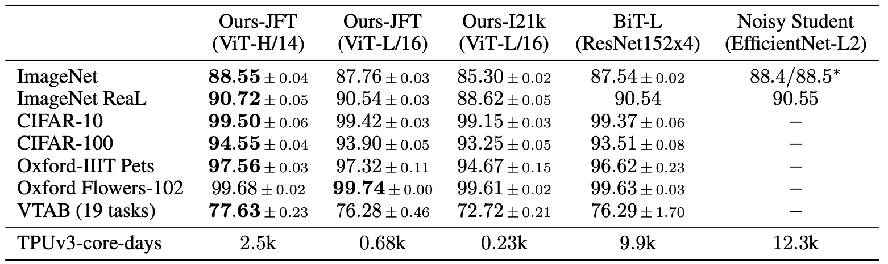

表 2：在主流的图像分类基准上与现有技术的比较。 我们报告了精度的平均值和标准偏差，是三次微调运行的平均值。 在 JFT-300M 数据集上预训练的 Vision Transformer 模型在所有数据集上都优于基于 ResNet 的基线，同时预训练所需的计算资源大大减少。 在较小的公开 ImageNet-21k 数据集上预训练的 ViT 也表现良好。 ∗Touvron 等人报告的 88:5% 结果略有改善。 （2020 年）。

> Table 2: Comparison with state of the art on popular image classification benchmarks. We re- port mean and standard deviation of the accuracies, averaged over three fine-tuning runs. Vision Transformer models pre-trained on the JFT-300M dataset outperform ResNet-based baselines on all datasets, while taking substantially less computational resources to pre-train. ViT pre-trained on the smaller public ImageNet-21k dataset performs well too. Slightly improved 88:5% result reported in Touvron et al. (2020).

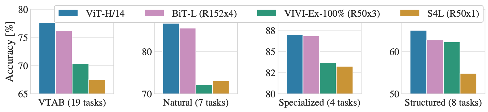

图 2：*普通*、*专业*和*结构化*任务组中的 VTAB 性能细分。

> Figure 2: Breakdown of VTAB performance in *Natural*, *Specialized*, and *Structured* task groups.

图 2 将 VTAB 任务分解为各自的组，并在此基准上与之前的 SOTA 方法进行了比较：BiT、VIVI——在 ImageNet 和 Youtube 上共同训练的 ResNet（Tschannen 等人，2020）和 S4L——监督加半 ImageNet 上的监督学习（Zhai 等人，2019a）。 ViT-H/14 在自然和结构化任务上优于 BiT-R152x4 和其他方法。 在 Specialized 上，前两个模型的性能相似。

> Figure 2 decomposes the VTAB tasks into their respective groups, and compares to previous SOTA methods on this benchmark: BiT, VIVI – a ResNet co-trained on ImageNet and Youtube (Tschannen et al., 2020), and S4L – supervised plus semi-supervised learning on ImageNet (Zhai et al., 2019a). ViT-H/14 outperforms BiT-R152x4, and other methods, on the Natural and Structured tasks. On the Specialized the performance of the top two models is similar.

##### 4.3 PRE-TRAINING DATA REQUIREMENTS

Vision Transformer 在大型 JFT-300M 数据集上进行预训练时表现良好。 与 ResNets 相比，视觉的归纳偏置更少，数据集大小有多重要？ 我们进行了两个系列的实验。

> The Vision Transformer performs well when pre-trained on a large JFT-300M dataset. With fewer inductive biases for vision than ResNets, how crucial is the dataset size? We perform two series of experiments.

首先，我们在不断增加的数据集上预训练 ViT 模型：ImageNet、ImageNet-21k 和 JFT-300M。 为了提高较小数据集的性能，我们优化了三个基本的正则化参数——权重衰减、dropout和标签平滑。 图 3 显示了微调到 ImageNet 后的结果（其他数据集的结果如表 5 所示）2。 在最小的数据集 ImageNet 上进行预训练时，尽管有（中等）正则化，但 ViT-Large 模型与 ViT-Base 模型相比表现不佳。 通过 ImageNet-21k 预训练，它们的表现相似。 只有使用 JFT-300M，我们才能看到更大型号的全部优势。 图 3 还显示了，由不同大小的 BiT 模型跨越的性能区域。 BiT CNN 在 ImageNet 上的表现优于 ViT，但在更大的数据集上，ViT 反超了。

> First, we pre-train ViT models on datasets of increasing size: ImageNet, ImageNet-21k, and JFT- 300M. To boost the performance on the smaller datasets, we optimize three basic regularization parameters – weight decay, dropout, and label smoothing. Figure 3 shows the results after fine- tuning to ImageNet (results on other datasets are shown in Table 5)2. When pre-trained on the smallest dataset, ImageNet, ViT-Large models underperform compared to ViT-Base models, despite (moderate) regularization. With ImageNet-21k pre-training, their performances are similar. Only with JFT-300M, do we see the full benefit of larger models. Figure 3 also shows the performance region spanned by BiT models of different sizes. The BiT CNNs outperform ViT on ImageNet, but with the larger datasets, ViT overtakes.

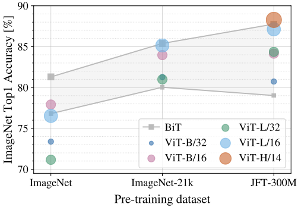

图 3：迁移到 ImageNet。 虽然大型 ViT 模型在小型数据集上进行预训练时的性能比 BiT ResNets（阴影区域）差，但在大型数据集上进行预训练时它们表现出色。 同样，随着数据集的增长，较大的 ViT 变体会超过较小的变体。

> Figure 3: Transfer to ImageNet. While Figure 4: Linear few-shot evaluation on Ima- large ViT models perform worse than BiT geNet versus pre-training size. ResNets per- ResNets (shaded area) when pre-trained on form better with smaller pre-training datasets small datasets, they shine when pre-trained on but plateau sooner than ViT, which performs larger datasets. Similarly, larger ViT variants better with larger pre-training. ViT-b is ViT-B overtake smaller ones as the dataset grows.

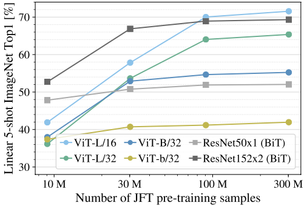

图 4：ImageNet 上的线性少样本评估与预训练大小。 ResNets 在较小的预训练数据集上表现更好，但比 ViT 更快地达到稳定状态，而 ViT 在较大的预训练中表现更好。 ViT-b 是所有隐藏维度减半的 ViT-B。

> Figure 4: Linear few-shot evaluation on Ima- geNet versus pre-training size. ResNets per- form better with smaller pre-training datasets but plateau sooner than ViT, which performs better with larger pre-training. ViT-b is ViT-B with all hidden dimensions halved.

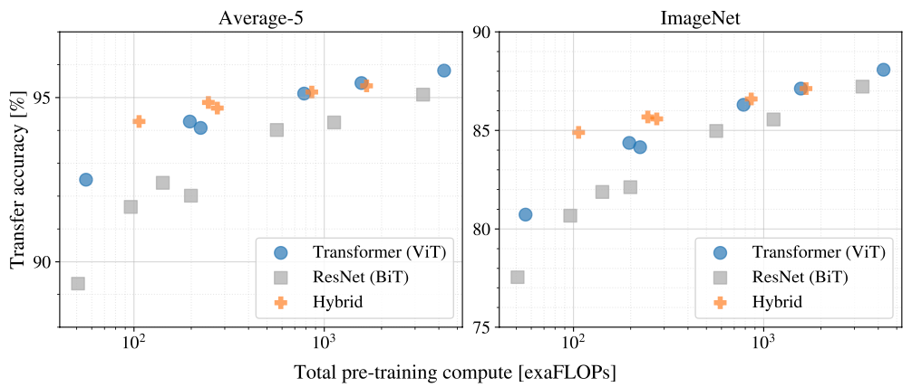

图 5：不同架构的性能与预训练计算量和关系：Vision Transformers、ResNet 和混合模型。 在计算开销相同的情况下，Vision Transformer 的性能通常优于 ResNet。 对于较小的模型尺寸，混合模型超过了纯 Transformer，但对于较大的模型，差距消失了。

> Figure 5: Performance versus pre-training compute for different architectures: Vision Transformers, ResNets, and hybrids. Vision Transformers generally outperform ResNets with the same compu- tational budget. Hybrids improve upon pure Transformers for smaller model sizes, but the gap vanishes for larger models.

其次，我们在 9M、30M 和 90M 的随机子集以及完整的 JFT-300M 数据集上训练我们的模型。我们不对较小的子集执行额外的正则化，并对所有设置使用相同的超参数。通过这种方式，我们评估了模型的内在属性，而不是正则化的影响。但是，我们确实使用了early-stopping提前停止，并报告了在训练期间实现的最佳验证准确度。为了节省计算，我们报告few-shot线性精度而不是完全微调精度。图 4 包含结果。 Vision Transformers 比 ResNets 过拟合，在较小的数据集上具有相当的计算成本。例如，ViT-B/32 比 ResNet50 稍快；它在 9M 子集上表现更差，但在 90M+ 子集上表现更好。 ResNet152x2 和 ViT-L/16 也是如此。这一结果强化了这样一种直觉，即卷积归纳偏置对较小的数据集很有用，但对于较大的数据集，直接从数据中学习相关模式就足够了，甚至是有益的。

> Second, we train our models on random subsets of 9M, 30M, and 90M as well as the full JFT- 300M dataset. We do not perform additional regularization on the smaller subsets and use the same hyper-parameters for all settings. This way, we assess the intrinsic model properties, and not the effect of regularization. We do, however, use early-stopping, and report the best validation accuracy achieved during training. To save compute, we report few-shot linear accuracy instead of full fine- tuning accuracy. Figure 4 contains the results. Vision Transformers overfit more than ResNets with comparable computational cost on smaller datasets. For example, ViT-B/32 is slightly faster than ResNet50; it performs much worse on the 9M subset, but better on 90M+ subsets. The same is true for ResNet152x2 and ViT-L/16. This result reinforces the intuition that the convolutional inductive bias is useful for smaller datasets, but for larger ones, learning the relevant patterns directly from data is sufficient, even beneficial.

总体而言，ImageNet 上的few-shot结果（图 4）以及 VTAB 上的低数据结果（表 2）似乎对于非常低的数据传输很有希望。 进一步分析 ViT 的few-shot特性是未来工作的一个令人兴奋的方向。

> Overall, the few-shot results on ImageNet (Figure 4), as well as the low-data results on VTAB (Table 2) seem promising for very low-data transfer. Further analysis of few-shot properties of ViT is an exciting direction of future work.

##### 4.4 SCALING STUDY

我们通过评估 JFT-300M 的迁移性能，来对不同模型进行控制规模研究。 在这种情况下，数据大小不会成为模型性能的瓶颈，我们会评估每个模型的性能与预训练成本。 模型集包括：7个ResNets，R50x1，R50x2 R101x1，R152x1，R152x2，预训练7个epoch，加上R152x2和R200x3预训练14个epoch； 6 个Vision Transformers，ViT-B/32、B/16、L/32、L/16，预训练了 7 个 epoch，加上 L/16 和 H/14 预训练了 14 个 epoch； 和 5 个混合模型，R50+ViT-B/32、B/16、L/32、L/16 预训练 7 个 epoch，加上 R50+ViT-L/16 预训练 14 个 epoch（对于混合模型，名称末尾的数不是块大小，而是 ResNet 骨干网中的总下采样率）。

> We perform a controlled scaling study of different models by evaluating transfer performance from JFT-300M. In this setting data size does not bottleneck the models’ performances, and we assess performance versus pre-training cost of each model. The model set includes: 7 ResNets, R50x1, R50x2 R101x1, R152x1, R152x2, pre-trained for 7 epochs, plus R152x2 and R200x3 pre-trained for 14 epochs; 6 Vision Transformers, ViT-B/32, B/16, L/32, L/16, pre-trained for 7 epochs, plus L/16 and H/14 pre-trained for 14 epochs; and 5 hybrids, R50+ViT-B/32, B/16, L/32, L/16 pre- trained for 7 epochs, plus R50+ViT-L/16 pre-trained for 14 epochs (for hybrids, the number at the end of the model name stands not for the patch size, but for the total dowsampling ratio in the ResNet backbone).

图 5 包含传输性能与总预训练计算的关系（有关计算成本的详细信息，请参见附录 D.5）。 每个模型的详细结果在附录的表 6 中提供。 可以观察到一些模式。 首先，Vision Transformers 在性能/计算权衡上超过 ResNet。 ViT 使用大约 2-4 倍更少的计算，来获得相同的性能（平均超过 5 个数据集）。 其次，在较小的计算预算下，混合模型的性能略优于 ViT，但对于较大的模型，差异就消失了。 这个结果有点令人惊讶，因为人们可能期望卷积局部特征处理可以帮助任何大小的 ViT。 第三，Vision Transformers 似乎没有在测试过的范围内饱和，这点激励未来的更多研究。

> Figure 5 contains the transfer performance versus total pre-training compute (see Appendix D.5 for details on computational costs). Detailed results per model are provided in Table 6 in the Ap- pendix. A few patterns can be observed. First, Vision Transformers dominate ResNets on the performance/compute trade-off. ViT uses approximately 2-4 less compute to attain the same performance (average over 5 datasets). Second, hybrids slightly outperform ViT at small compu- tational budgets, but the difference vanishes for larger models. This result is somewhat surprising, since one might expect convolutional local feature processing to assist ViT at any size. Third, Vision Transformers appear not to saturate within the range tried, motivating future scaling efforts.

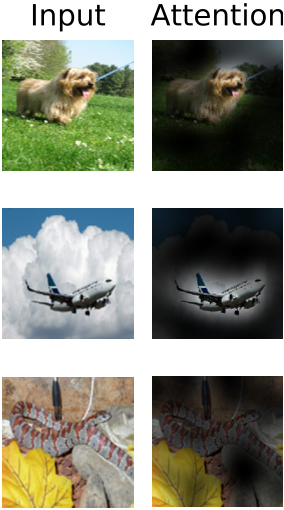

图 6：从输出token到输入空间的代表性示例。 详见附录 D.7。

> Figure 6: Representative examples of attention from the output toke to the input space. See Appendix D.7 for details.

##### 4.5 INSPECTING VISION TRANSFORMER

为了开始了解 Vision Transformer 如何处理图像数据，我们分析了它的内部表示。 Vision Transformer 的第一层将展平的patches线性投影到低维空间（方程式 1）。 图 7（左）显示了学习嵌入过滤器的主要主要组件。 这些组件类似于合理的基础函数，用于每个patches内精细结构的低维表示。

> To begin to understand how the Vision Transformer processes im- age data, we analyze its internal representations. The first layer of the Vision Transformer linearly projects the flattened patches into a lower-dimensional space (Eq. 1). Figure 7 (left) shows the top prin- cipal components of the the learned embedding filters. The com- ponents resemble plausible basis functions for a low-dimensional representation of the fine structure within each patch.

在投影之后，将学习的位置嵌入添加到patch表示中。 图 7（中）显示该模型学习在位置嵌入的相似性中对图像内的距离进行编码，即更接近的块往往具有更相似的位置嵌入。 进一步，出现了行列结构； 同一行/列中的patch具有相似的嵌入。 最后，对于较大的网格，有时会出现正弦结构（附录 D）。 位置嵌入的学习，表明 2D 图像分类任务中，为什么手工制作的 2D 感知嵌入变体不会产生改进（附录 D.4）。

> After the projection, a learned position embedding is added to the patch representations. Figure 7 (center) shows that the model learns to encode distance within the image in the similarity of position em- beddings, i.e. closer patches tend to have more similar position em- beddings. Further, the row-column structure appears; patches in the same row/column have similar embeddings. Finally, a sinusoidal structure is sometimes apparent for larger grids (Appendix D). That the position embeddings learn to represent 2D image topology ex- plains why hand-crafted 2D-aware embedding variants do not yield improvements (Appendix D.4).

Self-attention 允许 ViT 整合整个图 6 中的信息：即使在最低层也有代表性交换。我们调查了网络对这种能力的充分关注程度。具体来说，我们计算输出token到输入图像空间中的平均距离，其中信息是空间。基于注意力权重的集成参见附录 D.7（图 7，右）。这个细节。 “注意距离”类似于 CNN 中的感受野大小。我们发现在最低层中，一些heads已经关注了大部分图像，这表明模型确实使用了全局集成信息的能力。其他注意力heads在低层的注意力距离始终很小。这种高度局部化的注意力在在 Transformer 之前应用 ResNet 的混合模型中不太明显（图 7，右），这表明它可能具有与 CNN 中的早期卷积层类似的功能。此外，注意力距离随着网络深度的增加而增加。在全局范围内，我们发现该模型关注与分类语义相关的图像区域（图 6）。

> Self-attention allows ViT to integrate information across the entire Figure 6: Representative ex- image even in the lowest layers. We investigate to what degree amples of attention from the the network makes use of this capability. Specifically, we compute output token to the input the average distance in image space across which information is space. See Appendix D.7 for integrated, based on the attention weights (Figure 7, right). This details. “attention distance” is analogous to receptive field size in CNNs. We find that some heads attend to most of the image already in the lowest layers, showing that the ability to integrate information globally is indeed used by the model. Other attention heads have consistently small attention distances in the low layers. This highly localized attention is less pronounced in hybrid models that apply a ResNet before the Transformer (Figure 7, right), suggesting that it may serve a similar function as early convolutional layers in CNNs. Further, the attention distance increases with network depth. Globally, we find that the model attends to image regions that are semantically relevant for classification (Figure 6).

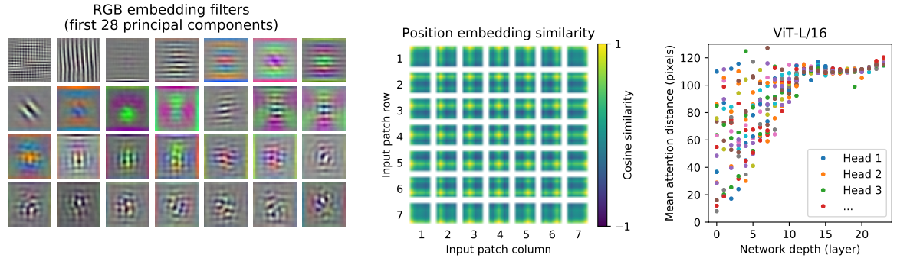

图 7：左：ViT-L/32 的 RGB 值的初始线性嵌入过滤器。 中：ViT-L/32 位置嵌入（position embeddings）的相似性。 图块显示具有指定行列的patch的位置嵌入与所有其他patch的位置嵌入，之间的余弦相似性。 右图：按头部和网络深度划分的参与区域大小。 每个点显示了一层 16 个头部之一的图像间的平均注意力距离。 详见附录 D.7。

> Figure 7: Left: Filters of the initial linear embedding of RGB values of ViT-L/32. Center: Sim- ilarity of position embeddings of ViT-L/32. Tiles show the cosine similarity between the position embedding of the patch with the indicated row and column and the position embeddings of all other patches. Right: Size of attended area by head and network depth. Each dot shows the mean attention distance across images for one of 16 heads at one layer. See Appendix D.7 for details.

##### 4.6 SELF-SUPERVISION

Transformers 在 NLP 任务上表现出令人印象深刻的表现。 然而，它们的大部分成功不仅源于其出色的可扩展性，还源于大规模的自我监督预训练（Devlin 等人，2019；Radford 等人，2018）。 我们还对用于自我监督的掩码patch预测进行了初步探索，模仿了 BERT 中使用的掩码语言建模任务。 通过自我监督预训练，我们较小的 ViT-B/16 模型在 ImageNet 上实现了 79.9% 的准确率，比从头开始训练显着提高了 2%，但仍落后于监督预训练 4%。 附录 B.1.2 包含更多细节。 我们将对比预训练的探索（Chen 等人，2020b；He 等人，2020；Bachman 等人，2019；H'enaff 等人，2020）留给未来的工作。

> Transformers show impressive performance on NLP tasks. However, much of their success stems not only from their excellent scalability but also from large scale self-supervised pre-training (Devlin et al., 2019; Radford et al., 2018). We also perform a preliminary exploration on masked patch prediction for self-supervision, mimicking the masked language modeling task used in BERT. With self-supervised pre-training, our smaller ViT-B/16 model achieves 79.9% accuracy on ImageNet, a significant improvement of 2% to training from scratch, but still 4% behind supervised pre-training. Appendix B.1.2 contains further details. We leave exploration of contrastive pre-training (Chen et al., 2020b; He et al., 2020; Bachman et al., 2019; H´enaff et al., 2020) to future work.

#### 5 CONCLUSION

我们已经探索了Transformers在图像识别中的直接应用。 与在计算机视觉中使用自注意力的先前工作不同，除了初始patch提取步骤之外，我们不会将特定于图像的归纳偏差引入架构中。 相反，我们将图像解释为一系列patch，并通过 NLP 中使用的标准 Transformer 编码器对其进行处理。 这种简单但可扩展的策略在与大型数据集的预训练相结合时效果出奇地好。 因此，Vision Transformer 在许多图像分类数据集上匹配或超过了现有技术，同时预训练相对便宜。

> We have explored the direct application of Transformers to image recognition. Unlike prior works using self-attention in computer vision, we do not introduce image-specific inductive biases into the architecture apart from the initial patch extraction step. Instead, we interpret an image as a sequence of patches and process it by a standard Transformer encoder as used in NLP. This simple, yet scalable, strategy works surprisingly well when coupled with pre-training on large datasets. Thus, Vision Transformer matches or exceeds the state of the art on many image classification datasets, whilst being relatively cheap to pre-train.

尽管这些初步结果令人鼓舞，但仍然存在许多挑战。 一种是将 ViT 应用于其他计算机视觉任务，例如检测和分割。 我们的结果，再加上 Carion 等人的结果。 （2020），表明这种方法的信心。 另一个挑战是继续探索自我监督的预训练方法。 我们最初的实验显示了自监督预训练的改进，但自监督和大规模监督预训练之间仍然存在很大差距。 最后，进一步扩展 ViT 可能会提高性能。

> While these initial results are encouraging, many challenges remain. One is to apply ViT to other computer vision tasks, such as detection and segmentation. Our results, coupled with those in Carion et al. (2020), indicate the promise of this approach. Another challenge is to continue exploring self- supervised pre-training methods. Our initial experiments show improvement from self-supervised pre-training, but there is still large gap between self-supervised and large-scale supervised pre- training. Finally, further scaling of ViT would likely lead to improved performance.

#### ACKNOWLEDGEMENTS

本文工作在柏林、Zürich 和阿姆斯特丹进行。 我们感谢 Google 的许多同事提供的帮助，特别是 Andreas Steiner 在基础架构和代码的开源发布方面提供的重要帮助； Joan Puigcerver 和 Maxim Neumann 寻求大型培训基础设施的帮助； Dmitry Lepikhin、Aravindh Mahendran、Daniel Keysers、Mario Lucˇić、Noam Shazeer、Ashish Vaswani 和 Colin Raffel 进行了有益的讨论。

> The work was performed in Berlin, Zu ̈rich, and Amsterdam. We thank many colleagues at Google for their help, in particular Andreas Steiner for crucial help with the infrastructure and the open- source release of the code; Joan Puigcerver and Maxim Neumann for help with the large-scale training infrastructure; Dmitry Lepikhin, Aravindh Mahendran, Daniel Keysers, Mario Lucˇic ́, Noam Shazeer, Ashish Vaswani, and Colin Raffel for useful discussions.

#### REFERENCES

> Philip Bachman, R Devon Hjelm, and William Buchwalter. Learning representations by maximizing mutual information across views. In NeurIPS, 2019.

> Alexei Baevski and Michael Auli. Adaptive input representations for neural language modeling. In ICLR, 2019.

> I. Bello, B. Zoph, Q. Le, A. Vaswani, and J. Shlens. Attention augmented convolutional networks. In ICCV, 2019.

> Lucas Beyer, Olivier J. H´enaff, Alexander Kolesnikov, Xiaohua Zhai, and A¨aron van den Oord. Are we done with imagenet? arXiv, 2020.

> Tom B Brown, Benjamin Mann, Nick Ryder, Melanie Subbiah, Jared Kaplan, Prafulla Dhariwal, Arvind Neelakantan, Pranav Shyam, Girish Sastry, Amanda Askell, et al. Language models are few-shot learners. arXiv, 2020.

> Nicolas Carion, Francisco Massa, Gabriel Synnaeve, Nicolas Usunier, Alexander Kirillov, and Sergey Zagoruyko. End-to-end object detection with transformers. In ECCV, 2020.

> Mark Chen, Alec Radford, Rewon Child, Jeff Wu, and Heewoo Jun. Generative pretraining from pixels. In ICML, 2020a.

> Ting Chen, Simon Kornblith, Mohammad Norouzi, and Geoffrey E. Hinton. A simple framework for contrastive learning of visual representations. In ICML, 2020b.

> Yen-Chun Chen, Linjie Li, Licheng Yu, Ahmed El Kholy, Faisal Ahmed, Zhe Gan, Yu Cheng, and Jingjing Liu. UNITER: UNiversal Image-TExt Representation Learning. In ECCV, 2020c.

> Rewon Child, Scott Gray, Alec Radford, and Ilya Sutskever. Generating long sequences with sparse transformers. arXiv, 2019.

> Jean-Baptiste Cordonnier, Andreas Loukas, and Martin Jaggi. On the relationship between self- attention and convolutional layers. In ICLR, 2020.

> J. Deng, W. Dong, R. Socher, L. Li, Kai Li, and Li Fei-Fei. Imagenet: A large-scale hierarchical image database. In CVPR, 2009.

> Jacob Devlin, Ming-Wei Chang, Kenton Lee, and Kristina Toutanova. BERT: Pre-training of deep bidirectional transformers for language understanding. In NAACL, 2019.

> Josip Djolonga, Jessica Yung, Michael Tschannen, Rob Romijnders, Lucas Beyer, Alexander Kolesnikov, Joan Puigcerver, Matthias Minderer, Alexander D’Amour, Dan Moldovan, Sylvan Gelly, Neil Houlsby, Xiaohua Zhai, and Mario Lucic. On robustness and transferability of convo- lutional neural networks. arXiv, 2020.

> Kaiming He, Xiangyu Zhang, Shaoqing Ren, and Jian Sun. Deep residual learning for image recog- nition. In CVPR, 2016.

> Kaiming He, Haoqi Fan, Yuxin Wu, Saining Xie, and Ross Girshick. Momentum contrast for unsupervised visual representation learning. In CVPR, 2020.

> Jonathan Ho, Nal Kalchbrenner, Dirk Weissenborn, and Tim Salimans. Axial attention in multidi- mensional transformers. arXiv, 2019.

> Han Hu, Jiayuan Gu, Zheng Zhang, Jifeng Dai, and Yichen Wei. Relation networks for object detection. In CVPR, 2018.

> Han Hu, Zheng Zhang, Zhenda Xie, and Stephen Lin. Local relation networks for image recognition. In ICCV, 2019.

> Zilong Huang, Xinggang Wang, Yunchao Wei, Lichao Huang, Humphrey Shi, Wenyu Liu, and Thomas S. Huang. Ccnet: Criss-cross attention for semantic segmentation. In ICCV, 2020.

> Olivier J. H´enaff, Aravind Srinivas, Jeffrey De Fauw, Ali Razavi, Carl Doersch, S. M. Ali Eslami, and Aaron van den Oord. Data-efficient image recognition with contrastive predictive coding. In ICML, 2020.

> 11 Published as a conference paper at ICLR 2021

> Sergey Ioffe and Christian Szegedy. Batch normalization: Accelerating deep network training by reducing internal covariate shift. 2015.

> Alexander Kolesnikov, Lucas Beyer, Xiaohua Zhai, Joan Puigcerver, Jessica Yung, Sylvain Gelly, and Neil Houlsby. Big transfer (BiT): General visual representation learning. In ECCV, 2020.

> Alex Krizhevsky, Ilya Sutskever, and Geoffrey E. Hinton. Imagenet classification with deep convo- lutional neural networks. In NIPS, 2012.

> Y. LeCun, B. Boser, J. Denker, D. Henderson, R. Howard, W. Hubbard, and L. Jackel. Backpropa- gation applied to handwritten zip code recognition. Neural Computation, 1:541–551, 1989.

> Dmitry Lepikhin, HyoukJoong Lee, Yuanzhong Xu, Dehao Chen, Orhan Firat, Yanping Huang, Maxim Krikun, Noam Shazeer, and Zhifeng Chen. Gshard: Scaling giant models with conditional computation and automatic sharding. arXiv, 2020.

> Liunian Harold Li, Mark Yatskar, Da Yin, Cho-Jui Hsieh, and Kai-Wei Chang. VisualBERT: A Simple and Performant Baseline for Vision and Language. In Arxiv, 2019.

> Francesco Locatello, Dirk Weissenborn, Thomas Unterthiner, Aravindh Mahendran, Georg Heigold, Jakob Uszkoreit, Alexey Dosovitskiy, and Thomas Kipf. Object-centric learning with slot atten- tion. arXiv, 2020.

> Jiasen Lu, Dhruv Batra, Devi Parikh, and Stefan Lee. ViLBERT: Pretraining Task-Agnostic Visi- olinguistic Representations for Vision-and-Language Tasks. In NeurIPS. 2019.

> Dhruv Mahajan, Ross Girshick, Vignesh Ramanathan, Kaiming He, Manohar Paluri, Yixuan Li, Ashwin Bharambe, and Laurens van der Maaten. Exploring the limits of weakly supervised pretraining. In ECCV, 2018.

> M. Nilsback and A. Zisserman. Automated flower classification over a large number of classes. In ICVGIP, 2008.

> Omkar M. Parkhi, Andrea Vedaldi, Andrew Zisserman, and C. V. Jawahar. Cats and dogs. In CVPR, 2012.

> Niki Parmar, Ashish Vaswani, Jakob Uszkoreit, Lukasz Kaiser, Noam Shazeer, Alexander Ku, and Dustin Tran. Image transformer. In ICML, 2018.

> B. T. Polyak and A. B. Juditsky. Acceleration of stochastic approximation by averaging. SIAM Journal on Control and Optimization, 30(4):838–855, 1992. doi: 10.1137/0330046. URL https://doi.org/10.1137/0330046.

> Siyuan Qiao, Huiyu Wang, Chenxi Liu, Wei Shen, and Alan Yuille. Weight standardization. arXiv preprint arXiv:1903.10520, 2019.

> Alec Radford, Karthik Narasimhan, Tim Salimans, and Ilya Sutskever. Improving language under- standing with unsupervised learning. Technical Report, 2018.

> Alec Radford, Jeff Wu, Rewon Child, David Luan, Dario Amodei, and Ilya Sutskever. Language models are unsupervised multitask learners. Technical Report, 2019.

> Prajit Ramachandran, Niki Parmar, Ashish Vaswani, Irwan Bello, Anselm Levskaya, and Jon Shlens. Stand-alone self-attention in vision models. In NeurIPS, 2019.

> Chen Sun, Abhinav Shrivastava, Saurabh Singh, and Abhinav Gupta. Revisiting unreasonable ef- fectiveness of data in deep learning era. In ICCV, 2017.

> Chen Sun, Austin Myers, Carl Vondrick, Kevin Murphy, and Cordelia Schmid. Videobert: A joint model for video and language representation learning. In ICCV, 2019.

> 12 Published as a conference paper at ICLR 2021

> Hugo Touvron, Andrea Vedaldi, Matthijs Douze, and Herve Jegou. Fixing the train-test resolution discrepancy. In NeurIPS. 2019.

> Hugo Touvron, Andrea Vedaldi, Matthijs Douze, and Herve Jegou. Fixing the train-test resolution discrepancy: Fixefficientnet. arXiv preprint arXiv:2003.08237, 2020.

> Michael Tschannen, Josip Djolonga, Marvin Ritter, Aravindh Mahendran, Neil Houlsby, Sylvain Gelly, and Mario Lucic. Self-supervised learning of video-induced visual invariances. In Pro- ceedings of the IEEE/CVF Conference on Computer Vision and Pattern Recognition (CVPR), June 2020.

> Ashish Vaswani, Noam Shazeer, Niki Parmar, Jakob Uszkoreit, Llion Jones, Aidan N Gomez, Łukasz Kaiser, and Illia Polosukhin. Attention is all you need. In NIPS, 2017.

> Huiyu Wang, Yukun Zhu, Bradley Green, Hartwig Adam, Alan Yuille, and Liang-Chieh Chen. Axial-deeplab: Stand-alone axial-attention for panoptic segmentation. In ECCV, 2020a.

> Huiyu Wang, Yukun Zhu, Bradley Green, Hartwig Adam, Alan Yuille, and Liang-Chieh Chen. Axial-deeplab: Stand-alone axial-attention for panoptic segmentation. arXiv preprint arXiv:2003.07853, 2020b.

> Qiang Wang, Bei Li, Tong Xiao, Jingbo Zhu, Changliang Li, Derek F. Wong, and Lidia S. Chao. Learning deep transformer models for machine translation. In ACL, 2019.

> Xiaolong Wang, Ross Girshick, Abhinav Gupta, and Kaiming He. Non-local neural networks. In CVPR, 2018.

> Dirk Weissenborn, Oscar T¨ackstr ¨ om, and Jakob Uszkoreit. Scaling autoregressive video models. In ICLR, 2019.

> Bichen Wu, Chenfeng Xu, Xiaoliang Dai, Alvin Wan, Peizhao Zhang, Masayoshi Tomizuka, Kurt Keutzer, and Peter Vajda. Visual transformers: Token-based image representation and processing for computer vision. arxiv, 2020.

> Qizhe Xie, Minh-Thang Luong, Eduard Hovy, and Quoc V. Le. Self-training with noisy student improves imagenet classification. In CVPR, 2020.

> Xiaohua Zhai, Avital Oliver, Alexander Kolesnikov, and Lucas Beyer. S4L: Self-Supervised Semi- Supervised Learning. In ICCV, 2019a.

> Xiaohua Zhai, Joan Puigcerver, Alexander Kolesnikov, Pierre Ruyssen, Carlos Riquelme, Mario Lucic, Josip Djolonga, Andre Susano Pinto, Maxim Neumann, Alexey Dosovitskiy, et al. A large-scale study of representation learning with the visual task adaptation benchmark. arXiv preprint arXiv:1910.04867, 2019b.

> Hengshuang Zhao, Jiaya Jia, and Vladlen Koltun. Exploring self-attention for image recognition. In CVPR, 2020.

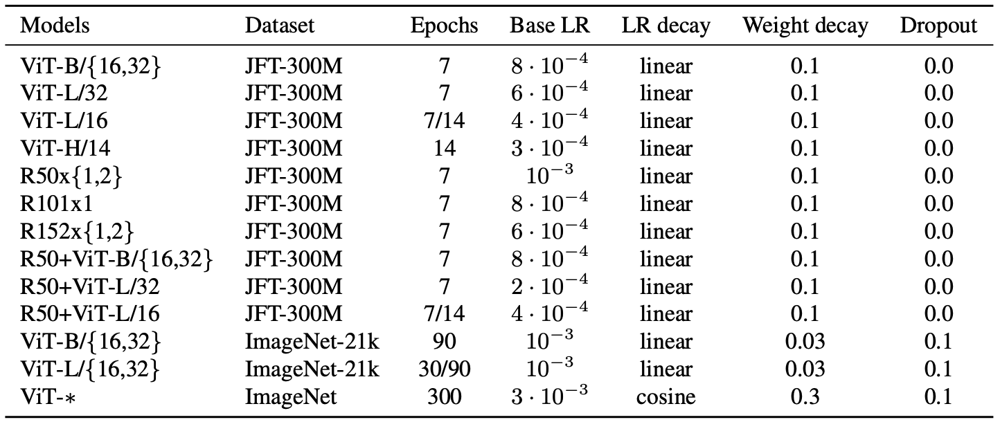

表 3：训练的超参数。 所有模型都以 4096 的批大小和 10k 步的学习率预热进行训练。 对于 ImageNet，我们发现在全局范数 1 处额外应用梯度裁剪是有益的。训练分辨率为 224。

> Table 3: Hyperparameters for training. All models are trained with a batch size of 4096 and learn- ing rate warmup of 10k steps. For ImageNet we found it beneficial to additionally apply gradient clipping at global norm 1. Training resolution is 224.

### APPENDIX

#### A MULTIHEAD SELF-ATTENTION

标准 qkv self-attention (SA, Vaswani et al. (2017)) 是一种流行的神经架构构建块。 对于输入序列

 中的每个元素，我们计算序列中所有值 v 的加权和。 注意力权重 

 基于序列的两个元素及其各自的查询 

和关键 

 表示之间的成对相似性。

> Standard qkv self-attention (SA, Vaswani et al. (2017)) is a popular building block for neural archi- ND tectures. For each element in an input sequence z 2 R          , we compute a weighted sum over all values v in the sequence. The attention weights Aij are based on the pairwise similarity between two elements of the sequence and their respective query qi and key kj representations.

Multihead self-attention (MSA) 是 SA 的扩展，我们在其中并行运行 k 个称为“heads”的 self-attention 操作，并投影它们的级联输出。 为了在改变 k 时保持计算和参数数量不变，通常将 

（等式 5）设置为 D/k。

> Multihead self-attention (MSA) is an extension of SA in which we run k self-attention operations, called “heads”, in parallel, and project their concatenated outputs. To keep compute and number of parameters constant when changing k, Dh (Eq. 5) is typically set to D=k.

#### B EXPERIMENT DETAILS

##### B.1 TRAINING

> Table 3 summarizes our training setups for our different models. We found strong regularization to be key when training models from scratch on ImageNet. Dropout, when used, is applied after every dense layer except for the the qkv-projections and directly after adding positional- to patch embeddings. Hybrid models are trained with the exact setup as their ViT counterparts. Finally, all training is done on resolution 224.

###### B.1.1 FINE-TUNING

> We fine-tune all ViT models using SGD with a momentum of 0.9. We run a small grid search over learning rates, see learning rate ranges in Table 4. To do so, we use small sub-splits from the training set (10% for Pets and Flowers, 2% for CIFAR, 1% ImageNet) as development set and train on the remaining data. For final results we train on the entire training set and evaluate on the respective test data. For fine-tuning ResNets and hybrid models we use the exact same setup, with the only exception of ImageNet where we add another value 0:06 to the learning rate sweep. Additionally,

> 14 Published as a conference paper at ICLR 2021

> ImageNet                  20 000 f0.003, 0.01, 0.03, 0.06g CIFAR100                 10 000 f0.001, 0.003, 0.01, 0.03g CIFAR10                   10 000 f0.001, 0.003, 0.01, 0.03g Oxford-IIIT Pets          500 f0.001, 0.003, 0.01, 0.03g Oxford Flowers-102    500 f0.001, 0.003, 0.01, 0.03g VTAB (19 tasks)        2 500                     0.01

> Table 4: Hyperparameters for fine-tuning. All models are fine-tuned with cosine learning rate decay, a batch size of 512, no weight decay, and grad clipping at global norm 1. If not mentioned otherwise, fine-tuning resolution is 384.

> for ResNets we also run the setup of Kolesnikov et al. (2020) and select the best results across this run and our sweep. Finally, if not mentioned otherwise, all fine-tuning experiments run at 384 resolution (running fine-tuning at different resolution than training is common practice (Kolesnikov et al., 2020)).

> When transferring ViT models to another dataset, we remove the whole head (two linear layers) and replace it by a single, zero-initialized linear layer outputting the number of classes required by the target dataset. We found this to be a little more robust than simply re-initializing the very last layer.

> For VTAB we follow the protocol in Kolesnikov et al. (2020), and use the same hyperparameter setting for all tasks. We use a learning rate of 0:01 and train for 2500 steps (Tab. 4). We chose this setting by running a small sweep over two learning rates and two schedules, and selecting the setting with the highest VTAB score on the 200-example validation sets. We follow the pre-processing used in Kolesnikov et al. (2020), except that we do not use task-specific input resolutions. Instead we find that Vision Transformer benefits most from a high resolution (384  384) for all tasks.

###### B.1.2 SELF-SUPERVISION

> We employ the masked patch prediction objective for preliminary self-supervision experiments. To do so we corrupt 50% of patch embeddings by either replacing their embeddings with a learnable [mask] embedding (80%), a random other patch embedding (10%) or just keeping them as is (10%). This setup is very similar to the one used for language by Devlin et al. (2019). Finally, we predict the 3-bit, mean color (i.e., 512 colors in total) of every corrupted patch using their respective patch representations.

> We trained our self-supervised model for 1M steps (ca. 14 epochs) with batch size 4096 on JFT. We use Adam, with a base learning rate of 210 4, warmup of 10k steps and cosine learning rate decay. As prediction targets for pretraining we tried the following settings: 1) predicting only the mean, 3bit color (i.e., 1 prediction of 512 colors), 2) predicting a 44downsized version of the 16  16 patch with 3bit colors in parallel (i.e., 16 predictions of 512 colors), 3) regression on the full patch using L2 (i.e., 256 regressions on the 3 RGB channels). Surprisingly, we found that all worked quite well, though L2 was slightly worse. We report final results only for option 1) because it has shown best few-shot performance. We also experimented with 15% corruption rate as used by Devlin et al. (2019) but results were also slightly worse on our few-shot metrics.

> Lastly, we would like to remark that our instantiation of masked patch prediction doesn’t require such an enormous amount of pretraining nor a large dataset such as JFT in order to lead to sim- ilar performance gains on ImageNet classification. That is, we observed diminishing returns on downstream performance after 100k pretraining steps, and see similar gains when pretraining on ImageNet.

### C ADDITIONAL RESULTS

> We report detailed results corresponding to the figures presented in the paper. Table 5 corresponds to Figure 3 from the paper and shows transfer performance of different ViT models pre-trained on datasets of increasing size: ImageNet, ImageNet-21k, and JFT-300M. Table 6 corresponds to

> 15 Published as a conference paper at ICLR 2021

> ImageNet               CIFAR-10                               98.13            97.77            97.86            97.94 - CIFAR-100                             87.13             86.31            86.35            87.07 - ImageNet                                77.91            73.38            76.53            71.16 - ImageNet ReaL                      83.57            79.56            82.19             77.83 - Oxford Flowers-102                89.49            85.43            89.66            86.36 - Oxford-IIIT-Pets                      93.81            92.04            93.64            91.35 -

> ImageNet-21k CIFAR-10                                      98.95            98.79            99.16            99.13 99.27 CIFAR-100                             91.67             91.97            93.44            93.04 93.82 ImageNet                                83.97            81.28            85.15            80.99 85.13 ImageNet ReaL                      88.35            86.63            88.40             85.65 88.70 Oxford Flowers-102                99.38            99.11            99.61            99.19 99.51 Oxford-IIIT-Pets                      94.43            93.02            94.73            93.09 94.82

> JFT-300M              CIFAR-10                               99.00            98.61            99.38            99.19 99.50 CIFAR-100                             91.87             90.49            94.04            92.52 94.55 ImageNet                                84.15            80.73            87.12            84.37 88.04 ImageNet ReaL                      88.85            86.27            89.99             88.28 90.33 Oxford Flowers-102                99.56            99.27            99.56            99.45 99.68 Oxford-IIIT-Pets                      95.80            93.40            97.11            95.83 97.56

> Table 5: Top1 accuracy (in %) of Vision Transformer on various datasets when pre-trained on Im- ageNet, ImageNet-21k or JFT300M. These values correspond to Figure 3 in the main text. Models are fine-tuned at 384 resolution. Note that the ImageNet results are computed without additional techniques (Polyak averaging and 512 resolution images) used to achieve results in Table 2.

> Epochs ImageNet ImageNet ReaL CIFAR-10 CIFAR-100 Pets Flowers exaFLOPs name

> ViT-B/32               7               80.73              86.27              98.61           90.49        93.40 99.27              55 ViT-B/16               7               84.15              88.85              99.00           91.87        95.80 99.56             224 ViT-L/32               7                84.37             88.28              99.19           92.52        95.83 99.45              196 ViT-L/16               7                86.30             89.43              99.38           93.46        96.81 99.66              783 ViT-L/16               14              87.12             89.99              99.38           94.04        97.11 99.56             1567 ViT-H/14              14              88.08              90.36              99.50           94.71        97.11 99.71            4262

> ResNet50x1         7                77.54             84.56              97.67           86.07        91.11 94.26               50 ResNet50x2         7                82.12             87.94              98.29           89.20        93.43 97.02              199 ResNet101x1       7                80.67             87.07              98.48           89.17        94.08 95.95               96 ResNet152x1       7                81.88             87.96              98.82           90.22        94.17 96.94              141 ResNet152x2       7                84.97             89.69              99.06           92.05        95.37 98.62              563 ResNet152x2       14              85.56             89.89              99.24           91.92        95.75 98.75             1126 ResNet200x3       14              87.22             90.15              99.34           93.53        96.32 99.04             3306

> R50x1+ViT-B/32 7                 84.90             89.15              99.01            92.24       95.75 99.46              106 R50x1+ViT-B/16 7                 85.58             89.65              99.14            92.63       96.65 99.40              274 R50x1+ViT-L/32 7                 85.68              89.04              99.24           92.93        96.97 99.43             246 R50x1+ViT-L/16 7                 86.60              89.72              99.18           93.64        97.03 99.40             859 R50x1+ViT-L/16 14               87.12              89.76              99.31           93.89        97.36 99.11            1668

> Table 6: Detailed results of model scaling experiments. These correspond to Figure 5 in the main paper. We show transfer accuracy on several datasets, as well as the pre-training compute (in ex- aFLOPs).

> Figure 5 from the paper and shows the transfer performance of ViT, ResNet, and hybrid models of varying size, as well as the estimated computational cost of their pre-training.

#### D ADDITIONAL ANALYSES

##### D.1 SGD VS. ADAM FOR RESNETS

> ResNets are typically trained with SGD and our use of Adam as optimizer is quite unconventional. Here we show the experiments that motivated this choice. Namely, we compare the fine-tuning

> 16 Published as a conference paper at ICLR 2021

> ResNet50        ResNet152x2 Dataset                      Adam SGD Adam SGD

> ImageNet                   77:54 78:24 84:97 84:37 CIFAR10                    97:67 97:46 99:06 99:07 CIFAR100                  86:07 85:17 92:05 91:06 Oxford-IIIT Pets         91:11 91:00 95:37 94:79 Oxford Flowers-102 94:26 92:06 98:62 99:32 Average                     89:33 88:79 94:01 93:72

> 0.4                                               Models                                                                  Models 0.6 All                                                                          All

> ImageNet 5shot 0.3                    Depth                                                                     Depth Patch size Average 5shot 0.5                               Patch size

> 0.2                                               Width MLP                                                            Width MLP Width                                                                     Width 0.4 100                          101                                        100                          101 Relative Compute                                                  Relative Compute

> performance of two ResNets – 50x1 and 152x2 – pre-trained on JFT with SGD and Adam. For SGD, we use the hyperparameters recommended by Kolesnikov et al. (2020). Results are presented in Table 7. Adam pre-training outperforms SGD pre-training on most datasets and on average. This justifies the choice of Adam as the optimizer used to pre-train ResNets on JFT. Note that the absolute numbers are lower than those reported by Kolesnikov et al. (2020), since we pre-train only for 7 epochs, not 30.

> We ran ablations on scaling different dimensions of the Transformer architecture to find out which are best suited for scaling to very large models. Figure 8 shows 5-shot performance on ImageNet for different configurations. All configurations are based on aViT model with 8 layers, D = 1024, DMLP = 2048 and a patch size of 32, the intersection of all lines. We can see that scaling the depth results in the biggest improvements which are clearly visible up until 64 layers. However, diminishing returns are already visible after 16 layers. Interestingly, scaling the width of the net- work seems to result in the smallest changes. Decreasing the patch size and thus increasing the effective sequence length shows surprisingly robust improvements without introducing parameters. These findings suggest that compute might be a better predictor of performance than the number of parameters, and that scaling should emphasize depth over width if any. Overall, we find that scaling all dimensions proportionally results in robust improvements.

> In order to stay as close as possible to the original Transformer model, we made use of an additional [class] token, which is taken as image representation. The output of this token is then trans- formed into a class prediction via a small multi-layer perceptron (MLP) with tanh as non-linearity in the single hidden layer.

> This design is inherited from the Transformer model for text, and we use it throughout the main paper. An initial attempt at using only image-patch embeddings, globally average-pooling (GAP) them, followed by a linear classifier—just like ResNet’s final feature map—performed very poorly. However, we found that this is neither due to the extra token, nor to the GAP operation. Instead,

> 17 Published as a conference paper at ICLR 2021

> 60 CLS-Token, lr=8e-4 55         GAP, lr=8e-4 GAP, lr=3e-4 50

> ImageNet30 25 0            1             2            3            4             5            6             7 Epochs of training

> Figure 9: Comparison of class-token and global average pooling classifiers. Both work similarly well, but require different learning-rates.

> No Pos. Emb.           0.61382               N/A                         N/A 1-D Pos. Emb.          0.64206            0.63964                 0.64292 2-D Pos. Emb.          0.64001            0.64046                 0.64022 Rel. Pos. Emb.         0.64032               N/A                         N/A

> Table 8: Results of the ablation study on positional embeddings with ViT-B/16 model evaluated on ImageNet 5-shot linear.

> the difference in performance is fully explained by the requirement for a different learning-rate, see Figure 9.

##### D.4 POSITIONAL EMBEDDING

我们使用位置嵌入对编码空间信息的不同方式进行了消融实验。 我们尝试了以下案例：

> We ran ablations on different ways of encoding spatial information using positional embedding. We tried the following cases:

- 不提供位置信息：将输入视为patches。
- 一维位置嵌入：将输入视为光栅顺序的patches序列（本文中所有其他实验的默认值）。
- 二维位置嵌入：将输入视为二维的补丁网格。在这种情况下，学习了两组嵌入，每组用于一个轴，X-embedding 和 Y-embedding，每组的大小 D/2。然后，基于输入中路径上的坐标，我们连接 X 和 Y 嵌入以获得该patches的最终位置嵌入。
- 相对位置嵌入：考虑patches之间的相对距离来编码空间信息而不是它们的绝对位置。为此，我们使用一维相对注意力，其中我们定义了所有可能的patches对的相对距离。因此，对于每个给定的对（一个作为查询，另一个作为注意力机制中的键/值），我们有一个偏移量  

，其中每个偏移量都与一个嵌入相关联。然后，我们简单地运行额外的注意力，我们使用原始查询（查询的内容），但使用相对位置嵌入作为键。然后，我们使用相对注意力中的 logits 作为偏差项，并在应用 softmax 之前将其添加到主要注意力（基于内容的注意力）的 logits 中。

> - Providing no positional information: Considering the inputs as a *bag of patches*.
> - 1-dimensional positional embedding: Considering the inputs as a sequence of patches in the raster order (default across all other experiments in this paper).
> -  2-dimensional positional embedding: Considering the inputs as a grid of patches in two dimensions. In this case, two sets of embeddings are learned, each for one of the axes, X-embedding, and Y -embedding, each with size D/2. Then, based on the coordinate on the path in the input, we concatenate the X and Y embedding to get the final positional embedding for that patch.
> -  Relative positional embeddings: Considering the relative distance between patches to en- code the spatial information as instead of their absolute position. To do so, we use 1- dimensional Relative Attention, in which we define the relative distance all possible pairs of patches. Thus, for every given pair (one as query, and the other as key/value in the at- tention mechanism), we have an offset pq       pk, where each offset is associated with an embedding. Then, we simply run extra attention, where we use the original query (the content of query), but use relative positional embeddings as keys. We then use the log- its from the relative attention as a bias term and add it to the logits of the main attention (content-based attention) before applying the softmax.

除了编码空间信息的不同方式外，我们还尝试了将这些信息整合到模型中的不同方式。 对于 1 维和 2 维位置嵌入，我们尝试了三种不同的情况：（1）在它们模型的主干之后和将输入馈送到 Transformer 编码器之前将位置嵌入添加到输入（在这篇文章中所有其他实验中的默认设置）; (2) 在每一层的开始学习和添加位置嵌入到输入； (3) 在每一层的开始（在层之间共享）的输入中添加一个学习的位置嵌入。

> In addition to different ways of encoding spatial information, we also tried different ways of in- corporating this information in our model. For the 1-dimensional and 2-dimensional positional embeddings, we tried three different cases: (1) add positional embeddings to the inputs right after the stem of them model and before feeding the inputs to the Transformer encoder (default across all other experiments in this paper); (2) learn and add positional embeddings to the inputs at the beginning of each layer; (3) add a learned positional embeddings to the inputs at the beginning of each layer (shared between layers).

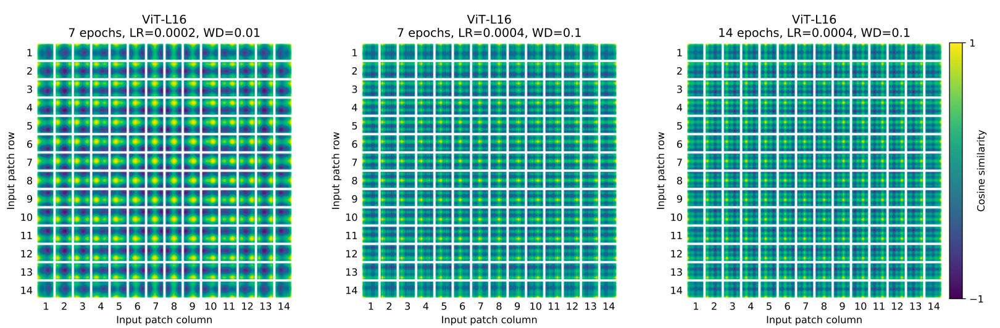

表 8 总结了对 aViT-B/16 模型的消融研究的结果。 正如我们所看到的，虽然没有位置嵌入的模型和有位置嵌入的模型的性能之间存在很大差距，但编码位置信息的不同方式之间几乎没有差异。 我们推测，由于我们的 Transformer 编码器在patch级输入上运行，而不是像素级，因此如何编码空间信息的差异不那么重要。 更准确地说，在patch级输入中，空间维度比原始像素级输入要小得多，例如，14 x14 而不是 224 x 224，并且学习以这种分辨率表示空间关系同样容易 对于这些不同的位置编码策略。 即便如此，网络学习到的位置嵌入相似性的具体模式取决于训练超参数（图 10）。

> Table 8 summarizes the results from this ablation study on aViT-B/16 model. As we can see, while there is a large gap between the performances of the model with no positional embedding and mod- els with positional embedding, there is little to no difference between different ways of encoding positional information. We speculate that since our Transformer encoder operates on patch-level inputs, as opposed to pixel-level, the differences in how to encode spatial information is less impor- tant. More precisely, in patch-level inputs, the spatial dimensions are much smaller than the original pixel-level inputs, e.g., 14 x14 as opposed to 224 x 224, and learning to represent the spatial re- lations in this resolution is equally easy for these different positional encoding strategies. Even so, the specific pattern of position embedding similarity learned by the network depends on the training hyperparameters (Figure 10).

> Head 1                                                                         Head 1 20                                                            Head 2         20                                                            Head 2 Head 3                                                                         Head 3 ...                                                                                  ... 0                                                                                   0 0            5           10          15          20                          0            5           10          15          20 Network depth (layer)                                                  Network depth (layer)

> Figure 11: Size of attended area by head and network depth. Attention distance was computed for 128 example images by averaging the distance between the query pixel and all other pixels, weighted by the attention weight. Each dot shows the mean attention distance across images for one of 16 heads at one layer. Image width is 224 pixels.

> We are also interested in real-world speed of the architectures on our hardware, which is not always well predicted by theoretical FLOPs due to details like lane widths and cache sizes. For this purpose,

> 19 Published as a conference paper at ICLR 2021

> we perform timing of inference speed for the main models of interest, on a TPUv3 accelerator; the difference between inference and backprop speed is a constant model-independent factor.

> Figure 12 (left) shows how many images one core can handle per second, across various input sizes. Every single point refers to the peak performance measured across a wide range of batch-sizes. As can be seen, the theoretical bi-quadratic scaling of ViT with image size only barely starts happening for the largest models at the largest resolutions.

> Another quantity of interest is the largest batch-size each model can fit onto a core, larger being better for scaling to large datasets. Figure 12 (right) shows this quantity for the same set of models. This shows that large ViT models have a clear advantage in terms of memory-efficiency over ResNet models.

> R50x1      ViT-B/32     ViT-B/16     ViT-H/14 R50x2      ViT-L/32     ViT-L/16      R152x4

> 64             128         224        384 512             64              128        224         384 512 Input size [px]                                                   Input size [px]

> Figure 12: Left: Real wall-clock timings of various architectures across input sizes. ViT models have speed comparable to similar ResNets. Right: Largest per-core batch-size fitting on device with various architectures across input sizes. ViT models are clearly more memory-efficient.

> Axial Attention (Huang et al., 2020; Ho et al., 2019) is a simple, yet effective technique to run self- attention on large inputs that are organized as multidimensional tensors. The general idea of axial attention is to perform multiple attention operations, each along a single axis of the input tensor, instead of applying 1-dimensional attention to the flattened version of the input. In axial attention, each attention mixes information along a particular axis, while keeping information along the other axes independent. Along this line, Wang et al. (2020b) proposed the AxialResNet model in which all the convolutions with kernel size 33in a ResNet50 are replaced by axial self-attention, i.e. a row and column attention, augmented by relative positional encoding. We have implemented AxialResNet as a baseline model.3.

> Moreover, we have modified ViT to process inputs in the 2-dimensional shape, instead of a 1- dimensional sequence of patches, and incorporate Axial Transformer blocks, in which instead of a self-attention followed by an MLP, we have a a row-self-attention plus an MLP followed by a column-self-attention plus an MLP.

> Figure 13, present the performance of Axial ResNet, Axial-ViT-B/32 and Axial-ViT-B/16 on Ima- geNet 5shot linear, when pretrained on JFT dataset, verses the pretraining compute, both in terms of number of FLOPs and inference time (example per seconds). As we can see, both Axial-ViT-B/32 and Axial-ViT-B/16 do better than their ViT-B counterpart in terms of performance, but it comes at

> 3 Our implementation is based on the open-sourced PyTorch implementation in https://github.com/ csrhddlam/axial-deeplab. In our experiments, we reproduced the scores reported in (Wang et al., 2020b) in terms of accuracy, however, our implementation, similar to the open-source implementation, is very slow on TPUs. Therefore, we were not able to use it for extensive large-scale experiments. These may be unlocked by a carefully optimized implementation.

> 20 Published as a conference paper at ICLR 2021

> AxialViT-B/16                                                                AxialViT-B/16 0.650                                                                              0.650 ViT-B/16                                                    ViT-B/16 0.625

> AxialViT-B/32 0.575 ViT-B/32 AxialResNet50 0.550

> ViT-B/32 AxialResNet50

> 102                                                                               103                                 102 Total compute [exaFLOPs]                                        Peak inference speed [img/sec/core]

> Figure 13: Performance of Axial-Attention based models, in terms of top-1 accuracy on ImageNet 5-shot linear, versus their speed in terms of number of FLOPs (left) and inference time (left).

> the cost of more compute. This is because in Axial-ViT models, each Transformer block with global self-attention is replaced by two Axial Transformer blocks, one with row and one with column self- attention and although the sequence length that self-attention operates on is smaller in axial case, there is a extra MLP per Axial-ViT block. For the AxialResNet, although it looks reasonable in terms of accuracy/compute trade-off (Figure 13, left), the naive implementation is extremely slow on TPUs (Figure 13, right).

> To understand how ViT uses self-attention to integrate information across the image, we analyzed the average distance spanned by attention weights at different layers (Figure 11). This “attention distance” is analogous to receptive field size in CNNs. Average attention distance is highly variable across heads in lower layers, with some heads attending to much of the image, while others attend to small regions at or near the query location. As depth increases, attention distance increases for all heads. In the second half of the network, most heads attend widely across tokens.

##### D.8 ATTENTION MAPS

为了计算从输出token到输入空间的注意力映射（图 6 和 14），我们使用了 Attention Rollout (Abnar & Zuidema, 2020)。 简而言之，我们对所有头部的 ViT-L/16 的注意力权重进行平均，然后递归地乘以所有层的权重矩阵。 这解释了通过所有层的tokens之间的注意力混合。

> To compute maps of the attention from the output token to the input space (Figures 6 and 14), we used Attention Rollout (Abnar & Zuidema, 2020). Briefly, we averaged attention weights of ViT- L/16 across all heads and then recursively multiplied the weight matrices of all layers. This accounts for the mixing of attention across tokens through all layers.

##### D.9 OBJECTNET RESULTS

我们还按照 Kolesnikov 等人的评估设置在 ObjectNet 基准上评估了我们的旗舰 ViT-H/14 模型。 （2020 年），top-5 准确度为 82.1%，top-1 准确度为 61.7%。

> We also evaluate our flagship ViT-H/14 model on the ObjectNet benchmark following the evaluation setup in Kolesnikov et al. (2020), resulting in 82.1% top-5 accuracy and 61.7% top-1 accuracy.

