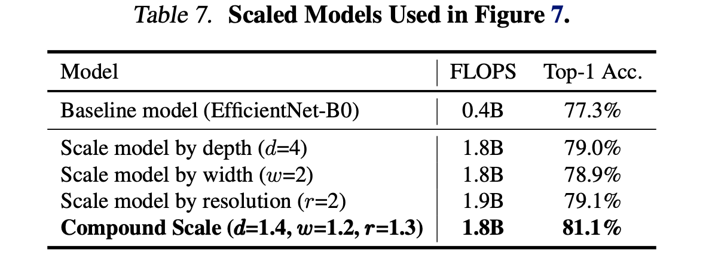

# EfficientNet: Rethinking Model Scaling for Convolutional Neural Networks

>Mingxing Tan 1 Quoc V. Le 1

## Abstract

卷积神经网络 (ConvNets) 通常在固定资源预算下开发，然后在有更多资源可用时进行扩展以获得更好的准确性。在本文中，我们系统地研究了模型缩放，并确定仔细平衡网络深度、宽度和分辨率可以带来更好的性能。基于这一观察，我们提出了一种新的缩放方法，该方法使用简单但高效的复合系数统一缩放深度/宽度/分辨率的所有维度。我们证明了这种方法在扩展 MobileNets 和 ResNet 方面的有效性。

> Convolutional Neural Networks (ConvNets) are commonly developed at a fixed resource budget, and then scaled up for better accuracy if more resources are available. In this paper, we systematically study model scaling and identify that carefully balancing network depth, width, and resolution can lead to better performance. Based on this observation, we propose a new scaling method that uniformly scales all dimensions of depth/width/resolution using a simple yet highly effective compound coefficient. We demonstrate the effectiveness of this method on scaling up MobileNets and ResNet.

更进一步，我们使用神经架构搜索来设计一个新的基线网络并将其扩展以获得一系列模型，称为 EfficientNets，它们比以前的 ConvNets 实现了更好的准确性和效率。特别是，我们的 EfficientNet-B7 在 ImageNet 上实现了最先进的 84.3% 的 top-1 准确度，同时比现有最好的 ConvNet 小 8.4 倍，推理速度快 6.1 倍。我们的 EfficientNets 在 CIFAR-100 (91.7%)、Flowers (98.8%) 和其他 3 个迁移学习数据集上也能很好地迁移并实现最先进的准确度，参数少一个数量级。源代码在 https://github.com/tensorflow/tpu/tree/master/models/official/efficientnet。

>To go even further, we use neural architecture search to design a new baseline network and scale it up to obtain a family of models, called EfficientNets, which achieve much better accuracy and efficiency than previous ConvNets. In particular, our EfficientNet-B7 achieves state-of-the-art 84.3% top-1 accuracy on ImageNet, while being 8.4x smaller and 6.1x faster on inference than the best existing ConvNet. Our EfficientNets also transfer well and achieve state-of-the-art accuracy on CIFAR-100 (91.7%), Flowers (98.8%), and 3 other transfer learning datasets, with an order of magnitude fewer parameters. Source code is at https: //github.com/tensorflow/tpu/tree/ master/models/official/efficientnet.

## 1.Introduction

大规模的ConvNets 被广泛用于取得更好的精度。例如，ResNet (He et al., 2016) 可以通过使用更多层从 ResNet-18 扩展到 ResNet-200；最近，GPipe (Huang et al., 2018) 通过扩大基线模型 4倍实现了 84.3% 的 ImageNet top-1 准确率。然而，扩大 ConvNets 的过程从未被很好地理解，目前有很多方法可以做到这一点。最常见的方法是通过深度 (He et al., 2016) 或宽度 (Zagoruyko & Komodakis, 2016) 来扩展 ConvNet。另一种不太常见但越来越流行的方法是通过图像分辨率放大模型（Huang et al., 2018）。在以前的工作中，通常只缩放三个维度中的一个——深度、宽度和图像大小。尽管可以任意缩放两个或三个维度，但任意缩放需要繁琐的手动调整，并且仍然经常产生次优的准确性和效率。

>Scaling up ConvNets is widely used to achieve better accuracy. For example, ResNet (He et al., 2016) can be scaled up from ResNet-18 to ResNet-200 by using more layers; Recently, GPipe (Huang et al., 2018) achieved 84.3% ImageNet top-1 accuracy by scaling up a baseline model four time larger. However, the process of scaling up ConvNets has never been well understood and there are currently many ways to do it. The most common way is to scale up ConvNets by their depth (He et al., 2016) or width (Zagoruyko & Komodakis, 2016). Another less common, but increasingly popular, method is to scale up models by image resolution (Huang et al., 2018). In previous work, it is common to scale only one of the three dimensions – depth, width, and image size. Though it is possible to scale two or three dimensions arbitrarily, arbitrary scaling requires tedious manual tuning and still often yields sub-optimal accuracy and efficiency.

图 1. **模型大小与 ImageNet 准确度**。所有数字均适用于单一作物、单一模型。我们的 EfficientNets 明显优于其他 ConvNets。特别是，EfficientNet-B7 实现了最新的 84.3% top-1 准确率，但比 GPipe 小 8.4 倍，快 6.1 倍。 EfficientNet-B1 比 ResNet-152 小 7.6 倍，快 5.7 倍。详情见表 2 和表 4。

>Figure 1. **Model Size vs. ImageNet Accuracy.** All numbers are for single-crop, single-model. Our EfficientNets significantly outperform other ConvNets. In particular, EfficientNet-B7 achieves new state-of-the-art 84.3% top-1 accuracy but being 8.4x smaller and 6.1x faster than GPipe. EfficientNet-B1 is 7.6x smaller and 5.7x faster than ResNet-152. Details are in Table 2 and 4.

在本文中，我们想要研究和重新思考扩大 ConvNets 的过程。特别是，我们研究了一个核心问题：是否有一种原则性的方法来扩大卷积网络，以实现更好的准确性和效率？我们的实证研究表明，平衡网络宽度/深度/分辨率的所有维度至关重要，令人惊讶的是，这种平衡可以通过简单地以恒定比例缩放它们中的每一个来实现。基于这一观察，我们提出了一种简单而有效的复合缩放方法。与任意缩放这些因素的传统做法不同，我们的方法通过一组固定比例统一缩放网络宽度、深度、和分辨率。 例如，如果我们想使用 

倍的计算资源，那么我们可以简单地将网络深度增加 

，宽度增加 

，图像大小增加 

，其中 , 

是通过对在原始小模型进行小网格搜索确定的常数系数 。 图 2 说明了我们的缩放方法与传统方法之间的区别。

>In this paper, we want to study and rethink the process of scaling up ConvNets. In particular, we investigate the central question: is there a principled method to scale up ConvNets that can achieve better accuracy and efficiency? Our empirical study shows that it is critical to balance all dimensions of network width/depth/resolution, and surprisingly such balance can be achieved by simply scaling each of them with constant ratio. Based on this observation, we propose a simple yet effective compound scaling method. Unlike conventional practice that arbitrary scales these factors, our method uniformly scales network width, depth, and resolution with a set of fixed scaling coefficients. For example, if we want to use 2 Ntimes more computational resources, then we can simply increase the network depth by N , width by N , and image size by N , where , , are constant coefficients determined by a small grid search on the original small model. Figure 2 illustrates the difference between our scaling method and conventional methods.

图 2. 模型缩放。 (a) 是一个基线网络示例； (b)-(d) 是常规缩放，仅增加网络宽度、深度或分辨率的一维。 (e) 是我们提出的复合缩放方法，它以固定比例均匀缩放所有三个维度。

> Figure 2. Model Scaling. (a) is a baseline network example; (b)-(d) are conventional scaling that only increases one dimension of network width, depth, or resolution. (e) is our proposed compound scaling method that uniformly scales all three dimensions with a fixed ratio.

直观地说，复合缩放方法是有意义的，因为如果输入图像更大，那么网络需要更多的层来增加感受野和更多的通道来捕捉更大图像上更细粒度的模式。事实上，之前的理论（Raghu et al., 2017; Lu et al., 2018）和实证结果（Zagoruyko & Komodakis, 2016）都表明网络宽度和深度之间存在一定的关系，但据我们所知，我们是第一个根据经验量化网络宽度、深度和分辨率这三个维度之间关系的人。

>Intuitively, the compound scaling method makes sense because if the input image is bigger, then the network needs more layers to increase the receptive field and more channels to capture more fine-grained patterns on the bigger image. In fact, previous theoretical (Raghu et al., 2017; Lu et al., 2018) and empirical results (Zagoruyko & Komodakis, 2016) both show that there exists certain relationship between network width and depth, but to our best knowledge, we are the first to empirically quantify the relationship among all three dimensions of network width, depth, and resolution.

我们证明了我们的缩放方法在现有的 MobileNets (Howard et al., 2017; Sandler et al., 2018) 和 ResNet (He et al., 2016) 上运行良好。值得注意的是，模型缩放的有效性在很大程度上取决于基线网络；更进一步，我们使用神经架构搜索 (Zoph & Le, 2017; Tan et al., 2019) 来开发一个新的基线网络，并将其放大以获得一系列模型，称为 EfficientNets。图 1 总结了 ImageNet 的性能，我们的 EfficientNets 明显优于其他 ConvNets。特别是，我们的 EfficientNet-B7 超过了现有的最佳 GPipe 精度（Huang 等人，2018 年），但使用的参数减少了 8.4 倍，推理速度提高了 6.1 倍。与广泛使用的 ResNet-50 (He et al., 2016) 相比，我们的 EfficientNet-B4 将 top-1 准确率从 76.3% 提高到 83.0% (+6.7%)，并具有相似的 FLOPS。除了 ImageNet，EfficientNets 也能很好地迁移并在 8 个广泛使用的数据集中的 5 个上具有最先进的精度，同时将参数减少到现有 ConvNet 的 21 倍。

>We demonstrate that our scaling method work well on existing MobileNets (Howard et al., 2017; Sandler et al., 2018) and ResNet (He et al., 2016). Notably, the effectiveness of model scaling heavily depends on the baseline network; to go even further, we use neural architecture search (Zoph & Le, 2017; Tan et al., 2019) to develop a new baseline network, and scale it up to obtain a family of models, called EfficientNets. Figure 1 summarizes the ImageNet performance, where our EfficientNets significantly outperform other ConvNets. In particular, our EfficientNet-B7 surpasses the best existing GPipe accuracy (Huang et al., 2018), but using 8.4x fewer parameters and running 6.1x faster on inference. Compared to the widely used ResNet-50 (He et al., 2016), our EfficientNet-B4 improves the top-1 accuracy from 76.3% to 83.0% (+6.7%) with similar FLOPS. Besides ImageNet, EfficientNets also transfer well and achieve state-of-the-art accuracy on 5 out of 8 widely used datasets, while reducing parameters by up to 21x than existing ConvNets.

## 2.Related Work

**ConvNet 精度**：自从 AlexNet (Krizhevsky et al., 2012) 赢得 2012 ImageNet 比赛以来，ConvNets 变得越来越准确：而 2014 ImageNet 冠军 GoogleNet (Szegedy et al., 2015) 达到了 74.8% top-1 准确率约为 6.8M 参数，2017 年 ImageNet 获胜者 SENet（Hu 等人，2018）在 145M 参数下达到了 82.7% 的 top-1 准确率。最近，GPipe (Huang et al., 2018) 使用 557M 参数进一步将最先进的 ImageNet top-1 验证准确率推至 84.3%：它太大了，只能使用专门的pipeline并行库进行训练通过划分网络并将每个部分分散到不同的加速器。虽然这些模型主要是为 ImageNet 设计的，但最近的研究表明，更好的 ImageNet 模型在各种迁移学习数据集 (Kornblith et al., 2019) 以及其他计算机视觉任务（例如对象检测（He et al., 2016 年；Tan 等人，2019 年）同样表现出色。尽管更高的精度对许多应用程序来说至关重要，但我们已经达到了硬件内存限制，因此进一步提高精度需要更高的效率。

>**ConvNet Accuracy**: Since AlexNet (Krizhevsky et al., 2012) won the 2012 ImageNet competition, ConvNets have become increasingly more accurate by going bigger: while the 2014 ImageNet winner GoogleNet (Szegedy et al., 2015) achieves 74.8% top-1 accuracy with about 6.8M parameters, the 2017 ImageNet winner SENet (Hu et al., 2018) achieves 82.7% top-1 accuracy with 145M parameters. Recently, GPipe (Huang et al., 2018) further pushes the state-of-the-art ImageNet top-1 validation accuracy to 84.3% using 557M parameters: it is so big that it can only be trained with a specialized pipeline parallelism library by partitioning the network and spreading each part to a different accelerator. While these models are mainly designed for ImageNet, recent studies have shown better ImageNet models also perform better across a variety of transfer learning datasets (Kornblith et al., 2019), and other computer vision tasks such as object detection (He et al., 2016; Tan et al., 2019). Although higher accuracy is critical for many applications, we have already hit the hardware memory limit, and thus further accuracy gain needs better efficiency.

**ConvNet 效率**：Deep ConvNets 经常被过度参数化。模型压缩（Han et al., 2016; He et al., 2018; Yang et al., 2018）是一种通过以精度换取效率来减小模型大小的常用方法。随着手机变得无处不在，手工制作高效的移动尺寸卷积网络也很常见，例如 SqueezeNets (Iandola et al., 2016; Gholami et al., 2018)、MobileNets (Howard et al., 2017; Sandler et al., 2018)。 , 2018) 和 ShuffleNets（Zhang 等人，2018 年；Ma 等人，2018 年）。最近，神经架构搜索在设计高效的移动尺寸卷积网络中变得越来越流行（Tan et al., 2019; Cai et al., 2019），并且通过广泛调整网络宽度、深度实现了比手工制作的移动卷积网络更好的效率，卷积核类型和大小。然而，目前尚不清楚如何将这些技术应用于具有更大设计空间和更昂贵调整成本的大型模型。在本文中，我们旨在研究超越最先进精度的超大型 ConvNet 的模型效率。为了实现这一目标，我们求助于模型缩放。

>**ConvNet Efficiency**: Deep ConvNets are often overparameterized. Model compression (Han et al., 2016; He et al., 2018; Yang et al., 2018) is a common way to reduce model size by trading accuracy for efficiency. As mobile phones become ubiquitous, it is also common to handcraft efficient mobile-size ConvNets, such as SqueezeNets (Iandola et al., 2016; Gholami et al., 2018), MobileNets (Howard et al., 2017; Sandler et al., 2018), and ShuffleNets (Zhang et al., 2018; Ma et al., 2018). Recently, neural architecture search becomes increasingly popular in designing efficient mobile-size ConvNets (Tan et al., 2019; Cai et al., 2019), and achieves even better efficiency than hand-crafted mobile ConvNets by extensively tuning the network width, depth, convolution kernel types and sizes. However, it is unclear how to apply these techniques for larger models that have much larger design space and much more expensive tuning cost. In this paper, we aim to study model efficiency for super large ConvNets that surpass state-of-the-art accuracy. To achieve this goal, we resort to model scaling.

**模型缩放**：有很多方法可以针对不同的资源限制来缩放 ConvNet：ResNet (He et al., 2016) 可以通过调整网络深度来缩小（例如，ResNet-18）或放大（例如，ResNet-200）（ #layers)，而 WideResNet (Zagoruyko & Komodakis, 2016) 和 MobileNets (Howard et al., 2017) 可以通过网络宽度 (#channels) 进行缩放。众所周知，更大的输入图像大小将有助于提高准确性，并增加FLOPS 开销。尽管先前的研究（Raghu et al., 2017; Lin & Jegelka, 2018; Sharir & Shashua, 2018; Lu et al., 2018）表明网络深度和宽度对于 ConvNets 的表达能力都很重要，但它仍然是关于如何有效扩展卷积网络以实现更好的效率和准确性的开放性问题。我们的工作系统地和经验地研究了网络宽度、深度和分辨率的所有三个维度的 ConvNet 缩放。

>**Model Scaling**: There are many ways to scale a ConvNet for different resource constraints: ResNet (He et al., 2016) can be scaled down (e.g., ResNet-18) or up (e.g., ResNet-200) by adjusting network depth (#layers), while WideResNet (Zagoruyko & Komodakis, 2016) and MobileNets (Howard et al., 2017) can be scaled by network width (#channels). It is also well-recognized that bigger input image size will help accuracy with the overhead of more FLOPS. Although prior studies (Raghu et al., 2017; Lin & Jegelka, 2018; Sharir & Shashua, 2018; Lu et al., 2018) have shown that network depth and width are both important for ConvNets’ expressive power, it still remains an open question of how to effectively scale a ConvNet to achieve better efficiency and accuracy. Our work systematically and empirically studies ConvNet scaling for all three dimensions of network width, depth, and resolutions.

## 3.Compound Model Scaling

在本节中，我们将制定缩放问题，研究不同的方法，并提出我们新的缩放方法。

> In this section, we will formulate the scaling problem, study different approaches, and propose our new scaling method.

### 3.1. Problem Formulation

一个卷积网络层 i 可以定义为一个函数：
)
，其中 

 是算子，

 是输出张量，

 是输入张量，张量形状为

，其中 

 和 

是空间维度，

 是通道维度。 ConvNet N 可以由一系列组合层列表表示：
=\bigodot_{j=1%20\ldots%20k}%20\mathcal{F}_{j}\left(X_{1}\right))
。在实践中，ConvNet 层通常被划分为多个阶段，每个阶段中的所有层共享相同的架构：例如，ResNet (He et al., 2016) 有五个阶段，每个阶段中的所有层都具有相同的卷积类型，除了第一层执行下采样。因此，我们可以将ConvNet定义为：

>A ConvNet Layer i can be defined as a function: Yi = Fi (Xi ), where Fi is the operator, Yi is output tensor, Xi is input tensor, with tensor shape hHi , Wi , Ci i1 , where Hi and Wi are spatial dimension and Ci is the channel dimension. A ConvNet N can be represented by aJ list of composed layers: N = Fk ... F2 F1 (X1 ) = j=1...k Fj (X1 ). In practice, ConvNet layers are often partitioned into multiple stages and all layers in each stage share the same architecture: for example, ResNet (He et al., 2016) has five stages, and all layers in each stage has the same convolutional type except the first layer performs down-sampling. Therefore, we can define a ConvNet as:

其中表示层 

 在第 i 阶段重复 

 次

层，

表示第 i 层的输入张量 X 的形状。图 2(a) 说明了一个有代表性的 ConvNet，其中空间维度逐渐缩小，但通道维度在层上扩展，例如，从初始输入形状 224、224、3 到最终输出形状 7、7、512.

>where denotes layer Fi is repeated Li times in stage i, hHi , Wi , Ci i denotes the shape of input tensor X of layer i. Figure 2(a) illustrate a representative ConvNet, where the spatial dimension is gradually shrunk but the channel dimension is expanded over layers, for example, from initial input shape 224, 224, 3 to final output shape 7, 7, 512 .

与主要专注于寻找最佳层架构 

 的常规 ConvNet 设计不同，模型缩放试图扩展网络长度 (

)、宽度 (

) 和/或分辨率 (

)，而不改变基线网络中预定义的

。通过固定 

，模型缩放简化了设计问题到一个新的资源约束，但它仍然是一个很大的设计空间来探索每一层的不同

。为了进一步减少设计空间，我们限制所有层必须以恒定比例均匀缩放。我们的目标是最大化任何给定资源约束的模型精度，这可以表述为一个优化问题：

>Unlike regular ConvNet designs that mostly focus on find- ing the best layer architecture F i, model scaling tries to ex- pand the network length (L i), width (C i), and/or resolution (H i, W i) without changing F ipredefined in the baseline network. By fixing F i, model scaling simplifies the design problem for new resource constraints, but it still remains a large design space to explore different L i, C i, H i, W ifor each layer. In order to further reduce the design space, we restrict that all layers must be scaled uniformly with con- stant ratio. Our target is to maximize the model accuracy for any given resource constraints,which can be formulated as an optimization problem:

其中 w, d, r 是用于缩放网络宽度、深度和分辨率的系数； 

是基线网络中的预定义参数（以表 1 为例）。

>where w, d, r are coefficients for scaling network width, depth, and resolution; Fˆ i,ˆL i,ˆH iˆ, W ˆi, C iare predefined parameters in baseline network (see Table 1 as an example).

### 3.2. Scaling Dimensions

问题2的主要困难是最优的d、w、r相互依赖，并且在不同的资源约束下值会发生变化。由于这个困难，传统方法大多在以下维度之一中缩放 ConvNet：

>The main difficulty of problem 2 is that the optimal d, w, r depend on each other and the values change under different resource constraints. Due to this difficulty, conventional methods mostly scale ConvNets in one of these dimensions:

**深度（d）**：缩放网络深度是许多 ConvNets 最常用的方法（He et al., 2016; Huang et al., 2017; Szegedy et al., 2015; 2016）。直觉是，更深的 ConvNet 可以捕获更丰富、更复杂的特征，并且可以很好地概括新任务。然而，由于梯度消失问题，更深层次的网络也更难训练（Zagoruyko & Komodakis，2016）。尽管跳过连接 (He et al., 2016) 和批量归一化 (Ioffe & Szegedy, 2015) 等多种技术缓解了训练问题，但非常深的网络的准确度增益降低了：例如，ResNet-1000 具有相似的准确度与 ResNet-101 一样，尽管它有更多的层。图 3（中）显示了我们对具有不同深度系数 d 的基线模型进行缩放的实证研究，进一步表明非常深的 ConvNets 的准确度回报递减。

>**Depth (d)**: Scaling network depth is the most common way used by many ConvNets (He et al., 2016; Huang et al., 2017; Szegedy et al., 2015; 2016). The intuition is that deeper ConvNet can capture richer and more complex features, and generalize well on new tasks. However, deeper networks are also more difficult to train due to the vanishing gradient problem (Zagoruyko & Komodakis, 2016). Although several techniques, such as skip connections (He et al., 2016) and batch normalization (Ioffe & Szegedy, 2015), alleviate the training problem, the accuracy gain of very deep network diminishes: for example, ResNet-1000 has similar accuracy as ResNet-101 even though it has much more layers. Figure 3 (middle) shows our empirical study on scaling a baseline model with different depth coefficient d, further suggesting the diminishing accuracy return for very deep ConvNets.

**宽度（w ）**：缩放网络宽度通常用于  (w 小尺寸模型 (Howard et al., 2017; Sandler et al., 2018;Tan et al., 2019) 2. 正如 (Zagoruyko & Komodakis, 2016) 中所讨论的，更广泛的网络往往能够捕获更细粒度的特征并且更容易训练。然而，极宽但很浅的网络往往难以捕捉更高层次的特征。我们在图 3（左）中的经验结果表明，当网络变得更宽且 w 越大时，准确度会迅速饱和。

>**Width （w )**: Scaling network width is commonly used for Width (w small size models (Howard et al., 2017; Sandler et al., 2018; Tan et al., 2019) 2. As discussed in (Zagoruyko & Komodakis, 2016), wider networks tend to be able to capture more fine-grained features and are easier to train. However, extremely wide but shallow networks tend to have difficulties in capturing higher level features. Our empirical results in Figure 3 (left) show that the accuracy quickly saturates when networks become much wider with larger w.

图 3. **放大具有不同网络宽度 (w)、深度 (d) 和分辨率 (r) 系数的基线模型**。 具有更大宽度、深度或分辨率的更大网络往往会获得更高的准确度，但准确度增益在达到 80% 后会迅速饱和，这表明了单维缩放的局限性。 基线网络在表 1 中进行了描述。

> Figure 3. **Scaling Up a Baseline Model with Different Network Width (w), Depth (d), and Resolution (r) Coefficients**. Bigger networks with larger width, depth, or resolution tend to achieve higher accuracy, but the accuracy gain quickly saturate after reaching 80%, demonstrating the limitation of single dimension scaling. Baseline network is described in Table 1.

**分辨率（r）**：使用更高分辨率的输入图像，ConvNets 可以潜在地捕获更细粒度的模式。从早期 ConvNet 的 224x224 开始，现代 ConvNet 倾向于使用 299x299（Szegedy 等人，2016）或 331x331（Zoph 等人，2018）以获得更好的精度。最近，GPipe (Huang et al., 2018) 以 480x480 的分辨率实现了最先进的 ImageNet 精度。更高的分辨率，例如 600x600，也广泛用于对象检测 ConvNets（He et al., 2017; Lin et al., 2017）。图 3（右）显示了缩放网络分辨率的结果，其中确实更高的分辨率提高了精度，但精度增益对于非常高的分辨率会降低（r = 1.0 表示分辨率 224x224，r = 2.5 表示分辨率 560x560）。

>**Resolution (r)**: With higher resolution input images, ConvNets can potentially capture more fine-grained patterns. Starting from 224x224 in early ConvNets, modern ConvNets tend to use 299x299 (Szegedy et al., 2016) or 331x331 (Zoph et al., 2018) for better accuracy. Recently, GPipe (Huang et al., 2018) achieves state-of-the-art ImageNet accuracy with 480x480 resolution. Higher resolutions, such as 600x600, are also widely used in object detection ConvNets (He et al., 2017; Lin et al., 2017). Figure 3 (right) shows the results of scaling network resolutions, where indeed higher resolutions improve accuracy, but the accuracy gain diminishes for very high resolutions (r = 1.0 denotes resolution 224x224 and r = 2.5 denotes resolution 560x560).

**观察 1** – 扩大网络宽度、深度或分辨率的任何维度都可以提高准确性，但对于更大的模型，准确性增益会降低。

>**Observation 1** – Scaling up any dimension of network width, depth, or resolution improves accuracy, but the accuracy gain diminishes for bigger models.

### 3.3. Compound Scaling

我们凭经验观察到不同的缩放维度不是独立的。直观地说，对于更高分辨率的图像，我们应该增加网络深度，这样更大的感受野可以帮助捕捉更大图像中包含更多像素的相似特征。相应地，我们也应该在分辨率较高时增加网络宽度，为了在高分辨率图像中捕获具有更多像素的更细粒度的模式。这些直觉表明，我们需要协调和平衡不同的缩放维度，而不是传统的单维度缩放。

>We empirically observe that different scaling dimensions are not independent. Intuitively, for higher resolution images, we should increase network depth, such that the larger receptive fields can help capture similar features that include more pixels in bigger images. Correspondingly, we should also increase network width when resolution is higher, in order to capture more fine-grained patterns with more pixels in high resolution images. These intuitions suggest that we need to coordinate and balance different scaling dimensions rather than conventional single-dimension scaling.

图 4. **不同基线网络的缩放网络宽度**。一条线中的每个点表示具有不同宽度系数 (w) 的模型。所有基线网络均来自表 1。第一个基线网络（d=1.0，r=1.0）有 18 个卷积层，分辨率为 224x224，而最后一个基线（d=2.0，r=1.3）有 36 层，分辨率为 299x299。

>Figure 4. **Scaling Network Width for Different Baseline Networks**. Each dot in a line denotes a model with different width coefficient (w). All baseline networks are from Table 1. The first baseline network (d=1.0, r=1.0) has 18 convolutional layers with resolution 224x224, while the last baseline (d=2.0, r=1.3) has 36 layers with resolution 299x299.

为了验证我们的直觉，我们比较了不同网络深度和分辨率下的宽度缩放，如图 4 所示。如果我们只缩放网络宽度 w 而不改变深度 (d=1.0) 和分辨率 (r=1.0)，精度很快就会饱和。随着更深（d=2.0）和更高的分辨率（r=2.0），宽度缩放在相同的 FLOPS 成本下实现了更好的精度。这些结果使我们得出第二个观察结果：

>To validate our intuitions, we compare width scaling under different network depths and resolutions, as shown in Figure 4. If we only scale network width w without changing depth (d=1.0) and resolution (r=1.0), the accuracy saturates quickly. With deeper (d=2.0) and higher resolution (r=2.0), width scaling achieves much better accuracy under the same FLOPS cost. These results lead us to the second observation:

**观察 2**—为了追求更好的准确性和效率，在 ConvNet 缩放期间平衡网络宽度、深度和分辨率的所有维度至关重要。

>**Observation 2** – In order to pursue better accuracy and efficiency, it is critical to balance all dimensions of network width, depth, and resolution during ConvNet scaling.

事实上，之前的一些工作（Zoph et al., 2018; Real et al., 2019）已经尝试过任意平衡网络宽度和深度，但它们都需要繁琐的手动调整。

>In fact, a few prior work (Zoph et al., 2018; Real et al., 2019) have already tried to arbitrarily balance network width and depth, but they all require tedious manual tuning.

在本文中，我们提出了一种新的复合缩放方法，它使用复合系数以有原则的方式统一缩放网络宽度、深度和分辨率：

>In this paper, we propose a new compound scaling method, which use a compound coefficient to uniformly scales network width, depth, and resolution in a principled way:

其中 

是可以通过小网格搜索确定的常数。直观地说，

是一个用户指定的系数，它控制有多少资源可用于模型缩放，而

则指定如何将这些额外资源分别分配给网络宽度、深度和分辨率。值得注意的是，常规卷积运算的 FLOPS 与

 成正比，即网络深度加倍将使 FLOPS 加倍，但网络宽度或分辨率加倍将使 FLOPS 增加四倍。由于卷积运算通常在 ConvNets 中占主导地位，因此使用等式 3 缩放 ConvNet 将使总 FLOPS 大约增加 
^{\phi})
 。在本文中，我们 约束

 使得对于任何新的

，总 FLOPS 将大约增加 

 。

>where , , are constants that can be determined by a small grid search. Intuitively, is a user-specified coefficient that controls how many more resources are available for model scaling, while , , specify how to assign these extra resources to network width, depth, and resolution respectively. Notably, the FLOPS of a regular convolution op is proportional to d, w 2, r 2, i.e., doubling network depth will double FLOPS, but doubling network width or resolution will increase FLOPS by four times. Since convolution ops usually dominate the computation cost in ConvNets, scaling a ConvNet with equation 3 will approximately increase total FLOPS by · 2 · 2 . In this paper, we 2 2 constraint · · 2 such that for any new , the total FLOPS will approximately3 increase by 2 .

## 4.EfficientNet Architecture

由于模型缩放不会改变基线网络中的层算子 

，因此拥有良好的基线网络也很关键。我们将使用现有的 ConvNet 评估我们的缩放方法，但为了更好地展示我们的缩放方法的有效性，我们还开发了一个新的移动端大小的基线，称为 EfficientNet。

>Since model scaling does not change layer operators Fˆi in baseline network, having a good baseline network is also critical. We will evaluate our scaling method using existing ConvNets, but in order to better demonstrate the effectiveness of our scaling method, we have also developed a new mobile-size baseline, called EfficientNet.

受 (Tan et al., 2019) 的启发，我们通过利用优化准确性和 FLOPS 的多目标神经架构搜索来开发我们的基线网络。具体来说，我们使用与 (Tan et al., 2019) 相同的搜索空间，并使用 
%20\times[F%20L%20O%20P%20S(m)%20/%20T]^{w})
 作为优化目标，其中 ACC(m) 和 F LOP S (m) 表示模型 m 的准确率和 FLOPS，T 是目标 FLOPS，w=-0.07 是用于控制准确率和 FLOPS 之间权衡的超参数。与（Tan et al., 2019; Cai et al., 2019）不同，这里我们优化 FLOPS 而不是延迟，因为我们没有针对任何特定的硬件设备。我们的搜索产生了一个高效的网络，我们将其命名为 EfficientNet-B0。由于我们使用与 (Tan et al., 2019) 相同的搜索空间，因此架构类似于 Mnas3Net，除了我们的 EfficientNet-B0 由于更大的 FLOPS 目标（我们的 FLOPS 目标是 400M）而略大一些。表 1 显示了 EfficientNet-B0 的架构。它的主要构建块是移动倒置瓶颈 MBConv (Sandler et al., 2018; Tan et al., 2019)，我们还添加了挤压和激励优化 (Hu et al., 2018)。

>Inspired by (Tan et al., 2019), we develop our baseline network by leveraging a multi-objective neural architecture search that optimizes both accuracy and FLOPS. Specifically, we use the same search space as (Tan et al., 2019), and use ACC(m)⇥[F LOP S(m)/T ]w as the optimization goal, where ACC(m) and F LOP S(m) denote the accuracy and FLOPS of model m, T is the target FLOPS and w=-0.07 is a hyperparameter for controlling the trade-off between accuracy and FLOPS. Unlike (Tan et al., 2019; Cai et al., 2019), here we optimize FLOPS rather than latency since we are not targeting any specific hardware device. Our search produces an efficient network, which we name EfficientNet-B0. Since we use the same search space as (Tan et al., 2019), the architecture is similar to Mnas3 Net, except our EfficientNet-B0 is slightly bigger due to the larger FLOPS target (our FLOPS target is 400M). Table 1 shows the architecture of EfficientNet-B0. Its main building block is mobile inverted bottleneck MBConv (Sandler et al., 2018; Tan et al., 2019), to which we also add squeeze-and-excitation optimization (Hu et al., 2018).

表 1. EfficientNet-B0 基线网络——每行描述一个阶段 i，具有 

层，输入分辨率为 

，输出通道为 

。 符号取自等式 2。

>Table 1. EfficientNet-B0 baseline network – Each row describes a stage i with Lˆi layers, with input resolution h Hˆi,Wˆii and output channels Cˆi. Notations are adopted from equation 2.

从基线 EfficientNet-B0 开始，我们应用我们的复合缩放方法通过两个步骤对其进行缩放：

>Starting from the baseline EfficientNet-B0, we apply our compound scaling method to scale it up with two steps:

• 第 1 步：我们首先确定

，假设可用资源增加两倍，然后根据公式 2 和 3 对 

, 进行小网格搜索。特别是，我们发现 EfficientNet-B0 的最佳值是 

5，在

的约束下。

> • STEP 1: we first fix = 1, assuming twice more resources available, and do a small grid search of ↵, , based on Equation 2 and 3. In particular, we find the best values for EfficientNet-B0 are ↵ = 1.2, = 1.1, = 1.15, under constraint of ↵ · 2 · 2 ⇡

• 第 2 步：然后我们将 

 , 固定为常数，并使用公式 3 以不同的方式放大基线网络，以获得 EfficientNet-B1 到 B7（详情见表 2)。

>• STEP 2: we then fix ↵, , as constants and scale up baseline network with different using Equation 3, to obtain EfficientNet-B1 to B7 (Details in Table 2).

值得注意的是，可以通过直接在大型模型周围搜索

来获得更好的性能，但是在大型模型上搜索成本变得非常昂贵。我们的方法通过只在小型基线网络上进行一次搜索（步骤 1）来解决这个问题，然后对所有其他模型使用相同的缩放系数（步骤 2）。

>Notably, it is possible to achieve even better performance by searching for , , directly around a large model, but the search cost becomes prohibitively more expensive on larger models. Our method solves this issue by only doing search once on the small baseline network (step 1), and then use the same scaling coefficients for all other models (step 2).

## 5. Experiments

在本节中，我们将首先评估我们在现有 ConvNets 和新提出的 EfficientNets 上的缩放方法。

>In this section, we will first evaluate our scaling method on existing ConvNets and the new proposed EfficientNets.

### 5.1. Scaling Up MobileNets and ResNets

作为概念证明，我们首先将我们的扩展方法应用于广泛使用的 MobileNets (Howard et al., 2017; Sandler et al., 2018) 和 ResNet (He et al., 2016)。表 3 显示了 ImageNet 以不同方式缩放它们的结果。与其他单维缩放方法相比，我们的复合缩放方法提高了所有这些模型的准确性，表明我们提出的缩放方法对一般现有 ConvNets 的有效性。

> As a proof of concept, we first apply our scaling method to the widely-used MobileNets (Howard et al., 2017; Sandler et al., 2018) and ResNet (He et al., 2016). Table 3 shows the ImageNet results of scaling them in different ways. Compared to other single-dimension scaling methods, our compound scaling method improves the accuracy on all these models, suggesting the effectiveness of our proposed scaling method for general existing ConvNets.

表2. EfficientNet在ImageNet上的表现结果（Russakovsky等人，2015）。所有的EfficientNet模型都是在基线EfficientNet-B0的基础上，使用方程3中不同的复合系数进行缩放。为了比较效率，我们将准确率排名前1/前5的ConvNets归为一组。与现有的ConvNets相比，我们缩放后的EfficientNet模型持续减少了一个数量级的参数和FLOPS（最多可减少8.4倍的参数，最多可减少16倍FLOPS）。

>Table 2. EfficientNet Performance Results on ImageNet (Russakovsky et al., 2015). All EfficientNet models are scaled from our baseline EfficientNet-B0 using different compound coefficient  in Equation 3. ConvNets with similar top-1/top-5 accuracy are grouped together for efficiency comparison. Our scaled EfficientNet models consistently reduce parameters and FLOPS by an order of magnitude (up to 8.4x parameter reduction and up to 16x FLOPS reduction) than existing ConvNets.

图 5. FLOPS 与 ImageNet Accuracy – 与图 1 类似，只是它比较的是 FLOPS 而不是模型大小。

>Figure 5. FLOPS vs. ImageNet Accuracy – Similar to Figure 1 except it compares FLOPS rather than model size.

表5. EfficientNet在迁移学习数据集上的性能结果。我们扩展的EfficientNet模型在8个数据集中的5个取得了新的最先进的准确度，参数平均减少9.6倍。

> Table 5. EfficientNet Performance Results on Transfer Learning Datasets. Our scaled EfficientNet models achieve new state-of-the- art accuracy for 5 out of 8 datasets, with 9.6x fewer parameters on average.

图6. 模型参数与迁移学习精度的关系--所有模型都在ImageNet上进行了预训练，并在新数据集上进行了微调。

> Figure 6. Model Parameters vs. Transfer Learning Accuracy – All models are pretrained on ImageNet and finetuned on new datasets.

### 5.2. ImageNet Results for EfficientNet

我们使用与 (Tan et al., 2019) 类似的设置在 ImageNet 上训练我们的 EfficientNet 模型：RMSProp 优化器，衰减为 0.9，动量为 0.9；批量标准动量 0.99；重量衰减 1e-5;初始学习率 0.256，每 2.4 个 epoch 衰减 0.97。我们还使用 SiLU (Swish-1) 激活 (Ramachandran et al., 2018; Elfwing et al., 2018; Hendrycks & Gimpel, 2016)、AutoAugment (Cubuk et al., 2019) 和随机深度 (Huang et al., 2019)。 , 2016)，生存概率为 0.8。众所周知，更大的模型需要更多的正则化，我们将 dropout (Srivastava et al., 2014) 比率从 EfficientNet-B0 的 0.2 线性增加到 B7 的 0.5。我们从训练集中随机抽取 25K 幅图像作为 minival 集，并在这个 minival 上执行提前停止；然后，我们在原始验证集上评估 earlystopped 检查点，以报告最终验证的准确性。

> We train our EfficientNet models on ImageNet using similar settings as (Tan et al., 2019): RMSProp optimizer with decay 0.9 and momentum 0.9; batch norm momentum 0.99; weight decay 1e-5; initial learning rate 0.256 that decays by 0.97 every 2.4 epochs. We also use SiLU (Swish-1) activation (Ramachandran et al., 2018; Elfwing et al., 2018; Hendrycks & Gimpel, 2016), AutoAugment (Cubuk et al., 2019), and stochastic depth (Huang et al., 2016) with survival probability 0.8. As commonly known that bigger models need more regularization, we linearly increase dropout (Srivastava et al., 2014) ratio from 0.2 for EfficientNet-B0 to 0.5 for B7. We reserve 25K randomly picked images from the training set as a minival set, and perform early stopping on this minival; we then evaluate the earlystopped checkpoint on the original validation set to report the final validation accuracy.

表 2 显示了从相同基线 EfficientNet-B0 扩展的所有 EfficientNet 模型的性能。我们的 EfficientNet 模型通常使用的参数和 FLOPS 比其他具有相似精度的 ConvNet 少一个数量级。特别是，我们的 EfficientNet-B7 在 66M 参数和 37B FLOPS 下实现了 84.3% 的 top1 准确率，比之前最好的 GPipe 更准确但小 8.4 倍（Huang 等人，2018 年）。这些收益来自为 EfficientNet 定制的更好的架构、更好的扩展和更好的训练设置。

>Table 2 shows the performance of all EfficientNet models that are scaled from the same baseline EfficientNet-B0. Our EfficientNet models generally use an order of magnitude fewer parameters and FLOPS than other ConvNets with similar accuracy. In particular, our EfficientNet-B7 achieves 84.3% top1 accuracy with 66M parameters and 37B FLOPS, being more accurate but 8.4x smaller than the previous best GPipe (Huang et al., 2018). These gains come from both better architectures, better scaling, and better training settings that are customized for EfficientNet.

图 1 和图 5 说明了代表性 ConvNet 的参数准确度和 FLOPS 准确度曲线，其中我们的缩放 EfficientNet 模型以比其他 ConvNets 少得多的参数和 FLOPS 实现了更好的准确度。值得注意的是，我们的 EfficientNet 模型不仅体积小，而且计算成本更低。例如，我们的 EfficientNet-B3 比 ResNeXt101 (Xie et al., 2017) 使用少 18 倍的 FLOPS 实现了更高的准确度。

>Figure 1 and Figure 5 illustrates the parameters-accuracy and FLOPS-accuracy curve for representative ConvNets, where our scaled EfficientNet models achieve better accuracy with much fewer parameters and FLOPS than other ConvNets. Notably, our EfficientNet models are not only small, but also computational cheaper. For example, our EfficientNet-B3 achieves higher accuracy than ResNeXt101 (Xie et al., 2017) using 18x fewer FLOPS.

为了验证延迟，我们还测量了真实 CPU 上几个代表性 CovNet 的推理延迟，如表 4 所示，我们报告了 20 次运行的平均延迟。我们的 EfficientNet-B1 运行速度比广泛使用的 ResNet-152 快 5.7 倍，而 EfficientNet-B7 的运行速度比 GPipe 快约 6.1 倍（Huang 等人，2018 年），这表明我们的 EfficientNets 在真实硬件上确实很快。

>To validate the latency, we have also measured the inference latency for a few representative CovNets on a real CPU as shown in Table 4, where we report average latency over 20 runs. Our EfficientNet-B1 runs 5.7x faster than the widely used ResNet-152, while EfficientNet-B7 runs about 6.1x faster than GPipe (Huang et al., 2018), suggesting our EfficientNets are indeed fast on real hardware.

图7. 不同缩放方法的模型的类激活图（CAM）（Zhou等人，2016）--我们的复合缩放方法使缩放后的模型（最后一列）集中在更多的相关区域，有更多的物体细节。模型细节见表7。

>Figure 7. Class Activation Map (CAM) (Zhou et al., 2016) for Models with different scaling methods- Our compound scaling method allows the scaled model (last column) to focus on more relevant regions with more object details. Model details are in Table 7.

CIFAR-10 (Krizhevsky & Hinton, 2009) CIFAR-100 (Krizhevsky & Hinton, 2009) Birdsnap (Berg et al., 2014) Stanford Cars (Krause et al., 2013) Flowers (Nilsback & Zisserman, 2008) FGVC Aircraft ( Maji et al., 2013) Oxford-IIIT Pets (Parkhi et al., 2012) Food-101 (Bossard et al., 2014)

### 5.3. Transfer Learning Results for EfficientNet

我们还在常用迁移学习数据集列表上评估了我们的 EfficientNet，如表 6 所示。我们借鉴了 (Kornblith et al., 2019) 和 (Huang et al., 2018) 的相同训练设置)，它采用 ImageNet 预训练的检查点并在新数据集上进行微调。

>We have also evaluated our EfficientNet on a list of commonly used transfer learning datasets, as shown in Table 6. We borrow the same training settings from (Kornblith et al., 2019) and (Huang et al., 2018), which take ImageNet pretrained checkpoints and finetune on new datasets.

表 5 显示了迁移学习的性能：(1) 与公开可用的模型相比，例如 NASNet-A (Zoph et al., 2018) 和 Inception-v4 (Szegedy et al., 2017)，我们的 EfficientNet 模型通过平均 4.7 倍（最高 21 倍）参数减少(2) 与最先进的模型相比，包括动态合成训练数据的 DAT (Ngiam et al., 2018) 和使用专门的流水线并行训练的 GPipe (Huang et al., 2018)，我们的 EfficientNet 模型仍然超过它们在 8 个数据集中的 5 个数据集中的准确性，但使用的参数减少了 9.6 倍

>Table 5 shows the transfer learning performance: (1) Compared to public available models, such as NASNet-A (Zoph et al., 2018) and Inception-v4 (Szegedy et al., 2017), our EfficientNet models achieve better accuracy with 4.7x average (up to 21x) parameter reduction. (2) Compared to stateof-the-art models, including DAT (Ngiam et al., 2018) that dynamically synthesizes training data and GPipe (Huang et al., 2018) that is trained with specialized pipeline parallelism, our EfficientNet models still surpass their accuracy in 5 out of 8 datasets, but using 9.6x fewer parameters

图 6 比较了各种模型的精度参数曲线。总的来说，我们的 EfficientNets 始终以比现有模型少一个数量级的参数实现更好的精度，包括 ResNet (He et al., 2016)、DenseNet (Huang et al., 2017)、Inception (Szegedy et al., 2017)和 NASNet（Zoph 等人，2018 年）。

>Figure 6 compares the accuracy-parameters curve for a variety of models. In general, our EfficientNets consistently achieve better accuracy with an order of magnitude fewer parameters than existing models, including ResNet (He et al., 2016), DenseNet (Huang et al., 2017), Inception (Szegedy et al., 2017), and NASNet (Zoph et al., 2018).

## 6. Discussion

为了从 EfficientNet 架构中区分我们提出的缩放方法的贡献，图 8 比较了对相同 EfficientNet-B0 基线网络不同缩放方法的 ImageNet。一般来说，所有缩放方法都以更多 FLOPS 为代价来提高精度，但我们的复合缩放方法可以比其他单维缩放方法进一步提高精度高达 2.5%，这表明我们提出的复合缩放的重要性。

>To disentangle the contribution of our proposed scaling method from the EfficientNet architecture, Figure 8 compares the ImageNet performance of different scaling meth- ods for the same EfficientNet-B0 baseline network. In general, all scaling methods improve accuracy with the cost of more FLOPS, but our compound scaling method can further improve accuracy, by up to 2.5%, than other singledimension scaling methods, suggesting the importance of our proposed compound scaling.

为了进一步理解为什么我们的复合缩放方法比其他方法更好，图 7 比较了几个具有不同缩放方法的代表性模型的类激活图 (Zhou et al., 2016)。所有这些模型都是从相同的基线扩展的，它们的统计数据如表 7 所示。图像是从 ImageNet 验证集中随机挑选的。如图所示，具有复合缩放的模型倾向于关注具有更多对象细节的更相关区域，而其他模型要么缺乏对象细节，要么无法捕获图像中的所有对象。

>In order to further understand why our compound scaling method is better than others, Figure 7 compares the class activation map (Zhou et al., 2016) for a few representative models with different scaling methods. All these models are scaled from the same baseline, and their statistics are shown in Table 7. Images are randomly picked from ImageNet validation set. As shown in the figure, the model with compound scaling tends to focus on more relevant regions with more object details, while other models are either lack of object details or unable to capture all objects in the images.

## 7.Conclusion

在本文中，我们系统地研究了 ConvNet 的缩放，并确定仔细平衡网络宽度、深度和分辨率是一个重要但缺失的部分，这使我们无法获得更好的准确性和效率。为了解决这个问题，我们提出了一种简单且高效的复合缩放方法，它使我们能够以更原则的方式轻松地将基线 ConvNet 扩展到任何目标资源约束，同时保持模型效率。在这种复合缩放方法的支持下，我们证明了一种移动端的 EfficientNet 模型可以非常有效地进行缩放，在 ImageNet 和五个常用的迁移学习数据集上，以更少的参数和 FLOPS 超过最先进的精度.

>In this paper, we systematically study ConvNet scaling and identify that carefully balancing network width, depth, and resolution is an important but missing piece, preventing us from better accuracy and efficiency. To address this issue, we propose a simple and highly effective compound scaling method, which enables us to easily scale up a baseline ConvNet to any target resource constraints in a more principled way, while maintaining model efficiency. Powered by this compound scaling method, we demonstrate that a mobilesize EfficientNet model can be scaled up very effectively, surpassing state-of-the-art accuracy with an order of magnitude fewer parameters and FLOPS, on both ImageNet and five commonly used transfer learning datasets.

## Acknowledgements

我们感谢 Ruoming Pang、Vijay Vasudevan、Alok Aggarwal、Barret Zoph、Hongkun Yu、Jonathon Shlens、Raphael Gontijo Lopes、Yifeng Lu、Daiyi Peng、Xiaodan Song、Samy Bengio、Jeff Dean 和 Google Brain 团队的帮助。

> We thank Ruoming Pang, Vijay Vasudevan, Alok Aggarwal, Barret Zoph, Hongkun Yu, Jonathon Shlens, Raphael Gontijo Lopes, Yifeng Lu, Daiyi Peng, Xiaodan Song, Samy Bengio, Jeff Dean, and the Google Brain team for their help.

## Appendix

自 2017 年以来，大多数研究论文仅报告和比较 ImageNet 验证准确度；本文也遵循此约定以便更好地进行比较。此外，我们还通过将我们对 100k 测试集图像的预测提交到 http://image-net.org 来验证测试准确性；结果在表 8 中。正如预期的那样，测试准确度非常接近验证准确度。

> Since 2017, most research papers only report and compare ImageNet validation accuracy; this paper also follows this convention for better comparison. In addition, we have also verified the test accuracy by submitting our predictions on the 100k test set images to http://image-net.org; results are in Table 8. As expected, the test accuracy is very close to the validation accuracy.

