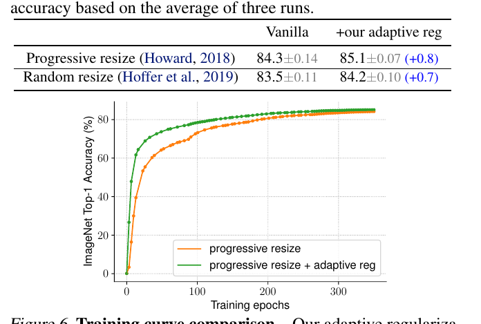

# EfficientNetV2: Smaller Models and Faster Training

>Mingxing Tan    Quoc V. Le

## 摘要

>## Abstract

本文介绍了 EfficientNetV2，这是一个新的卷积网络家族，与以前的模型相比，它具有更快的训练速度和更好的参数效率。为了开发这些模型，我们结合使用训练感知神经结构搜索和缩放，共同优化训练速度和参数效率。这些模型是从充满新操作（例如 Fused-MBConv）的搜索空间中搜索出来的。我们的实验表明，EfficientNetV2 模型的训练速度比最先进的模型快得多，同时体积缩小了 6.8 倍。

>This paper introduces EfficientNetV2, a new fam- ily of convolutional networks that have faster training speed and better parameter efficiency than previous models. To develop these models, we use a combination of training-aware neural ar- chitecture search and scaling, to jointly optimize training speed and parameter efficiency. The mod- els were searched from the search space enriched with new ops such as Fused-MBConv. Our ex- periments show that EfficientNetV2 models train much faster than state-of-the-art models while being up to 6.8x smaller.

通过在训练过程中逐渐增加图像大小，可以进一步加快我们的训练速度，但这通常会导致准确性下降。为了补偿这种精度下降，我们提出了一种改进的渐进式学习方法，它自适应地调整正则化（例如数据增强）以及图像大小。

>Our training can be further sped up by progres- sively increasing the image size during training, but it often causes a drop in accuracy. To com- pensate for this accuracy drop, we propose an improved method of progressive learning, which adaptively adjusts regularization (e.g. data aug- mentation) along with image size.

通过渐进式学习，我们的 EfficientNetV2 在 ImageNet 和 CIFAR/Cars/Flowers 数据集上的表现明显优于以前的模型。通过在相同的 ImageNet21k 上进行预训练，我们的 EfficientNetV2 在 ImageNet ILSVRC2012 上达到了 87.3% 的 top-1 精度，比最近的 ViT 高出 2.0% 的精度，同时使用相同的计算资源训练速度提高了 5-11 倍。代码可在 https://github.com/google/automl/tree/master/efficientnetv2 获得。

>With progressive learning, our EfficientNetV2 sig- nificantly outperforms previous models on Im- ageNet and CIFAR/Cars/Flowers datasets. By pretraining on the same ImageNet21k, our Effi- cientNetV2 achieves 87.3% top-1 accuracy on ImageNet ILSVRC2012, outperforming the re- cent ViT by 2.0% accuracy while training 5x-11x faster using the same computing resources. Code is available at https://github.com/google/ automl/tree/master/efficientnetv2.

## 1.简介

>## 1. Introduction

随着模型规模和训练数据规模越来越大，训练效率对深度学习很重要。例如，GPT-3 (Brown et al., 2020) 具有更大的模型和更多的训练数据，在few shot学习方面展示了卓越的能力，但它需要具有数千个 GPU数周的训练，因此很难重新训练或改进。

>Training efficiency is important to deep learning as model size and training data size are increasingly larger. For exam- ple, GPT-3 (Brown et al., 2020), with much a larger model and more training data, demonstrates the remarkable capa- bility in few shot learning, but it requires weeks of training with thousands of GPUs, making it difficult to retrain or improve.

图 1. ImageNet ILSVRC2012 top-1 精度 vs. 训练时间和参数——标记为 21k 的模型在 ImageNet21k 上进行预训练，其他模型直接在 ImageNet ILSVRC2012 上进行训练。训练时间是用 32 个 TPU 核心测量的。所有 EfficientNetV2 模型都经过渐进式学习训练。我们的 EfficientNetV2 训练速度比其他网络快 5 到 11 倍，同时使用的参数最多减少 6.8 倍。详情见表 7 和图 5。

>Figure 1. ImageNet ILSVRC2012 top-1 Accuracy vs. Training Time and Parameters – Models tagged with 21k are pretrained on ImageNet21k, and others are directly trained on ImageNet ILSVRC2012. Training time is measured with 32 TPU cores. All EfficientNetV2 models are trained with progressive learning. Our EfficientNetV2 trains 5x - 11x faster than others, while using up to 6.8x fewer parameters. Details are in Table 7 and Figure 5.

训练效率最近引起了人们的极大兴趣。例如，NFNets (Brock et al., 2021) 旨在通过移除昂贵的 batch 归一化来提高训练效率；最近的几项工作 (Srinivas et al., 2021) 侧重于通过在卷积网络 (ConvNets) 中添加注意力层来提高训练速度； Vision Transformers (Dosovitskiy et al., 2021) 通过使用 Transformer 块提高了大规模数据集的训练效率。然而，这些方法通常在大参数大小上带来昂贵的开销，如图 1(b) 所示。

>Training efficiency has gained significant interests recently. For instance, NFNets (Brock et al., 2021) aim to improve training efficiency by removing the expensive batch nor- malization; Several recent works (Srinivas et al., 2021) fo- cus on improving training speed by adding attention layers into convolutional networks (ConvNets); Vision Transform- ers (Dosovitskiy et al., 2021) improves training efficiency on large-scale datasets by using Transformer blocks. How- ever, these methods often come with expensive overhead on large parameter size, as shown in Figure 1(b).

在本文中，我们结合使用训练感知神经架构搜索 (NAS) 和缩放来提高训练速度和参数效率。鉴于 EfficientNets 的参数效率 (Tan & Le, 2019a)，我们首先系统地研究 EfficientNets 中的训练瓶颈。我们在 EfficientNets 中的研究表明：(1) 使用非常大的图像尺寸进行训练很慢； (2) depthwise卷积在早期层中很慢；(3) 平均扩大每个阶段是次优的。基于这些观察，我们设计了一个搜索空间，增加了 Fused-MBConv 等额外操作，并应用训练感知 NAS 和缩放来联合优化模型精度、训练速度和参数大小。我们发现的名为 EfficientNetV2 的网络的训练速度比之前的模型快 4 倍（图 3），同时参数大小减少了 6.8 倍。

>In this paper, we use an combination of training-aware neu- ral architecture search (NAS) and scaling to improve both training speed and parameter efficiency. Given the parame- ter efficiency of EfficientNets (Tan & Le, 2019a), we start by systematically studying the training bottlenecks in Effi- cientNets. Our study shows in EfficientNets: (1) training with very large image sizes is slow; (2) depthwise convolu- tions are slow in early layers. (3) equally scaling up every stage is sub-optimal. Based on these observations, we de- sign a search space enriched with additional ops such as Fused-MBConv, and apply training-aware NAS and scaling to jointly optimize model accuracy, training speed, and pa- rameter size. Our found networks, named EfficientNetV2, train up to 4x faster than prior models (Figure 3), while being up to 6.8x smaller in parameter size.

我们的训练可以通过在训练过程中逐渐增加图像大小来进一步加快。之前的许多工作，例如渐进式调整大小 (Howard, 2018)、FixRes (Touvron et al., 2019) 和 Mix&Match (Hoffer et al., 2019)，都在训练中使用了较小的图像尺寸；然而，它们通常对所有图像尺寸保持相同的正则化，导致精度下降。我们认为，对不同的图像尺寸保持相同的正则化并不理想：对于同一网络，较小的图像尺寸会导致较小的网络容量，因此需要弱正则化；反之亦然，大图像尺寸需要更强的正则化来对抗过度拟合（参见第 4.1 节）。基于这种洞察力，我们提出了一种改进的渐进式学习方法：在早期训练epochs中，我们训练具有小图像尺寸和弱正则化的网络（例如，dropout和数据增强），然后我们逐渐增加图像大小并添加更强的正则化。基于渐进式调整大小（Howard，2018），但通过动态调整正则化，我们的方法可以加快训练速度而不会导致准确性下降。

>Our training can be further sped up by progressively increas- ing image size during training. Many previous works, such as progressive resizing (Howard, 2018), FixRes (Touvron et al., 2019), and Mix&Match (Hoffer et al., 2019), have used smaller image sizes in training; however, they usually keep the same regularization for all image sizes, causing a drop in accuracy. We argue that keeping the same regular- ization for different image sizes is not ideal: for the same network, small image size leads to small network capac- ity and thus requires weak regularization; vice versa, large image size requires stronger regularization to combat overfit- ting (see Section 4.1). Based on this insight, we propose an improved method of progressive learning: in the early train- ing epochs, we train the network with small image size and weak regularization (e.g., dropout and data augmentation), then we gradually increase image size and add stronger reg- ularization. Built upon progressive resizing (Howard, 2018), but by dynamically adjusting regularization, our approach can speed up the training without causing accuracy drop.

通过改进的渐进式学习，我们的 EfficientNetV2 在 ImageNet、CIFAR-10、CIFAR-100、Cars 和 Flowers 数据集上取得了很好的结果。在 ImageNet 上，我们实现了 85.7% 的 top-1 准确率，同时训练速度比以前的模型快 3 到 9 倍，体积小 6.8 倍（图 1）。我们的 EfficientNetV2 和渐进式学习也使得在更大的数据集上训练模型变得更加容易。例如，ImageNet21k（Russakovsky 等人，2015 年）比 ImageNet ILSVRC2012 大 10 倍左右，但我们的 EfficientNetV2 可以使用 32 个 TPUv3 内核的中等计算资源在两天内完成训练。通过在公共 ImageNet21k 上进行预训练，我们的 EfficientNetV2 在 ImageNet ILSVRC2012 上达到了 87.3% 的 top-1 精度，比最近的 ViT-L/16 精度高出 2.0%，同时训练速度提高了 5-11 倍（图 1）。

>With the improved progressive learning, our EfficientNetV2 achieves strong results on ImageNet, CIFAR-10, CIFAR- 100, Cars, and Flowers dataset. On ImageNet, we achieve 85.7% top-1 accuracy while training 3x - 9x faster and being up to 6.8x smaller than previous models (Figure 1). Our Ef- ficientNetV2 and progressive learning also make it easier to train models on larger datasets. For example, ImageNet21k (Russakovsky et al., 2015) is about 10x larger than ImageNet ILSVRC2012, but our EfficientNetV2 can finish the training within two days using moderate computing resources of 32 TPUv3 cores. By pretraining on the public ImageNet21k, our EfficientNetV2 achieves 87.3% top-1 accuracy on Ima- geNet ILSVRC2012, outperforming the recent ViT-L/16 by 2.0% accuracy while training 5x-11x faster (Figure 1).

我们的贡献有三方面：

>Our contributions are threefold:

• 我们引入了 EfficientNetV2，这是一个更小、更快的新模型系列。通过我们的训练感知 NAS 和缩放发现，EfficientNetV2 在训练速度和参数效率方面优于以前的模型。

> • We introduce EfficientNetV2, a new family of smaller and faster models. Found by our training-aware NAS and scaling, EfficientNetV2 outperform previous mod- els in both training speed and parameter efficiency.

• 我们提出了一种改进的渐进式学习方法，它可以自适应地调整正则化以及图像大小。我们证明它可以加快训练速度，同时提高准确性。

> • We propose an improved method of progressive learn- ing, which adaptively adjusts regularization along with image size. We show that it speeds up training, and simultaneously improves accuracy.

• 我们在 ImageNet、CIFAR、Cars 和 Flowers 数据集上展示了比现有技术快 11 倍的训练速度和高 6.8 倍的参数效率。

>• We demonstrate up to 11x faster training speed and up to 6.8x better parameter efficiency on ImageNet, CIFAR, Cars, and Flowers dataset, than prior art.

## 2. 相关工作

>## 2. Related work

**训练和参数效率**：许多工作，例如 DenseNet (Huang et al., 2017) 和 EfficientNet (Tan & Le, 2019a)，都关注参数效率，旨在用更少的参数实现更好的精度。最近的一些工作旨在提高训练或推理速度而不是参数效率。例如，RegNet (Radosavovic et al., 2020)、ResNeSt (Zhang et al., 2020)、TResNet (Ridnik et al., 2020) 和 EfficientNet-X (Li et al., 2021) 专注于 GPU 和/或 TPU 推理速度； NFNets (Brock et al., 2021) 和 BoTNets (Srinivas et al., 2021) 专注于提高训练速度。然而，他们的训练或推理速度通常伴随着更多参数的成本。本文旨在比现有技术显着提高训练速度和参数效率。

>Training and parameter efficiency: Many works, such as DenseNet (Huang et al., 2017) and EfficientNet (Tan & Le, 2019a), focus on parameter efficiency, aiming to achieve better accuracy with less parameters. Some more recent works aim to improve training or inference speed instead of parameter efficiency. For example, RegNet (Radosavovic et al., 2020), ResNeSt (Zhang et al., 2020), TResNet (Ridnik et al., 2020), and EfficientNet-X (Li et al., 2021) focus on GPU and/or TPU inference speed; NFNets (Brock et al., 2021) and BoTNets (Srinivas et al., 2021) focus on improving training speed. However, their training or inference speed often comes with the cost of more parameters. This paper aims to significantly improve both training speed and parameter efficiency than prior art.

**渐进式训练**：以前的工作提出了不同类型的渐进式训练，动态改变训练设置或网络，用于 GAN（Karras 等人，2018 年）、迁移学习（Karras 等人，2018 年）、对抗性学习(Yu et al., 2019) 和语言模型 (Press et al., 2021)。渐进式调整大小 (Howard, 2018) 主要与我们的方法有关，旨在提高训练速度。然而，它通常伴随着精度下降的代价。另一个密切相关的工作是 Mix&Match（Hoffer 等人，2019），它为每个 batch 随机采样不同的图像大小。渐进式调整大小和 Mix&Match 都对所有图像大小使用相同的正则化，导致准确性下降。在本文中，我们的主要区别在于自适应调整正则化，以便我们可以提高训练速度和准确性。我们的方法也部分受到curriculum learning  (Bengio et al., 2009) 的启发，它将训练示例从易到难进行调度。我们的方法还通过添加更多正则化来逐渐增加学习难度，但我们不会选择性地选择训练示例。

>Progressive training: Previous works have proposed dif- ferent kinds of progressive training, which dynamically change the training settings or networks, for GANs (Karras et al., 2018), transfer learning (Karras et al., 2018), adver- sarial learning (Yu et al., 2019), and language models (Press et al., 2021). Progressive resizing (Howard, 2018) is mostly related to our approach, which aims to improve training speed. However, it usually comes with the cost of accuracy drop. Another closely related work is Mix&Match (Hoffer et al., 2019), which randomly sample different image size for each batch. Both progressive resizing and Mix&Match use the same regularization for all image sizes, causing a drop in accuracy. In this paper, our main difference is to adaptively adjust regularization as well so that we can im- prove both training speed and accuracy. Our approach is also partially inspired by curriculum learning (Bengio et al., 2009), which schedules training examples from easy to hard. Our approach also gradually increases learning difficulty by adding more regularization, but we don’t selectively pick training examples.

**神经架构搜索 (NAS)**：通过自动化网络设计过程，NAS 已被用于优化图像分类（Zoph 等人，2018 年）、目标检测（Chen 等人，2019 年；Tan 等人， 2020）、分割（Liu et al., 2019）、超参数（Dong et al., 2020）和其他应用（Elsken et al., 2019）。以前的 NAS 工作主要集中在提高 FLOPs 效率 (Tan & Le, 2019b;a) 或推理效率 (Tan et al., 2019; Cai et al., 2019; Wu et al., 2019; Li et al., 2021).与之前的工作不同，本文使用 NAS 来优化训练和参数效率。

>Neural architecture search (NAS): By automating the network design process, NAS has been used to optimize the network architecture for image classification (Zoph et al., 2018), object detection (Chen et al., 2019; Tan et al., 2020), segmentation (Liu et al., 2019), hyperparameters (Dong et al., 2020), and other applications (Elsken et al., 2019). Previous NAS works mostly focus on improving FLOPs efficiency (Tan & Le, 2019b;a) or inference efficiency (Tan et al., 2019; Cai et al., 2019; Wu et al., 2019; Li et al., 2021).Unlike prior works, this paper uses NAS to optimize training and parameter efficiency.

## 3.EfficientNetV2架构设计

>## 3.EfficientNetV2 Architecture Design

在本节中，我们研究了 EfficientNet 的训练瓶颈 (Tan & Le, 2019a)，并介绍了我们的训练感知 NAS 和缩放，以及 EfficientNetV2 模型。

>In this section, we study the training bottlenecks of Efficient- Net (Tan & Le, 2019a), and introduce our training-aware NAS and scaling, as well as EfficientNetV2 models.

### 3.1. EfficientNet 回顾

>### 3.1. Review of EfficientNet

EfficientNet (Tan & Le, 2019a) 是一系列针对 FLOP 和参数效率进行了优化的模型。它利用 NAS 搜索在准确性和 FLOPs 上具有更好权衡的baseline EfficientNet-B0。然后使用复合缩放策略对baseline模型进行缩放，以获得模型族 B1-B7。虽然最近的工作声称在训练或推理速度方面取得了很大的进步，但它们在参数和 FLOPs 效率方面通常比 EfficientNet 差（表 1）。在本文中，我们的目标是在保持参数效率的同时提高训练速度。

>EfficientNet (Tan & Le, 2019a) is a family of models that are optimized for FLOPs and parameter efficiency. It leverages NAS to search for the baseline EfficientNet-B0 that has better trade-off on accuracy and FLOPs. The baseline model is then scaled up with a compound scaling strategy to obtain a family of models B1-B7. While recent works have claimed large gains on training or inference speed, they are often worse than EfficientNet in terms of parameters and FLOPs efficiency (Table 1). In this paper, we aim to improve the training speed while maintaining the parameter efficiency.

表 1.EfficientNets 具有良好的参数和 FLOPs 效率。

>Table 1. EfficientNets have good parameter and FLOPs efficiency.

### 3.2.了解训练效率

>### 3.2. Understanding Training Efficiency

我们研究了 EfficientNet (Tan & Le, 2019a)（以下也称为 EfficientNetV1）的训练瓶颈，以及一些提高训练速度的简单技术。

>We study the training bottlenecks of EfficientNet (Tan & Le, 2019a), henceforth is also called EfficientNetV1, and a few simple techniques to improve training speed.

**使用非常大的图像进行训练很慢**：正如之前的工作（Radosavovic 等人，2020 年）所指出的那样，EfficientNet 的大图像会导致大量内存使用。由于 GPU/TPU 上的总内存是固定的，我们必须用较小的 batch 大小来训练这些模型，这大大减慢了训练速度。一个简单的改进是应用 FixRes（Touvron 等人，2019），通过使用比推理更小的图像尺寸进行训练。如表 2 所示，图像尺寸越小，计算量越少，batch 尺寸越大，训练速度最高可提高 2.2 倍。值得注意的是，正如 (Touvron et al., 2020; Brock et al., 2021) 中指出的那样，使用较小的图像尺寸进行训练也会带来稍好的准确性。但与 (Touvron et al., 2019) 不同的是，我们在训练后不对任何层进行微调。

>Training with very large image sizes is slow: As pointed out by previous works (Radosavovic et al., 2020), Efficient- Net’s large image size results in significant memory usage. Since the total memory on GPU/TPU is fixed, we have to train these models with smaller batch size, which drastically slows down the training. A simple improvement is to apply FixRes (Touvron et al., 2019), by using a smaller image size for training than for inference. As shown in Table 2, smaller image size leads to less computations and enables large batch size, and thus improves training speed by up to 2.2x. Notably, as pointed out in (Touvron et al., 2020; Brock et al., 2021), using smaller image size for training also leads to slightly better accuracy. But unlike (Touvron et al., 2019), we do not finetune any layers after training.

表2. 不同批量和图像大小的EfficientNet-B6准确性和训练吞吐量。

>Table 2. EfficientNet-B6 accuracy and training throughput for dif-ferent batch sizes and image size.

在第4节中，我们将探索一种更先进的训练方法，在训练中逐步调整图像大小和正则化。

> In Section 4, we will explore a more advanced training approach, by progressively adjusting image size and regu- larization during training.

**Depthwise卷积在早期层是缓慢的，但在后期阶段是有效的**: EfficientNet 的另一个训练瓶颈来自大量的 depthwise 卷积 (Sifre, 2014)。 Depthwise 卷积比常规卷积具有更少的参数和 FLOP，但它们通常不能充分利用现代加速器。最近，Fused-MBConv 在 (Gupta & Tan, 2019) 中提出，后来在 (Gupta & Akin, 2020; Xiong et al., 2020; Li et al., 2021) 中使用，以更好地利用移动端或服务器加速器。它将 MBConv (Sandler et al., 2018; Tan & Le, 2019a) 中的深度 conv3x3 和扩展 conv1x1 替换为单个常规 conv3x3，如图 2 所示。为了系统地比较这两个构建块，我们逐渐替换EfficientNet-B4 中的原始 MBConv 与 Fused-MBConv（表 3）。当应用于早期阶段 1-3 时，Fused-MBConv 可以提高训练速度，但参数和 FLOPs 的开销很小，但是如果我们用 Fused-MBConv 替换所有块（阶段 1-7），那么它会显着增加参数和 FLOPs 而也减慢了训练速度。找到这两个构建块（MBConv 和 Fused-MBConv）的正确组合并非易事，这促使我们利用神经架构搜索来自动搜索最佳组合。

>Depthwise convolutions are slow in early layers but ef- fective in later stages: Another training bottleneck of Ef- ficientNet comes from the extensive depthwise convolu- tions (Sifre, 2014). Depthwise convolutions have fewer parameters and FLOPs than regular convolutions, but they often cannot fully utilize modern accelerators. Recently, Fused-MBConv is proposed in (Gupta & Tan, 2019) and later used in (Gupta & Akin, 2020; Xiong et al., 2020; Li et al., 2021) to better utilize mobile or server accelerators. It replaces the depthwise conv3x3 and expansion conv1x1 in MBConv (Sandler et al., 2018; Tan & Le, 2019a) with a single regular conv3x3, as shown in Figure 2. To system- atically compares these two building blocks, we gradually replace the original MBConv in EfficientNet-B4 with Fused- MBConv (Table 3). When applied in early stage 1-3, Fused- MBConv can improve training speed with a small overhead on parameters and FLOPs, but if we replace all blocks with Fused-MBConv (stage 1-7), then it significantly increases parameters and FLOPs while also slowing down the train- ing. Finding the right combination of these two building blocks, MBConv and Fused-MBConv, is non-trivial, which motivates us to leverage neural architecture search to auto- matically search for the best combination.

图 2. MBConv 和 Fused-MBConv 的结构。

>Figure 2. Structure of MBConv and Fused-MBConv.

表3. 用Fused-MBConv替换MBConv。 No fused表示所有stage都使用MBConv，Fused stage1-3表示在{2，3，4}stage用Fused-MBConv替换MBConv。

>Table 3. Replacing MBConv with Fused-MBConv. No fused denotes all stages use MBConv,Fused stage1-3 denotes re- placing MBConv with Fused-MBConv in stage {2, 3, 4}.

**平均扩展每个阶段是次优的**：EfficientNet 使用简单的复合缩放规则平均扩展所有stage阶段。例如，当深度系数为2时，那么网络中的所有阶段都会将层数增加一倍。然而，这些阶段对训练速度和参数效率的贡献并不一样。在本文中，我们将使用非均匀缩放策略逐渐向后期阶段添加更多层。此外，EfficientNets 积极扩大图像大小，导致大量内存消耗和缓慢的训练。为了解决这个问题，我们稍微修改了缩放规则并将最大图像大小限制为较小的值。

>Equally scaling up every stage is sub-optimal: Efficient- Net equally scales up all stages using a simple compound scaling rule. For example, when depth coefficient is 2, then all stages in the networks would double the number of lay-ers. However, these stages are not equally contributed to the training speed and parameter efficiency. In this paper, we will use a non-uniform scaling strategy to gradually add more layers to later stages. In addition, EfficientNets ag- gressively scale up image size, leading to large memory consumption and slow training. To address this issue, we slightly modify the scaling rule and restrict the maximum image size to a smaller value.

### 3.3.训练感知 NAS 和扩展

>### 3.3. Training-Aware NAS and Scaling

为此，我们学习了多种设计选择来提高训练速度。为了寻找这些选择的最佳组合，我们现在提出了一种训练感知 NAS。

>To this end, we have learned multiple design choices for im- proving training speed. To search for the best combinations of those choices, we now propose a training-aware NAS.

**NAS 搜索**：我们的训练感知 NAS 框架主要基于以前的 NAS 工作（Tan et al., 2019; Tan & Le, 2019a），但旨在共同优化现代加速器的准确性、参数效率和训练效率。具体来说，我们使用 EfficientNet 作为我们的 backbone。我们的搜索空间是一个基于阶段的分解空间，类似于 (Tan et al., 2019)，它由卷积运算类型 {MBConv, Fused-MBConv} 的设计选择、层数、内核大小 {3x3、5x5} 组成, 膨胀率 {1, 4, 6}。另一方面，我们通过 (1) 删除不必要的搜索选项（例如 pooling skip ops）来减小搜索空间大小，因为它们从未在原始 EfficientNets 中使用过； (2) 重用来自 backbone 的相同通道大小，因为它们已经在 (Tan & Le, 2019a) 中搜索过。由于搜索空间较小，我们可以应用强化学习（Tan 等人，2019 年）或简单地在具有与 EfficientNet-B4 相当的规模的更大网络上进行随机搜索。具体而言，我们对多达 1000 个模型进行采样，并使用缩小的图像尺寸训练每个模型约 10 epochs 以进行训练。我们的搜索奖励结合了模型精度 A、归一化训练步长时间 S 和参数大小 P，使用简单的加权乘积

，其中 w = -0.07 和 v = -0.05 根据经验确定以平衡类似于 (Tan et al., 2019) 的权衡。

>NAS Search: Our training-aware NAS framework is largely based on previous NAS works (Tan et al., 2019; Tan & Le, 2019a), but aims to jointly optimize accuracy, parameter efficiency, and training efficiency on modern ac- celerators. Specifically, we use EfficientNet as our backbone. Our search space is a stage-based factorized space similar to (Tan et al., 2019), which consists of the design choices for convolutional operation types {MBConv, Fused-MBConv}, number of layers, kernel size {3x3, 5x5}, expansion ratio {1, 4, 6}. On the other hand, we reduce the search space size by (1) removing unnecessary search options such as pooling skip ops, since they are never used in the original Efficient- Nets; (2) reusing the same channel sizes from the backbone as they are already searched in (Tan & Le, 2019a). Since the search space is smaller, we can apply reinforcement learn- ing (Tan et al., 2019) or simply random search on much larger networks that have comparable size as EfficientNet- B4. Specifically, we sample up to 1000 models and train each model about 10 epochs with reduced image size for training. Our search reward combines the model accuracy A, the normalized training step time S, and the parameter size P , using a simple weighted product A · Sw · P v, where w = -0.07 and v = -0.05 are empirically determined to balance the trade-offs similar to (Tan et al., 2019).

**EfficientNetV2 架构**：表 4 显示了我们搜索的模型 EfficientNetV2-S 的架构。与 EfficientNet backbone 相比，我们搜索到的 EfficientNetV2 有几个主要区别：（1）第一个区别是 EfficientNetV2 广泛使用了 MBConv（Sandler et al., 2018; Tan & Le, 2019a）和在早期层新添加的fused-MBConv（ Gupta & Tan, 2019) 。(2) 其次，EfficientNetV2 更喜欢 MBConv 的较小扩展率，因为较小的扩展率往往具有较少的内存访问开销。(3) 第三，EfficientNetV2 更喜欢较小的 3x3 内核大小，但它增加了更多层以补偿较小内核大小导致的感受野减少。(4) 最后，EfficientNetV2 完全删除了原始 EfficientNet 中的最后一个 stride-1 阶段，这可能是由于其较大的参数大小和内存访问开销。

>EfficientNetV2 Architecture: Table 4 shows the architec- ture for our searched model EfficientNetV2-S. Compared to the EfficientNet backbone, our searched EfficientNetV2 has several major distinctions: (1) The first difference is EfficientNetV2 extensively uses both MBConv (Sandler et al., 2018; Tan & Le, 2019a) and the newly added fused-MBConv (Gupta & Tan, 2019) in the early layers. (2) Secondly, EfficientNetV2 prefers smaller expansion ratio for MBConv since smaller expansion ratios tend to have less memory access overhead. (3) Thirdly, EfficientNetV2 prefers smaller 3x3 kernel sizes, but it adds more layers to compensate the reduced receptive field resulted from the smaller kernel size. (4) Lastly, EfficientNetV2 completely removes the last stride-1 stage in the original EfficientNet, perhaps due to its large parameter size and memory access overhead.

表4. EfficientNetV2-S架构 - MBConv和Fused- MBConv模块的描述见图2。

>Table 4. EfficientNetV2-S architecture – MBConv and Fused-MBConv blocks are described in Figure 2.

EfficientNetV2 缩放：我们使用与 (Tan & Le, 2019a) 类似的复合缩放来放大 EfficientNetV2-S 以获得 EfficientNetV2-M/L，并进行了一些额外的优化：(1) 我们将最大推理图像大小限制为 480，因为非常大图像通常会导致昂贵的内存和训练速度开销； (2) 作为一种启发式方法，我们还逐渐向后期阶段添加更多层（例如，表 4 中的阶段 5 和 6），以便在不增加太多运行时开销的情况下增加网络容量。

>EfficientNetV2 Scaling: We scale up EfficientNetV2-S to obtain EfficientNetV2-M/L using similar compound scaling as (Tan & Le, 2019a), with a few additional optimizations: (1) we restrict the maximum inference image size to 480, as very large images often lead to expensive memory and training speed overhead; (2) as a heuristic, we also gradually add more layers to later stages (e.g., stage 5 and 6 in Table 4) in order to increase the network capacity without adding much runtime overhead.

图 3. TPUv3 上的 ImageNet 精度和训练步长时间——步长时间越短越好；所有模型都是用固定图像大小训练的，没有渐进式学习。

>Figure 3. ImageNet accuracy and training step time on TPUv3 – Lower step time is better; all models are trained with fixed image size without progressive learning.

**训练速度比较**：图 3 比较了我们新的 EfficientNetV2 的训练步骤时间，其中所有模型都使用固定图像大小进行训练，没有进行渐进式学习。对于 EfficientNet (Tan & Le, 2019a)，我们展示了两条曲线：一条是用原始推理大小训练的，另一条是用缩小约 30% 的图像大小训练的，与 EfficientNetV2 和 NFNet 相同（Touvron 等人，2019 年；布罗克等人，2021 年）。所有模型都用 350 epochs 训练，除了 NFNets 用 360 epochs 训练，所以所有模型都有相似数量的训练步骤。有趣的是，我们观察到如果训练得当，EfficientNets 仍然可以实现相当强的性能权衡。更重要的是，通过我们的训练感知的 NAS 和缩放，我们提出的 EfficientNetV2 模型训练速度比其他最近的模型快得多。这些结果也与我们的推理结果一致，如表7和图5所示。

>Training Speed Comparison: Figure 3 compares the train- ing step time for our new EfficientNetV2, where all models are trained with fixed image size without progressive learn- ing. For EfficientNet (Tan & Le, 2019a), we show two curves: one is trained with the original inference size, and the other is trained with about 30% smaller image size, same as EfficientNetV2 and NFNet (Touvron et al., 2019; Brock et al., 2021). All models are trained with 350 epochs, except NFNets are trained with 360 epochs, so all models have a similar number of training steps. Interestingly, we observe that when trained properly, EfficientNets still achieve pretty strong performance trade-off. More importantly, with our training-aware NAS and scaling, our proposed Efficient- NetV2 model train much faster than the other recent models. These results also align with our inference results as shown in Table 7 and Figure 5.

## 4. 渐进式学习

>## 4. Progressive Learning

### 4.1.动机

>### 4.1. Motivation

如第 3 节所述，图像大小在训练效率中起着重要作用。除了 FixRes (Touvron et al., 2019)，许多其他工作在训练期间动态改变图像大小 (Howard, 2018; Hoffer et al., 2019)，但它们通常会导致精度下降。

>As discussed in Section 3, image size plays an important role in training efficiency. In addition to FixRes (Touvron et al., 2019), many other works dynamically change image sizes during training (Howard, 2018; Hoffer et al., 2019), but they often cause a drop in accuracy.

我们假设精度下降来自不平衡的正则化：当使用不同的图像尺寸进行训练时，我们还应该相应地调整正则化强度（而不是像以前的工作那样使用固定的正则化）。事实上，大型模型通常需要更强的正则化来对抗过度拟合：例如，EfficientNet-B7 使用比 B0 更大的 dropout 和更强的数据增强。在本文中，我们认为即使对于相同的网络，较小的图像尺寸也会导致较小的网络容量，因此需要较弱的正则化；反之亦然，较大的图像尺寸会导致更多的计算和更大的容量，因此更容易出现过度拟合。

>We hypothesize the accuracy drop comes from the unbal- anced regularization: when training with different image sizes, we should also adjust the regularization strength ac- cordingly (instead of using a fixed regularization as in previ- ous works). In fact, it is common that large models require stronger regularization to combat overfitting: for example, EfficientNet-B7 uses larger dropout and stronger data aug- mentation than the B0. In this paper, we argue that even for the same network, smaller image size leads to smaller network capacity and thus needs weaker regularization; vice versa, larger image size leads to more computations with larger capacity, and thus more vulnerable to overfitting.

为了验证我们的假设，我们训练了一个模型，从我们的搜索空间中采样，具有不同的图像大小和数据增强（表 5）。当图像尺寸较小时，精度最好，增强较弱；但是对于更大的图像，它在更强的增强下表现更好。这种洞察促使我们在训练过程中自适应地调整正则化和图像大小，从而改进我们的渐进式学习方法。

>To validate our hypothesis, we train a model, sampled from our search space, with different image sizes and data aug- mentations (Table 5). When image size is small, it has the best accuracy with weak augmentation; but for larger im- ages, it performs better with stronger augmentation. This insight motivates us to adaptively adjust regularization along with image size during training, leading to our improved method of progressive learning.

表 5.ImageNet top-1 精度。我们使用 RandAug（Cubuk 等人，2020 年），并报告 3 次运行的均值和标准差。

>Table 5. ImageNet top-1 accuracy. We use RandAug (Cubuk et al., 2020), and report mean and stdev for 3 runs.

### 4.2.具有自适应正则化的渐进式学习

>### 4.2. Progressive Learning with adaptive Regularization

图 4 说明了我们改进的渐进式学习的训练过程：在早期训练 epochs 中，我们用较小的图像和弱正则化来训练网络，这样网络就可以轻松快速地学习简单的表示。然后，我们逐渐增加图像大小，但也通过添加更强的正则化来使学习更加困难。我们的方法建立在 (Howard, 2018) 之上，逐渐改变图像大小，但在这里我们也自适应地调整正则化。

>Figure 4 illustrates the training process of our improved progressive learning: in the early training epochs, we train the network with smaller images and weak regularization, such that the network can learn simple representations easily and fast. Then, we gradually increase image size but also making learning more difficult by adding stronger regular- ization. Our approach is built upon (Howard, 2018) that progressively changes image size, but here we adaptively adjust regularization as well.

形式上，假设整个训练总共有 N 个step步骤，目标图像大小为 

，具有正则化幅度列表 

，其中 k 表示一种正则化，例如 dropout 率或mixup率值。我们将训练分为 M 个阶段：对于每个阶段 1 ≤ i ≤ M，模型使用图像大小 

 和正则化幅度

进行训练。最后阶段 M 将使用目标图像大小 

 和正则化 

。为简单起见，我们试探性地选择初始图像大小 

 和正则化 

，然后使用线性插值来确定每个阶段的值。算法 1 总结了该过程。在每个阶段开始时，网络将继承上一阶段的所有权重。与权重（例如，位置嵌入）可能取决于输入长度的 transformers 不同，ConvNet 权重与图像大小无关，因此可以轻松继承。

>Formally, suppose the whole training has N total steps, the target image size is Se, with a list of regularization magni- tude Φe = {φke}, where k represents a type of regularization such as dropout rate or mixup rate value. We divide the train- ing into M stages: for each stage 1 ≤ i ≤ M , the model is trained with image size Si and regularization magnitude Φi = {φki}. The last stage M would use the targeted image size Se and regularization Φe. For simplicity, we heuristi- cally pick the initial image size S0 and regularization Φ0, and then use a linear interpolation to determine the value for each stage. Algorithm 1 summarizes the procedure. At the beginning of each stage, the network will inherit all weights from the previous stage. Unlike transformers, whose weights (e.g., position embedding) may depend on input length, ConvNet weights are independent to image sizes and thus can be inherited easily.

图 4. 我们改进的渐进式学习中的训练过程——它从小图像尺寸和弱正则化 (epoch=1) 开始，然后逐渐增加图像尺寸和更强正则化的学习难度：更大的 dropout 率，RandAugment 幅度和mixup比（例如，epoch=300）。

>Figure 4. Training process in our improved progressive learning – It starts with small image size and weak regularization (epoch=1), and then gradually increase the learning difficulty with larger im- age sizes and stronger regularization: larger dropout rate, Ran- dAugment magnitude, and mixup ratio (e.g., epoch=300).

算法1 具有自适应正则化的渐进式学习。

>Algorithm 1 Progressive learning with adaptive regularization.

我们改进的渐进式学习通常与现有的正则化兼容。为简单起见，本文主要研究以下三类正则化：

>Our improved progressive learning is generally compatible to existing regularization. For simplicity, this paper mainly studies the following three types of regularization:

•**Dropout** (Srivastava et al., 2014)：一种网络级正则化，通过随机丢弃通道来减少协同适应。我们将调整 dropout 率 γ。

>• Dropout (Srivastava et al., 2014): a network-level reg- ularization, which reduces co-adaptation by randomly dropping channels. We will adjust the dropout rate γ.

•**RandAugment**（Cubuk 等人，2020 年）：每幅图像的数据增强，幅度

可调。

>• RandAugment (Cubuk et al., 2020): a per-image data augmentation, with adjustable magnitude (cid:15).

•**Mixup** (Zhang et al., 2018)：交叉图像数据增强。给定两个带有标签
)
 和 
)
的图像，它将它们与mixup比率 λ 组合：∼xi = 
)
和
%20y_i)
。我们会在训练期间调整mixup比 λ。

>• Mixup (Zhang et al., 2018): a cross-image data aug- mentation. Given two images with labels (xi, yi) and (xj, yj), it combines them with mixup ratio λ: ˜xi = λxj + (1 − λ)xi and ˜yi = λyj + (1 − λ)yi. We would adjust mixup ratio λ during training.

## 5.主要结果

>## 5. Main Results

本节介绍我们的实验设置、ImageNet 上的主要结果以及在CIFAR-10, CIFAR-100, Cars, 和Flowers上迁移学习结果

>This section presents our experimental setups, the main results on ImageNet, and the transfer learning results on CIFAR-10, CIFAR-100, Cars, and Flowers.

### 5.1. ImageNet ILSVRC2012

>### 5.1. ImageNet ILSVRC2012

**设置**：ImageNet ILSVRC2012 (Russakovsky et al., 2015) 包含大约 1.28M 训练图像和 50,000 个验证图像以及 1000 个类别。在架构搜索或超参数调整期间，我们从训练集中保留 25,000 张图像（约 2%）作为准确性评估的minival。我们还使用 minival 来执行提前停止。我们的 ImageNet 训练设置主要遵循 EfficientNets (Tan & Le, 2019a)：RMSProp 优化器，衰减为 0.9，动量为 0.9； batch 范数动量 0.99；权重衰减 1e-5。每个模型训练 350 epochs，总 batch 大小为 4096。学习率首先从 0 预热到 0.256，然后每 2.4 epochs 衰减 0.97。我们使用衰减率为 0.9999 的指数移动平均线、RandAugment（Cubuk 等人，2020 年）、Mixup（Zhang 等人，2018 年）、Dropout（Srivastava 等人，2014 年）和具有 0.8 的存在概率的随机深度（Huang 等人，2016 年）。

>Setup: ImageNet ILSVRC2012 (Russakovsky et al., 2015) contains about 1.28M training images and 50,000 validation images with 1000 classes. During architecture search or hyperparameter tuning, we reserve 25,000 images (about 2%) from the training set as minival for accuracy evalua- tion. We also use minival to perform early stopping. Our ImageNet training settings largely follow EfficientNets (Tan & Le, 2019a): RMSProp optimizer with decay 0.9 and momentum 0.9; batch norm momentum 0.99; weight de- cay 1e-5. Each model is trained for 350 epochs with total batch size 4096. Learning rate is first warmed up from 0 to 0.256, and then decayed by 0.97 every 2.4 epochs. We use exponential moving average with 0.9999 decay rate, RandAugment (Cubuk et al., 2020), Mixup (Zhang et al., 2018), Dropout (Srivastava et al., 2014), and stochastic depth (Huang et al., 2016) with 0.8 survival probability.

表 6. EfficientNetV2 的渐进式训练设置。

>Table 6. Progressive training settings for EfficientNetV2.

对于渐进式学习，我们将训练过程分为四个阶段，每个阶段约 87 epochs：早期阶段使用具有弱正则化的小图像尺寸，而后期阶段使用具有更强正则化的较大图像尺寸，如算法 1 中所述。 表 6 显示了图像大小和正则化的最小值（对于第一阶段）和最大值（对于最后阶段）。为简单起见，所有模型都使用相同的大小和正则化最小值，但它们采用不同的最大值，因为较大的模型通常需要更多的正则化来对抗过度拟合。按照 (Touvron et al., 2020)，我们用于训练的最大图像尺寸比推理小约 20%，但我们在训练后没有微调任何层。

>For progressive learning, we divide the training process into four stages with about 87 epochs per stage: the early stage uses a small image size with weak regularization, while the later stages use larger image sizes with stronger regularization, as described in Algorithm 1. Table 6 shows the minimum (for the first stage) and maximum (for the last stage) values of image size and regularization. For simplicity, all models use the same minimum values of size and regularization, but they adopt different maximum values, as larger models generally require more regularization to combat overfitting. Following (Touvron et al., 2020), our maximum image size for training is about 20% smaller than inference, but we don’t finetune any layers after training.

**结果**：如表 7 所示，我们的 EfficientNetV2 模型比以前的 ImageNet 上的 ConvNets 和 Transformers 明显更快，并且具有更好的精度和参数效率。特别是，我们的 EfficientNetV2-M 达到了与 EfficientNet-B7 相当的精度，同时使用相同的计算资源训练速度提高了 11 倍。我们的 EfficientNetV2 模型在准确性和推理速度方面也明显优于所有最新的 RegNet 和 ResNeSt。图 1 进一步可视化了训练速度和参数效率的比较。值得注意的是，这种加速是渐进式训练和更好网络的结合，我们将在我们的消融研究中研究它们各自的影响。

> Results: As shown in Table 7, our EfficientNetV2 mod- els are significantly faster and achieves better accuracy and parameter efficiency than previous ConvNets and Trans- formers on ImageNet. In particular, our EfficientNetV2- M achieves comparable accuracy to EfficientNet-B7 while training 11x faster using the same computing resources. Our EfficientNetV2 models also significantly outperform all re- cent RegNet and ResNeSt, in both accuracy and inference speed. Figure 1 further visualizes the comparison on train- ing speed and parameter efficiency. Notably, this speedup is a combination of progressive training and better networks, and we will study the individual impact for each of them in our ablation studies.

最近，Vision Transformers 在 ImageNet 准确性和训练速度方面取得了令人印象深刻的结果。然而，我们在这里展示了经过改进的训练方法的正确设计的 ConvNets 在准确性和训练效率方面仍然可以在很大程度上优于Vision transformers。特别是，我们的 EfficientNetV2-L 达到了 85.7% 的 top-1 准确率，超过了 ViT-L/16(21k)，这是一个在更大的 ImageNet21k 数据集上预训练的更大的transformer模型。在这里，ViT 在 ImageNet ILSVRC2012 上没有得到很好的tune； DeiTs 使用与 ViTs 相同的架构，但通过添加更多正则化获得更好的结果。

> Recently, Vision Transformers have demonstrated impres- sive results on ImageNet accuracy and training speed. How- ever, here we show that properly designed ConvNets with improved training method can still largely outperform vi- sion transformers in both accuracy and training efficiency. In particular, our EfficientNetV2-L achieves 85.7% top-1 accuracy, surpassing ViT-L/16(21k), a much larger trans- former model pretrained on a larger ImageNet21k dataset. Here, ViTs are not well tuned on ImageNet ILSVRC2012; DeiTs use the same architectures as ViTs, but achieve better results by adding more regularization.

尽管我们的 EfficientNetV2 模型针对训练进行了优化，但它们在推理方面也表现良好，因为训练速度通常与推理速度相关。图 5 根据表 7 可视化了模型大小、FLOP 和推理延迟。由于延迟通常取决于硬件和软件，因此我们在这里使用相同的 PyTorch Image Models 代码库（Wightman，2021）并在同一台机器上运行所有模型使用 batch 大小 16。一般来说，我们的模型的参数/FLOPs 效率略好于 EfficientNets，但我们的推理延迟比 EfficientNets 快 3 倍。与最近专门针对 GPU 优化的 ResNeSt 相比，我们的 EfficientNetV2-M 的准确率提高了 0.6%，推理速度提高了 2.8 倍。

>Although our EfficientNetV2 models are optimized for train- ing, they also perform well for inference, because training speed often correlates with inference speed. Figure 5 visu- alizes the model size, FLOPs, and inference latency based on Table 7. Since latency often depends on hardware and software, here we use the same PyTorch Image Models codebase (Wightman, 2021) and run all models on the same machine using the batch size 16. In general, our models have slightly better parameters/FLOPs efficiency than Effi- cientNets, but our inference latency is up to 3x faster than EfficientNets. Compared to the recent ResNeSt that are spe- cially optimized for GPUs, our EfficientNetV2-M achieves 0.6% better accuracy with 2.8x faster inference speed.

### 5.2. ImageNet21k

>### 5.2. ImageNet21k

设置：ImageNet21k（Russakovsky 等人，2015 年）包含约 1300 万张训练图像和 21,841 个类别。原始的 ImageNet21k 没有训练/评估拆分，因此我们保留随机挑选的 100,000 张图像作为验证集，并将其余图像用作训练集。我们在很大程度上重用了与 ImageNet ILSVRC2012 相同的训练设置，并进行了一些更改：(1) 我们将训练 epochs 更改为 60 或 30 以减少训练时间，并使用无需额外调整即可适应不同步骤的余弦学习率衰减； (2) 由于每个图像都有多个标签，我们在计算 softmax 损失之前将标签归一化为总和为 1。在 ImageNet21k 上预训练后，每个模型都在 ILSVRC2012 上进行使用15个epoch的余弦学习率衰减的微调。

>Setup: ImageNet21k (Russakovsky et al., 2015) contains about 13M training images with 21,841 classes. The original ImageNet21k doesn’t have train/eval split, so we reserve ran- domly picked 100,000 images as validation set and use the remaining as training set. We largely reuse the same training settings as ImageNet ILSVRC2012 with a few changes: (1) we change the training epochs to 60 or 30 to reduce training time, and use cosine learning rate decay that can adapt to different steps without extra tuning; (2) since each image has multiple labels, we normalize the labels to have sum of 1 before computing softmax loss. After pretrained on ImageNet21k, each model is finetuned on ILSVRC2012 for 15 epochs using cosine learning rate decay.

**结果**：表 7 显示了性能比较，其中标记为 21k 的模型在 ImageNet21k 上进行了预训练，并在 ImageNet ILSVRC2012 上进行了微调。与最近的 ViT-L/16(21k) 相比，我们的 EfficientNetV2-L(21k) 将 top-1 准确率提高了 1.5% (85.3% vs. 86.8%)，使用的参数减少了 2.5 倍，参数减少了 3.6 倍FLOPs，同时在训练和推理中运行速度提高 6 到 7 倍。

>Results: Table 7 shows the performance comparison, where models tagged with 21k are pretrained on Ima- geNet21k and finetuned on ImageNet ILSVRC2012. Com- pared to the recent ViT-L/16(21k), our EfficientNetV2- L(21k) improves the top-1 accuracy by 1.5% (85.3% vs. 86.8%), using 2.5x fewer parameters and 3.6x fewer FLOPs, while running 6x - 7x faster in training and inference.

表 7.**EfficientNetV2 在 ImageNet 上的性能结果**（Russakovsky 等人，2015 年）——推理时间是在 V100 GPU FP16 上测量的，批大小为 16，使用相同的代码库（Wightman，2021 年）； 训练时间是为 32 个 TPU 核心标准化的总训练时间。 标有 21k 的模型是在 ImageNet21k 上用 13M 图像进行预训练的，其他模型是直接在 ImageNet ILSVRC2012 上用 1.28M 图像从头开始训练的。 所有 EfficientNetV2 模型都使用我们改进的渐进式学习方法进行训练。

>Table 7. EfficientNetV2 Performance Results on ImageNet (Russakovsky et al., 2015) – Infer-time is measured on V100 GPU FP16 with batch size 16 using the same codebase (Wightman, 2021); Train-time is the total training time normalized for 32 TPU cores. Models marked with 21k are pretrained on ImageNet21k with 13M images, and others are directly trained on ImageNet ILSVRC2012 with 1.28M images from scratch. All EfficientNetV2 models are trained with our improved method of progressive learning.

我们不包括在非公开 Instagram/JFT 图像上预训练的模型，或具有额外蒸馏或 ensemble 的模型。

>We do not include models pretrained on non-public Instagram/JFT images, or models with extra distillation or ensemble.

图 5.**模型大小、FLOP 和推理延迟** - 延迟是在 V100 GPU 上使用 batch 大小 16 测量的。 21k 表示在 ImageNet21k 图像上预训练，其他只在 ImageNet ILSVRC2012 上训练。我们的 EfficientNetV2 与 EfficientNet 相比参数效率略高，但推理速度提高了 3 倍。

>Figure 5. Model Size, FLOPs, and Inference Latency – Latency is measured with batch size 16 on V100 GPU. 21k denotes pretrained on ImageNet21k images, others are just trained on ImageNet ILSVRC2012. Our EfficientNetV2 has slightly better parameter efficiency with EfficientNet, but runs 3x faster for inference.

表 8. 迁移学习性能比较——所有模型都在 ImageNet ILSVRC2012 上进行了预训练，并在下游数据集上进行了微调。 迁移学习准确度是五次运行的平均值。

>Table 8. Transfer Learning Performance Comparison – All models are pretrained on ImageNet ILSVRC2012 and finetuned on downstream datasets. Transfer learning accuracy is averaged over five runs.

我们想强调一些有趣的观察结果：

>We would like to highlight a few interesting observations:

• 扩大数据规模比简单地扩大高精度体系中的模型规模更有效：当 top-1 精度超过 85% 时，由于严重的过拟合，很难通过简单地增加模型大小来进一步改进它。然而，额外的 ImageNet21K 预训练可以显着提高准确性。在以前的工作中也观察到了大型数据集的有效性 (Mahajan et al., 2018; Xie et al., 2020; Dosovitskiy et al., 2021)。

>• Scaling up data size is more effective than simply scal- ing up model size in high-accuracy regime: when the top-1 accuracy is beyond 85%, it is very difficult to further improve it by simply increasing model size due to the severe overfitting. However, the extra Im- ageNet21K pretraining can significantly improve ac- curacy. The effectiveness of large datasets is also ob- served in previous works (Mahajan et al., 2018; Xie et al., 2020; Dosovitskiy et al., 2021).

• 在ImageNet21k 上进行预训练可能非常有效。尽管 ImageNet21k 的数据多 10 倍，但我们的训练方法使我们能够使用 32 个 TPU 核在两天内完成 EfficientNetV2 的预训练（而不是 ViT 的数周时间（Dosovitskiy 等人，2021））。这比在 ImageNet 上训练更大的模型更有效。我们建议未来对大规模模型的研究使用公共 ImageNet21k 作为默认数据集。

>• Pretraining on ImageNet21k could be quite efficient. Although ImageNet21k has 10x more data, our training approach enables us to finish the pretraining of Effi- cientNetV2 within two days using 32 TPU cores (in- stead of weeks for ViT (Dosovitskiy et al., 2021)). This is more effective than training larger models on Ima- geNet. We suggest future research on large-scale mod- els use the public ImageNet21k as a default dataset.

### 5.3.迁移学习数据集

>### 5.3. Transfer Learning Datasets

**设置**：我们在四个迁移学习数据集上评估我们的模型：CIFAR-10、CIFAR-100、Flowers 和 Cars。表9 包括这些数据集的统计数据。

>Setup: We evaluate our models on four transfer learning datasets: CIFAR-10, CIFAR-100, Flowers and Cars. Table 9 includes the statistics of these datasets.

表 9. 迁移学习数据集

> Table 9. Transfer learning datasets

对于这个实验，我们使用在 ImageNet ILSVRC2012 上训练的 checkpoints。为了公平比较，这里没有使用 ImageNet21k 图像。我们的微调设置与 ImageNet 训练基本相同，但有一些修改类似于（Dosovitskiy 等人，2021 年；Touvron 等人，2021 年）：我们使用较小的 batch 大小 512，较小的初始学习率 0.001 和余弦衰减。对于所有数据集，我们训练每个模型固定的 10,000 步。由于每个模型都用很少的步骤进行微调，我们禁用权重衰减并使用简单的cutout数据增强。

>For this experiment, we use the checkpoints trained on Ima- geNet ILSVRC2012. For fair comparison, no ImageNet21k images are used here. Our finetuning settings are mostly the same as ImageNet training with a few modifications similar to (Dosovitskiy et al., 2021; Touvron et al., 2021): We use smaller batch size 512, smaller initial learning rate 0.001 with cosine decay. For all datasets, we train each model for fixed 10,000 steps. Since each model is finetuned with very few steps, we disable weight decay and use a simple cutout data augmentation.

**结果**：表 8 比较了迁移学习的性能。总的来说，对于所有这些数据集，我们的模型都优于以前的 ConvNets 和 Vision Transformers，有时差距很大：例如，在 CIFAR-100 上，EfficientNetV2-L 的精度比之前的 GPipe/ EfficientNets 和比之前的 ViT/DeiT 模型高 1.5% 的准确度。这些结果表明我们的模型的泛化能力也远远超出了 ImageNet。

>Results: Table 8 compares the transfer learning perfor- mance. In general, our models outperform previous Con- vNets and Vision Transformers for all these datasets, some- times by a non-trivial margin: for example, on CIFAR-100, EfficientNetV2-L achieves 0.6% better accuracy than prior GPipe/EfficientNets and 1.5% better accuracy than prior ViT/DeiT models. These results suggest that our models also generalize well beyond ImageNet.

## 6.消融研究

>## 6. Ablation Studies

### 6.1.与 EfficientNet 的比较

>### 6.1. Comparison to EfficientNet

在本节中，我们将在相同的训练和推理设置下将我们的 EfficientNetV2（简称 V2）与 EfficientNets (Tan & Le, 2019a)（简称 V1）进行比较。

>In this section, we will compare our EfficientNetV2 (V2 for short) with EfficientNets (Tan & Le, 2019a) (V1 for short) under the same training and inference settings.

**相同训练的性能**：表 10 显示了使用相同渐进式学习设置的性能比较。由于我们将相同的渐进式学习应用于 EfficientNet，其训练速度（从 139 小时减少到 54 小时）和准确性（从 84.7% 提高到 85.0%）优于原始论文（Tan & Le，2019a）。然而，如表 10 所示，我们的 EfficientNetV2 模型仍然大大优于 EfficientNets：EfficientNetV2-M 将参数减少了 17%，将 FLOPs 减少了 37%，同时训练速度比 EfficientNet 快 4.1 倍，推理速度快 3.1 倍-B7。由于我们在这里使用相同的训练设置，我们将收益归功于 EfficientNetV2 架构。

>Performance with the same training: Table 10 shows the performance comparison using the same progressive learn- ing settings. As we apply the same progressive learning to EfficientNet, its training speed (reduced from 139h to 54h) and accuracy (improved from 84.7% to 85.0%) are better than the original paper (Tan & Le, 2019a). How- ever, as shown in Table 10, our EfficientNetV2 models still outperform EfficientNets by a large margin: EfficientNetV2- M reduces parameters by 17% and FLOPs by 37%, while running 4.1x faster in training and 3.1x faster in inference than EfficientNet-B7. Since we are using the same training settings here, we attribute the gains to the EfficientNetV2 architecture.

表 10. 与相同训练设置的比较——我们新的 EfficientNetV2-M 使用更少的参数运行得更快。

>Table 10. Comparison with the same training settings – Our new EfficientNetV2-M runs faster with less parameters.

**按比例缩小**：前面的部分主要关注大型模型。在这里，我们通过使用 EfficientNet 复合缩放缩小我们的 EfficientNetV2-S 来比较较小的模型。为了便于比较，所有模型都在没有渐进式学习的情况下进行训练。与小型 EfficientNets (V1) 相比，我们新的EfficientNetV2(V2)模型在保持相当的参数效率的同时，总体上更快。

>Scaling Down: Previous sections mostly focus on large- scale models. Here we compare smaller models by scaling down our EfficientNetV2-S using EfficientNet compound scaling. For easy comparison, all models are trained without progressive learning. Compared to small-size EfficientNets (V1), our new EfficientNetV2 (V2) models are generally faster while maintaining comparable parameter efficiency.

表 11.按比例缩小模型大小——我们测量 V100 FP16 GPU 上的推理吞吐量（图像/秒），batch 大小为 128。

>Table 11. Scaling down model size – We measure the inference throughput (images/sec) on V100 FP16 GPU with batch size 128.

### 6.2.不同网络的渐进式学习

>### 6.2. Progressive Learning for Different Networks

我们消除了我们对不同网络的渐进式学习的表现。表 12 显示了我们的渐进式训练和baseline训练之间的性能比较，使用相同的 ResNet 和 EfficientNet 模型。在这里，baseline ResNets 比原始论文 (He et al., 2016) 具有更高的准确性，因为它们是通过我们改进的训练设置（见第 5 节）使用更多 epochs 和更好的优化器进行训练的。我们还将 ResNet 的图像大小从 224 增加到 380，以进一步增加网络容量和准确性。

>We ablate the performance of our progressive learning for different networks. Table 12 shows the performance com- parison between our progressive training and the baseline training, using the same ResNet and EfficientNet models. Here, the baseline ResNets have higher accuracy than the original paper (He et al., 2016) because they are trained with our improved training settings (see Section 5) using more epochs and better optimizers. We also increase the image size from 224 to 380 for ResNets to further increase the network capacity and accuracy.

表 12. ResNets 和 EfficientNets 的渐进式学习——(224) 和 (380) 表示推理图像大小。我们的渐进式训练提高了所有网络的准确性和训练时间。

>Table 12. Progressive learning for ResNets and EfficientNets – (224) and (380) denote inference image size. Our progressive train- ing improves both accuracy and training time for all networks.

如表 12 所示，我们的渐进式学习通常减少了训练时间，同时提高了所有不同网络的准确性。毫不奇怪，当默认图像尺寸非常小时，例如尺寸为 224x224 的 ResNet50(224)，训练加速是有限的（1.4 倍加速）；然而，当默认图像尺寸更大且模型更复杂时，我们的方法在准确性和训练效率方面取得了更大的收益：对于 ResNet152(380)，我们的方法将训练速度提高了 2.1 倍，略好一些准确性;对于 EfficientNet-B4，我们的方法将训练速度提高了 2.2 倍。

>As shown in Table 12, our progressive learning generally reduces the training time and meanwhile improves the accu- racy for all different networks. Not surprisingly, when the default image size is very small, such as ResNet50(224) with 224x224 size, the training speedup is limited (1.4x speedup); however, when the default image size is larger and the model is more complex, our approach achieves larger gains on ac- curacy and training efficiency: for ResNet152(380), our ap- proach improves speed up the training by 2.1x with slightly better accuracy; for EfficientNet-B4, our approach improves speed up the training by 2.2x.

### 6.3.自适应正则化的重要性

>### 6.3. Importance of Adaptive Regularization

我们训练方法的一个关键见解是自适应正则化，它根据图像大小动态调整正则化。本文选择了一种简单的渐进式方法，因为它的简单性，但它也是一种可以与其他方法结合的通用方法。

>A key insight from our training approach is the adaptive regularization, which dynamically adjusts regularization according to image size. This paper chooses a simple pro- gressive approach for its simplicity, but it is also a general method that can be combined with other approaches.

表 13 研究了我们在两种训练设置上的自适应正则化：一种是将图像大小从小逐渐增加到大（Howard，2018），另一种是为每个 batch 随机采样不同的图像大小（Hoffer 等人， 2019）。因为 TPU 需要为每个新尺寸重新编译图形，所以这里我们每八个 epochs 而不是每个 batch 随机采样一个图像尺寸。与对所有图像大小使用相同正则化的渐进式或随机调整大小的普通方法相比，我们的自适应正则化将精度提高了 0.7%。图 6 进一步比较了渐进式方法的训练曲线。我们的自适应正则化在早期训练中对小图像使用更小的正则化 epochs，使模型能够更快地收敛并获得更好的最终精度。

>Table 13 studies our adaptive regularization on two training settings: one is to progressively increase image size from small to large (Howard, 2018), and the other is to randomly sample a different image size for each batch (Hoffer et al., 2019). Because TPU needs to recompile the graph for each new size, here we randomly sample a image size every eight epochs instead of every batch. Compared to the vanilla approaches of progressive or random resizing that use the same regularization for all image sizes, our adaptive regu- larization improves the accuracy by 0.7%. Figure 6 further compares the training curve for the progressive approach. Our adaptive regularization uses much smaller regulariza- tion for small images at the early training epochs, allowing models to converge faster and achieve better final accuracy.

表 13. 自适应正则化——我们根据三个运行的平均值比较 ImageNet top-1 精度。

>Table 13. Adaptive regularization – We compare ImageNet top-1 accuracy based on the average of three runs.

图 6. 训练曲线比较——我们的自适应正则化收敛速度更快，最终精度更高。

>Figure 6. Training curve comparison – Our adaptive regulariza- tion converges faster and achieves better final accuracy.

## 7.结论

>## 7. Conclusion

本文介绍了 EfficientNetV2，这是一个用于图像识别的更小、更快的神经网络新系列。通过训练感知 NAS 和模型缩放进行优化，我们的 EfficientNetV2 明显优于以前的模型，同时在参数方面更快、更高效。为了进一步加快训练速度，我们提出了一种改进的渐进式学习方法，在训练过程中共同增加图像大小和正则化。大量实验表明我们的 EfficientNetV2 在 ImageNet 和 CIFAR/Flowers/Cars 上取得了很好的结果。与 EfficientNet 和最近的工作相比，我们的 EfficientNetV2 训练速度提高了 11 倍，同时体积缩小了 6.8 倍。

>This paper presents EfficientNetV2, a new family of smaller and faster neural networks for image recognition. Optimized with training-aware NAS and model scaling, our Efficient- NetV2 significantly outperforms previous models, while being much faster and more efficient in parameters. To fur- ther speed up the training, we propose an improved method of progressive learning, that jointly increases image size and regularization during training. Extensive experiments show our EfficientNetV2 achieves strong results on Ima- geNet, and CIFAR/Flowers/Cars. Compared to EfficientNet and more recent works, our EfficientNetV2 trains up to 11x faster while being up to 6.8x smaller.
