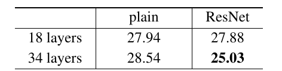
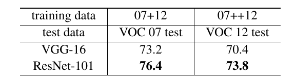

# Deep Residual Learning for Image Recognition

>Kaiming He Xiangyu Zhang Shaoqing Ren Jian Sun

>{kahe, v-xiangz, v-shren, jiansun}@microsoft.com

## 摘要

>## Abstract

更深的神经网络更难训练。我们提出了一个残差学习框架，以简化比以前使用的网络更深的网络的训练。我们明确地将层重新表述为引用输入的学习残差函数，而不是学习未引用的函数。我们提供了全面的经验证据，表明这些残差网络更容易优化，并且可以从显着增加的深度中获得准确性。在 ImageNet 数据集上，我们评估了深度高达 152 层的残差网络——比 VGG 网络 [41] 深 8x，但仍然具有较低的复杂性。这些残差网络的集合在 ImageNet 测试集上达到了 3.57% 的错误率。该结果在 ILSVRC 2015 分类任务中获得第一名。我们还对具有 100 层和 1000 层的 CIFAR-10 进行了分析。

>Deeper neural networks are more difficult to train. We present a residual learning framework to ease the training of networks that are substantially deeper than those used previously. We explicitly reformulate the layers as learn- ing residual functions with reference to the layer inputs, in- stead of learning unreferenced functions. We provide com- prehensive empirical evidence showing that these residual networks are easier to optimize, and can gain accuracy from considerably increased depth. On the ImageNet dataset we evaluate residual nets with a depth of up to 152 layers—8⇥ deeper than VGG nets [41] but still having lower complex- ity. An ensemble of these residual nets achieves 3.57% error on the ImageNet test set. This result won the 1st place on the ILSVRC 2015 classification task. We also present analysis on CIFAR-10 with 100 and 1000 layers.

表示的深度对于许多视觉识别任务至关重要。仅由于我们极深的表示，我们在 COCO 目标检测数据集上获得了 28% 的相对改进。深度残差网络是我们提交给 ILSVRC 和 COCO 2015 竞赛的基础，我们还在 ImageNet 检测、ImageNet 定位、COCO 检测和 COCO 分割任务上获得了第一名。

>The depth of representations is of central importance for many visual recognition tasks. Solely due to our ex- tremely deep representations, we obtain a 28% relative im- provement on the COCO object detection dataset. Deep residual nets are foundations of our submissions to ILSVRC & COCO 2015 competitions1, where we also won the 1st places on the tasks of ImageNet detection, ImageNet local- ization, COCO detection, and COCO segmentation.

## 1.简介

>## 1. Introduction

深度卷积神经网络 [22、21] 已经在图像分类领域取得了一系列突破 [21、50、40]。深度网络以端到端的多层方式自然地集成了低/中/高级特征[50]和分类器，并且特征的“层次”可以通过堆叠层数（深度）来丰富。最近的证据 [41、44] 表明网络深度至关重要，在具有挑战性的 ImageNet 数据集 [36] 上的领先结果 [41、44、13、16] 都利用“非常深”的 [41] 模型，具有深度为十六 [41] 至三十 [16]。许多其他重要的视觉识别任务 [8、12、7、32、27] 也极大地受益于非常深的模型。

>Deep convolutional neural networks [22, 21] have led to a series of breakthroughs for image classification [21, 50, 40]. Deep networks naturally integrate low/mid/high- level features [50] and classifiers in an end-to-end multi- layer fashion, and the “levels” of features can be enriched by the number of stacked layers (depth). Recent evidence [41, 44] reveals that network depth is of crucial importance, and the leading results [41, 44, 13, 16] on the challenging ImageNet dataset [36] all exploit “very deep” [41] models, with a depth of sixteen [41] to thirty [16]. Many other non- trivial visual recognition tasks [8, 12, 7, 32, 27] have also greatly benefited from very deep models.

图 1. CIFAR-10 上具有 20 层和 56 层“普通”网络的训练误差（左）和测试误差（右）。更深的网络具有更高的训练误差，因此具有更高的测试误差。 ImageNet 上的类似现象如图 4 所示。

>Figure 1. Training error (left) and test error (right) on CIFAR-10 with 20-layer and 56-layer “plain” networks. The deeper network has higher training error, and thus test error. Similar phenomena on ImageNet is presented in Fig. 4.

在深度重要性的驱动下，出现了一个问题：学习更好的网络是否像堆叠更多层一样容易？回答这个问题的一个障碍是臭名昭著的梯度消失/爆炸问题 [1, 9]，它从一开始就阻碍了收敛。然而，这个问题已在很大程度上通过归一化初始化 [23、9、37、13] 和中间归一化层 [16] 得到解决，这使得具有数十层的网络开始收敛以进行随机梯度下降 (SGD)反向传播[22]。

>Driven by the significance of depth, a question arises: Is learning better networks as easy as stacking more layers? An obstacle to answering this question was the notorious problem of vanishing/exploding gradients [1, 9], which hamper convergence from the beginning. This problem, however, has been largely addressed by normalized initial- ization [23, 9, 37, 13] and intermediate normalization layers [16], which enable networks with tens of layers to start con- verging for stochastic gradient descent (SGD) with back- propagation [22].

当更深的网络能够开始收敛时，一个退化问题就暴露出来了：随着网络深度的增加，准确度会饱和（这可能不足为奇），然后迅速退化。出乎意料的是，这种退化不是由过度拟合引起的，并且向适当深度的模型添加更多层会导致更高的训练误差，如 [11, 42] 中所报告的那样，并通过我们的实验进行了彻底验证。图 1 显示了一个典型的例子。

>When deeper networks are able to start converging, a degradation problem has been exposed: with the network depth increasing, accuracy gets saturated (which might be unsurprising) and then degrades rapidly. Unexpectedly, such degradation is not caused by overfitting, and adding more layers to a suitably deep model leads to higher train- ing error, as reported in [11, 42] and thoroughly verified by our experiments. Fig. 1 shows a typical example.

（训练精度的）下降表明并非所有系统都同样容易优化。让我们考虑一个较浅的架构及其在其上添加更多层的较深的对比方案。对于更深层次的模型存在一种构造解决方案：添加的层是恒等映射，其他层是从学习到的较浅模型中复制的。这种构造的解决方案的存在表明，较深的模型不应比其较浅的模型产生更高的训练误差。但实验表明，我们目前手头的求解器无法找到与构建的解决方案相当或更好的解决方案（或无法在可行的时间内这样做）。

>The degradation (of training accuracy) indicates that not all systems are similarly easy to optimize. Let us consider a shallower architecture and its deeper counterpart that adds more layers onto it. There exists a solution by construction to the deeper model: the added layers are identity mapping, and the other layers are copied from the learned shallower model. The existence of this constructed solution indicates that a deeper model should produce no higher training error than its shallower counterpart. But experiments show that our current solvers on hand are unable to find solutions that are comparably good or better than the constructed solution (or unable to do so in feasible time).

在本文中，我们通过引入深度残差学习框架来解决退化问题。我们不是希望每几个堆叠层直接拟合所需的底层映射，而是明确让这些层拟合残差映射。形式上，将所需的基础映射表示为 H(x)，我们让堆叠的非线性层拟合 F(x) := H(x) - x 的另一个映射。原始映射被重新表示为 F(x)+x。我们假设优化残差映射比优化原始的、未引用的映射更容易。在极端情况下，如果恒等映射是最优的，则将残差训练到零比通过一堆非线性层拟合恒等映射更容易。

>In this paper, we address the degradation problem by introducing a deep residual learning framework. In- stead of hoping each few stacked layers directly fit a desired underlying mapping, we explicitly let these lay- ers fit a residual mapping. Formally, denoting the desired underlying mapping as H(x), we let the stacked nonlinear layers fit another mapping of F(x) := H(x)  x. The orig- inal mapping is recast into F(x)+x. We hypothesize that it is easier to optimize the residual mapping than to optimize the original, unreferenced mapping. To the extreme, if an identity mapping were optimal, it would be easier to push the residual to zero than to fit an identity mapping by a stack of nonlinear layers.

F(x) + x 的公式可以通过具有“捷径连接”的前馈神经网络实现（图 2）。捷径连接 [2, 34, 49] 是那些跳过一层或多层的连接。在我们的例子中，捷径连接简单地执行恒等映射，并且它们的输出被添加到堆叠层的输出中（图 2）。恒等捷径连接既不增加额外参数也不增加计算复杂性。整个网络仍然可以通过带有反向传播的 SGD 进行端到端训练，并且可以使用通用库（例如 Caffe [19]）轻松实现，而无需修改求解器。

>The formulation of F(x) + x can be realized by feedfor- ward neural networks with “shortcut connections” (Fig. 2). Shortcut connections [2, 34, 49] are those skipping one or more layers. In our case, the shortcut connections simply perform identity mapping, and their outputs are added to the outputs of the stacked layers (Fig. 2). Identity short- cut connections add neither extra parameter nor computa- tional complexity. The entire network can still be trained end-to-end by SGD with backpropagation, and can be eas- ily implemented using common libraries (e.g., Caffe [19]) without modifying the solvers.

我们在 ImageNet [36] 上进行了综合实验，以显示退化问题并评估我们的方法。我们表明：1）我们的极深残差网络很容易优化，但对应的“普通”网络（简单地堆叠层）在深度增加时表现出更高的训练误差； 2）我们的深度残差网络可以很容易地从大大增加的深度中获得精度增益，产生比以前的网络好得多的结果。

>We present comprehensive experiments on ImageNet [36] to show the degradation problem and evaluate our method. We show that: 1) Our extremely deep residual nets are easy to optimize, but the counterpart “plain” nets (that simply stack layers) exhibit higher training error when the depth increases; 2) Our deep residual nets can easily enjoy accuracy gains from greatly increased depth, producing re- sults substantially better than previous networks.

在 CIFAR-10 集 [20] 上也显示了类似的现象，这表明我们的方法的优化困难和效果不仅仅类似于特定的数据集。我们在超过 100 层的数据集上展示成功训练的模型，并探索超过 1000 层的模型。

>Similar phenomena are also shown on the CIFAR-10 set [20], suggesting that the optimization difficulties and the effects of our method are not just akin to a particular dataset. We present successfully trained models on this dataset with over 100 layers, and explore models with over 1000 layers.

在 ImageNet 分类数据集 [36] 上，我们通过极深的残差网络获得了出色的结果。我们的 152 层残差网络是 ImageNet 上有史以来最深的网络，同时其复杂性仍低于 VGG 网络 [41]。我们的集成在 ImageNet 测试集上的前 5 错误率为 3.57%，并在 ILSVRC 2015 分类竞赛中获得第一名。极深的表示在其他识别任务上也具有出色的泛化性能，并带领我们在 ILSVRC & COCO 2015 竞赛中进一步赢得了 ImageNet 检测、ImageNet 定位、COCO 检测和 COCO 分割方面的第一名。这个有力的证据表明残差学习原则是通用的，我们期望它适用于其他视觉和非视觉问题。

>On the ImageNet classification dataset [36], we obtain excellent results by extremely deep residual nets. Our 152- layer residual net is the deepest network ever presented on ImageNet, while still having lower complexity than VGG nets [41]. Our ensemble has 3.57% top-5 error on the ImageNet test set, and won the 1st place in the ILSVRC 2015 classification competition. The extremely deep rep- resentations also have excellent generalization performance on other recognition tasks, and lead us to further win the 1st places on: ImageNet detection, ImageNet localization, COCO detection, and COCO segmentation in ILSVRC & COCO 2015 competitions. This strong evidence shows that the residual learning principle is generic, and we expect that it is applicable in other vision and non-vision problems.

## 2.相关工作

>## 2. Related Work

**残差表示**。在图像识别中，VLAD [18] 是一种通过残差向量对字典进行编码的表示，Fisher Vector [30] 可以表示为 VLAD 的概率版本 [18]。它们都是用于图像检索和分类的强大的浅层表示 [4, 48]。对于向量量化，编码残差向量[17]被证明比编码原始向量更有效。

>Residual Representations. In image recognition, VLAD [18] is a representation that encodes by the residual vectors with respect to a dictionary, and Fisher Vector [30] can be formulated as a probabilistic version [18] of VLAD. Both of them are powerful shallow representations for image re- trieval and classification [4, 48]. For vector quantization, encoding residual vectors [17] is shown to be more effec- tive than encoding original vectors.

在低级视觉和计算机图形学中，为了求解偏微分方程 (PDE)，广泛使用的多重网格方法 [3] 将系统重新表述为多个尺度的子问题，其中每个子问题负责残差解在较粗和较细的尺度之间。 Multigrid 的替代方法是分层基础预处理 [45, 46]，它依赖于表示两个尺度之间的残差向量的变量。已经证明 [3, 45, 46] 这些求解器，比不知道解的残差性质的标准求解器收敛快得多。这些方法表明，良好的重新制定或预处理可以简化优化。

>In low-level vision and computer graphics, for solv- ing Partial Differential Equations (PDEs), the widely used Multigrid method [3] reformulates the system as subprob- lems at multiple scales, where each subproblem is respon- sible for the residual solution between a coarser and a finer scale. An alternative to Multigrid is hierarchical basis pre- conditioning [45, 46], which relies on variables that repre- sent residual vectors between two scales. It has been shown [3, 45, 46] that these solvers converge much faster than stan- dard solvers that are unaware of the residual nature of the solutions. These methods suggest that a good reformulation or preconditioning can simplify the optimization.

**捷径连接**。对于捷径连接 [2, 34, 49] 的实践和理论已经被研究了很长时间。训练多层感知器 (MLP) 的早期实践是添加一个从网络输入连接到输出的线性层 [34、49]。在 [44, 24] 中，一些中间层直接连接到辅助分类器以解决梯度消失/爆炸问题[39、38、31、47] 的论文提出了通过捷径连接实现居中层响应、梯度和传播误差的方法。在 [44] 中，一个“inception”层由一个捷径分支和几个更深的分支组成。

>Shortcut Connections. Practices and theories that lead to shortcut connections [2, 34, 49] have been studied for a long time. An early practice of training multi-layer perceptrons (MLPs) is to add a linear layer connected from the network input to the output [34, 49]. In [44, 24], a few interme- diate layers are directly connected to auxiliary classifiers for addressing vanishing/exploding gradients. The papers of [39, 38, 31, 47] propose methods for centering layer re- sponses, gradients, and propagated errors, implemented by shortcut connections. In [44], an “inception” layer is com- posed of a shortcut branch and a few deeper branches.

与我们的工作同时进行的是，“highway网络”[42、43] 提供了具有门控功能的捷径连接 [15]。这些门依赖于数据并具有参数，这与我们的无参数捷径形成对比。当门控捷径“关闭”（接近零）时，highway网络中的层表示非残差函数。相反，我们的公式总是学习残差函数；我们的恒等捷径永远不会关闭，所有信息总是通过，还有额外的残差功能需要学习。此外，highway网络并没有表现出随着深度的极大增加（例如，超过 100 层）而获得的准确性提升。

>Concurrent with our work, “highway networks” [42, 43] present shortcut connections with gating functions [15]. These gates are data-dependent and have parameters, in contrast to our identity shortcuts that are parameter-free. When a gated shortcut is “closed” (approaching zero), the layers in highway networks represent non-residual func- tions. On the contrary, our formulation always learns residual functions; our identity shortcuts are never closed, and all information is always passed through, with addi- tional residual functions to be learned. In addition, high- way networks have not demonstrated accuracy gains with extremely increased depth (e.g., over 100 layers).

## 3.深度残差学习

>## 3. Deep Residual Learning

### 3.1. 残差学习

>### 3.1. Residual Learning

让我们将 H(x) 视为适用于几个堆叠层（不一定是整个网络）的基础映射，其中 x 表示这些层中第一层的输入。如果假设多个非线性层可以渐近逼近复杂函数，那么就等价于假设它们可以渐近逼近残差函数，即 H(x) - x（假设输入和输出是相同的尺寸）。因此，我们不是期望堆叠层近似 H(x)，而是明确地让这些层近似残差函数 F(x) := H(x) - x。因此，原始函数变为 F(x)+x。尽管这两种形式都应该能够渐近逼近所需的函数（如假设的那样），但学习的难易程度可能不同。

>Let us consider H(x) as an underlying mapping to be fit by a few stacked layers (not necessarily the entire net), with x denoting the inputs to the first of these layers. If one hypothesizes that multiple nonlinear layers can asymptoti- cally approximate complicated functions2, then it is equiv- alent to hypothesize that they can asymptotically approxi- mate the residual functions, i.e., H(x)  x (assuming that the input and output are of the same dimensions). So rather than expect stacked layers to approximate H(x), we explicitly let these layers approximate a residual function F(x) := H(x)  x. The original function thus becomes F(x)+x. Although both forms should be able to asymptot- ically approximate the desired functions (as hypothesized), the ease of learning might be different.

这种重新表述的动机是关于退化问题的违反直觉的现象（图 1，左）。正如我们在介绍中所讨论的，如果可以将添加的层构造为恒等映射，则更深的模型的训练误差应该不大于其较浅的对应层。退化问题表明求解器可能难以通过多个非线性层来近似恒等映射。通过残差学习重构，如果恒等映射是最优的，求解器可以简单地将多个非线性层的权重训练为零以接近恒等映射。

>This reformulation is motivated by the counterintuitive phenomena about the degradation problem (Fig. 1, left). As we discussed in the introduction, if the added layers can be constructed as identity mappings, a deeper model should have training error no greater than its shallower counter- part. The degradation problem suggests that the solvers might have difficulties in approximating identity mappings by multiple nonlinear layers. With the residual learning re- formulation, if identity mappings are optimal, the solvers may simply drive the weights of the multiple nonlinear lay- ers toward zero to approach identity mappings.

在实际情况下，恒等映射不太可能是最优的，但我们的重新表述可能有助于解决问题。如果最优函数更接近恒等映射而不是零映射，求解器应该更容易找到参考恒等映射的扰动，而不是将函数作为新函数学习。我们通过实验（图 7）表明，学习到的残差函数通常具有较小的响应，这表明恒等映射提供了合理的先决条件。

>In real cases, it is unlikely that identity mappings are op- timal, but our reformulation may help to precondition the problem. If the optimal function is closer to an identity mapping than to a zero mapping, it should be easier for the solver to find the perturbations with reference to an identity mapping, than to learn the function as a new one. We show by experiments (Fig. 7) that the learned residual functions in general have small responses, suggesting that identity map- pings provide reasonable preconditioning.

### 3.2. 捷径的恒等映射

>### 3.2. Identity Mapping by Shortcuts

我们对每几个堆叠层采用残差学习。构建块如图 2 所示。形式上，在本文中，我们考虑将构建块定义为：

>We adopt residual learning to every few stacked layers. A building block is shown in Fig. 2. Formally, in this paper we consider a building block defined as:

这里 x 和 y 是所考虑层的输入和输出向量。函数 
)
表示要学习的残差映射。对于图 2 中具有两层的示例，
)
 其中

表示ReLU [29] 和偏差被省略以简化符号。操作 F + x 是通过捷径连接和逐元素加法执行的。我们采用加法后的第二个非线性值（即（y），见图 2）。

>Here x and y are the input and output vectors of the lay- ers considered. The function F(x, {Wi}) represents the residual mapping to be learned. For the example in Fig. 2 that has two layers, F = W2(W1x) in which  denotes  ReLU [29] and the biases are omitted for simplifying no- tations. The operation F + x is performed by a shortcut connection and element-wise addition. We adopt the sec- ond nonlinearity after the addition (i.e., (y), see Fig. 2).

Eqn.(1) 中的捷径连接既不引入额外参数也不引入计算复杂度。这不仅在实践中很有吸引力，而且在我们比较普通网络和残差网络时也很重要。我们可以公平地比较同时具有相同数量的参数、深度、宽度和计算成本（除了可忽略的逐元素加法）的普通/残差网络。

>The shortcut connections in Eqn.(1) introduce neither ex- tra parameter nor computation complexity. This is not only attractive in practice but also important in our comparisons between plain and residual networks. We can fairly com- pare plain/residual networks that simultaneously have the same number of parameters, depth, width, and computa- tional cost (except for the negligible element-wise addition).

在等式（1）中 x 和 F 的维数必须相等。如果不是这种情况（例如，当更改输入/输出通道时），我们可以通过捷径连接执行线性投影 

 以匹配维度：

>The dimensions of x and F must be equal in Eqn.(1). If this is not the case (e.g., when changing the input/output channels), we can perform a linear projection Ws by the shortcut connections to match the dimensions:

我们也可以在等式（1）中使用方阵

。但是我们将通过实验表明恒等映射足以解决退化问题并且是经济的，因此 

 仅在匹配维度时使用。

>We can also use a square matrix Ws in Eqn.(1). But we will show by experiments that the identity mapping is sufficient for addressing the degradation problem and is economical, and thus Ws is only used when matching dimensions.

残差函数 F 的形式是灵活的。本文中的实验涉及具有两层或三层的函数 F（图 5），但更多层也是可能的。但是如果 F 只有一个层，Eqn.(1) 类似于一个线性层：

，我们没有观察到优势。

>The form of the residual function F is flexible. Exper- iments in this paper involve a function F that has two or three layers (Fig. 5), while more layers are possible. But if F has only a single layer, Eqn.(1) is similar to a linear layer: y = W1x + x, for which we have not observed advantages.

我们还注意到，尽管为简单起见，上述符号是关于全连接层的，但它们适用于卷积层。函数 F(x, {Wi}) 可以表示多个 卷积层。逐个元素的加法是在两个特征图上逐个通道执行的。

>We also note that although the above notations are about fully-connected layers for simplicity, they are applicable to convolutional layers. The function F(x, {Wi}) can repre- sent multiple convolutional layers. The element-wise addi- tion is performed on two feature maps, channel by channel.

### 3.3. 网络架构

>### 3.3. Network Architectures

我们测试了各种普通/残差网络，并观察到了一致的现象。为了提供讨论的实例，我们描述了 ImageNet 的两个模型如下。

>We have tested various plain/residual nets, and have ob- served consistent phenomena. To provide instances for dis- cussion, we describe two models for ImageNet as follows.

**普通网络**。我们的普通baseline（图 3，中间）主要受到 VGG 网络哲学的启发 [41]（图 3，左）。 convolutional 层大多有 3x3 个过滤器，并遵循两个简单的设计规则：（i）对于相同的输出特征图大小，层具有相同数量的过滤器； (ii) 如果特征图大小减半，则过滤器的数量加倍，以保持每层的时间复杂度。我们直接通过步幅为 2 的 convolutional 层执行下采样。网络以全局平均 pooling 层和具有 softmax 的 1000 路全连接层结束。图 3（中间）中的加权层总数为 34。

>Plain Network. Our plain baselines (Fig. 3, middle) are mainly inspired by the philosophy of VGG nets [41] (Fig. 3, left). The convolutional layers mostly have 3⇥3 filters and follow two simple design rules: (i) for the same output feature map size, the layers have the same number of fil- ters; and (ii) if the feature map size is halved, the num- ber of filters is doubled so as to preserve the time com- plexity per layer. We perform downsampling directly by convolutional layers that have a stride of 2. The network ends with a global average pooling layer and a 1000-way fully-connected layer with softmax. The total number of weighted layers is 34 in Fig. 3 (middle).

值得注意的是，我们的模型比 VGG 网络 [41]（图 3，左）具有更少的过滤器和更低的复杂性。我们的 34 层baseline有 36 亿次 FLOP（乘加），仅为 VGG-19（196 亿次 FLOP）的 18%。

>It is worth noticing that our model has fewer filters and lower complexity than VGG nets [41] (Fig. 3, left). Our 34- layer baseline has 3.6 billion FLOPs (multiply-adds), which is only 18% of VGG-19 (19.6 billion FLOPs).

图 3. ImageNet 的示例网络架构。左图：VGG-19 模型 [41]（196 亿次 FLOPs）作为参考。中：具有 34 个参数层（36 亿 FLOPs）的普通网络。右图：具有 34 个参数层（36 亿次 FLOP）的残差网络。虚线捷径增加了维度。表 1 显示了更多细节和其他变体。

> Figure 3. Example network architectures for ImageNet. Left: the VGG-19 model [41] (19.6 billion FLOPs) as a reference. Mid- dle: a plain network with 34 parameter layers (3.6 billion FLOPs). Right: a residual network with 34 parameter layers (3.6 billion FLOPs). The dotted shortcuts increase dimensions. Table 1 shows more details and other variants.

**残差网络**。基于上述普通网络，我们插入捷径连接（图 3，右），将网络变成对应的残差版本。当输入和输出具有相同维度时，可以直接使用恒等捷径（Eqn.（1））（图 3中的实线捷径)。当维度增加时（图 3 中的虚线捷径），我们考虑两种选择：(A) 捷径仍然执行恒等映射，为增加维度填充额外的零值。这个选项没有引入额外的参数； (B) Eqn.(2) 中的投影捷径用于匹配尺寸（通过 1x1 卷积解决方案完成）。对于这两个选项，当捷径跨越两种大小的特征图时，它们以 2 的步幅执行。

> Residual Network. Based on the above plain network, we insert shortcut connections (Fig. 3, right) which turn the network into its counterpart residual version. The identity shortcuts (Eqn.(1)) can be directly used when the input and output are of the same dimensions (solid line shortcuts in

>Fig. 3). When the dimensions increase (dotted line shortcuts in Fig. 3), we consider two options: (A) The shortcut still performs identity mapping, with extra zero entries padded for increasing dimensions. This option introduces no extra parameter; (B) The projection shortcut in Eqn.(2) is used to match dimensions (done by 1⇥1 convolutions). For both options, when the shortcuts go across feature maps of two sizes, they are performed with a stride of 2.

### 3.4.实践

>### 3.4. Implementation

我们对 ImageNet 的实现遵循 [21, 41] 中的做法。调整图像大小，其短边在 [256、480] 中随机采样以进行缩放 [41]。从图像或其水平翻转中随机采样 224x224 裁剪，减去每个像素的平均值 [21]。使用[21]中的标准颜色增强。我们在每次卷积之后和激活之前采用 batch 归一化 (BN) [16]，遵循 [16]。我们像 [13] 中一样初始化权重，并从头开始训练所有普通/残差网络。我们使用 mini-batch 大小为 256 的 SGD。学习率从 0.1 开始，当误差趋于平稳时除以 10，模型训练最多 60 x 

 次迭代。我们使用 0.0001 的权重衰减和 0.9 的动量。我们不使用 dropout [14]，遵循 [16] 中的做法。

>Our implementation for ImageNet follows the practice in [21, 41]. The image is resized with its shorter side ran- domly sampled in [256, 480] for scale augmentation [41]. A 224⇥224 crop is randomly sampled from an image or its horizontal flip, with the per-pixel mean subtracted [21]. The standard color augmentation in [21] is used. We adopt batch normalization (BN) [16] right after each convolution and before activation, following [16]. We initialize the weights as in [13] and train all plain/residual nets from scratch. We use SGD with a mini-batch size of 256. The learning rate starts from 0.1 and is divided by 10 when the error plateaus, and the models are trained for up to 60 ⇥ 104 iterations. We use a weight decay of 0.0001 and a momentum of 0.9. We do not use dropout [14], following the practice in [16].

在测试中，为了进行比较研究，我们采用标准的 10-crop 测试 [21]。为了获得最佳结果，我们采用 [41、13] 中的完全卷积形式，并在多个尺度上对分数进行平均（调整图像大小，使较短的边在{224, 256, 384, 480, 640}）。

>In testing, for comparison studies we adopt the standard 10-crop testing [21]. For best results, we adopt the fully- convolutional form as in [41, 13], and average the scores at multiple scales (images are resized such that the shorter  side is in {224, 256, 384, 480, 640}).

## 4. 实验

>## 4. Experiments

### 4.1. ImageNet 分类

>### 4.1. ImageNet Classification

我们在包含 1000 个类的 ImageNet 2012 分类数据集 [36] 上评估我们的方法。这些模型在 128 万张训练图像上进行训练，并在 5 万张验证图像上进行评估。我们还获得了测试服务器报告的 100k 测试图像的最终结果。我们评估 top-1 和 top-5 错误率。

>We evaluate our method on the ImageNet 2012 classifi- cation dataset [36] that consists of 1000 classes. The models are trained on the 1.28 million training images, and evalu- ated on the 50k validation images. We also obtain a final result on the 100k test images, reported by the test server. We evaluate both top-1 and top-5 error rates.

**普通网络**。我们首先评估 18 层和 34 层普通网络。 34 层普通网络如图 3（中）所示。 18层普通网络的形式类似。有关详细架构，请参见表 1。

>Plain Networks. We first evaluate 18-layer and 34-layer plain nets. The 34-layer plain net is in Fig. 3 (middle). The 18-layer plain net is of a similar form. See Table 1 for de- tailed architectures.

表 2 中的结果表明，较深的 34 层普通网络比较浅的 18 层普通网络具有更高的验证错误。为了揭示原因，在图 4（左）中，我们比较了他们在训练过程中的训练/验证错误。我们已经观察到退化问题——

>The results in Table 2 show that the deeper 34-layer plain net has higher validation error than the shallower 18-layer plain net. To reveal the reasons, in Fig. 4 (left) we com- pare their training/validation errors during the training pro- cedure. We have observed the degradation problem - the

表 1. ImageNet 的架构。构建块显示在括号中（另请参见图 5），以及堆叠的块数。下采样由 conv3_1、conv4_1 和 conv5_1 执行，步幅为 2。

>Table 1. Architectures for ImageNet. Building blocks are shown in brackets (see also Fig. 5), with the numbers of blocks stacked. Down- sampling is performed by conv3 1, conv4 1, and conv5 1 with a stride of 2.

图 4. 在 ImageNet 上训练。细曲线表示训练误差，粗曲线表示中心裁剪的验证误差。左图：18 层和 34 层的普通网络。右图：18 层和 34 层的 ResNet。在此图中，与普通网络相比，残差网络没有额外的参数。

>Figure 4. Training on ImageNet. Thin curves denote training error, and bold curves denote validation error of the center crops. Left: plain networks of 18 and 34 layers. Right: ResNets of 18 and 34 layers. In this plot, the residual networks have no extra parameter compared to their plain counterparts.

表 2. ImageNet 验证的 Top-1 错误（%，10-crop 测试）。这里的 ResNets 与其普通对比方案相比没有额外的参数。图 4 显示了训练过程。

>Table 2. Top-1 error (%, 10-crop testing) on ImageNet validation. Here the ResNets have no extra parameter compared to their plain counterparts. Fig. 4 shows the training procedures.

34 层普通网络在整个训练过程中具有更高的训练误差，即使 18 层普通网络的解空间是 34 层网络的解空间的子空间。

>34-layer plain net has higher training error throughout the whole training procedure, even though the solution space of the 18-layer plain network is a subspace of that of the 34-layer one.

我们认为这种优化困难不太可能是由梯度消失引起的。这些普通网络是用 BN [16] 训练的，它确保前向传播的信号具有非零方差。我们还验证了 BN 的反向传播梯度表现出健康的范数。所以前向或后向信号都不会消失。事实上，34 层普通网络仍然能够达到具有竞争力的精度（表 3），这表明求解器在一定程度上起作用。我们推测深层普通网络可能具有指数级的低收敛率，这会影响训练误差的减少 。这种优化困难的原因将在未来进行研究。

>We argue that this optimization difficulty is unlikely to be caused by vanishing gradients. These plain networks are trained with BN [16], which ensures forward propagated signals to have non-zero variances. We also verify that the backward propagated gradients exhibit healthy norms with BN. So neither forward nor backward signals vanish. In fact, the 34-layer plain net is still able to achieve compet- itive accuracy (Table 3), suggesting that the solver works to some extent. We conjecture that the deep plain nets may have exponentially low convergence rates, which impact the reducing of the training error3. The reason for such opti- mization difficulties will be studied in the future.

**残差网络**。接下来我们评估 18 层和 34 层残差网络 (resnets)。baseline架构与上述普通网络相同，期望将捷径连接添加到每对 3x3 滤波器，如图 3（右）所示。在第一个比较中（表 2 和图 4 右），我们对所有捷径使用恒等映射，对增加的维度使用零 padding（选项 A）。所以与普通的对比方案相比，它们没有额外的参数。

>Residual Networks. Next we evaluate 18-layer and 34- layer residual nets (resnets). The baseline architectures are the same as the above plain nets, expect that a shortcut connection is added to each pair of 3⇥3 filters as in Fig. 3 (right). In the first comparison (Table 2 and Fig. 4 right), we use identity mapping for all shortcuts and zero-padding for increasing dimensions (option A). So they have no extra parameter compared to the plain counterparts.

我们从表 2 和图 4获得了3个观察。 首先，残差学习的情况相反——34 层 ResNet 优于 18 层 ResNet（2.8%）。更重要的是，34 层 ResNet 表现出相当低的训练误差，并且可以推广到验证数据。这表明退化问题在此设置中得到了很好的解决，我们设法从增加的深度中获得准确度增益。其次，与它的普通对比方案相比，34层的ResNet 将 top-1 错误减少了 3.5%（表 2），这是由于成功减少了训练错误（图 4 右 vs. 左）。这种比较验证了残差学习在极深系统上的有效性。

>We have three major observations from Table 2 and Fig. 4. First, the situation is reversed with residual learn- ing – the 34-layer ResNet is better than the 18-layer ResNet (by 2.8%). More importantly, the 34-layer ResNet exhibits considerably lower training error and is generalizable to the validation data. This indicates that the degradation problem is well addressed in this setting and we manage to obtain accuracy gains from increased depth. Second, compared to its plain counterpart, the 34-layer ResNet reduces the top-1 error by 3.5% (Table 2), resulting from the successfully reduced training error (Fig. 4 right vs. left). This comparison verifies the effectiveness of residual learning on extremely deep systems.

表 3. ImageNet 验证的错误率（%，10 次裁剪测试）。 VGG-16 基于我们的测试。 ResNet-50/101/152 属于选项 B，仅使用投影来增加维度。

>Table 3. Error rates (%, 10-crop testing) on ImageNet validation. VGG-16 is based on our test. ResNet-50/101/152 are of option B that only uses projections for increasing dimensions.

表 4. ImageNet 验证集上单一模型结果的错误率 (%)（测试集上报告的 † 除外）。

>Table 4. Error rates (%) of single-model results on the ImageNet validation set (except † reported on the test set).

表 5. 整体的错误率 (%)。 top-5 错误在 ImageNet 的测试集上，由测试服务器报告。

>Table 5. Error rates (%) of ensembles. The top-5 error is on the test set of ImageNet and reported by the test server.

最后，我们还注意到虽然 18 层普通/残差网络相对准确（表 2），但 18 层 ResNet 收敛得更快（图 4 右 vs. 左）。当网络“不太深”（此处为 18 层）时，当前的 SGD 求解器仍然能够为普通网络找到好的解决方案。在这种情况下，ResNet 通过在早期阶段提供更快的收敛来简化优化。

>Last, we also note that the 18-layer plain/residual nets are comparably accurate (Table 2), but the 18-layer ResNet converges faster (Fig. 4 right vs. left). When the net is “not overly deep” (18 layers here), the current SGD solver is still able to find good solutions to the plain net. In this case, the ResNet eases the optimization by providing faster conver- gence at the early stage.

图 5. ImageNet 的更深层残差函数 F。左：图 3 中 ResNet-34 的构建块（在 56×56 特征图上）。右：ResNet-50/101/152 的“瓶颈”构建块。

>Figure 5. A deeper residual function F for ImageNet. Left: a building block (on 56⇥56 feature maps) as in Fig. 3 for ResNet- 34. Right: a “bottleneck” building block for ResNet-50/101/152.

**恒等 vs. 投影捷径**。我们已经表明无参数的恒等式捷径有助于训练。接下来我们研究投影捷径（Eqn.（2））。在表 3 中，我们比较了三个选项：(A) zero-padding 捷径用于增加维度，并且所有捷径都是无参数的（与表 2 和图 4 右相同）； (B) 投影捷径用于增加维度，其他捷径是恒等； (C) 所有捷径都是投影。

>Identity vs. Projection Shortcuts. We have shown that parameter-free, identity shortcuts help with training. Next we investigate projection shortcuts (Eqn.(2)). In Table 3 we compare three options: (A) zero-padding shortcuts are used for increasing dimensions, and all shortcuts are parameter- free (the same as Table 2 and Fig. 4 right); (B) projec- tion shortcuts are used for increasing dimensions, and other shortcuts are identity; and (C) all shortcuts are projections.

表 3 显示所有三个选项都比普通选项好得多。 B 比 A 稍好。我们认为这是因为 A 中的零填充维度确实没有残差学习。 C 略好于 B，我们将此归因于许多（十三个）投影捷径引入的额外参数。但是 A/B/C 之间的微小差异表明投影捷径对于解决退化问题不是必不可少的。因此，我们在本文的其余部分不使用选项 C，以减少内存/时间复杂性和模型大小。恒等捷径对于不增加下面介绍的瓶颈架构的复杂性尤为重要。

>Table 3 shows that all three options are considerably bet- ter than the plain counterpart. B is slightly better than A. We argue that this is because the zero-padded dimensions in A indeed have no residual learning. C is marginally better than B, and we attribute this to the extra parameters introduced by many (thirteen) projection shortcuts. But the small dif- ferences among A/B/C indicate that projection shortcuts are not essential for addressing the degradation problem. So we do not use option C in the rest of this paper, to reduce mem- ory/time complexity and model sizes. Identity shortcuts are particularly important for not increasing the complexity of the bottleneck architectures that are introduced below.

**更深层次的瓶颈架构**。接下来，我们将描述 ImageNet 的更深层网络。由于担心我们可以承受的训练时间，我们将构建块修改为瓶颈设计。对于每个残差函数 F，我们使用 3 层堆栈而不是 2 层（图 5）。三层分别是1x1, 3x3, 1x1 卷积，其中1x1层负责先降维再增（恢复）维度，让3x3层成为输入较小的瓶颈/输出尺寸。图 5 显示了一个示例，其中两种设计具有相似的时间复杂度。

>Deeper Bottleneck Architectures. Next we describe our deeper nets for ImageNet. Because of concerns on the train- ing time that we can afford, we modify the building block as a bottleneck design4. For each residual function F, we use a stack of 3 layers instead of 2 (Fig. 5). The three layers are 1⇥1, 3⇥3, and 1⇥1 convolutions, where the 1⇥1 layers are responsible for reducing and then increasing (restoring) dimensions, leaving the 3⇥3 layer a bottleneck with smaller input/output dimensions. Fig. 5 shows an example, where both designs have similar time complexity.

无参数恒等式捷径对于瓶颈架构尤为重要。如果将图 5（右）中的恒等捷径替换为投影，可以看出时间复杂度和模型大小增加了一倍，因为捷径连接到两个高维端。因此恒等式捷径可以为瓶颈设计带来更高效的模型。

>The parameter-free identity shortcuts are particularly im- portant for the bottleneck architectures. If the identity short- cut in Fig. 5 (right) is replaced with projection, one can show that the time complexity and model size are doubled, as the shortcut is connected to the two high-dimensional ends. So identity shortcuts lead to more efficient models for the bottleneck designs.

**50 层 ResNet**：我们替换每个 2 层块具有这个 3 层瓶颈块的 34 层网络，产生 50 层 ResNet（表 1）。我们使用选项 B 来增加维度。这个模型有 38 亿次 FLOP。

>50-layer ResNet: We replace each 2-layer block in the 34-layer net with this 3-layer bottleneck block, resulting in a 50-layer ResNet (Table 1). We use option B for increasing dimensions. This model has 3.8 billion FLOPs.

**101 层和 152 层 ResNets**：我们通过使用更多的 3 层块构建 101 层和 152 层 ResNets（表 1）。值得注意的是，虽然深度显着增加，但 152 层 ResNet（113 亿 FLOPs）的复杂性仍然低于 VGG-16/19 网络（153/196 亿 FLOPs）。

>101-layer and 152-layer ResNets: We construct 101- layer and 152-layer ResNets by using more 3-layer blocks (Table 1). Remarkably, although the depth is significantly increased, the 152-layer ResNet (11.3 billion FLOPs) still has lower complexity than VGG-16/19 nets (15.3/19.6 bil- lion FLOPs).

50/101/152 层 ResNets 比 34 层 ResNets 的准确度高出相当大的幅度（表 3 和 4）。我们没有观察到退化问题，因此可以从显着增加的深度中获得显着的精度增益。所有评估指标都见证了深度的好处（表 3 和表 4）。

>The 50/101/152-layer ResNets are more accurate than the 34-layer ones by considerable margins (Table 3 and 4). We do not observe the degradation problem and thus en- joy significant accuracy gains from considerably increased depth. The benefits of depth are witnessed for all evaluation metrics (Table 3 and 4).

**与最先进方法的比较**。在表 4 中，我们与之前的最佳单模型结果进行了比较。我们的baseline 34 层 ResNets 已经达到了非常有竞争力的精度。我们的 152 层 ResNet 的单模型前 5 验证错误率为 4.49%。这个单一模型的结果优于所有以前的整体结果（表 5）。我们将六个不同深度的模型组合成一个ensemble（提交时只有两个 152 层的模型）。这导致测试集上的 top-5 错误率为 3.57%（表 5）。此条目在 ILSVRC 2015 中获得第一名。

>Comparisons with State-of-the-art Methods. In Table 4 we compare with the previous best single-model results. Our baseline 34-layer ResNets have achieved very compet- itive accuracy. Our 152-layer ResNet has a single-model top-5 validation error of 4.49%. This single-model result outperforms all previous ensemble results (Table 5). We combine six models of different depth to form an ensemble (only with two 152-layer ones at the time of submitting). This leads to 3.57% top-5 error on the test set (Table 5). This entry won the 1st place in ILSVRC 2015.

### 4.2. CIFAR-10 和分析

>### 4.2. CIFAR-10 and Analysis

我们对 CIFAR-10 数据集 [20] 进行了更多研究，该数据集由 10 个类别的 50k 训练图像和 10k 测试图像组成。我们提出了在训练集上训练并在测试集上进行评估的实验。我们的重点是极深网络的行为，而不是推动最先进的结果，因此我们有意使用如下简单的架构。

>We conducted more studies on the CIFAR-10 dataset [20], which consists of 50k training images and 10k test- ing images in 10 classes. We present experiments trained on the training set and evaluated on the test set. Our focus is on the behaviors of extremely deep networks, but not on pushing the state-of-the-art results, so we intentionally use simple architectures as follows.

普通/残差架构遵循图 3（中/右）中的形式。网络输入是 32×32 图像，减去每个像素的平均值。第一层是3x3卷积。然后，我们在大小为 {32、16、8} 的特征图上分别使用 3x3 卷积 的 6n 层堆叠，每个特征图大小有 2n 层。过滤器的数量分别为{16、32、64}。子采样由步长为 2 的卷积执行。网络以全局平均值 pooling、10 路全连接层和 softmax 结束。总共有 6n+2 个堆叠的加权层。下表总结了架构：

>The plain/residual architectures follow the form in Fig. 3 (middle/right). The network inputs are 32⇥32 images, with the per-pixel mean subtracted. The first layer is 3⇥3 convo- lutions. Then we use a stack of 6n layers with 3⇥3 convo- lutions on the feature maps of sizes {32, 16, 8} respectively, with 2n layers for each feature map size. The numbers of filters are {16, 32, 64} respectively. The subsampling is per- formed by convolutions with a stride of 2. The network ends with a global average pooling, a 10-way fully-connected layer, and softmax. There are totally 6n+2 stacked weighted layers. The following table summarizes the architecture:

当使用捷径连接时，它们连接到 3x3 层对（总共 3n 个捷径）。在这个数据集上，我们在所有情况下都使用恒等捷径（即选项 A），

>When shortcut connections are used, they are connected to the pairs of 3⇥3 layers (totally 3n shortcuts). On this dataset we use identity shortcuts in all cases (i.e., option A),

表 6. CIFAR-10 测试集上的分类错误。所有方法都带有数据扩充。对于 ResNet-110，我们运行它 5 次并显示 [43] 中的“best (mean±std)”。

>Table 6. Classification error on the CIFAR-10 test set. All meth- ods are with data augmentation. For ResNet-110, we run it 5 times and show “best (mean±std)” as in [43].

因此我们的残差模型与普通模型具有完全相同的深度、宽度和参数数量。

>so our residual models have exactly the same depth, width, and number of parameters as the plain counterparts.

我们使用 0.0001 的权重衰减和 0.9 的动量，并采用 [13] 和 BN [16] 中的权重初始化但没有dropout。这些模型在两个 GPU 上使用大小为 128 的小 batch 进行训练。我们从 0.1 的学习率开始，在 32k 和 48k 迭代时将其除以 10，并在 64k 迭代时终止训练，这是根据 45k/5k train/val split 确定的。我们按照 [24] 中的简单数据增强进行训练：每边填充 4 个像素，并从填充图像或其水平翻转中随机采样 32×32 裁剪。为了测试，我们只评估原始 32x32 图像的单个视图。

>We use a weight decay of 0.0001 and momentum of 0.9, and adopt the weight initialization in [13] and BN [16] but with no dropout. These models are trained with a mini- batch size of 128 on two GPUs. We start with a learning rate of 0.1, divide it by 10 at 32k and 48k iterations, and terminate training at 64k iterations, which is determined on a 45k/5k train/val split. We follow the simple data augmen- tation in [24] for training: 4 pixels are padded on each side, and a 32⇥32 crop is randomly sampled from the padded image or its horizontal flip. For testing, we only evaluate the single view of the original 32⇥32 image.

我们比较 n = {3, 5, 7, 9}，得到 20、32、44 和 56 层网络。图 6（左）显示了普通网络的行为。 深度普通网络受深度增加的影响，并且在更深时表现出更高的训练误差。这种现象类似于 ImageNet（图 4，左）和 MNIST（见 [42]）上的现象，表明这种优化困难是一个基本问题。

>We compare n = {3, 5, 7, 9}, leading to 20, 32, 44, and 56-layer networks. Fig. 6 (left) shows the behaviors of the plain nets. The deep plain nets suffer from increased depth, and exhibit higher training error when going deeper. This phenomenon is similar to that on ImageNet (Fig. 4, left) and on MNIST (see [42]), suggesting that such an optimization difficulty is a fundamental problem.

图 6（中）显示了 ResNet 的行为。同样类似于 ImageNet 案例（图 4，右），我们的 ResNets 设法克服了优化困难，并在深度增加时展示了精度增益。

>Fig. 6 (middle) shows the behaviors of ResNets. Also similar to the ImageNet cases (Fig. 4, right), our ResNets manage to overcome the optimization difficulty and demon- strate accuracy gains when the depth increases.

我们进一步探索导致 110 层 ResNet 的 n = 18。在这种情况下，我们发现初始学习率 0.1 对于开始收敛来说有点太大了。所以我们使用 0.01 来预热训练，直到训练误差低于 80%（大约 400 次迭代），然后回到 0.1 继续训练。训练schedule的其余部分如前所述。这个 110 层网络收敛效果很好（图 6，中间）。它的参数比其他深而薄的比如FitNet [35] 和 Highway [42]（表 6）等网络参数少，但属于最先进的结果（6.43%，表 6）。

>We further explore n = 18 that leads to a 110-layer ResNet. In this case, we find that the initial learning rate of 0.1 is slightly too large to start converging5. So we use 0.01 to warm up the training until the training error is below 80% (about 400 iterations), and then go back to 0.1 and con- tinue training. The rest of the learning schedule is as done previously. This 110-layer network converges well (Fig. 6, middle). It has fewer parameters than other deep and thin networks such as FitNet [35] and Highway [42] (Table 6), yet is among the state-of-the-art results (6.43%, Table 6).

图 6. CIFAR-10 的训练。虚线表示训练错误，粗线表示测试错误。左：普通网络。 plain-110的误差高于60%，不显示。中间：ResNet。右：具有 110 和 1202 层的 ResNet。

>Figure 6. Training on CIFAR-10. Dashed lines denote training error, and bold lines denote testing error. Left: plain networks. The error of plain-110 is higher than 60% and not displayed. Middle: ResNets. Right: ResNets with 110 and 1202 layers.

图 7. CIFAR-10 层响应的标准偏差 (std)。响应是每个 3x3 层的输出，在 BN 之后和非线性之前。上图：图层按其原始顺序显示。下图：响应按降序排列。

>Figure 7. Standard deviations (std) of layer responses on CIFAR- 10. The responses are the outputs of each 3⇥3 layer, after BN and before nonlinearity. Top: the layers are shown in their original order. Bottom: the responses are ranked in descending order.

**层响应分析**。图 7 显示了层响应的标准偏差 (std)。响应是每个 3x3 层的输出，在 BN 之后和其他非线性（ReLU/加法）之前。对于 ResNets，该分析揭示了残差函数的响应强度。

>Analysis of Layer Responses. Fig. 7 shows the standard deviations (std) of the layer responses. The responses are the outputs of each 3⇥3 layer, after BN and before other nonlinearity (ReLU/addition). For ResNets, this analy- sis reveals the response strength of the residual functions.

图 7 显示 ResNets 的响应通常比它们的普通对比方案小。这些结果支持我们的基本动机（第 3.1 节），即残差函数通常可能比非残差函数更接近于零。我们还注意到，更深的 ResNet 具有更小的响应幅度，如图 7 中 ResNet-20、56 和 110 之间的比较所证明的那样。当有更多层时，单个 ResNet 层趋于修改较少信号。

>Fig. 7 shows that ResNets have generally smaller responses than their plain counterparts. These results support our ba- sic motivation (Sec.3.1) that the residual functions might be generally closer to zero than the non-residual functions. We also notice that the deeper ResNet has smaller magni- tudes of responses, as evidenced by the comparisons among ResNet-20, 56, and 110 in Fig. 7. When there are more layers, an individual layer of ResNets tends to modify the signal less.

**探索超过 1000 层**。我们探索了一个超过 1000 层的深度模型。我们将 n = 200 设置为 1202 层网络，该网络按上述方式训练。我们的方法没有优化困难，这个 

 层网络能够实现训练误差 <0.1%（图 6，右）。它的测试误差还是相当不错的

>Exploring Over 1000 layers. We explore an aggressively deep model of over 1000 layers. We set n = 200 that leads to a 1202-layer network, which is trained as described above. Our method shows no optimization difficulty, and this 103-layer network is able to achieve training error <0.1% (Fig. 6, right). Its test error is still fairly good

但是在如此激进的深度模型上仍然存在未解决的问题。这个1202层网络的测试结果比我们的110层网络差，虽然两者

>But there are still open problems on such aggressively deep models. The testing result of this 1202-layer network is worse than that of our 110-layer network, although both

表 7. 使用baseline Faster R-CNN 的 PASCAL VOC 2007/2012 测试集上的目标检测 mAP (%)。另请参阅表 10 和 11 以获得更好的结果。

>Table 7. Object detection mAP (%) on the PASCAL VOC 2007/2012 test sets using baseline Faster R-CNN. See also Ta- ble 10 and 11 for better results.

表 8. 使用baseline Faster R-CNN 在 COCO 验证集上的目标检测 mAP (%)。另请参阅表 9 以获得更好的结果。

>Table 8. Object detection mAP (%) on the COCO validation set using baseline Faster R-CNN. See also Table 9 for better results.

有相似的训练误差。我们认为这是因为过度拟合。对于这个小数据集，1202 层网络可能不必要地大 (19.4M)。应用诸如 maxout [10] 或 dropout [14] 之类的强正则化以获得此数据集上的最佳结果 ([10, 25, 24, 35])。在本文中，我们不使用 maxout/dropout，只是通过设计的深度和瘦架构简单地施加正则化，而不会分散对优化困难的关注。但是结合更强大的正则化可能会改善结果，我们将在未来进行研究。

>have similar training error. We argue that this is because of overfitting. The 1202-layer network may be unnecessarily large (19.4M) for this small dataset. Strong regularization such as maxout [10] or dropout [14] is applied to obtain the best results ([10, 25, 24, 35]) on this dataset. In this paper, we use no maxout/dropout and just simply impose regular- ization via deep and thin architectures by design, without distracting from the focus on the difficulties of optimiza- tion. But combining with stronger regularization may im- prove results, which we will study in the future.

### 4.3. PASCAL 和 MS COCO 上的目标检测

>### 4.3. Object Detection on PASCAL and MS COCO

我们的方法在其他识别任务上具有良好的泛化性能。表 7 和表 8 显示了 PASCAL VOC 2007 和 2012 [5] 以及 COCO [26] 的目标检测baseline结果。我们采用 Faster R-CNN [32] 作为检测方法。在这里，我们对用 ResNet-101 替换 VGG-16 [41] 的改进感兴趣。使用两种模型的检测实现（见附录）是相同的，因此收益只能归功于更好的网络。最引人注目的是，在具有挑战性的 COCO 数据集上，我们获得了 COCO 标准指标 (mAP@[.5, .95]) 6.0% 的提高，相对提高了 28%。这种增益完全归功于学习到的表征。

>Our method has good generalization performance on other recognition tasks. Table 7 and 8 show the object de- tection baseline results on PASCAL VOC 2007 and 2012 [5] and COCO [26]. We adopt Faster R-CNN [32] as the de- tection method. Here we are interested in the improvements of replacing VGG-16 [41] with ResNet-101. The detection implementation (see appendix) of using both models is the same, so the gains can only be attributed to better networks. Most remarkably, on the challenging COCO dataset we ob- tain a 6.0% increase in COCO’s standard metric (mAP@[.5, .95]), which is a 28% relative improvement. This gain is solely due to the learned representations.

基于深度残差网络，我们在 ILSVRC & COCO 2015 竞赛的几个赛道上获得了第一名：ImageNet 检测、ImageNet 定位、COCO 检测和 COCO 分割。详情载于附录。

>Based on deep residual nets, we won the 1st places in several tracks in ILSVRC & COCO 2015 competitions: Im- ageNet detection, ImageNet localization, COCO detection, and COCO segmentation. The details are in the appendix.
