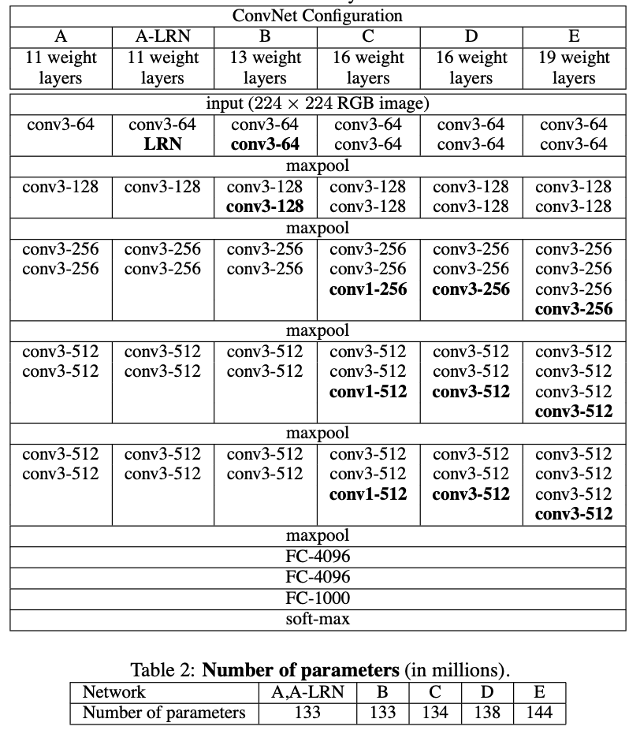
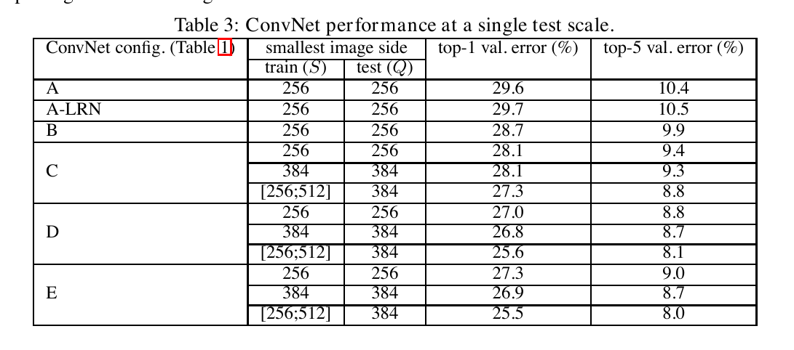
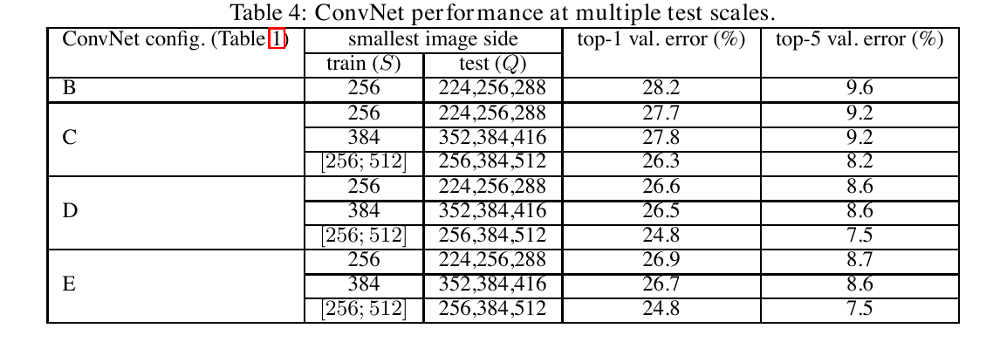
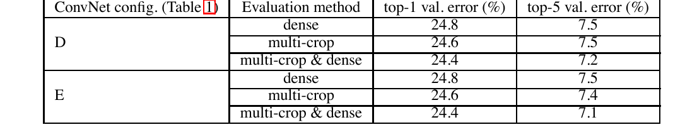
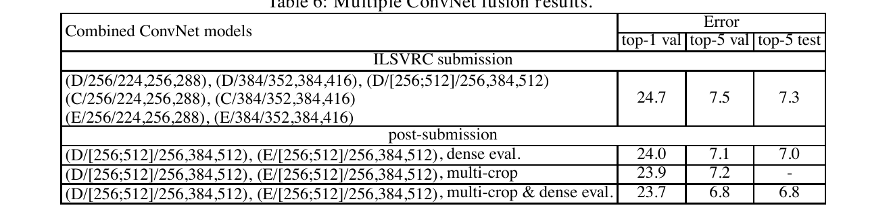
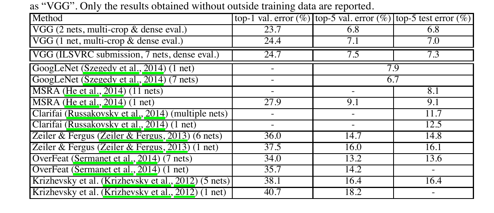

# VERY DEEP CONVOLUTIONAL NETWORKS FOR LARGE-SCALE IMAGE RECOGNITION

Karen Simonyan∗ 和 Andrew Zisserman+ 视觉几何小组，牛津大学工程科学系 {karen,az}@robots.ox.ac.uk

>Karen Simonyan∗ & Andrew Zisserman+ Visual Geometry Group, Department of Engineering Science, University of Oxford {karen,az}@robots.ox.ac.uk

## 摘要

>## ABSTRACT

在这项工作中，我们研究了卷积网络深度对其在大规模图像识别设置中的准确性的影响。我们的主要贡献是使用具有非常小的 (3 × 3) 卷积滤波器的架构对深度增加的网络进行了全面评估，这表明通过将深度提升到 16-19 个权重层，可以实现对现有技术配置的显着改进。这些发现是我们提交 2014 年 ImageNet 挑战赛的基础，我们的团队分别获得了定位和分类赛道的第一和第二名。我们还表明，我们的表示可以很好地推广到其他数据集，并在这些数据集上取得了最先进的结果。我们已经公开了我们的两个性能最佳的 ConvNet 模型，以促进进一步研究在计算机视觉中使用深度视觉表示。

>In this work we investigate the effect of the convolutional network depth on its accuracy in the large-scale image recognition setting. Our main contribution is a thorough evaluation of networks of increasing depth using an architecture with very small (3 × 3) convolution filters, which shows that a significant improvement on the prior-art configurations can be achieved by pushing the depth to 16–19 weight layers. These findings were the basis of our ImageNet Challenge 2014 submission, where our team secured the first and the second places in the localisa- tion and classification tracks respectively. We also show that our representations generalise well to other datasets, where they achieve state-of-the-art results. We have made our two best-performing ConvNet models publicly available to facili- tate further research on the use of deep visual representations in computer vision.

## 1 简介

>## 1 INTRODUCTION

卷积网络（ConvNets）最近在大规模图像和视频识别方面取得了巨大成功（Krizhevsky et al., 2012; Zeiler & Fergus, 2013; Sermanet et al., 2014; Simonyan & Zisserman, 2014）由于大型公共图像存储库（例如 ImageNet（Deng 等人，2009）和高性能计算系统，例如 GPU 或大规模分布式集群（Dean 等人， 2012）。特别是，ImageNet 大规模视觉识别挑战赛 (ILSVRC) (Russakovsky et al., 2014) 在深度视觉识别架构的发展中发挥了重要作用，该挑战赛已作为测试平台用于几代大规模图像分类系统，从高维浅层特征编码（Perronnin et al., 2010）（ILSVRC-2011 的获胜者）到深度卷积网络（Krizhevsky et al., 2012）（ILSVRC-2012 的获胜者）。

>Convolutional networks (ConvNets) have recently enjoyed a great success in large-scale im- age and video recognition (Krizhevsky et al., 2012; Zeiler & Fergus, 2013; Sermanet et al., 2014; Simonyan & Zisserman, 2014) which has become possible due to the large public image reposito- ries, such as ImageNet (Deng et al., 2009), and high-performance computing systems, such as GPUs or large-scale distributed clusters (Dean et al., 2012). In particular, an important role in the advance of deep visual recognition architectures has been played by the ImageNet Large-Scale Visual Recog- nition Challenge (ILSVRC) (Russakovsky et al., 2014), which has served as a testbed for a few generations of large-scale image classification systems, from high-dimensional shallow feature en- codings (Perronnin et al., 2010) (the winner of ILSVRC-2011) to deep ConvNets (Krizhevsky et al., 2012) (the winner of ILSVRC-2012).

随着 ConvNets 在计算机视觉领域越来越通用，已经进行了许多尝试来改进 Krizhevsky 等人的原始架构（2012）以达到更好的准确性。例如，ILSVRC-2013（Zeiler & Fergus, 2013; Sermanet et al., 2014）中表现最好的提交使用了更小的接受窗口尺寸和更小的第一个卷积层的步幅。另一项改进涉及在整个图像和多个尺度上密集地训练和测试网络（Sermanet 等人，2014 年；霍华德，2014 年）。在本文中，我们讨论了 ConvNet 架构设计的另一个重要方面——深度。为此，我们修复了架构的其他参数，并通过添加更多卷积层稳步增加网络的深度，由于在所有层中使用非常小的（3×3）卷积滤波器，这是可行的。

>With ConvNets becoming more of a commodity in the computer vision field, a number of at- tempts have been made to improve the original architecture of Krizhevsky et al. (2012) in a bid to achieve better accuracy. For instance, the best-performing submissions to the ILSVRC- 2013 (Zeiler & Fergus, 2013; Sermanet et al., 2014) utilised smaller receptive window size and smaller stride of the first convolutional layer. Another line of improvements dealt with training and testing the networks densely over the whole image and over multiple scales (Sermanet et al., 2014; Howard, 2014). In this paper, we address another important aspect of ConvNet architecture design – its depth. To this end, we fix other parameters of the architecture, and steadily increase the depth of the network by adding more convolutional layers, which is feasible due to the use of very small (3 × 3) convolution filters in all layers.

因此，我们提出了显着更准确的 ConvNet 架构，它不仅在 ILSVRC 分类和定位任务上达到了最先进的精度，而且还适用于其他图像识别数据集，即使在当用作相对简单的 pipeline 的一部分时（例如，由没有 fine-tuning 的线性 SVM 分类的深层特征）。我们发布了两个性能最佳的模型，以促进进一步的研究。

>As a result, we come up with significantly more accurate ConvNet architectures, which not only achieve the state-of-the-art accuracy on ILSVRC classification and localisation tasks, but are also applicable to other image recognition datasets, where they achieve excellent performance even when used as a part of a relatively simple pipelines (e.g. deep features classified by a linear SVM without fine-tuning). We have released our two best-performing models1 to facilitate further research.

本文的其余部分安排如下。第2节中，我们描述了我们的 ConvNet 配置。图像分类训练和评估的细节将在第 3 节中介绍。

>The rest of the paper is organised as follows. In Sect. 2, we describe our ConvNet configurations. The details of the image classification training and evaluation are then presented in Sect. 3, and the

在 第4节中是 ILSVRC 分类任务上比较配置。 第5节总结论文。为了完整起见，我们还在附录 A 中描述和评估了我们的 ILSVRC-2014 目标定位系统，并在附录 B 中讨论了将非常深的特征推广到其他数据集。最后，附录 C 包含主要论文修订列表。

>configurations are compared on the ILSVRC classification task in Sect. 4. Sect. 5 concludes the paper. For completeness, we also describe and assess our ILSVRC-2014 object localisation system in Appendix A, and discuss the generalisation of very deep features to other datasets in Appendix B. Finally, Appendix C contains the list of major paper revisions.

## 2 卷积网络配置

>## 2 CONVNET CONFIGURATIONS

为了在公平的环境中衡量 ConvNet 深度增加带来的改进，我们所有的 ConvNet 层配置都是使用相同的原则设计的，受 Ciresan（2011）； Krizhevsky 等人（2012）等人的启发。在本节中，我们首先描述我们的 ConvNet 配置的通用配置（第 2.1 节），然后详细介绍评估中使用的特定配置（第 2.2 节）。然后讨论我们的设计选择，并将其与 2.3节 中的现有技术进行比较。

>To measure the improvement brought by the increased ConvNet depth in a fair setting, all our ConvNet layer configurations are designed using the same principles, inspired by Ciresan et al. (2011); Krizhevsky et al. (2012). In this section, we first describe a generic layout of our ConvNet configurations (Sect. 2.1) and then detail the specific configurations used in the evaluation (Sect. 2.2). Our design choices are then discussed and compared to the prior art in Sect. 2.3.

### 2.1 架构

>### 2.1 ARCHITECTURE

在训练期间，我们的 ConvNets 的输入是固定大小的 224 × 224 RGB 图像。我们做的唯一预处理是从每个像素中减去在训练集上计算的平均 RGB 值。图像通过一堆卷积（conv.）层，我们使用具有非常小的感受野的过滤器：3×3（这是捕捉左/右、上/下、中心概念的最小尺寸）。在其中一种配置中，我们还使用了 1 × 1 卷积滤波器，这可以看作是输入通道的线性变换（随后是非线性变换）。卷积步长固定为 1 个像素；空间padding层输入使得空间分辨率在卷积之后得以保留，即对于 3 × 3 卷积conv，padding为 1 像素。空间 pooling 由五个 max-pooling 层执行，它们是在一些conv层之后（不是所有的转换层都跟在 max-pooling 之后）。 Max-pooling 在 2 × 2 像素窗口上执行，步幅为 2。

>During training, the input to our ConvNets is a fixed-size 224 × 224 RGB image. The only pre- processing we do is subtracting the mean RGB value, computed on the training set, from each pixel. The image is passed through a stack of convolutional (conv.) layers, where we use filters with a very small receptive field: 3 × 3 (which is the smallest size to capture the notion of left/right, up/down, center). In one of the configurations we also utilise 1 × 1 convolution filters, which can be seen as a linear transformation of the input channels (followed by non-linearity). The convolution stride is fixed to 1 pixel; the spatial padding of conv. layer input is such that the spatial resolution is preserved after convolution, i.e. the padding is 1 pixel for 3 × 3 conv. layers. Spatial pooling is carried out by five max-pooling layers, which follow some of the conv. layers (not all the conv. layers are followed by max-pooling). Max-pooling is performed over a 2 × 2 pixel window, with stride 2.

一堆卷积层（在不同架构中具有不同的深度）之后是三个全连接（FC）层：前两个每个都有 4096 个通道，第三个执行 1000 路 ILSVRC 分类，因此包含 1000 个通道（一个每个分类）。最后一层是soft-max层。全连接层的配置在所有网络中都是相同的。

>A stack of convolutional layers (which has a different depth in different architectures) is followed by three Fully-Connected (FC) layers: the first two have 4096 channels each, the third performs 1000- way ILSVRC classification and thus contains 1000 channels (one for each class). The final layer is the soft-max layer. The configuration of the fully connected layers is the same in all networks.

所有隐藏层都配备了修正 (ReLU (Krizhevsky et al., 2012)) 非线性。我们注意到，我们的网络（除了一个）都不包含局部响应归一化（LRN）归一化（Krizhevsky 等人，2012）：如第4节所示，这种归一化不会提高 ILSVRC 数据集的性能，但会导致内存消耗和计算时间增加。在我们有采用的情况下，LRN 层的参数是 (Krizhevsky et al., 2012) 的参数。

>All hidden layers are equipped with the rectification (ReLU (Krizhevsky et al., 2012)) non-linearity. We note that none of our networks (except for one) contain Local Response Normalisation (LRN) normalisation (Krizhevsky et al., 2012): as will be shown in Sect. 4, such normalisation does not improve the performance on the ILSVRC dataset, but leads to increased memory con- sumption and computation time. Where applicable, the parameters for the LRN layer are those of (Krizhevsky et al., 2012).

### 2.2 配置

>### 2.2 CONFIGURATIONS

本文评估的 ConvNet 配置在表 1 中进行了概述，每列一个。在下文中，我们将通过它们的名称 (A-E) 来指代网络。所有配置都遵循第2.1节中提出的通用设计。并且仅在深度上有所不同：从网络 A 中的 11 个权重层（8 个conv和 3 个 FC 层）到网络 E 中的 19 个权重层（16 个conv和 3 个 FC 层）。conv层的宽度(通道数）相当小，从第一层的 64 开始，然后在每个 max-pooling 层之后增加 2 倍，直到达到 512。

>The ConvNet configurations, evaluated in this paper, are outlined in Table 1, one per column. In the following we will refer to the nets by their names (A–E). All configurations follow the generic design presented in Sect. 2.1, and differ only in the depth: from 11 weight layers in the network A (8 conv. and 3 FC layers) to 19 weight layers in the network E (16 conv. and 3 FC layers). The width of conv. layers (the number of channels) is rather small, starting from 64 in the first layer and then increasing by a factor of 2 after each max-pooling layer, until it reaches 512.

在表 2 中，我们报告了每个配置的参数数量。尽管深度很大，但我们的网络中的权重数量并不大于具有较大conv的较浅网络中的权重数量。层宽和感受野（Sermanet et al., 2014 中的 1.44 亿权重）。

>In Table 2 we report the number of parameters for each configuration. In spite of a large depth, the number of weights in our nets is not greater than the number of weights in a more shallow net with larger conv. layer widths and receptive fields (144M weights in (Sermanet et al., 2014)).

### 2.3 讨论

>### 2.3 DISCUSSION

我们的 ConvNet 配置与 ILSVRC-2012（Krizhevsky 等人，2012）和 ILSVRC-2013 比赛（Zeiler & Fergus，2013；Sermanet 等人， 2014）非常不同。我们没有在第一次转换中使用相对较大的感受野conv层（例如，11 × 11 步长为 4（Krizhevsky 等人，2012），或 7 × 7 步长为 2（Zeiler & Fergus，2013；Sermanet 等人，2014）），我们在整个网络中使用非常小的 3 × 3 感受野，这些感受野在每个像素处与输入进行卷积（步长为 1）。很容易可以得到，一堆两个 3 × 3 的 conv层（中间没有空间 pooling）具有 5 × 5 的有效感受野；

>Our ConvNet configurations are quite different from the ones used in the top-performing entries of the ILSVRC-2012 (Krizhevsky et al., 2012) and ILSVRC-2013 competitions (Zeiler & Fergus, 2013; Sermanet et al., 2014). Rather than using relatively large receptive fields in the first conv. lay- ers (e.g. 11 × 11 with stride 4 in (Krizhevsky et al., 2012), or 7 × 7 with stride 2 in (Zeiler & Fergus, 2013; Sermanet et al., 2014)), we use very small 3 × 3 receptive fields throughout the whole net, which are convolved with the input at every pixel (with stride 1). It is easy to see that a stack of two 3 × 3 conv. layers (without spatial pooling in between) has an effective receptive field of 5 × 5; three

表 1：**ConvNet 配置**（显示在列中）。随着更多层的添加（添加的层以粗体显示），配置的深度从左（A）到右（E）增加。卷积层参数表示为“conv⟨感受野大小⟩-⟨通道数⟩”。为简洁起见，未显示 ReLU 激活函数。

>Table 1: ConvNet configurations (shown in columns). The depth of the configurations increases from the left (A) to the right (E), as more layers are added (the added layers are shown in bold). The convolutional layer parameters are denoted as “convhreceptive field sizei-hnumber of channelsi”. The ReLU activation function is not shown for brevity.

而3个这样的层堆叠有一个 7 × 7 的有效感受野。那么我们通过使用例如三个 3 × 3 conv 层，而不是单个 7 × 7 层，的堆叠获得了什么？首先，我们合并了三个非线性修正层而不是一个，这使得决策函数更具辨别力。其次，我们减少参数的数量：假设一个三层 3×3 卷积堆栈的输入和输出都有 C 个通道，堆叠的参数量为
=27%20C^2)
权重；而单个 7 × 7 conv层需要 

个参数，即多 81%。这可以看作是对 7 × 7 conv 过滤器进行正则化，迫使它们通过 3 × 3 过滤器进行分解（在其间注入非线性）。

>such layers have a 7 × 7 effective receptive field. So what have we gained by using, for instance, a stack of three 3 × 3 conv. layers instead of a single 7 × 7 layer? First, we incorporate three non-linear rectification layers instead of a single one, which makes the decision function more discriminative. Second, we decrease the number of parameters: assuming that both the input and the output of a three-layer 3 × 3 convolution stack has C channels, the stack is parametrised by 3 (cid:0)32C2(cid:1) = 27C2 weights; at the same time, a single 7 × 7 conv. layer would require 72C2 = 49C2 parameters, i.e. 81% more. This can be seen as imposing a regularisation on the 7 × 7 conv. filters, forcing them to have a decomposition through the 3 × 3 filters (with non-linearity injected in between).

加入 1 × 1 conv层（配置 C，表 1）是一种增加决策函数的非线性而不影响conv层的感受野的方法。尽管在我们的例子中，1×1 卷积本质上是对相同维度空间的线性投影（输入和输出通道的数量相同），但修正函数引入了额外的非线性。需要注意的是，1×1 的conv层最近被Lin 等人的“网络中的网络”架构中使用（2014）。

>The incorporation of 1 × 1 conv. layers (configuration C, Table 1) is a way to increase the non- linearity of the decision function without affecting the receptive fields of the conv. layers. Even though in our case the 1 × 1 convolution is essentially a linear projection onto the space of the same dimensionality (the number of input and output channels is the same), an additional non-linearity is introduced by the rectification function. It should be noted that 1 × 1 conv. layers have recently been utilised in the “Network in Network” architecture of Lin et al. (2014).

Ciresan 等人以前使用过小尺寸卷积滤波器（2011），但他们的网络比我们的网络深得多，而且他们没有在大规模的 ILSVRC 数据集上进行评估。古德费罗等人（2014）将深度卷积网络（11 个权重层）应用于街道号码识别任务，并表明增加的深度会带来更好的性能。 GoogLeNet (Szegedy et al., 2014) 是 ILSVRC-2014 分类任务中表现最好的条目，是独立于我们的工作而开发的，但相似之处在于它基于非常深的 ConvNets（22 个权重层）和小卷积过滤器（除了 3 × 3，它们还使用 1 × 1 和 5 × 5 卷积）。然而，它们的网络拓扑结构比我们的更复杂，并且特征图的空间分辨率在第一层急剧地降低以减少计算量。正如将在 4.5节 中显示的那样，我们的模型优于 Szegedy 等人的模型（2014）在单网络分类精度方面。

>Small-size convolution filters have been previously used by Ciresan et al. (2011), but their nets are significantly less deep than ours, and they did not evaluate on the large-scale ILSVRC dataset. Goodfellow et al. (2014) applied deep ConvNets (11 weight layers) to the task of street number recognition, and showed that the increased depth led to better performance. GoogLeNet (Szegedy et al., 2014), a top-performing entry of the ILSVRC-2014 classification task, was developed independently of our work, but is similar in that it is based on very deep ConvNets (22 weight layers) and small convolution filters (apart from 3 × 3, they also use 1 × 1 and 5 × 5 convolutions). Their network topology is, however, more complex than ours, and the spatial reso- lution of the feature maps is reduced more aggressively in the first layers to decrease the amount of computation. As will be shown in Sect. 4.5, our model is outperforming that of Szegedy et al. (2014) in terms of the single-network classification accuracy.

## 3 分类框架

>## 3 CLASSIFICATION FRAMEWORK

在上一节中，我们介绍了我们的网络配置的细节。在本节中，我们将描述分类 ConvNet 训练和评估的细节。

>In the previous section we presented the details of our network configurations. In this section, we describe the details of classification ConvNet training and evaluation.

### 3.1 训练

>### 3.1 TRAINING

ConvNet 训练过程通常遵循 Krizhevsky 等人（2012）（除了从多尺度训练图像中对输入裁剪进行采样，稍后解释）。即，通过使用带有动量的 mini-batch 梯度下降（基于反向传播 (LeCun et al., 1989)）优化多项逻辑回归目标来进行训练。 batch 大小设置为 256，动量设置为 0.9。训练通过权重衰减（L2 惩罚乘数设置为 

）和前两个全连接层的 dropout 正则化（dropout ratio 设置为 0.5）进行了正则化。学习率最初设置为 

，然后在验证集准确性停止提高时降低了 10 倍。总共降低了 3 次学习率，并在 370K 次迭代后停止学习（74 epochs）。我们推测，尽管与 (Krizhevsky et al., 2012) 相比，我们的网络有更多的参数和更大的深度，但网络只需更少的 epochs 来收敛，这是由于 (a) 施加了通过更大的深度和更小的conv过滤器尺寸的隐式正则化； (b) 某些层的预初始化。

>The ConvNet training procedure generally follows Krizhevsky et al. (2012) (except for sampling the input crops from multi-scale training images, as explained later). Namely, the training is carried out by optimising the multinomial logistic regression objective using mini-batch gradient descent (based on back-propagation (LeCun et al., 1989)) with momentum. The batch size was set to 256, momentum to 0.9. The training was regularised by weight decay (the L2 penalty multiplier set to 5 · 10−4) and dropout regularisation for the first two fully-connected layers (dropout ratio set to 0.5). The learning rate was initially set to 10−2, and then decreased by a factor of 10 when the validation set accuracy stopped improving. In total, the learning rate was decreased 3 times, and the learning was stopped after 370K iterations (74 epochs). We conjecture that in spite of the larger number of parameters and the greater depth of our nets compared to (Krizhevsky et al., 2012), the nets required less epochs to converge due to (a) implicit regularisation imposed by greater depth and smaller conv. filter sizes; (b) pre-initialisation of certain layers.

网络权重的初始化很重要，因为糟糕的初始化会由于深度网络中梯度的不稳定性而导致学习停滞。为了规避这个问题，我们从训练配置 A（表 1）开始，它足够浅，可以通过随机初始化进行训练。然后，在训练更深层次的架构时，我们用网络 A 的层初始化了前四个卷积层和最后三个全连接层（中间层是随机初始化的）。我们没有降低预初始化层的学习率，允许它们在学习期间发生变化。对于随机初始化（如果适用），我们从均值为零且方差为

的正态分布中对权重进行采样。偏差初始化为零。值得注意的是，在论文提交后，我们发现使用 Glorot & Bengio (2010) 的随机初始化程序可以在不进行预训练的情况下初始化权重。

>The initialisation of the network weights is important, since bad initialisation can stall learning due to the instability of gradient in deep nets. To circumvent this problem, we began with training the configuration A (Table 1), shallow enough to be trained with random initialisation. Then, when training deeper architectures, we initialised the first four convolutional layers and the last three fully- connected layers with the layers of net A (the intermediate layers were initialised randomly). We did not decrease the learning rate for the pre-initialised layers, allowing them to change during learning. For random initialisation (where applicable), we sampled the weights from a normal distribution with the zero mean and 10−2 variance. The biases were initialised with zero. It is worth noting that after the paper submission we found that it is possible to initialise the weights without pre-training by using the random initialisation procedure of Glorot & Bengio (2010).

为了获得固定大小的 224×224 ConvNet 输入图像，它们是从重新缩放的训练图像中随机裁剪的（每次 SGD 迭代每个图像一次裁剪）。为了进一步增加训练集，裁剪经历了随机水平翻转和随机 RGB 颜色偏移（Krizhevsky et al., 2012）。下面解释训练图像重新缩放。

>To obtain the fixed-size 224×224 ConvNet input images, they were randomly cropped from rescaled training images (one crop per image per SGD iteration). To further augment the training set, the crops underwent random horizontal flipping and random RGB colour shift (Krizhevsky et al., 2012). Training image rescaling is explained below.

**训练图像大小**。让 S 是各向同性重新缩放的训练图像的最小边，从中裁剪 ConvNet 输入（我们也将 S 称为训练尺度）。虽然裁剪大小固定为 224 × 224，但原则上 S 可以取不小于 224 的任何值：当 S = 224 时，裁剪将捕获整个图像的统计信息，完全跨越训练图像的最小边；对于 S ≫ 224，裁剪将对应于图像的一小部分，包含一个小对象或对象部分。

>Training image size. Let S be the smallest side of an isotropically-rescaled training image, from which the ConvNet input is cropped (we also refer to S as the training scale). While the crop size is fixed to 224 × 224, in principle S can take on any value not less than 224: for S = 224 the crop will capture whole-image statistics, completely spanning the smallest side of a training image; for S ≫ 224 the crop will correspond to a small part of the image, containing a small object or an object part.

我们考虑了两种设置训练尺度 S 的方法。第一种是固定 S，它对应于单尺度训练（请注意，采样裁剪中的图像内容仍然可以表示多尺度图像统计）。在我们的实验中，我们评估了在两个固定尺度上训练的模型：S = 256（已在现有技术中广泛使用（Krizhevsky 等人，2012；Zeiler & Fergus，2013；Sermanet 等人，2014） )) 和 S = 384。给定一个 ConvNet 配置，我们首先使用 S = 256 训练网络。为了加速 S = 384 网络的训练，它使用 S = 256 预训练的权重进行初始化，我们使用较小的初始学习率 

。

>We consider two approaches for setting the training scale S. The first is to fix S, which corresponds to single-scale training (note that image content within the sampled crops can still represent multi- scale image statistics). In our experiments, we evaluated models trained at two fixed scales: S = 256 (which has been widely used in the prior art (Krizhevsky et al., 2012; Zeiler & Fergus, 2013; Sermanet et al., 2014)) and S = 384. Given a ConvNet configuration, we first trained the network using S = 256. To speed-up training of the S = 384 network, it was initialised with the weights pre-trained with S = 256, and we used a smaller initial learning rate of 10−3.

设置 S 的第二种方法是多尺度训练，其中每个训练图像通过从某个范围 [Smin, Smax] 随机采样 S 来单独重新缩放（我们使用 Smin = 256 和 Smax = 512）。由于图像中的对象可以具有不同的大小，因此在训练期间考虑到这一点是有益的。这也可以看作是通过尺度抖动来增加训练集，其中训练单个模型以识别各种尺度上的对象。出于速度原因，我们通过 fine-tuning 具有相同配置的单尺度模型的所有层来训练多尺度模型，并使用固定 S = 384 进行预训练。

>The second approach to setting S is multi-scale training, where each training image is individually rescaled by randomly sampling S from a certain range [Smin, Smax] (we used Smin = 256 and Smax = 512). Since objects in images can be of different size, it is beneficial to take this into account during training. This can also be seen as training set augmentation by scale jittering, where a single model is trained to recognise objects over a wide range of scales. For speed reasons, we trained multi-scale models by fine-tuning all layers of a single-scale model with the same configuration, pre-trained with fixed S = 384.

### 3.2 测试

>### 3.2 TESTING

在测试时，给定一个训练好的 ConvNet 和一个输入图像，它按以下方式分类。首先，它被各向同性地重新缩放到预先定义的最小图像大小，表示为 Q（我们也将其称为测试尺度）。我们注意到 Q 不一定等于训练规模 S（正如我们将在第 4 节中展示的那样，为每个 S 使用多个 Q 值可以提高性能）。然后，网络以类似于 (Sermanet et al., 2014) 的方式密集应用在重新缩放的测试图像上。即，首先将全连接层转换为卷积层（第一个 FC 层转换为 7×7 的卷积层，最后两个 FC 层转换为 1×1 的卷积层）。然后将得到的全卷积网络应用于整个（未裁剪）图像。结果是一个类分数图，其通道数等于类数，并且空间分辨率可变，取决于输入图像的大小。最后，为了获得图像类别分数的固定大小向量，对类别分数图进行空间平均（sum-pooled）。我们还通过图像的水平翻转来增加测试集；对原始图像和翻转图像的 soft-max 类后验进行平均以获得图像的最终分数。

>At test time, given a trained ConvNet and an input image, it is classified in the following way. First, it is isotropically rescaled to a pre-defined smallest image side, denoted as Q (we also refer to it as the test scale). We note that Q is not necessarily equal to the training scale S (as we will show in Sect. 4, using several values of Q for each S leads to improved performance). Then, the network is applied densely over the rescaled test image in a way similar to (Sermanet et al., 2014). Namely, the fully-connected layers are first converted to convolutional layers (the first FC layer to a 7 × 7 conv. layer, the last two FC layers to 1 × 1 conv. layers). The resulting fully-convolutional net is then applied to the whole (uncropped) image. The result is a class score map with the number of channels equal to the number of classes, and a variable spatial resolution, dependent on the input image size. Finally, to obtain a fixed-size vector of class scores for the image, the class score map is spatially averaged (sum-pooled). We also augment the test set by horizontal flipping of the images; the soft-max class posteriors of the original and flipped images are averaged to obtain the final scores for the image.

由于全卷积网络应用于整个图像，因此无需在测试时对多个裁剪进行采样（Krizhevsky et al., 2012），因为如果那样的话需要对每个裁剪进行网络重新计算，因此裁剪效率较低。同时，使用大量裁剪，如 Szegedy 等人所做的那样（2014）可以提高准确性，因为与全卷积网络相比，它可以对输入图像进行更精细的采样。此外，由于不同的卷积边界条件，多裁剪评估与密集评估是互补的：当将 ConvNet 应用于裁剪时，卷积特征图用零填充，而在密集评估的情况下，相同裁剪的填充自然会出现来自图像的相邻部分（由于卷积和空间 pooling），这大大增加了整个网络的感受野，因此捕获了更多的上下文。虽然我们认为在实践中，增加多个裁剪的计算时间并不能证明潜在的准确性提高是合理的，但作为参考，我们还使用每个尺度 50 个裁剪（5 × 5 规则网格和 2 个翻转）来评估我们的网络，总共 150超过 3 个尺度的裁剪，与 Szegedy 等人使用的 4 个尺度的 144 个裁剪相当（2014）。

>Since the fully-convolutional network is applied over the whole image, there is no need to sample multiple crops at test time (Krizhevsky et al., 2012), which is less efficient as it requires network re-computation for each crop. At the same time, using a large set of crops, as done by Szegedy et al. (2014), can lead to improved accuracy, as it results in a finer sampling of the input image compared to the fully-convolutional net. Also, multi-crop evaluation is complementary to dense evaluation due to different convolution boundary conditions: when applying a ConvNet to a crop, the convolved feature maps are padded with zeros, while in the case of dense evaluation the padding for the same crop naturally comes from the neighbouring parts of an image (due to both the convolutions and spatial pooling), which substantially increases the overall network receptive field, so more context is captured. While we believe that in practice the increased computation time of multiple crops does not justify the potential gains in accuracy, for reference we also evaluate our networks using 50 crops per scale (5 × 5 regular grid with 2 flips), for a total of 150 crops over 3 scales, which is comparable to 144 crops over 4 scales used by Szegedy et al. (2014).

### 3.3 实现细节

>### 3.3 IMPLEMENTATION DETAILS

我们的实现源自公开可用的 C++ Caffe 工具包 (Jia, 2013)（于 2013 年 12 月推出），但包含许多重大修改，允许我们在单个系统中安装的多个 GPU 上执行训练和评估，以及训练和评估多尺度的全尺寸（未裁剪）图像（如上所述）。多 GPU 训练利用数据并行性，通过将每个 batch 训练图像拆分为多个 GPU batches，在每个 GPU 上并行处理来进行。在计算 GPU batch 梯度后，对它们进行平均以获得完整 batch 的梯度。梯度计算在 GPU 之间是同步的，因此结果与在单个 GPU 上训练时的结果完全相同。

>Our implementation is derived from the publicly available C++ Caffe toolbox (Jia, 2013) (branched out in December 2013), but contains a number of significant modifications, allowing us to perform training and evaluation on multiple GPUs installed in a single system, as well as train and evaluate on full-size (uncropped) images at multiple scales (as described above). Multi-GPU training exploits data parallelism, and is carried out by splitting each batch of training images into several GPU batches, processed in parallel on each GPU. After the GPU batch gradients are computed, they are averaged to obtain the gradient of the full batch. Gradient computation is synchronous across the GPUs, so the result is exactly the same as when training on a single GPU.

虽然最近提出了更复杂的加速 ConvNet 训练的方法 (Krizhevsky, 2014)，它们对网络的不同层采用模型和数据并行性，但我们发现我们在概念上更简单的方案已经提供了与使用单个 GPU 相比，在现成的 4-GPU 系统上加速 3.75 倍。在配备四个 NVIDIA Titan Black GPU 的系统上，训练单个网络需要 2-3 周，具体取决于架构。

>While more sophisticated methods of speeding up ConvNet training have been recently pro- posed (Krizhevsky, 2014), which employ model and data parallelism for different layers of the net, we have found that our conceptually much simpler scheme already provides a speedup of 3.75 times on an off-the-shelf 4-GPU system, as compared to using a single GPU. On a system equipped with four NVIDIA Titan Black GPUs, training a single net took 2–3 weeks depending on the architecture.

## 4 分类实验

>## 4 CLASSIFICATION EXPERIMENTS

**数据集**。在本节中，我们展示了通过所描述的 ConvNet 架构在 ILSVRC-2012 数据集（用于 ILSVRC 2012-2014 挑战）上实现的图像分类结果。该数据集包括 1000 个类别的图像，分为三组：训练（130 万张图像）、验证（5 万张图像）和测试（10 万张带有保留类标签的图像）。分类性能使用两个度量来评估：top-1 和 top-5 错误。前者是多类分类错误，即错误分类图像的比例；后者是 ILSVRC 中使用的主要评估标准，计算为 ground-truth 类别超出前 5 个预测类别的图像比例。

>Dataset. In this section, we present the image classification results achieved by the described ConvNet architectures on the ILSVRC-2012 dataset (which was used for ILSVRC 2012–2014 chal- lenges). The dataset includes images of 1000 classes, and is split into three sets: training (1.3M images), validation (50K images), and testing (100K images with held-out class labels). The clas- sification performance is evaluated using two measures: the top-1 and top-5 error. The former is a multi-class classification error, i.e. the proportion of incorrectly classified images; the latter is the main evaluation criterion used in ILSVRC, and is computed as the proportion of images such that the ground-truth category is outside the top-5 predicted categories.

对于大多数实验，我们使用验证集作为测试集。某些实验也在测试集上进行，并作为“VGG”团队进入 ILSVRC-2014 比赛提交给官方 ILSVRC 服务器（Russakovsky et al., 2014）。

>For the majority of experiments, we used the validation set as the test set. Certain experiments were also carried out on the test set and submitted to the official ILSVRC server as a “VGG” team entry to the ILSVRC-2014 competition (Russakovsky et al., 2014).

### 4.1 单尺度评估

>### 4.1 SINGLE SCALE EVALUATION

我们首先使用 2.2节 中描述的层配置在单一尺度上评估单个 ConvNet 模型的性能。测试图像大小设置如下：Q = S 表示固定 S，Q = 0.5(Smin + Smax) 表示抖动 S ∈ [Smin, Smax]。结果如表3所示。

>We begin with evaluating the performance of individual ConvNet models at a single scale with the layer configurations described in Sect. 2.2. The test image size was set as follows: Q = S for fixed S, and Q = 0.5(Smin + Smax) for jittered S ∈ [Smin, Smax]. The results of are shown in Table 3.

首先，我们注意到使用局部响应归一化（A-LRN 网络）并没有改进没有任何归一化层的模型 A。因此，我们不在更深层次的架构（B-E）中使用归一化。

>First, we note that using local response normalisation (A-LRN network) does not improve on the model A without any normalisation layers. We thus do not employ normalisation in the deeper architectures (B–E).

其次，我们观察到分类误差随着 ConvNet 深度的增加而降低：从 A 中的 11 层到 E 中的 19 层。值得注意的是，尽管深度相同，配置 C（包含三个 1×1 卷积层），性能比使用 3 × 3 conv 的配置 D 差。整个网络的层。这表明虽然额外的非线性确实有帮助（C 优于 B），但使用具有非微小感受野的过滤器（D 优于 C）的conv 捕获空间上下文也很重要。当深度达到 19 层时，我们架构的错误率达到饱和，但更深的模型可能对更大的数据集有利。我们还将网络 B 与具有 5 个 5 × 5 卷积层的浅层网络进行了比较，它是通过替换每对 3 × 3 卷积从 B 派生的。具有单个 5 × 5 卷积的层（具有与第 2.3 节中解释的相同的感受野）。浅层网络的 top-1 误差被测量为比 B 高 7%（在中心裁剪上），这证实了具有小过滤器的深层网络优于具有较大过滤器的浅层网络。

>Second, we observe that the classification error decreases with the increased ConvNet depth: from 11 layers in A to 19 layers in E. Notably, in spite of the same depth, the configuration C (which contains three 1 × 1 conv. layers), performs worse than the configuration D, which uses 3 × 3 conv. layers throughout the network. This indicates that while the additional non-linearity does help (C is better than B), it is also important to capture spatial context by using conv. filters with non-trivial receptive fields (D is better than C). The error rate of our architecture saturates when the depth reaches 19 layers, but even deeper models might be beneficial for larger datasets. We also compared the net B with a shallow net with five 5 × 5 conv. layers, which was derived from B by replacing each pair of 3 × 3 conv. layers with a single 5 × 5 conv. layer (which has the same receptive field as explained in Sect. 2.3). The top-1 error of the shallow net was measured to be 7% higher than that of B (on a center crop), which confirms that a deep net with small filters outperforms a shallow net with larger filters.

最后，训练时的尺度抖动（S ∈ [256; 512]）比在具有固定最小边的图像（S = 256 或 S = 384）上训练的结果要好得多，即使在测试时使用单个尺度。这证实了通过尺度抖动增强训练集确实有助于捕获多尺度图像统计信息。

>Finally, scale jittering at training time (S ∈ [256; 512]) leads to significantly better results than training on images with fixed smallest side (S = 256 or S = 384), even though a single scale is used at test time. This confirms that training set augmentation by scale jittering is indeed helpful for capturing multi-scale image statistics.

### 4.2 多尺度评估

>### 4.2 MULTI-SCALE EVALUATION

在单一尺度上评估了 ConvNet 模型后，我们现在评估在测试时尺度抖动的影响。它包括在测试图像的几个重新缩放版本（对应于不同的 Q 值）上运行模型，然后平均得到的类后验。考虑到训练和测试规模之间的巨大差异会导致性能下降，使用固定 S 训练的模型在三个测试图像大小上进行了评估，它是接近训练的：Q = {S − 32, S, S + 32} 。同时，训练时的尺度抖动使得网络在测试时可以应用到更广泛的尺度上，所以在变量 S ∈ [Smin； Smax] 内训练，在更大范围的尺寸 Q = {Smin, 0.5(Smin + Smax), Smax} 上进行评估。

> Having evaluated the ConvNet models at a single scale, we now assess the effect of scale jittering at test time. It consists of running a model over several rescaled versions of a test image (corresponding to different values of Q), followed by averaging the resulting class posteriors. Considering that a large discrepancy between training and testing scales leads to a drop in performance, the models trained with fixed S were evaluated over three test image sizes, close to the training one: Q = {S − 32, S, S + 32}. At the same time, scale jittering at training time allows the network to be applied to a wider range of scales at test time, so the model trained with variable S ∈ [Smin; Smax] was evaluated over a larger range of sizes Q = {Smin, 0.5(Smin + Smax), Smax}.

表 4 中显示的结果表明，测试时的尺度抖动会带来更好的性能（与在单一尺度上评估相同模型相比，如表 3 所示）。和以前一样，最深的配置（D 和 E）表现最好，并且尺度抖动优于使用固定的最小边 S 进行训练。我们在验证集上的最佳单网络性能是 24.8%/7.5% top-1/top -5 错误（在表 4 中以粗体突出显示）。在测试集上，配置 E 实现了 7.3% 的 top-5 错误。

>The results, presented in Table 4, indicate that scale jittering at test time leads to better performance (as compared to evaluating the same model at a single scale, shown in Table 3). As before, the deepest configurations (D and E) perform the best, and scale jittering is better than training with a fixed smallest side S. Our best single-network performance on the validation set is 24.8%/7.5% top-1/top-5 error (highlighted in bold in Table 4). On the test set, the configuration E achieves 7.3% top-5 error.

### 4.3 多裁剪评估

>### 4.3 MULTI-CROP EVALUATION

在表 5 中，我们将密集的 ConvNet 评估与多裁剪评估进行了比较（详见第 3.2 节）。我们还通过平均它们的 softmax 输出来评估这两种评估技术的互补性。可以看出，使用多个裁剪的性能略好于密集评估，并且这两种方法确实是互补的，因为它们的组合优于它们中的每一种。如上所述，我们假设这是由于对卷积边界条件的不同处理。

>In Table 5 we compare dense ConvNet evaluation with mult-crop evaluation (see Sect. 3.2 for de- tails). We also assess the complementarity of the two evaluation techniques by averaging their soft- max outputs. As can be seen, using multiple crops performs slightly better than dense evaluation, and the two approaches are indeed complementary, as their combination outperforms each of them. As noted above, we hypothesize that this is due to a different treatment of convolution boundary conditions.

表 5：ConvNet 评估技术比较。在所有实验中，训练量表 S 都是从 [256; 512]，并考虑了三个测试量表 Q：{256, 384, 512}。

>Table 5: ConvNet evaluation techniques comparison. In all experiments the training scale S was sampled from [256; 512], and three test scales Q were considered: {256, 384, 512}.

### 4.4 卷积网络融合

>### 4.4 CONVNET FUSION

到目前为止，我们评估了单个 ConvNet 模型的性能。在这部分实验中，我们通过平均它们的 soft-max 类后验来组合几个模型的输出。由于模型的互补性，这提高了性能，并在 2012 年（Krizhevsky 等人，2012 年）和 2013 年（Zeiler & Fergus，2013 年；Sermanet 等人，2014).

>Up until now, we evaluated the performance of individual ConvNet models. In this part of the exper- iments, we combine the outputs of several models by averaging their soft-max class posteriors. This improves the performance due to complementarity of the models, and was used in the top ILSVRC submissions in 2012 (Krizhevsky et al., 2012) and 2013 (Zeiler & Fergus, 2013; Sermanet et al., 2014).

结果如表 6 所示。在提交 ILSVRC 时，我们只训练了单尺度网络，以及多尺度模型 D（由 fine-tuning 只训练全连接层而不是所有层）。由此产生的 7 个网络的集合具有 7.3% 的 ILSVRC 测试误差。提交后，我们考虑了仅包含两个性能最佳的多尺度模型（配置 D 和 E）的集合，使用密集评估将测试误差降低到 7.0%，使用组合密集和多裁剪评估将测试误差降低到 6.8%。作为参考，我们表现最好的单一模型实现了 7.1% 的误差（模型 E，表 5）。

>The results are shown in Table 6. By the time of ILSVRC submission we had only trained the single-scale networks, as well as a multi-scale model D (by fine-tuning only the fully-connected layers rather than all layers). The resulting ensemble of 7 networks has 7.3% ILSVRC test error. After the submission, we considered an ensemble of only two best-performing multi-scale models (configurations D and E), which reduced the test error to 7.0% using dense evaluation and 6.8% using combined dense and multi-crop evaluation. For reference, our best-performing single model achieves 7.1% error (model E, Table 5).

### 4.5 与现有技术的比较

>### 4.5 COMPARISON WITH THE STATE OF THE ART

最后，我们将我们的结果与表 7 中的最新技术进行比较。在 ILSVRC-2014 挑战赛的分类任务（Russakovsky 等人，2014 年）中，我们的“VGG”团队以 7.3% 获得第二名使用 7 个模型的集合来测试错误。提交后，我们使用 2 个模型的集合将错误率降低到 6.8%。

>Finally, we compare our results with the state of the art in Table 7. In the classification task of ILSVRC-2014 challenge (Russakovsky et al., 2014), our “VGG” team secured the 2nd place with 7.3% test error using an ensemble of 7 models. After the submission, we decreased the error rate to 6.8% using an ensemble of 2 models.

从表 7 可以看出，我们非常深的 ConvNets 显着优于上一代模型，在 ILSVRC-2012 和 ILSVRC-2013 比赛中取得了最好的成绩。我们的结果在分类任务获胜者（GoogLeNet 的错误率为 6.7%）方面也具有竞争力，并且大大优于 ILSVRC-2013 获胜提交的 Clarifai，后者在使用外部训练数据的情况下达到 11.2%，在没有外部训练数据的情况下达到 11.7%。这是了不起的，考虑到我们的最佳结果是通过仅结合两个模型来实现的——明显少于大多数 ILSVRC 提交中使用的模型。在单网性能方面，我们的架构取得了最好的结果（7.0% 的测试错误），比单个 GoogLeNet 好0.9%。值得注意的是，我们并没有背离 LeCun 等人的经典 ConvNet 架构（1989），但通过显着增加深度对其进行了改进。

>As can be seen from Table 7, our very deep ConvNets significantly outperform the previous gener- ation of models, which achieved the best results in the ILSVRC-2012 and ILSVRC-2013 competi- tions. Our result is also competitive with respect to the classification task winner (GoogLeNet with 6.7% error) and substantially outperforms the ILSVRC-2013 winning submission Clarifai, which achieved 11.2% with outside training data and 11.7% without it. This is remarkable, considering that our best result is achieved by combining just two models – significantly less than used in most ILSVRC submissions. In terms of the single-net performance, our architecture achieves the best result (7.0% test error), outperforming a single GoogLeNet by 0.9%. Notably, we did not depart from the classical ConvNet architecture of LeCun et al. (1989), but improved it by substantially increasing the depth.

表 7：与 ILSVRC 分类中最新技术的比较。我们的方法表示为 "VGG"。只报告了在没有外部训练数据的情况下获得的结果。

>Table 7: Comparison with the state of the art in ILSVRC classification. Our method is denoted as “VGG”. Only the results obtained without outside training data are reported.

## 5 结论

>## 5 CONCLUSION

在这项工作中，我们评估了用于大规模图像分类的非常深的卷积网络（最多 19 个权重层）。已经证明，表示深度有利于分类准确性，并且可以使用传统的 ConvNet 架构在 ImageNet 挑战数据集上实现最先进的性能（LeCun 等人，1989；Krizhevsky等人，2012 年），深度显着增加。在附录中，我们还展示了我们的模型可以很好地推广到广泛的任务和数据集，匹配或优于围绕较少深度图像表示构建的更复杂的识别 pipeline。我们的结果再次证实了深度在视觉表示中的重要性。

>In this work we evaluated very deep convolutional networks (up to 19 weight layers) for large- scale image classification. It was demonstrated that the representation depth is beneficial for the classification accuracy, and that state-of-the-art performance on the ImageNet challenge dataset can be achieved using a conventional ConvNet architecture (LeCun et al., 1989; Krizhevsky et al., 2012) with substantially increased depth. In the appendix, we also show that our models generalise well to a wide range of tasks and datasets, matching or outperforming more complex recognition pipelines built around less deep image representations. Our results yet again confirm the importance of depth in visual representations.

这项工作得到了 ERC 赠款 VisRec 228180号的支持 。我们非常感谢 NVIDIA 公司对用于这项研究的 GPU 的捐赠的支持。

>This work was supported by ERC grant VisRec no. 228180. We gratefully acknowledge the support of NVIDIA Corporation with the donation of the GPUs used for this research.
