# SSD：Single Shot MultiBox Detector

>Wei Liu1, Dragomir Anguelov2, Dumitru Erhan3, Christian Szegedy3, Scott Reed4, Cheng-Yang Fu1, Alexander C. Berg1

## Abstract

我们提出了一种使用单个深度神经网络检测图像中目标的方法。我们的方法称为 SSD，将边界框的输出空间离散为一组默认框，每个特征图位置具有不同的纵横比和比例。在预测时，网络为每个默认框中每个目标类别的存在生成分数，并对框进行调整以更好地匹配目标形状。此外，该网络结合了来自具有不同分辨率的多个特征图的预测，以自然地处理各种大小的目标。 SSD 相对于需要目标proposal的方法来说很简单，因为它完全消除了proposal生成和随后的像素或特征重采样阶段，并将所有计算封装在单个网络中。这使得 SSD 易于训练并且可以直接集成到需要检测组件的系统中。在 PASCAL VOC、COCO 和 ILSVRC 数据集上的实验结果证实，SSD 与使用额外目标proposal步骤的方法相比具有竞争的准确性，并且速度更快，同时为训练和推理提供了一个统一的框架。对于 300 x 300 输入，SSD 在 Nvidia Titan 上以 59 FPS 的 VOC2007 测试中达到 74.3% mAP 而对512 x 512 输入，SSD 达到 76.9% 的 mAP，优于可比较的最先进的 Faster R-CNN 模型。与其他单阶段方法相比，即使输入图像尺寸较小，SSD 也具有更好的精度。代码位于：https://github.com/weiliu89/caffe/tree/ssd。

>Abstract. We present a method for detecting objects in images using a single deep neural network. Our approach, named SSD, discretizes the output space of bounding boxes into a set of default boxes over different aspect ratios and scales per feature map location. At prediction time, the network generates scores for the presence of each object category in each default box and produces adjustments to the box to better match the object shape. Additionally, the network combines pre- dictions from multiple feature maps with different resolutions to naturally handle objects of various sizes. SSD is simple relative to methods that require object proposals because it completely eliminates proposal generation and subsequent pixel or feature resampling stages and encapsulates all computation in a single network. This makes SSD easy to train and straightforward to integrate into sys- tems that require a detection component. Experimental results on the PASCAL VOC, COCO, and ILSVRC datasets confirm that SSD has competitive accuracy to methods that utilize an additional object proposal step and is much faster, while providing a unified framework for both training and inference. For 300 x 300 in- put, SSD achieves 74.3% mAP1 on VOC2007 test at 59 FPS on a Nvidia Titan and for 512 x 512 input, SSD achieves 76.9% mAP, outperforming a compa- rable state-of-the-art Faster R-CNN model. Compared to other single stage meth- ods, SSD has much better accuracy even with a smaller input image size. Code is available at: https://github.com/weiliu89/caffe/tree/ssd .

## 1 Introduction

当前最先进的目标检测系统是以下方法的变体：假设边界框，为每个框重新采样像素或特征，并应用高质量分类器。自从选择性搜索工作 [1] 取得当前较好的 PASCAL VOC、COCO 和 ILSVRC 检测结果以来，该方法在检测基准上占了上风，这些检测均基于 Faster R-CNN[2]，尽管具有更深层次的特征，例如 [3] 虽然准确，但这些方法对于嵌入式系统来说计算量太大，即使使用高端硬件，对于实时应用程序来说也太慢了。

>Current state-of-the-art object detection systems are variants of the following approach: hypothesize bounding boxes, resample pixels or features for each box, and apply a high- quality classifier. This pipeline has prevailed on detection benchmarks since the Selec- tive Search work [1] through the current leading results on PASCAL VOC, COCO, and ILSVRC detection all based on Faster R-CNN[2] albeit with deeper features such as [3]. While accurate, these approaches have been too computationally intensive for em- bedded systems and, even with high-end hardware, too slow for real-time applications.

这些方法的检测速度通常以每帧秒数 (SPF) 为单位，即使是最快的高精度检测器 Faster R-CNN，也只能以每秒 7 帧 (FPS) 的速度运行。已经有许多尝试通过攻改变测流程的每个阶段来构建更快的检测器（参见第 4 节中的相关工作），但到目前为止，显着提高速度的代价是显着降低检测精度。

> Often detection speed for these approaches is measured in seconds per frame (SPF), and even the fastest high-accuracy detector, Faster R-CNN, operates at only 7 frames per second (FPS). There have been many attempts to build faster detectors by attacking each stage of the detection pipeline (see related work in Sec. 4), but so far, significantly increased speed comes only at the cost of significantly decreased detection accuracy.

本文提出了第一个基于深度网络的目标检测器，它不会为边界框假设重新采样像素或特征，并且与这样做的方法一样准确。这显着提高了高精度检测的速度（VOC2007 测试中 59 FPS 和 74.3% 的 mAP，对比 Faster R-CNN 7 FPS 和 73.2% 的 mAP 或 YOLO 45 FPS 和 63.4% 的 mAP）。速度的根本改进来自于消除边界框proposal和随后的像素或特征重采样阶段。我们不是第一个这样做的人（参见 [4,5]），但是通过添加一系列改进，我们设法比以前的尝试显着提高了准确性。我们的改进包括使用小型卷积滤波器来预测边界框位置中的目标类别和偏移量，使用单独的预测器（滤波器）进行不同的纵横比检测，并将这些滤波器应用于来自网络后期阶段的多个特征图以执行多尺度检测。通过这些修改——尤其是使用多层进行不同尺度的预测——我们可以使用相对低分辨率的输入来实现高精度，从而进一步提高检测速度。虽然这些贡献可能看起来都很小，但我们注意到生成的系统将 PASCAL VOC 的实时检测精度从 YOLO 的 63.4% mAP 提高到我们 SSD 的 74.3% mAP。与最近关于残差网络 [3] 的备受瞩目的工作相比，这在检测精度方面有了更大的相对改进。此外，显着提高高质量检测的速度可以拓宽计算机视觉有用的设置范围。我们将我们的贡献总结如下：

> This paper presents the first deep network based object detector that does not re- sample pixels or features for bounding box hypotheses and and is as accurate as ap- proaches that do. This results in a significant improvement in speed for high-accuracy detection (59 FPS with mAP 74.3% on VOC2007 test, vs. Faster R-CNN 7 FPS with mAP 73.2% or YOLO 45 FPS with mAP 63.4%). The fundamental improvement in speed comes from eliminating bounding box proposals and the subsequent pixel or fea- ture resampling stage. We are not the first to do this (cf [4,5]), but by adding a series of improvements, we manage to increase the accuracy significantly over previous at- tempts. Our improvements include using a small convolutional filter to predict object categories and offsets in bounding box locations, using separate predictors (filters) for different aspect ratio detections, and applying these filters to multiple feature maps from the later stages of a network in order to perform detection at multiple scales. With these modifications—especially using multiple layers for prediction at different scales—we can achieve high-accuracy using relatively low resolution input, further increasing de- tection speed. While these contributions may seem small independently, we note that the resulting system improves accuracy on real-time detection for PASCAL VOC from 63.4% mAP for YOLO to 74.3% mAP for our SSD. This is a larger relative improve- ment in detection accuracy than that from the recent, very high-profile work on residual networks [3]. Furthermore, significantly improving the speed of high-quality detection can broaden the range of settings where computer vision is useful. We summarize our contributions as follows:

– 我们引入了 SSD，一种针对多个类别的单次检测器，它比以前最先进的单次检测器 (YOLO) 更快，并且更准确，实际上与执行显式区域proposal和池化的较慢技术一样准确（包括 Faster R-CNN）。

> – We introduce SSD, a single-shot detector for multiple categories that is faster than the previous state-of-the-art for single shot detectors (YOLO), and significantly more accurate, in fact as accurate as slower techniques that perform explicit region proposals and pooling (including Faster R-CNN).

– SSD 的核心是使用应用于特征图的小型卷积滤波器来预测一组固定的默认边界框的类别分数和框偏移量。

> – The core of SSD is predicting category scores and box offsets for a fixed set of default bounding boxes using small convolutional filters applied to feature maps.

– 为了实现高检测精度，我们从不同尺度的特征图中生成不同尺度的预测，并按纵横比明确区分预测。

> – To achieve high detection accuracy we produce predictions of different scales from feature maps of different scales, and explicitly separate predictions by aspect ratio.

– 这些设计特性导致简单的端到端训练和高精度，即使在低分辨率输入图像上，进一步提高速度与精度的权衡。

> – These design features lead to simple end-to-end training and high accuracy, even on low resolution input images, further improving the speed vs accuracy trade-off.

– 实验包括对在 PASCAL VOC、COCO 和 ILSVRC 上评估的具有不同输入大小的模型进行时序和准确性分析，并与一系列最近的最先进方法进行比较。

>– Experiments include timing and accuracy analysis on models with varying input size evaluated on PASCAL VOC, COCO, and ILSVRC and are compared to a range of recent state-of-the-art approaches.

本节描述了我们提出的用于检测的 SSD 框架（第 2.1 节）和相关的训练方法（第 2.2 节）。之后，秒。图 3 展示了特定于数据集的模型细节和实验结果。

>This section describes our proposed SSD framework for detection (Sec. 2.1) and the associated training methodology (Sec. 2.2). Afterwards, Sec. 3 presents dataset-specific model details and experimental results.

### 2 The Single Shot Detector (SSD)

本节介绍了我们提出的SSD检测框架（第2.1节）和相关的训练方法（第2.2节）。之后，第3节介绍了数据集的具体模型细节和实验结果。

> This section describes our proposed SSD framework for detection (Sec. 2.1) and the associated training methodology (Sec. 2.2). Afterwards, Sec. 3 presents dataset-specific model details and experimental results.

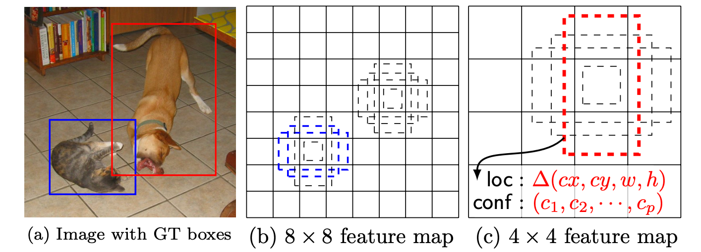

图 1：SSD 框架。 (a) SSD 在训练过程中只需要每个目标的输入图像和ground-truth框。以卷积方式，我们在具有不同尺度的几个特征图中（例如 8x8 和 4x4在(b) 和 (c)）中的每个位置评估一组（例如 4 个）不同纵横比的默认框。对于每个默认框，我们预测所有目标类别的形状偏移和置信度（
)
）。在训练时，我们首先将这些默认框与真实框匹配。例如，我们将两个默认框与猫匹配，一个与狗匹配，将它们视为正，其余视为负。模型损失是定位损失（例如 Smooth L1 [6]）和置信损失（例如 Softmax）之间的加权和。

>Fig. 1: SSD framework. (a) SSD only needs an input image and ground truth boxes for each object during training. In a convolutional fashion, we evaluate a small set (e.g. 4) of default boxes of different aspect ratios at each location in several feature maps with different scales (e.g. 8x8and 4x4in (b) and (c)). For each default box, we predict both the shape offsets and the confidences for all object categories ((c1,c2, ···,cp)). At training time, we first match these default boxes to the ground truth boxes. For example, we have matched two default boxes with the cat and one with the dog, which are treated as positives and the rest as negatives. The model loss is a weighted sum between localization loss (e.g. Smooth L1 [6]) and confidence loss (e.g. Softmax).

### 2.1 Model

SSD 方法基于一个前馈卷积网络，该网络产生一个固定大小的边界框集合，以及这些框中是否存在目标类实例的分数，然后是一个非最大抑制步骤以产生最终检测。早期的网络层基于用于高质量图像分类的标准架构（在任何分类层之前被截断），我们将其称为基础网络。然后，我们向网络添加辅助结构以产生具有以下关键特征的检测：

> The SSD approach is based on a feed-forward convolutional network that produces a fixed-size collection of bounding boxes and scores for the presence of object class instances in those boxes, followed by a non-maximum suppression step to produce the final detections. The early network layers are based on a standard architecture used for high quality image classification (truncated before any classification layers), which we will call the base network2. We then add auxiliary structure to the network to produce detections with the following key features:

**用于检测的多尺度特征图** 我们将卷积特征层添加到截断的基础网络的末端。这些层的大小逐渐减小，并允许在多个尺度上预测检测。用于预测检测的卷积模型对于每个特征层都是不同的（参见 Overfeat[4] 和 YOLO[5]，它们在单尺度特征图上运行）。

> Multi-scale feature maps for detection We add convolutional feature layers to the end of the truncated base network. These layers decrease in size progressively and allow predictions of detections at multiple scales. The convolutional model for predicting detections is different for each feature layer (cf Overfeat[4] and YOLO[5] that operate on a single scale feature map).

**用于检测的卷积预测器** 每个添加的特征层（或可选的来自基础网络的现有特征层）都可以使用一组卷积滤波器产生一组固定的检测预测。这些在图 2 中 SSD 网络架构的顶部显示。对于具有 p 个通道的大小为 m x n 的特征层，用于预测潜在检测参数的基本元素是一个 3 x 3 x p 小的核，它产生一个类别的分数，或相对于默认框坐标的形状偏移。在每个应用核的 m x n定位处，它都会产生一个输出值。边界框偏移输出值是相对于默认值测量的相对于每个特征图位置的框位置（参见 YOLO[5] 的架构，该架构在此步骤中使用中间全连接层而不是卷积滤波器）。

>Convolutional predictors for detection Each added feature layer (or optionally an ex- isting feature layer from the base network) can produce a fixed set of detection predic- tions using a set of convolutional filters. These are indicated on top of the SSD network architecture in Fig. 2. For a feature layer of size mxnwith p channels, the basic el- ement for predicting parameters of a potential detection is a 3 x 3 x p small kernel that produces either a score for a category, or a shape offset relative to the default box coordinates. At each of the mxnlocations where the kernel is applied, it produces an output value. The bounding box offset output values are measured relative to a default box position relative to each feature map location (cf the architecture of YOLO[5] that uses an intermediate fully connected layer instead of a convolutional filter for this step).

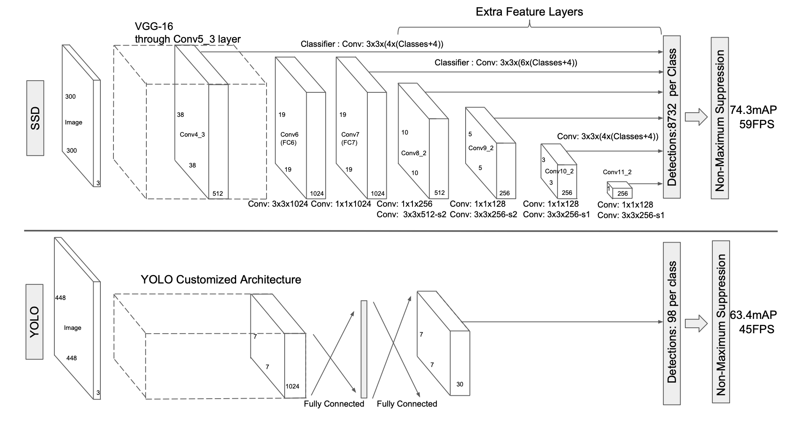

图 2：两种单次检测模型的比较：SSD 和 YOLO [5]。我们的 SSD 模型在基础网络的末端添加了几个特征层，它们预测不同比例和纵横比的默认框的偏移量及其相关置信度。具有 300 x 300 输入大小的 SSD 在 VOC2007 测试中的准确度显着优于其 448 x 448 YOLO 同类产品，同时还提高了速度。

>Fig. 2: A comparison between two single shot detection models: SSD and YOLO [5]. Our SSD model adds several feature layers to the end of a base network, which predict the offsets to default boxes of different scales and aspect ratios and their associated confidences. SSD with a 300 x 300 input size significantly outperforms its 448 x 448 YOLO counterpart in accuracy on VOC2007 test while also improving the speed.

**默认框和纵横比** 我们将一组默认边界框与每个特征图单元相关联，用于网络顶部的多个特征图。默认框以卷积方式平铺特征图，因此每个框相对于其对应单元格的位置是固定的。在每个特征图单元格中，我们预测相对于单元格中默认框形状的偏移量，以及表明每个框中存在类实例的每类分数。具体来说，对于给定位置的 k 个框中的每个框，我们计算 c 类分数和相对于原始默认框形状的 4 个偏移量。这导致在特征图中的每个位置周围应用总共 (c + 4)k 个过滤器，为一个m x n 特征图产生 (c + 4)kmn 输出。有关默认框的说明，请参见图 1。我们的默认框类似于 Faster R-CNN [2] 中使用的锚框，但是我们将它们应用于不同分辨率的多个特征图。在几个特征图中允许不同的默认框形状让我们有效地离散可能的输出框形状的空间。

>**Default boxes and aspect ratios** We associate a set of default bounding boxes with each feature map cell, for multiple feature maps at the top of the network. The default boxes tile the feature map in a convolutional manner, so that the position of each box relative to its corresponding cell is fixed. At each feature map cell, we predict the offsets relative to the default box shapes in the cell, as well as the per-class scores that indicate the presence of a class instance in each of those boxes. Specifically, for each box out of k at a given location, we compute c class scores and the 4 offsets relative to the original default box shape. This results in a total of (c + 4)k filters that are applied around each location in the feature map, yielding (c + 4)kmn outputs for amxnfeature map. For an illustration of default boxes, please refer to Fig. 1. Our default boxes are similar to the anchor boxes used in Faster R-CNN [2], however we apply them to several feature maps of different resolutions. Allowing different default box shapes in several feature maps let us efficiently discretize the space of possible output box shapes.

### 2.2 Training

训练 SSD 和训练使用区域proposal的典型检测器之间的主要区别在于，需要将ground-truth信息分配给固定检测器输出集中的特定输出。 YOLO[5] 中的训练以及 Faster R-CNN[2] 和 MultiBox[7] 的区域proposal阶段也需要一些版本。一旦确定了这个分配，损失函数和反向传播就会被端到端地应用。训练还包括选择一组默认框和检测尺度，以及hard negative mining和数据增强策略。

>The key difference between training SSD and training a typical detector that uses region proposals, is that ground truth information needs to be assigned to specific outputs in the fixed set of detector outputs. Some version of this is also required for training in YOLO[5] and for the region proposal stage of Faster R-CNN[2] and MultiBox[7]. Once this assignment is determined, the loss function and back propagation are applied end- to-end. Training also involves choosing the set of default boxes and scales for detection as well as the hard negative mining and data augmentation strategies.

**匹配策略**在训练期间，我们需要确定哪些默认框对应于ground-truth检测并相应地训练网络。对于每个真实框，我们从位置、纵横比和比例不同的默认框中进行选择。我们首先将每个ground-truth框与具有最佳 jaccard 重叠的默认框进行匹配（如 MultiBox [7] 中所示）。与 MultiBox 不同，我们随后将默认框与 jaccard 重叠高于阈值 (0.5) 的任何ground-truth进行匹配。这简化了学习问题，允许网络预测多个重叠默认框的高分，而不是要求它只选择具有最大重叠的一个。

>**Matching strategy** During training we need to determine which default boxes corre- spond to a ground truth detection and train the network accordingly. For each ground truth box we are selecting from default boxes that vary over location, aspect ratio, and scale. We begin by matching each ground truth box to the default box with the best jaccard overlap (as in MultiBox [7]). Unlike MultiBox, we then match default boxes to any ground truth with jaccard overlap higher than a threshold (0.5). This simplifies the learning problem, allowing the network to predict high scores for multiple overlapping default boxes rather than requiring it to pick only the one with maximum overlap.

**训练目标** SSD训练目标源自MultiBox目标[7,8]，但被扩展到处理多个对象类别。让

是将第i个默认框体与第j个类别p的ground-truth框相匹配的指标，在上面的匹配策略中，我们可以让

。总体目标损失函数是定位损失（loc）和置信度损失（conf）的加权和：

> **Training objective** The SSD training objective is derived from the MultiBox objective[7,8]but is extended to handle multiple object categories. Let xpij ={1,0} be an indicator for matching the i-th default box to the j-th ground truth box of category p. In the matching strategy above, we can have i xpij  1. The overall objective loss function is a weighted sum of the localization loss (loc) and the confidence loss (conf):

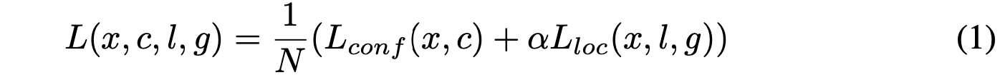

其中 N 是匹配的默认框的数量。如果 N = 0，将损失设置为 0。定位损失是预测框 (l) 和ground-truth框 (g) 参数之间的Smooth L1 损失 [6]。与 Faster R-CNN [2] 类似，我们回归到默认边界框 (d) 的中心 (cx, cy) 及其宽度 (w) 和高度 (h) 的偏移量。

>where N is the number of matched default boxes. If N =0,wet set the loss to 0. The localization loss is a Smooth L1 loss [6] between the predicted box (l) and the ground truth box (g) parameters. Similar to Faster R-CNN [2], we regress to offsets for the center (cx, cy) of the default bounding box (d) and for its width (w) and height (h).

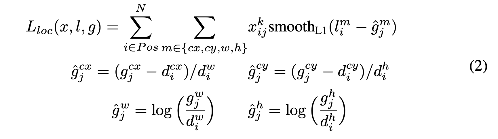

置信度损失是多类置信度 (c) 上的 softmax 损失。

>The confidence loss is the softmax loss over multiple classes confidences (c).

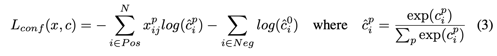

**为默认框选择比例和纵横比为了处理不同的目标比例**，一些方法 [4,9] proposal处理不同大小的图像，然后组合结果。然而，通过在单个网络中利用来自多个不同层的特征图进行预测，我们可以模拟相同的效果，同时还可以在所有目标尺度上共享参数。以前的工作 [10,11] 表明，使用来自较低层的特征图可以提高语义分割质量，因为较低层捕获了输入目标的更多细节。同样，[12] 表明，从特征图中添加全局上下文池可以帮助平滑分割结果。

>**Choosing scales and aspect ratios for default boxes** To handle different object scales, some methods [4,9] suggest processing the image at different sizes and combining the results afterwards. However, by utilizing feature maps from several different layers in a single network for prediction we can mimic the same effect, while also sharing parame- ters across all object scales. Previous works [10,11] have shown that using feature maps from the lower layers can improve semantic segmentation quality because the lower layers capture more fine details of the input objects. Similarly, [12] showed that adding global context pooled from a feature map can help smooth the segmentation results.

受这些方法的启发，我们同时使用上下特征图进行检测。图 1 显示了框架中使用的两个示例特征图（8x8 和 4x4）。在实践中，我们可以以较小的计算开销使用更多。

> Motivated by these methods, we use both the lower and upper feature maps for detec- tion. Figure 1 shows two exemplar feature maps (8 x8and 4x4) which are used in the framework. In practice, we can use many more with small computational overhead.

已知来自网络内不同级别的特征图具有不同的（经验）感受野大小 [13]。幸运的是，在 SSD 框架内，默认框不需要对应每一层的实际感受野。我们设计了默认框的平铺，以便特定的特征图学会响应目标的特定比例。假设我们想使用 m 个特征图进行预测。每个特征图的默认框的尺度计算为：

>Feature maps from different levels within a network are known to have different (empirical) receptive field sizes [13]. Fortunately, within the SSD framework, the de- fault boxes do not necessary need to correspond to the actual receptive fields of each layer. We design the tiling of default boxes so that specific feature maps learn to be responsive to particular scales of the objects. Suppose we want to use m feature maps for prediction. The scale of the default boxes for each feature map is computed as:

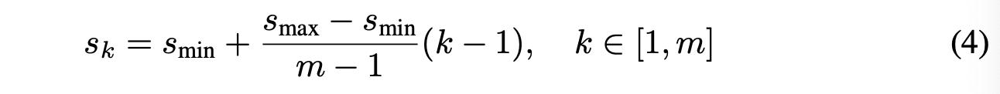

其中

为0.2，

为0.9，意味着最低层的尺度为0.2，最高层的尺度为0.9，中间的所有层都是有规律的。我们为默认的框施加不同的长宽比，并将其表示为

。我们可以计算出每个默认框的宽度
)
和高度
)
。对于长宽比为1的情况，我们还增加了一个默认框，其比例为

，从而使每个特征图的位置有6个默认框。我们将每个默认框的中心设置为
)
，其中

是第k个正方形特征图的大小，
)
。在实践中，人们也可以设计一个默认框的分布，以最适合特定的数据集。如何设计最佳的平铺方式也是一个开放的问题。

> where smin is 0.2 and smax is 0.9, meaning the lowest layer has a scale of 0.2 and the highest layer has a scale of 0.9, and all layers in between are regularly spaced. We impose different aspect ratios for the default boxes, and denote them as a_{r} \in \left\{1,2,3, \frac{1}{2}, \frac{1}{3}\right\}. We can compute the width  \left(w_{k}^{a}=s_{k} \sqrt{a_{r}}\right) and height  \left(h_{k}^{a}=s_{k} / \sqrt{a_{r}}\right)  for each default box. For the aspect ratio of 1, we also add a default box whose scale is s_{k}^{\prime}=\sqrt{s_{k} s_{k+1}} resulting in 6 default boxes per feature map location. We set the center xxx of each default box to \left(\frac{i+0.5}{\left|f_{k}\right|}, \frac{j+0.5}{\left|f_{k}\right|}\right), where \left|f_{k}\right| is the size of the k-th square feature map, 

. In practice, one can also design a distribution of default boxes to best fit a specific dataset. How to design the optimal tiling is an open question as well.

通过结合许多特征图中所有位置的不同比例和长宽比的默认框的预测，我们有一个多样化的预测集，涵盖各种输入物体的大小和形状。例如，在图1中，狗与4 x 4特征图中的默认框相匹配，但与8 x 8特征图中的任何默认框都不匹配。这是因为这些框有不同的尺度，与狗的框不匹配，因此在训练中被认为是负样本的。

> By combining predictions for all default boxes with different scales and aspect ratios from all locations of many feature maps, we have a diverse set of predictions, covering various input object sizes and shapes. For example, in Fig. 1, the dog is matched to a default box in the 4 ⇥ 4 feature map, but not to any default boxes in the 8 ⇥ 8 feature map. This is because those boxes have different scales and do not match the dog box, and therefore are considered as negatives during training.

**hard negative mining**在匹配步骤之后，大多数默认框都是负的，尤其是当可能的默认框数量很大时。这在正负训练示例之间引入了显着的不平衡。我们没有使用所有负例，而是使用每个默认框的最高置信度损失对它们进行排序，并选择顶部的那些，以便负例和正例之间的比率最多为 3:1。我们发现这会导致更快的优化和更稳定的训练。

>**Hard negative mining** After the matching step, most of the default boxes are nega- tives, especially when the number of possible default boxes is large. This introduces a significant imbalance between the positive and negative training examples. Instead of using all the negative examples, we sort them using the highest confidence loss for each default box and pick the top ones so that the ratio between the negatives and positives is at most 3:1. We found that this leads to faster optimization and a more stable training.

**数据增强**为了使模型对各种输入目标的大小和形状更加稳健，每个训练图像都通过以下选项之一随机采样：

>**Data augmentation** To make the model more robust to various input object sizes and shapes, each training image is randomly sampled by one of the following options:

– 使用整个原始输入图像。

> – Use the entire original input image.

– 对patch进行采样，以便与目标的最小 jaccard 重叠为 0.1、0.3、0.5、0.7 或 0.9。

> – Sample a patch so that the minimum jaccard overlap with the objects is 0.1, 0.3, 0.5, 0.7, or 0.9.

– 随机采样一个patch。

> – Randomly sample a patch.

每个采样patch的大小是在原始图像大小的[0.1, 1]之间，纵横比在1到2之间。我们保留ground truth box的重叠部分，如果其中心在采样patch中。在上述采样步骤之后，每个采样的patch都被调整为固定大小，并以 0.5 的概率水平翻转，此外还应用了一些类似于 [14] 中描述的光度失真。

>The size of each sampled patch is [0.1, 1] of the original image size, and the aspect ratio is between 1 and 2. We keep the overlapped part of the ground truth box if the center of it is in the sampled patch. After the aforementioned sampling step, each sampled patch is resized to fixed size and is horizontally flipped with probability of 0.5, in addition to applying some photo-metric distortions similar to those described in [14].

## 3 Experimental Results

**基础网络** 我们的实验都是基于VGG16[15]，它是在ILSVRC CLS-LOC数据集[16]上预训练的。与DeepLab-LargeFOV[17]类似，我们将fc6和fc7转换为卷积层，对fc6和fc7的参数进行子采样，将pool5从2x2-s2改为3x3-s1，并使用a`trousal gorithm[18]来填补 "洞"。我们去除所有的滤波层和fc8层。我们用SGD微调得到的模型，初始学习率为

，动量为0.9，权重衰减为0.0005，批处理量为32。每个数据集的学习率衰减策略都略有不同，我们将在后面描述细节。完整的训练和测试代码建立在Caffe[19]的基础上，并在以下网站开放源代码：https://github.com/weiliu89/caffe/tree/ssd

> **Base network** Our experiments are all based on VGG16 [15], which is pre-trained on the ILSVRC CLS-LOC dataset [16]. Similar to DeepLab-LargeFOV [17], we convert fc6 and fc7 to convolutional layers, subsample parameters from fc6 and fc7, change pool5 from2x2-s2 to 3x3-s1, and use the a` trousal gorithm[18] to fill the ”holes”. We remove all the dropout layers and the fc8 layer. We fine-tune the resulting model using SGD with initial learning rate 103, 0.9 momentum, 0.0005 weight decay, and batch size 32. The learning rate decay policy is slightly different for each dataset, and we will describe details later. The full training and testing code is built on Caffe [19] and is open source at: https://github.com/weiliu89/caffe/tree/ssd

### 3.1 PASCAL VOC2007

在这个数据集上，我们与Fast R-CNN[6]和Faster R-CNN[2]在VOC2007测试（4952张图片）上进行了比较。所有方法都在相同的预训练的VGG16网络上进行微调。

> On this dataset, we compare against Fast R-CNN [6] and Faster R-CNN [2] on VOC2007 test (4952 images). All methods fine-tune on the same pre-trained VGG16 network.

图2显示了SSD300模型的结构细节。我们使用conv4_3、conv7（fc7）、conv8_2、conv9_2、conv10_2和conv11_2来预测位置和置信度。我们在conv4_ 3上设置了比例为0.1的默认框。我们用 "xavier "方法来初始化所有新加入的卷积层的参数[20]。对于conv4_3、conv10_2和conv11_2，我们只在每个特征图的位置关联4个默认的框--省略了

和3的长宽比。对于所有其他层，我们按照第2.2节所述，放了6个默认框。由于正如文献[12]所指出的，与其他层相比，conv4 3具有不同的特征尺度，因此我们使用文献[12]中介绍的L2归一化技术，将特征图中每个位置的特征规范缩放为20，并在反向传播中学习该尺度。我们使用

的学习率进行40k迭代，然后用

和

继续训练10k迭代。当在VOC2007 trainval上训练时，表1显示我们的低分辨率SSD300模型已经比Fast R-CNN更准确。当我们在更大的512 x 512输入图像上训练SSD时，它甚至更准确，超过Faster R-CNN 1.7% mAP。如果我们用更多（即07+12）的数据训练SSD，我们看到SSD300已经比Faster R-CNN好了1.1%，SSD512好了3.6%。如果我们采用第3.4节中描述的在COCO trainval35k上训练的模型，并在07+12数据集上用SSD512对其进行微调，我们会取得最佳结果:81.6%的mAP。

> Figure 2 shows the architecture details of the SSD300 model. We use conv4_3, conv7 (fc7), conv8_2, conv9_2, conv10_2, and conv11_2 to predict both location and confidences. We set default box with scale 0.1 on conv4_3^3. We initialize the parameters for all the newly added convolutional layers with the ”xavier” method [20]. For conv4_3, conv10_2 and conv11_2, we only associate 4 default boxes at each feature map location – omitting aspect ratios of 1/3 and 3. For all other layers, we put 6 default boxes as described in Sec. 2.2. Since, as pointed out in [12], conv4 3 has a different feature scale compared to the other layers, we use the L2 normalization technique introduced in [12] to scale the feature norm at each location in the feature map to 20 and learn the scale during back propagation. We use the 10^-3 learning rate for 40k iterations, then continue training for 10k iterations with 10^-4 and 10^-5. When training on VOC2007 trainval, Table 1 shows that our low resolution SSD300 model is already more accurate than Fast R-CNN. When we train SSD on a larger 512 x 512 input image, it is even more accurate, surpassing Faster R-CNN by 1.7% mAP. If we train SSD with more (i.e. 07+12) data, we see that SSD300 is already better than Faster R-CNN by 1.1% and that SSD512 is 3.6% better. If we take models trained on COCO trainval35k as described in Sec. 3.4 and fine-tuning them on the 07+12 dataset with SSD512, we achieve the best results: 81.6% mAP.

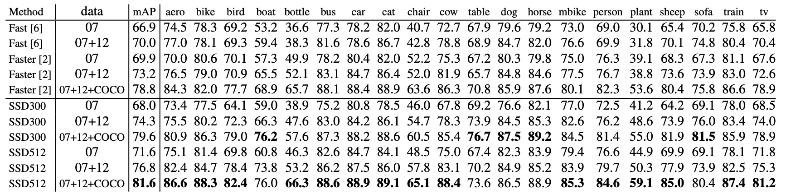

表1：PASCAL VOC2007测试检测结果。Fast和Faster R-CNN都使用最小尺寸为600的输入图像。两个SSD模型的设置完全相同，只是它们的输入尺寸不同（300x300 vs. 512x512）。很明显，更大的输入尺寸会带来更好的结果，更多的数据总是有帮助。Data:"07": VOC2007 trainval，"07+12"：VOC2007和VOC2012 trainval的结合。"07+12+COCO"：首先在COCO trainval35k上训练，然后在07+12上微调。

> Table 1: PASCAL VOC2007 test detection results. Both Fast and Faster R-CNN use input images whose minimum dimension is 600. The two SSD models have exactly the same settings except that they have different input sizes (300x300 vs. 512x512). It is obvious that larger input size leads to better results, and more data always helps. Data: ”07”: VOC2007 trainval, ”07+12”: union of VOC2007 and VOC2012 trainval. ”07+12+COCO”: first train on COCO trainval35k then fine-tune on 07+12.

为了更详细地了解我们两个SSD模型的性能，我们使用了[21]的检测分析工具。图3显示，SSD可以高质量地检测各种物体类别（大的白色区域）。它的大部分置信检测都是正确的。召回率约为85-90%，在 "弱"（0.1 jaccard重叠）标准下，召回率要高得多。与R-CNN[22]相比，SSD的定位错误更少，这表明SSD可以更好地定位物体，因为它直接学习回归物体形状和分类物体类别，而不是使用两个解耦步骤。然而，SSD在类似的物体类别上有更多的混淆（特别是对于动物），部分原因是我们共享多个类别的位置。图4显示，SSD对边界框的大小非常敏感。换句话说，它在小物体上的表现比大物体差很多。这并不奇怪，因为那些小物体甚至可能在最顶层没有任何信息。增加输入尺寸（例如从300 x 300到512 x 512）可以帮助改善对小物体的检测，但仍有很大的改进空间。从积极的一面看，我们可以清楚地看到，SSD在大型物体上的表现非常好。而且它对不同物体的长宽比非常稳健，因为我们在每个特征图的位置使用不同长宽比的默认框。

> To understand the performance of our two SSD models in more details, we used the detection analysis tool from [21]. Figure 3 shows that SSD can detect various object categories with high quality (large white area). The majority of its confident detections are correct. The recall is around 85-90%, and is much higher with “weak” (0.1 jaccard overlap) criteria. Compared to R-CNN [22], SSD has less localization error, indicating that SSD can localize objects better because it directly learns to regress the object shape and classify object categories instead of using two decoupled steps. However, SSD has more confusions with similar object categories (especially for animals), partly because we share locations for multiple categories. Figure 4 shows that SSD is very sensitive to the bounding box size. In other words, it has much worse performance on smaller objects than bigger objects. This is not surprising because those small objects may not even have any information at the very top layers. Increasing the input size (e.g. from 300 x 300 to 512 x 512) can help improve detecting small objects, but there is still a lot of room to improve. On the positive side, we can clearly see that SSD performs really well on large objects. And it is very robust to different object aspect ratios because we use default boxes of various aspect ratios per feature map location.

### 3.2 Model analysis

为了更好地了解SSD，我们进行了控制性实验，研究每个组件如何影响性能。对于所有的实验，我们使用相同的设置和输入尺寸（300 x 300），除了对设置或组件的特定变化。

>To understand SSD better, we carried out controlled experiments to examine how each component affects performance. For all the experiments, we use the same settings and input size (300 x 300), except for specified changes to the settings or component(s).

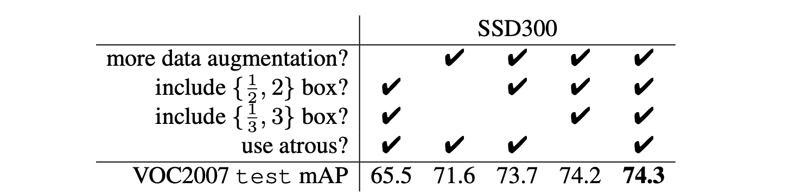

表2：各种设计选择和组件对SSD性能的影响。

> Table 2: Effects of various design choices and components on SSD performance.

**数据增强很重要**。 Fast and Faster R-CNN 使用原始图像和水平翻转进行训练。我们使用更广泛的采样策略，类似于 YOLO [5]。表 2 显示我们可以使用这种采样策略提高 8.8% 的 mAP。我们不知道我们的采样策略对 Fast and Faster R-CNN 有多大好处，但它们可能受益较少，因为它们在分类过程中使用了一个特征池化步骤，该步骤在设计上对目标变换相对稳健。

>**Data augmentation is crucial**. Fast and Faster R-CNN use the original image and the horizontal flip to train. We use a more extensive sampling strategy, similar to YOLO [5]. Table 2 shows that we can improve 8.8% mAP with this sampling strategy. We do not know how much our sampling strategy will benefit Fast and Faster R-CNN, but they are likely to benefit less because they use a feature pooling step during classification that is relatively robust to object translation by design.

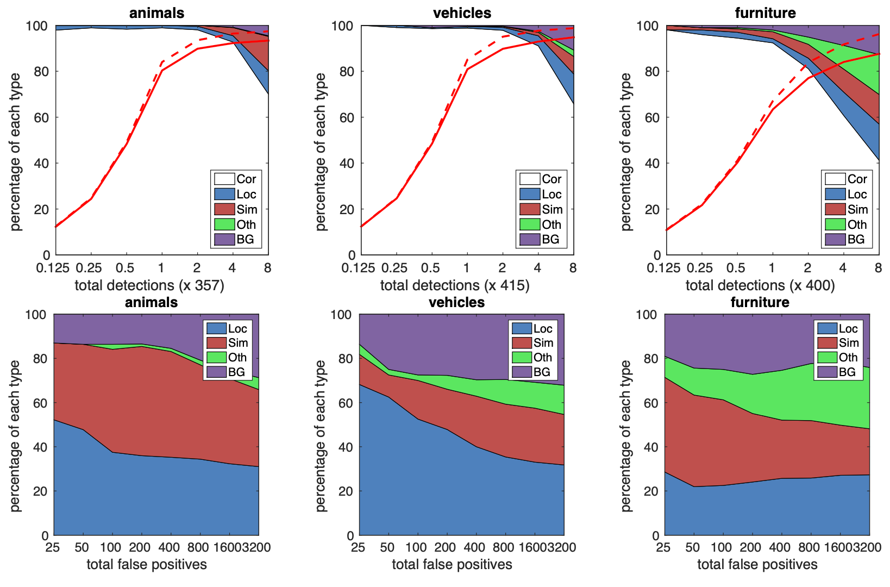

图 3：**来自 VOC2007 测试的 SSD512 在动物、车辆和家具上的性能可视化**。顶行显示了由于定位不佳 (Loc)、与相似类别 (Sim)、与其他类别 (Oth) 或与背景 (BG) 混淆而导致的正确 (Cor) 或误报检测的累积分数。实线红线反映了随着检测数量的增加，具有强标准（0.5 jaccard 重叠）的召回率的变化。红色虚线使用的是弱标准（0.1 jaccard 重叠）。底行显示排名靠前的误报类型的分布。

>Fig. 3: **Visualization of performance for SSD512 on animals, vehicles, and furni- ture from VOC2007 test.** The top row shows the cumulative fraction of detections that are correct (Cor) or false positive due to poor localization (Loc), confusion with similar categories (Sim), with others (Oth), or with background (BG). The solid red line reflects the change of recall with strong criteria (0.5 jaccard overlap) as the num- ber of detections increases. The dashed red line is using the weak criteria (0.1 jaccard overlap). The bottom row shows the distribution of top-ranked false positive types.

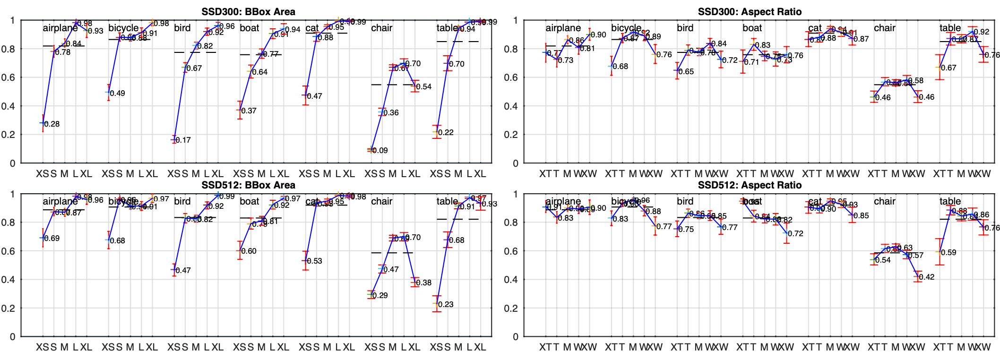

图 4：**使用 [21] 对 VOC2007 测试集的不同目标特征的敏感性和影响**。左边的图显示了每个类别的 BBox 面积的影响，右边的图显示了纵横比的影响。 Key: BBox 区域: XS=extra-small; S=小； M=中； L=大； XL =特大号。纵横比：XT=超高/窄； T=高； M=中； W=宽； XW = 超宽。

>Fig. 4: **Sensitivity and impact of different object characteristics on VOC2007 test set using [21].** The plot on the left shows the effects of BBox Area per category, and the right plot shows the effect of Aspect Ratio. Key: BBox Area: XS=extra-small; S=small; M=medium; L=large; XL =extra-large. Aspect Ratio: XT=extra-tall/narrow; T=tall; M=medium; W=wide; XW =extra-wide.

**更多的默认框形状更好**。如第二节所述。 2.2，默认情况下，我们每个位置使用 6 个默认框。如果我们去掉纵横比为 1 和 3 的框，则 3 的性能下降 0.6%。通过进一步删除纵横比为 1 和 2 的框，2 性能又下降了 2.1%。使用各种默认框形状似乎使网络预测框的任务更容易。

> **More default box shapes is better**. As described in Sec. 2.2, by default we use 6 default boxes per location. If we remove the boxes with 1 and 3 aspect ratios, the 3 performance drops by 0.6%. By further removing the boxes with 1 and 2 aspect ratios, 2 the performance drops another 2.1%. Using a variety of default box shapes seems to make the task of predicting boxes easier for the network.

**Atrous 更快**。如第二节所述。在图 3 中，我们按照 DeepLab-LargeFOV [17] 使用了子采样 VGG16 的 atrous 版本。如果我们使用完整的 VGG16，将 pool5 保持为 2x2-s2 并且不对 fc6 和 fc7 的参数进行下采样，并添加 conv5_3 进行预测，结果大致相同，但速度会慢 20% 左右。

>**Atrous is faster.** As described in Sec. 3, we used the atrous version of a subsampled VGG16, following DeepLab-LargeFOV [17]. If we use the full VGG16, keeping pool5 with 2x2    s2 and not subsampling parameters from fc6 and fc7, and add conv5 3 for prediction, the result is about the same while the speed is about 20% slower.

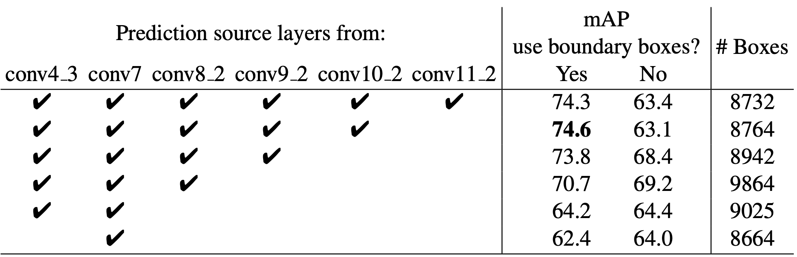

表3：使用多个输出层的效果。

> Table 3: Effects of using multiple output layers.

**不同分辨率的多个输出层更好**。 SSD 的一个主要贡献是在不同的输出层上使用不同尺度的默认框。为了衡量获得的优势，我们逐步移除层并比较结果。为了公平比较，每次我们删除一个层时，我们都会调整默认的框平铺以保持框的总数与原始的相似（8732）。这是通过在剩余层上堆叠更多比例的框并在需要时调整框的比例来完成的。我们不会详尽地优化每个设置的平铺。表 3 显示了随着层数减少，准确度下降，从 74.3 单调下降到 62.4。当我们在一个层上堆叠多个尺度的框时，很多都在图像边界上，需要小心处理。我们尝试了 Faster R-CNN [2] 中使用的策略，忽略了边界上的框。我们观察到一些有趣的趋势。例如，如果我们使用非常粗糙的特征图（例如 conv11_2(1 x 1) 或 conv10_2(3 x3)），则会大大损害性能。原因可能是我们没有足够的大框来覆盖修剪后的大物体。当我们主要使用更精细的分辨率图时，性能再次开始提高，因为即使在修剪了足够数量的大框后仍然存在。如果我们只使用 conv7 进行预测，性能是最差的，这强调了将不同尺度的框分布在不同层上的是至关重要的。此外，由于我们的预测不依赖于 [6] 中的 ROI 池化，因此我们在低分辨率特征图 [23] 中不存在collapsing bins问题。 SSD 架构结合了来自各种分辨率的特征图的预测，以实现与 Faster R-CNN 相当的准确度，同时使用较低分辨率的输入图像。

>**Multiple output layers at different resolutions is better**. A major contribution of SSD is using default boxes of different scales on different output layers. To measure the advantage gained, we progressively remove layers and compare results. For a fair comparison, every time we remove a layer, we adjust the default box tiling to keep the total number of boxes similar to the original (8732). This is done by stacking more scales of boxes on remaining layers and adjusting scales of boxes if needed. We do not exhaustively optimize the tiling for each setting. Table 3 shows a decrease in accuracy with fewer layers, dropping monotonically from 74.3 to 62.4. When we stack boxes of multiple scales on a layer, many are on the image boundary and need to be handled carefully. We tried the strategy used in Faster R-CNN [2], ignoring boxes which are on the boundary. We observe some interesting trends. For example, it hurts the perfor- mance by a large margin if we use very coarse feature maps (e.g. conv11 2(1 x 1) or conv10 2(3 x3)). The reason might be that we do not have enough large boxes to cover large objects after the pruning. When we use primarily finer resolution maps, the performance starts increasing again because even after pruning a sufficient number of large boxes remains. If we only use conv7 for prediction, the performance is the worst, reinforcing the message that it is critical to spread boxes of different scales over dif- ferent layers. Besides, since our predictions do not rely on ROI pooling as in [6], we do not have the collapsing bins problem in low-resolution feature maps [23]. The SSD architecture combines predictions from feature maps of various resolutions to achieve comparable accuracy to Faster R-CNN, while using lower resolution input images.

### 3.3 PASCAL VOC2012

我们使用与上述VOC2007基本实验相同的设置，只是我们使用VOC2012 trainval和VOC2007 trainval和test（21503张图片）进行训练，并在VOC2012 test（10991张图片）上测试。我们用

的学习率训练模型，进行60k的迭代，然后用

进行20k的迭代。表4显示了我们的SSD300和SSD512模型的结果。我们看到与我们在VOC2007测试中观察到的性能趋势相同。我们的SSD300比Fast/Faster R- CNN提高了准确性。通过增加训练和测试图像的大小到512 x 512，我们比Faster R-CNN的准确率高4.5%。与YOLO相比，SSD明显更准确，这可能是由于在训练期间使用了来自多个特征图的卷积默认框和我们的匹配策略。当从COCO上训练的模型进行微调时，我们的SSD512达到了80.0%的mAP，比Faster R-CNN高4.1%。

> We use the same settings as those used for our basic VOC2007 experiments above, except that we use VOC2012 trainval and VOC2007 trainval and test (21503 images) for training, and test on VOC2012 test (10991 images). We train the models with 103 learning rate for 60k iterations, then 104 for 20k iterations. Table 4 shows the results of our SSD300 and SSD5124 model. We see the same performance trend as we observed on VOC2007 test. Our SSD300 improves accuracy over Fast/Faster R- CNN. By increasing the training and testing image size to 512 ⇥ 512, we are 4.5% more accurate than Faster R-CNN. Compared to YOLO, SSD is significantly more accurate, likely due to the use of convolutional default boxes from multiple feature maps and our matching strategy during training. When fine-tuned from models trained on COCO, our SSD512 achieves 80.0% mAP, which is 4.1% higher than Faster R-CNN.

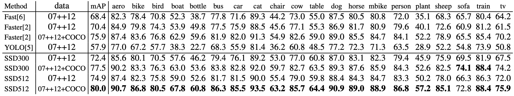

表4：PASCAL VOC2012测试检测结果。快速和快速的R-CNN使用最小维度为600的图像，而YOLO的图像大小为448x448。数据。"07++12"：VOC2007训练值和测试值与VOC2012训练值的结合。"07++12+COCO"：首先在COCO trainval35k上训练，然后在07++12上微调。

> Table 4: PASCAL VOC2012 test detection results. Fast and Faster R-CNN use images with minimum dimension 600, while the image size for YOLO is 448 x 448. data: ”07++12”: union of VOC2007 trainval and test and VOC2012 trainval. ”07++12+COCO”: first train on COCO trainval35k then fine-tune on 07++12.

### 3.4 COCO

为了进一步验证SSD框架，我们在COCO数据集上训练了SSD300和SSD512架构。由于COCO中的物体往往比PASCAL VOC小，所以我们对所有层使用较小的默认框。我们遵循第2.2节中提到的策略，但是现在我们最小的默认框的比例是0.15，而不是0.2，而conv4_3的默认框的比例是0.07（例如，300 x 300的图像的21像素）。

>To further validate the SSD framework, we trained our SSD300 and SSD512 architec- tures on the COCO dataset. Since objects in COCO tend to be smaller than PASCAL VOC, we use smaller default boxes for all layers. We follow the strategy mentioned in Sec. 2.2, but now our smallest default box has a scale of 0.15 instead of 0.2, and the scale of the default box on conv4 3 is 0.07 (e.g. 21 pixels for a 300 ⇥ 300 image)5.

我们使用trainval35k[24]进行训练。我们首先用

的学习率训练模型160k迭代，然后用

继续训练40k迭代，用

训练40k迭代。表5显示了在test-dev2015上的结果。与我们在PASCAL VOC数据集上观察到的情况类似，SSD300在mAP@0.5 和mAP@[0.5:0.95]上都比Fast R-CNN好。SSD300与ION[24]和Faster R-CNN[25]有相似的mAP@0.75，但在mAP@0.5。通过增加图像大小到512 x 512，我们的SSD512在两个标准上都比Faster R-CNN [25]好。有趣的是，我们观察到SSD512在mAP@0.75，有5.3%的优势，但在mAP@0.5，只有1.2%的优势。我们还观察到，对于大型物体，它的AP（4.8%）和AR（4.6%）要好得多，但对于小型物体，它的AP（1.3%）和AR（2.0%）的改进相对较少。与ION相比，对大物体和小物体的AR的改进更为相似（5.4% vs. 3.9%）。我们猜想，Faster R-CNN在小型物体上与SSD相比更具竞争力，因为它在RPN部分和Fast R-CNN部分都执行了两个框细化步骤。在图5中，我们展示了一些使用SSD512模型在COCO test-dev上的检测实例。

> We use the trainval35k [24] for training. We first train the model with 103 learning rate for 160k iterations, and then continue training for 40k iterations with 104 and 40k iterations with 105. Table 5 shows the results on test-dev2015. Similar to what we observed on the PASCAL VOC dataset, SSD300 is better than Fast R-CNN in both mAP@0.5 and mAP@[0.5:0.95]. SSD300 has a similar mAP@0.75 as ION [24] and Faster R-CNN [25], but is worse in mAP@0.5. By increasing the im- age size to 512 x 512, our SSD512 is better than Faster R-CNN [25] in both criteria. Interestingly, we observe that SSD512 is 5.3% better in mAP@0.75, but is only 1.2% better in mAP@0.5. We also observe that it has much better AP (4.8%) and AR (4.6%) for large objects, but has relatively less improvement in AP (1.3%) and AR (2.0%) for small objects. Compared to ION, the improvement in AR for large and small objects is more similar (5.4% vs. 3.9%). We conjecture that Faster R-CNN is more competitive on smaller objects with SSD because it performs two box refinement steps, in both the RPN part and in the Fast R-CNN part. In Fig. 5, we show some detection examples on COCO test-dev with the SSD512 model.

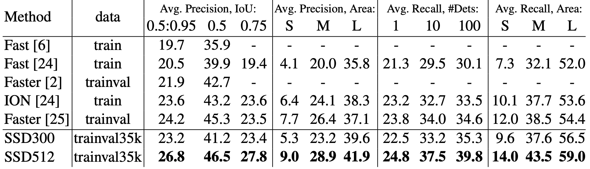

表5：COCO test-dev2015检测结果。

> Table 5: COCO **test-dev2015** detection results.

### 3.5 Preliminary ILSVRC results

我们将用于COCO的相同网络结构应用于ILSVRC DET数据集[16]。我们使用ILSVRC2014 DET train和val1来训练一个SSD300模型，正如在[22]中使用的那样。我们首先用

的学习率训练模型，进行32万次迭代，然后用

继续训练8万次迭代，用

训练4万次迭代。我们可以在val2集上达到43.4mAP[22]。这再次验证了SSD是一个高质量实时检测的通用框架。

>We applied the same network architecture we used for COCO to the ILSVRC DET dataset [16]. We train a SSD300 model using the ILSVRC2014 DET train and val1 as used in [22]. We first train the model with 103 learning rate for 320k iterations, and then continue training for 80k iterations with 104 and 40k iterations with 105. We can achieve 43.4 mAP on the val2 set [22]. Again, it validates that SSD is a general framework for high quality real-time detection.

### 3.6 Data Augmentation for Small Object Accuracy

如果没有像 Faster R-CNN 中那样的后续特征重采样步骤，SSD 的小物体分类任务相对较难，如我们的分析所示（见图 4）。 2.2节中描述的数据增强策略有助于显着提高性能，尤其是在 PASCAL VOC 等小型数据集上。该策略生成的随机裁剪可以被认为是“放大”操作，并且可以生成许多更大的训练示例。为了实现创建更多小型训练示例的“缩小”操作，我们首先将图像随机放置在原始图像大小的 16x 倍画布上，并在我们进行任何随机裁剪操作之前填充平均值。因为我们通过引入这种新的“扩展”数据增强技巧获得了更多的训练图像，所以我们必须将训练迭代加倍。如表 6 所示，我们已经看到跨多个数据集的 mAP 持续增加 2%-3%。具体而言，图 6 显示新的增强技巧显着提高了小目标的性能。该结果强调了数据增强策略对最终模型准确性的重要性。

> Without a follow-up feature resampling step as in Faster R-CNN, the classification task for small objects is relatively hard for SSD, as demonstrated in our analysis (see Fig. 4). The data augmentation strategy described in Sec. 2.2 helps to improve the performance dramatically, especially on small datasets such as PASCAL VOC. The random crops generated by the strategy can be thought of as a ”zoom in” operation and can generate many larger training examples. To implement a ”zoom out” operation that creates more small training examples, we first randomly place an image on a canvas of 16x of the original image size filled with mean values before we do any random crop operation. Because we have more training images by introducing this new ”expansion” data aug- mentation trick, we have to double the training iterations. We have seen a consistent increase of 2%-3% mAP across multiple datasets, as shown in Table 6. In specific, Fig- ure 6 shows that the new augmentation trick significantly improves the performance on small objects. This result underscores the importance of the data augmentation strategy for the final model accuracy.

改进 SSD 的另一种方法是设计更好的默认框平铺，使其位置和比例更好地与特征图上每个位置的感受野对齐。我们把它留给未来的工作。

> An alternative way of improving SSD is to design a better tiling of default boxes so that its position and scale are better aligned with the receptive field of each position on a feature map. We leave this for future work.

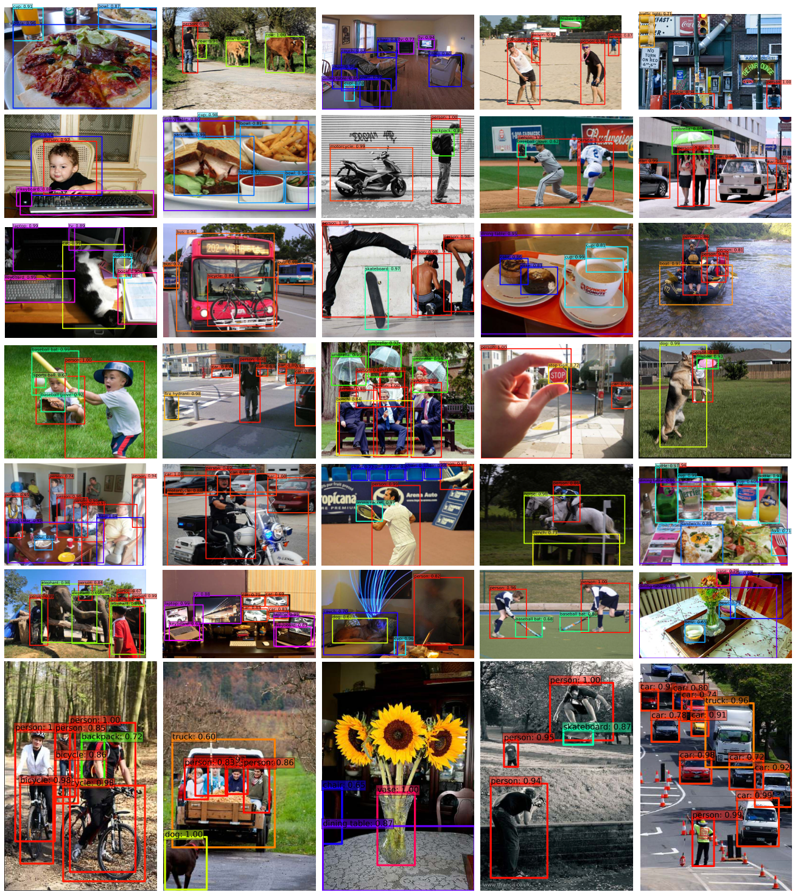

图 5：**使用 SSD512 模型的 COCO test-dev 上的检测示例**。我们展示了得分高于 0.6 的检测。每种颜色对应一个目标类别。

>Fig. 5: **Detection examples on COCO test-dev with SSD512 model**. We show detections with scores higher than 0.6. Each color corresponds to an object category.

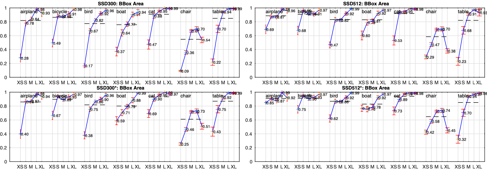

图 6：**使用 [21] 对 VOC2007 测试集进行新数据增强的目标大小的敏感性和影响**。顶行显示了原始 SSD300 和 SSD512 模型每个类别的 BBox 区域的效果，底行对应于使用新数据增强技巧训练的 SSD300* 和 SSD512* 模型。很明显，新的数据增强技巧有助于显着检测小物体。

>Fig. 6: **Sensitivity and impact of object size with new data augmentation on VOC2007 test set using [21]**. The top row shows the effects of BBox Area per cat- egory for the original SSD300 and SSD512 model, and the bottom row corresponds to the SSD300* and SSD512* model trained with the new data augmentation trick. It is obvious that the new data augmentation trick helps detecting small objects significantly.

### 3.7 Inference time

考虑到我们的方法生成的大量框，在推理过程中有效地执行非最大抑制 (nms) 至关重要。通过使用 0.01 的置信度阈值，我们可以过滤掉大多数框。然后，我们应用每类 jaccard 重叠为 0.45 的 nms，并保留每张图像的前 200 个检测。对于 SSD300 和 20 个 VOC 类，此步骤每张图像花费大约 1.7 毫秒，这接近于所有新添加层所花费的总时间（2.4 毫秒）。我们使用 Titan X 和带有 Intel Xeon E5-2667v3@3.20GHz 的 cuDNN v4 以批量大小 8 测量速度。

> Considering the large number of boxes generated from our method, it is essential to perform non-maximum suppression (nms) efficiently during inference. By using a con- fidence threshold of 0.01, we can filter out most boxes. We then apply nms with jaccard overlap of 0.45 per class and keep the top 200 detections per image. This step costs about 1.7 msec per image for SSD300 and 20 VOC classes, which is close to the total time (2.4 msec) spent on all newly added layers. We measure the speed with batch size 8 using Titan X and cuDNN v4 with Intel Xeon E5-2667v3@3.20GHz.

表 7 显示了 SSD、Faster R-CNN[2] 和 YOLO[5] 之间的比较。我们的 SSD300 和 SSD512 方法在速度和准确度上都优于 Faster R-CNN。尽管 Fast YOLO[5] 可以以 155 FPS 的速度运行，但它的准确度降低了近 22% mAP。据我们所知，SSD300 是第一个实现 70% 以上 mAP 的实时方法。请注意，大约 80% 的转发时间花费在基础网络上（在我们的例子中是 VGG16）。因此，使用更快的基础网络甚至可以进一步提高速度，这可能使 SSD512 模型也具有实时性。

> Table 7 shows the comparison between SSD, Faster R-CNN[2], and YOLO[5]. Both our SSD300 and SSD512 method outperforms Faster R-CNN in both speed and accu- racy. Although Fast YOLO[5] can run at 155 FPS, it has lower accuracy by almost 22% mAP. To the best of our knowledge, SSD300 is the first real-time method to achieve above 70% mAP. Note that about 80% of the forward time is spent on the base network (VGG16 in our case). Therefore, using a faster base network could even further improve the speed, which can possibly make the SSD512 model real-time as well.

## 4 Related Work

图像中的目标检测方法有两类，一类基于滑动窗口，另一类基于区域proposal分类。在卷积神经网络出现之前，这两种方法的最新技术——可变形零件模型（DPM）[26]和选择性搜索[1]——具有相当的性能。然而，在结合了选择性搜索区域proposal和基于卷积网络的后分类的 R-CNN [22] 带来的显着改进之后，区域proposal目标检测方法变得普遍。

> There are two established classes of methods for object detection in images, one based on sliding windows and the other based on region proposal classification. Before the advent of convolutional neural networks, the state of the art for those two approaches – Deformable Part Model (DPM) [26] and Selective Search [1] – had comparable performance. However, after the dramatic improvement brought on by R-CNN [22], which combines selective search region proposals and convolutional network based post-classification, region proposal object detection methods became prevalent.

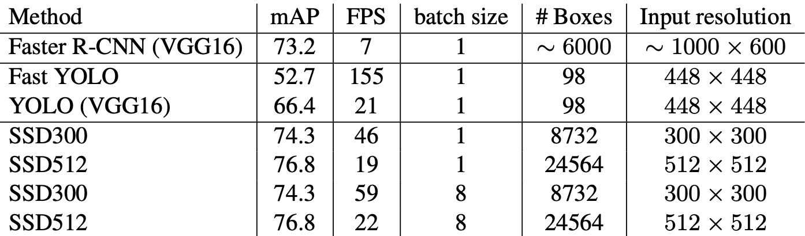

表7：**Pascal VOC2007测试的结果**。SSD300是唯一能达到70%以上mAP的实时检测方法。通过使用更大的输入图像，SSD512在准确性上胜过所有方法，同时保持了接近实时的速度。

> Table 7: **Results on Pascal VOC2007 test.** SSD300 is the only real-time detection method that can achieve above 70% mAP. By using a larger input image, SSD512 out- performs all methods on accuracy while maintaining a close to real-time speed.

最初的R-CNN方法已经有了多种改进。第一组方法提高了后期分类的质量和速度，因为它需要对数以千计的图像作物进行分类，这既昂贵又费时。SPPnet[9]大大加快了原始R-CNN方法的速度。它引入了一个空间金字塔池层，对区域大小和比例更加稳健，并允许分类层重新使用在几个图像分辨率下生成的特征图上计算的特征。Fast R-CNN[6]扩展了SPPnet，使其能够通过最小化置信度和边界框回归的损失来对所有层进行端到端的微调，这在MultiBox[7]中首次引入，用于学习对象性。

>The original R-CNN approach has been improved in a variety of ways. The first set of approaches improve the quality and speed of post-classification, since it requires the classification of thousands of image crops, which is expensive and time-consuming. SPPnet [9] speeds up the original R-CNN approach significantly. It introduces a spatial pyramid pooling layer that is more robust to region size and scale and allows the classi- fication layers to reuse features computed over feature maps generated at several image resolutions. Fast R-CNN [6] extends SPPnet so that it can fine-tune all layers end-to- end by minimizing a loss for both confidences and bounding box regression, which was first introduced in MultiBox [7] for learning objectness.

第二组方法是利用深度神经网络提高proposal生成的质量。在MultiBox[7,8]等最新的作品中，基于低级图像特征的选择性搜索区域proposal被直接由一个单独的深度神经网络生成的proposal所取代。这进一步提高了检测的准确性，但导致了一个有点复杂的设置，需要训练两个神经网络并在它们之间建立依赖关系。Faster R-CNN[2]用从区域proposal网络（RPN）中学习的proposal取代了选择性搜索proposal，并介绍了一种方法，通过交替微调这两个网络的共享卷积层和预测层来整合RPN和Fast R-CNN。这样，区域proposal被用来汇集中层特征，最后的分类步骤就不那么昂贵了。我们的SSD与Faster R-CNN中的区域proposal网络（RPN）非常相似，因为我们也使用一组固定的（默认）框进行预测，类似于RPN中的锚框。但我们不是用这些来汇集特征并评估另一个分类器，而是同时为每个框里的每个物体类别产生一个分数。因此，我们的方法避免了将RPN与快速R-CNN合并的复杂性，而且更容易训练，速度更快，并可直接整合到其他任务中。

>The second set of approaches improve the quality of proposal generation using deep neural networks. In the most recent works like MultiBox [7,8], the Selective Search region proposals, which are based on low-level image features, are replaced by pro- posals generated directly from a separate deep neural network. This further improves the detection accuracy but results in a somewhat complex setup, requiring the training of two neural networks with a dependency between them. Faster R-CNN [2] replaces selective search proposals by ones learned from a region proposal network (RPN), and introduces a method to integrate the RPN with Fast R-CNN by alternating between fine- tuning shared convolutional layers and prediction layers for these two networks. This way region proposals are used to pool mid-level features and the final classification step is less expensive. Our SSD is very similar to the region proposal network (RPN) in Faster R-CNN in that we also use a fixed set of (default) boxes for prediction, similar to the anchor boxes in the RPN. But instead of using these to pool features and evaluate another classifier, we simultaneously produce a score for each object category in each box. Thus, our approach avoids the complication of merging RPN with Fast R-CNN and is easier to train, faster, and straightforward to integrate in other tasks.

另一组方法与我们的方法直接相关，它们完全跳过了proposal步骤，直接预测多个类别的边界框和置信度。OverFeat[4]是滑动窗口法的一个深度版本，在知道底层物体类别的置信度后，直接从最顶层特征图的每个位置预测一个边界框。YOLO[5]使用整个最顶层特征图来预测多个类别的置信度和边界框（这些类别的边界框是共享的）。我们的SSD方法属于这一类，因为我们没有proposal步骤，而是使用默认的框。然而，我们的方法比现有的方法更灵活，因为我们可以在不同比例的多个特征图的每个特征位置上使用不同长宽比的默认框。如果我们只从最上面的特征图中的每个位置使用一个默认框，我们的SSD将具有类似于OverFeat[4]的架构；如果我们使用整个最上面的特征图，并添加一个全连接层来预测，而不是我们的卷积预测器，并且不明确考虑多个长宽比，我们可以近似复现YOLO[5]。

> Another set of methods, which are directly related to our approach, skip the proposal step altogether and predict bounding boxes and confidences for multiple categories di- rectly. OverFeat [4], a deep version of the sliding window method, predicts a bounding box directly from each location of the topmost feature map after knowing the confi- dences of the underlying object categories. YOLO [5] uses the whole topmost feature map to predict both confidences for multiple categories and bounding boxes (which are shared for these categories). Our SSD method falls in this category because we do not have the proposal step but use the default boxes. However, our approach is more flexible than the existing methods because we can use default boxes of different aspect ratios on each feature location from multiple feature maps at different scales. If we only use one default box per location from the topmost feature map, our SSD would have similar architecture to OverFeat [4]; if we use the whole topmost feature map and add a fully connected layer for predictions instead of our convolutional predictors, and do not explicitly consider multiple aspect ratios, we can approximately reproduce YOLO [5].

## 5 Conclusions

本文介绍了 SSD，一种用于多个类别的快速单次目标检测器。我们模型的一个关键特征是使用附加到网络顶部多个特征图的多尺度卷积边界框输出。这种表示使我们能够有效地对可能的框形状的空间进行建模。我们通过实验验证，给定适当的训练策略，大量精心选择的默认边界框可以提高性能。我们构建的 SSD 模型至少比现有方法 [5,7] 多一个数量级的框预测采样位置、比例和纵横比。我们证明，在相同的 VGG-16 基础架构下，SSD 在准确性和速度方面都优于其最先进的目标检测器。我们的 SSD512 模型在 PASCAL VOC 和 COCO 的准确性方面明显优于最先进的 Faster R-CNN [2]，同时速度快 3x。我们的实时 SSD300 模型以 59 FPS 的速度运行，比当前的实时 YOLO [5] 替代方案更快，同时产生显着优越的检测精度。

> This paper introduces SSD, a fast single-shot object detector for multiple categories. A key feature of our model is the use of multi-scale convolutional bounding box outputs attached to multiple feature maps at the top of the network. This representation allows us to efficiently model the space of possible box shapes. We experimentally validate that given appropriate training strategies, a larger number of carefully chosen default bounding boxes results in improved performance. We build SSD models with at least an order of magnitude more box predictions sampling location, scale, and aspect ratio, than existing methods [5,7]. We demonstrate that given the same VGG-16 base architecture, SSD compares favorably to its state-of-the-art object detector counterparts in terms of both accuracy and speed. Our SSD512 model significantly outperforms the state-of-the- art Faster R-CNN [2] in terms of accuracy on PASCAL VOC and COCO, while being 3x faster. Our real time SSD300 model runs at 59 FPS, which is faster than the current real time YOLO [5] alternative, while producing markedly superior detection accuracy.

除了它的独立实用程序之外，我们相信我们的整体和相对简单的 SSD 模型为使用目标检测组件的大型系统提供了一个有用的构建块。一个有前途的未来方向是探索它作为系统的一部分，使用循环神经网络同时检测和跟踪视频中的目标。

>Apart from its standalone utility, we believe that our monolithic and relatively sim- ple SSD model provides a useful building block for larger systems that employ an object detection component. A promising future direction is to explore its use as part of a sys- tem using recurrent neural networks to detect and track objects in video simultaneously.

这项工作始于 Google 的实习项目，并在 UNC 继续进行。我们要感谢 Alex Toshev 的有益讨论，并感谢 Google 的图像理解和 DistBelief 团队。我们还要感谢 Philip Ammirato 和 Patrick Poirson 的有益评论。我们感谢 NVIDIA 提供 GPU 并感谢 NSF 1452851、1446631、1526367、1533771 的支持。

>This work was started as an internship project at Google and continued at UNC. We would like to thank Alex Toshev for helpful discussions and are indebted to the Im- age Understanding and DistBelief teams at Google. We also thank Philip Ammirato and Patrick Poirson for helpful comments. We thank NVIDIA for providing GPUs and acknowledge support from NSF 1452851, 1446631, 1526367, 1533771.
