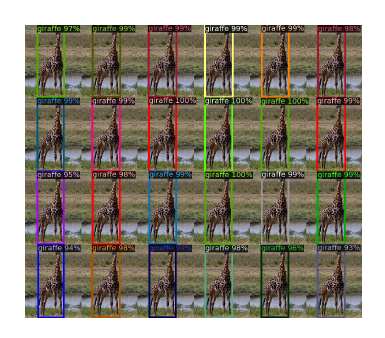
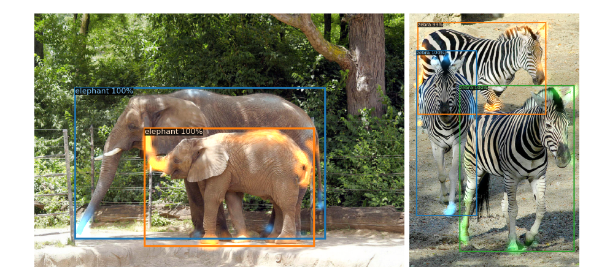
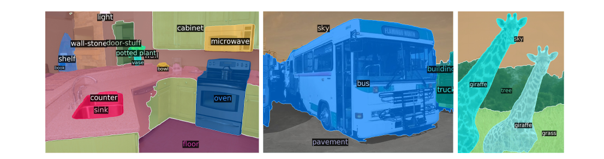

# End-to-End Object Detection with Transformers

>Nicolas Carion, Francisco Massa, Gabriel Synnaeve, Nicolas Usunier, Alexander Kirillov, and Sergey Zagoruyko
>
>Facebook AI

**摘要**。我们提出了一种将目标检测视为直接集预测问题的新方法。我们的方法简化了检测 pipeline，有效地消除了对许多手动设计组件的需求，例如非最大抑制程序或 anchor 生成，这些组件明确编码了我们关于任务的先验知识。称为 DEtection TRAnsformer 或 DETR 的新框架的主要成分是基于集合的全局损失，它通过双向匹配强制进行独特的预测，以及 transformer 编码器-解码器架构。给定一个小集合固定的学习目标查询，DETR 对目标和全局图像上下文的关系进行推理，以直接并行输出最终的一组预测。与许多其他现代检测器不同，新模型在概念上很简单，不需要专门的库。 DETR 在具有挑战性的 COCO 目标检测数据集上展示了与完善且高度优化的 Faster R-CNN baseline相当的准确性和运行时性能。此外，DETR 可以很容易地推广，以统一的方式产生全景分割。我们表明它明显优于竞争baseline。训练代码和预训练模型可在 https://github.com/facebookresearch/detr 获得。

>Abstract. We present a new method that views object detection as a direct set prediction problem. Our approach streamlines the detection pipeline, effectively removing the need for many hand-designed compo- nents like a non-maximum suppression procedure or anchor generation that explicitly encode our prior knowledge about the task. The main ingredients of the new framework, called DEtection TRansformer or DETR, are a set-based global loss that forces unique predictions via bi- partite matching, and a transformer encoder-decoder architecture. Given a fixed small set of learned object queries, DETR reasons about the re- lations of the objects and the global image context to directly output the final set of predictions in parallel. The new model is conceptually simple and does not require a specialized library, unlike many other modern detectors. DETR demonstrates accuracy and run-time perfor- mance on par with the well-established and highly-optimized Faster R- CNN baseline on the challenging COCO object detection dataset. More- over, DETR can be easily generalized to produce panoptic segmentation in a unified manner. We show that it significantly outperforms com- petitive baselines. Training code and pretrained models are available at https://github.com/facebookresearch/detr.

## 1 简介

>## 1 Introduction

目标检测的目标是为每个感兴趣的目标预测一组边界框和类别标签。现代检测器通过在大量 proposal [37,5]、anchors [23] 或窗口中心 [53,46] 上定义替代回归和分类问题，以间接方式解决此集合预测任务。他们的表现受到后处理步骤的显着影响，以去掉近乎重复的预测，anchor 集的设计以及将目标框分配给 anchors [52] 的启发式方法。为了简化这些 pipeline，我们提出了一种直接集预测方法来绕过代理任务。这种端到端的哲学已经在复杂的结构化预测任务（例如机器翻译或语音识别）中取得了重大进展，但在目标检测方面还没有：之前的尝试 [43,16,4,39] 要么添加其他形式的先验知识，或者尚未证明与具有挑战性的基准的强大baseline具有竞争力。本文旨在弥合这一差距。

>The goal of object detection is to predict a set of bounding boxes and category labels for each object of interest. Modern detectors address this set prediction task in an indirect way, by defining surrogate regression and classification prob- lems on a large set of proposals [37,5], anchors [23], or window centers [53,46]. Their performances are significantly influenced by postprocessing steps to col- lapse near-duplicate predictions, by the design of the anchor sets and by the heuristics that assign target boxes to anchors [52]. To simplify these pipelines, we propose a direct set prediction approach to bypass the surrogate tasks. This end-to-end philosophy has led to significant advances in complex structured pre- diction tasks such as machine translation or speech recognition, but not yet in object detection: previous attempts [43,16,4,39] either add other forms of prior knowledge, or have not proven to be competitive with strong baselines on chal- lenging benchmarks. This paper aims to bridge this gap. (cid:63) Equal contribution [cs.CV] May

图 1：DETR 通过将通用 CNN 与 transformer 架构相结合，直接预测（并行）最终检测集。在训练期间，二分匹配唯一地分配具有 ground truth 个框的预测。没有匹配的预测应该产生“no object”（∅）类预测。

>Fig. 1: DETR directly predicts (in parallel) the final set of detections by combining a common CNN with a transformer architecture. During training, bipartite matching uniquely assigns predictions with ground truth boxes. Prediction with no match should yield a “no object” (∅) class prediction.

我们通过将目标检测视为直接集预测问题来简化训练 pipeline。我们采用基于transformers[47]的编码器-解码器架构，这是一种流行的序列预测架构。 transformers 的自我注意机制明确地模拟序列中元素之间的所有成对交互，使这些体系结构特别适用于集合预测的特定约束，例如删除重复预测。

>We streamline the training pipeline by viewing object detection as a direct set prediction problem. We adopt an encoder-decoder architecture based on trans- formers [47], a popular architecture for sequence prediction. The self-attention mechanisms of transformers, which explicitly model all pairwise interactions be- tween elements in a sequence, make these architectures particularly suitable for specific constraints of set prediction such as removing duplicate predictions.

我们的 DEtection TRansformer（DETR，见图 1）一次预测所有目标，并使用一组损失函数进行端到端训练，该损失函数在预测目标和 ground-truth 目标之间执行二分匹配。 DETR 通过删除多个编码先验知识的手工设计组件（如空间 anchors 或非最大抑制）来简化检测 anchors。与大多数现有检测方法不同，DETR 不需要任何自定义层，因此可以在任何包含标准 CNN 和 transformer 类的框架中轻松重现。

>Our DEtection TRansformer (DETR, see Figure 1) predicts all objects at once, and is trained end-to-end with a set loss function which performs bipar- tite matching between predicted and ground-truth objects. DETR simplifies the detection pipeline by dropping multiple hand-designed components that encode prior knowledge, like spatial anchors or non-maximal suppression. Unlike most existing detection methods, DETR doesn’t require any customized layers, and thus can be reproduced easily in any framework that contains standard CNN and transformer classes.1.

与大多数以前的直接集预测工作相比，DETR 的主要特征是二分匹配损失和 transformers 与（非自回归）并行解码的结合 [29,12,10,8]。相比之下，之前的工作侧重于使用 RNN 进行自回归解码 [43,41,30,36,42]。我们的匹配损失函数唯一地将预测分配给 ground truth 目标，并且对于预测目标的排列是不变的，因此我们可以并行发出它们。

>Compared to most previous work on direct set prediction, the main features of DETR are the conjunction of the bipartite matching loss and transformers with (non-autoregressive) parallel decoding [29,12,10,8]. In contrast, previous work focused on autoregressive decoding with RNNs [43,41,30,36,42]. Our matching loss function uniquely assigns a prediction to a ground truth object, and is invariant to a permutation of predicted objects, so we can emit them in parallel.

我们在最流行的目标检测数据集之一 COCO [24] 上针对极具竞争力的 Faster R-CNN baseline [37] 评估 DETR。 Faster R-CNN 经历了多次设计迭代，其性能自最初发布以来有了很大的提高。我们的实验表明，我们的新模型实现了有竞争力的性能。更准确地说，DETR 在大型目标上表现出明显更好的性能，这一结果可能是由 transformer 的non-local计算实现的。然而，它在小物体上的性能较低。我们预计未来的工作将像 FPN [22] 的发展对 Faster R-CNN 所做的那样改善这方面。

>We evaluate DETR on one of the most popular object detection datasets, COCO [24], against a very competitive Faster R-CNN baseline [37]. Faster R- CNN has undergone many design iterations and its performance was greatly improved since the original publication. Our experiments show that our new model achieves comparable performances. More precisely, DETR demonstrates significantly better performance on large objects, a result likely enabled by the non-local computations of the transformer. It obtains, however, lower perfor- mances on small objects. We expect that future work will improve this aspect in the same way the development of FPN [22] did for Faster R-CNN.

DETR 的训练设置在很多方面都不同于标准物体检测器。新模型需要超长训练 schedule 并且获益于  transformer 中的辅助解码损失。我们深入探索了哪些组件对展示的性能至关重要。

>Training settings for DETR differ from standard object detectors in mul- tiple ways. The new model requires extra-long training schedule and benefits from auxiliary decoding losses in the transformer. We thoroughly explore what components are crucial for the demonstrated performance.

DETR 的设计理念很容易扩展到更复杂的任务。在我们的实验中，我们表明，在预训练的 DETR 之上训练的简单分割头优于全景分割 [19] 的竞争baseline，这是一项最近流行的具有挑战性的像素级识别任务。

>The design ethos of DETR easily extend to more complex tasks. In our experiments, we show that a simple segmentation head trained on top of a pre- trained DETR outperfoms competitive baselines on Panoptic Segmentation [19], a challenging pixel-level recognition task that has recently gained popularity.

## 2 相关工作

>## 2 Related work

我们的工作建立在几个领域的先前工作之上：集合预测的二分匹配损失、基于 transformer 的编码器-解码器架构、并行解码和目标检测方法。

>Our work build on prior work in several domains: bipartite matching losses for set prediction, encoder-decoder architectures based on the transformer, parallel decoding, and object detection methods.

### 2.1 集合预测

>### 2.1 Set Prediction

没有规范的深度学习模型可以直接预测集合。基本的集合预测任务是多标签分类（参见例如 [40,33] 以获取计算机视觉上下文中的参考），其中baseline方法 one-vs-rest 不适用于检测物体间有相同的底层结构等问题（比如几乎相同的框）。这些任务的第一个困难是避免近似重复。大多数当前检测器使用非最大抑制等后处理来解决此问题，但直接集合预测是无后处理的。他们需要全局推理方案来模拟所有预测元素之间的交互以避免冗余。对于恒定大小的集合预测，密集的全连接网络 [9] 就足够了，但成本很高。一种通用的方法是使用自回归序列模型，例如循环神经网络 [48]。在所有情况下，损失函数都应该是预测排列不变的。通常的解决方案是基于匈牙利算法 [20] 设计损失，以找到 ground-truth 和预测之间的二分匹配。这强制执行排列不变性，并保证每个目标元素都具有唯一的匹配项。我们遵循二分匹配损失方法。然而，与大多数先前的工作相比，我们不使用自回归模型并使用 transformer 进行并行解码，我们将在下面进行描述。

>There is no canonical deep learning model to directly predict sets. The basic set prediction task is multilabel classification (see e.g., [40,33] for references in the context of computer vision) for which the baseline approach, one-vs-rest, does not apply to problems such as detection where there is an underlying structure between elements (i.e., near-identical boxes). The first difficulty in these tasks is to avoid near-duplicates. Most current detectors use postprocessings such as non-maximal suppression to address this issue, but direct set prediction are postprocessing-free. They need global inference schemes that model interactions between all predicted elements to avoid redundancy. For constant-size set pre- diction, dense fully connected networks [9] are sufficient but costly. A general approach is to use auto-regressive sequence models such as recurrent neural net- works [48]. In all cases, the loss function should be invariant by a permutation of the predictions. The usual solution is to design a loss based on the Hungarian al- gorithm [20], to find a bipartite matching between ground-truth and prediction. This enforces permutation-invariance, and guarantees that each target element has a unique match. We follow the bipartite matching loss approach. In contrast to most prior work however, we step away from autoregressive models and use transformers with parallel decoding, which we describe below.

### 2.2 Transformers和并行解码

>### 2.2 Transformers and Parallel Decoding

Transformers 由 Vaswani 等人介绍[47] 作为一种新的基于注意力的机器翻译构建块。注意力机制 [2] 是聚合来自整个输入序列的信息的神经网络层。 Transformers 引入了自注意力层，类似于非局部神经网络 [49]，它扫描序列的每个元素并通过聚合来自整个序列的信息来更新它。基于注意力的模型的主要优点之一是它们的全局计算和完美的记忆，这使得它们比RNN更加适用于长序列。当前Transformers在自然语言处理、语音处理和计算机视觉 [8,27,45,34,31] 的许多问题中取代 RNN。

>Transformers were introduced by Vaswani et al . [47] as a new attention-based building block for machine translation. Attention mechanisms [2] are neural net- work layers that aggregate information from the entire input sequence. Trans- formers introduced self-attention layers, which, similarly to Non-Local Neural Networks [49], scan through each element of a sequence and update it by ag- gregating information from the whole sequence. One of the main advantages of attention-based models is their global computations and perfect memory, which makes them more suitable than RNNs on long sequences. Transformers are now replacing RNNs in many problems in natural language processing, speech pro- cessing and computer vision [8,27,45,34,31].

Transformers 首先用于自回归模型，遵循早期的序列到序列模型 [44]，一个接一个地生成输出 tokens。然而，令人望而却步的推理成本（与输出长度成正比，很难batch）倒逼了并行序列生成在音频[29]、机器翻译[12,10]、词表示学习等领域的发展[8]，以及最近的语音识别 [6]。我们还结合了 transformer 和并行解码，以便在计算成本和执行集合预测所需的全局计算的能力之间进行适当的权衡。

>Transformers were first used in auto-regressive models, following early sequence- to-sequence models [44], generating output tokens one by one. However, the pro- hibitive inference cost (proportional to output length, and hard to batch) lead to the development of parallel sequence generation, in the domains of audio [29], machine translation [12,10], word representation learning [8], and more recently speech recognition [6]. We also combine transformers and parallel decoding for their suitable trade-off between computational cost and the ability to perform the global computations required for set prediction.

### 2.3 目标检测

>### 2.3 Object detection

大多数现代目标检测方法都根据一些初始猜测进行预测。两级检测器 [37,5] 预测框与proposals相关，而单阶段方法进行预测与anchors [23] 或可能的目标中心网格 [53,46]相关。最近的工作 [52] 表明，这些系统的最终性能在很大程度上取决于这些初始猜测设置的确切方式。在我们的模型中，我们能够消除这种手工制作的过程，并通过对输入图像的绝对框预测而不是anchor，来直接预测检测的集合，来简化检测过程。

>Most modern object detection methods make predictions relative to some ini- tial guesses. Two-stage detectors [37,5] predict boxes w.r.t. proposals, whereas single-stage methods make predictions w.r.t. anchors [23] or a grid of possible object centers [53,46]. Recent work [52] demonstrate that the final performance of these systems heavily depends on the exact way these initial guesses are set. In our model we are able to remove this hand-crafted process and streamline the detection process by directly predicting the set of detections with absolute box prediction w.r.t. the input image rather than an anchor.

**基于集合的损失**。几个目标检测器 [9,25,35] 使用了二分匹配损失。然而，在这些早期的深度学习模型中，不同预测之间的关系仅使用卷积层或全连接层建模，并且手动设计的 NMS 后处理可以提高它们的性能。最近的检测器 [37,23,53] 在 ground truth 和预测之间使用非唯一分配规则以及 NMS。

>Set-based loss. Several object detectors [9,25,35] used the bipartite matching loss. However, in these early deep learning models, the relation between different prediction was modeled with convolutional or fully-connected layers only and a hand-designed NMS post-processing can improve their performance. More recent detectors [37,23,53] use non-unique assignment rules between ground truth and predictions together with an NMS.

可学习的 NMS 方法 [16,4] 和关系网络 [17] 明确地对不同预测与注意力之间的关系进行建模。使用直接集合损失，它们不需要任何后处理步骤。然而，这些方法使用额外的手工的上下文特征，如 proposal 框坐标来有效地建模检测之间的关系，同时我们寻找减少模型中编码的先验知识的解决方案。

>Learnable NMS methods [16,4] and relation networks [17] explicitly model relations between different predictions with attention. Using direct set losses, they do not require any post-processing steps. However, these methods employ additional hand-crafted context features like proposal box coordinates to model relations between detections efficiently, while we look for solutions that reduce the prior knowledge encoded in the model.

**循环检测器**。最接近我们的方法的是用于目标检测 [43] 和实例分割 [41,30,36,42] 的端到端集合预测。与我们类似，他们使用基于 CNN 激活的编码器-解码器架构的二分匹配损失来直接生成一组边界框。然而，这些方法仅在小型数据集上进行评估，并未针对现代baseline进行评估。特别是，它们基于自回归模型（更准确地说是 RNN），因此它们不会利用最近的 transformer 架构进行并行解码。

>Recurrent detectors. Closest to our approach are end-to-end set predictions for object detection [43] and instance segmentation [41,30,36,42]. Similarly to us, they use bipartite-matching losses with encoder-decoder architectures based on CNN activations to directly produce a set of bounding boxes. These approaches, however, were only evaluated on small datasets and not against modern baselines. In particular, they are based on autoregressive models (more precisely RNNs), so they do not leverage the recent transformers with parallel decoding.

## 3 DETR 模型

## 3 The DETR model

在检测中，有两个因素对于直接的集合预测是必不可少的：（1）一个集合预测损失，强制预测和ground truth框之间的唯一匹配；（2）一个架构，预测（在单次传输）一组对象并对它们的关系进行建模。我们在图2中详细描述了我们的架构。

> Two ingredients are essential for direct set predictions in detection: (1) a set prediction loss that forces unique matching between predicted and ground truth boxes; (2) an architecture that predicts (in a single pass) a set of objects and models their relation. We describe our architecture in detail in Figure 2.

### 3.1 物体检测集预测损失

>### 3.1 Object detection set prediction loss

DETR 在一次通过解码器的过程中推断出一组固定大小的 N 个预测，其中 N 被设置为明显大于图像中目标的典型数量。训练的主要困难之一是根据 ground truth 对预测目标（类、位置、大小）进行评分。我们的损失在预测目标和 ground truth 目标之间产生最佳二分匹配，然后优化目标特定（边界框）损失。

>DETR infers a fixed-size set of N predictions, in a single pass through the decoder, where N is set to be significantly larger than the typical number of objects in an image. One of the main difficulties of training is to score predicted objects (class, position, size) with respect to the ground truth. Our loss produces an optimal bipartite matching between predicted and ground truth objects, and then optimize object-specific (bounding box) losses.

让我们用 y 表示 ground truth 目标集，并用

表示N个预测集。假设 N 大于图像中目标的数量，我们也将 y 视为一组大小为 N 并用 ∅（无目标）填充的集合。为了找到这两个集合之间的二分匹配，我们搜索具有最低损失的 N 个元素

的排列：

>Let us denote by y the ground truth set of objects, and ˆy = {ˆyi}Ni=1 the set of N predictions. Assuming N is larger than the number of objects in the image, we consider y also as a set of size N padded with ∅ (no object). To find a bipartite matching between these two sets we search for a permutation of N elements σ ∈ SN with the lowest cost:

其中
}\right))
是 ground truth 

 和索引为 
)
 的预测之间的成对匹配损失。根据先前的工作（例如 [43]），使用匈牙利算法可以有效地计算出这种最优分配。

>where Lmatch(yi, ˆyσ(i)) is a pair-wise matching cost between ground truth yi and a prediction with index σ(i). This optimal assignment is computed efficiently with the Hungarian algorithm, following prior work (e.g. [43]).

匹配损失考虑了类别预测以及预测框和ground truth框的相似性。 ground truth 集合的每个元素 i 可以看作是一个
)
 其中 

是目标类标签（可能是 ∅），

是定义 ground truth box 的向量中心坐标及其相对于图像大小的高度和宽度。对于索引为 
)
的预测，我们将类别 

 的概率定义为
}\left(c_i\right))
 并将预测框定义为 
})
。使用这些符号，我们将 
}\right))
定义为
}\left(c_i\right)+\mathbb{1}_{\left\{c_i%20\neq%20\varnothing\right\}}%20\mathcal{L}_{\text%20{box%20}}\left(b_i,%20\hat{b}_{\sigma(i)}\right))

>The matching cost takes into account both the class prediction and the sim- ilarity of predicted and ground truth boxes. Each element i of the ground truth set can be seen as a yi = (ci, bi) where ci is the target class label (which may be ∅) and bi ∈ [0, 1]4 is a vector that defines ground truth box cen- ter coordinates and its height and width relative to the image size. For the prediction with index σ(i) we define probability of class ci as ˆpσ(i)(ci) and the predicted box as ˆbσ(i). With these notations we define Lmatch(yi, ˆyσ(i)) as

这种寻找匹配的过程与现代检测器中用于将 proposal [37] 或 anchors [22] 与 ground truth 目标匹配的启发式分配规则起着相同的作用。主要区别在于我们需要为没有重复的直接集预测找到一对一匹配。

>This procedure of finding matching plays the same role as the heuristic assign- ment rules used to match proposal [37] or anchors [22] to ground truth objects in modern detectors. The main difference is that we need to find one-to-one matching for direct set prediction without duplicates.

第二步是计算损失函数，即上一步匹配的所有对的匈牙利损失。我们将损失定义为类似于普通目标检测器的损失，即类预测的负对数似然与稍后定义的框损失的线性组合：

>The second step is to compute the loss function, the Hungarian loss for all pairs matched in the previous step. We define the loss similarly to the losses of common object detectors, i.e. a linear combination of a negative log-likelihood for class prediction and a box loss defined later:

其中

是在第一步 (1) 中计算的最优分配。在实践中，当 

时，我们将对数概率项的权重降低 10 倍，以解决类别不平衡问题。这类似于 Faster R-CNN 训练过程如何通过下采样 [37] 来平衡正/负 proposal。请注意，目标与 ∅ 之间的匹配损失不依赖于预测，这意味着在这种情况下损失是常数。在匹配损失中，我们使用概率
}\left(c_i\right))
而不是对数概率。这使得类别预测项与 
)
（如下所述）相当，并且我们观察到有更好的经验表现。

>where ˆσ is the optimal assignment computed in the first step (1). In practice, we down-weight the log-probability term when ci = ∅ by a factor 10 to account for class imbalance. This is analogous to how Faster R-CNN training procedure bal- ances positive/negative proposals by subsampling [37]. Notice that the matching cost between an object and ∅ doesn’t depend on the prediction, which means that in that case the cost is a constant. In the matching cost we use probabil- ities ˆpˆσ(i)(ci) instead of log-probabilities. This makes the class prediction term commensurable to Lbox(·, ·) (described below), and we observed better empirical performances.

**边界框损失**。匹配损失和匈牙利损失的第二部分是对边界框进行评分的 
)
。与许多检测器根据一些初始猜测将框预测作为一个 ∆ 不同，我们直接进行框预测。虽然这种方法简化了实现，但它带来了损失的相对缩放问题。最常用的 

损失对于小框和大框会有不同的尺度，即使它们的相对误差相似。为了缓解这个问题，我们使用 

损失和广义 IoU 损失 [38] 
)
的线性组合，它是尺度不变的。总的来说，我们的框损失是
}\right))
定义为
}\right)+\lambda_{\mathrm{L}%201}\left\|b_i-\hat{b}_{\sigma(i)}\right\|_1)
 其中

 是超参数。这两个损失由 batch 内的目标数量归一化。

>Bounding box loss. The second part of the matching cost and the Hungarian loss is Lbox(·) that scores the bounding boxes. Unlike many detectors that do box predictions as a ∆ w.r.t. some initial guesses, we make box predictions directly. While such approach simplify the implementation it poses an issue with relative scaling of the loss. The most commonly-used (cid:96)1 loss will have different scales for small and large boxes even if their relative errors are similar. To mitigate this issue we use a linear combination of the (cid:96)1 loss and the generalized IoU loss [38] Liou(·, ·) that is scale-invariant. Overall, our box loss is Lbox(bi, ˆbσ(i)) defined as λiouLiou(bi, ˆbσ(i)) + λL1||bi − ˆbσ(i)||1 where λiou, λL1 ∈ R are hyperparameters. These two losses are normalized by the number of objects inside the batch.

### 3.2 DETR架构

>### 3.2 DETR architecture

整个 DETR 架构非常简单，如图 2 所示。它包含三个主要组件，我们将在下面进行描述：CNN backbone 用于提取紧凑的特征表示、编码器-解码器 transformer 和简单的前馈网络(FFN) 进行最终检测预测。

>The overall DETR architecture is surprisingly simple and depicted in Figure 2. It contains three main components, which we describe below: a CNN backbone to extract a compact feature representation, an encoder-decoder transformer, and a simple feed forward network (FFN) that makes the final detection prediction.

与许多现代检测器不同，DETR 可以在任何提供通用 CNN backbone 和 transformer 架构实现的深度学习框架中实现，只需几百行。 DETR 的推理代码可以在 PyTorch [32] 中用不到 50 行的代码实现。我们希望我们方法的简单性将吸引新的研究人员加入检测社区。

>Unlike many modern detectors, DETR can be implemented in any deep learn- ing framework that provides a common CNN backbone and a transformer archi- tecture implementation with just a few hundred lines. Inference code for DETR can be implemented in less than 50 lines in PyTorch [32]. We hope that the sim- plicity of our method will attract new researchers to the detection community.

**Backbone**。从初始图像

（具有 3 个颜色通道）开始，传统的 CNN backbone 生成较低分辨率的激活图 

。我们使用的典型值是 C = 2048 和 H, W = 

 。

>Backbone. Starting from the initial image ximg ∈ R3×H0×W0 (with 3 color channels2), a conventional CNN backbone generates a lower-resolution activation map f ∈ RC×H×W . Typical values we use are C = 2048 and H, W = H032 , W032 .

**Transformer 编码器**。首先，1x1 卷积将高级激活图 f 的通道维度从 C 降低到更小的维度 d。创建一个新的特征映射

。编码器需要一个序列作为输入，因此我们将 

 的空间维度折叠为一维，从而产生 d×HW 特征图。每个编码器层都有一个标准的架构，由一个多头自注意力模块和一个前馈网络（FFN）组成。由于 transformer 架构是置换不变的，我们用添加到每个注意层输入的固定位置编码 [31,3] 对其进行补充。我们将补充材料推迟到架构的详细定义，它遵循 [47] 中描述的架构。

>Transformer encoder. First, a 1x1 convolution reduces the channel dimension of the high-level activation map f from C to a smaller dimension d. creating a new feature map z0 ∈ Rd×H×W . The encoder expects a sequence as input, hence we collapse the spatial dimensions of z0 into one dimension, resulting in a d×HW feature map. Each encoder layer has a standard architecture and consists of a multi-head self-attention module and a feed forward network (FFN). Since the transformer architecture is permutation-invariant, we supplement it with fixed positional encodings [31,3] that are added to the input of each attention layer. We defer to the supplementary material the detailed definition of the architecture, which follows the one described in [47].

图 2：DETR 使用传统的 CNN backbone 来学习输入图像的二维表示。在将其传递到 transformer 编码器之前，该模型将其展平并用位置编码对其进行补充。然后 transformer 解码器将少量固定数量的已学习位置 embeddings 作为输入，我们称之为目标查询，并另外关注编码器输出。我们将解码器的每个输出 embedding 传递给共享前馈网络 (FFN)，该网络预测检测（类和边界框）或“no object”类。

>Fig. 2: DETR uses a conventional CNN backbone to learn a 2D representation of an input image. The model flattens it and supplements it with a positional encoding before passing it into a transformer encoder. A transformer decoder then takes as input a small fixed number of learned positional embeddings, which we call object queries, and additionally attends to the encoder output. We pass each output embedding of the decoder to a shared feed forward network (FFN) that predicts either a detection (class and bounding box) or a “no object” class.

**Transformer解码器**。解码器遵循 transformer 的标准架构，使用多头自和编码器-解码器注意机制转换大小为 d 的 N embeddings。与原始transformer的不同之处在于，我们的模型在每个解码器层并行解码 N 个目标，而 Vaswani 等人[47] 使用自回归模型一次预测一个元素的输出序列。我们建议不熟悉这些概念的读者参阅补充材料。由于解码器也是置换不变的，因此 N 输入 embeddings 必须不同才能产生不同的结果。这些输入 embeddings 是学习到的位置编码，我们称之为目标查询，与编码器类似，我们将它们添加到每个注意层的输入中。解码器将 N 个目标查询转换为输出 embedding。然后通过前馈网络（在下一节中描述）将它们独立解码为框坐标和类标签，从而产生 N 个最终预测。使用对这些 embeddings 的自注意力和编码器解码器注意力，该模型使用它们之间的成对关系对所有目标进行全局推理，同时能够将整个图像用作上下文。

>Transformer decoder. The decoder follows the standard architecture of the transformer, transforming N embeddings of size d using multi-headed self- and encoder-decoder attention mechanisms. The difference with the original trans- former is that our model decodes the N objects in parallel at each decoder layer, while Vaswani et al. [47] use an autoregressive model that predicts the output sequence one element at a time. We refer the reader unfamiliar with the concepts to the supplementary material. Since the decoder is also permutation-invariant, the N input embeddings must be different to produce different results. These in- put embeddings are learnt positional encodings that we refer to as object queries, and similarly to the encoder, we add them to the input of each attention layer. The N object queries are transformed into an output embedding by the decoder. They are then independently decoded into box coordinates and class labels by a feed forward network (described in the next subsection), resulting N final predictions. Using self- and encoder-decoder attention over these embeddings, the model globally reasons about all objects together using pair-wise relations between them, while being able to use the whole image as context.

**预测前馈网络 (FFN)**。最终预测由具有 ReLU 激活函数和隐藏维度 d 的 3 层感知器以及线性投影层计算。 FFN预测归一化的中心坐标、高度和宽度与输入图像的关系，线性层使用 softmax 函数预测类标签。由于我们预测了一组固定大小的 N 个边界框，其中 N 通常远大于图像中感兴趣目标的实际数量，因此使用一个额外的特殊类标签 ∅ 来表示没有目标匹配。此类在标准目标检测方法中扮演着与“背景”类类似的角色。

>Prediction feed-forward networks (FFNs). The final prediction is com- puted by a 3-layer perceptron with ReLU activation function and hidden dimen- sion d, and a linear projection layer. The FFN predicts the normalized center coordinates, height and width of the box w.r.t. the input image, and the lin- ear layer predicts the class label using a softmax function. Since we predict a fixed-size set of N bounding boxes, where N is usually much larger than the actual number of objects of interest in an image, an additional special class la- bel ∅ is used to represent that no object is detected within a slot. This class plays a similar role to the “background” class in the standard object detection approaches.

**辅助性解码损失**。我们发现在训练过程中，在解码器中使用辅助损失[1]很有帮助，特别是帮助模型输出每个类别的正确对象数量。我们在每个解码器层之后添加预测 FFN 和匈牙利损失。所有预测 FFN 共享它们的参数。我们使用额外的共享layer-norm来normalize来自不同解码器层的预测 FFN 的输入。

> Auxiliary decoding losses. We found helpful to use auxiliary losses [1] in decoder during training, especially to help the model output the correct number of objects of each class. We add prediction FFNs and Hungarian loss after each decoder layer. All predictions FFNs share their parameters. We use an additional shared layer-norm to normalize the input to the prediction FFNs from different decoder layers.

## 4 实验

>## 4 Experiments

我们表明，与 Faster R-CNN 相比，DETR 在对 COCO 的定量评估中取得了有竞争力的结果。然后，我们提供了对架构和损失的详细消融研究，以及见解和定性结果。最后，为了表明 DETR 是一种通用且可扩展的模型，我们展示了全景分割的结果，仅在固定的 DETR 模型上训练了一个小的扩展。我们在 https://github.com/facebookresearch/detr 提供代码和预训练模型来重现我们的实验。

>We show that DETR achieves competitive results compared to Faster R-CNN in quantitative evaluation on COCO. Then, we provide a detailed ablation study of the architecture and loss, with insights and qualitative results. Fi- nally, to show that DETR is a versatile and extensible model, we present results on panoptic segmentation, training only a small extension on a fixed DETR model. We provide code and pretrained models to reproduce our experiments at https://github.com/facebookresearch/detr.

**数据集**。我们对 COCO 2017 检测和全景分割数据集 [24,18] 进行实验，其中包含 118k 训练图像和 5k 验证图像。每个图像都用边界框和全景分割进行注释。每个图像平均有 7 个实例，训练集中单个图像最多 63 个实例，在同一图像上从小到大。如果没有特别说明， AP 就是指 bbox AP，即多个阈值的整体指标。为了与 Faster R-CNN 进行比较，我们报告了最后一次训练epoch的验证 AP ，对于消融，我们报告了最近 10 次 epochs 的验证结果的中值。

>Dataset. We perform experiments on COCO 2017 detection and panoptic seg- mentation datasets [24,18], containing 118k training images and 5k validation images. Each image is annotated with bounding boxes and panoptic segmenta- tion. There are 7 instances per image on average, up to 63 instances in a single image in training set, ranging from small to large on the same images. If not specified, we report AP as bbox AP, the integral metric over multiple thresholds. For comparison with Faster R-CNN we report validation AP at the last training epoch, for ablations we report median over validation results from the last 10 epochs.

**技术细节**。我们使用 AdamW [26] 训练 DETR，将初始transformer的学习率设置为 

，backbone 设置为 

，权重衰减为 

。所有 transformer 权重都使用 Xavier init [11] 初始化，backbone 使用来自 torchvision 的 ImageNet 预训练 ResNet 模型 [15] 并带有冻结的 batchnorm层。我们使用两个不同的 backbone 报告结果：ResNet-50 和 ResNet-101。对应模型分别称为DETR和DETR-R101。在 [21] 之后，我们还通过向 backbone 的最后stage添加扩张并从该stage的第一个卷积中删除一个步幅来提高特征分辨率。相应的模型分别称为 DETR-DC5 和 DETR-DC5-R101（扩张的 C5 stage）。这种修改将分辨率提高了两倍，从而提高了小物体的性能，但代价是编码器的自注意力成本增加了 16 倍，导致计算成本总体增加了 2 倍。表 1 给出了这些模型的 FLOP 与 Faster R-CNN 的完整比较。

>Technical details. We train DETR with AdamW [26] setting the initial trans- former’s learning rate to 10−4, the backbone’s to 10−5, and weight decay to 10−4. All transformer weights are initialized with Xavier init [11], and the backbone is with ImageNet-pretrained ResNet model [15] from torchvision with frozen batchnorm layers. We report results with two different backbones: a ResNet- 50 and a ResNet-101. The corresponding models are called respectively DETR and DETR-R101. Following [21], we also increase the feature resolution by adding a dilation to the last stage of the backbone and removing a stride from the first convolution of this stage. The corresponding models are called respec- tively DETR-DC5 and DETR-DC5-R101 (dilated C5 stage). This modification increases the resolution by a factor of two, thus improving performance for small objects, at the cost of a 16x higher cost in the self-attentions of the encoder, leading to an overall 2x increase in computational cost. A full comparison of FLOPs of these models and Faster R-CNN is given in Table 1.

我们使用缩放增强，调整输入图像的大小，使最短边至少为 480 像素，最多为 800 像素，而最长边最多为 1333 [50]。为了帮助通过编码器的自注意力学习全局关系，我们还在训练期间应用了随机裁剪增强，将性能提高了大约 1 AP。具体来说，训练图像以 0.5 的概率裁剪为随机矩形 patch，然后再次调整大小为800-1333。transformer使用默认的0.1的dropout。在推理时，一些slot预测空类。为了针对 AP 进行优化，我们使用相应的置信度覆盖了具有第二高得分类别的这些slot的预测。与过滤掉空slot相比，这将 AP 提高了 2 点。其他训练超参数可以在 A.4 节中找到。对于我们的消融实验，我们使用 300 schedule 的训练 epochs，学习率在 200 epochs 后下降了 10 倍，其中单个 epoch 是一次遍历所有训练图像。在 16 个 V100 GPU 上训练 300 epochs 的baseline模型需要 3 天，每个 GPU 有 4 张图像（因此总 batch 大小为 64）。对于用于与 Faster R-CNN 进行比较的较长 schedule，我们训练 500 epochs，学习率在 400 epochs 后下降。与较短的 schedule 相比，此 schedule 增加了 1.5 AP。

>We use scale augmentation, resizing the input images such that the shortest side is at least 480 and at most 800 pixels while the longest at most 1333 [50]. To help learning global relationships through the self-attention of the encoder, we also apply random crop augmentations during training, improving the per- formance by approximately 1 AP. Specifically, a train image is cropped with probability 0.5 to a random rectangular patch which is then resized again to 800-1333. The transformer is trained with default dropout of 0.1. At inference time, some slots predict empty class. To optimize for AP, we override the predic- tion of these slots with the second highest scoring class, using the corresponding confidence. This improves AP by 2 points compared to filtering out empty slots. Other training hyperparameters can be found in section A.4. For our ablation experiments we use training schedule of 300 epochs with a learning rate drop by a factor of 10 after 200 epochs, where a single epoch is a pass over all train- ing images once. Training the baseline model for 300 epochs on 16 V100 GPUs takes 3 days, with 4 images per GPU (hence a total batch size of 64). For the longer schedule used to compare with Faster R-CNN we train for 500 epochs with learning rate drop after 400 epochs. This schedule adds 1.5 AP compared to the shorter schedule.

表 1：在 COCO 验证集上与 Faster R-CNN 与 ResNet-50 和 ResNet-101 backbone 的比较。顶部显示了 Detectron2 [50] 中 Faster R-CNN 模型的结果，中间部分显示了具有 GIoU [38]、随机裁剪训练时间增强和长 9x 训练 schedule 的 Faster R-CNN 模型的结果。 DETR 模型实现了与经过大量调整的 Faster R-CNN baseline相当的结果，具有较低的 APS 但大大提高了 APL。我们使用 torchscript Faster R-CNN 和 DETR 模型来测量 FLOPS 和 FPS。名称中没有 R101 的结果对应于 ResNet-50。

>Table 1: Comparison with Faster R-CNN with a ResNet-50 and ResNet-101 backbones on the COCO validation set. The top section shows results for Faster R-CNN models in Detectron2 [50], the middle section shows results for Faster R-CNN models with GIoU [38], random crops train-time augmentation, and the long 9x training schedule. DETR models achieve comparable results to heavily tuned Faster R-CNN baselines, having lower APS but greatly improved APL. We use torchscript Faster R-CNN and DETR models to measure FLOPS and FPS. Results without R101 in the name corre- spond to ResNet-50.

### 4.1 与Faster R-CNN的比较

>### 4.1 Comparison with Faster R-CNN

Transformer 通常使用 Adam 或 Adagrad 优化器进行训练，训练时间 schedule 和 dropout非常长，DETR 也是如此。然而，Faster R-CNN 使用 SGD 进行训练，数据增强最少，我们不知道 Adam 或 dropout 的成功应用。尽管存在这些差异，我们仍试图使更快的 R-CNN baseline更强。为了使其与 DETR 保持一致，我们将广义 IoU [38] 添加到框损失中，相同的随机裁剪增强和长期训练已知可以改善结果 [13]。结果如表 1 所示。在顶部部分，我们展示了 Detectron2 Model Zoo [50] 对使用 3x schedule 训练的模型的 Faster R-CNN 结果。在中间部分我们展示了使用相同模型但使用 9x schedule (109 epochs) 和描述的增强的结果（带“+”号），总共增加 1-2 AP。在表 1 的最后一部分，我们展示了多个 DETR 模型的结果。为了在参数数量上具有可比性，我们选择了一个具有 6 个 transformer 和 6 个宽度为 256 的解码器层和 8 个注意力头的模型。与带有 FPN 的 Faster R-CNN 一样，该模型有 4130 万个参数，其中 2350 万个在 ResNet-50 中，1780 万个在 transformer 中。尽管 Faster R-CNN 和 DETR 仍然有可能通过更长时间的训练进一步提高，但我们可以得出结论，DETR 可以与参数数量相同的 Faster R-CNN 竞争，在 COCO val 子集上实现 42 AP。 DETR 实现这一目标的方法是提高 AP

 (+7.8)，但请注意该模型在 AP

 (-5.5) 方面仍然落后。具有相同数量参数和类似 FLOP 计数的 DETR-DC5 具有更高的 AP，但在 AP

 方面也仍然明显落后。 Faster R-CNN 和带 ResNet-101 backbone 的DETR也显示了类似的结果。

>Transformers are typically trained with Adam or Adagrad optimizers with very long training schedules and dropout, and this is true for DETR as well. Faster R-CNN, however, is trained with SGD with minimal data augmentation and we are not aware of successful applications of Adam or dropout. Despite these differences we attempt to make a Faster R-CNN baseline stronger. To align it with DETR, we add generalized IoU [38] to the box loss, the same random crop augmentation and long training known to improve results [13]. Results are presented in Table 1. In the top section we show Faster R-CNN results from Detectron2 Model Zoo [50] for models trained with the 3x schedule. In the middle section we show results (with a “+”) for the same models but trained with the 9x schedule (109 epochs) and the described enhancements, which in total adds 1-2 AP. In the last section of Table 1 we show the results for multiple DETR models. To be comparable in the number of parameters we choose a model with 6 transformer and 6 decoder layers of width 256 with 8 attention heads. Like Faster R-CNN with FPN this model has 41.3M parameters, out of which 23.5M are in ResNet-50, and 17.8M are in the transformer. Even though both Faster R-CNN and DETR are still likely to further improve with longer training, we can conclude that DETR can be competitive with Faster R-CNN with the same number of parameters, achieving 42 AP on the COCO val subset. The way DETR achieves this is by improving APL (+7.8), however note that the model is still lagging behind in APS (-5.5). DETR-DC5 with the same number of parameters and similar FLOP count has higher AP, but is still significantly behind in APS too. Faster R-CNN and DETR with ResNet-101 backbone show comparable results as well.

表 2：编码器大小的影响。每行对应一个模型，该模型具有不同数量的编码器层和固定数量的解码器层。随着编码器层数的增加，性能逐渐提高。

>Table 2: Effect of encoder size. Each row corresponds to a model with varied number of encoder layers and fixed number of decoder layers. Performance gradually improves with more encoder layers.

### 4.2 消融

>### 4.2 Ablations

transformer 解码器中的注意机制是对不同检测的特征表示之间的关系建模的关键组件。在我们的消融分析中，我们探索了我们架构的其他组件和损失如何影响最终性能。对于研究，我们选择基于 ResNet-50 的 DETR 模型，具有 6 个编码器、6 个解码器层和宽度 256。该模型具有 41.3M 参数，在短和长 schedules 上分别达到 40.6 和 42.0 AP，并以 28 FPS 运行，类似于具有相同 backbone 的 Faster R-CNN-FPN。

>Attention mechanisms in the transformer decoder are the key components which model relations between feature representations of different detections. In our ablation analysis, we explore how other components of our architecture and loss influence the final performance. For the study we choose ResNet-50-based DETR model with 6 encoder, 6 decoder layers and width 256. The model has 41.3M parameters, achieves 40.6 and 42.0 AP on short and long schedules respectively, and runs at 28 FPS, similarly to Faster R-CNN-FPN with the same backbone.

**编码器层数**。我们通过改变编码器层数来评估全局图像级自注意力的重要性（表 2）。没有编码器层，整体 AP 下降了 3.9 点，大型物体上的 6.0 AP 下降更显着。我们假设，通过使用全局场景推理，编码器对于理出目标很重要。在图 3 中，我们将经过训练的模型的最后一个编码器层的注意力图可视化，重点关注图像中的几个点。编码器似乎已经分离了实例，这可能简化了解码器的目标提取和定位。

>Number of encoder layers. We evaluate the importance of global image- level self-attention by changing the number of encoder layers (Table 2). Without encoder layers, overall AP drops by 3.9 points, with a more significant drop of 6.0 AP on large objects. We hypothesize that, by using global scene reasoning, the encoder is important for disentangling objects. In Figure 3, we visualize the attention maps of the last encoder layer of a trained model, focusing on a few points in the image. The encoder seems to separate instances already, which likely simplifies object extraction and localization for the decoder.

图 3：一组参考点的编码器自注意力。编码器能够分离单个实例。预测是在验证集图像上使用baseline DETR 模型进行的。

>Fig. 3: Encoder self-attention for a set of reference points. The encoder is able to sep- arate individual instances. Predictions are made with baseline DETR model on a vali- dation set image.

**解码器层数**。我们在每次解码层后应用辅助损失（见3.2节），然后，预测FFNs是被设计来训练从每个解码器层的输出中预测目标。我们通过评估在解码的每个阶段预测的目标来分析每个解码器层的重要性（图 4）。 AP 和 AP

 在每一层后都有所提高，总计在第一层和最后一层之间有非常显着的 +8.2/9.5 AP 提高。由于其基于集合的损失，DETR 在设计上不需要 NMS。为了验证这一点，我们在每个解码器之后的输出运行一个标准的 NMS 程序，都使用默认参数 [50]。 NMS 提高了第一个解码器的预测性能。这可以解释为 transformer 的单个解码层无法计算输出元素之间的任何互相关，因此很容易对同一目标进行多次预测。在第二层和后续层中，激活上的自我注意机制允许模型抑制重复预测。我们观察到 NMS 带来的改进随着深度的增加而减弱。在最后一层，我们观察到 AP 的小损失，因为 NMS 错误地删除了真正样本的预测。

>Number of decoder layers. We apply auxiliary losses after each decoding layer (see Section 3.2), hence, the prediction FFNs are trained by design to pre-dict objects out of the outputs of every decoder layer. We analyze the importance of each decoder layer by evaluating the objects that would be predicted at each stage of the decoding (Fig. 4). Both AP and AP50 improve after every layer, totalling into a very significant +8.2/9.5 AP improvement between the first and the last layer. With its set-based loss, DETR does not need NMS by design. To verify this we run a standard NMS procedure with default parameters [50] for the outputs after each decoder. NMS improves performance for the predictions from the first decoder. This can be explained by the fact that a single decoding layer of the transformer is not able to compute any cross-correlations between the output elements, and thus it is prone to making multiple predictions for the same object. In the second and subsequent layers, the self-attention mechanism over the activations allows the model to inhibit duplicate predictions. We ob- serve that the improvement brought by NMS diminishes as depth increases. At the last layers, we observe a small loss in AP as NMS incorrectly removes true positive predictions.

与可视化编码器注意力类似，我们在图 6可视化解码器注意力，用不同颜色为每个预测目标着色注意力图。我们观察到解码器注意力相当局部，这意味着它主要关注物体的四肢，例如头部或腿部。我们假设在编码器通过全局注意力分离实例后，解码器只需要注意四肢即可提取类和目标边界。

>Similarly to visualizing encoder attention, we visualize decoder attentions in Fig. 6, coloring attention maps for each predicted object in different colors. We observe that decoder attention is fairly local, meaning that it mostly attends to object extremities such as heads or legs. We hypothesise that after the encoder has separated instances via global attention, the decoder only needs to attend to the extremities to extract the class and object boundaries.

**FFN 的重要性**。tranformers内部的 FFN 可以看作是 1×1 卷积层，使编码器类似于注意力增强卷积网络 [3]。我们试图完全删除它，只在 transformer 层中留下注意力。通过将网络参数的数量从 41.3M 减少到 28.7M，在 transformer 中只留下 10.8M，性能下降了 2.3 AP，因此我们得出结论，FFN 对于取得好的结果很重要。

>Importance of FFN. FFN inside tranformers can be seen as 1 × 1 convo- lutional layers, making encoder similar to attention augmented convolutional networks [3]. We attempt to remove it completely leaving only attention in the transformer layers. By reducing the number of network parameters from 41.3M to 28.7M, leaving only 10.8M in the transformer, performance drops by 2.3 AP, we thus conclude that FFN are important for achieving good results.

图 4：每个解码器层之后的 AP 和 AP50 性能。评估单个长 schedule baseline模型。 DETR 在设计上不需要 NMS，这个数字验证了这一点。 NMS 降低了最后一层的 AP，去除了 TP 预测，但提高了第一层解码器的 AP，去除了双重预测，因为第一层没有通信，并且AP

略有改善。

>Fig. 4: AP and AP50 performance after each de- coder layer. A single long schedule baseline model is evaluated. DETR does not need NMS by de- sign, which is validated by this figure. NMS lowers AP in the final layers, removing TP predictions, but improves AP in the first decoder layers, re- moving double predictions, as there is no commu- nication in the first layer, and slightly improves AP50 .

图 5：稀有类的分布泛化。 即使训练集中没有图像有超过 13 只长颈鹿，DETR 也可以毫不费力地推广到 24 只或更多的同一类实例。

> Fig. 5: Out of distribution gen- eralization for rare classes. Even though no image in the training set has more than 13 giraffes, DETR has no diffi- culty generalizing to 24 and more instances of the same class.

**位置编码的重要性**。我们的模型中有两种位置编码：空间位置编码和输出位置编码（object queries）。我们尝试固定编码和学习编码的各种组合，结果见表 3。输出位置编码是必需的，不能删除，因此我们尝试在解码器输入处传递一次它们，或者在每个解码器注意层添加到查询中。在第一个实验中，我们完全删除了空间位置编码并在输入端传递输出位置编码，有趣的是，该模型仍然达到了 32 个以上的 AP，比baseline损失了 7.8 个 AP。然后，我们将固定的正弦空间位置编码和输出编码传递给输入，就像在原始 transformer [47] 中一样，发现与直接在注意力中传递位置编码相比，这会导致 1.4 AP 下降。传递给注意力的学习空间编码给出了类似的结果。令人惊讶的是，我们发现不在编码器中传递任何空间编码只会导致 AP 轻微下降 1.3 AP。当我们将编码传递给注意力时，它们会在所有层之间共享，并且始终会学习输出编码（object queries）。

>Importance of positional encodings. There are two kinds of positional en-codings in our model: spatial positional encodings and output positional encod- ings (object queries). We experiment with various combinations of fixed and learned encodings, results can be found in table 3. Output positional encodings are required and cannot be removed, so we experiment with either passing them once at decoder input or adding to queries at every decoder attention layer. In the first experiment we completely remove spatial positional encodings and pass output positional encodings at input and, interestingly, the model still achieves more than 32 AP, losing 7.8 AP to the baseline. Then, we pass fixed sine spatial positional encodings and the output encodings at input once, as in the original transformer [47], and find that this leads to 1.4 AP drop compared to passing the positional encodings directly in attention. Learned spatial encodings passed to the attentions give similar results. Surprisingly, we find that not passing any spatial encodings in the encoder only leads to a minor AP drop of 1.3 AP. When we pass the encodings to the attentions, they are shared across all layers, and the output encodings (object queries) are always learned.

鉴于这些消融，我们得出结论，transformer 组件：编码器中的全局自注意力、FFN、多个解码器层和位置编码，都对最终的目标检测性能有重要贡献。

>Given these ablations, we conclude that transformer components: the global self-attention in encoder, FFN, multiple decoder layers, and positional encodings, all significantly contribute to the final object detection performance.

**损失消融**。为了评估匹配成本和损失的不同组成部分的重要性，我们训练了几个模型来打开和关闭它们。损失包含三个组成部分：分类损失、

边界框距离损失和 GIoU [38] 损失。分类损失对于训练是必不可少的，不能去掉，所以我们训练了一个没有边界框距离损失的模型和一个没有 GIoU 损失的模型，并与使用所有三种损失进行训练的基线进行比较。 结果如表 4 所示。GIoU 损失本身占模型性能的大部分，与基线相比仅损失 0.7 AP，加上综合损失。 在没有 GIoU 的情况下使用 

 显示效果不佳。 我们只研究了不同损失的简单消融（每次使用相同的权重），但将它们组合的其他方法可能会取得不同的结果。

>Loss ablations. To evaluate the importance of different components of the matching cost and the loss, we train several models turning them on and off. There are three components to the loss: classification loss, (cid:96)1 bounding box distance loss, and GIoU [38] loss. The classification loss is essential for training and cannot be turned off, so we train a model without bounding box distance loss, and a model without the GIoU loss, and compare with baseline, trained with all three losses. Results are presented in table 4. GIoU loss on its own accounts for most of the model performance, losing only 0.7 AP to the baseline with combined losses. Using l1 without GIoU shows poor results. We only studied simple ablations of different losses (using the same weighting every time), but other means of combining them may achieve different results.

图 6：可视化解码器对每个预测目标的关注（来自 COCO 验证集的图像）。使用 DETR-DC5 模型进行预测。注意力分数针对不同的目标使用不同的颜色进行编码。解码器通常关注目标的四肢，例如腿和头。最好以彩色观看。

>Fig. 6: Visualizing decoder attention for every predicted object (images from COCO val set). Predictions are made with DETR-DC5 model. Attention scores are coded with different colors for different objects. Decoder typically attends to object extremities, such as legs and heads. Best viewed in color.

表 3：与具有固定正弦位置编码的baseline（最后一行）相比，不同位置编码的结果。在编码器和解码器的每个注意层传递的编码。学到的 embeddings 在所有层之间共享。不使用空间位置编码会导致 AP 显着下降。有趣的是，将它们传递给解码器只会导致轻微的 AP 下降。所有这些模型都使用学习输出位置编码。

>Table 3: Results for different positional encodings compared to the baseline (last row), which has fixed sine pos. encodings passed at every attention layer in both the encoder and the decoder. Learned embeddings are shared between all layers. Not using spatial positional encodings leads to a significant drop in AP. Interestingly, passing them in decoder only leads to a minor AP drop. All these models use learned output positional encodings.

表 4：损失成分对 AP 的影响。我们训练了两个模型分别不用

 损失和 GIoU 损失，并观察到 

 本身给出了很差的结果，但是当与 GIoU 结合时提高了 AP

 和 AP

。我们的baseline（最后一行）结合了这两种损失。

>Table 4: Effect of loss components on AP. We train two models turning off (cid:96)1 loss, and GIoU loss, and observe that (cid:96)1 gives poor results on its own, but when combined with GIoU improves APM and APL. Our baseline (last row) combines both losses.

图 7：DETR 解码器中 N = 100 个预测slot中的 20 个来自 COCO 2017 val 集的所有图像的所有框预测的可视化。每个框预测都表示为一个点，其中心坐标在由每个图像大小归一化的 1×1 正方形中。这些点是用颜色编码的，绿色对应小方框，红色对应大水平方框，蓝色对应大竖直方框。我们观察到每个slot都学会了专注于具有多种操作模式的特定区域和框尺寸。我们注意到，几乎所有slot都有一种预测大型图像范围框的模式，这在 COCO 数据集中很常见。

>Fig. 7: Visualization of all box predictions on all images from COCO 2017 val set for 20 out of total N = 100 prediction slots in DETR decoder. Each box prediction is represented as a point with the coordinates of its center in the 1-by-1 square normalized by each image size. The points are color-coded so that green color corresponds to small boxes, red to large horizontal boxes and blue to large vertical boxes. We observe that each slot learns to specialize on certain areas and box sizes with several operating modes. We note that almost all slots have a mode of predicting large image-wide boxes that are common in COCO dataset.

### 4.3 分析

>### 4.3 Analysis

**解码器输出slot分析** 在图 7 中，我们将 COCO 2017 val 集中所有图像的不同slot预测的框可视化。 DETR 为每个查询slot学习不同的专业化。我们观察到每个slot都有几种操作模式，侧重于不同的区域和框大小。特别是，所有slot都具有预测图像范围框的模式（在图中间对齐的红点可见）。我们假设这与 COCO 中目标的分布有关。

>Decoder output slot analysis In Fig. 7 we visualize the boxes predicted by different slots for all images in COCO 2017 val set. DETR learns different specialization for each query slot. We observe that each slot has several modes of operation focusing on different areas and box sizes. In particular, all slots have the mode for predicting image-wide boxes (visible as the red dots aligned in the middle of the plot). We hypothesize that this is related to the distribution of objects in COCO.

**泛化到看不见的实例数量**。 COCO 中的某些类不能很好地表示为同一图像中同一类的许多实例。例如，训练集中没有包含超过 13 只长颈鹿的图像。我们创建了一个合成图像来验证 DETR 的泛化能力（见图 5）。我们的模型能够在图像上找到所有 24 只长颈鹿，这显然是在分布之外。这个实验证实在每个目标查询中没有强的类别专业化。

>Generalization to unseen numbers of instances. Some classes in COCO are not well represented with many instances of the same class in the same image. For example, there is no image with more than 13 giraffes in the training set. We create a synthetic image3 to verify the generalization ability of DETR (see Figure 5). Our model is able to find all 24 giraffes on the image which is clearly out of distribution. This experiment confirms that there is no strong class-specialization in each object query.

### 4.4 全景分割的DETR

>### 4.4 DETR for panoptic segmentation

全景分割 [19] 最近引起了计算机视觉界的广泛关注。类似于 Faster R-CNN [37] 到 Mask R-CNN [14] 的扩展，DETR 可以通过在解码器输出顶部添加 mask 头来自然扩展。在本节中，我们展示了这样的头部可以统一的方式用于通过处理stuff和things类来产生全景分割 [19]。我们对 COCO 数据集的全景注释进行了实验，该数据集除了 80 个things类别外还有 53 个stuff类别。

>Panoptic segmentation [19] has recently attracted a lot of attention from the computer vision community. Similarly to the extension of Faster R-CNN [37] to Mask R-CNN [14], DETR can be naturally extended by adding a mask head on top of the decoder outputs. In this section we demonstrate that such a head can be used to produce panoptic segmentation [19] by treating stuff and thing classes in a unified way. We perform our experiments on the panoptic annotations of the COCO dataset that has 53 stuff categories in addition to 80 things categories.

图 8：全景头的图示。为每个检测到的目标并行生成二值 mask，然后使用像素级 argmax 合并 mask。

>Fig. 8: Illustration of the panoptic head. A binary mask is generated in parallel for each detected object, then the masks are merged using pixel-wise argmax.

图 9：DETR-R101 生成的全景分割的定性结果。 DETR 以统一的方式为事物和东西生成对齐的 mask 预测。

>Fig. 9: Qualitative results for panoptic segmentation generated by DETR-R101. DETR produces aligned mask predictions in a unified manner for things and stuff.

我们使用相同的方法训练 DETR 来预测 COCO 上 stuff 和 things 类周围的框。需要预测框才能进行训练，因为匈牙利匹配是使用框之间的距离计算的。我们还添加了一个 mask 头，它为每个预测框预测二值 mask，参见图 8。它将每个目标的 transformer 解码器的输出作为输入，并计算多头（有 M 个头）此 embedding 在编码器输出上的注意力得分，以小分辨率为每个目标生成 M 个注意力热图。为了进行最终预测并提高分辨率，使用了类似 FPN 的架构。我们在补充中更详细地描述了架构。 masks 的最终分辨率的步幅为 4，每个 mask 都使用 DICE/F-1 损失 [28] 和Focal损失 [23] 独立监督。

>We train DETR to predict boxes around both stuff and things classes on COCO, using the same recipe. Predicting boxes is required for the training to be possible, since the Hungarian matching is computed using distances between boxes. We also add a mask head which predicts a binary mask for each of the predicted boxes, see Figure 8. It takes as input the output of transformer decoder for each object and computes multi-head (with M heads) attention scores of this embedding over the output of the encoder, generating M attention heatmaps per object in a small resolution. To make the final prediction and increase the resolution, an FPN-like architecture is used. We describe the architecture in more details in the supplement. The final resolution of the masks has stride 4 and each mask is supervised independently using the DICE/F-1 loss [28] and Focal loss [23].

mask 头可以联合训练，也可以分两步进行训练，我们只训练框的 DETR，然后冻结所有权重并只训练 mask 头 25 epochs。在实验上，这两种方法给出了相似的结果，我们使用后一种方法报告结果，因为它需要更短的总训练时间。

>The mask head can be trained either jointly, or in a two steps process, where we train DETR for boxes only, then freeze all the weights and train only the mask head for 25 epochs. Experimentally, these two approaches give similar results, we report results using the latter method since it results in a shorter total wall-clock time training.

表5：与最先进的方法UPSNet[51]和Panoptic FPN[18]在COCO val数据集上的比较  我们用与DETR相同的数据增强来重新训练PanopticFPN，在一个18x倍的时间schedule上进行公平比较。UPSNet使用1x时间schedule，UPSNet-M是具有多尺度测试时间增强的版本。

>Table 5: Comparison with the state-of-the-art methods UPSNet [51] and Panoptic FPN [18] on the COCO val dataset We retrained PanopticFPN with the same data- augmentation as DETR, on a 18x schedule for fair comparison. UPSNet uses the 1x schedule, UPSNet-M is the version with multiscale test-time augmentations.

为了预测最终的全景分割，我们简单地在每个像素的 mask 分数上使用 argmax，并将相应的类别分配给生成的 masks。此过程保证最终的 mask 没有重叠，因此 DETR 不需要通常用于对齐不同 mask 的启发式方法 [19]。

>To predict the final panoptic segmentation we simply use an argmax over the mask scores at each pixel, and assign the corresponding categories to the resulting masks. This procedure guarantees that the final masks have no overlaps and, therefore, DETR does not require a heuristic [19] that is often used to align different masks.

**训练细节**。我们按照边界框检测的方法训练 DETR、DETR-DC5 和 DETR-R101 模型，以预测 COCO 数据集中stuff和things类周围的框。新的 mask 头接受了 25 epochs 的训练（详见补充）。在推理过程中，我们首先过滤掉置信度低于 85% 的检测，然后计算每个像素的 argmax 以确定每个像素属于哪个 mask。然后，我们将同一类别的不同 mask 预测合并为一个，并过滤掉空的预测（小于 4 个像素）。

>Training details. We train DETR, DETR-DC5 and DETR-R101 models fol- lowing the recipe for bounding box detection to predict boxes around stuff and things classes in COCO dataset. The new mask head is trained for 25 epochs (see supplementary for details). During inference we first filter out the detection with a confidence below 85%, then compute the per-pixel argmax to determine in which mask each pixel belongs. We then collapse different mask predictions of the same stuff category in one, and filter the empty ones (less than 4 pixels).

**主要结果**。定性结果如图 9 所示。在表 5 中，我们将我们的统一全景分割方法与几种以不同方式对待things和stuff 的既定方法进行了比较。我们报告全景质量 (PQ) 以及things (PQ

) 和stuff (PQ

) 的分解。我们还报告了 mask AP（在things类上计算），在任何全景后处理之前（在我们的例子中，在采用像素级 argmax 之前）。我们表明 DETR 优于 COCO-val 2017 上公布的结果，以及我们强大的 PanopticFPN baseline（使用与 DETR 相同的数据增强训练，以进行公平比较）。结果分解表明 DETR 在 stuff 类别上尤其占主导地位，我们假设编码器注意力允许的全局推理是该结果的关键因素。对于things类，尽管与 mask AP 计算的baseline相比存在高达 8 mAP 的严重不足，DETR 仍获得了具有竞争力的 PQ

。我们还在 COCO 数据集的测试集上评估了我们的方法，并获得了 46 PQ。我们希望我们的方法能激发在未来的工作中，将探索完全统一的全景分割模型。

>Main results. Qualitative results are shown in Figure 9. In table 5 we compare our unified panoptic segmenation approach with several established methods that treat things and stuff differently. We report the Panoptic Quality (PQ) and the break-down on things (PQth) and stuff (PQst). We also report the mask AP (computed on the things classes), before any panoptic post-treatment (in our case, before taking the pixel-wise argmax). We show that DETR outper- forms published results on COCO-val 2017, as well as our strong PanopticFPN baseline (trained with same data-augmentation as DETR, for fair comparison). The result break-down shows that DETR is especially dominant on stuff classes, and we hypothesize that the global reasoning allowed by the encoder attention is the key element to this result. For things class, despite a severe deficit of up to 8 mAP compared to the baselines on the mask AP computation, DETR obtains competitive PQth. We also evaluated our method on the test set of the COCO dataset, and obtained 46 PQ. We hope that our approach will inspire the exploration of fully unified models for panoptic segmentation in future work.

## 5 结论

>## 5 Conclusion

我们介绍了 DETR，一种基于transformers和二分匹配损失的目标检测系统的新设计，用于直接集预测。该方法在具有挑战性的 COCO 数据集上取得了与优化的 Faster R-CNN baseline相当的结果。 DETR 易于实现，并且具有灵活的体系结构，可以轻松扩展到全景分割，并具有有竞争力的结果。此外，它在大型目标上的性能明显优于 Faster R-CNN，这可能要归功于自我注意执行的全局信息处理。

>We presented DETR, a new design for object detection systems based on trans- formers and bipartite matching loss for direct set prediction. The approach achieves comparable results to an optimized Faster R-CNN baseline on the chal- lenging COCO dataset. DETR is straightforward to implement and has a flexible architecture that is easily extensible to panoptic segmentation, with competitive results. In addition, it achieves significantly better performance on large objects than Faster R-CNN, likely thanks to the processing of global information per- formed by the self-attention.

这种新的检测器设计也带来了新的挑战，特别是在小物体的训练、优化和性能方面。目前的检测器需要几年的改进才能应对类似的问题，我们希望未来的工作能够成功解决 DETR 的这些问题。

>This new design for detectors also comes with new challenges, in particular regarding training, optimization and performances on small objects. Current detectors required several years of improvements to cope with similar issues, and we expect future work to successfully address them for DETR.

## 6 致谢

>## 6 Acknowledgements

我们感谢 Sainbayar Sukhbaatar、Piotr Bojanowski、Natalia Neverova、David Lopez-Paz、Guillaume Lample、Danielle Rothermel、Kaiming He、Ross Girshick、Xinlei Chen 和整个 Facebook AI Research Paris 团队的讨论和建议，没有这些，这项工作就不可能完成.

>We thank Sainbayar Sukhbaatar, Piotr Bojanowski, Natalia Neverova, David Lopez-Paz, Guillaume Lample, Danielle Rothermel, Kaiming He, Ross Girshick, Xinlei Chen and the whole Facebook AI Research Paris team for discussions and advices without which this work would not be possible.
