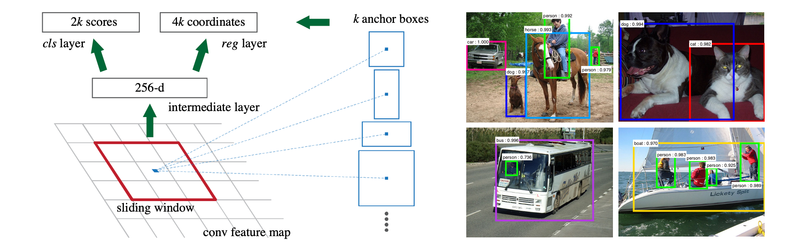
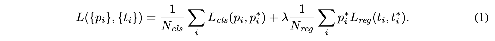
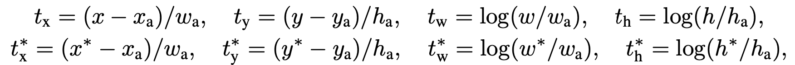
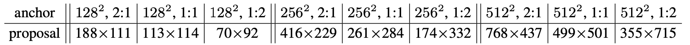
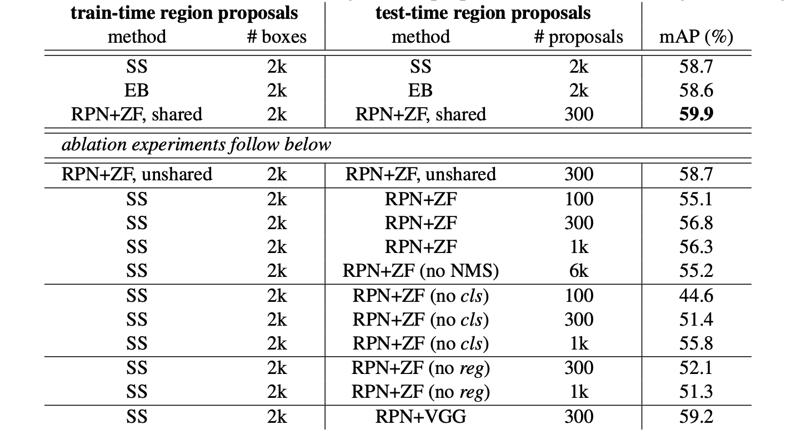
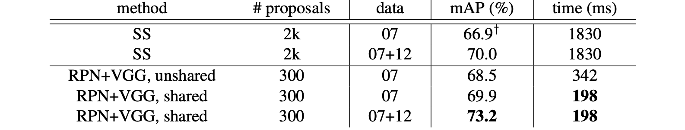
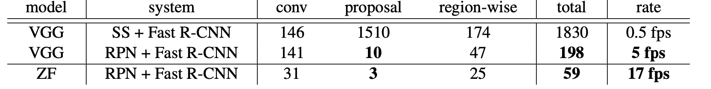
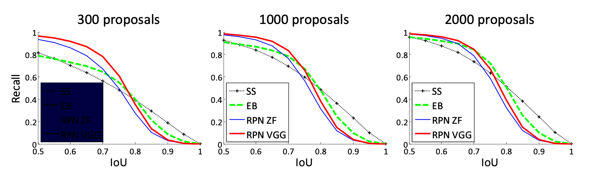
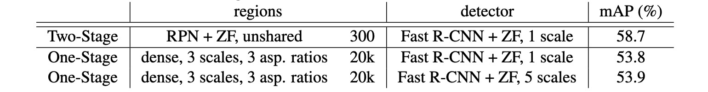

# Faster R-CNN: Towards Real-Time Object Detection with Region Proposal Networks

> Shaoqing Ren∗ Kaiming He Ross Girshick Jian Sun Microsoft Research fv-shren, kahe, rbg, jiansung@microsoft.com

## Abstract

最先进的对象检测网络依赖于区域proposal算法来假设对象位置。 SPPnet [7] 和 Fast R-CNN [5] 等进步减少了这些检测网络的运行时间，将区域proposal计算暴露为瓶颈。在这项工作中，我们引入了一个区域proposal网络（RPN），它与检测网络共享全图像卷积特征，从而实现几乎免费的区域proposal。 RPN 是一个全卷积网络，可同时预测每个位置的对象边界和对象分数。 RPN 被端到端训练以生成高质量的区域proposal，Fast R-CNN 使用这些proposal进行检测。通过简单的交替优化，可以训练 RPN 和 Fast R-CNN 共享卷积特征。对于非常深的 VGG-16 模型 [19]，我们的检测系统在 GPU 上的帧速率为 5fps（包括所有步骤），同时在 PASCAL VOC 2007 上实现了最先进的目标检测精度（73.2% mAP ) 和 2012 (70.4% mAP) 每张图像使用 300 个proposal。代码在https://github.com/ShaoqingRen/faster_rcnn。

>State-of-the-art object detection networks depend on region proposal algorithms to hypothesize object locations. Advances like SPPnet [7] and Fast R-CNN [5] have reduced the running time of these detection networks, exposing region pro- posal computation as a bottleneck. In this work, we introduce a Region Pro- posal Network (RPN) that shares full-image convolutional features with the de- tection network, thus enabling nearly cost-free region proposals. An RPN is a fully-convolutional network that simultaneously predicts object bounds and ob- jectness scores at each position. RPNs are trained end-to-end to generate high- quality region proposals, which are used by Fast R-CNN for detection. With a simple alternating optimization, RPN and Fast R-CNN can be trained to share convolutional features. For the very deep VGG-16 model [19], our detection system has a frame rate of 5fps (including all steps) on a GPU, while achieving state-of-the-art object detection accuracy on PASCAL VOC 2007 (73.2% mAP) and 2012 (70.4% mAP) using 300 proposals per image. Code is available at https://github.com/ShaoqingRen/faster_rcnn.

## 1 Introduction

目标检测的最新进展是由区域proposal方法（例如 [22]）和基于区域的卷积神经网络（R-CNN）[6] 的成功推动的。尽管最初在 [6] 中开发的基于区域的 CNN 在计算上是昂贵的，但由于在proposal [7, 5] 之间共享卷积，它们的成本已大大降低。最新的版本 Fast R-CNN [5] 在忽略区域proposal所花费的时间时，使用非常深的网络 [19] 实现了接近实时的速率。现在，proposal是最先进检测系统中的计算瓶颈。

>Recent advances in object detection are driven by the success of region proposal methods (e.g., [22]) and region-based convolutional neural networks (R-CNNs) [6]. Although region-based CNNs were computationally expensive as originally developed in [6], their cost has been drastically reduced thanks to sharing convolutions across proposals [7, 5]. The latest incarnation, Fast R-CNN [5], achieves near real-time rates using very deep networks [19], when ignoring the time spent on region proposals. Now, proposals are the computational bottleneck in state-of-the-art detection systems.

区域proposal方法通常依赖于廉价的特征和廉价的推理方案。选择性搜索 (SS) [22] 是最流行的方法之一，它基于工程化的低级特征贪婪地合并超像素。然而，与高效的检测网络 [5] 相比，选择性搜索要慢一个数量级，在 CPU 实现中为每张图像 2 秒。 EdgeBoxes [24] 目前在proposal质量和速度之间提供了最佳权衡，每张图像 0.2 秒。尽管如此，区域proposal步骤仍然消耗与检测网络一样多的运行时间。

>Region proposal methods typically rely on inexpensive features and economical inference schemes. Selective Search (SS) [22], one of the most popular methods, greedily merges superpixels based on engineered low-level features. Yet when compared to efficient detection networks [5], Selective Search is an order of magnitude slower, at 2s per image in a CPU implementation. EdgeBoxes [24] currently provides the best tradeoff between proposal quality and speed, at 0.2s per image. Nevertheless, the region proposal step still consumes as much running time as the detection network.

有人可能会注意到，基于区域的快速 CNN 利用 GPU，而研究中使用的区域proposal方法是在 CPU 上实现的，这使得这种运行时比较不公平。加速proposal计算的一个明显方法是为 GPU 重新实现它。这可能是一种有效的工程解决方案，但重新实现忽略了下游检测网络，因此错过了共享计算的重要机会。

>One may note that fast region-based CNNs take advantage of GPUs, while the region proposal meth- ods used in research are implemented on the CPU, making such runtime comparisons inequitable. An obvious way to accelerate proposal computation is to re-implement it for the GPU. This may be an effective engineering solution, but re-implementation ignores the down-stream detection network and therefore misses important opportunities for sharing computation.

在这篇论文中，我们展示了算法的改变——用深度网络计算proposal——导致了一个优雅而有效的解决方案，其中proposal计算几乎是免费的，因为检测网络的计算。为此，我们引入了新的区域proposal网络 (RPN)，它与最先进的目标检测网络共享卷积层 [7, 5]。通过在测试时共享卷积，计算proposal的边际成本很小（例如，每张图像 10 毫秒）。

>In this paper, we show that an algorithmic change—computing proposals with a deep net—leads to an elegant and effective solution, where proposal computation is nearly cost-free given the detection network’s computation. To this end, we introduce novel Region Proposal Networks (RPNs) that share convolutional layers with state-of-the-art object detection networks [7, 5]. By sharing convolutions at test-time, the marginal cost for computing proposals is small (e.g., 10ms per image).

我们的观察是，基于区域的检测器（如 Fast R-CNN）使用的卷积（conv）特征图也可用于生成区域proposal。在这些 conv 特征之上，我们通过添加两个额外的 conv 层来构建 RPN：一个将每个 conv map 位置编码为一个短的（例如，256-d）特征向量，另一个在每个 conv map 位置输出一个 objectness k 区域proposal相对于该位置的各种比例和纵横比的得分和回归边界（k = 9 典型值）。

>Our observation is that the convolutional (conv) feature maps used by region-based detectors, like Fast R-CNN, can also be used for generating region proposals. On top of these conv features, we construct RPNs by adding two additional conv layers: one that encodes each conv map position into a short (e.g., 256-d) feature vector and a second that, at each conv map position, outputs an objectness score and regressed bounds for k region proposals relative to various scales and aspect ratios at that location (k =9isatypical value).

因此，我们的 RPN 是一种全卷积网络（FCN）[14]，它们可以针对生成检测proposal的任务进行端到端的训练。为了将 RPN 与 Fast R-CNN [5] 对象检测网络统一起来，我们提出了一种简单的训练方案，该方案在区域proposal任务的微调和目标检测的微调之间交替，同时保持proposal固定。该方案快速收敛并产生一个统一的网络，具有在两个任务之间共享的转换特征。

>Our RPNs are thus a kind of fully-convolutional network (FCN) [14] and they can be trained end-to- end specifically for the task for generating detection proposals. To unify RPNs with Fast R-CNN [5] object detection networks, we propose a simple training scheme that alternates between fine-tuning for the region proposal task and then fine-tuning for object detection, while keeping the proposals fixed. This scheme converges quickly and produces a unified network with conv features that are shared between both tasks.

我们在 PASCAL VOC 检测基准 [4] 上评估我们的方法，其中使用 Fast R-CNN 的 RPN 产生的检测精度优于使用 Fast R-CNN 的选择性搜索的强基线。同时，我们的方法在测试时几乎免除了 SS 的所有计算负担——proposal的有效运行时间仅为 10 毫秒。使用 [19] 的昂贵的非常深的模型，我们的检测方法在 GPU 上仍然具有 5fps（包括所有步骤）的帧速率，因此在速度和准确度方面都是一个实用的目标检测系统（73.2% mAP on PASCAL VOC 2007 和 2012 年的 70.4% mAP）。代码在 https://github.com/ShaoqingRen/faster_rcnn。

>We evaluate our method on the PASCAL VOC detection benchmarks [4], where RPNs with Fast R-CNNs produce detection accuracy better than the strong baseline of Selective Search with Fast R-CNNs. Meanwhile, our method waives nearly all computational burdens of SS at test-time—the effective running time for proposals is just 10 milliseconds. Using the expensive very deep models of [19], our detection method still has a frame rate of 5fps (including all steps) on a GPU, and thus is a practical object detection system in terms of both speed and accuracy (73.2% mAP on PASCAL VOC 2007 and 70.4% mAP on 2012). Code is available at https://github.com/ShaoqingRen/faster_rcnn.

## 2 Related Work

最近的几篇论文提出了使用深度网络来定位特定类别或与类别无关的边界框的方法 [21、18、3、20]。在 OverFeat 方法 [18] 中，训练一个全连接 (fc) 层来预测假设单个对象的定位任务的框坐标。然后将 fc 层转换为用于检测多个特定于类的对象的 conv 层。 MultiBox 方法 [3, 20] 从网络生成区域proposal，该网络的最后一个 fc 层同时预测多个（例如，800 个）框，用于 R-CNN [6] 对象检测。他们的proposal网络应用于单个图像或多个大图像裁剪（例如，224 224）[20]。我们稍后会在我们的方法的上下文中更深入地讨论 OverFeat 和 MultiBox。

>Several recent papers have proposed ways of using deep networks for locating class-specific or class- agnostic bounding boxes [21, 18, 3, 20]. In the OverFeat method [18], a fully-connected (fc) layer is trained to predict the box coordinates for the localization task that assumes a single object. The fc layer is then turned into a conv layer for detecting multiple class-specific objects. The Multi- Box methods [3, 20] generate region proposals from a network whose last fc layer simultaneously predicts multiple (e.g., 800) boxes, which are used for R-CNN [6] object detection. Their proposal network is applied on a single image or multiple large image crops (e.g., 224224) [20]. We discuss OverFeat and MultiBox in more depth later in context with our method.

卷积的共享计算 [18, 7, 2, 5] 已经吸引了越来越多的关注，以实现高效但准确的视觉识别。 OverFeat 论文 [18] 从图像金字塔计算卷积特征，用于分类、定位和检测。为有效的基于区域的对象检测 [7, 16] 和语义分割 [2]，提出了共享卷积特征图上的自适应大小池 (SPP) [7]。 Fast R-CNN [5] 支持对共享卷积特征进行端到端检测器训练，并显示出令人信服的准确性和速度。

>Shared computation of convolutions [18, 7, 2, 5] has been attracting increasing attention for effi- cient, yet accurate, visual recognition. The OverFeat paper [18] computes conv features from an image pyramid for classification, localization, and detection. Adaptively-sized pooling (SPP) [7] on shared conv feature maps is proposed for efficient region-based object detection [7, 16] and semantic segmentation [2]. Fast R-CNN [5] enables end-to-end detector training on shared conv features and shows compelling accuracy and speed.

## 3 Region Proposal Networks

区域proposal网络 (RPN) 将图像（任意大小）作为输入，并输出一组矩形对象proposal，每个proposal都有一个目标分数。1 我们使用全卷积网络 [14] 对这个过程进行建模，我们将其描述为在这个部分。因为我们的最终目标是与 Fast R-CNN 对象检测网络 [5] 共享计算，我们假设两个网络共享一组共同的卷积层。在我们的实验中，我们研究了具有 5 个可共享卷积层的 Zeiler 和 Fergus 模型 [23] (ZF) 以及具有 13 个可共享卷积层的 Simonyan 和 Zisserman 模型 [19] (VGG)。

>A Region Proposal Network (RPN) takes an image (of any size) as input and outputs a set of rectangular object proposals, each with an objectness score.1 We model this process with a fully- convolutional network [14], which we describe in this section. Because our ultimate goal is to share computation with a Fast R-CNN object detection network [5], we assume that both nets share a common set of conv layers. In our experiments, we investigate the Zeiler and Fergus model [23] (ZF), which has 5 shareable conv layers and the Simonyan and Zisserman model [19] (VGG), which has 13 shareable conv layers.

为了生成区域proposal，我们在最后一个共享卷积层输出的卷积特征图上滑动一个小型网络。该网络完全连接到输入 conv 的 n 个空间窗口的特征图。每个滑动窗口都映射到一个低维向量（ZF 为 256-d，VGG 为 512-d）。这个向量被输入两个同级全连接层——一个检测框回归层（reg）和一个检测框分类层（cls）。我们在本文中使用 n = 3，注意输入图像上的有效感受野很大（ZF 和 VGG 分别为 171 和 228 像素）。这个迷你网络在图 1（左）中的一个位置进行了说明。请注意，由于迷你网络以滑动窗口方式运行，因此全连接层在所有空间位置之间共享。这个架构自然是用一个 n x n conv 层，跟着两个同级的 1 x 1conv 层（分别用于 reg 和 cls）来实现的。 ReLUs [15] 应用于n x n conv 层的输出。

>To generate region proposals, we slide a small network over the conv feature map output by the last shared conv layer. This network is fully connected to an nnspatial window of the input conv feature map. Each sliding window is mapped to a lower-dimensional vector (256-d for ZF and 512-d for VGG). This vector is fed into two sibling fully-connected layers—a box-regression layer (reg) and a box-classification layer (cls). We use n = 3 in this paper, noting that the effective receptive field on the input image is large (171 and 228 pixels for ZF and VGG, respectively). This mini- network is illustrated at a single position in Fig. 1 (left). Note that because the mini-network operates in a sliding-window fashion, the fully-connected layers are shared across all spatial locations. This architecture is naturally implemented with an nnconv layer followed by two sibling 11conv layers (for reg and cls, respectively). ReLUs [15] are applied to the output of the nnconv layer.

图 1：左：区域proposal网络 (RPN)。右图：在 PASCAL VOC 2007 测试中使用 RPN proposal的示例检测。我们的方法检测各种尺度和纵横比的对象。

>Figure 1: Left: Region Proposal Network (RPN). Right: Example detections using RPN proposals on PASCAL VOC 2007 test. Our method detects objects in a wide range of scales and aspect ratios.

### Translation-Invariant Anchors

在每个滑动窗口位置，我们同时预测 k 个区域proposal，因此 reg 层有 4k 个输出编码 k 个框的坐标。 cls 层输出 2k 个分数，用于估计每个proposal的对象/非对象概率。 k 个proposal相对于 k 个参考框（称为锚点（*anchors*））进行参数化。每个锚点都以所讨论的滑动窗口为中心，并与比例和纵横比相关联。我们使用 3 个尺度和 3 个纵横比，在每个滑动位置产生 k =9 个锚点。对于大小为 W x H（通常为 2,400）的 conv 特征图，总共有 WHk 个锚点。我们的方法的一个重要特性是它是平移不变的，无论是就锚点和计算相对于锚点的proposal的函数而言。

>At each sliding-window location, we simultaneously predict k region proposals, so the reg layer has 4k outputs encoding the coordinates of k boxes. The cls layer outputs 2k scores that estimate probability of object / not-object for each proposal.2 The k proposals are parameterized relative to k reference boxes, called anchors. Each anchor is centered at the sliding window in question, and is associated with a scale and aspect ratio. We use 3 scales and 3 aspect ratios, yielding k =9anchors at each sliding position. For a conv feature map of a size WH(typically 2,400), there are WHk anchors in total. An important property of our approach is that it is translation invariant, both in terms of the anchors and the functions that compute proposals relative to the anchors.

作为比较，MultiBox 方法 [20] 使用 k-means 生成 800 个锚点，这些锚点不是平移不变的。如果转变图像中的对象，则proposal应该以相同的函数转变，并且应该能够预测任一位置的proposal。此外，由于 MultiBox 锚不是平移不变的，它需要 (4+1) x800 维输出层，而我们的方法需要 (4+2)x9 维输出层。我们的proposal层的参数少了一个数量级（使用 GoogLeNet [20] 的 MultiBox 为 2700 万，使用 VGG-16 的 RPN 为 240 万），因此在 PASCAL VOC 等小型数据集上过拟合的风险更小。

>As a comparison, the MultiBox method [20] uses k-means to generate 800 anchors, which are not translation invariant. If one translates an object in an image, the proposal should translate and the same function should be able to predict the proposal in either location. Moreover, because the MultiBox anchors are not translation invariant, it requires a (4+1)800-dimensional output layer, whereas our method requires a (4+2)9-dimensional output layer. Our proposal layers have an order of magnitude fewer parameters (27 million for MultiBox using GoogLeNet [20] vs. 2.4 million for RPN using VGG-16), and thus have less risk of overfitting on small datasets, like PASCAL VOC.

### A Loss Function for Learning Region Proposals

为了训练 RPN，我们为每个锚点分配一个二进制类标签（是否为对象）。我们将正标签分配给两种锚：（i）具有与ground-truth框重叠最高 Intersection-over-Union（IoU）的 单个或多个锚 ，或（ii） 与任何ground-truth框IoU 重叠高于0.7的。请注意，单个ground-truth框可能会将正标签分配给多个锚点。如果一个锚与所有ground-truth框的 IoU 比率低于 0.3，我们将负标签分配给它。既不是正面也不是负面的锚对训练目标没有贡献。

>For training RPNs, we assign a binary class label (of being an object or not) to each anchor. We assign a positive label to two kinds of anchors: (i) the anchor/anchors with the highest Intersection- over-Union (IoU) overlap with a ground-truth box, or (ii) an anchor that has an IoU overlap higher than 0.7 with any ground-truth box. Note that a single ground-truth box may assign positive labels to multiple anchors. We assign a negative label to a non-positive anchor if its IoU ratio is lower than 0.3 for all ground-truth boxes. Anchors that are neither positive nor negative do not contribute to the training objective.

通过这些定义，我们在 Fast R-CNN [5] 中的多任务损失之后最小化了目标函数。我们对图像的损失函数定义为：

>With these definitions, we minimize an objective function following the multi-task loss in Fast R- CNN [5]. Our loss function for an image is defined as:

其中，i是一个小批量数据中锚点的索引，

是锚点i作为目标的预测概率。如果锚点为正，ground-truth标签

为1，如果锚点为负，则为0。

是表示预测边界框4个参数化坐标的向量，而

是与正锚点相关的ground-truth边界框的向量。分类损失

是两个类别上（目标或不是目标）的对数损失。对于回归损失，我们使用
=R\left(t_{i}-t_{i}^{*}\right))
，其中R是在[2]中定义的鲁棒损失函数（平滑L1）。

项表示回归损失仅对于正锚点激活
)
，否则被禁用
)
。*cls*和*reg*层的输出分别由

和

组成。这两项由

和

归一化，并用λ进行平衡权重。

> Here, i is the index of an anchor in a mini-batch and pipi is the predicted probability of anchor ii being an object. The ground-truth label p∗ipi∗ is 1 if the anchor is positive, and is 0 if the anchor is negative. titi is a vector representing the 4 parameterized coordinates of the predicted bounding box, and t∗iti∗ is that of the ground-truth box associated with a positive anchor. The classification loss LclsLcls is log loss over two classes (object vs not object). For the regression loss, we use Lreg(ti,t∗i)=R(ti−t∗i)Lreg(ti,ti∗)=R(ti−ti∗) where RR is the robust loss function (smooth L1L1) defined in [2]. The term p∗iLregpi∗Lreg means the regression loss is activated only for positive anchors (p∗i=1pi∗=1) and is disabled otherwise (p∗i=0pi∗=0). The outputs of the *cls* and *reg* layers consist of pipi and titi respectively.The two terms are normalized with Ncls and Nreg , and a balancing weight λ.3

对于回归，我们参考[6]采用4个坐标的参数化：

> For regression, we adopt the parameterizations of the 4 coordinates following [6]:

其中 x、y、w 和 h 表示检测框中心、宽度和高度的两个坐标。变量 x、

 和 

 分别用于预测框、锚框和ground-truth框（对于 y，w，h 也是如此）。这可以被认为是从锚框到附近的ground-truth框的边界框回归。

>where x, y, w, and h denote the two coordinates of the box center, width, and height. Variables x, xa, and x are for the predicted box, anchor box, and ground-truth box respectively (likewise for y; w; h). This can be thought of as bounding-box regression from an anchor box to a nearby ground-truth box.

尽管如此，我们的方法通过与以前基于特征图的方法不同的方式实现边界框回归 [7, 5]。在 [7, 5] 中，边界框回归是对从任意大小区域pooling的特征执行的，并且回归权重由所有区域大小共享。在我们的公式中，用于回归的特征在特征图上具有相同的空间大小 (n x n)。为了考虑不同的大小，学习了一组 k 个边界框回归器。每个回归器负责一个尺度和一个纵横比，k 个回归器不共享权重。因此，即使特征图具有固定的大小/比例，但仍然可以预测各种大小的框。

>Nevertheless, our method achieves bounding-box regression by a different manner from previous feature-map-based methods [7, 5]. In [7, 5], bounding-box regression is performed on features pooled from arbitrarily sized regions, and the regression weights are shared by all region sizes. In our formulation, the features used for regression are of the same spatial size (n n) on the feature maps. To account for varying sizes, a set of k bounding-box regressors are learned. Each regressor is responsible for one scale and one aspect ratio, and the k regressors do not share weights. As such, it is still possible to predict boxes of various sizes even though the features are of a fixed size/scale.

### Optimization

RPN 自然地实现为全卷积网络 [14]，可以通过反向传播和随机梯度下降 (SGD) [12] 进行端到端训练。我们遵循 [5] 中的“以图像为中心”的采样策略来训练这个网络。每个小批量都来自包含许多正负锚的单个图像。可以优化所有锚点的损失函数，但这会偏向负样本，因为它们占主导地位。相反，我们在图像中随机采样 256 个锚点来计算小批量的损失函数，其中采样的正负锚点的比率为 1:1。如果图像中的正样本少于 128 个，我们用负样本填充小批量。

>The RPN, which is naturally implemented as a fully-convolutional network [14], can be trained end-to-end by back-propagation and stochastic gradient descent (SGD) [12]. We follow the “image- centric” sampling strategy from [5] to train this network. Each mini-batch arises from a single image that contains many positive and negative anchors. It is possible to optimize for the loss functions of all anchors, but this will bias towards negative samples as they are dominate. Instead, we randomly sample 256 anchors in an image to compute the loss function of a mini-batch, where the sampled positive and negative anchors have a ratio of up to 1:1. If there are fewer than 128 positive samples in an image, we pad the mini-batch with negative ones.

我们通过从标准差为 0.01 的零均值高斯分布中绘制权重来随机初始化所有新层。所有其他层（即共享的卷积层）都是通过预训练 ImageNet 分类模型 [17] 来初始化的，这是标准做法 [6]。我们训练ZF 网络的所有层，而 VGG 网络训练 conv3_1 及以上的层以节省内存 [5]。对于 PASCAL 数据集上的 60k 小批量，我们使用 0.001 的学习率，对于接下来的 20k 小批量使用 0.0001。我们还使用 0.9 的动量和 0.0005 的权重衰减 [11]。我们的实现使用 Caffe [10]。

>We randomly initialize all new layers by drawing weights from a zero-mean Gaussian distribution with standard deviation 0.01. All other layers (i.e., the shared conv layers) are initialized by pre- training a model for ImageNet classification [17], as is standard practice [6]. We tune all layers of the ZF net, and conv3 1 and up for the VGG net to conserve memory [5]. We use a learning rate of 0.001 for 60k mini-batches, and 0.0001 for the next 20k mini-batches on the PASCAL dataset. We also use a momentum of 0.9 and a weight decay of 0.0005 [11]. Our implementation uses Caffe [10].

### Sharing Convolutional Features for Region Proposal and Object Detection

到目前为止，我们已经描述了如何训练网络以生成区域proposal，而没有考虑将利用这些proposal的基于区域的对象检测 CNN。对于检测网络，我们采用 Fast R-CNN [5]4，现在描述一种学习 RPN 和 Fast R-CNN 之间共享的卷积层的算法。

>Thus far we have described how to train a network for region proposal generation, without con- sidering the region-based object detection CNN that will utilize these proposals. For the detection network, we adopt Fast R-CNN [5]4 and now describe an algorithm that learns conv layers that are shared between the RPN and Fast R-CNN.

独立训练的 RPN 和 Fast R-CNN 都会以不同的方式修改它们的卷积层。因此，我们需要开发一种技术，允许在两个网络之间共享卷积层，而不是学习两个单独的网络。请注意，这并不像简单地定义一个包含 RPN 和 Fast R-CNN 的网络，然后与反向传播联合优化它那么简单。原因是 Fast R-CNN 训练依赖于固定目标proposal，如果在学习 Fast R-CNN 的同时改变proposal机制，它是事先不知道的。虽然这种联合优化是未来工作的一个有趣问题，但我们开发了一种实用的 4 步训练算法，通过交替优化来学习共享特征。

>Both RPN and Fast R-CNN, trained independently, will modify their conv layers in different ways. We therefore need to develop a technique that allows for sharing conv layers between the two net- works, rather than learning two separate networks. Note that this is not as easy as simply defining a single network that includes both RPN and Fast R-CNN, and then optimizing it jointly with back- propagation. The reason is that Fast R-CNN training depends on fixed object proposals and it is not clear a priori if learning Fast R-CNN while simultaneously changing the proposal mechanism will converge. While this joint optimizing is an interesting question for future work, we develop a pragmatic 4-step training algorithm to learn shared features via alternating optimization.

第一步，我们如上所述训练 RPN。该网络使用 ImageNet 预训练模型进行初始化，并针对区域proposal任务进行端到端微调。在第二步中，我们使用由第一步 RPN 生成的proposal，通过 Fast R-CNN 训练一个单独的检测网络。该检测网络也由 ImageNet 预训练模型初始化。此时两个网络不共享卷积层。在第三步中，我们使用检测器网络来初始化 RPN 训练，但是我们固定了共享的卷积层，并且只微调了 RPN 特有的层。现在这两个网络共享卷积层。最后，保持共享的 conv 层固定，我们微调 Fast R-CNN 的 fc 层。因此，两个网络共享相同的卷积层并形成一个统一的网络。

>In the first step, we train the RPN as described above. This network is initialized with an ImageNet- pre-trained model and fine-tuned end-to-end for the region proposal task. In the second step, we train a separate detection network by Fast R-CNN using the proposals generated by the step-1 RPN. This detection network is also initialized by the ImageNet-pre-trained model. At this point the two networks do not share conv layers. In the third step, we use the detector network to initialize RPN training, but we fix the shared conv layers and only fine-tune the layers unique to RPN. Now the two networks share conv layers. Finally, keeping the shared conv layers fixed, we fine-tune the fc layers of the Fast R-CNN. As such, both networks share the same conv layers and form a unified network.

### Implementation Details

我们在单尺度图像上训练和测试区域proposal和目标检测网络 [7, 5]。我们重新缩放图像，使其短边为 s = 600 像素 [5]。多尺度特征提取可以提高准确性，但没有表现出良好的速度-准确性权衡[5]。我们还注意到，对于 ZF 和 VGG 网络，最后一个 conv 层的总步幅在重新缩放的图像上是 16 个像素，因此在典型的 PASCAL 图像上是 10 个像素（～500x375）。即使如此大的步幅也能提供良好的结果，但更小的步幅可能会进一步提高准确性。

>We train and test both region proposal and object detection networks on single-scale images [7, 5]. We re-scale the images such that their shorter side is s = 600 pixels [5]. Multi-scale feature extraction may improve accuracy but does not exhibit a good speed-accuracy trade-off [5]. We also note that for ZF and VGG nets, the total stride on the last conv layer is 16 pixels on the re-scaled image, and thus is 10 pixels on a typical PASCAL image (500375). Even such a large stride provides good results, though accuracy may be further improved with a smaller stride.

对于锚点，我们使用 3 个比例尺，框面积分别为 

、

 和 

 像素，以及 1:1、1:2 和 2:1 的 3 个纵横比。我们注意到，我们的算法在预测大型proposal时允许使用大于底层感受野的锚框。这样的预测并非不可能——如果只有物体的中间可见，人们仍然可以粗略地推断出物体的范围。通过这种设计，我们的解决方案不需要多尺度特征或多尺度滑动窗口来预测大区域，从而节省了大量的运行时间。图 1（右）显示了我们的方法在各种尺度和纵横比下的能力。下表显示了使用 ZF 网络为每个锚点学习到的平均proposal大小（短边s=600）。

>For anchors, we use 3 scales with box areas of 1282, 2562, and 5122 pixels, and 3 aspect ratios of 1:1, 1:2, and 2:1. We note that our algorithm allows the use of anchor boxes that are larger than the underlying receptive field when predicting large proposals. Such predictions are not impossible— one may still roughly infer the extent of an object if only the middle of the object is visible. With this design, our solution does not need multi-scale features or multi-scale sliding windows to predict large regions, saving considerable running time. Fig. 1 (right) shows the capability of our method for a wide range of scales and aspect ratios. The table below shows the learned average proposal size for each anchor using the ZF net (numbers for s=600).

需要小心处理跨越图像边界的锚框。在训练期间，我们忽略了所有跨界锚点，因此它们不会导致损失。对于典型的 1000x600 图像，总共将有大约 20k ( ≈60 x 40 x 9)个锚点。在忽略跨界锚点的情况下，每张图像大约有 6k 个锚点用于训练。如果在训练中不忽略跨越图像边界异常值，它们会在目标中引入大的、难以纠正的错误项，并且训练不会收敛。然而，在测试期间，我们仍然将全卷积 RPN 应用于整个图像。这可能会生成跨边界proposal框，我们将其裁剪到图像边界。

>The anchor boxes that cross image boundaries need to be handled with care. During training, we ignore all cross-boundary anchors so they do not contribute to the loss. For a typical 1000  600 image, there will be roughly 20k ( ≈60 x 40 x 9) anchors in total. With the cross-boundary anchors ignored, there are about 6k anchors per image for training. If the boundary-crossing outliers are not ignored in training, they introduce large, difficult to correct error terms in the objective, and training does not converge. During testing, however, we still apply the fully-convolutional RPN to the entire image. This may generate cross-boundary proposal boxes, which we clip to the image boundary.

一些 RPN proposal彼此高度重叠。为了减少冗余，我们根据它们的 cls 分数对proposal区域采用非最大抑制 (NMS)。我们将 NMS 的 IoU 阈值固定为 0.7，这样每张图像就有大约 2k 个proposal区域。正如我们将展示的，NMS 不会损害最终的检测精度，但会大大减少proposal的数量。在 NMS 之后，我们使用排名前 N 的proposal区域进行检测。在下文中，我们使用 2k RPN proposal训练 Fast R-CNN，但在测试时评估不同数量的proposal。

>Some RPN proposals highly overlap with each other. To reduce redundancy, we adopt non- maximum suppression (NMS) on the proposal regions based on their cls scores. We fix the IoU threshold for NMS at 0.7, which leaves us about 2k proposal regions per image. As we will show, NMS does not harm the ultimate detection accuracy, but substantially reduces the number of pro- posals. After NMS, we use the top-N ranked proposal regions for detection. In the following, we train Fast R-CNN using 2k RPN proposals, but evaluate different numbers of proposals at test-time.

## 4 Experiments

我们在 PASCAL VOC 2007 检测基准 [4] 上全面评估了我们的方法。该数据集由大约 5k 个训练图像和超过 20 个对象类别的 5k 个测试图像组成。我们还为一些模型提供了 PASCAL VOC 2012 基准测试的结果。对于 ImageNet 预训练网络，我们使用具有 5 个卷积层和 3 个 fc 层的 ZF 网络 [23] 的“快速”版本，以及具有 13 个卷积层和 3 个 fc 层的公共 VGG-16 模型 [19] .我们主要评估检测平均精度（mAP），因为这是对象检测的实际指标（而不是关注对象proposal代理指标）。

>We comprehensively evaluate our method on the PASCAL VOC 2007 detection benchmark [4]. This dataset consists of about 5k trainval images and 5k test images over 20 object categories. We also provide results in the PASCAL VOC 2012 benchmark for a few models. For the ImageNet pre-trained network, we use the “fast” version of ZF net [23] that has 5 conv layers and 3 fc layers, and the public VGG-16 model5 [19] that has 13 conv layers and 3 fc layers. We primarily evalu- ate detection mean Average Precision (mAP), because this is the actual metric for object detection (rather than focusing on object proposal proxy metrics).

表 1（顶部）显示了使用各种区域proposal方法进行训练和测试时的 Fast R-CNN 结果。这些结果使用 ZF 网络。对于选择性搜索（SS）[22]，我们通过“快速”模式提出生成大约 2k SS proposal。对于 EdgeBoxes (EB) [24]，我们通过调整为 0.7 IoU 的默认 EB 设置生成proposal。 SS 的 mAP 为 58.7%，EB 的 mAP 为 58.6%。带有 Fast R-CNN 的 RPN 取得了具有竞争力的结果，mAP 为 59.9%，同时使用了多达 300 个proposal。由于共享卷积计算，使用 RPN 产生比使用 SS 或 EB 更快的检测系统；较少的proposal也降低了区域方面的 fc 成本。接下来，我们考虑 RPN 的几种消融，然后表明使用非常深的网络时proposal质量会有所提高。

>Table 1 (top) shows Fast R-CNN results when trained and tested using various region proposal methods. These results use the ZF net. For Selective Search (SS) [22], we generate about 2k SS proposals by the “fast” mode. For EdgeBoxes (EB) [24], we generate the proposals by the default EB setting tuned for 0.7 IoU. SS has an mAP of 58.7% and EB has an mAP of 58.6%. RPN with Fast R-CNN achieves competitive results, with an mAP of 59.9% while using up to 300 proposals6. Using RPN yields a much faster detection system than using either SS or EB because of shared conv computations; the fewer proposals also reduce the region-wise fc cost. Next, we consider several ablations of RPN and then show that proposal quality improves when using the very deep network.

表1: 对PASCAL VOC 2007测试集的检测结果（在VOC 2007的训练值上训练）。检测器是带有ZF的Fast R-CNN，但在训练和测试中使用了不同的proposal方法。

> Table 1: Detection results on PASCAL VOC 2007 test set (trained on VOC 2007 trainval). The detectors are Fast R-CNN with ZF, but using various proposal methods for training and testing.

**消融实验**。为了研究 RPNs 作为proposal方法的行为，我们进行了几项消融研究。首先，我们展示了在 RPN 和 Fast R-CNN 检测网络之间共享卷积层的效果。为此，我们在 4 步训练过程的第二步之后停止。使用单独的网络会将结果略微降低到 58.7%（RPN+ZF，未共享，表 1）。我们观察到这是因为在第三步中，当检测器调整的特征用于微调 RPN 时，proposal质量得到了提高。

>**Ablation Experiments.** To investigate the behavior of RPNs as a proposal method, we conducted several ablation studies. First, we show the effect of sharing conv layers between the RPN and Fast R-CNN detection network. To do this, we stop after the second step in the 4-step training process. Using separate networks reduces the result slightly to 58.7% (RPN+ZF, unshared, Table 1). We observe that this is because in the third step when the detector-tuned features are used to fine-tune the RPN, the proposal quality is improved.

接下来，我们理出 RPN 对训练 Fast R-CNN 检测网络的影响。为此，我们使用 2k SS proposal和 ZF 网络训练了一个 Fast R-CNN 模型。我们固定这个检测器，并通过更改测试时使用的proposal区域来评估检测 mAP。在这些消融实验中，RPN 不与检测器共享特征。

>Next, we disentangle the RPN’s influence on training the Fast R-CNN detection network. For this purpose, we train a Fast R-CNN model by using the 2k SS proposals and ZF net. We fix this detector and evaluate the detection mAP by changing the proposal regions used at test-time. In these ablation experiments, the RPN does not share features with the detector.

在测试时用 300 个 RPN proposal替换 SS 会导致 56.8% 的 mAP。 mAP 的损失是由于训练/测试proposal之间的不一致。该结果可作为以下比较的基线。

>Replacing SS with 300 RPN proposals at test-time leads to an mAP of 56.8%. The loss in mAP is because of the inconsistency between the training/testing proposals. This result serves as the baseline for the following comparisons.

有点令人惊讶的是，在测试时使用排名靠前的 100 个proposal时，RPN 仍然会产生有竞争力的结果（55.1%），这表明排名靠前的 RPN proposal是准确的。在另一个极端，使用排名靠前的 6k RPN proposal（没有 NMS）具有相当的 mAP（55.2%），这表明 NMS 不会损害检测 mAP，并且可以减少误报。

>Somewhat surprisingly, the RPN still leads to a competitive result (55.1%) when using the top- ranked 100 proposals at test-time, indicating that the top-ranked RPN proposals are accurate. On the other extreme, using the top-ranked 6k RPN proposals (without NMS) has a comparable mAP (55.2%), suggesting NMS does not harm the detection mAP and may reduce false alarms.

接下来，我们通过在测试时关闭 RPN 的输出cls 和 reg 其中任何一个来分别研究其作用。当在测试时移除 cls 层（因此不使用 NMS/ranking）时，我们从未评分的区域中随机抽取 N 个proposal。当 N = 1k (55.8%) 时，mAP 几乎没有变化，但当 N = 100 时，mAP 大幅下降到 44.6%。这表明 cls 分数说明了排名最高的proposal的准确性。

>Next, we separately investigate the roles of RPN’s cls and reg outputs by turning off either of them at test-time. When the cls layer is removed at test-time (thus no NMS/ranking is used), we randomly sample N proposals from the unscored regions. The mAP is nearly unchanged with N = 1k (55.8%), but degrades considerably to 44.6% when N = 100. This shows that the cls scores account for the accuracy of the highest ranked proposals.

另一方面，当 reg 层在测试时被移除（因此proposal成为锚框），mAP 下降到 52.1%。这表明高质量的proposal主要是由于回归位置。仅锚框不足以进行准确检测。

>On the other hand, when the reg layer is removed at test-time (so the proposals become anchor boxes), the mAP drops to 52.1%. This suggests that the high-quality proposals are mainly due to regressed positions. The anchor boxes alone are not sufficient for accurate detection.

表2: 对PASCAL VOC 2007测试集的检测结果。检测器是Fast R-CNN和VGG- 16。训练数据。"07": VOC 2007训练值，"07+12"：VOC 2007训练值和VOC 2012训练值的联合集。对于RPN，Fast R-CNN的训练时间建议为2k。†：这是在[5]中报告的；使用本文提供的资源库，这个数字更高（六次运行中为68.0±0.3）。

> Table 2: Detection results on PASCAL VOC 2007 test set. The detector is Fast R-CNN and VGG- 16. Training data: “07”: VOC 2007 trainval, “07+12”: union set of VOC 2007 trainval and VOC 2012 trainval. For RPN, the train-time proposals for Fast R-CNN are 2k. †: this was reported in [5]; using the repository provided by this paper, this number is higher (68.0±0.3 in six runs).

表3：PASCAL VOC 2012测试集的检测结果。检测器是Fast R-CNN和VGG- 16。训练数据。"07": VOC 2007训练值，"07++12"：VOC 2007训练值+测试和VOC 2012训练值的联合集。对于RPN，Fast R-CNN的训练时间建议为2k。

> Table 3: Detection results on PASCAL VOC 2012 test set. The detector is Fast R-CNN and VGG- 16. Training data: “07”: VOC 2007 trainval, “07++12”: union set of VOC 2007 trainval+test and VOC 2012 trainval. For RPN, the train-time proposals for Fast R-CNN are 2k.

表4：在K40 GPU上的时间（毫秒），除了SS提案是在CPU上评估的。"区域性 "包括NMS、池化、fc和softmax。关于运行时间的分析，见我们发布的代码。

> Table 4: Timing (ms) on a K40 GPU, except SS proposal is evaluated in a CPU. “Region-wise” includes NMS, pooling, fc, and softmax. See our released code for the profiling of running time.

我们还评估了更强大的网络对 RPN proposal质量的影响。我们使用 VGG-16 训练 RPN，仍然使用上面的 SS+ZF 检测器。 mAP 从 56.8%（使用 RPN+ZF）提高到 59.2%（使用 RPN+VGG）。这是一个有希望的结果，因为它表明 RPN+VGG 的proposal质量优于 RPN+ZF。因为 RPN+ZF 的proposal与 SS 有竞争力（当一致用于训练和测试时，两者都是 58.7%），我们可以预期 RPN+VGG 比 SS 更好。以下实验证明了这一假设。

>We also evaluate the effects of more powerful networks on the proposal quality of RPN alone. We use VGG-16 to train the RPN, and still use the above detector of SS+ZF. The mAP improves from 56.8% (using RPN+ZF) to 59.2% (using RPN+VGG). This is a promising result, because it suggests that the proposal quality of RPN+VGG is better than that of RPN+ZF. Because proposals of RPN+ZF are competitive with SS (both are 58.7% when consistently used for training and testing), we may expect RPN+VGG to be better than SS. The following experiments justify this hypothesis.

**VGG-16的检测精度和运行时间**。表 2 显示了 VGG-16 在proposal和检测方面的结果。使用 RPN+VGG，Fast R-CNN 结果为非共享特征的 68.5%，略高于 SS 基线。如上图，这是因为RPN+VGG生成的proposals比SS更准确。与预定义的 SS 不同，RPN 经过积极训练并受益于更好的网络。对于特征共享变体，结果为 69.9%——优于强 SS 基线，但proposal几乎没有成本。按照 [5]，我们在 PASCAL VOC 2007 trainval 和 2012 trainval 的联合集上进一步训练 RPN 和检测网络。 mAP 为 73.2%。在 PASCAL VOC 2012 测试集（表 3）上，我们的方法在 VOC 2007 trainval+test 和 VOC 2012 trainval 的联合集上训练的 mAP 为 70.4%，遵循 [5]。

>**Detection Accuracy and Running Time of VGG-16.** Table 2 shows the results of VGG-16 for both proposal and detection. Using RPN+VGG, the Fast R-CNN result is 68.5% for unshared features, slightly higher than the SS baseline. As shown above, this is because the proposals generated by RPN+VGG are more accurate than SS. Unlike SS that is pre-defined, the RPN is actively trained and benefits from better networks. For the feature-shared variant, the result is 69.9%—better than the strong SS baseline, yet with nearly cost-free proposals. We further train the RPN and detection network on the union set of PASCAL VOC 2007 trainval and 2012 trainval, following [5]. The mAP is 73.2%. On the PASCAL VOC 2012 test set (Table 3), our method has an mAP of 70.4% trained on the union set of VOC 2007 trainval+test and VOC 2012 trainval, following [5].

在表 4 中，我们总结了整个目标检测系统的运行时间。 SS 需要 1-2 秒，具体取决于内容（平均 1.51 秒），使用 VGG-16 的 Fast R-CNN 在 2k SS proposal上需要 320 毫秒（如果在 fc 层上使用 SVD [5]，则需要 223 毫秒）。我们的 VGG-16 系统在proposal和检测方面总共花费了 198 毫秒。在共享卷积特征的情况下，仅 RPN 就只需要 10 毫秒来计算额外的层。由于proposal较少（300），我们的区域计算量也很低。我们的系统使用 ZF 网络的帧速率为 17 fps。

>In Table 4 we summarize the running time of the entire object detection system. SS takes 1-2 seconds depending on content (on average 1.51s), and Fast R-CNN with VGG-16 takes 320ms on 2k SS proposals (or 223ms if using SVD on fc layers [5]). Our system with VGG-16 takes in total 198ms for both proposal and detection. With the conv features shared, the RPN alone only takes 10ms computing the additional layers. Our region-wise computation is also low, thanks to fewer proposals (300). Our system has a frame-rate of 17 fps with the ZF net.

**Recall-to-IoU 分析**。接下来，我们使用 ground-truth 框计算不同 IoU 比率的proposal的召回率。值得注意的是，Recall-to-IoU 指标只是松散地 [9, 8, 1] 与最终检测精度相关。使用这个度量来诊断proposal方法比评估它更合适。

>**Analysis of Recall-to-IoU**. Next we compute the recall of proposals at different IoU ratios with ground-truth boxes. It is noteworthy that the Recall-to-IoU metric is just loosely [9, 8, 1] related to the ultimate detection accuracy. It is more appropriate to use this metric to diagnose the proposal method than to evaluate it.

> Figure 2: Recall *vs.* IoU overlap ratio on the PASCAL VOC 2007 test set.

表5：单阶段检测与两阶段proposal+检测。探测结果是在PASCAL VOC 2007测试集上使用ZF模型和Fast R-CNN。RPN使用非共享特征。

> Table 5: One-Stage Detection vs. Two-Stage Proposal + Detection. Detection results are on the PASCAL VOC 2007 test set using the ZF model and Fast R-CNN. RPN uses unshared features.

在图 2 中，我们展示了使用 300、1k 和 2k proposal的结果。我们与 SS 和 EB 进行比较，根据这些方法生成的置信度，N 个proposal是排名前 N 的proposal。图表显示，当proposal的数量从 2k 下降到 300 时，RPN 方法表现良好。这解释了为什么 RPN 在使用少至 300 个proposal时具有良好的最终检测 mAP。正如我们之前分析的那样，这个属性主要归因于 RPN 的 cls 项。当proposal较少时，SS 和 EB 的召回率比 RPN 下降得更快。

>In Fig. 2, we show the results of using 300, 1k, and 2k proposals. We compare with SS and EB, and the N proposals are the top-N ranked ones based on the confidence generated by these methods. The plots show that the RPN method behaves gracefully when the number of proposals drops from 2k to 300. This explains why the RPN has a good ultimate detection mAP when using as few as 300 proposals. As we analyzed before, this property is mainly attributed to the cls term of the RPN. The recall of SS and EB drops more quickly than RPN when the proposals are fewer.

**单阶段检测与两阶段proposal+检测** OverFeat [18]是在转换特征图上的滑动窗口上使用回归器和分类器的检测方法。 OverFeat 是一个单阶段、特定于类的检测管道，而我们的则是一个两阶段级联，由与类无关的proposal和特定于类的检测组成。在 OverFeat 中，区域特征来自比例金字塔上一个纵横比的滑动窗口。这些特征用于同时确定对象的位置和类别。在 RPN 中，特征来自方形 (3 3) 滑动窗口，并预测相对于具有不同比例和纵横比的锚点的proposal。虽然这两种方法都使用滑动窗口，但区域proposal任务只是 RPN + Fast R-CNN 的第一阶段——检测器会处理proposal以改进它们。在我们级联的第二阶段，区域特征从更忠实地覆盖区域特征的proposal框中自适应地pooling [7, 5]。我们相信这些特征会导致更准确的检测。

>**One-Stage Detection vs. Two-Stage Proposal + Detection**. The OverFeat paper [18] proposes a detection method that uses regressors and classifiers on sliding windows over conv feature maps. OverFeat is a one-stage, class-specific detection pipeline, and ours is a two-stage cascade consisting of class-agnostic proposals and class-specific detections. In OverFeat, the region-wise features come from a sliding window of one aspect ratio over a scale pyramid. These features are used to simulta- neously determine the location and category of objects. In RPN, the features are from square (33) sliding windows and predict proposals relative to anchors with different scales and aspect ratios. Though both methods use sliding windows, the region proposal task is only the first stage of RPN + Fast R-CNN—the detector attends to the proposals to refine them. In the second stage of our cas- cade, the region-wise features are adaptively pooled [7, 5] from proposal boxes that more faithfully cover the features of the regions. We believe these features lead to more accurate detections.

为了比较一阶段和两阶段系统，我们通过一阶段 Fast R-CNN 模拟 OverFeat 系统（因此也规避了实现细节的其他差异）。在这个系统中，“proposal”是 3 个尺度（128、256、512）和 3 个纵横比（1:1、1:2、2:1）的密集滑动窗口。 Fast R-CNN 被训练来预测特定类别的分数并从这些滑动窗口中回归框位置。因为 OverFeat 系统使用图像金字塔，我们也使用从 5 个尺度中提取的卷积特征进行评估。我们使用 [7, 5] 中的这 5 个尺度。

>To compare the one-stage and two-stage systems, we emulate the OverFeat system (and thus also circumvent other differences of implementation details) by one-stage Fast R-CNN. In this system, the “proposals” are dense sliding windows of 3 scales (128, 256, 512) and 3 aspect ratios (1:1, 1:2, 2:1). Fast R-CNN is trained to predict class-specific scores and regress box locations from these sliding windows. Because the OverFeat system uses an image pyramid, we also evaluate using conv features extracted from 5 scales. We use those 5 scales as in [7, 5].

表 5 比较了两级系统和两级系统的两种变体。使用 ZF 模型，一阶段系统的 mAP 为 53.9%。这比两级系统 (58.7%) 低 4.8%。该实验证明了级联区域proposal和对象检测的有效性。 [5, 13] 中报告了类似的观察结果，其中用滑动窗口替换 SS 区域proposal会导致两篇论文的性能下降 6%。我们还注意到，单阶段系统速度较慢，因为它要处理的proposal要多得多。

>Table 5 compares the two-stage system and two variants of the one-stage system. Using the ZF model, the one-stage system has an mAP of 53.9%. This is lower than the two-stage system (58.7%) by 4.8%. This experiment justifies the effectiveness of cascaded region proposals and object detec- tion. Similar observations are reported in [5, 13], where replacing SS region proposals with sliding windows leads to 6% degradation in both papers. We also note that the one-stage system is slower as it has considerably more proposals to process.

## 5 Conclusion

我们提出了区域proposal网络（RPN），用于高效和准确地生成区域proposal。通过与下游检测网络共享卷积特征，区域proposal步骤几乎是免费的。我们的方法使统一的、基于深度学习的对象检测系统能够以 5-17 fps 的速度运行。学习到的 RPN 还提高了区域proposal的质量，从而提高了整体目标检测的准确性。

>We have presented Region Proposal Networks (RPNs) for efficient and accurate region proposal generation. By sharing convolutional features with the down-stream detection network, the region proposal step is nearly cost-free. Our method enables a unified, deep-learning-based object detection system to run at 5-17 fps. The learned RPN also improves region proposal quality and thus the overall object detection accuracy.
