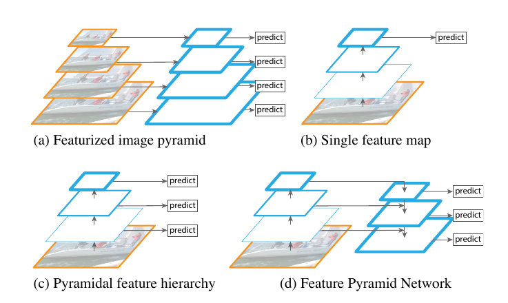
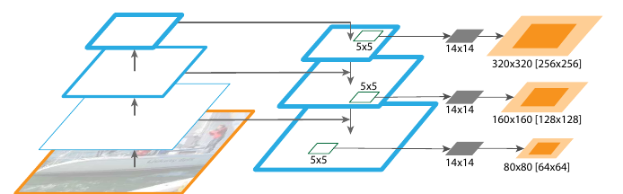

# Feature Pyramid Networks for Object Detection

> Tsung-Yi Lin1,2, Piotr Doll´ar1, Ross Girshick1, Kaiming He1, Bharath Hariharan1, and Serge Belongie2
>
> 1Facebook AI Research (FAIR)
>
> 2Cornell University and Cornell Tech

## 摘要

>## Abstract

特征金字塔是识别系统中用于检测不同尺度对象的基本组件。但是最近的深度学习目标检测器已经避免了金字塔表示，部分原因是它们是计算和内存密集型的。在本文中，我们利用深度卷积网络固有的多尺度金字塔层次结构来构建具有边际额外成本的特征金字塔。开发了一种具有横向连接的自上而下的体系结构，用于构建所有尺度的高级语义特征图。这种称为特征金字塔网络 (FPN) 的体系结构在多个应用程序中作为通用特征提取器显示出显着的改进。在基本的 Faster R-CNN 系统中使用 FPN，我们的方法在 COCO 检测基准上实现了最先进的单模型结果，没有任何花哨的东西，超过了所有现有的单模型，包括来自 COCO 2016 的解决方案挑战获胜者。此外，我们的方法可以在 GPU 上以 5 FPS 的速度运行，因此是多尺度目标检测的实用且准确的解决方案。代码将会公开。

>Feature pyramids are a basic component in recognition systems for detecting objects at different scales. But recent deep learning object detectors have avoided pyramid rep- resentations, in part because they are compute and memory intensive. In this paper, we exploit the inherent multi-scale, pyramidal hierarchy of deep convolutional networks to con- struct feature pyramids with marginal extra cost. A top- down architecture with lateral connections is developed for building high-level semantic feature maps at all scales. This architecture, called a Feature Pyramid Network (fpn), shows significant improvement as a generic feature extrac- tor in several applications. Using FPN in a basic Faster R-CNN system, our method achieves state-of-the-art single- model results on the COCO detection benchmark without bells and whistles, surpassing all existing single-model en- tries including those from the COCO 2016 challenge win- ners. In addition, our method can run at 5 FPS on a GPU and thus is a practical and accurate solution to multi-scale object detection. Code will be made publicly available.

## 1.简介

>## 1. Introduction

在截然不同的尺度上识别物体是计算机视觉中的一个基本挑战。建立在图像金字塔之上的特征金字塔（我们简称为这些特征化图像金字塔）构成了标准解决方案的基础 [1]（图 1（a））。这些金字塔在某种意义上是尺度不变的，因为对象的尺度变化会通过变换金字塔中的层来抵消。直观地说，此属性使模型能够通过在位置和金字塔级别上扫描模型来检测大范围内的对象。

>Recognizing objects at vastly different scales is a fun- damental challenge in computer vision. Feature pyramids built upon image pyramids (for short we call these featur- ized image pyramids) form the basis of a standard solution [1] (Fig. 1(a)). These pyramids are scale-invariant in the sense that an object’s scale change is offset by shifting its level in the pyramid. Intuitively, this property enables a model to detect objects across a large range of scales by scanning the model over both positions and pyramid levels.

特征化图像金字塔在手工设计特征的时代被大量使用 [5, 25]。它们是如此关键，以至于像 DPM [7] 这样的物体检测器需要密集尺度采样才能获得良好的结果（例如，每倍频程 10 个尺度）。对于识别任务，工程特征有

>Featurized image pyramids were heavily used in the era of hand-engineered features [5, 25]. They were so critical that object detectors like DPM [7] required dense scale sampling to achieve good results (e.g., 10 scales per octave). For recognition tasks, engineered features have

图 1. (a) 使用图像金字塔构建特征金字塔。特征是在每个图像尺度上独立计算的，这很慢。(b) 最近的检测系统选择仅使用单一尺度特征来进行更快的检测。(c) 另一种方法是重用由 ConvNet 计算的金字塔特征层次结构，就好像它是一个特征化的图像金字塔一样。(d) 我们提出的特征金字塔网络 (FPN) 与 (b) 和 (c) 一样快速，但更准确。在此图中，特征图由蓝色轮廓表示，较粗的轮廓表示语义上更强的特征。

>Figure 1. (a) Using an image pyramid to build a feature pyramid. Features are computed on each of the image scales independently, which is slow. (b) Recent detection systems have opted to use only single scale features for faster detection. (c) An alternative is to reuse the pyramidal feature hierarchy computed by a ConvNet as if it were a featurized image pyramid. (d) Our proposed Feature Pyramid Network (fpn) is fast like (b) and (c), but more accurate. In this figure, feature maps are indicate by blue outlines and thicker outlines denote semantically stronger features.

很大程度上被深度卷积网络 (ConvNets) [19, 20] 计算的特征所取代。除了能够表示更高级别的语义之外，ConvNets 还对尺度变化更稳健，因此有助于识别在单个输入尺度上计算的特征 [15、11、29]（图 1（b））。但即使具有这种稳健性，仍然需要金字塔来获得最准确的结果。 ImageNet [33] 和 COCO [21] 检测挑战中的所有最新顶级解决方案都对特征化图像金字塔（例如，[16、35]）使用多尺度测试。对图像金字塔的每一层进行特征化的主要优点是它产生了多尺度特征表示，其中所有层在语义上都很强，包括高分辨率层。

>largely been replaced with features computed by deep con- volutional networks (ConvNets) [19, 20]. Aside from being capable of representing higher-level semantics, ConvNets are also more robust to variance in scale and thus facilitate recognition from features computed on a single input scale [15, 11, 29] (Fig. 1(b)). But even with this robustness, pyra- mids are still needed to get the most accurate results. All re- cent top entries in the ImageNet [33] and COCO [21] detec- tion challenges use multi-scale testing on featurized image pyramids (e.g., [16, 35]). The principle advantage of fea- turizing each level of an image pyramid is that it produces a multi-scale feature representation in which all levels are semantically strong, including the high-resolution levels.

然而，特征化图像金字塔的每一层都有明显的局限性。推理时间显着增加（例如，增加四倍 [11]），使得这种方法对于实际应用不切实际。此外，在图像金字塔上端到端训练深度网络在内存方面是不可行的，因此，如果利用图像金字塔，图像金字塔仅在测试时使用 [15、11、16、35]，这会造成两者之间的不一致训练/测试时间推断。由于这些原因，Fast and Faster R-CNN [11, 29] 选择在默认设置下不使用特征化图像金字塔。

>Nevertheless, featurizing each level of an image pyra- mid has obvious limitations. Inference time increases con- siderably (e.g., by four times [11]), making this approach impractical for real applications. Moreover, training deep networks end-to-end on an image pyramid is infeasible in terms of memory, and so, if exploited, image pyramids are used only at test time [15, 11, 16, 35], which creates an inconsistency between train/test-time inference. For these reasons, Fast and Faster R-CNN [11, 29] opt to not use fea- turized image pyramids under default settings.

然而，图像金字塔并不是计算多尺度特征表示的唯一方法。深度卷积网络逐层计算特征层次结构，并且通过下采样层，特征层次结构具有固有的多尺度金字塔形状。这种网络内特征层次结构产生不同空间分辨率的特征图，但引入了由不同深度引起的大语义差距。高分辨率地图具有低级特征，会损害其对象识别的表示能力。

>However, image pyramids are not the only way to com- pute a multi-scale feature representation. A deep ConvNet computes a feature hierarchy layer by layer, and with sub- sampling layers the feature hierarchy has an inherent multi- scale, pyramidal shape. This in-network feature hierarchy produces feature maps of different spatial resolutions, but introduces large semantic gaps caused by different depths. The high-resolution maps have low-level features that harm their representational capacity for object recognition.

Single Shot Detector (SSD) [22] 是首次尝试使用 ConvNet 的金字塔特征层次结构，就好像它是特征化图像金字塔一样（图 1（c））。理想情况下，SSD 风格的金字塔将重用前向传播中计算的不同层的多尺度特征图，因此没有额外计算。但是为了避免使用低级特征，SSD 放弃重用已经计算的层，而是从网络的高层开始构建金字塔（例如，VGG 网络 [36] 的 conv4_3），然后添加几个新层。因此它错过了重用特征层次结构的高分辨率地图的机会。我们表明这些对于检测小物体很重要。

>The Single Shot Detector (SSD) [22] is one of the first attempts at using a ConvNet’s pyramidal feature hierarchy as if it were a featurized image pyramid (Fig. 1(c)). Ideally, the SSD-style pyramid would reuse the multi-scale feature maps from different layers computed in the forward pass and thus come free of cost. But to avoid using low-level features SSD foregoes reusing already computed layers and instead builds the pyramid starting from high up in the net- work (e.g., conv4 3 of VGG nets [36]) and then by adding several new layers. Thus it misses the opportunity to reuse the higher-resolution maps of the feature hierarchy. We show that these are important for detecting small objects.

本文的目标是自然地利用 ConvNet 特征层次结构的金字塔形状，同时创建一个在所有尺度上都具有强语义的特征金字塔。为了实现这一目标，我们依赖于一种架构，该架构通过自上而下的路径和横向连接将低分辨率、语义强的特征与高分辨率、语义弱的特征相结合（图 1（d））。结果是一个特征金字塔，它在所有级别都具有丰富的语义，并且可以从单个输入图像尺度快速构建。换句话说，我们展示了如何创建网络内特征金字塔，这些金字塔可用于在不牺牲表征能力、速度或内存的情况下替换特征化图像金字塔。

>The goal of this paper is to naturally leverage the pyra- midal shape of a ConvNet’s feature hierarchy while cre- ating a feature pyramid that has strong semantics at all scales. To achieve this goal, we rely on an architecture that combines low-resolution, semantically strong features with high-resolution, semantically weak features via a top-down pathway and lateral connections (Fig. 1(d)). The result is a feature pyramid that has rich semantics at all levels and is built quickly from a single input image scale. In other words, we show how to create in-network feature pyramids that can be used to replace featurized image pyramids with- out sacrificing representational power, speed, or memory.

采用自上而下和跳跃连接的类似架构在最近的研究中很流行[28、17、8、26]。他们的目标是生成一个具有精细分辨率的单个高级特征图，并在其上进行预测（图 2 上图）。相反，我们的方法利用架构作为特征金字塔，其中预测（例如，目标检测）在每个级别上独立进行（图 2 下图）。我们的模型呼应了一个特征化的图像金字塔，这在这些工作中没有被探索过。

>Similar architectures adopting top-down and skip con- nections are popular in recent research [28, 17, 8, 26]. Their goals are to produce a single high-level feature map of a fine resolution on which the predictions are to be made (Fig. 2 top). On the contrary, our method leverages the architecture as a feature pyramid where predictions (e.g., object detec- tions) are independently made on each level (Fig. 2 bottom). Our model echoes a featurized image pyramid, which has not been explored in these works.

我们在各种检测和分割系统中评估我们的方法，称为特征金字塔网络 (FPN) [11、29、27]。没有花里胡哨的东西，我们仅基于 FPN 和一个基本的 Faster R-CNN 检测器 [29]来报告了具有挑战性的 COCO 检测基准 [21] 最先进的单一模型结果

>We evaluate our method, called a Feature Pyramid Net- work (fpn), in various systems for detection and segmen- tation [11, 29, 27]. Without bells and whistles, we re- port a state-of-the-art single-model result on the challenging COCO detection benchmark [21] simply based on FPN and

图 2. 上图：具有跳跃连接的自上而下架构，其中预测是在最佳级别上进行的（例如，[28]）。下图：我们的模型具有相似的结构，但将其用作特征金字塔，并在所有级别上独立进行预测。

>Figure 2. Top: a top-down architecture with skip connections, where predictions are made on the finest level (e.g., [28]). Bottom: our model that has a similar structure but leverages it as a feature pyramid, with predictions made independently at all levels.

，超越了所有现有的经过大量设计的竞赛获胜者的单一模型解决方案。在消融实验中，我们发现对于边界框 proposals，FPN 将平均召回率 (AR) 显着提高了 8.0 个点；对于目标检测，它在 ResNets [16] 上的 Faster R-CNN 强大的单尺度baseline上将 COCO 风格的平均精度 (AP) 提高了 2.3 点，将 PASCAL 风格的 AP 提高了 3.8 点。我们的方法也很容易扩展到mask proposals 并提高实例分割 AR 并且速度超过严重依赖图像金字塔的最先进方法。

>a basic Faster R-CNN detector [29], surpassing all exist- ing heavily-engineered single-model entries of competition winners. In ablation experiments, we find that for bound- ing box proposals, FPN significantly increases the Average Recall (AR) by 8.0 points; for object detection, it improves the COCO-style Average Precision (AP) by 2.3 points and PASCAL-style AP by 3.8 points, over a strong single-scale baseline of Faster R-CNN on ResNets [16]. Our method is also easily extended to mask proposals and improves both instance segmentation AR and speed over state-of-the-art methods that heavily depend on image pyramids.

此外，我们的金字塔结构可以在所有尺度上进行端到端训练，并在训练/测试时一致使用，这在内存中使用图像金字塔是不可行的。因此，FPN 能够实现比所有现有的最先进方法更高的精度。此外，这种改进是在不增加单尺度baseline测试时间的情况下实现的。我们相信这些进步将促进未来的研究和应用。我们的代码将公开发布。

>In addition, our pyramid structure can be trained end-to- end with all scales and is used consistently at train/test time, which would be memory-infeasible using image pyramids. As a result, FPNs are able to achieve higher accuracy than all existing state-of-the-art methods. Moreover, this im- provement is achieved without increasing testing time over the single-scale baseline. We believe these advances will facilitate future research and applications. Our code will be made publicly available.

## 2.相关工作

>## 2. Related Work

**手工设计的特征和早期的神经网络**。 SIFT 特征 [25] 最初是在尺度空间极值处提取的，用于特征点匹配。 HOG 特征 [5]，以及后来的 SIFT 特征，都是在整个图像金字塔上密集计算的。这些 HOG 和 SIFT 金字塔已被用于图像分类、目标检测、人体姿势估计等众多工作中。人们也对快速计算特征化图像金字塔产生了浓厚的兴趣。 Doll´ar 等人[6] 通过首先计算稀疏采样（按尺度）金字塔然后插入缺失级别来演示快速金字塔计算。在 HOG 和 SIFT 之前，使用 ConvNets [38、32] 进行人脸检测的早期工作计算了图像金字塔上的浅层网络，以跨尺度检测人脸。深度 ConvNet 目标检测器。随着现代深度 ConvNets [19] 的发展，像 Over-Feat [34] 和 R-CNN [12] 这样的物体检测器在准确性上有了显着的提高。 OverFeat 通过将 ConvNet 用作图像金字塔上的滑动窗口检测器，采用了类似于早期神经网络人脸检测器的策略。 R-CNN 采用基于区域 proposal 的策略 [37]，其中每个 proposal 在使用 ConvNet 分类之前进行尺度归一化。 SPPnet [15] 证明了这种基于区域的检测器可以更有效地应用于在单个图像尺度上提取的特征图。最近更准确的检测方法，如 Fast R-CNN [11] 和 Faster R-CNN [29] 提倡使用从单一尺度计算的特征，因为它在准确性和速度之间提供了良好的权衡。然而，多尺度检测仍然表现更好，尤其是对于小物体。

>Hand-engineered features and early neural networks. SIFT features [25] were originally extracted at scale-space extrema and used for feature point matching. HOG fea- tures [5], and later SIFT features as well, were computed densely over entire image pyramids. These HOG and SIFT pyramids have been used in numerous works for image classification, object detection, human pose estimation, and more. There has also been significant interest in comput- ing featurized image pyramids quickly. Doll´ar et al. [6] demonstrated fast pyramid computation by first computing a sparsely sampled (in scale) pyramid and then interpolat- ing missing levels. Before HOG and SIFT, early work on face detection with ConvNets [38, 32] computed shallow networks over image pyramids to detect faces across scales. Deep ConvNet object detectors. With the development of modern deep ConvNets [19], object detectors like Over- Feat [34] and R-CNN [12] showed dramatic improvements in accuracy. OverFeat adopted a strategy similar to early neural network face detectors by applying a ConvNet as a sliding window detector on an image pyramid. R-CNN adopted a region proposal-based strategy [37] in which each proposal was scale-normalized before classifying with a ConvNet. SPPnet [15] demonstrated that such region-based detectors could be applied much more efficiently on fea- ture maps extracted on a single image scale. Recent and more accurate detection methods like Fast R-CNN [11] and Faster R-CNN [29] advocate using features computed from a single scale, because it offers a good trade-off between accuracy and speed. Multi-scale detection, however, still performs better, especially for small objects.

**使用多层的方法**。许多最近的方法通过在 ConvNet 中使用不同的层来改进检测和分割。 FCN [24] 对多个尺度上每个类别的部分分数求和以计算语义分割。 Hypercolumns [13] 使用类似的方法进行对象实例分割。其他几种方法（HyperNet [18]、ParseNet [23] 和 ION [2]）concat 在计算预测之前启用多层的特征，这相当于对变换后的特征求和。 SSD [22] 和 MS-CNN [3] 在不组合特征或分数的情况下预测特征层次结构多层的目标对象。

>Methods using multiple layers. A number of recent ap- proaches improve detection and segmentation by using dif- ferent layers in a ConvNet. FCN [24] sums partial scores for each category over multiple scales to compute semantic segmentations. Hypercolumns [13] uses a similar method for object instance segmentation. Several other approaches (HyperNet [18], ParseNet [23], and ION [2]) concatenate features of multiple layers before computing predictions, which is equivalent to summing transformed features. SSD [22] and MS-CNN [3] predict objects at multiple layers of the feature hierarchy without combining features or scores.

最近有一些方法利用横向/跳跃连接将跨分辨率和语义级别的低级特征图关联起来，包括用于分割的 U-Net [31] 和 Sharp-Mask [28]，用于人脸的重组器网络 [17]检测和堆叠沙漏网络[26]用于关键点估计。 Ghiasi 等人[8] 提出了 FCN 的拉普拉斯金字塔表示，以逐步细化分割。尽管这些方法采用具有金字塔形状的架构，但它们不同于特征化图像金字塔 [5, 7, 34]，在特征化图像金字塔中，预测是在所有级别独立进行的，见图 2。事实上，对于图 2 中的金字塔架构（顶部），仍然需要图像金字塔来识别跨多个尺度的对象 [28]。

>There are recent methods exploiting lateral/skip connec- tions that associate low-level feature maps across resolu- tions and semantic levels, including U-Net [31] and Sharp- Mask [28] for segmentation, Recombinator networks [17] for face detection, and Stacked Hourglass networks [26] for keypoint estimation. Ghiasi et al. [8] present a Lapla- cian pyramid presentation for FCNs to progressively refine segmentation. Although these methods adopt architectures with pyramidal shapes, they are unlike featurized image pyramids [5, 7, 34] where predictions are made indepen- dently at all levels, see Fig. 2. In fact, for the pyramidal architecture in Fig. 2 (top), image pyramids are still needed to recognize objects across multiple scales [28].

## 3. 特征金字塔网络

>## 3. Feature Pyramid Networks

我们的目标是利用 ConvNet 的金字塔特征层次结构，它具有从低到高级别的语义，并构建一个始终具有高级语义的特征金字塔。由此产生的特征金字塔网络是通用的，在本文中我们关注滑动窗口proposers（区域proposal网络，简称 RPN）[29] 和基于区域的检测器（Fast R-CNN）[11]。我们还将 FPN 推广到第6节中的实例分割 proposal。

>Our goal is to leverage a ConvNet’s pyramidal feature hierarchy, which has semantics from low to high levels, and build a feature pyramid with high-level semantics through- out. The resulting Feature Pyramid Network is general- purpose and in this paper we focus on sliding window pro- posers (Region Proposal Network, RPN for short) [29] and region-based detectors (Fast R-CNN) [11]. We also gener- alize FPNs to instance segmentation proposals in Sec. 6.

图 3. 说明横向连接和自上而下路径的构建块，通过加法合并。

>Figure 3. A building block illustrating the lateral connection and the top-down pathway, merged by addition.

我们的方法以任意大小的单尺度图像作为输入，并在多个层次上输出按比例大小的特征图，以完全卷积的方式。此过程独立于卷积架构backbone（例如，[19、36、16]），在本文中，我们使用 ResNets [16] 呈现结果。我们的金字塔的构建涉及自下而上的路径、自上而下的路径和横向连接，如下所述。

>Our method takes a single-scale image of an arbitrary size as input, and outputs proportionally sized feature maps at multiple levels, in a fully convolutional fashion. This pro- cess is independent of the backbone convolutional architec- tures (e.g., [19, 36, 16]), and in this paper we present results using ResNets [16]. The construction of our pyramid in- volves a bottom-up pathway, a top-down pathway, and lat- eral connections, as introduced in the following.

**自下而上的路径**。自下而上的路径是 backbone ConvNet 的前馈计算，它计算由多个尺度的特征图组成的特征层次结构，缩放步长为 2。通常有许多层产生输出图相同的大小，我们说这些层在同一个网络阶段。对于我们的特征金字塔，我们为每个阶段定义一个金字塔级别。我们选择每个阶段最后一层的输出作为我们的特征映射参考集，我们将丰富它来创建我们的金字塔。这种选择是很自然的，因为每个阶段的最深层应该具有最强的特征。

>Bottom-up pathway. The bottom-up pathway is the feed- forward computation of the backbone ConvNet, which com- putes a feature hierarchy consisting of feature maps at sev- eral scales with a scaling step of 2. There are often many layers producing output maps of the same size and we say these layers are in the same network stage. For our feature pyramid, we define one pyramid level for each stage. We choose the output of the last layer of each stage as our ref- erence set of feature maps, which we will enrich to create our pyramid. This choice is natural since the deepest layer of each stage should have the strongest features.

具体来说，对于 ResNets [16]，我们使用每个阶段的最后一个残差块输出的特征激活。对于 conv2、conv3、conv4 和 conv5 输出，我们将这些最后残差块的输出表示为 {

}，并注意它们相对于输入图像。由于 conv1 占用大量内存，我们不将其包含在金字塔中。

>Specifically, for ResNets [16] we use the feature activa- tions output by each stage’s last residual block. We denote the output of these last residual blocks as {C2, C3, C4, C5} for conv2, conv3, conv4, and conv5 outputs, and note that they have strides of {4, 8, 16, 32} pixels with respect to the input image. We do not include conv1 into the pyramid due to its large memory footprint.

**自上而下的路径和横向连接**。自上而下的路径通过从更高的金字塔级别上采样空间更粗糙但语义更强的特征图来产生更高分辨率的特征。然后通过横向连接使用自下而上路径的特征来增强这些特征。每个横向连接合并来自自下而上路径和自上而下路径的相同空间大小的特征图。自下而上的特征图具有较低级别的语义，但它的激活被更准确地定位，因为它被二次采样的次数更少。

>Top-down pathway and lateral connections. The top- down pathway hallucinates higher resolution features by upsampling spatially coarser, but semantically stronger, fea- ture maps from higher pyramid levels. These features are then enhanced with features from the bottom-up pathway via lateral connections. Each lateral connection merges fea- ture maps of the same spatial size from the bottom-up path- way and the top-down pathway. The bottom-up feature map is of lower-level semantics, but its activations are more ac- curately localized as it was subsampled fewer times.

图 3 显示了构建自上而下特征图的构建块。使用较粗分辨率的特征图，我们将空间分辨率上采样 2 倍（为简单起见，使用最近邻上采样）。然后通过将上采样图与相应的自下而上图（经过 1×1 卷积层以减少通道维度）合并逐元素相加。迭代此过程，直到生成最佳分辨率图。要开始迭代，我们只需在 

 上附加一个 1×1 卷积层以生成最粗糙的分辨率图。最后，我们在每个合并图上附加一个 3×3 卷积来生成最终的特征图，这是为了减少上采样的混叠效应。这最后一组特征图称为{

}，对应于分别具有相同空间大小的{

}。

>Fig. 3 shows the building block that constructs our top- down feature maps. With a coarser-resolution feature map, we upsample the spatial resolution by a factor of 2 (using nearest neighbor upsampling for simplicity). The upsam- pled map is then merged with the corresponding bottom-up map (which undergoes a 1×1 convolutional layer to reduce channel dimensions) by element-wise addition. This pro- cess is iterated until the finest resolution map is generated. To start the iteration, we simply attach a 1×1 convolutional layer on C5 to produce the coarsest resolution map. Fi- nally, we append a 3×3 convolution on each merged map to generate the final feature map, which is to reduce the alias- ing effect of upsampling. This final set of feature maps is called {P2, P3, P4, P5}, corresponding to {C2, C3, C4, C5} that are respectively of the same spatial sizes.

因为金字塔的所有级别都像在传统的特征化图像金字塔中一样使用共享分类器/回归器，所以我们在所有特征图中固定特征维度（通道数，表示为 d）。我们在本文中设置 d = 256，因此所有额外的卷积层都有 256 个通道的输出。这些额外的层中没有非线性，我们凭经验发现影响很小。

>Because all levels of the pyramid use shared classi- fiers/regressors as in a traditional featurized image pyramid, we fix the feature dimension (numbers of channels, denoted as d) in all the feature maps. We set d = 256 in this pa- per and thus all extra convolutional layers have 256-channel outputs. There are no non-linearities in these extra layers, which we have empirically found to have minor impacts.

简单性是我们设计的核心，我们发现我们的模型对许多设计选择都很稳健。我们已经对更复杂的块进行了实验（例如，使用多层残差块 [16] 作为连接）并观察到略微更好的结果。设计更好的连接模块不是本文的重点，因此我们选择上述简单设计。

>Simplicity is central to our design and we have found that our model is robust to many design choices. We have exper- imented with more sophisticated blocks (e.g., using multi- layer residual blocks [16] as the connections) and observed marginally better results. Designing better connection mod- ules is not the focus of this paper, so we opt for the simple design described above.

## 4. 应用

>## 4. Applications

我们的方法是在深度卷积网络中构建特征金字塔的通用解决方案。在下文中，我们在 RPN [29] 中采用我们的方法来生成边界框 proposal，在 Fast R-CNN [11] 中采用我们的方法进行目标检测。为了证明我们方法的简单性和有效性，我们在将 [29, 11] 的原始系统应用到我们的特征金字塔时对它们进行了最小的修改。

>Our method is a generic solution for building feature pyramids inside deep ConvNets. In the following we adopt our method in RPN [29] for bounding box proposal gen- eration and in Fast R-CNN [11] for object detection. To demonstrate the simplicity and effectiveness of our method, we make minimal modifications to the original systems of [29, 11] when adapting them to our feature pyramid.

### 4.1. RPN 的特征金字塔网络

>### 4.1. Feature Pyramid Networks for RPN

RPN [29] 是一种滑动窗口分类无关的目标检测器。在最初的 RPN 设计中，一个小的子网络在密集的 3×3 滑动窗口上进行评估，在单尺度卷积特征图之上，执行对象/非对象二元分类和边界框回归。这是通过一个 3×3 卷积层和两个用于分类和回归的 1×1 卷积层实现的，我们称之为网络头。对象/非对象标准和边界框回归目标是根据一组称为anchor的参考框定义的[29]。anchor具有多个预定义的尺度和纵横比，以覆盖不同形状的对象。

>RPN [29] is a sliding-window class-agnostic object de- tector. In the original RPN design, a small subnetwork is evaluated on dense 3×3 sliding windows, on top of a single- scale convolutional feature map, performing object/non- object binary classification and bounding box regression. This is realized by a 3×3 convolutional layer followed by two sibling 1×1 convolutions for classification and regres- sion, which we refer to as a network head. The object/non- object criterion and bounding box regression target are de- fined with respect to a set of reference boxes called anchors [29]. The anchors are of multiple pre-defined scales and aspect ratios in order to cover objects of different shapes.

我们通过用我们的 FPN 替换单尺度特征图来调整 RPN。我们将相同设计的头部（3×3 conv 和两个同级 1×1 convs）附加到特征金字塔的每个级别。因为头部在所有金字塔层级的所有位置上密集滑动，所以没有必要在特定层级上具有多尺度anchor。相反，我们为每个级别分配单一尺度的anchor。形式上，我们将anchor定义为在 {

} 上分别具有 {

} 个像素的区域。与 [29] 中一样，我们也使用多个anchor每个级别的纵横比 {1:2, 1:1, 2:1}。所以在金字塔上总共有 15 个anchor。

>We adapt RPN by replacing the single-scale feature map with our FPN. We attach a head of the same design (3×3 conv and two sibling 1×1 convs) to each level on our feature pyramid. Because the head slides densely over all locations in all pyramid levels, it is not necessary to have multi-scale anchors on a specific level. Instead, we assign anchors of a single scale to each level. Formally, we define the an- chors to have areas of {322, 642, 1282, 2562, 5122} pixels on {P2, P3, P4, P5, P6} respectively.1 As in [29] we also use anchors of multiple aspect ratios {1:2, 1:1, 2:1} at each level. So in total there are 15 anchors over the pyramid.

我们根据 ground-truth 边界框的交并比 (IoU) 比率为anchor分配训练标签，如 [29] 中所示。形式上，如果anchor对于给定的真实框具有最高的 IoU 或与任何 ground-truth 框的 IoU 超过 0.7，则它被分配一个正标签，如果它对所有 ground-truth框的IoU 低于 0.3，则被分配一个负标签。请注意，ground-truth 框的尺度并未明确用于将它们分配给金字塔的级别；相反，ground-truth 框与anchor相关联，而anchor是已分配给金字塔的层级的。因此，除了 [29] 中的规则外，我们没有引入额外的规则。

>We assign training labels to the anchors based on their Intersection-over-Union (IoU) ratios with ground-truth bounding boxes as in [29]. Formally, an anchor is assigned a positive label if it has the highest IoU for a given ground- truth box or an IoU over 0.7 with any ground-truth box, and a negative label if it has IoU lower than 0.3 for all ground-truth boxes. Note that scales of ground-truth boxes are not explicitly used to assign them to the levels of the pyramid; instead, ground-truth boxes are associated with anchors, which have been assigned to pyramid levels. As such, we introduce no extra rules in addition to those in [29].

我们注意到头部的参数在所有特征金字塔级别共享；我们还评估了不共享参数的替代方案，并观察到类似的准确性。共享参数的良好性能表明我们金字塔的所有级别都共享相似的语义级别。这种优势类似于使用特征化图像金字塔的优势，其中可以将通用头部分类器应用于在任何图像尺度上计算的特征。

>We note that the parameters of the heads are shared across all feature pyramid levels; we have also evaluated the alternative without sharing parameters and observed similar accuracy. The good performance of sharing parameters in- dicates that all levels of our pyramid share similar semantic levels. This advantage is analogous to that of using a fea- turized image pyramid, where a common head classifier can be applied to features computed at any image scale.

通过上述调整，可以使用我们的 FPN 以与 [29] 中相同的方式自然地训练和测试 RPN。我们详细说明了实验中的实现细节。

>With the above adaptations, RPN can be naturally trained and tested with our FPN, in the same fashion as in [29]. We elaborate on the implementation details in the experiments.

### 4.2. Fast R-CNN 的特征金字塔网络

>### 4.2. Feature Pyramid Networks for Fast R-CNN

Fast R-CNN [11] 是一种基于区域的目标检测器，其中使用感兴趣区域 (RoI) pooling 来提取特征。 Fast R-CNN 最常在单尺度特征图上执行。要将其与我们的 FPN 一起使用，我们需要将不同尺度的 RoI 分配给金字塔层级。

>Fast R-CNN [11] is a region-based object detector in which Region-of-Interest (RoI) pooling is used to extract features. Fast R-CNN is most commonly performed on a single-scale feature map. To use it with our FPN, we need to assign RoIs of different scales to the pyramid levels.

我们将特征金字塔看作是从图像金字塔中生成的。因此，当它们在图像金字塔上运行时，我们可以调整基于区域的检测器 [15、11] 的分配策略。形式上，我们通过以下方式将宽度 w 和高度 h（在网络的输入图像上）的 RoI 分配给特征金字塔的层级

：

>We view our feature pyramid as if it were produced from an image pyramid. Thus we can adapt the assignment strat- egy of region-based detectors [15, 11] in the case when they are run on image pyramids. Formally, we assign an RoI of width w and height h (on the input image to the network) to the level Pk of our feature pyramid by:

这里 224 是规范的 ImageNet 预训练大小，

 是 w×h = 

 的 RoI 应该映射到的目标级别。类似于使用 

 作为单尺度特征图的基于 ResNet 的 Faster R-CNN 系统 [16]，我们将 

 设置为 4。直观地，等式(1) 意味着如果 RoI 的尺度变小（比如，224 的 1/2），它应该被映射到更精细的分辨率级别（比如，k = 3）。

>Here 224 is the canonical ImageNet pre-training size, and k0 is the target level on which an RoI with w × h = 2242 should be mapped into. Analogous to the ResNet-based Faster R-CNN system [16] that uses C4 as the single-scale feature map, we set k0 to 4. Intuitively, Eqn. (1) means that if the RoI’s scale becomes smaller (say, 1/2 of 224), it should be mapped into a finer-resolution level (say, k = 3).

我们将预测器头（在 Fast R-CNN 中，头部是特定于类的分类器和边界框回归器）附加到所有级别的所有 RoI。同样，无论其是哪个层级，所有头都共享参数。在 [16] 中，ResNet 的 conv5 层（一个 9 层深子网络）被用作 conv4 特征之上的头部，但我们的方法已经利用 conv5 来构建特征金字塔。因此与 [16] 不同，我们简单地采用 RoI pooling 来提取 7×7 特征，并在最终分类和边界框回归层之前附加两个隐藏的 1,024 维全连接 (fc) 层（每个后跟 ReLU）。这些层是随机初始化的，因为 ResNet 中没有可用的预训练 fc 层。请注意，与标准 conv5 头相比，我们的 2-fc MLP 头重量更轻，速度更快。

>We attach predictor heads (in Fast R-CNN the heads are class-specific classifiers and bounding box regressors) to all RoIs of all levels. Again, the heads all share parameters, regardless of their levels. In [16], a ResNet’s conv5 lay- ers (a 9-layer deep subnetwork) are adopted as the head on top of the conv4 features, but our method has already har- nessed conv5 to construct the feature pyramid. So unlike [16], we simply adopt RoI pooling to extract 7×7 features, and attach two hidden 1,024-d fully-connected (fc) layers (each followed by ReLU) before the final classification and bounding box regression layers. These layers are randomly initialized, as there are no pre-trained fc layers available in ResNets. Note that compared to the standard conv5 head, our 2-fc MLP head is lighter weight and faster.

基于这些调整，我们可以在特征金字塔之上训练和测试 Fast R-CNN。实施细节在实验部分给出。

>Based on these adaptations, we can train and test Fast R- CNN on top of the feature pyramid. Implementation details are given in the experimental section.

## 5. 目标检测实验

>## 5. Experiments on Object Detection

我们在 80 类 COCO 检测数据集 [21] 上进行实验。我们使用 80k 训练图像和 35k val 图像子集 (trainval35k [2]) 的联合进行训练，并报告 5k val 图像子集（minival）的消融实验。我们还报告了没有公开标签的标准测试集 (test-std) [21] 的最终结果。

>We perform experiments on the 80 category COCO de- tection dataset [21]. We train using the union of 80k train images and a 35k subset of val images (trainval35k [2]), and report ablations on a 5k subset of val images (minival). We also report final results on the standard test set (test-std) [21] which has no disclosed labels.

按照惯例 [12]，所有网络 backbone 都在 ImageNet1k 分类集 [33] 上进行预训练，然后在检测数据集上进行 fine-tuned 预训练。我们使用公开可用的预训练 ResNet-50 和 ResNet-101 模型。 我们的代码是使用 Caffe2重新实现 py-faster-rcnn。

>As is common practice [12], all network backbones are pre-trained on the ImageNet1k classification set [33] and then fine-tuned on the detection dataset. We use the pre-trained ResNet-50 and ResNet-101 models that are publicly available.2 Our code is a reimplementation of py-faster-rcnn3 using Caffe2.4

### 5.1.使用 RPN 的区域Proposal

>### 5.1. Region Proposal with RPN

我们根据 [21] 中的定义在小型、中型和大型对象（ARs、ARm 和 ARl）上评估 COCO 风格的平均召回率 (AR) 和 AR。我们报告每张图像 100 和 1000 proposals 的结果（AR100 和 AR1k）。

>We evaluate the COCO-style Average Recall (AR) and AR on small, medium, and large objects (ARs, ARm, and ARl) following the definitions in [21]. We report results for 100 and 1000 proposals per images (AR100 and AR1k).

**实施细节**。表 1 中的所有架构都经过端到端训练。调整输入图像的大小，使其短边有 800 像素。我们在 8 个 GPU 上采用同步 SGD 训练。 mini-batch 每个 GPU 包含 2 个图像，每个图像包含 256 个anchor。我们使用 0.0001 的权重衰减和 0.9 的动量。前 30k mini-batches 的学习率为 0.02，接下来的 10k 为 0.002。对于所有 RPN 实验（包括baseline），我们包括图像外部的anchor框进行训练，这与忽略这些anchor框的 [29] 不同。其他实现细节如 [29] 中所述。在 8 个 GPU 上用 FPN 训练 RPN 在 COCO 上大约需要 8 个小时。

>Implementation details. All architectures in Table 1 are trained end-to-end. The input image is resized such that its shorter side has 800 pixels. We adopt synchronized SGD training on 8 GPUs. A mini-batch involves 2 images per GPU and 256 anchors per image. We use a weight decay of 0.0001 and a momentum of 0.9. The learning rate is 0.02 for the first 30k mini-batches and 0.002 for the next 10k. For all RPN experiments (including baselines), we include the anchor boxes that are outside the image for training, which is unlike [29] where these anchor boxes are ignored. Other implementation details are as in [29]. Training RPN with FPN on 8 GPUs takes about 8 hours on COCO.

#### 5.1.1 消融实验

>#### 5.1.1 Ablation Experiments

**与baseline的比较**。为了与原始 RPN [29] 进行公平比较，我们使用 

（与 [16] 相同）或 

 的单尺度映射运行两个baseline（表 1（a，b）），两者都使用和我们一样相同的超参，包括使用 5个anchor分别为{

}。表1(b)与 (a) 相比没有优势，表明单个更高级别的特征图是不够的，因为在较粗的分辨率和更强的语义之间存在权衡。

>Comparisons with baselines. For fair comparisons with original RPNs [29], we run two baselines (Table 1(a, b)) us- ing the single-scale map of C4 (the same as [16]) or C5, both using the same hyper-parameters as ours, including using 5 scale anchors of {322, 642, 1282, 2562, 5122}. Table 1 (b) shows no advantage over (a), indicating that a single higher- level feature map is not enough because there is a trade-off between coarser resolutions and stronger semantics.

将 FPN 置于 RPN 中可将 

 提高到 56.3（表 1 (c)），比单尺度 RPN baseline（表 1 (a)）提高了 8.0 个点。此外，小物体 (

) 的性能大幅提升了 12.9 个百分点。我们的金字塔表示极大地提高了 RPN 对对象尺度变化的鲁棒性。

>Placing FPN in RPN improves AR1k to 56.3 (Table 1 (c)), which is 8.0 points increase over the single-scale RPN baseline (Table 1 (a)). In addition, the performance on small objects (AR1ks) is boosted by a large margin of 12.9 points. Our pyramid representation greatly improves RPN’s robust- ness to object scale variation.

**自上而下的enrichment有多重要**？表 1(d) 显示了没有自上而下路径的特征金字塔的结果。通过这种修改，1×1 横向连接后跟 3×3 卷积被附加到自下而上的金字塔。该架构模拟了重用金字塔特征层次结构的效果（图 1（b））。

>How important is top-down enrichment? Table 1(d) shows the results of our feature pyramid without the top- down pathway. With this modification, the 1×1 lateral con- nections followed by 3×3 convolutions are attached to the bottom-up pyramid. This architecture simulates the effect of reusing the pyramidal feature hierarchy (Fig. 1(b)).

表 1(d) 中的结果与 RPN baseline相当，远远落后于我们的结果。我们推测这是因为自下而上的金字塔（图 1（b））的不同层次之间存在较大的语义差距，尤其是对于非常深的 ResNet。我们还评估了表 1(d) 的变体而不共享头部参数，但观察到类似的性能下降。这个问题不能简单地由特定级别的头解决。

>The results in Table 1(d) are just on par with the RPN baseline and lag far behind ours. We conjecture that this is because there are large semantic gaps between different levels on the bottom-up pyramid (Fig. 1(b)), especially for very deep ResNets. We have also evaluated a variant of Ta- ble 1(d) without sharing the parameters of the heads, but observed similarly degraded performance. This issue can- not be simply remedied by level-specific heads.

**横向连接有多重要**？表 1(e) 显示了没有 1×1 横向连接的自顶向下特征金字塔的消融结果。这个自上而下的金字塔具有很强的语义特征和精细的分辨率。但我们认为这些特征的位置并不精确，因为这些地图已经过多次下采样和上采样。更精确的特征位置可以通过横向连接从自下而上地图的更精细级别直接传递到自上而下地图。结果，FPN 的 

 得分比表 1(e) 高 10 分。

>How important are lateral connections? Table 1(e) shows the ablation results of a top-down feature pyramid without the 1×1 lateral connections. This top-down pyra- mid has strong semantic features and fine resolutions. But we argue that the locations of these features are not precise, because these maps have been downsampled and upsampled several times. More precise locations of features can be di- rectly passed from the finer levels of the bottom-up maps via the lateral connections to the top-down maps. As a results, FPN has an AR1k score 10 points higher than Table 1(e).

**金字塔表示有多重要**？可以将头部附加到 

 的最高分辨率、强语义特征图（即我们金字塔中的最佳级别），而不是求助于金字塔表示。与单尺度baseline类似，我们将所有anchor分配给 

 特征图。这种变体（表 1(f)）优于baseline但不如我们的方法。 RPN 是一种具有固定窗口大小的滑动窗口检测器，因此扫描金字塔级别可以提高其对尺度变化的鲁棒性。

>How important are pyramid representations? Instead of resorting to pyramid representations, one can attach the head to the highest-resolution, strongly semantic feature maps of P2 (i.e., the finest level in our pyramids). Simi- lar to the single-scale baselines, we assign all anchors to the P2 feature map. This variant (Table 1(f)) is better than the baseline but inferior to our approach. RPN is a sliding win- dow detector with a fixed window size, so scanning over pyramid levels can increase its robustness to scale variance.

此外，我们注意到单独使用 

 会导致更多的anchor（750k，表 1（f）），这是由其较大的空间分辨率引起的。这一结果表明，大量的anchor本身并不足以提高准确性。

>In addition, we note that using P2 alone leads to more anchors (750k, Table 1(f)) caused by its large spatial reso- lution. This result suggests that a larger number of anchors is not sufficient in itself to improve accuracy.

表 1. 使用 RPN [29] 在 COCO minival上评估的边界框 proposal 结果。所有模型都在 trainval35k 上训练。 “横向”和“自上而下”列分别表示横向和自上而下连接的存在。 “特征”列表示附有头部的特征图。所有结果均基于 ResNet-50 并共享相同的超参数。

>Table 1. Bounding box proposal results using RPN [29], evaluated on the COCO minival set. All models are trained on trainval35k. The columns “lateral” and “top-down” denote the presence of lateral and top-down connections, respectively. The column “feature” denotes the feature maps on which the heads are attached. All results are based on ResNet-50 and share the same hyper-parameters.

表 2. 使用 Fast R-CNN [11] 在固定的 proposal 集（RPN，{

}，表 1(c)）上使用 Fast R-CNN [11] 的目标检测结果，在 COCO minival上进行评估。模型在 trainval35k 集上训练。所有结果均基于 ResNet-50 并共享相同的超参数。

>Table 2. Object detection results using Fast R-CNN [11] on a fixed set of proposals (RPN, {Pk}, Table 1(c)), evaluated on the COCO minival set. Models are trained on the trainval35k set. All results are based on ResNet-50 and share the same hyper-parameters.

表 3. 使用 Faster R-CNN [29] 在 COCO minival 集上评估的目标检测结果。 RPN 的 backbone 网络与 Fast R-CNN 一致。模型在 trainval35k 集上训练并使用 ResNet-50。 †由[16]的作者提供。

>Table 3. Object detection results using Faster R-CNN [29] evaluated on the COCO minival set. The backbone network for RPN are consistent with Fast R-CNN. Models are trained on the trainval35k set and use ResNet-50. †Provided by authors of [16].

### 5.2.使用 Fast/Faster R-CNN 进行目标检测

>### 5.2. Object Detection with Fast/Faster R-CNN

接下来我们研究基于区域（非滑动窗口）检测器的 FPN。我们通过 COCO 风格的平均精度 (AP) 和 PASCAL 风格的 AP（在 0.5 的单个 IoU 阈值）评估目标检测。我们还按照 [21] 中的定义报告了小型、中型和大型对象（即 

、

 和 

）的 COCO AP。

>Next we investigate FPN for region-based (non-sliding window) detectors. We evaluate object detection by the COCO-style Average Precision (AP) and PASCAL-style AP (at a single IoU threshold of 0.5). We also report COCO AP on objects of small, medium, and large sizes (namely, APs, APm, and APl) following the definitions in [21].

**实施细节**。调整输入图像的大小，使其短边有 800 像素。同步 SGD 用于在 8 个 GPU 上训练模型。每个 mini-batch 每个 GPU 包含 2 个图像，每个图像包含 512 个 RoI。我们使用 0.0001 的权重衰减和 0.9 的动量。前 60k mini-batches 的学习率为 0.02，接下来的 20k 为 0.002。我们使用每张图像 2000 个 RoI 进行训练，1000 个用于测试。在 COCO 数据集上用 FPN 训练 Fast R-CNN 大约需要 10 个小时。

>Implementation details. The input image is resized such that its shorter side has 800 pixels. Synchronized SGD is used to train the model on 8 GPUs. Each mini-batch in- volves 2 image per GPU and 512 RoIs per image. We use a weight decay of 0.0001 and a momentum of 0.9. The learning rate is 0.02 for the first 60k mini-batches and 0.002 for the next 20k. We use 2000 RoIs per image for training and 1000 for testing. Training Fast R-CNN with FPN takes about 10 hours on the COCO dataset.

#### 5.2.1 Fast R-CNN（固定proposals）

>#### 5.2.1 Fast R-CNN (on fixed proposals)

为了更好地单独研究 FPN 对基于区域的检测器的影响，我们对一组固定的 proposal 进行了 Fast R-CNN 的消融实验。我们选择冻结 RPN 在 FPN 上计算的 proposals（表 1（c）），因为它在检测器要识别的小物体上具有良好的性能。为简单起见，我们不在 Fast R-CNN 和 RPN 之间共享特征，除非另有说明。

>To better investigate FPN’s effects on the region-based de- tector alone, we conduct ablations of Fast R-CNN on a fixed set of proposals. We choose to freeze the proposals as com- puted by RPN on FPN (Table 1(c)), because it has good per- formance on small objects that are to be recognized by the detector. For simplicity we do not share features between Fast R-CNN and RPN, except when specified.

作为基于 ResNet 的 Fast R-CNN baseline，在 [16] 之后，我们采用输出大小为 14×14 的 RoI pooling，并将所有 conv5 层附加为头部的隐藏层。这在表 2(a) 中给出了 31.9 的 AP。表 2(b) 是利用具有 2 个隐藏 fc 层的 MLP 头的baseline，类似于我们架构中的头。它的 AP 为 28.8，表明 2-fc 头没有给我们任何超过表 2(a) 中baseline的正交优势。

>As a ResNet-based Fast R-CNN baseline, following [16], we adopt RoI pooling with an output size of 14×14 and attach all conv5 layers as the hidden layers of the head. This gives an AP of 31.9 in Table 2(a). Table 2(b) is a base- line exploiting an MLP head with 2 hidden fc layers, similar to the head in our architecture. It gets an AP of 28.8, indi- cating that the 2-fc head does not give us any orthogonal advantage over the baseline in Table 2(a).

表 2(c) 显示了我们的 FPN 在 Fast R-CNN 中的结果。与表 2(a) 中的baseline相比，我们的方法将 AP 提高了 2.0 点，小物体 AP 提高了 2.1 点。与同样采用 2fc 头部的baseline相比（表 2(b)），我们的方法将 AP 提高了 5.1 个点。5 这些比较表明，对于基于区域的目标检测器，我们的特征金字塔优于单尺度特征.

>Table 2(c) shows the results of our FPN in Fast R-CNN. Comparing with the baseline in Table 2(a), our method im- proves AP by 2.0 points and small object AP by 2.1 points. Comparing with the baseline that also adopts a 2fc head (Ta- ble 2(b)), our method improves AP by 5.1 points.5 These comparisons indicate that our feature pyramid is superior to single-scale features for a region-based object detector.

表 4. COCO 检测基准上单一模型结果的比较。一些结果在test-std集上不可用，因此我们还包括test-dev结果（以及 Multipath [40] on minival）。 †：http://image-net.org/challenges/talks/2016/GRMI-COCO-slidedeck.pdf。 ‡：http://mscoco.org/dataset/#detections-leaderboard。 §: AttractioNet [10] 的解决方案采用 VGG-16 作为 proposals 和 Wide ResNet [39] 用于目标检测，因此严格来说并不是单一模型的结果。

>Table 4. Comparisons of single-model results on the COCO detection benchmark. Some results were not available on the test-std set, so we also include the test-dev results (and for Multipath [40] on minival). †: http://image-net.org/challenges/ talks/2016/GRMI-COCO-slidedeck.pdf. ‡: http://mscoco.org/dataset/#detections-leaderboard. §: This entry of AttractioNet [10] adopts VGG-16 for proposals and Wide ResNet [39] for object detection, so is not strictly a single-model result.

表 2(d) 和 (e) 表明去除自上而下的连接或移除横向连接会导致较差的结果，类似于我们在上述 RPN 小节中观察到的情况。值得注意的是，移除自上而下的连接（表 2（d））会显着降低准确性，这表明 Fast R-CNN 在高分辨率特征图上使用低级特征时会受到影响。

>Table 2(d) and (e) show that removing top-down con- nections or removing lateral connections leads to inferior results, similar to what we have observed in the above sub- section for RPN. It is noteworthy that removing top-down connections (Table 2(d)) significantly degrades the accu- racy, suggesting that Fast R-CNN suffers from using the low-level features at the high-resolution maps.

在表 2(f) 中，我们在 

 的单一最佳尺度特征图上采用 Fast R-CNN。它的结果（33.4 AP）比使用所有金字塔级别（33.9 AP，表 2（c））略差。我们认为这是因为 RoI pooling 是一种类似扭曲的操作，它对区域的尺度不太敏感。尽管此变体具有良好的准确性，但它基于 {

} 的 RPN proposals，因此已经受益于金字塔表示。

>In Table 2(f), we adopt Fast R-CNN on the single finest scale feature map of P2. Its result (33.4 AP) is marginally worse than that of using all pyramid levels (33.9 AP, Ta- ble 2(c)). We argue that this is because RoI pooling is a warping-like operation, which is less sensitive to the re- gion’s scales. Despite the good accuracy of this variant, it is based on the RPN proposals of {Pk} and has thus already benefited from the pyramid representation.

#### 5.2.2 Faster R-CNN（在一致的 proposals 上）

>#### 5.2.2 Faster R-CNN (on consistent proposals)

在上面我们使用了一组固定的 proposal 来研究检测器。但是在 Faster R-CNN 系统 [29] 中，RPN 和 Fast R-CNN 必须使用相同的网络主干才能实现特征共享。表 3 显示了我们的方法与两个baseline之间的比较，对于RPN 和 Fast R-CNN 所有baseline都使用一致的 backbone架构 。表 3(a) 显示了我们对 [16] 中描述的baseline 的Faster R-CNN 系统的再现。在受控设置下，我们的 FPN（表 3(c)）比这个强大的baseline好 2.3 点 AP 和 3.8 点 AP@0.5。

>In the above we used a fixed set of proposals to investi- gate the detectors. But in a Faster R-CNN system [29], the RPN and Fast R-CNN must use the same network back- bone in order to make feature sharing possible. Table 3 shows the comparisons between our method and two base- lines, all using consistent backbone architectures for RPN and Fast R-CNN. Table 3(a) shows our reproduction of the baseline Faster R-CNN system as described in [16]. Under controlled settings, our FPN (Table 3(c)) is better than this strong baseline by 2.3 points AP and 3.8 points AP@0.5.

请注意，表 3(a) 和 (b) 是比 He 等人提供的baseline强得多的baseline[16] 在表 3( * ) 中。我们发现以下实现导致了差距：（i）我们使用 800 像素的图像尺度而不是 [11、16] 中的 600； (ii) 我们用每张图像 512 个 RoI 进行训练，这加速了收敛，与 [11、16] 中的 64 个 RoI 形成对比； (iii) 我们使用 5 个尺度anchor而不是 [16] 中的 4 个（增加 

）； (iv) 在测试时，我们使用每张图像 1000 个proposals 而不是 [16] 中的 300个。因此，与表 3( * ) 中 He 等人的 ResNet-50 Faster R-CNN baseline相比，我们的方法将 AP 提高了 7.6 个点，将 AP@0.5 提高了 9.6 个点。

>Note that Table 3(a) and (b) are baselines that are much stronger than the baseline provided by He et al. [16] in Ta- ble 3(*). We find the following implementations contribute to the gap: (i) We use an image scale of 800 pixels instead of 600 in [11, 16]; (ii) We train with 512 RoIs per image which accelerate convergence, in contrast to 64 RoIs in [11, 16]; (iii) We use 5 scale anchors instead of 4 in [16] (adding 322); (iv) At test time we use 1000 proposals per image in- stead of 300 in [16]. So comparing with He et al.’s ResNet- 50 Faster R-CNN baseline in Table 3(*), our method im- proves AP by 7.6 points and AP@0.5 by 9.6 points.

表 5. 使用 Faster R-CNN 和我们的 FPN 在 minival 上评估的更多目标检测结果。共享特征将训练时间增加 1.5 倍（使用 4-step训练 [29]），但减少了测试时间。

>Table 5. More object detection results using Faster R-CNN and our FPNs, evaluated on minival. Sharing features increases train time by 1.5× (using 4-step training [29]), but reduces test time.

**共享特征**。在上面，为了简单起见，我们不共享 RPN 和 Fast R-CNN 之间的特征。在表 5，我们按照 [29] 中描述的 4 步训练评估共享特征。与 [29] 类似，我们发现共享特征可以略微提高准确性。特征共享还减少了测试时间。

>Sharing features. In the above, for simplicity we do not share the features between RPN and Fast R-CNN. In Ta- ble 5, we evaluate sharing features following the 4-step training described in [29]. Similar to [29], we find that shar- ing features improves accuracy by a small margin. Feature sharing also reduces the testing time.

**运行时间**。通过特征共享，我们基于 FPN 的 Faster R-CNN 系统在单个 NVIDIA M40 GPU 上对 ResNet-50 的每幅图像推理时间为 0.165 秒，对于 ResNet-101 推理时间为 0.19 秒作为比较，单尺度 ResNet-50表 3(a) 中的baseline运行时间为 0.32 秒。我们的方法通过 FPN 中的额外层引入了少量的额外成本，但头部重量更轻。总体而言，我们的系统比基于 ResNet 的 Faster R-CNN 对应系统更快。我们相信我们方法的效率和简单性将有利于未来的研究和应用。

>Running time. With feature sharing, our FPN-based Faster R-CNN system has inference time of 0.165 seconds per image on a single NVIDIA M40 GPU for ResNet-50, and 0.19 seconds for ResNet-101.6 As a comparison, the single-scale ResNet-50 baseline in Table 3(a) runs at 0.32 seconds. Our method introduces small extra cost by the ex- tra layers in the FPN, but has a lighter weight head. Overall our system is faster than the ResNet-based Faster R-CNN counterpart. We believe the efficiency and simplicity of our method will benefit future research and applications.

#### 5.2.3 与COCO竞赛获奖者对比

>#### 5.2.3 Comparing with COCO Competition Winners

我们发现表 5 中的 ResNet-101 模型未使用默认学习率计划进行充分训练。因此，在训练 Fast R-CNN 步骤时，我们在每个学习率下将 mini-batches 的数量增加 2 倍。这将 minival 上的 AP 增加到 35.6，而无需共享特征。这个模型是我们提交给 COCO 检测排行榜的模型，如表 4 所示。由于时间有限，我们没有评估它的特征共享版本，应该稍微好一点，如表 5 所示。

>We find that our ResNet-101 model in Table 5 is not suffi- ciently trained with the default learning rate schedule. So we increase the number of mini-batches by 2× at each learning rate when training the Fast R-CNN step. This in- creases AP on minival to 35.6, without sharing features. This model is the one we submitted to the COCO detection leaderboard, shown in Table 4. We have not evaluated its feature-sharing version due to limited time, which should be slightly better as implied by Table 5.

表 4 将我们的方法与 COCO 竞赛获胜者的单模型结果进行了比较，包括 2016 年获胜者 G-RMI 和 2015 年获胜者 Faster R-CNN+++。在不添加花里胡哨的情况下，我们的单一模型解决方案已经超过了这些强大的、精心设计的竞争对手。

>Table 4 compares our method with the single-model re- sults of the COCO competition winners, including the 2016 winner G-RMI and the 2015 winner Faster R-CNN+++. Without adding bells and whistles, our single-model entry has surpassed these strong, heavily engineered competitors.

图 4. 目标分割 proposals 的 FPN。特征金字塔的构造与目标检测的结构相同。我们在 5×5 窗口上应用一个小型 MLP 来生成输出尺寸为 14×14 的密集对象分割。以橙色显示的是mask对应于每个金字塔级别的图像区域的大小（此处显示级别 

）。显示了相应的图像区域大小（浅橙色）和规范对象大小（深橙色）。半倍octaves由 MLP 在 7x7 窗口 (

) 上处理，此处未显示。详情见附录。

>Figure 4. FPN for object segment proposals. The feature pyramid is constructed with identical structure as for object detection. We apply a small MLP on 5×5 windows to generate dense object seg- ments with output dimension of 14×14. Shown in orange are the size of the image regions the mask corresponds to for each pyra- mid level (levels P3−5 are shown here). Both the corresponding image region size (light orange) and canonical object size (dark orange) are shown. Half octaves are handled by an MLP on 7x7 windows (7 ≈ 5√2), not shown here. Details are in the appendix.

在test-dev集上，我们的方法比现有最佳结果增加了 0.5 点的 AP (36.2 vs. 35.7) 和 3.4 点的 AP@0.5 (59.1 vs. 55.7)。值得注意的是，我们的方法不依赖图像金字塔，仅使用单一输入图像尺度，但在小尺度物体上仍然具有出色的 AP。这只能通过使用以前的方法输入高分辨率图像来实现。

>On the test-dev set, our method increases over the ex- isting best results by 0.5 points of AP (36.2 vs. 35.7) and 3.4 points of AP@0.5 (59.1 vs. 55.7). It is worth noting that our method does not rely on image pyramids and only uses a single input image scale, but still has outstanding AP on small-scale objects. This could only be achieved by high- resolution image inputs with previous methods.

此外，我们的方法没有利用许多流行的改进，例如迭代回归 [9]、硬负挖掘 [35]、上下文建模 [16]、更强的数据增强 [22] 等。这些改进是互补的与 FPN 相比，应该会进一步提高准确性。

>Moreover, our method does not exploit many popular improvements, such as iterative regression [9], hard nega- tive mining [35], context modeling [16], stronger data aug- mentation [22], etc. These improvements are complemen- tary to FPNs and should boost accuracy further.

近期，FPN在检测、实例分割、关键点估计等COCO竞赛的所有赛道上都取得了新的顶级成绩。有关详细信息，请参见 [14]。

>Recently, FPN has enabled new top results in all tracks of the COCO competition, including detection, instance segmentation, and keypoint estimation. See [14] for details.

## 6.扩展：分割Proposals

>## 6.Extensions: Segmentation Proposals

我们的方法是一种通用的金字塔表示，可用于目标检测以外的应用。在本节中，我们使用 FPN 生成分割 proposals，遵循 DeepMask/SharpMask 框架 [27、28]。

>Our method is a generic pyramid representation and can be used in applications other than object detection. In this section we use FPNs to generate segmentation proposals, following the DeepMask/SharpMask framework [27, 28].

DeepMask/SharpMask 接受了图像裁剪的训练，用于预测实例分割和对象/非对象分数。在推理时，这些模型以卷积方式运行以在图像中生成密集的 proposal。要生成多个尺度的分割，图像金字塔是必要的 [27、28]。

>DeepMask/SharpMask were trained on image crops for predicting instance segments and object/non-object scores. At inference time, these models are run convolutionally to generate dense proposals in an image. To generate segments at multiple scales, image pyramids are necessary [27, 28].

很容易使 FPN 适应生成mask proposals。我们使用全卷积设置进行训练和推理。我们构建了我们的特征金字塔，就像在第5.1节中一样，并设置 d = 128。在特征金字塔的每一层之上，我们应用一个小的 5×5 MLP 以完全卷积的方式预测 14×14 mask和对象分数，见图 4。此外，有动机的通过在 [27, 28] 的图像金字塔中每个八度使用 2 个尺度，我们使用输入大小为 7×7 的第二个 MLP 来处理半个octaves。这两个 MLP 在 RPN 中扮演着类似于anchor的角色。该架构是端到端训练的；附录中给出了完整的实施细节。

>It is easy to adapt FPN to generate mask proposals. We use a fully convolutional setup for both training and infer- ence. We construct our feature pyramid as in Sec. 5.1 and set d = 128. On top of each level of the feature pyramid, we apply a small 5×5 MLP to predict 14×14 masks and object scores in a fully convolutional fashion, see Fig. 4. Addition- ally, motivated by the use of 2 scales per octave in the image pyramid of [27, 28], we use a second MLP of input size 7×7 to handle half octaves. The two MLPs play a similar role as anchors in RPN. The architecture is trained end-to-end; full implementation details are given in the appendix.

表 6. 在前 5k COCO val 图像上评估的实例分割 proposals。所有模型都在训练集上训练。 DeepMask、SharpMask 和 FPN 使用 ResNet-50，而 Instance-FCN 使用 VGG-16。 DeepMask 和 SharpMask 的表现是使用 https://github.com/facebookresearch/deepmask 上提供的模型计算的。 （两者都是“缩放”变体）。 †运行时间是在 NVIDIA M40 GPU 上测得的，除了基于较慢的 K40 的 InstanceFCN 计时。

>Table 6. Instance segmentation proposals evaluated on the first 5k COCO val images. All models are trained on the train set. DeepMask, SharpMask, and FPN use ResNet-50 while Instance- FCN uses VGG-16. DeepMask and SharpMask performance is computed with models available from https://github.com/facebookresearch/deepmask (both are the ‘zoom’ variants). †Runtimes are measured on an NVIDIA M40 GPU, ex- cept the InstanceFCN timing which is based on the slower K40.

### 6.1.分割建议结果

>### 6.1. Segmentation Proposal Results

结果如表 6 所示。我们报告了segment AR和在小型、中型和大型对象上的segment AR，始终持续 1000 proposals。我们具有单个 5×5 MLP 的baseline FPN 模型实现了 43.4 的 AR。切换到稍大的 7×7 MLP 时，精度基本没有变化。同时使用两个 MLP 可将准确度提高到 45.7 AR。将mask输出大小从 14×14 增加到 28×28 将 AR 提高另一个点（更大的尺寸开始降低精度）。最后，将训练迭代次数加倍可将 AR 增加到 48.1。

>Results are shown in Table 6. We report segment AR and segment AR on small, medium, and large objects, always for 1000 proposals. Our baseline FPN model with a single 5×5 MLP achieves an AR of 43.4. Switching to a slightly larger 7×7 MLP leaves accuracy largely unchanged. Using both MLPs together increases accuracy to 45.7 AR. Increas- ing mask output size from 14×14 to 28×28 increases AR another point (larger sizes begin to degrade accuracy). Fi- nally, doubling the training iterations increases AR to 48.1.

我们还报告了与 DeepMask [27]、Sharp-Mask [28] 和 InstanceFCN [4] 的比较，这些方法是mask proposal 生成中最先进的方法。我们的准确率比这些方法高出 8.3 点 AR。特别是，我们几乎将小物体的准确度提高了一倍。

>We also report comparisons to DeepMask [27], Sharp- Mask [28], and InstanceFCN [4], the previous state of the art methods in mask proposal generation. We outperform the accuracy of these approaches by over 8.3 points AR. In particular, we nearly double the accuracy on small objects.

现有mask proposal 方法 [27, 28, 4] 基于密集采样的图像金字塔（例如，在 [27, 28] 中按 

缩放），这使得它们的计算量很大。我们基于 FPN 的方法要快得多（我们的模型以 4 到 6 fps 的速度运行）。这些结果表明我们的模型是一个通用的特征提取器，可以替代图像金字塔来解决其他多尺度检测问题。

>Existing mask proposal methods [27, 28, 4] are based on densely sampled image pyramids (e.g., scaled by 2{−2:0.5:1} in [27, 28]), making them computationally expensive. Our approach, based on FPNs, is substantially faster (our mod- els run at 4 to 6 fps). These results demonstrate that our model is a generic feature extractor and can replace image pyramids for other multi-scale detection problems.

## 7.结论

>## 7. Conclusion

我们已经提出了一个干净简单的框架，用于在 ConvNets 中构建特征金字塔。我们的方法显示出比几个强大的baseline和竞赛获胜者有显着改进。因此，它为特征金字塔的研究和应用提供了一种实用的解决方案，而不需要计算图像金字塔。最后，我们的研究表明，尽管深度卷积网络具有强大的表征能力及其对尺度变化的隐含鲁棒性，但使用金字塔表征明确解决多尺度问题仍然至关重要。

>We have presented a clean and simple framework for building feature pyramids inside ConvNets. Our method shows significant improvements over several strong base- lines and competition winners. Thus, it provides a practical solution for research and applications of feature pyramids, without the need of computing image pyramids. Finally, our study suggests that despite the strong representational power of deep ConvNets and their implicit robustness to scale variation, it is still critical to explicitly address multi- scale problems using pyramid representations.
