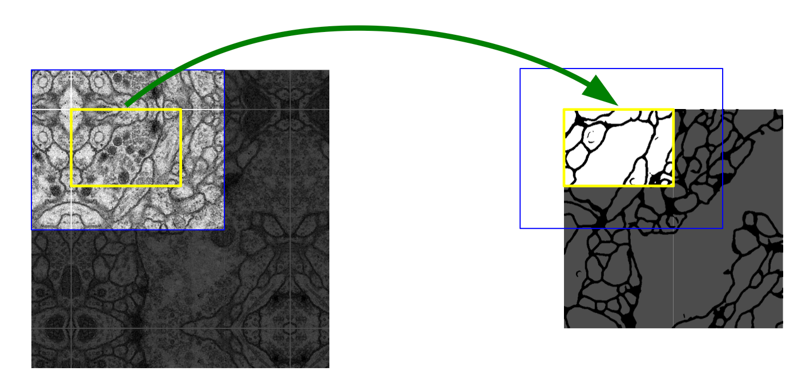
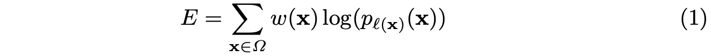
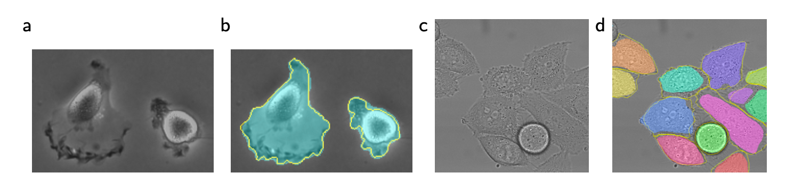
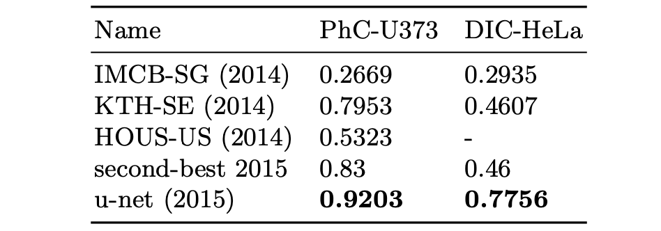

# U-Net: Convolutional Networks for Biomedical Image Segmentation

>Olaf Ronneberger, Philipp Fischer, and Thomas Brox
>
>Computer Science Department and BIOSS Centre for Biological Signalling Studies, University of Freiburg, Germany

## Abstract

人们普遍认为，成功训练深度网络需要数千个带注释的训练样本。在本文中，我们提出了一种网络和训练策略，该策略依赖于强烈使用数据增强来更有效地使用可用的注释样本。该架构由一个用于捕获上下文的收缩路径和一个能够实现精确定位的对称扩展路径组成。我们表明，这样的网络可以从很少的图像进行端到端训练，并且在 ISBI 挑战赛中优于先前的最佳方法（滑动窗口卷积网络），用于分割电子显微镜堆栈中的神经元结构。使用在透射光显微镜图像（相差和 DIC）上训练的相同网络，我们在这些类别中大幅赢得了 2015 年 ISBI 细胞跟踪挑战赛。此外，网络速度很快。在最近的 GPU 上分割 512x512 图像只需不到一秒的时间。完整的实现（基于 Caffe）和经过训练的网络可在 http://lmb.informatik.uni-freiburg.de/people/ronneber/u-net 获得。

>There is large consent that successful training of deep networks requires many thousand annotated training samples. In this paper, we present a network and training strategy that relies on the strong use of data augmentation to use the available annotated samples more efficiently. The architecture consists of a contracting path to capture context and a symmetric expanding path that enables precise localization. We show that such a network can be trained end-to-end from very few images and outperforms the prior best method (a sliding-window convolutional network) on the ISBI challenge for segmentation of neuronal structures in electron microscopic stacks. Using the same network trained on transmitted light microscopy images (phase contrast and DIC) we won the ISBI cell tracking challenge 2015 in these categories by a large margin. Moreover, the network is fast. Segmentation of a 512x512 image takes less than a second on a recent GPU. The full implementation (based on Caffe) and the trained networks are available at http://lmb.informatik.uni-freiburg.de/people/ronneber/u-net.

在过去的两年里，深度卷积网络在许多视觉识别任务中的表现都超过了最先进的水平，例如[7,3]。虽然卷积网络已经存在了很长时间 [8]，但由于可用训练集的大小和所考虑网络的大小，它们的成功受到限制。 Krizhevsky 等人的突破。 [7] 是由于在具有 100 万张训练图像的 ImageNet 数据集上对具有 8 层和数百万参数的大型网络进行监督训练。从那时起，已经训练了更大更深的网络[12]。卷积网络的典型用途是分类任务，其中图像的输出是单个类标签。然而，在许多视觉任务中，特别是在生物医学图像处理中，所需的输出应该包括定位，即应该为每个像素分配一个类标签。此外，数以千计的训练图像在生物医学任务中通常是遥不可及的。因此，Ciresan 等人。 [1] 在滑动窗口设置中训练一个网络，通过在该像素周围提供一个局部区域（patch）来预测每个像素的类别标签作为输入。首先，这个网络可以定位。其次，就patches而言，训练数据远大于训练图像的数量。由此产生的网络在 ISBI 2012 的 EM 分割挑战中大获全胜。

>In the last two years, deep convolutional networks have outperformed the state of the art in many visual recognition tasks, e.g. [7,3]. While convolutional networks have already existed for a long time [8], their success was limited due to the size of the available training sets and the size of the considered networks. The breakthrough by Krizhevsky et al. [7] was due to supervised training of a large network with 8 layers and millions of parameters on the ImageNet dataset with 1 million training images. Since then, even larger and deeper networks have been trained [12]. The typical use of convolutional networks is on classification tasks, where the output to an image is a single class label. However, in many visual tasks, especially in biomedical image processing, the desired output should include localization, i.e., a class label is supposed to be assigned to each pixel. Moreover, thousands of training images are usually beyond reach in biomedical tasks. Hence, Ciresan et al. [1] trained a network in a sliding-window setup to predict the class label of each pixel by providing a local region (patch) around that pixel as input. First, this network can localize. Secondly, the training data in terms of patches is much larger than the number of training images. The resulting network won the EM segmentation challenge at ISBI 2012 by a large margin.

图 1. U-net 架构（最低分辨率下的 32x32 像素示例）。每个蓝色框对应一个多通道特征图。通道数显示在框的顶部。 x-y 尺寸位于框的左下边缘。白框代表复制的特征图。箭头表示不同的操作。

>Fig. 1. U-net architecture (example for 32x32 pixels in the lowest resolution). Each blue box corresponds to a multi-channel feature map. The number of channels is denoted on top of the box. The x-y-size is provided at the lower left edge of the box. White boxes represent copied feature maps. The arrows denote the different operations.

显然，Ciresan 等人的策略。 [1] 有两个缺点。首先，它非常慢，因为网络必须为每个patch单独运行，并且由于重叠patch而存在大量冗余。其次，在定位准确性和上下文使用之间存在权衡。较大的patch需要更多的最大池化层，这会降低定位精度，而小patch允许网络只能看到很少的上下文。最近的方法 [11,4] 提出了一个分类器输出，它考虑了来自多个层的特征。良好的定位和上下文的使用是可能的。

> Obviously, the strategy in Ciresan et al. [1] has two drawbacks. First, it is quite slow because the network must be run separately for each patch, and there is a lot of redundancy due to overlapping patches. Secondly, there is a trade-off between localization accuracy and the use of context. Larger patches require more max-pooling layers that reduce the localization accuracy, while small patches allow the network to see only little context. More recent approaches [11,4] proposed a classifier output that takes into account the features from multiple layers. Good localization and the use of context are possible at the same time.

在本文中，我们建立在一个更优雅的架构上，即所谓的“全卷积网络”[9]。我们修改和扩展了这种架构，使其适用于很少的训练图像并产生更精确的分割；参见图 1。[9] 中的主要思想是通过连续层来补充常见的收缩网络，其中池化算子被上采样算子取代。因此，这些层增加了输出的分辨率。为了进行定位，将收缩路径中的高分辨率特征与上采样的特征输出相结合。然后一个连续的卷积层可以学习根据这些信息集成一个更精确的输出。

> In this paper, we build upon a more elegant architecture, the so-called “fully convolutional network” [9]. We modify and extend this architecture such that it works with very few training images and yields more precise segmentations; see Figure 1. The main idea in [9] is to supplement a usual contracting network by successive layers, where pooling operators are replaced by upsampling operators. Hence, these layers increase the resolution of the output. In order to localize, high resolution features from the contracting path are combined with the upsampled output. A successive convolution layer can then learn to assemble a more precise output based on this information.

图 2. 任意大图像无缝分割的重叠平铺策略（这里是 EM 堆栈中神经元结构的分割）。黄色区域的分割预测，需要蓝色区域内的图像数据作为输入。通过镜像推断丢失的输入数据

>Fig. 2. Overlap-tile strategy for seamless segmentation of arbitrary large images (here segmentation of neuronal structures in EM stacks). Prediction of the segmentation in the yellow area, requires image data within the blue area as input. Missing input data is extrapolated by mirroring

我们架构中的一个重要修改是，在上采样部分，我们还有大量特征通道，这允许网络将上下文信息传播到更高分辨率的层。因此，扩展路径或多或少与收缩路径对称，并产生 u 形架构。网络没有任何全连接层，只使用每个卷积的有效部分，即分割图只包含输入图像中完整上下文可用的像素。该策略允许通过重叠平铺策略无缝分割任意大的图像（参见图 2）。为了预测图像边界区域的像素，通过镜像输入图像来推断缺失的上下文。这种平铺策略对于将网络应用于大图像很重要，因为否则分辨率将受到 GPU 内存的限制。

> One important modification in our architecture is that in the upsampling part we have also a large number of feature channels, which allow the network to propagate context information to higher resolution layers. As a consequence, the expansive path is more or less symmetric to the contracting path, and yields a u-shaped architecture. The network does not have any fully connected layers and only uses the valid part of each convolution, i.e., the segmentation map only contains the pixels, for which the full context is available in the input image. This strategy allows the seamless segmentation of arbitrarily large images by an overlap-tile strategy (see Figure 2). To predict the pixels in the border region of the image, the missing context is extrapolated by mirroring the input image. This tiling strategy is important to apply the network to large images, since otherwise the resolution would be limited by the GPU memory.

至于我们的任务，可用的训练数据非常少，我们通过对可用的训练图像应用弹性变形来使用过多的数据增强。这允许网络学习对此类变形的不变性，而无需在带注释的图像语料库中查看这些转换。这在生物医学分割中尤为重要，因为变形曾经是组织中最常见的变化，并且可以有效地模拟真实的变形。 Dosovitskiy 等人已经证明了数据增强对于学习不变性的价值。 [2] 在无监督特征学习的范围内。

> As for our tasks there is very little training data available, we use excessive data augmentation by applying elastic deformations to the available training images. This allows the network to learn invariance to such deformations, without the need to see these transformations in the annotated image corpus. This is particularly important in biomedical segmentation, since deformation used to be the most common variation in tissue and realistic deformations can be simulated efficiently. The value of data augmentation for learning invariance has been shown in Dosovitskiy et al. [2] in the scope of unsupervised feature learning.

许多细胞分割任务中的另一个挑战是分离同一类的触摸对象；参见图 3。为此，我们建议使用加权损失，其中触摸单元之间的分离背景标签在损失函数中获得很大的权重。

> Another challenge in many cell segmentation tasks is the separation of touching objects of the same class; see Figure 3. To this end, we propose the use of a weighted loss, where the separating background labels between touching cells obtain a large weight in the loss function.

由此产生的网络适用于各种生物医学分割问题。在本文中，我们展示了 EM 堆栈中神经元结构分割的结果（从 ISBI 2012 开始的正在进行的竞赛），其中我们超越了 Ciresan 等人的网络的表现 [1]。此外，我们在 2015 年 ISBI 细胞跟踪挑战赛的光学显微镜图像中展示了细胞分割的结果。在这里，我们在两个最具挑战性的 2D 透射光数据集上大获全胜。

>The resulting network is applicable to various biomedical segmentation problems. In this paper, we show results on the segmentation of neuronal structures in EM stacks (an ongoing competition started at ISBI 2012), where we out-performed the network of Ciresan et al. [1]. Furthermore, we show results for cell segmentation in light microscopy images from the ISBI cell tracking challenge 2015. Here we won with a large margin on the two most challenging 2D transmitted light datasets.

## 2 Network Architecture

网络架构如图 1 所示。它由收缩路径（左侧）和扩展路径（右侧）组成。收缩路径遵循卷积网络的典型架构。它由两个 3x3 卷积（无pad卷积）的重复应用组成，每个卷积后跟一个整流线性单元 (ReLU) 和一个 2x2 最大池化操作，步幅为 2，用于下采样。在每个下采样步骤中，我们将特征通道的数量加倍。扩展路径中的每一步都包括对特征图进行上采样，然后是将特征通道数量减半的 2x2 卷积（“上卷积”），与收缩路径中相应裁剪的特征图的连接，以及两个 3x3卷积，每个后跟一个 ReLU。由于在每个卷积中都会丢失边界像素，因此裁剪是必要的。在最后一层，使用 1x1 卷积将每个 64 分量特征向量映射到所需数量的类。该网络总共有 23 个卷积层。

> The network architecture is illustrated in Figure 1. It consists of a contracting path (left side) and an expansive path (right side). The contracting path follows the typical architecture of a convolutional network. It consists of the repeated application of two 3x3 convolutions (unpadded convolutions), each followed by a rectified linear unit (ReLU) and a 2x2 max pooling operation with stride 2 for downsampling. At each downsampling step we double the number of feature channels. Every step in the expansive path consists of an upsampling of the feature map followed by a 2x2 convolution (“up-convolution”) that halves the number of feature channels, a concatenation with the correspondingly cropped feature map from the contracting path, and two 3x3 convolutions, each followed by a ReLU. The cropping is necessary due to the loss of border pixels in every convolution. At the final layer a 1x1 convolution is used to map each 64component feature vector to the desired number of classes. In total the network has 23 convolutional layers.

为了允许输出分割图的无缝平铺（参见图 2），重要的是选择输入平铺大小，以便将所有 2x2 最大池化操作应用于具有偶数 x 和 y 大小的层。

>To allow a seamless tiling of the output segmentation map (see Figure 2), it is important to select the input tile size such that all 2x2 max-pooling operations are applied to a layer with an even x- and y-size.

## 3 Training

输入图像及其相应的分割图用于通过 Caffe [6] 的随机梯度下降实现来训练网络。由于未pad的卷积，输出图像比输入图像小一个恒定的边框宽度。为了最大限度地减少开销并最大限度地利用 GPU 内存，我们倾向于使用大输入图块而不是大批量大小，从而将批量减少为单个图像。因此，我们使用高动量（0.99），以便大量先前看到的训练样本确定当前优化步骤中的更新。

> The input images and their corresponding segmentation maps are used to train the network with the stochastic gradient descent implementation of Caffe [6]. Due to the unpadded convolutions, the output image is smaller than the input by a constant border width. To minimize the overhead and make maximum use of the GPU memory, we favor large input tiles over a large batch size and hence reduce the batch to a single image. Accordingly we use a high momentum (0.99) such that a large number of the previously seen training samples determine the update in the current optimization step.

能量函数是通过最终特征图上的像素级 soft-max 结合交叉熵损失函数来计算的。 soft-max 是
=\exp%20\left(a_{k}(\mathbf{x})\right)%20/\left(\sum_{k^{\prime}=1}^{K}%20\exp%20\left(a_{k^{\prime}}(\mathbf{x})\right)\right))
其中 
)
 表示特征通道 k 在像素位置 x ∈ Ω , 

 。 K 是类别数量，
)
是近似的最大函数。 IE。对于具有最大激活 
)
 的 k，
%20\approx%201)
，对于所有其他 k，
%20\approx%200)
。然后交叉熵在每个位置
}(\mathbf{x}))
惩罚为

> The energy function is computed by a pixel-wise soft-max over the final feature map combined with thecross entropy loss function. The soft-max is PK 0 defined as pk (x) = exp(ak (x))/ k0 =1 exp(ak (x)) where ak (x) denotes the activation in feature channel k at the pixel position x ∈ Ω with Ω ⊂ Z2 . K is the number of classes and pk (x) is the approximated maximum-function. I.e. pk (x) ≈ 1 for the k that has the maximum activation ak (x) and pk (x) ≈ 0 for all other k. The cross entropy then penalizes at each position the deviation of pl(x)(x) from 1 using

图 3. 用 DIC（微分干涉对比）显微镜记录的玻璃上的 HeLa 细胞。 (a) 原始图像。 (b) 与ground-truth分割叠加。不同的颜色表示 HeLa 细胞的不同实例。 (c) 生成的分割掩码（白色：前景，黑色：背景）。 (d) 使用逐像素损失权重进行映射，以强制网络学习边界像素。

>Fig. 3. HeLa cells on glass recorded with DIC (differential interference contrast) microscopy. (a) raw image. (b) overlay with ground truth segmentation. Different colors indicate different instances of the HeLa cells. (c) generated segmentation mask (white: foreground, black: background). (d) map with a pixel-wise loss weight to force the network to learn the border pixels.

其中

 是每个像素的真实标签，w : Ω → R 是我们引入的权重图，以便在训练中赋予一些像素更多的重要性。

> where ` : Ω → {1, . . . , K} is the true label of each pixel and w : Ω → R is a weight map that we introduced to give some pixels more importance in the training.

我们预先计算每个ground-truth分割的权重图，以补偿训练数据集中某个类别的像素的不同频率，并强制网络学习我们在接触单元之间引入的小分离边界（见图 3c d)。

> We pre-compute the weight map for each ground truth segmentation to compensate the different frequency of pixels from a certain class in the training data set, and to force the network to learn the small separation borders that we introduce between touching cells (See Figure 3c and d).

使用形态学运算计算分离边界。然后将权重图计算为

>The separation border is computed using morphological operations. The weight map is then computed as

其中 

 是平衡类频率的权重图，

 表示到最近单元格边界的距离，

表示到第二最近单元格边界的距离。在我们的实验中，我们设置 

 和 σ ≈ 5 个像素。

> where wc : Ω → R is the weight map to balance the class frequencies, d1 : Ω → R denotes the distance to the border of the nearest cell and d2 : Ω → R the distance to the border of the second nearest cell. In our experiments we set w0 = 10 and σ ≈ 5 pixels.

在具有许多卷积层和通过网络的不同路径的深度网络中，良好的权重初始化非常重要。否则，网络的某些部分可能会提供过多的激活，而其他部分则永远不会做出贡献。理想情况下，应该调整初始权重，使得网络中的每个特征图都具有近似单位方差。对于具有我们架构的网络（交替卷积和 ReLU 层），这可以通过从标准偏差为 

 的高斯分布中绘制初始权重来实现，其中 N 表示一个神经元的传入节点数 [5] .例如。对于前一层的 3x3 卷积和 64 个特征通道 N = 9 · 64 = 576.

>In deep networks with many convolutional layers and different paths through the network, a good initialization of the weights is extremely important. Otherwise, parts of the network might give excessive activations, while other parts never contribute. Ideally the initial weights should be adapted such that each feature map in the network has approximately unit variance. For a network with our architecture (alternating convolution and ReLU layers) this can be achieved by drawing p the initial weights from a Gaussian distribution with a standard deviation of 2/N , where N denotes the number of incoming nodes of one neuron [5]. E.g. for a 3x3 convolution and 64 feature channels in the previous layer N = 9 · 64 = 576.

### 3.1 Data Augmentation

当只有很少的训练样本可用时，数据增强对于教会网络所需的不变性和鲁棒性是必不可少的。对于显微图像的情况下，我们主要需要平移和旋转不变性以及对变形和灰度值变化的鲁棒性。特别是训练样本的随机弹性变形似乎是训练带有很少注释图像的分割网络的关键概念。我们使用粗略的 3 x 3 网格上的随机位移矢量生成平滑变形。位移是从具有 10 像素标准偏差的高斯分布中采样的。然后使用双三次插值计算每像素位移。收缩路径末端的 drop-out 层执行进一步的隐式数据增强。

>Data augmentation is essential to teach the network the desired invariance and robustness properties, when only few training samples are available. In case of microscopical images we primarily need shift and rotation invariance as well as robustness to deformations and gray value variations. Especially random elastic deformations of the training samples seem to be the key concept to train a segmentation network with very few annotated images. We generate smooth deformations using random displacement vectors on a coarse 3 by 3 grid. The displacements are sampled from a Gaussian distribution with 10 pixels standard deviation. Per-pixel displacements are then computed using bicubic interpolation. Drop-out layers at the end of the contracting path perform further implicit data augmentation.

## 4 Experiments

我们演示了 u-net 在三个不同的分割任务中的应用。第一项任务是电子显微镜记录中神经元结构的分割。图 2 显示了数据集和我们获得的分割的示例。我们将完整结果作为补充材料提供。该数据集由 2012 年 ISBI 开始的 EM 分割挑战 [14] 提供，并且仍然对新的贡献开放。训练数据是一组 30 张图像（512x512 像素），来自果蝇第一龄幼虫腹神经索 (VNC) 的串行切片透射电子显微镜。每个图像都带有一个相应的完全注释的地面真实分割图，用于细胞（白色）和膜（黑色）。测试集是公开的，但它的分割图是保密的。可以通过将预测的膜概率图发送给组织者来获得评估。评估是通过在 10 个不同级别对地图进行阈值处理并计算“warping误差”、“随机误差”和“像素误差”[14] 来完成的。

> We demonstrate the application of the u-net to three different segmentation tasks. The first task is the segmentation of neuronal structures in electron microscopic recordings. An example of the data set and our obtained segmentation is displayed in Figure 2. We provide the full result as Supplementary Material. The data set is provided by the EM segmentation challenge [14] that was started at ISBI 2012 and is still open for new contributions. The training data is a set of 30 images (512x512 pixels) from serial section transmission electron microscopy of the Drosophila first instar larva ventral nerve cord (VNC). Each image comes with a corresponding fully annotated ground truth segmentation map for cells (white) and membranes (black). The test set is publicly available, but its segmentation maps are kept secret. An evaluation can be obtained by sending the predicted membrane probability map to the organizers. The evaluation is done by thresholding the map at 10 different levels and computation of the “warping error”, the “Rand error” and the “pixel error” [14].

u-net（输入数据的 7 个旋转版本的平均值）无需任何进一步的预处理或后处理即可实现 0.0003529 的warping误差（新的最佳分数，参见表 1）和 0.0382 的随机误差。

> The u-net (averaged over 7 rotated versions of the input data) achieves without any further pre- or postprocessing a warping error of 0.0003529 (the new best score, see Table 1) and a rand-error of 0.0382.

这明显好于Ciresan等人[1]的滑动窗口卷积网络结果，其最佳提交的warping误差为0.000420，rand误差为0.0504。就rand误差而言，该数据集上唯一表现较好的算法使用了高度针对数据集的后处理方法1，应用于Ciresan等人[1]的概率图。

> This is significantly better than the sliding-window convolutional network result by Ciresan et al. [1], whose best submission had a warping error of 0.000420 and a rand error of 0.0504. In terms of rand error the only better performing algorithms on this data set use highly data set specific post-processing methods1 applied to the probability map of Ciresan et al. [1].

**表 1** 中唯一表现更好的。EM 分割挑战排名 [14]（2015 年 3 月 6 日），按warping误差排序。

>**Table 1.** Ranking on the EM segmentation challenge [14] (march 6th, 2015), sorted by warping

图 4. ISBI 小区跟踪挑战的结果。 (a) “PhC-U373”数据集的输入图像的一部分。 (b) 具有手工ground-truth（黄色边框）的分割结果（青色蒙版）（c）“DIC-HeLa”数据集的输入图像。 (d) 具有手工ground-truth（黄色边框）的分割结果（随机彩色蒙版）。

> Fig. 4. Result on the ISBI cell tracking challenge. (a) part of an input image of the “PhC-U373” data set. (b) Segmentation result (cyan mask) with manual ground truth (yellow border) (c) input image of the “DIC-HeLa” data set. (d) Segmentation result (random colored masks) with manual ground truth (yellow border).

表 2. 2015 年 ISBI 小区跟踪挑战赛的分割结果 (IOU)。名称

>Table 2. Segmentation results (IOU) on the ISBI cell tracking challenge 2015. Name

我们还将 u-net 应用于光学显微图像中的细胞分割任务。此分割任务是 2014 年和 2015 年 ISBI 单元跟踪挑战的一部分 [10,13]。第一个数据集“PhC-U373”2 包含通过相差显微镜记录的聚丙烯酰亚胺基底上的胶质母细胞瘤-星形细胞瘤 U373 细胞（参见图 4a、b 和补充材料）。它包含 35 个部分注释的训练图像。在这里，我们实现了 92% 的平均 IOU（“intersection over union”），这明显优于 83% 的第二好的算法（见表 2）。第二个数据集“DIC-HeLa”3 是通过微分干涉对比 (DIC) 显微镜记录的平板玻璃上的 HeLa 细胞（参见图 3、图 4c、d 和补充材料）。它包含 20 个部分注释的训练图像。在这里，我们实现了 77.5% 的平均 IOU，明显优于第二好的算法（46%）。

>We also applied the u-net to a cell segmentation task in light microscopic images. This segmenation task is part of the ISBI cell tracking challenge 2014 and 2015 [10,13]. The first data set “PhC-U373”2 contains Glioblastoma-astrocytoma U373 cells on a polyacrylimide substrate recorded by phase contrast microscopy (see Figure 4a,b and Supp. Material). It contains 35 partially annotated training images. Here we achieve an average IOU (“intersection over union”) of 92%, which is significantly better than the second best algorithm with 83% (see Table 2). The second data set “DIC-HeLa”3 are HeLa cells on a flat glass recorded by differential interference contrast (DIC) microscopy (see Figure 3, Figure 4c,d and Supp. Material). It contains 20 partially annotated training images. Here we achieve an average IOU of 77.5% which is significantly better than the second best algorithm with 46%.

u-net架构在非常不同的生物医学分割应用中取得了非常好的性能。得益于弹性变形的数据增强，它只需要很少的注释图像，并且在NVidia Titan GPU（6 GB）上的训练时间非常合理，只有10小时。我们提供了基于Caffe[6]的完整实现和训练后的网络4。我们确信，u-net架构可以很容易地应用于更多的任务。

>The u-net architecture achieves very good performance on very different biomed- ical segmentation applications. Thanks to data augmentation with elastic deformations, it only needs very few annotated images and has a very reasonable training time of only 10 hours on a NVidia Titan GPU (6 GB). We provide the full Caffe[6]-based implementation and the trained networks4 . We are sure that the u-net architecture can be applied easily to many more tasks.

## Acknowlegements

这项研究得到了德国联邦和州政府卓越倡议 (EXC 294) 和 BMBF (Fkz 0316185B) 的支持。

>This study was supported by the Excellence Initiative of the German Federal and State governments (EXC 294) and by the BMBF (Fkz 0316185B).
