# Fully Convolutional Networks for Semantic Segmentation

> Jonathan Long∗ Evan Shelhamer∗ Trevor Darrell UC Berkeley {jonlong,shelhamer,trevor}@cs.berkeley.edu

# Abstract

卷积网络是产生特征层次结构的强大视觉模型。我们表明，卷积网络本身，经过端到端、像素到像素的训练，在语义分割方面超过了最先进的水平。我们的关键见解是构建“完全卷积”网络，该网络接受任意大小的输入并通过有效的推理和学习产生相应大小的输出。我们定义并详细说明了全卷积网络的空间，解释了它们在空间密集预测任务中的应用，并与先前的模型建立了联系。我们将当代分类网络（AlexNet [20]、VGG 网络 [31] 和 GoogLeNet [32]）改编成全卷积网络，并通过微调 [3] 将其学习表示转移到分割任务中。然后，我们定义了一个跳过架构，它将来自深层、粗略层的语义信息与来自浅层、精细层的外观信息相结合，以产生准确和详细的分割。我们的全卷积网络实现了最先进的 PASCAL VOC 分割（相对于 2012 年的 62.2% 平均 IU 提高了 20%）、NYUDv2 和 SIFT Flow，而典型图像的推理时间不到五分之一秒。

>Convolutional  networks are powerful visual models that yield hierarchies of features. We show that convolu- tional networks by themselves, trained end-toend, pixels- to-pixels, exceed the state-of-the-art in semantic segmen- tation. Our key insight is to build “fully convolutional” networks that take input of arbitrary size and produce correspondingly-sized output with efficient inference and learning. We define and detail the space of fully convolu- tional networks, explain their application to spatially dense prediction tasks, and draw connections to prior models. We adapt contemporary classification networks (AlexNet [20], the VGG net [31], and GoogLeNet [32]) into fully convolu- tional networks and transfer their learned representations by fine-tuning [3] to the segmentation task. We then define a skip architecture that combines semantic information from a deep, coarse layer with appearance information from a shallow, fine layer to produce accurate and detailed segmentations. Our fully convolutional network achieves stateof-the-art segmentation of PASCAL VOC (20% relative improvement to 62.2% mean IU on 2012), NYUDv2, and SIFT Flow, while inference takes less than one fifth of a second for a typical image.

## 1.Introduction

卷积网络正在推动识别方面的进步。 卷积网络不仅在整个图像分类方面有所改进 [20,31,32]，而且在具有结构化输出的局部任务上也取得了进展。其中包括边界框对象检测 [29, 10, 17]、部分和关键点预测 [39, 24] 和局部对应 [24, 8] 方面的进展。

> Convolutional networks are driving advances in recognition. Convnets are not only improving for whole-image classification [20, 31, 32], but also making progress on local tasks with structured output. These include advances in bounding box object detection [29, 10, 17], part and keypoint prediction [39, 24], and local correspondence [24, 8].

从粗推理到精细推理的自然下一步是对每个像素进行预测。先前的方法已经使用卷积网络进行语义分割 [27, 2, 7, 28, 15, 13, 9]，其中每个像素都标有其对应对象或区域的类别，但这项工作解决了一些缺点。

> The natural next step in the progression from coarse to fine inference is to make a prediction at every pixel. Prior approaches have used convnets for semantic segmentation [27, 2, 7, 28, 15, 13, 9], in which each pixel is labeled with the class of its enclosing object or region, but with shortcomings that this work addresses.

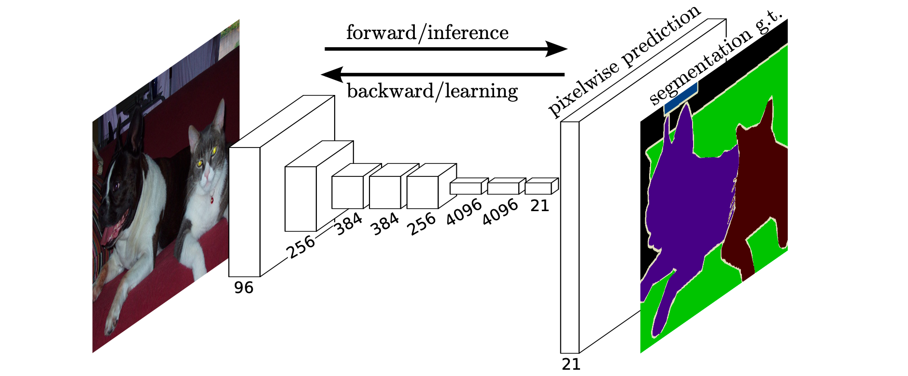

图 1. 全卷积网络可以有效地学习为每像素任务（如语义分割）进行密集预测。

>Figure 1. Fully convolutional networks can efficiently learn to make dense predictions for per-pixel tasks like semantic segmentation.

我们表明，在没有进一步机器的情况下，经过端到端、像素到像素训练的全卷积网络 (FCN) 在语义分割方面超过了现有技术。据我们所知，这是第一个端到端训练 FCN（1）进行像素预测和（2）来自监督预训练的工作。现有网络的完全卷积版本预测来自任意大小输入的密集输出。学习和推理都是通过密集的前馈计算和反向传播在整个图像时间执行的。网络内上采样层支持在具有子采样池的网络中进行像素级预测和学习。

> We show that a fully convolutional network (FCN) trained end-to-end, pixels-to-pixels on semantic segmentation exceeds the state-of-the-art without further machinery. To our knowledge, this is the first work to train FCNs end-to-end (1) for pixelwise prediction and (2) from supervised pre-training. Fully convolutional versions of existing networks predict dense outputs from arbitrary-sized inputs. Both learning and inference are performed whole-image-ata-time by dense feedforward computation and backpropagation. In-network upsampling layers enable pixelwise prediction and learning in nets with subsampled pooling.

这种方法在渐近和绝对方面都是有效的，并且排除了其他工作中复杂化的需要。 Patchwise 训练很常见 [27, 2, 7, 28, 9]，但缺乏全卷积训练的效率。我们的方法没有利用预处理和后处理的复杂性，包括超像素 [7, 15]、proposals [15, 13] 或随机场或局部分类器的事后细化 [7, 15]。我们的模型通过将分类网络重新解释为完全卷积并从其学习表示中微调，将最近在分类 [20、31、32] 方面的成功转移到密集预测。相比之下，以前的工作在没有监督预训练的情况下应用了小型卷积神经网络 [7, 28, 27]。

> This method is efficient, both asymptotically and absolutely, and precludes the need for the complications in other works. Patchwise training is common [27, 2, 7, 28, 9], but lacks the efficiency of fully convolutional training. Our approach does not make use of pre- and post-processing complications, including superpixels [7, 15], proposals [15, 13], or post-hoc refinement by random fields or local classifiers [7, 15]. Our model transfers recent success in classification [20, 31, 32] to dense prediction by reinterpreting classification nets as fully convolutional and fine-tuning from their learned representations. In contrast, previous works have applied small convnets without supervised pre-training [7, 28, 27].

语义分割面临语义和位置之间的内在对立：全局信息解决什么，而局部信息解决哪里。深度特征层次以非线性方式编码位置和语义局部到全局的金字塔。我们在第 4.2 节定义了一个跳过架构来利用这个特征谱，它结合了深层、粗略的语义信息和浅层、精细的外观信息（参见图 3）。

> Semantic segmentation faces an inherent tension between semantics and location: global information resolves what while local information resolves where. Deep feature hierarchies encode location and semantics in a nonlinear local-to-global pyramid. We define a skip architecture to take advantage of this feature spectrum that combines deep, coarse, semantic information and shallow, fine, appearance information in Section 4.2 (see Figure 3).

在下一节中，我们将回顾深度分类网络、FCN 的相关工作，以及最近使用卷积网络进行语义分割的方法。以下部分解释 FCN 设计和密集预测权衡，介绍我们的网络内上采样和多层组合架构，并描述我们的实验框架。最后，我们展示了 PASCAL VOC 2011-2、NYUDv2 和 SIFT Flow 的最新结果。

>In the next section, we review related work on deep classification nets, FCNs, and recent approaches to semantic segmentation using convnets. The following sections explain FCN design and dense prediction tradeoffs, introduce our architecture with in-network upsampling and multilayer combinations, and describe our experimental framework. Finally, we demonstrate state-of-the-art results on PASCAL VOC 2011-2, NYUDv2, and SIFT Flow.

## 2.Related work

我们的方法借鉴了深度网络最近在图像分类 [20, 31, 32] 和迁移学习 [3, 38] 方面取得的成功。迁移首先在各种视觉识别任务 [3, 38] 上进行了演示，然后在检测以及混合proposal分类器模型中的实例和语义分割 [10, 15, 13] 上进行了演示。我们现在重新构建和微调分类网络，以直接、密集地预测语义分割。我们绘制了 FCN 的空间，并在这个框架中定位了历史和最近的先前模型。

> Our approach draws on recent successes of deep nets for image classification [20, 31, 32] and transfer learning [3, 38]. Transfer was first demonstrated on various visual recognition tasks [3, 38], then on detection, and on both instance and semantic segmentation in hybrid proposal classifier models [10, 15, 13]. We now re-architect and finetune classification nets to direct, dense prediction of semantic segmentation. We chart the space of FCNs and situate prior models, both historical and recent, in this framework.

**全卷积网络** 据我们所知，将卷积网络扩展到任意大小的输入的想法首先出现在 Matan 等人中。 [26]，它扩展了经典的 LeNet [21] 以识别数字字符串。因为他们的网络仅限于一维输入字符串，Matan 等人。使用维特比解码来获得他们的输出。 Wolf 和 Platt [37] 将卷积网络的输出扩展到邮政地址块四个角的检测分数的二维映射。这两部历史著作都进行了完全卷积的推理和学习以进行检测。宁等人。 [27] 定义了一个卷积网络，用于对具有完全卷积推理的秀丽隐杆线虫组织进行粗略的多类分割。

> **Fully convolutional networks** To our knowledge, the idea of extending a convnet to arbitrary-sized inputs first appeared in Matan et al. [26], which extended the classic LeNet [21] to recognize strings of digits. Because their net was limited to one-dimensional input strings, Matan et al. used Viterbi decoding to obtain their outputs. Wolf and Platt [37] expand convnet outputs to 2-dimensional maps of detection scores for the four corners of postal address blocks. Both of these historical works do inference and learning fully convolutionally for detection. Ning et al. [27] define a convnet for coarse multiclass segmentation of C. elegans tissues with fully convolutional inference.

在当前的多层网络时代，也利用了全卷积计算。 Sermanet 等人的滑动窗口检测。 [29]，Pinheiro 和 Collobert [28] 的语义分割，以及 Eigen 等人的图像恢复。 [4] 进行完全卷积推理。完全卷积训练很少见，但被汤普森等人有效使用。 [35] 学习用于姿势估计的端到端部分检测器和空间模型，尽管他们没有展示或分析这种方法。

> Fully convolutional computation has also been exploited in the present era of many-layered nets. Sliding window detection by Sermanet et al. [29], semantic segmentation by Pinheiro and Collobert [28], and image restoration by Eigen et al. [4] do fully convolutional inference. Fully convolutional training is rare, but used effectively by Tompson et al. [35] to learn an end-to-end part detector and spatial model for pose estimation, although they do not exposit on or analyze this method.

或者，He等人[17]舍弃分类网络的非卷积部分以制作特征提取器。他们将proposal和空间金字塔池结合起来，产生一个局部的、固定长度的分类特征。虽然快速有效，但这种混合模型无法端到端学习。

> Alternatively, He et al. [17] discard the nonconvolutional portion of classification nets to make a feature extractor. They combine proposals and spatial pyramid pooling to yield a localized, fixed-length feature for classification. While fast and effective, this hybrid model cannot be learned end-to-end.

**使用卷积网络进行密集预测** 最近的几项工作已将卷积网络应用于密集预测问题，包括 Ning 等人的语义分割。 [27]，法拉贝特等人[7]和Pinheiro和Collobert[28]；Ciresan等人[2]对电子显微镜的边界预测和Ganin和Lempitsky[9]对自然图像的混合convnet/近邻模型的边界预测；以及Eigen等人[4，5]的图像恢复和深度估计。这些方法的共同要素包括:

>**Dense prediction with convnets** Several recent works have applied convnets to dense prediction problems, including semantic segmentation by Ning et al. [27], Farabet et al. [7], and Pinheiro and Collobert [28]; boundary prediction for electron microscopy by Ciresan et al. [2] and for natural images by a hybrid convnet/nearest neighbor model by Ganin and Lempitsky [9]; and image restoration and depth estimation by Eigen et al. [4, 5]. Common elements of these approaches include

- 小模型限制容量和感受野。
- patchwise训练[27, 2, 7, 28, 9]。
- 通过超级像素投影、随机场、正则化、过滤或局部分类等方式进行后处理
正则化、过滤或局部分类的后处理[7, 2, 9]。
- 输入移位和输出交错的密集输出[29,
28, 9];
- 多尺度金字塔处理[7, 28, 9]。
- 饱和tanh非线性[7, 4, 28]；以及
- 集成[2, 9]。

> • small models restricting capacity and receptive fields;
>• patchwise training [27, 2, 7, 28, 9];
>• post-processing by superpixel projection, random field
>regularization, filtering, or local classification [7, 2, 9];
>• input shifting and output interlacing for dense output [29,
>28, 9];
>• multi-scale pyramid processing [7, 28, 9];
>• saturating tanh nonlinearities [7, 4, 28]; and
>• ensembles [2, 9],

而我们的方法则没有这种机制。然而，我们确实从FCN的角度研究了patchwise训练3.4和 "移位和缝合 "密集输出3.2。我们还讨论了网络内上采样3.3，其中Eigen等人的完全连接预测[5]是一个特例。

>whereas our method does without this machinery. However, we do study patchwise training 3.4 and “shift-and-stitch” dense output 3.2 from the perspective of FCNs. We also discuss in-network upsampling 3.3, of which the fully connected prediction by Eigen et al. [5] is a special case.

与这些现有的方法不同，我们改编和扩展了深度分类架构，将图像分类作为有监督的预训练，并以完全卷积的方式进行微调，从整个图像输入和整个图像的基础上进行简单而有效的学习。

> Unlike these existing methods, we adapt and extend deep classification architectures, using image classification as supervised pre-training, and fine-tune fully convolutionally to learn simply and efficiently from whole image inputs and whole image ground thruths.

Hariharan等人[15]和Gupta等人[13]也同样将深度分类网适应于语义分割，但在混合建议-分类器模型中这样做。这些方法通过对检测、语义分割和实例分割的边界盒和/或区域建议进行采样，对R-CNN系统[10]进行微调。这两种方法都不是端到端的学习。它们分别在PASCAL VOC和NYUDv2上取得了最先进的分割结果，因此我们在第5节中直接将我们独立的、端到端的FCN与它们的语义分割结果进行比较。

> Hariharan et al. [15] and Gupta et al. [13] likewise adapt deep classification nets to semantic segmentation, but do so in hybrid proposal-classifier models. These approaches fine-tune an R-CNN system [10] by sampling bounding boxes and/or region proposals for detection, semantic segmentation, and instance segmentation. Neither method is learned end-to-end. They achieve state-of-the-art segmentation results on PASCAL VOC and NYUDv2 respectively, so we directly compare our standalone, end-to-end FCN to their semantic segmentation results in Section 5.

我们融合了各层的特征，以定义一个非线性的从局部到整体的表示，我们对其进行端到端的调整。在临时工作中，Hariharan等人[16]也在他们的混合模型中使用了多个层，用于语义分割。

>We fuse features across layers to define a nonlinear localto-global representation that we tune end-to-end. In contemporary work Hariharan et al. [16] also use multiple layers in their hybrid model for semantic segmentation.

## 3. Fully convolutional networks

卷积网络中的每一层数据都是一个大小为 h x w x d 的三维数组，其中 h 和 w 是空间维度，d 是特征或通道维度。通道尺寸。第一层图像，像素大小为 h x w，和 d 个颜色通道。较高层中的位置对应于路径连接到的图像中的位置，称为感受野。

> Each layer of data in a convnet is a three-dimensional array of size h × w × d, where h and w are spatial dimen- sions, and d is the feature or channel dimension. The first layer is the image, with pixel size h × w, and d color chan- nels. Locations in higher layers correspond to the locations in the image they are path-connected to, which are called their *receptive fields*.

卷积网络建立在平移不变性之上。它们的基本组件（卷积、池化和激活函数）在局部输入区域上运行，并且仅依赖于相对空间坐标。将 

 写入特定层中位置 (i, j) 的数据向量，并将 

 写入后续层，这些函数计算输出

为：

>Convnets are built on translation invariance. Their ba- sic components (convolution, pooling, and activation func- tions) operate on local input regions, and depend only on *relative* spatial coordinates. Writing xij for the data vector at location (i, j) in a particular layer, and yij for the follow-ing layer, these functions compute outputs yij by

其中 k 称为内核大小，s 是步幅或子采样因子，

 确定层类型：卷积或平均池化的矩阵乘法，最大池化的空间最大值，或激活函数的元素非线性，等其他类型的层。

> where k is called the kernel size, s is the stride or subsam- pling factor, and fks determines the layer type: a matrix multiplication for convolution or average pooling, a spatial max for max pooling, or an elementwise nonlinearity for an activation function, and so on for other types of layers.

这种函数形式在组合下保持不变，内核大小和步幅遵循变换规则

> This functional form is maintained under composition, with kernel size and stride obeying the transformation rule

虽然一般的深度网络计算一般的非线性函数，但只有这种形式的层的网络计算非线性滤波器，我们称之为深度滤波器或全卷积网络。 FCN 自然地对任何大小的输入进行操作，并产生相应（可能重新采样）空间维度的输出。

> While a general deep net computes a general nonlinear function, a net with only layers of this form computes a nonlinear filter, which we call a deep filter or fully convolutional network. An FCN naturally operates on an input of any size, and produces an output of corresponding (possibly resampled) spatial dimensions.

由 FCN 组成的实值损失函数定义了一个任务。如果损失函数是最后一层空间维度的总和，
=\sum_{i%20j}%20\ell^{\prime}\left(\mathbf{x}_{i%20j}%20;%20\theta\right))
，则其梯度将是其每个空间分量的梯度的总和。因此，在整个图像上计算的 上的随机梯度下降

将与 

上的随机梯度下降相同，将所有最后一层的感受野作为一个小批量。

> A real-valued loss function composed with an FCN defines a task. If the loss function is a sum Pover the spatial dimensions of the final layer, (x; ✓) = ij 0 (xij ; ✓), its gradient will be a sum over the gradients of each of its spatial components. Thus stochastic gradient descent on computed on whole images will be the same as stochastic gradient descent on `0 , taking all of the final layer receptive fields as a minibatch.

当这些感受野显着重叠时，前馈计算和反向传播在整个图像上逐层计算而不是独立地逐小块计算时效率更高。

> When these receptive fields overlap significantly, both feedforward computation and backpropagation are much more efficient when computed layer-by-layer over an entire image instead of independently patch-by-patch.

接下来，我们将解释如何将分类网络转换为产生粗略输出图的完全卷积网络。对于逐像素预测，我们需要将这些粗略输出连接回像素。第 3.2 节描述了一个技巧，为此目的引入的快速扫描 [11]。我们通过将其重新解释为等效的网络修改来深入了解这一技巧。作为一种有效的替代方案，我们在第 3.3 节中引入了用于上采样的反卷积层。在 3.4 节中，我们考虑通过逐个小块采样进行训练，并在 4.3 节中证明我们的整个图像训练更快且同样有效。

> We next explain how to convert classification nets into fully convolutional nets that produce coarse output maps. For pixelwise prediction, we need to connect these coarse outputs back to the pixels. Section 3.2 describes a trick, fast scanning [11], introduced for this purpose. We gain insight into this trick by reinterpreting it as an equivalent network modification. As an efficient, effective alternative, we introduce deconvolution layers for upsampling in Section 3.3. In Section 3.4 we consider training by patchwise sampling, and give evidence in Section 4.3 that our whole image training is faster and equally effective.

### 3.1. Adapting classifiers for dense prediction

为密集预测调整分类器典型的识别网络，包括 LeNet [21]、AlexNet [20] 及其更深层次的继任者 [31、32]，表面上采用固定大小的输入并产生非空间输出。这些网络的全连接层具有固定的维度并丢弃了空间坐标。然而，这些全连接层也可以被视为具有覆盖其整个输入区域的内核的卷积。这样做会将它们转换为完全卷积的网络，该网络接受任何大小的输入和输出分类图。这种转换如图 2 所示。

>Adapting classifiers for dense prediction Typical recognition nets, including LeNet [21], AlexNet [20], and its deeper successors [31, 32], ostensibly take fixed-sized inputs and produce non-spatial outputs. The fully connected layers of these nets have fixed dimensions and throw away spatial coordinates. However, these fully connected layers can also be viewed as convolutions with kernels that cover their entire input regions. Doing so casts them into fully convolutional networks that take input of any size and output classification maps. This transformation is illustrated in Figure 2.

图 2. 将全连接层转换为卷积层使分类网络能够输出热图。添加层和空间损失（如图 1 所示）为端到端密集学习产生了高效的机器。

>Figure 2. Transforming fully connected layers into convolution layers enables a classification net to output a heatmap. Adding layers and a spatial loss (as in Figure 1) produces an efficient machine for end-to-end dense learning.

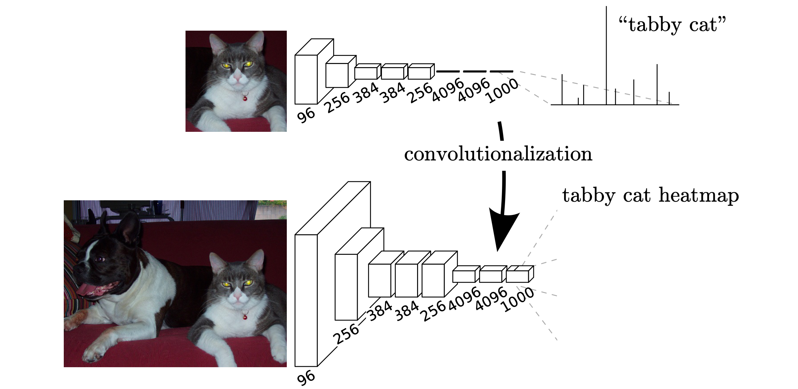

图2. 将全连接层转换为卷积层，使一个分类网能够输出热图。添加层和空间损失（如图1）产生了一个高效的端到端密集学习的模型。

> Figure 2. Transforming fully connected layers into convolution layers enables a classification net to output a heatmap. Adding layers and a spatial loss (as in Figure 1) produces an efficient ma- chine for end-to-end dense learning.

此外，虽然生成的特征图等效于对特定输入块上的原始网络的评估，但计算在这些块的重叠区域上高度摊销。例如，虽然 AlexNet 需要 1.2 毫秒（在典型的 GPU 上）来推断 227x227 图像的分类分数，但完卷积网络需要 22 毫秒才能从 500x500 图像中生成 10x10 网格的输出，这比原生的方法快 5 倍以上。

> Furthermore, while the resulting maps are equivalent to the evaluation of the original net on particular input patches, the computation is highly amortized over the overlapping regions of those patches. For example, while AlexNet takes 1.2 ms (on a typical GPU) to infer the classification scores of a 227x227 image, the fully convolutional net takes 22 ms to produce a 10x10 grid of outputs from a 500x500 image, which is more than 5 times faster than the na¨ıve approach1 .

这些卷积模型的空间输出图使它们成为语义分割等密集问题的自然选择。由于每个输出单元都可以使用ground truth，前向和后向传递都非常简单，并且都利用了卷积的固有计算效率（和极好的优化）。 AlexNet 示例的相应反向时间对于单个图像为 2.4 毫秒，对于完全卷积的 10x10 输出映射为 37 毫秒，从而产生类似于前向传递的加速。

> The spatial output maps of these convolutionalized models make them a natural choice for dense problems like semantic segmentation. With ground truth available at every output cell, both the forward and backward passes are straightforward, and both take advantage of the inherent computational efficiency (and aggressive optimization) of convolution. The corresponding backward times for the AlexNet example are 2.4 ms for a single image and 37 ms for a fully convolutional 10 x 10 output map, resulting in a speedup similar to that of the forward pass.

虽然我们将分类网络重新解释为完全卷积会为任何大小的输入生成输出图，但输出维度通常会通过子采样来减少。分类网络下采样以保持过滤器小且计算要求合理。这会粗化这些网络的完全卷积版本的输出，将其从输入的大小减小一个因子倍，该因子等于输出单元的感受野的像素步长。

>While our reinterpretation of classification nets as fully convolutional yields output maps for inputs of any size, the output dimensions are typically reduced by subsampling. The classification nets subsample to keep filters small and computational requirements reasonable. This coarsens the output of a fully convolutional version of these nets, reducing it from the size of the input by a factor equal to the pixel stride of the receptive fields of the output units.

### 3.2. Shift-and-stitch is filter rarefaction

通过将输入的移位版本的输出拼接在一起，可以从粗略输出中获得密集预测。如果输出被 f 因子下采样，则将输入 x 像素向右移动并向下移动 y 像素，每
)
 s.t. 

。处理这

 个输入中的每一个，并对输出进行交错处理，以便预测对应于其感受野中心的像素。

> Dense predictions can be obtained from coarse outputs by stitching together output from shifted versions of the input. If the output is downsampled by a factor of f , shift the input x pixels to the right and y pixels down, once for every (x, y) s.t. 0  x, y < f . Process each of these f 2 inputs, and interlace the outputs so that the predictions correspond to the pixels at the centers of their receptive fields.

尽管执行这种转换会自然地将成本增加 

 倍，但有一个众所周知的技巧可以有效地产生相同的结果 [11, 29]，小波社区称为 a` trous 算法 [25]。考虑具有输入步幅 s 的层（卷积或池化），以及具有滤波器权重 

 的后续卷积层（省略不相关的特征维度）。将较低层的输入步幅设置为 1 会将其输出上采样 s 倍。但是，将原始滤波器与上采样输出进行卷积不会产生与移位拼接相同的结果，因为原始滤波器只看到其（现在上采样）输入的缩减部分。为了重现这个技巧，通过将过滤器扩大为如下来稀释过滤器

>Although performing this transformation na¨ıvely increases the cost by a factor of f 2 , there is a well-known trick for efficiently producing identical results [11, 29] known to the wavelet community as the a` trous algorithm [25]. Consider a layer (convolution or pooling) with input stride s, and a subsequent convolution layer with filter weights fij (eliding the irrelevant feature dimensions). Setting the lower layer’s input stride to 1 upsamples its output by a factor of s. However, convolving the original filter with the upsampled output does not produce the same result as shift-and-stitch, because the original filter only sees a reduced portion of its (now upsampled) input. To reproduce the trick, rarefy the filter by enlarging it as 0 fij =

（i 和 j 从零开始）。重现该技巧的完整净输出涉及逐层重复此过滤器放大，直到删除所有子采样。 （实际上，这可以通过处理上采样输入的下采样版本来有效地完成。）

> (with i and j zero-based). Reproducing the full net output of the trick involves repeating this filter enlargement layerby-layer until all subsampling is removed. (In practice, this can be done efficiently by processing subsampled versions of the upsampled input.)

在网络中减少下采样是一种折衷：过滤器可以看到更精细的信息，但感受野更小，计算时间更长。 shift-and-stitch 技巧是另一种权衡：在不减小过滤器的感受野大小的情况下输出更密集，但禁止过滤器访问比其原始设计更精细的信息。

> Decreasing subsampling within a net is a tradeoff: the filters see finer information, but have smaller receptive fields and take longer to compute. The shift-and-stitch trick is another kind of tradeoff: the output is denser without decreasing the receptive field sizes of the filters, but the filters are prohibited from accessing information at a finer scale than their original design.

尽管我们已经对这个技巧进行了初步实验，但我们并没有在我们的模型中使用它。正如下一节所述，我们发现通过上采样进行学习更加有效和高效，尤其是在与稍后描述的跳过层融合结合使用时。

> Although we have done preliminary experiments with this trick, we do not use it in our model. We find learning through upsampling, as described in the next section, to be more effective and efficient, especially when combined with the skip layer fusion described later on.

### 3.3. Upsampling is backwards strided convolution

将粗略输出连接到密集像素的另一种方法是插值。例如，简单的双线性插值通过线性映射从最近的四个输入计算每个输出 

，该线性映射仅取决于输入和输出单元的相对位置。

> Another way to connect coarse outputs to dense pixels is interpolation. For instance, simple bilinear interpolation computes each output yij from the nearest four inputs by a linear map that depends only on the relative positions of the input and output cells.

从某种意义上说，使用因子 f 进行上采样是小数输入步幅为 1/f 的卷积。只要 f 是整数，一种自然的上采样方式就是反向卷积（有时称为反卷积），输出步幅为 f。这样的操作实现起来很简单，因为它只是反转卷积的前向和后向传递。因此，通过像素损失的反向传播，在网络中执行上采样以进行端到端学习。

> In a sense, upsampling with factor f is convolution with a fractional input stride of 1/f . So long as f is integral, a natural way to upsample is therefore backwards convolution (sometimes called deconvolution) with an output stride of f . Such an operation is trivial to implement, since it simply reverses the forward and backward passes of convolution. Thus upsampling is performed in-network for end-to-end learning by backpropagation from the pixelwise loss.

请注意，此类层中的反卷积滤波器不需要固定（例如，双线性上采样），而是可以学习。一堆反卷积层和激活函数甚至可以学习非线性上采样。

>Note that the deconvolution filter in such a layer need not be fixed (e.g., to bilinear upsampling), but can be learned. A stack of deconvolution layers and activation functions can even learn a nonlinear upsampling.

在我们的实验中，我们发现网络内上采样对于学习密集预测是快速有效的。我们最好的分割架构使用这些层来学习上采样以在第 4.2 节中进行精确预测。

>In our experiments, we find that in-network upsampling is fast and effective for learning dense prediction. Our best segmentation architecture uses these layers to learn to upsample for refined prediction in Section 4.2.

### 3.4. Patchwise training is loss sampling

在随机优化中，梯度计算由训练分布驱动。逐块训练和完全卷积训练都可以产生任何分布，尽管它们的相对计算效率取决于重叠和小批量大小。全图像全卷积训练与逐块训练相同，其中每个批次由图像（或图像集合）损失下方单元的所有感受野组成。虽然这比逐块的统一采样更有效，但它减少了可能的批次数量。但是，可以简单地恢复图像内的随机选择块。将损失限制在其空间项的随机采样子集（或等效地在输出和损失之间应用 DropConnect 掩码 [36]）会从梯度计算中排除逐块。

> In stochastic optimization, gradient computation is driven by the training distribution. Both patchwise training and fully convolutional training can be made to produce any distribution, although their relative computational efficiency depends on overlap and minibatch size. Whole image fully convolutional training is identical to patchwise training where each batch consists of all the receptive fields of the units below the loss for an image (or collection of images). While this is more efficient than uniform sampling of patches, it reduces the number of possible batches. However, random selection of patches within an image may be recovered simply. Restricting the loss to a randomly sampled subset of its spatial terms (or, equivalently applying a DropConnect mask [36] between the output and the loss) excludes patches from the gradient computation.

如果保留的逐块仍然有很大的重叠，完全卷积计算仍然会加速训练。如果梯度在多个反向传递中累积，批次可以包括来自多个图像的逐块。

> If the kept patches still have significant overlap, fully convolutional computation will still speed up training. If gradients are accumulated over multiple backward passes, batches can include patches from several images.

逐块训练中的采样可以纠正类不平衡 [27,7,2] 并减轻密集逐块的空间相关性 [28,15]。在全卷积训练中，类平衡也可以通过对损失加权来实现，损失采样可以用来解决空间相关性。

> Sampling in patchwise training can correct class imbalance [27, 7, 2] and mitigate the spatial correlation of dense patches [28, 15]. In fully convolutional training, class balance can also be achieved by weighting the loss, and loss sampling can be used to address spatial correlation.

我们在 4.3 节探讨了采样训练，并没有发现它为密集预测产生更快或更好的收敛。整幅图像训练有效且高效。

>We explore training with sampling in Section 4.3, and do not find that it yields faster or better convergence for dense prediction. Whole image training is effective and efficient.

## 4.Segmentation Architecture

我们将 ILSVRC 分类器转换为 FCN，并通过网络内上采样和像素损失来增强它们以进行密集预测。我们通过微调来训练分割。接下来，我们在层之间添加跳跃以融合粗略的、语义和局部的外观信息。

> We cast ILSVRC classifiers into FCNs and augment them for dense prediction with in-network upsampling and a pixelwise loss. We train for segmentation by fine-tuning. Next, we add skips between layers to fuse coarse, semantic and local, appearance information. This skip architecture is learned end-to-end to refine the semantics and spatial precision of the output.

这种跳过架构是端到端学习的，以改进输出的语义和空间精度。对于本次调查，我们在 PASCAL VOC 2011 分割挑战 [6] 上进行训练和验证。我们使用每像素多项式逻辑损失进行训练，并使用平均像素交集而不是联合的标准度量进行验证，其中包括背景在内的所有类别均采用平均值。训练忽略了在ground-truth中被掩盖（模糊或困难）的像素。

> For this investigation, we train and validate on the PASCAL VOC 2011 segmentation challenge [6]. We train with a per-pixel multinomial logistic loss and validate with the standard metric of mean pixel intersection over union, with the mean taken over all classes, including background. The training ignores pixels that are masked out (as ambiguous or difficult) in the ground truth.

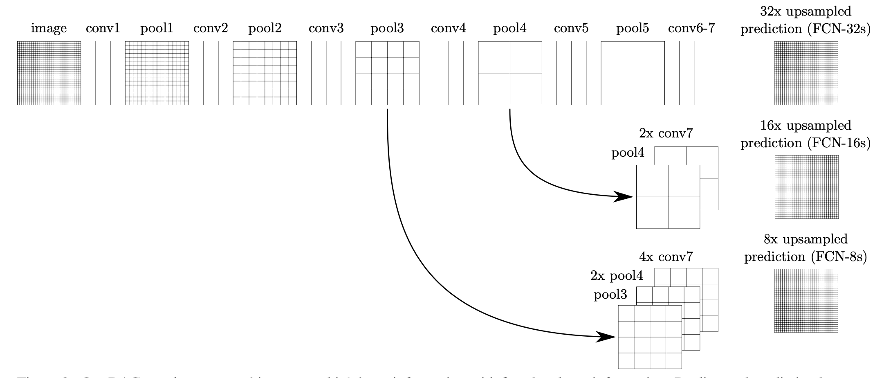

图3. 我们的DAG网学会了将粗的、高层次的信息与细的、低层次的信息相结合。池化和预测层显示为网格，揭示了相对的空间粗度，而中间层显示为垂直线。第一行（FCN-32s）。我们的单流网，如第4.1节所述，在一个步骤中把跨度为32的预测值向上采样到像素。第二行（FCN-16s）。结合最后一层和池化4层的预测，使用第16步距，我们的网络可以预测更精细的细节，同时保留高级语义的信息。第三行（FCN-8s）。来自pool3的额外预测，使用8步距，提供进一步的精度。

>Figure 3. Our DAG nets learn to combine coarse, high layer informatation with fine,low layer information. Pooling and prediction layers are shown as grids that reveal relative spatial coarseness, while intermediate layers are shown as vertical lines. First row (FCN-32s): Our single- stream net, described in Section 4.1, upsamples stride 32 predictions back to pixels in a single step. Second row (FCN-16s): Combining predictions from both the final layer and the pool4 layer, at stride 16, lets our net predict finer details, while retaining high-level semantic information. Third row (FCN-8s): Additional predictions from pool3，at stride 8, provide further precision.

### 4.1. From classifier to dense FCN

我们首先将经过验证的分类架构进行卷积，如第 3 节所述。我们考虑赢得 ILSVRC12 的 AlexNet3 架构 [20]，以及在 ILSVRC14 中表现出色的 VGG 网络 [31] 和 GoogLeNet [32] .我们选择了 VGG 16 层网络，我们发现它与这个任务中的 19 层网络等效。对于 GoogLeNet，我们只使用最终的损失层，并通过丢弃最终的平均池化层来提高性能。我们通过丢弃最终的分类器层来斩首每个网络，并将所有完全连接的层转换为卷积。我们附加一个通道维度为 21 的 1 x 1 卷积来预测每个粗略输出位置的每个 PASCAL 类（包括背景）的分数，然后是一个反卷积层，以将粗略输出双线性上采样到像素密集输出，如所述在第 3.3 节中。表 1 比较了初步验证结果以及每个网络的基本特征。我们报告了以固定学习率（至少 175 个 epoch）收敛后取得的最佳结果。

> We begin by convolutionalizing proven classification architectures as in Section 3. We consider the AlexNet3 architecture [20] that won ILSVRC12, as well as the VGG nets [31] and the GoogLeNet4 [32] which did exceptionally well in ILSVRC14. We pick the VGG 16-layer net5 , which we found to be equivalent to the 19-layer net on this task. For GoogLeNet, we use only the final loss layer, and improve performance by discarding the final average pooling layer. We decapitate each net by discarding the final classifier layer, and convert all fully connected layers to convolutions. We append a 1 x 1 convolution with channel dimension 21 to predict scores for each of the PASCAL classes (including background) at each of the coarse output locations, followed by a deconvolution layer to bilinearly upsample the coarse outputs to pixel-dense outputs as described in Section 3.3. Table 1 compares the preliminary validation results along with the basic characteristics of each net. We report the best results achieved after convergence at a fixed learning rate (at least 175 epochs).

从分类到分割的微调为每个网络提供了合理的预测。即使是最差的模型也达到了最先进性能的 ~ 75%。配备分割的 VGG 网络 (FCN-VGG16) 已经似乎是最先进的，val 的平均 IU 为 56.0，而测试中的平均 IU 为 52.6 [15]。对额外数据的训练将 FCN-VGG16 的平均 IU 提高到 59.4，FCN-AlexNet 在 val 的子集上提高到 48.0 的平均 IU。尽管分类精度相似，但我们的 GoogLeNet 实现与 VGG16 分割结果不匹配。

>Fine-tuning from classification to segmentation gave reasonable predictions for each net. Even the worst model achieved ⇠ 75% of state-of-the-art performance. The segmentation-equipped VGG net (FCN-VGG16) already appears to be state-of-the-art at 56.0 mean IU on val, compared to 52.6 on test [15]. Training on extra data raises FCN-VGG16 to 59.4 mean IU and FCN-AlexNet to 48.0 mean IU on a subset of val7 . Despite similar classification accuracy, our implementation of GoogLeNet did not match the VGG16 segmentation result.

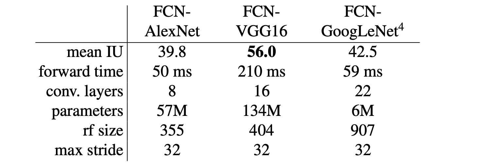

表1. 我们调整和扩展了三个分类卷积网络。我们通过PASCAL VOC 2011的估值集上的平均交集和推理时间（在NVIDIA Tesla K40c上对500×500的输入进行了20次试验的平均值）来比较性能。我们详细介绍了关于密集预测的适应性网络的结构：参数层的数量、输出单元的感受野大小和网络内最粗的步幅。(这些数字给出了在固定学习率下获得的最佳性能，而不是可能的最佳性能）。

> Table 1. We adapt and extend three classification convnets. We compare performance by mean intersection over union on the vali- dation set of PASCAL VOC 2011 and by inference time (averaged over 20 trials for a 500 × 500 input on an NVIDIA Tesla K40c). We detail the architecture of the adapted nets with regard to dense prediction: number of parameter layers, receptive field size of out- put units, and the coarsest stride within the net. (These numbers give the best performance obtained at a fixed learning rate, not best performance possible.)

### 4.2. Combining what and where

我们定义了一个新的全卷积网（FCN）用于分离，它结合了特征层次结构的各层，并完善了输出的空间精度。见图3。

>We define a new fully convolutional net (FCN) for segmentation that combines layers of the feature hierarchy and refines the spatial precision of the output. See Figure 3.

虽然如4.1所示，完全卷积化的分类器可以对分割进行微调，甚至在标准指标上得分很高，但其输出却令人不满地粗糙（见图4）。最后预测层的32像素跨度限制了上采样输出中的细节规模。

>While fully convolutionalized classifiers can be fine-tuned to segmentation as shown in 4.1, and even score highly on the standard metric, their output is dissatisfyingly coarse (see Figure 4). The 32 pixel stride at the final prediction layer limits the scale of detail in the upsampled output.

我们通过添加跳过 [1] 来解决这个问题，该跳过将最终预测层与具有更精细步幅的较低层相结合。这会将线拓扑转换为 DAG，其边缘从较低层向前跳到较高层（图 3）。当他们看到更少的像素时，更精细的预测应该需要更少的层，因此从较浅的网络输出中制作它们是有意义的。结合精细层和粗糙层，模型可以做出尊重全局结构的局部预测。通过类比 Koenderick 和 van Doorn [19] 的jet，我们将非线性特征层次结构称为深度jet。

> We address this by adding skips [1] that combine the final prediction layer with lower layers with finer strides. This turns a line topology into a DAG, with edges that skip ahead from lower layers to higher ones (Figure 3). As they see fewer pixels, the finer scale predictions should need fewer layers, so it makes sense to make them from shallower net outputs. Combining fine layers and coarse layers lets the model make local predictions that respect global structure. By analogy to the jet of Koenderick and van Doorn [19], we call our nonlinear feature hierarchy the deep jet.

我们首先通过从 16 像素步幅层进行预测，将输出步幅分成两半。我们在 pool4 之上添加一个 1 x 1 卷积层以产生额外的类预测。我们通过添加一个 2x 上采样层并对两个预测求和，将这个输出与在步幅 32 上在 conv7（卷积 fc7）上计算的预测融合（见图 3）。我们将 2x 上采样初始化为双线性插值，但允许如第 3.3 节所述学习参数。最后，将步长 16 的预测上采样回图像。我们称此网络为 FCN-16s。 FCN-16s 是端到端学习的，使用最后一个较粗的网络（我们现在将其称为 FCN-32s）的参数进行初始化。作用在 pool4 上的新参数被初始化为零，以便网络以未修改的预测开始。学习率降低了 100 倍。

> We first divide the output stride in half by predicting from a 16 pixel stride layer. We add a 1 x 1 convolution layer on top of pool4 to produce additional class predictions. We fuse this output with the predictions computed on top of conv7 (convolutionalized fc7) at stride 32 by adding a 2x upsampling layer and summing6 both predictions (see Figure 3). We initialize the 2x upsampling to bilinear interpolation, but allow the parameters to be learned as described in Section 3.3. Finally, the stride 16 predictions are upsampled back to the image. We call this net FCN-16s. FCN-16s is learned end-to-end, initialized with the parameters of the last, coarser net, which we now call FCN-32s. The new parameters acting on pool4 are zeroinitialized so that the net starts with unmodified predictions. The learning rate is decreased by a factor of 100.

学习这个跳跃网络将验证集的性能提高了 3.0 平均 IU 到 62.4。图 4 显示了输出精细结构的改进。我们将这种融合与仅从 pool4 层进行学习进行了比较，这会导致性能不佳，并且在不添加跳跃的情况下简单地降低学习率，从而导致性能提升微不足道而没有提高输出质量。

> Learning this skip net improves performance on the validation set by 3.0 mean IU to 62.4. Figure 4 shows improvement in the fine structure of the output. We compared this fusion with learning only from the pool4 layer, which resulted in poor performance, and simply decreasing the learning rate without adding the skip, which resulted in an insignificant performance improvement without improving the quality of the output.

我们继续以这种方式融合来自 pool3 的预测与来自 pool4 和 conv7 的预测融合的 2x 上采样，构建网络 FCN-8。我们获得了对 62.7 平均 IU 的微小额外改进，并发现输出的平滑度和细节略有改进。在这一点上，我们的融合改进已经遇到收益递减，无论是关于强调大规模正确性的 IU 指标，还是在可见的改进方面，例如在图 4 中，因此我们不会继续融合更低的层。

> We continue in this fashion by fusing predictions from pool3 with a 2x upsampling of predictions fused from pool4 and conv7, building the net FCN-8s. We obtain a minor additional improvement to 62.7 mean IU, and find a slight improvement in the smoothness and detail of our output. At this point our fusion improvements have met diminishing returns, both with respect to the IU metric which emphasizes large-scale correctness, and also in terms of the improvement visible e.g. in Figure 4, so we do not continue fusing even lower layers.

**通过其他方式优化** 减少池化层的步幅是获得更精细预测的最直接方法。然而，这样做对于我们基于 VGG16 的网络来说是有问题的。将 pool5 步长设置为 1 要求我们的卷积 fc6 的内核大小为 14 x 14 来保持其感受野大小。除了它们的计算成本之外，我们还很难学习如此大的过滤器。我们尝试使用更小的过滤器重新构建 pool5 之上的层，但没有达到可比的性能；一种可能的解释是上层的 ILSVRC 初始化很重要。

> **Refinement by other means** Decreasing the stride of pooling layers is the most straightforward way to obtain finer predictions. However, doing so is problematic for our VGG16-based net. Setting the pool5 stride to 1 requires our convolutionalized fc6 to have kernel size 14 x 14 to maintain its receptive field size. In addition to their computational cost, we had difficulty learning such large filters. We attempted to re-architect the layers above pool5 with smaller filters, but did not achieve comparable performance; one possible explanation is that the ILSVRC initialization of the upper layers is important.

另一种获得更精细预测的方法是使用第 3.2 节中描述的 shift-and-stitch 技巧。在有限的实验中，我们发现这种方法的成本改进比比层融合差。

> Another way to obtain finer predictions is to use the shiftand-stitch trick described in Section 3.2. In limited experiments, we found the cost to improvement ratio from this method to be worse than layer fusion.

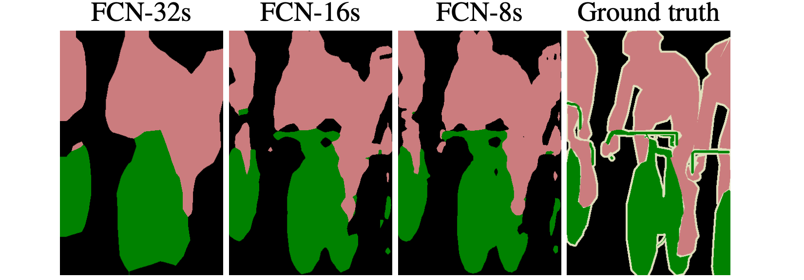

图4. 通过融合不同步长的层的信息来完善全卷积网，改善了分割的细节。前三张图片显示了我们的32、16和8像素步长网络的输出（见图3）。

>Figure 4. Refining fully convolutional nets by fusing information from layers with different strides improves segmentation detail. The first three images show the output from our 32, 16, and 8 pixel stride nets (see Figure 3).

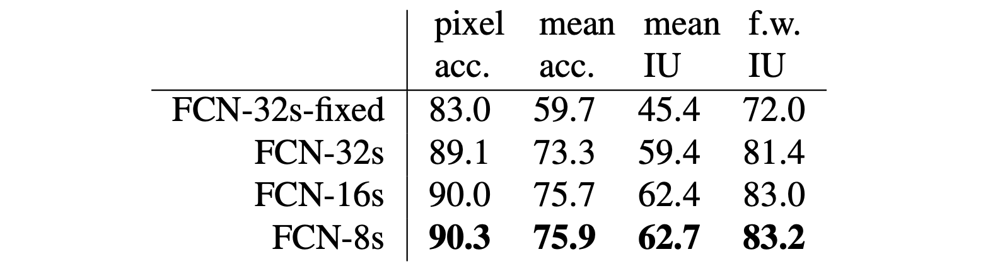

表2. 在PASCAL VOC 2011 segval的一个子集上的跳过FCN的比较。除FCN-32s-fixed 只有最后一层是微调的外，其他的学习都是端到端的。请注意，FCN-32s是FCN- VGG16，重新命名以突出stride。

> Table 2. Comparison of skip FCNs on a subset7 of PASCAL VOC 2011 segval. Learning is end-to-end, except for FCN-32s-fixed, where only the last layer is fine-tuned. Note that FCN-32s is FCN- VGG16, renamed to highlight stride.

### 4.3. Experimental framework

**优化 **我们用 SGD 训练，带有动量。我们对 FCN-AlexNet、FCN-VGG16 和 FCN-GoogLeNet 分别使用 20 张图像的小批量大小和

 、

 和 

 的固定学习率，通过线搜索选择。我们使用 0.9 的动量，

或 

的权重衰减，并将偏差学习率加倍，尽管我们发现训练仅对学习率很敏感。我们对类评分层进行零初始化，因为随机初始化既没有产生更好的性能，也没有产生更快的收敛。在原始分类器网络中使用的地方包含了 Dropout。

> We train by SGD with momentum. We use a minibatch size of 20 images and fixed learning rates of 10 3 , 10 4 , and 5 5 for FCN-AlexNet, FCN-VGG16, and FCN-GoogLeNet, respectively, chosen by line search. We use momentum 0.9, weight decay of 5 4 or 2 4 , and doubled learning rate for biases, although we found training to be sensitive to the learning rate alone. We zero-initialize the class scoring layer, as random initialization yielded neither better performance nor faster convergence. Dropout was included where used in the original classifier nets.

**微调** 我们通过整个网络的反向传播微调所有层。与表 2 相比，单独微调输出分类器仅产生完整微调性能的 70%。考虑到学习基本分类网络所需的时间，从头开始训练是不可行的。 （请注意，VGG 网络是分阶段训练的，而我们从完整的 16 层初始化）微调 FCN-32s 版本在单个 GPU 上进行微调需要三天，升级到 FCN-16s 和 FCN-8s 版本大约需要一天时间。

>**Fine-tuning** We fine-tune all layers by backpropagation through the whole net. Fine-tuning the output classifier alone yields only 70% of the full finetuning performance as compared in Table 2. Training from scratch is not feasible considering the time required to learn the base classification nets. (Note that the VGG net is trained in stages, while we initialize from the full 16-layer version.) Fine-tuning takes three days on a single GPU for the coarse FCN-32s version, and about one day each to upgrade to the FCN-16s and FCN-8s versions.

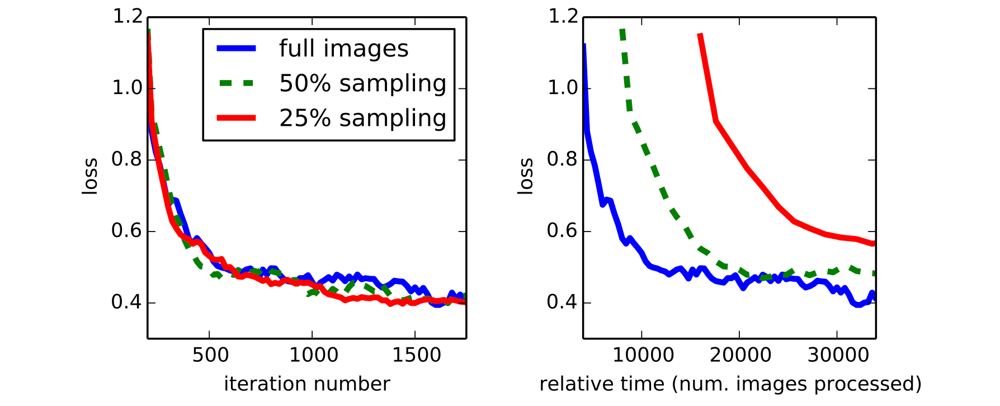

图 5. 对整个图像的训练与采样逐块一样有效，但通过更有效地利用数据导致更快的（wall time）收敛。左图显示了对于固定的预期批量大小，采样对收敛速度的影响，而右图通过相对wall time绘制了相同的图。

>Figure 5. Training on whole images is just as effective as sampling patches, but results in faster (wall time) convergence by making more efficient use of data. Left shows the effect of sampling on convergence rate for a fixed expected batch size, while right plots the same by relative wall time.

**更多训练数据** PASCAL VOC 2011 分割训练集标注了 1112 张图像。哈里哈兰等人。 [14] 为一组更大的 8498 个 PASCAL 训练图像收集了标签，用于训练之前的状态系统，SDS [15]。该训练数据将 FCNVGG16 验证分数 7 提高了 3.4 个点，平均 IU 为 59.4。

> **More Training Data** The PASCAL VOC 2011 segmentation training set labels 1112 images. Hariharan et al. [14] collected labels for a larger set of 8498 PASCAL training images, which was used to train the previous state-of-theart system, SDS [15]. This training data improves the FCNVGG16 validation score7 by 3.4 points to 59.4 mean IU.

**Patch Sampling** 如 3.4 节所述，我们的全图像训练有效地将每张图像批处理成一个规则的大网格，重叠的逐块。相比之下，先前的工作在整个数据集 [27、2、7、28、9] 上随机采样逐块，可能会导致更高的方差批次，从而加速收敛 [22]。我们通过以前面描述的方式对损失进行空间采样来研究这种权衡，做出一个独立的选择，以一定的概率 1-p 忽略每个最终层单元。为了避免改变有效批次大小，我们同时将每批次的图像数量增加了 1/p。请注意，由于卷积的效率，对于足够大的 p 值（例如，根据第 3.1 节中的数字，至少对于 p > 0.2），这种拒绝采样形式仍然比逐块训练更快。图 5 显示了这种形式的采样对收敛的影响。我们发现，与整个图像训练相比，采样对收敛速度没有显着影响，但由于每批需要考虑的图像数量更多，因此需要花费更多时间。因此，我们在其他实验中选择未采样的全图像训练。

> **Patch Sampling** As explained in Section 3.4, our full image training effectively batches each image into a regular grid of large, overlapping patches. By contrast, prior work randomly samples patches over a full dataset [27, 2, 7, 28, 9], potentially resulting in higher variance batches that may accelerate convergence [22]. We study this tradeoff by spatially sampling the loss in the manner described earlier, making an independent choice to ignore each final layer cell with some probability 1 p. To avoid changing the effective batch size, we simultaneously increase the number of images per batch by a factor 1/p. Note that due to the efficiency of convolution, this form of rejection sampling is still faster than patchwise training for large enough values of p (e.g., at least for p > 0.2 according to the numbers in Section 3.1). Figure 5 shows the effect of this form of sampling on convergence. We find that sampling does not have a significant effect on convergence rate compared to whole image training, but takes significantly more time due to the larger number of images that need to be considered per batch. We therefore choose unsampled, whole image training in our other experiments. **

**类平衡** 完全卷积训练可以通过对损失进行加权或采样来平衡类。尽管我们的标签有轻微的不平衡（大约 3/4 是背景），但我们发现类平衡是不必要的。

> **Class Balancing** Fully convolutional training can balance classes by weighting or sampling the loss. Although our labels are mildly unbalanced (about 3/4 are background), we find class balancing unnecessary.

**密集预测** 通过网络内的反卷积层将分数上采样到输入维度。 层反卷积滤波器固定为双线性插值，而中间上采样层初始化为双线性上采样，然后学习。

>**Dense Prediction** The scores are upsampled to the input dimensions by deconvolution layers within the net. Final layer deconvolutional filters are fixed to bilinear interpolation, while intermediate upsampling layers are initialized to bilinear upsampling, and then learned.

**增强** 我们尝试通过随机镜像和“抖动”图像来增强训练数据，方法是在每个方向上将它们改变多达 32 个像素（最粗略的预测尺度）。这没有产生明显的改善。

> **Augmentation** We tried augmenting the training data by randomly mirroring and “jittering” the images by translating them up to 32 pixels (the coarsest scale of prediction) in each direction. This yielded no noticeable improvement.

**实施** 所有模型都在单个 NVIDIA Tesla K40c 上使用 Caffe [18] 进行训练和测试。我们的模型和代码可在 http://fcn.berkeleyvision.org 上公开获得。

>**Implementation** All models are trained and tested with Caffe [18] on a single NVIDIA Tesla K40c. Our models and code are publicly available at http://fcn.berkeleyvision.org.

## 5.Results

我们在语义分割和场景解析方面测试我们的 FCN，探索 PASCAL VOC、NYUDv2 和 SIFT Flow。尽管这些任务历来区分对象和区域，但我们将两者统一视为像素预测。我们在每个数据集上评估我们的 FCN 跳过架构，然后将其扩展到 NYUDv2 的多模式输入和 SIFT Flow 的语义和几何标签的多任务预测。

> We test our FCN on semantic segmentation and scene parsing, exploring PASCAL VOC, NYUDv2, and SIFT Flow. Although these tasks have historically distinguished between objects and regions, we treat both uniformly as pixel prediction. We evaluate our FCN skip architecture on each of these datasets, and then extend it to multi-modal input for NYUDv2 and multi-task prediction for the semantic and geometric labels of SIFT Flow.

**指标** 我们报告了来自常见语义分割和场景解析评估的四个指标，它们是像素精度和交并比(IU) 的变化。令 

 为预测属于 P 类 j 的类 i 的像素数，其中有 

 个不同的类，令

为类 i 的总像素数。我们计算：

>**Metrics** We report four metrics from common semantic segmentation and scene parsing evaluations that are variations on pixel accuracy and region intersection over union (IU). Let nij be the number of pixels of class i predicted to belong toPclass j, where there are ncl different classes, and let ti = j nij be the total number of pixels of class i. We compute:

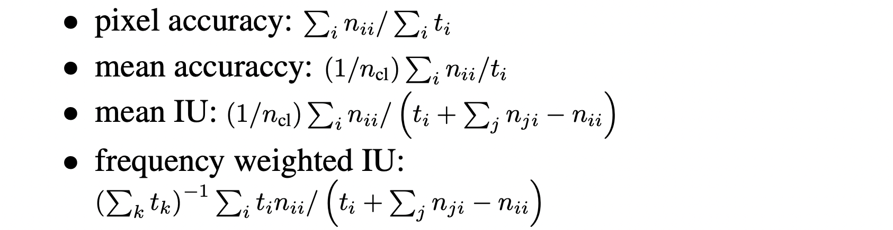

**PASCAL VOC** 表 3 给出了我们的 FCN-8s 在 PASCAL VOC 2011 和 2012 测试集上的性能，并将其与之前的最新技术 SDS [15] 和著名的 R-CNN 进行了比较[10]。我们以 20% 的相对余量在平均 IU上取得了最佳结果。推理时间减少了 114倍（仅 convnet，忽略建议和细化）或 286倍（整体）。

>**PASCAL VOC** Table 3 gives the performance of our FCN-8s on the test sets of PASCAL VOC 2011 and 2012, and compares it to the previous state-of-the-art, SDS [15], and the well-known R-CNN [10]. We achieve the best results on mean IU8 by a relative margin of 20%. Inference time is reduced 114x (convnet only, ignoring proposals and refinement) or 286x (overall).

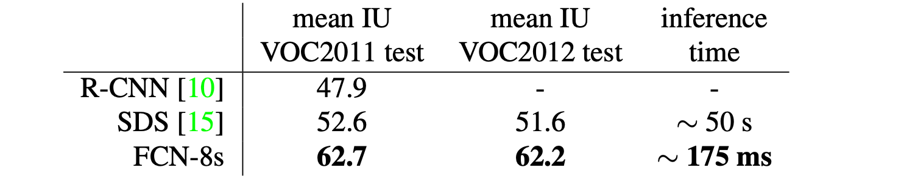

表 3. 我们的全卷积网络在 PASCAL VOC 2011 和 2012 测试集上比最先进的网络相对改进了 20%，并减少了推理时间

> Table 3. Our fully convolutional net gives a 20% relative improvement over the state-of-the-art on the PASCAL VOC 2011 and 2012 test sets and reduces inference time.

>

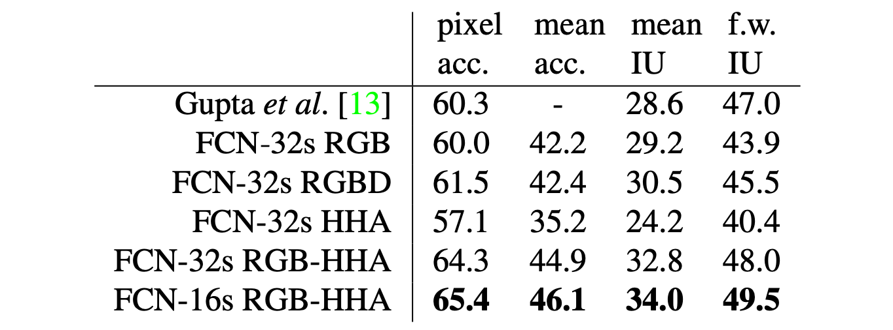

表 4. NYUDv2 的结果。 RGBD 是输入端 RGB 和深度通道的早期融合。 HHA 是 [13] 的深度嵌入，作为水平视差、离地高度以及局部表面法线与推断的重力方向的角度。 RGB-HHA 是联合训练的后期融合模型，将 RGB 和 HHA 预测相加。

>Table 4. Results on NYUDv2. RGBD is early-fusion of the RGB and depth channels at the input. HHA is the depth embedding of [13] as horizontal disparity, height above ground, and the angle of the local surface normal with the inferred gravity direction. RGB-HHA is the jointly trained late fusion model that sums RGB and HHA predictions.

**NYUDv2** [30] 是一个 RGB-D 数据集，使用微软 Kinect采集。它有 1449 张 RGB-D 图像，像素级标签已被 Gupta 等人合并为 40 类语义分割任务。 [12]。我们报告了 795 个训练图像和 654 个测试图像的标准分割结果。 （注意：所有模型选择都是在 PASCAL 2011 val 上执行的。）表 4 给出了我们模型在几个变体中的性能。首先，我们在 RGB 图像上训练我们未修改的粗略模型（FCN-32s）。为了添加深度信息，我们训练了一个升级为采用四通道 RGB-D 输入（早期融合）的模型。这几乎没有什么好处，可能是因为难以在模型中传播有意义的梯度。继 Gupta 等人的成功之后。 [13]，我们尝试了深度的三维 HHA 编码，仅在此信息上训练网络，以及 RGB 和 HHA 的“后期融合”，其中来自两个网络的预测在最后一层求和，结果双流网络是端到端学习的。最后，我们将这个后期融合网络升级到 16 步版本。

> **NYUDv2** [30] is an RGB-D dataset collected using the Microsoft Kinect. It has 1449 RGB-D images, with pixelwise labels that have been coalesced into a 40 class semantic segmentation task by Gupta et al. [12]. We report results on the standard split of 795 training images and 654 testing images. (Note: all model selection is performed on PASCAL 2011 val.) Table 4 gives the performance of our model in several variations. First we train our unmodified coarse model (FCN-32s) on RGB images. To add depth information, we train on a model upgraded to take four-channel RGB-D input (early fusion). This provides little benefit, perhaps due to the difficultly of propagating meaningful gradients all the way through the model. Following the success of Gupta et al. [13], we try the three-dimensional HHA encoding of depth, training nets on just this information, as well as a “late fusion” of RGB and HHA where the predictions from both nets are summed at the final layer, and the resulting two-stream net is learned end-to-end. Finally we upgrade this late fusion net to a 16-stride version.

**SIFT Flow** 是一个包含 2,688 个图像的数据集，具有 33 个语义类别（“桥”、“山”、“太阳”）以及三个几何类别（“水平”、“垂直”和“天空”）的像素标签。 FCN 可以自然地学习同时预测两种类型标签的联合表示。我们学习了具有语义和几何预测层和损失的 FCN-16 的双头版本。学习模型在这两个任务上的表现与两个独立训练的模型一样好，而学习和推理本质上与每个独立模型本身一样快。表 5 中的结果是根据分为 2,488 个训练图像和 200 个测试图像的标准计算得出的，显示了这两个任务的最先进性能。

>**SIFT Flow** is a dataset of 2,688 images with pixel labels for 33 semantic categories (“bridge”, “mountain”, “sun”), as well as three geometric categories (“horizontal”, “vertical”, and “sky”). An FCN can naturally learn a joint representation that simultaneously predicts both types of labels. We learn a two-headed version of FCN-16s with semantic and geometric prediction layers and losses. The learned model performs as well on both tasks as two independently trained models, while learning and inference are essentially as fast as each independent model by itself. The results in Table 5, computed on the standard split into 2,488 training and 200 test images,9 show state-of-the-art performance on both tasks.

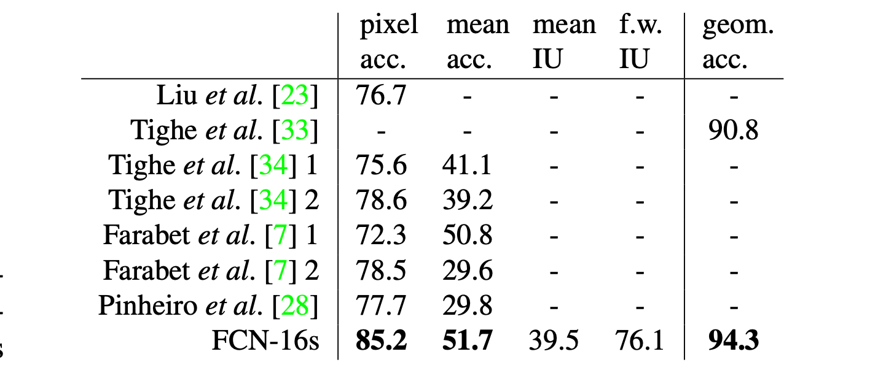

表 5. SIFT Flow9 的类分割（中）和几何分割（右）的结果。 Tighe [33] 是一种非参数传递方法。 Tighe 1 是示例 SVM，而 2 是 SVM + MRF。 Farabet 是在类平衡样本 (1) 或自然频率样本 (2) 上训练的多尺度卷积网络。 Pinheiro 是一个多尺度、循环的卷积网络，表示为 RCNN3 (3)。几何的度量标准是像素精度。

>Table 5. Results on SIFT Flow9 with class segmentation (center) and geometric segmentation (right). Tighe [33] is a non-parametric transfer method. Tighe 1 is an exemplar SVM while 2 is SVM + MRF. Farabet is a multi-scale convnet trained on class-balanced samples (1) or natural frequency samples (2). Pinheiro is a multi-scale, recurrent convnet, denoted RCNN3 ( 3 ). The metric for geometry is pixel accuracy.

## 6.Conclusion

全卷积网络是一类丰富的模型，其中现代分类卷积网络是一个特例。认识到这一点，扩展这些分类网络进行分割，并通过多分辨率层组合改进架构，显着提高了最先进的技术，同时简化和加速了学习和推理。

> Fully convolutional networks are a rich class of models, of which modern classification convnets are a special case. Recognizing this, extending these classification nets to segmentation, and improving the architecture with multi-resolution layer combinations dramatically improves the state-of-the-art, while simultaneously simplifying and speeding up learning and inference.

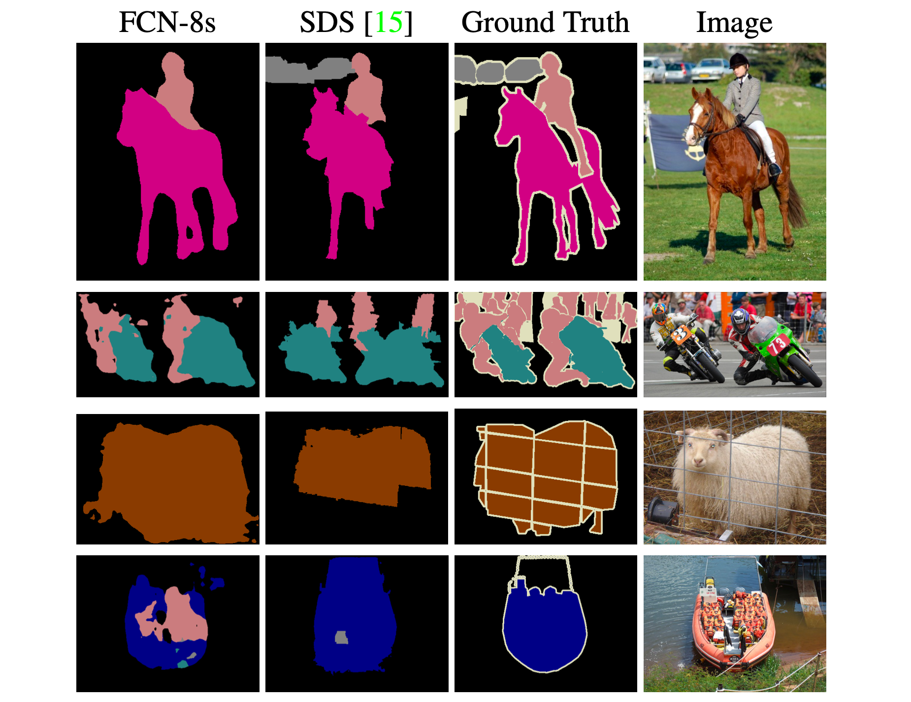

图 6. 全卷积分割网络在 PASCAL 上产生最先进的性能。左列显示了我们性能最高的网络 FCN-8s 的输出。第二个显示了 Hariharan 等人以前最先进的系统产生的分割。 [15]。注意恢复的精细结构（第一行）、分离密切交互对象的能力（第二行）和对遮挡物的鲁棒性（第三行）。第四行显示了一个失败案例：网络将船上的救生衣视为人。

>Figure 6. Fully convolutional segmentation nets produce stateof-the-art performance on PASCAL. The left column shows the output of our highest performing net, FCN-8s. The second shows the segmentations produced by the previous state-of-the-art system by Hariharan et al. [15]. Notice the fine structures recovered (first row), ability to separate closely interacting objects (second row), and robustness to occluders (third row). The fourth row shows a failure case: the net sees lifejackets in a boat as people.

## Acknowledgements

这项工作得到了 DARPA 的 MSEE 和 SMISC 计划、NSF 奖项 IIS1427425、IIS-1212798、IIS-1116411 以及 NSF GRFP、丰田和伯克利视觉与学习中心的部分支持。我们非常感谢 NVIDIA 捐赠 GPU。我们感谢 Bharath Hariharan 和 Saurabh Gupta 的建议和数据集工具。我们感谢 Sergio Guadarrama 在 Caffe 中复制 GoogLeNet。我们感谢 Jitendra Malik 的有益评论。感谢 Wei Liu 指出了我们的 SIFT Flow 平均 IU 计算的一个问题，以及我们的频率加权平均 IU 公式中的一个错误。

> This work was supported in part by DARPA’s MSEE and SMISC programs, NSF awards IIS1427425, IIS-1212798, IIS-1116411, and the NSF GRFP, Toyota, and the Berkeley Vision and Learning Center. We gratefully acknowledge NVIDIA for GPU donation. We thank Bharath Hariharan and Saurabh Gupta for their advice and dataset tools. We thank Sergio Guadarrama for reproducing GoogLeNet in Caffe. We thank Jitendra Malik for his helpful comments. Thanks to Wei Liu for pointing out an issue wth our SIFT Flow mean IU computation and an error in our frequency weighted mean IU formula.
