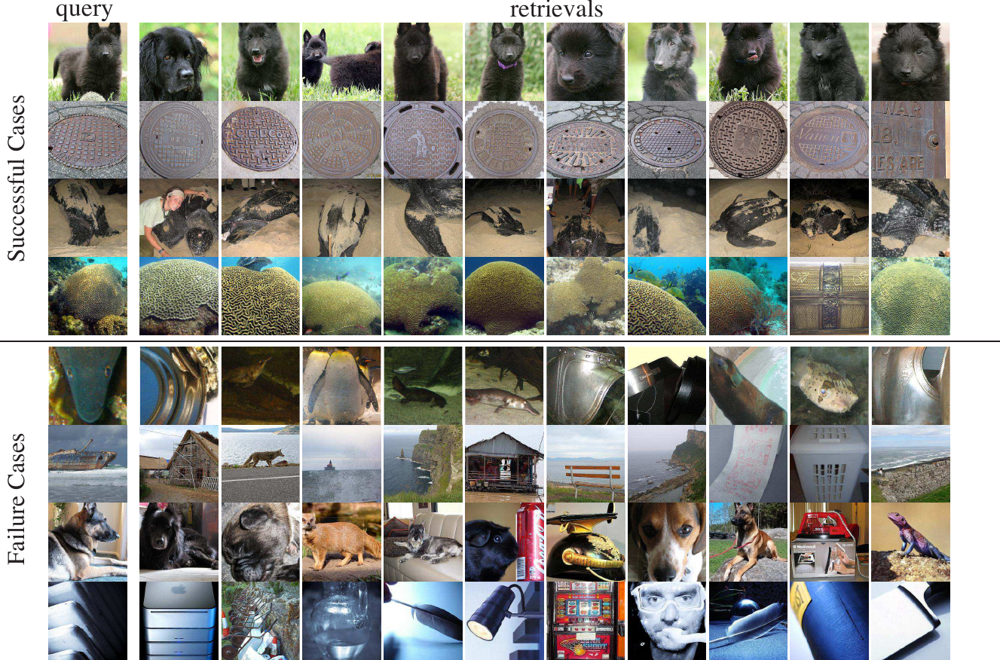

# Unsupervised Feature Learning via Non-Parametric Instance Discrimination

Zhirong Wu⋆† Yuanjun Xiong†‡ Stella X. Yu⋆ Dahua Lin† ⋆UC Berkeley / ICSI †Chinese University

>Zhirong Wu⋆† Yuanjun Xiong†‡ Stella X. Yu⋆ Dahua Lin† ⋆UC Berkeley / ICSI †Chinese University

## Abstract

在带有注释类标签的数据上训练的神经网络分类器也可以捕获类别之间明显的视觉相似性，而无需这样做。我们研究了这种观察是否可以扩展到监督学习的传统领域之外：我们是否可以通过仅仅要求特征区分单个实例来学习一个很好的特征表示来捕获实例之间而不是类之间的明显相似性？

>Neural net classifiers trained on data with annotated class labels can also capture apparent visual similarity among categories without being directed to do so. We study whether this observation can be extended beyond the con- ventional domain of supervised learning: Can we learn a good feature representation that captures apparent similar- ity among instances, instead of classes, by merely asking the feature to be discriminative of individual instances?

我们将这种直觉表述为实例级别的非参数分类问题，并使用噪声对比估计来解决大量实例类所带来的计算挑战。

>We formulate this intuition as a non-parametric clas- sification problem at the instance-level, and use noise- contrastive estimation to tackle the computational chal- lenges imposed by the large number of instance classes.

我们的实验结果表明，在无监督的学习设置下，我们的方法大大超过了 ImageNet 分类的最新技术。我们的方法在通过更多的训练数据和更好的网络架构持续提高测试性能方面也非常出色。通过微调学习到的特征，我们进一步获得了半监督学习和目标检测任务的竞争结果。我们的非参数模型非常紧凑：每张图像有 128 个特征，我们的方法只需要 600MB 的存储空间来存储一百万张图像，从而能够在运行时快速检索最近邻。

>Our experimental results demonstrate that, under unsu- pervised learning settings, our method surpasses the state- of-the-art on ImageNet classification by a large margin. Our method is also remarkable for consistently improv- ing test performance with more training data and better network architectures. By fine-tuning the learned feature, we further obtain competitive results for semi-supervised learning and object detection tasks. Our non-parametric model is highly compact: With 128 features per image, our method requires only 600MB storage for a million images, enabling fast nearest neighbour retrieval at the run time.

## 1.Introduction

深度神经网络，尤其是卷积神经网络 (CNN) 的兴起，导致了计算机视觉基准的多项突破。大多数成功的模型都是通过监督学习训练的，这需要针对特定任务完全注释的大型数据集。然而，在某些情况下，获取带注释的数据通常非常昂贵，甚至不可行。近年来，无监督学习越来越受到社区的关注[5, 2]。

>The rise of deep neural networks, especially convolu- tional neural networks (CNN), has led to several break- throughs in computer vision benchmarks. Most successful models are trained via supervised learning, which requires large datasets that are completely annotated for a specific task. However, obtaining annotated data is often very costly or even infeasible in certain cases. In recent years, unsu- pervised learning has received increasing attention from the community [5, 2].

我们新的无监督学习方法源于对对象识别的监督学习结果的一些观察。在 ImageNet 上，前 5 个分类错误显着低于前 1 个错误 [18]，softmax 输出中第二高的响应类图像更有可能在视觉上相关。图 1 显示，豹类的图像在美洲豹类而不是类书柜 [11] 中的评分要高得多。这些观察表明，典型的判别学习方法可以自动发现语义类别之间的明显相似性，而无需明确指导。换句话说，表观相似性不是从语义注释中学习的，而是从视觉数据本身中学习的。

>Our novel approach to unsupervised learning stems from a few observations on the results of supervised learning for object recognition. On ImageNet, the top-5 classification error is significantly lower than the top-1 error [18], and the second highest responding class in the softmax output to an image is more likely to be visually correlated. Fig. 1 shows that an image from class leopard is rated much higher by class jaguar rather than by class bookcase [11]. Such obser- vations reveal that a typical discriminative learning method can automatically discover apparent similarity among se- mantic categories, without being explicitly guided to do so. In other words, apparent similarity is learned not from se- mantic annotations, but from the visual data themselves.

图 1：激励我们的无监督方法的监督学习结果。对于来自豹类的图像，从经过训练的神经网络分类器中获得最高响应的类都是视觉相关的，例如美洲虎和猎豹。不是语义标签，而是数据本身的明显相似性使某些类别比其他类别更接近。我们的无监督方法将分类监督发挥到了极致，并学习了一种区分个体实例的特征表示。

>Figure 1: Supervised learning results that motivate our unsuper- vised approach. For an image from class leopard, the classes that get highest responses from a trained neural net classifier are all visually correlated, e.g., jaguar and cheetah. It is not the seman- tic labeling, but the apparent similarity in the data themselves that brings some classes closer than others. Our unsupervised approach takes the class-wise supervision to the extreme and learns a feature representation that discriminates among individual instances.

我们将分类监督推向实例监督的极端，并问：我们能否通过纯判别学习学习一个有意义的度量来反映实例之间的明显相似性？一幅图像本身就具有独特性，并且每幅图像都可能与同一语义类别中的其他图像显着不同 [23]。如果我们学会在没有任何语义类别概念的情况下区分单个实例，我们最终可能会得到一个捕获实例之间明显相似性的表示，就像分类监督学习如何仍然保留类之间的明显相似性一样。这种将无监督学习作为实例级判别的表述在技术上也很有吸引力，因为它可以受益于判别监督学习的最新进展，例如关于新的网络架构。

>We take the class-wise supervision to the extreme of instance-wise supervision, and ask: Can we learn a mean- ingful metric that reflects apparent similarity among in- stances via pure discriminative learning? An image is dis- tinctive in its own right, and each could differ significantly from other images in the same semantic category [23]. If we learn to discriminate between individual instances, without any notion of semantic categories, we may end up with a representation that captures apparent similarity among in- stances, just like how class-wise supervised learning still retains apparent similarity among classes. This formulation of unsupervised learning as an instance-level discrimination is also technically appealing, as it could benefit from latest advances in discriminative supervised learning, e.g. on new network architectures.

然而，我们也面临一个重大挑战，因为“类”的数量是整个训练集的大小。对于 ImageNet，它将是 120 万而不是 1000 个类。简单地将 softmax 扩展到更多类变得不可行。我们通过使用噪声对比估计 (NCE) [9] 来逼近完整的 softmax 分布来应对这一挑战，并通过使用近端正则化（proximal regularization）方法 [29] 来稳定学习过程。

>However, we also face a major challenge, now that the number of “classes” is the size of the entire training set. For ImageNet, it would be 1.2-million instead of 1,000 classes. Simply extending softmax to many more classes becomes infeasible. We tackle this challenge by approximating the full softmax distribution with noise-contrastive estimation (NCE) [9], and by resorting to a proximal regularization method [29] to stabilize the learning process.

为了评估无监督学习的有效性，过去的工作（例如 [2, 31]）依赖于线性分类器，例如支持向量机 (SVM)，用于在测试时将学习到的特征连接到类别以进行分类。然而，尚不清楚为什么通过训练任务学习的特征对于未知的测试任务是线性可分的。

>To evaluate the effectiveness of unsupervised learning, past works such as [2, 31] have relied on a linear classifier, e.g. Support Vector Machine (SVM), to connect the learned feature to categories for classification at the test time. How- ever, it is unclear why features learned via a training task could be linearly separable for an unknown testing task.

我们提倡对训练和测试都采用非参数方法。我们将实例级别的区分制定为度量学习问题，其中实例之间的距离（相似性）是直接从特征以非参数方式计算的。也就是说，每个实例的特征都存储在离散的内存库中，而不是网络中的权重。在测试时，我们使用基于学习指标的 k 最近邻（kNN）进行分类。因此，我们的训练和测试是一致的，因为我们模型的学习和评估都关注图像之间的相同度量空间。我们报告并比较了实验结果与 SVM 和 kNN 的准确性。

>We advocate a non-parametric approach for both training and testing. We formulate instance-level discrimination as a metric learning problem, where distances (similarity) be- tween instances are calculated directly from the features in a non-parametric way. That is, the features for each instance are stored in a discrete memory bank, rather than weights in a network. At the test time, we perform classification using k-nearest neighbors (kNN) based on the learned met- ric. Our training and testing are thus consistent, since both learning and evaluation of our model are concerned with the same metric space between images. We report and compare experimental results with both SVM and kNN accuracies.

我们的实验结果表明，在无监督的学习设置下，我们的方法大大超过了图像分类的最新技术，在 ImageNet 1K [1] 上的 top-1 准确率为 42.5%，在 Places 上为 38.7% 205 [49]。我们的方法在通过更多的训练数据和更好的网络架构持续提高测试性能方面也非常出色。通过微调学习的特征，我们进一步获得了半监督学习和目标检测任务的竞争结果。最后，我们的非参数模型非常紧凑：每张图像有 128 个特征，我们的方法只需要 600MB 的存储空间来存储一百万张图像，从而能够在运行时快速检索最近邻。

>Our experimental results demonstrate that, under unsu- pervised learning settings, our method surpasses the state- of-the-art on image classification by a large margin, with top-1 accuracy 42.5% on ImageNet 1K [1] and 38.7% for Places 205 [49]. Our method is also remarkable for con- sistently improving test performance with more training data and better network architectures. By fine-tuning the learned feature, we further obtain competitive results for semi-supervised learning and object detection tasks. Fi- nally, our non-parametric model is highly compact: With 128 features per image, our method requires only 600MB storage for a million images, enabling fast nearest neigh- bour retrieval at the run time.

## 2. Related Works

人们对没有人工标签的无监督学习越来越感兴趣。以前的工作主要分为两类：1）生成模型和2）自我监督方法。

> There has been growing interest in unsupervised learn- ing without human-provided labels. Previous works mainly fall into two categories: 1) generative models and 2) self- supervised approaches.

**生成模型**。生成模型的主要目标是尽可能忠实地重建数据的分布。经典生成模型包括受限玻尔兹曼机 (RBM) [12, 39, 21] 和自动编码器 [40, 20]。生成模型产生的潜在特征也可以帮助对象识别。最近的方法，如生成对抗网络 [8, 4] 和变分自动编码器 [14] 提高了生成质量和特征学习。

>Generative Models. The primary objective of generative models is to reconstruct the distribution of data as faithfully as possible. Classical generative models include Restricted Bolztmann Machines (RBMs) [12, 39, 21], and Auto- encoders [40, 20]. The latent features produced by gen- erative models could also help object recognition. Recent approaches such as generative adversarial networks [8, 4] and variational auto-encoder [14] improve both generative qualities and feature learning.

**自我监督学习**。自监督学习利用数据的内部结构并制定预测任务来训练模型。具体来说，模型需要在给定其余部分的情况下预测实例的省略方面或组件。为了学习图像的表示，任务可能是：预测上下文[2]，计算对象[28]，填充图像的缺失部分[31]，从灰度图像中恢复颜色[47]，甚至解决拼图游戏[27]。对于视频，自我监督策略包括：通过跟踪利用时间连续性 [44、45]、预测未来 [42] 或保持自我运动的等方差性 [13、50、30]。最近的工作 [3] 试图结合几个自我监督的任务来获得更好的视觉表示。尽管自我监督学习可以捕捉实例的部分或方面之间的关系，但尚不清楚为什么特定的自我监督任务应该有助于语义识别以及哪个任务是最佳的。

>Self-supervised Learning. Self-supervised learning ex- ploits internal structures of data and formulates predictive tasks to train a model. Specifically, the model needs to pre- dict either an omitted aspect or component of an instance given the rest. To learn a representation of images, the tasks could be: predicting the context [2], counting the ob- jects [28], filling in missing parts of an image [31], recover- ing colors from grayscale images [47], or even solving a jig- saw puzzle [27]. For videos, self-supervision strategies in- clude: leveraging temporal continuity via tracking [44, 45], predicting future [42], or preserving the equivariance of egomotion [13, 50, 30]. Recent work [3] attempts to com- bine several self-supervised tasks to obtain better visual rep- resentations. Whereas self-supervised learning may capture relations among parts or aspects of an instance, it is unclear why a particular self supervision task should help semantic recognition and which task would be optimal.

**度量学习**。每个特征表示 F 在实例 x 和 y 之间引入一个度量：
=\|%20F(x)-%20F(y)%20\|)
。因此，特征学习也可以被视为某种形式的度量学习。已经对度量学习进行了广泛的研究 [15, 33]。度量学习的成功应用通常可以带来有竞争力的表现，例如关于人脸识别[35]和人重新识别[46]。在这些任务中，测试时的类别与训练时的类别是不相交的。一旦一个网络被训练，我们只能从它的特征表示中推断出来，而不是从随后的线性分类器中推断出来。度量学习已被证明对少样本学习是有效的[38,41,37]。人脸识别度量学习的一个重要技术点是归一化[35,22,43]，我们也在这项工作中使用。请注意，这里提到的所有方法都需要以某些方式进行监督。我们的工作完全不同：它以无监督的方式学习特征和诱导度量，无需任何人工注释。

>Metric Learning. Every feature representation F induces a metric between instances x and y: dF (x, y) = kF (x) − F (y)k. Feature learning can thus also be viewed as a certain form of metric learning. There have been exten- sive studies on metric learning [15, 33]. Successful ap- plication of metric learning can often result in competitive performance, e.g. on face recognition [35] and person re- identification [46]. In these tasks, the classes at the test time are disjoint from those at the training time. Once a network is trained, one can only infer from its feature rep- resentation, not from the subsequent linear classifier. Metric learning has been shown to be effective for few-shot learn- ing [38, 41, 37]. An important technical point on metric learning for face recognition is normalization [35, 22, 43], which we also utilize in this work. Note that all the methods mentioned here require supervision in certain ways. Our work is drastically different: It learns the feature and thus the induced metric in an unsupervised fashion, without any human annotations.

**典型的 CNN**。示例 CNN [5] 看起来与我们的工作相似。根本区别在于它在训练和测试期间都采用了参数范式，而我们的方法本质上是非参数的。我们在第 4.1 节中通过实验研究了这种本质差异。 Exemplar CNN 对 ImageNet 等大规模数据集的计算要求很高。

>Exemplar CNN. Exemplar CNN [5] appears similar to our work. The fundamental difference is that it adopts a para- metric paradigm during both training and testing, while our method is non-parametric in nature. We study this essen- tial difference experimentally in Sec 4.1. Exemplar CNN is computationally demanding for large-scale datasets such as ImageNet.

图 2：我们的无监督特征学习方法的流程。我们使用主干 CNN 将每个图像编码为特征向量，将其投影到 128 维空间并进行 L2 归一化。最佳特征嵌入是通过实例级别的判别来学习的，它试图将训练样本的特征最大程度地分散在 128 维单位球面上。

>Figure 2: The pipeline of our unsupervised feature learning approach. We use a backbone CNN to encode each image as a feature vector, which is projected to a 128-dimensional space and L2 normalized. The optimal feature embedding is learned via instance-level discrimination, which tries to maximally scatter the features of training samples over the 128-dimensional unit sphere.

## 3.Approach

我们的目标是在没有监督的情况下学习嵌入函数
)
。 fθ 是一个具有参数 θ 的深度神经网络，将图像 x 映射到特征 v。这种嵌入将在图像空间上引入一个度量，例如 
=\left\|f_{\boldsymbol{\theta}}(x)-f_{\boldsymbol{\theta}}(y)\right\|)
 。一个好的嵌入应该将视觉上相似的图像映射得更近。

>Our goal is to learn an embedding function v = fθ(x) without supervision. fθ is a deep neural network with parameters θ, mapping image x to feature v. This em- bedding would induces a metric over the image space, as dθ(x, y) = kfθ(x) − fθ(y)k for instances x and y. A good embedding should map visually similar images closer to each other.

我们新颖的无监督特征学习方法是实例级判别。我们将每个图像实例视为它自己的一个不同的类，并训练一个分类器来区分各个实例类（图 2）。

>Our novel unsupervised feature learning approach is instance-level discrimination. We treat each image instance as a distinct class of its own and train a classifier to distin- guish between individual instance classes (Fig.2).

### 3.1. Non-Parametric Softmax Classifier

**参数分类器**。我们使用 softmax 标准制定实例级分类目标。假设我们有 n 个图像

在 n 个类别中及其特征

 与 
)
。在传统的参数化 softmax 公式下，对于特征
)
 的图像 x，它被识别为第 i 个示例的概率为

>Parametric Classifier. We formulate the instance-level classification objective using the softmax criterion. Sup- pose we have n images x1, . . . , xn in n classes and their features v1, . . . , vn with vi = fθ(xi). Under the conven- tional parametric softmax formulation, for image x with feature v = fθ(x), the probability of it being recognized as i-th example is

其中 

 是类 j 的权重向量，

 衡量 v 与第 j 个类即实例的匹配程度。

> where wj is a weight vector for class j, and wTj v measures how well v matches the j-th class i.e., instance.

**非参数分类器**。方程中的参数 softmax 公式的问题(1) 是权重向量 w 作为类原型，防止实例之间的显式比较。

>Non-Parametric Classifier. The problem with the para- metric softmax formulation in Eq. (1) is that the weight vec- tor w serves as a class prototype, preventing explicit com- parisons between instances.

我们提出了方程的非参数变体(1) 将 

 替换为

，并且我们通过 L2 归一化层强制 

。然后概率
)
变为：

> We propose a non-parametric variant of Eq. (1) that re- places wTj v with vTj v, and we enforce kvk = 1 via a L2- normalization layer. Then the probability P (i|v) becomes:

其中 τ 是控制分布浓度水平的温度参数 [11]。 τ 对于有监督的特征学习很重要[43]，对于调整我们单位球面上的 v 的浓度也是必要的。

>where τ is a temperature parameter that controls the con- centration level of the distribution [11]. τ is important for supervised feature learning [43], and also necessary for tun- ing the concentration of v on our unit sphere.

然后，学习目标是最大化联合概率 
\right))
，或者等效地最小化训练集上的负对数似然，如

>The learning objective is then to maximize the joint prob- ability Q i=1 Pθ(i|fθ(xi)), or equivalently to minimize the negative log-likelihood over the training set, as

**用存储库学习**。计算方程式2中的概率 
)
, 

 对于所有的图像都是需要的。我们不是每次都详尽地计算这些表示，而是维护一个特征存储库 V 来存储它们[46]。在下文中，我们为存储库和从网络转发的特征介绍了单独的注释。令 

为存储库，
)
为 

的特征。在每次学习迭代期间，表示 

 以及网络参数 θ 通过随机梯度下降进行优化。然后在相应的实例条目

 处将 fi 更新为 V。我们将存储库 V 中的所有表示初始化为单位随机向量。

> Learning with A Memory Bank. To compute the proba- bility P (i|v) in Eq. (2), {vj} for all the images are needed. Instead of exhaustively computing these representations ev- ery time, we maintain a feature memory bank V for stor- ing them [46]. In the following, we introduce separate no- tations for the memory bank and features forwarded from the network. Let V = {vj} be the memory bank and fi = fθ(xi) be the feature of xi. During each learning itera- tion, the representation fi as well as the network parameters θ are optimized via stochastic gradient descend. Then fi is updated to V at the corresponding instance entry fi → vi. We initialize all the representations in the memory bank V as unit random vectors.

**讨论**。从类权重向量 

 直接到特征表示 

 的概念变化是显着的。原始 softmax 公式中的权重向量

 仅对训练类有效。因此，它们没有被推广到新的类，或者在我们的环境中，新的实例。当我们摆脱这些权重向量时，我们的学习目标完全集中在特征表示及其诱导度量上，它们可以应用于空间中的任何地方以及测试时的任何新实例。

>Discussions. The conceptual change from class weight vec- tor wj to feature representation vj directly is significant. The weight vectors {wj} in the original softmax formula- tion are only valid for training classes. Consequently, they are not generalized to new classes, or in our setting, new in- stances. When we get rid of these weight vectors, our learn- ing objective focuses entirely on the feature representation and its induced metric, which can be applied everywhere in the space and to any new instances at the test time.

在计算上，我们的非参数公式消除了计算和存储

的梯度的需要，使其在大数据应用中更具可扩展性。

>Computationally, our non-parametric formulation elimi- nates the need for computing and storing the gradients for {wj}, making it more scalable for big data applications.

### 3.2. Noise Contrastive Estimation

当类的数量 n 非常大时，例如，在 Eq.(2) 中计算非参数 softmax 成本过高以百万计的规模。类似的问题在学习词嵌入的文献中得到了很好的解决[25, 24]，其中词的数量也可以扩展到数百万。减少计算的流行技术包括分层 softmax [26]、噪声对比估计 (NCE) [9] 和负采样 [24]。我们使用 NCE [9] 来逼近完整的 softmax。

>Computing the non-parametric softmax in Eq.(2) is cost prohibitive when the number of classes n is very large, e.g. at the scale of millions. Similar problems have been well addressed in the literature for learning word embed- dings [25, 24], where the number of words can also scale to millions. Popular techniques to reduce computation in- clude hierarchical softmax [26], noise-contrastive estima- tion (NCE) [9], and negative sampling [24]. We use NCE [9] to approximate the full softmax.

我们使 NCE 适应我们的问题，以解决计算与训练集中所有实例的相似性的困难。基本思想是将多类分类问题转化为一组二元分类问题，其中二元分类任务是区分数据样本和噪声样本。具体来说，在我们的模型下，存储库中的特征表示 v 对应于第 i 个示例的概率是，

>We adapt NCE to our problem, in order to tackle the dif- ficulty of computing the similarity to all the instances in the training set. The basic idea is to cast the multi-class clas- sification problem into a set of binary classification prob- lems, where the binary classification task is to discrimi- nate between data samples and noise samples. Specifically, the probability that feature representation v in the memory bank corresponds to the i-th example under our model is,

其中 

是归一化常数。我们将噪声分布形式化为均匀分布：

。根据之前的工作，我们假设噪声样本的频率是数据样本的 m 倍。那么样本 i 与特征 v 来自数据分布（表示为 D = 1）的后验概率为：

>where Zi is the normalizing constant. We formalize the noise distribution as a uniform distribution: Pn = 1/n. Following prior work, we assume that noise samples are m times more frequent than data samples. Then the posterior probability of sample i with feature v being from the data distribution (denoted by D = 1) is:

我们的近似训练目标是最小化数据和噪声样本的负对数后验分布，

>Our approximated training objective is to minimize the neg- ative log-posterior distribution of data and noise samples,

这里，

 表示实际的数据分布。对于

，v是

对应的特征；而对于 

，v' 是来自另一幅图像的特征，根据噪声分布 

 随机采样。在我们的模型中，v 和 v' 都是从非参数存储库 V 中采样的。

>Here, Pd denotes the actual data distribution. For Pd, v is the feature corresponding to xi; whereas for Pn, v′ is the feature from another image, randomly sampled according to noise distribution Pn. In our model, both v and v′ are sampled from the non-parametric memory bank V .

根据等式4计算归一化常数 

 价格昂贵。我们遵循[25]，将其视为常数并通过蒙特卡罗近似估计其值：

>Computing normalizing constant Zi according to Eq. (4) is expensive. We follow [25], treating it as a constant and estimating its value via Monte Carlo approximation:

其中 {

}是索引的随机子集。根据经验，我们发现从初始批次得出的近似值足以在实践中很好地工作。

> where {jk} is a random subset of indices. Empirically, we find the approximation derived from initial batches suffi- cient to work well in practice.

NCE 将每个样本的计算复杂度从 O(n) 降低到 O(1)。通过如此大幅度的减少，我们的实验仍然产生了具有竞争力的性能。

>NCE reduces the computational complexity from O(n) to O(1) per sample. With such drastic reduction, our exper- iments still yield competitive performance.

### 3.3. Proximal Regularization

图 3：我们的近端正则化的效果。原始目标值波动很大并且收敛非常缓慢，而正则化目标具有更平滑的学习动态。

>Figure 3: The effect of our proximal regularization. The original objective value oscillates a lot and converges very slowly, whereas the regularized objective has smoother learning dynamics.

与每个类有许多实例的典型分类设置不同，我们每个类只有一个实例。在每个训练时期，每个类只被访问一次。因此，学习过程会因随机抽样波动而产生很大的波动。我们采用了近端优化方法 [29] 并引入了一个额外的术语来鼓励训练动态的平滑性。在当前迭代 t 中，数据 

 的特征表示是从网络 
}=f_{\boldsymbol{\theta}}\left(x_{i}\right))
 计算的。所有表示的内存库都存储在先前的迭代 
}\right\})
 中。来自 

 的正样本的损失函数为：

>Unlike typical classification settings where each class has many instances, we only have one instance per class. During each training epoch, each class is only visited once. Therefore, the learning process oscillates a lot from ran- dom sampling fluctuation. We employ the proximal opti- mization method [29] and introduce an additional term to encourage the smoothness of the training dynamics. At current iteration t, the feature representation for data xi is computed from the network v(t)i = fθ(xi). The memory bank of all the representation are stored at previous itera- tion V = {v(t−1)}. The loss function for a positive sample from Pd is:

随着学习的收敛，迭代之间的差异，即
}-\mathbf{v}_{i}^{(t-1)})
逐渐消失，并且增加的损失减少到原始损失。通过近端正则化，我们的最终目标变为：

>As learning converges, the difference between iterations, i.e. v(t)i − v(t−1)i, gradually vanishes, and the augmented loss is reduced to the original one. With proximal regular- ization, our final objective becomes:

图 3 表明，从经验上看，近端正则化有助于稳定训练、加速收敛和改进学习表示，而额外成本可以忽略不计。

>Fig. 3 shows that, empirically, proximal regularization helps stabilize training, speed up convergence, and improve the learned representation, with negligible extra cost.

### 3.4. Weighted k-Nearest Neighbor Classifier

为了对测试图像 

 进行分类，我们首先计算其特征 
)
，然后使用余弦相似度将其与存储库中所有图像的嵌入进行比较

>To classify test image ˆx, we first compute its feature ˆf = fθ(ˆx), and then compare it against the embeddings of all the images in the memory bank, using the cosine similarity

表 1：CIFAR10 上的 Top-1 准确度，通过在学习特征上应用线性 SVM 或 kNN 分类器。我们的非参数 softmax 优于参数 softmax，并且随着 m 的增加，NCE 提供了非常接近的近似值。

>Table 1: Top-1 accuracies on CIFAR10, by applying linear SVM or kNN classifiers on the learned features. Our non-parametric softmax outperforms parametric softmax, and NCE provides close approximation as m increases.

)
。然后，用 

 表示的前 k 个最近邻居将用于通过加权投票进行预测。具体来说，类 c 将获得总权重 
)
。这里，

 是邻居 xi 的贡献权重，它取决于
)
 的相似性。我们在训练中选择 τ = 0.07，我们设置k=200.

>si = cos(vi, ˆf). The top k nearest neighbors, denoted by Nk, would then be used to make the prediction via weighted voting. Specifically, the class c would get a total weight wc = Pi∈Nk αi · 1(ci = c). Here, αi is the contributing weight of neighbor xi, which depends on the similarity as αi = exp(si/τ ). We choose τ = 0.07 as in training and we

## 4. Experiments

我们进行了 4 组实验来评估我们的方法。第一组是在 CIFAR-10 上比较我们的非参数 softmax 和参数 softmax。第二组是在 ImageNet 上将我们的方法与其他无监督学习方法进行比较。最后两组实验研究了两个不同的任务，半监督学习和对象检测，以展示我们学习到的特征表示的泛化能力。

>We conduct 4 sets of experiments to evaluate our ap- proach. The first set is on CIFAR-10 to compare our non- parametric softmax with parametric softmax. The second set is on ImageNet to compare our method with other unsu- pervised learning methods. The last two sets of experiments investigate two different tasks, semi-supervised learning and object detection, to show the generalization ability of our learned feature representation.

### 4.1. Parametric vs. Non-parametric Softmax

我们方法的一个关键新颖之处是非参数 softmax 函数。与传统的参数 softmax 相比，我们的 softmax 允许将非参数度量转移到监督任务。

>A key novelty of our approach is the non-parametric softmax function. Compared to the conventional paramet- ric softmax, our softmax allows a non-parametric metric to transfer to supervised tasks.

我们比较了 CIFAR-10 [17] 上的参数和非参数公式，CIFAR-10 [17] 是一个在 10 个类中有 50,000 个训练实例的数据集。这个大小允许我们在没有任何近似的情况下计算等式（2）中的非参数 softmax。我们使用 ResNet18 作为主干网络，其输出特征映射为 128 维向量。

>We compare both parametric and non-parametric formu- lations on CIFAR-10 [17], a dataset with 50, 000 training instances in 10 classes. This size allows us to compute the non-parametric softmax in Eq.(2) without any approxima- tion. We use ResNet18 as the backbone network and its output features mapped into 128-dimensional vectors.

我们基于学习到的特征表示来评估分类效果。一种常见的做法 [48, 2, 31] 是在训练集上根据学习到的特征训练 SVM，然后根据从训练网络中提取的特征对测试实例进行分类。此外，我们还使用最近邻分类器来评估学习到的特征。后者直接依赖于特征度量，可能更好地反映表示的质量。

>We evaluate the classification effectiveness based on the learned feature representation. A common practice [48, 2, 31] is to train an SVM on the learned feature over the train- ing set, and to then classify test instances based on the fea- ture extracted from the trained network. In addition, we also use nearest neighbor classifiers to assess the learned feature. The latter directly relies on the feature metric and may bet- ter reflect the quality of the representation.

表 1 显示了 CI-FAR10 上的 top-1 分类精度。在使用参数 softmax 学习的特征上，我们使用线性 SVM 和 kNN 分类器分别获得了 60.3% 和 63.0% 的准确率。在使用非参数 softmax 学习的特征上，线性和最近邻分类器的准确率分别上升到 75.4% 和 80.8%，后者显着提升了 18%。

>Table 1 shows top-1 classification accuracies on CI- FAR10. On the features learned with parametric softmax, we obtain accuracies of 60.3% and 63.0% with linear SVM and kNN classifiers respectively. On the features learned with non-parametric softmax, the accuracy rises to 75.4% and 80.8% for the linear and nearest neighbour classifiers, a remarkable 18% boost for the latter.

我们还研究了 NCE 逼近非参数 softmax 的质量（第 3.2 节）。近似值由 m 控制，m 为每个实例绘制的负数。当 m = 1 时，kNN 的准确率显着下降到 42.5%。随着 m 的增加，性能稳步提高。当 m = 4, 096 时，准确度接近 m = 49, 999 时的准确度——没有任何近似的完整形式评估。这个结果保证了 NCE 是一个有效的近似。

>We also study the quality of NCE approximating non- parametric softmax (Sec. 3.2). The approximation is con- trolled by m, the number of negatives drawn for each in- stance. With m = 1, the accuracy with kNN drops signifi- cantly to 42.5%. As m increases, the performance improves steadily. When m = 4, 096, the accuracy approaches that at m = 49, 999 – full form evaluation without any approxima- tion. This result provides assurance that NCE is an efficient approximation.

### 4.2. Image Classification

我们在 ImageNet ILSVRC [34] 上学习特征表示，并将我们的方法与代表性的无监督学习方法进行比较。

>We learn a feature representation on ImageNet ILSVRC [34], and compare our method with representative unsupervised learning methods.

**实验设置**。我们通过经验验证选择设计参数。特别是，我们设置温度 τ = 0.07 并使用 m = 4, 096 的 NCE 来平衡性能和计算成本。该模型使用带有动量的 SGD 训练了 200 个 epoch。批量大小为 256。学习率初始化为 0.03，在前 120 个 epoch 之后每 40 个 epoch 以系数 0.1 缩小。我们的代码位于：http://github.com/zhirongw/lemniscate.pytorch。

>Experimental Settings. We choose design parameters via empirical validation. In particular, we set tempera- ture τ = 0.07 and use NCE with m = 4, 096 to balance performance and computing cost. The model is trained for 200 epochs using SGD with momentum. The batch size is 256. The learning rate is initialized to 0.03, scaled down with coefficient 0.1 every 40 epochs after the first 120 epochs. Our code is available at: http://github. com/zhirongw/lemniscate.pytorch.

**比较**。我们将我们的方法与随机初始化的网络（作为下界）和各种无监督学习方法进行比较，包括自监督学习 [2、47、27、48]、对抗性学习 [4] 和示例 CNN [ 3]。裂脑自动编码器 [48] 提供了一个代表最先进技术的强大基线。这些方法的结果在他们的原始论文中使用 AlexNet 架构 [18] 进行了报告，但示例 CNN [5] 除外，其结果使用 ResNet-101 [3] 进行了报告。由于网络架构对性能有很大影响，我们考虑几个典型的架构：AlexNet [18]，VGG16 [36], ResNet-18, and ResNet-50 [10].

>Comparisons. We compare our method with a randomly initialized network (as a lower bound) and various unsu- pervised learning methods, including self-supervised learn- ing [2, 47, 27, 48], adversarial learning [4], and Exemplar CNN [3]. The split-brain autoencoder [48] serves a strong baseline that represents the state of the art. The results of these methods are reported with AlexNet architecture [18] in their original papers, except for exemplar CNN [5], whose results are reported with ResNet-101 [3]. As the network architecture has a big impact on the performance, we consider a few typical architectures: AlexNet [18], VGG16 [36], ResNet-18, and ResNet-50 [10].

我们使用两种不同的协议评估性能：（1）对从 conv1 到 conv5 的中间特征执行线性 SVM。请注意，VGG16 和 ResNet [36, 10] 中也有相应的层(2) 对输出特征执行 kNN。表 2 表明：

>We evaluate the performance with two different proto- cols: (1) Perform linear SVM on the intermediate features from conv1 to conv5. Note that there are also corre- sponding layers in VGG16 and ResNet [36, 10]. (2) Per- form kNN on the output features. Table 2 shows that:

1. 借助 AlexNet 和中间特征的线性分类，我们的方法达到了 35.6% 的准确率，优于所有基线，包括最先进的。我们的方法可以很容易地扩展到更深的网络。当我们从 AlexNet 转移到 ResNet-50 时，我们的准确率提高到 42.5%，而使用示例 CNN [3] 的准确率即使使用 ResNet-101 也只有 31.5%。

>1. With AlexNet and linear classification on intermediate features, our method achieves an accuracy of 35.6%, outperforming all baselines, including the state-of-the- art. Our method can readily scale up to deeper networks. As we move from AlexNet to ResNet-50, our accuracy is raised to 42.5%, whereas the accuracy with exemplar CNN [3] is only 31.5% even with ResNet-101.

表2：ImageNet上的Top-1分类准确率。

> Table 2: Top-1 classification accuracies on ImageNet.

表 3：Places 上的 Top-1 分类准确度，直接基于 ImageNet 上学习的特征，没有任何微调。

>Table 3: Top-1 classification accuracies on Places, based directly on features learned on ImageNet, without any fine-tuning.

2. 在最后的 128 维特征上使用最近邻分类，我们的方法在 AlexNet、VGG16、ResNet-18 和 ResNet-50 上实现了 31.3%、33.9%、40.5% 和 42.5% 的准确率，不低于线性分类结果，表明我们学习到的特征产生了一个相当好的度量。作为比较，对于Split-brain，在conv3 特征上进行最近邻分类的准确率下降到8.9%，在将特征投影到128 维后下降到11.8%。

>2. Using nearest neighbor classification on the final 128 di- mensional features, our method achieves 31.3%, 33.9%, 40.5% and 42.5% accuracies with AlexNet, VGG16, ResNet-18 and ResNet-50, not much lower than the lin- ear classification results, demonstrating that our learned feature induces a reasonably good metric. As a com- parison, for Split-brain, the accuracy drops to 8.9% with nearest neighbor classification on conv3 features, and to 11.8% after projecting the features to 128 dimensions.

3. 使用我们的方法，随着我们从前几层检查学习到的特征表示，性能会逐渐提高，这通常是可取的。对于所有其他方法，性能会下降到 conv3 或 conv4 之后。

>3. With our method, the performance gradually increases as we examine the learned feature representation from ear- lier to later layers, which is generally desirable. With all other methods, the performance decreases beyond conv3 or conv4.

4. 需要注意的是，来自中间卷积层的特征可以超过 10, 000 维

>4. It is important to note that the features from interme- diate convolutional layers can be over 10, 000 dimen-

图 4：随着训练损失的减少，我们在 ImageNet 上的 kNN 测试准确度继续提高，这表明我们的无监督学习目标捕获了与数据的语义注释非常吻合的明显相似性。

>Figure 4: Our kNN testing accuracy on ImageNet continues to improve as the training loss decreases, demonstrating that our un- supervised learning objective captures apparent similarity which aligns well with the semantic annotation of the data.

因此，对于其他方法，使用性能最佳层的特征可能会产生显着的存储和计算成本。我们的方法在最后一层生成 128 维表示，使用起来非常有效。 ImageNet 中所有 128 万张图像的编码特征只占用大约 600 MB 的存储空间。在 Titan X GPU 上，对该数据集进行详尽的最近邻搜索仅需 20 毫秒。

>sions. Hence, for other methods, using the features from the best-performing layers can incur significant storage and computation costs. Our method produces a 128- dimensional representation at the last layer, which is very efficient to work with. The encoded features of all 1.28M images in ImageNet only take about 600 MB of storage. Exhaustive nearest neighbor search over this dataset only takes 20 ms per image on a Titan X GPU.

**特征泛化**。我们还研究了学习到的特征表示如何推广到其他数据集。在相同的设置下，我们在 Places [49] 上进行了另一项大规模实验，这是一个用于场景分类的大型数据集，其中包含 205 个类别的 245 万张训练图像。在本实验中，我们直接使用在 ImageNet 上训练的特征提取网络，无需进行微调。

>Feature generalization. We also study how the learned feature representations can generalize to other datasets. With the same settings, we conduct another large-scale ex- periment on Places [49], a large dataset for scene classifi- cation, which contains 2.45M training images in 205 cate- gories. In this experiment, we directly use the feature ex- traction networks trained on ImageNet without finetuning.

表 3 比较了不同方法和不同评估策略下获得的结果。同样，使用 conv5 特征上的线性分类器，我们的方法在 AlexNet 和 ResNet-50 中实现了 top-1 准确率 34.5% 和 42.1% 的竞争性能。由于最后一层的最近邻居比中间层小得多，我们使用 ResNet-50 实现了 38.7% 的准确度。这些结果表明使用我们的方法学习的表示具有显着的泛化能力。

>Table 3 compares the results obtained with different meth- ods and under different evaluation policies. Again, with linear classifier on conv5 features, our method achieves competitive performance of top-1 accuracy 34.5% with AlexNet, and 42.1% with ResNet-50. With nearest neigh- bors on the last layer which is much smaller than intermedi- ate layers, we achieve an accuracy of 38.7% with ResNet- 50. These results show remarkable generalization ability of the representations learned using our method.

**训练和测试目标的一致性**。无监督的特征学习很困难，因为训练目标与测试目标无关。一个好的训练目标应该反映在测试性能的持续改进中。我们研究了训练损失和迭代测试精度之间的关系。图 4 显示，随着训练的进行，我们的测试准确性继续提高，没有过度拟合的迹象。它还表明，更好地优化训练目标可能会进一步提高我们的测试准确性。

>Consistency of training and testing objectives. Unsu- pervised feature learning is difficult because the training objective is agnostic about the testing objective. A good training objective should be reflected in consistent improve- ment in the testing performance. We investigate the relation between the training loss and the testing accuracy across it- erations. Fig. 4 shows that our testing accuracy continues to improve as training proceeds, with no sign of overfitting. It also suggests that better optimization of the training objec- tive may further improve our testing accuracy.

图 5：示例查询的检索结果。左列是来自验证集的查询，而右列显示来自训练集的 10 个最接近的实例。上半部分显示最好的情况。下半部分显示最坏的情况。

>Figure 5: Retrieval results for example queries. The left column are queries from the validation set, while the right columns show the 10 closest instances from the training set. The upper half shows the best cases. The lower half shows the worst cases.

表 4：使用 ResNet18 在 ImageNet 上针对不同嵌入特征大小的分类性能。

>Table 4: Classification performance on ImageNet with ResNet18 for different embedding feature sizes.

**嵌入特征大小**。我们研究了当我们将嵌入大小从 32 更改为 256 时性能如何变化。表 4 显示性能从 32 增加，在 128 处趋于稳定，并且似乎向 256 饱和。

>The embedding feature size. We study how the perfor- mance changes as we vary the embedding size from 32 to 256. Table 4 shows that the performance increases from 32, plateaus at 128, and appears to saturate towards 256.

**训练集大小**。为了研究我们的方法如何随数据大小缩放，我们用不同比例的 ImageNet 数据训练不同的表示，并使用最近邻评估完整标记集的分类性能。表 5 显示我们的特征学习方法受益于更大的训练集，并且随着训练集的增长，测试的准确性提高。该属性对于成功的无监督学习至关重要，因为日常不乏未标记的数据。

>Training set size. To study how our method scales with the data size, we train different representations with vari- ous proportions of ImageNet data, and evaluate the classi- fication performance on the full labeled set using nearest neighbors. Table 5 shows that our feature learning method benefits from larger training sets, and the testing accuracy improves as the training set grows. This property is crucial for successful unsupervised learning, as there is no shortage of unlabeled data in the wild.

**定性案例研究**。为了说明所学的特点。图 5 显示了使用学习到的特征进行图像检索的结果。上面四行显示最好的情况

>Qualitative case study. To illustrate the learned features, Figure 5 shows the results of image retrieval using the learned features. The upper four rows show the best cases

表 5：使用 ResNet-18 在不同数量的训练集上训练的分类性能。

>Table 5: Classification performances trained on different amount of training set with ResNet-18.

其中所有前 10 个结果与查询属于同一类别。下面的四行显示了前 10 名中没有一个属于同一类别的最坏情况。然而，即使对于失败的情况，检索到的图像在视觉上仍然与查询相似，这证明了我们的无监督学习目标的力量。

>where all top 10 results are in the same categories as the queries. The lower four rows show the worst cases where none of the top 10 are in the same categories. However, even for the failure cases, the retrieved images are still vi- sually similar to the queries, a testament to the power of our unsupervised learning objective.

### 4.3. Semi-supervised Learning

我们现在研究学习的特征提取网络如何使其他任务受益，以及它是否可以为将学习迁移到其他任务提供良好的基础。可以从无监督学习中受益的一个常见场景是，当我们拥有大量数据而其中只有一小部分被标记时。一种自然的半监督学习方法是首先从大的未标记数据中学习，然后在小的标记数据上微调模型。我们随机选择 ImageNet 的一个子集作为标签

>We now study how the learned feature extraction net- work can benefit other tasks, and whether it can provide a good basis for transfer learning to other tasks. A com- mon scenario that can benefit from unsupervised learning is when we have a large amount of data of which only a small fraction are labeled. A natural semi-supervised learning ap- proach is to first learn from the big unlabeled data and then fine-tune the model on the small labeled data. We randomly choose a subset of ImageNet as labeled

图 6：ImageNet 上的半监督学习结果，带有越来越多的标记数据（x 轴）。我们的始终如一且明显更好。请注意，基于着色的预训练的结果来自更深的 ResNet-152 网络 [19]。

>Figure 6: Semi-supervised learning results on ImageNet with an increasing fraction of labeled data (x axis). Ours are consistently and significantly better. Note that the results for colorization-based pretraining are from a deeper ResNet-152 network [19].

并将其他人视为未标记。我们执行上述半监督学习并测量验证集上的分类准确度。为了与 [19] 进行比较，我们在这里报告 top-5 的准确性。

>and treat others as unlabeled. We perform the above semi- supervised learning and measure the classification accuracy on the validation set. In order to compare with [19], we report the top-5 accuracy here.

我们将我们的方法与三个基线进行比较：（1）Scratch，即对小的标记子集进行完全监督训练，（2）Split-brain [48] 用于预训练，（3）Colorization [19] 用于预训练训练。对标记子集进行微调需要 70 个 epoch，初始学习率为 0.01，每 30 个 epoch 衰减率为 10。我们将标记子集的比例从整个数据集的 1% 更改为 20%。

>We compare our method with three baselines: (1) Scratch, i.e. fully supervised training on the small labeled subsets, (2) Split-brain [48] for pre-training, and (3) Col- orization [19] for pre-training. Finetuning on the labeled subset takes 70 epochs with initial learning rate 0.01 and a decay rate of 10 every 30 epochs. We vary the proportion of labeled subset from 1% to 20% of the entire dataset.

图 6 显示我们的方法显着优于所有其他方法，并且我们的方法是唯一优于有限标记数据的监督学习的方法。当只有 1% 的数据被标记时，我们的表现要高出 10%，这表明我们从未标记数据中学习到的特征对于任务适应是有效的。

>Fig. 6 shows that our method significantly outperforms all other approaches, and ours is the only one outperform- ing supervised learning from limited labeled data. When only 1% of data is labeled, we outperform by a large 10% margin, demonstrating that our feature learned from unla- beled data is effective for task adaptation.

### 4.4. Object Detection

为了进一步评估学习特征的泛化能力，我们将学习到的网络转移到 PASCAL VOC 2007 [6] 上的新目标检测任务中。从头开始训练目标检测模型通常很困难，一种普遍的做法是在 ImageNet 上预训练底层 CNN 并对其进行微调以用于检测任务。

>To further assess the generalization capacity of the learned features, we transfer the learned networks to the new task of object detection on PASCAL VOC 2007 [6]. Training object detection model from scratch is often dif- ficult, and a prevalent practice is to pretrain the underlying CNN on ImageNet and fine-tune it for the detection task.

我们使用 AlexNet 和 VGG16 架构对 Fast R-CNN [7] 和使用 ResNet-50 的 Fast R-CNN [32] 进行实验。在微调 Fast R-CNN 时，学习率初始化为 0.001 并按比例缩小每 50K 次迭代后增加 10 次。在微调 AlexNet 和 VGG16 时，我们遵循标准做法，固定 conv1 模型权重。在微调 Faster R-CNN 时，我们固定了模型低于第 3 类残差块权重

>We experiment with Fast R-CNN [7] with AlexNet and VGG16 architectures, and Faster R-CNN [32] with ResNet- 50. When fine-tuning Fast R-CNN, the learning rate is ini- tialized to 0.001 and scaled down by 10 times after every 50K iterations. When fine-tuning AlexNet and VGG16, we follow the standard practice, fixing the conv1 model weights. When fine-tuning Faster R-CNN, we fix the model

表 6：PASCAL VOC 2007 测试中的目标检测性能，在平均精度 (mAP) 方面，用于监督预训练方法（标记为†）、现有的无监督方法和我们的方法。

>Table 6: Object detection performance on PASCAL VOC 2007 test, in terms of mean average precision (mAP), for supervised pretraining methods (marked by †), existing un- supervised methods, and our method.

，仅更新上面的层并冻结所有批归一化层。我们遵循标准的微调管道，不使用 [2] 中提出的重新缩放方法。我们使用 VOC 2007 中的标准 trainval 集进行训练和测试。

>weights below the 3rd type of residual blocks, only updat- ing the layers above and freezing all batch normalization layers. We follow the standard pipeline for finetuning and do not use the rescaling method proposed in [2]. We use the standard trainval set in VOC 2007 for training and testing.

我们比较了三种设置：1）从头开始直接训练（下限），2）以有监督的方式在 ImageNet 上进行预训练（上限），以及 3）使用各种无监督方法对 ImageNet 或其他数据进行预训练。

>We compare three settings: 1) directly training from scratch (lower bound), 2) pretraining on ImageNet in a su- pervised way (upper bound), and 3) pretraining on Ima- geNet or other data using various unsupervised methods.

表 6 列出了平均精度 (mAP) 方面的检测性能。使用 AlexNet 和 VGG16，我们的方法实现了 48.1% 和 60.5% 的 mAP，与最先进的无监督方法相当。使用 Resnet-50，我们的方法实现了 65.4% 的 mAP，超过了所有现有的无监督学习方法。它还表明我们的方法随着网络的深入而扩展。从监督预训练到 mAP 76.2%，仍有 11% 的显着差距需要缩小。

>Table 6 lists detection performance in terms of mean average precision (mAP). With AlexNet and VGG16, our method achieves an mAP of 48.1% and 60.5%, on par with the state-of-the-art unsupervised methods. With Resnet-50, our method achieves an mAP of 65.4%, surpassing all ex- isting unsupervised learning approaches. It also shows that our method scales well as the network gets deeper. There remains a significant gap of 11% to be narrowed towards mAP 76.2% from supervised pretraining.

## 5. Summary

我们提出了一种无监督的特征学习方法，通过一种新颖的非参数 softmax 公式最大化实例之间的区别。它的动机是观察到监督学习会导致明显的图像相似性。我们的实验结果表明，我们的方法在 ImageNet 和 Places 上的图像分类方面优于最先进的方法，具有紧凑的 128 维表示，可以很好地适应更多数据和更深的网络。它还在半监督学习和对象检测任务上提供了具有竞争力的泛化结果。

>We present an unsupervised feature learning approach by maximizing distinction between instances via a novel non- parametric softmax formulation. It is motivated by the ob- servation that supervised learning results in apparent image similarity. Our experimental results show that our method outperforms the state-of-the-art on image classification on ImageNet and Places, with a compact 128-dimensional rep- resentation that scales well with more data and deeper net- works. It also delivers competitive generalization results on semi-supervised learning and object detection tasks.

致谢。这项工作部分得到了伯克利深度驱动、商汤集团大数据合作研究资助（中大协议编号 TS1610626）和香港普通研究基金（GRF）（编号 14236516）的支持。

>Acknowledgements. This work was supported in part by Berkeley Deep Drive, Big Data Collaboration Re- search grant from SenseTime Group (CUHK Agreement No. TS1610626), and the General Research Fund (GRF) of Hong Kong (No. 14236516).
