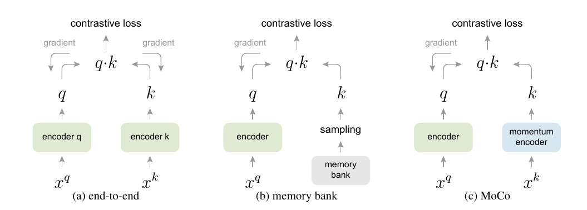

# Momentum Contrast for Unsupervised Visual Representation Learning

>Kaiming He Haoqi Fan Yuxin Wu Saining Xie Ross Girshick

## 摘要

>## Abstract

我们提出了用于无监督视觉表示学习的 Momentum Contrast (MoCo)。从对比学习 [29] 作为字典查找的角度来看，我们构建了一个带有队列和移动平均编码器的动态字典。这使得能够在运行中构建一个大型且一致的字典，以促进对比无监督学习。 MoCo 在 ImageNet 分类的通用 linear protocol 下提供了有竞争力的结果。更重要的是，MoCo 学习的表示可以很好地迁移到下游任务。在 PASCAL VOC、COCO 和其他数据集上的 7 个检测/分割任务中，MoCo 可以胜过其监督的预训练对手，有时甚至大大超过它。这表明在许多视觉任务中，无监督和有监督的表示学习之间的差距已基本缩小。代码：https://github.com/facebookresearch/moco

>We present Momentum Contrast (moco) for unsuper- vised visual representation learning. From a perspective on contrastive learning [29] as dictionary look-up, we build a dynamic dictionary with a queue and a moving-averaged encoder. This enables building a large and consistent dic- tionary on-the-fly that facilitates contrastive unsupervised learning. MoCo provides competitive results under the common linear protocol on ImageNet classification. More importantly, the representations learned by MoCo transfer well to downstream tasks. MoCo can outperform its super- vised pre-training counterpart in 7 detection/segmentation tasks on PASCAL VOC, COCO, and other datasets, some- times surpassing it by large margins. This suggests that the gap between unsupervised and supervised representa- tion learning has been largely closed in many vision tasks. Code: https://github.com/facebookresearch/moco

## 1. 简介

>## 1. Introduction

无监督表示学习在自然语言处理中非常成功，例如 GPT [50, 51] 和 BERT [12] 所示。但是有监督的预训练在计算机视觉中仍然占主导地位，而无监督的方法通常落后。原因可能源于它们各自信号空间的差异。语言任务具有离散的信号空间（单词、子单词单元等），用于构建 token 化的字典，可以基于这些空间进行无监督学习。相比之下，计算机视觉进一步关注字典构建[54,9,5]，因为原始信号处于连续的高维空间中，并且不是为人类交流而构建的（例如，与单词不同）。

>Unsupervised representation learning is highly success- ful in natural language processing, e.g., as shown by GPT [50, 51] and BERT [12]. But supervised pre-training is still dominant in computer vision, where unsupervised meth- ods generally lag behind. The reason may stem from dif- ferences in their respective signal spaces. Language tasks have discrete signal spaces (words, sub-word units, etc.) for building tokenized dictionaries, on which unsupervised learning can be based. Computer vision, in contrast, further concerns dictionary building [54, 9, 5], as the raw signal is in a continuous, high-dimensional space and is not struc- tured for human communication (e.g., unlike words).

最近的几项研究 [61, 46, 36, 66, 35, 56, 2] 提出了使用与对比损失相关的方法进行无监督视觉表示学习的有希望的结果 [29]。尽管受到各种动机的驱动，这些方法可以被认为是构建动态字典。字典中的“键”（tokens）是从数据（例如图像或 patches）中采样的，并由编码器网络表示。无监督学习训练编码器执行字典查找：编码的“查询”应该与其匹配键相似，而与其他键不同。学习被表述为最小化对比损失[29]。

>Several recent studies [61, 46, 36, 66, 35, 56, 2] present promising results on unsupervised visual representation learning using approaches related to the contrastive loss [29]. Though driven by various motivations, these methods can be thought of as building dynamic dictionaries. The “keys” (tokens) in the dictionary are sampled from data (e.g., images or patches) and are represented by an encoder network. Unsupervised learning trains encoders to perform dictionary look-up: an encoded “query” should be similar to its matching key and dissimilar to others. Learning is formulated as minimizing a contrastive loss [29].

图 1. Momentum Contrast (moco) 通过使用对比损失将编码查询 q 与编码键字典匹配来训练视觉表示编码器。字典键 {k0, k1, k2, ...} 由一组数据样本即时定义。字典被构建为一个队列，当前 mini-batch 入队，最旧的 mini-batch 出队，将其与 mini-batch 大小解耦。键由缓慢进展的编码器编码，由查询编码器的动量更新驱动。这种方法可以使用一个大而一致的字典来学习视觉表示。

>Figure 1. Momentum Contrast (moco) trains a visual represen- tation encoder by matching an encoded query q to a dictionary of encoded keys using a contrastive loss. The dictionary keys {k0, k1, k2, ...} are defined on-the-fly by a set of data samples. The dictionary is built as a queue, with the current mini-batch en- queued and the oldest mini-batch dequeued, decoupling it from the mini-batch size. The keys are encoded by a slowly progressing encoder, driven by a momentum update with the query encoder. This method enables a large and consistent dictionary for learning visual representations.

从这个角度来看，我们假设构建的字典是：（i）大的和（ii）在训练过程中不断发展的字典。直观地说，更大的字典可能更好地对底层连续的高维视觉空间进行采样，而字典中的键应该由相同或相似的编码器表示，以便它们与查询的比较是一致的。然而，使用对比损失的现有方法可能在这两个方面之一受到限制（稍后在上下文中讨论）。

>From this perspective, we hypothesize that it is desirable to build dictionaries that are: (i) large and (ii) consistent as they evolve during training. Intuitively, a larger dictio- nary may better sample the underlying continuous, high- dimensional visual space, while the keys in the dictionary should be represented by the same or similar encoder so that their comparisons to the query are consistent. However, ex- isting methods that use contrastive losses can be limited in one of these two aspects (discussed later in context).

我们提出 Momentum Contrast (moco) 作为一种为具有对比损失的无监督学习构建大型且一致的字典的方法（图 1）。我们将字典维护为数据样本队列：当前 mini-batch 的编码表示入队，而最旧的表示出队。队列将字典大小与 mini-batch 大小解耦，允许它很大。此外，由于字典键来自前面的几个mini-batch，因此提出了一种缓慢进展的键编码器，实现为查询编码器的基于动量的移动平均值，以保持一致性。

> We present Momentum Contrast(moco) as a way of building large and consistent dictionaries for unsupervised learning with a contrastive loss (Figure 1). We maintain the dictionary as a queue of data samples: the encoded repre- sentations of the current mini-batch are enqueued, and the oldest are dequeued. The queue decouples the dictionary size from the mini-batch size, allowing it to be large. More- over, as the dictionary keys come from the preceding sev- eral mini-batches, a slowly progressing key encoder, imple- mented as a momentum-based moving average of the query encoder, is proposed to maintain consistency.

MoCo 是一种为对比学习构建动态词典的机制，可用于各种代理任务。在本文中，我们遵循一个简单的实例判别任务 [61,63,2]：如果它们是同一图像的编码视图（例如，不同的作物），则查询匹配一个键。使用这个代理任务，MoCo 在 ImageNet 数据集 [11] 中的线性分类通用协议下显示了具有竞争力的结果。

> MoCo is a mechanism for building dynamic dictionar- ies for contrastive learning, and can be used with various pretext tasks. In this paper, we follow a simple instance discrimination task [61, 63, 2]: a query matches a key if they are encoded views (e.g., different crops) of the same image. Using this pretext task, MoCo shows competitive results under the common protocol of linear classification in the ImageNet dataset [11].

无监督学习的一个主要目的是预训练可以通过微调迁移到下游任务的表示（即特征）。我们表明，在与检测或分割相关的 7 个下游任务中，MoCo 无监督预训练可以超过其 ImageNet 监督对比方案，在某些情况下，差距不小。在这些实验中，我们探索了在 ImageNet 或 10 亿张 Instagram 图像集上预训练的 MoCo，证明 MoCo 可以在更真实的世界、10 亿张图像规模和相对未经处理的场景中很好地工作。这些结果表明，MoCo 在很大程度上缩小了许多计算机视觉任务中无监督和监督表示学习之间的差距，并且可以在多个应用中作为 ImageNet 监督预训练的替代方案。

>A main purpose of unsupervised learning is to pre-train representations (i.e., features) that can be transferred to downstream tasks by fine-tuning. We show that in 7 down- stream tasks related to detection or segmentation, MoCo unsupervised pre-training can surpass its ImageNet super- vised counterpart, in some cases by nontrivial margins. In these experiments, we explore MoCo pre-trained on Ima- geNet or on a one-billion Instagram image set, demonstrat- ing that MoCo can work well in a more real-world, billion- image scale, and relatively uncurated scenario. These re- sults show that MoCo largely closes the gap between un- supervised and supervised representation learning in many computer vision tasks, and can serve as an alternative to Im- ageNet supervised pre-training in several applications.

## 2. 相关工作

>## 2. Related Work

无监督/自监督学习方法通常涉及两个方面：代理任务和损失函数。术语“pretext(代理)”意味着要解决的任务不是真正感兴趣的，而只是为了学习良好数据表示的真正目的而解决。损失函数通常可以独立于代理任务进行研究。 MoCo 专注于损失函数方面。接下来我们就这两个方面讨论相关研究。

>Unsupervised/self-supervised1 learning methods gener- ally involve two aspects: pretext tasks and loss functions. The term “pretext” implies that the task being solved is not of genuine interest, but is solved only for the true purpose of learning a good data representation. Loss functions can often be investigated independently of pretext tasks. MoCo focuses on the loss function aspect. Next we discuss related studies with respect to these two aspects.

**损失函数**。定义损失函数的一种常用方法是衡量模型的预测与固定目标之间的差异，例如通过 L1 或 L2 损失重建输入像素（例如 auto-encoders），或者将输入分类为预定义的类别（例如，八个位置 [13]，颜色 bins [64]）通过交叉熵或基于边际的损失。如下所述的其他替代方案也是可能的。

>Loss functions. A common way of defining a loss function is to measure the difference between a model’s prediction and a fixed target, such as reconstructing the input pixels (e.g., auto-encoders) by L1 or L2 losses, or classifying the input into pre-defined categories (e.g., eight positions [13], color bins [64]) by cross-entropy or margin-based losses. Other alternatives, as described next, are also possible.

对比损失 [29] 测量表示空间中样本对的相似性。与将输入匹配到固定目标不同，在对比损失公式中，目标可以在训练期间即时变化，并且可以根据网络 [29] 计算的数据表示来定义。对比学习是最近几项关于无监督学习的工作的核心 [61, 46, 36, 66, 35, 56, 2]，我们稍后会在上下文中详细说明（第 3.1 节）。

>Contrastive losses [29] measure the similarities of sam- ple pairs in a representation space. Instead of matching an input to a fixed target, in contrastive loss formulations the target can vary on-the-fly during training and can be defined in terms of the data representation computed by a network [29]. Contrastive learning is at the core of several recent works on unsupervised learning [61, 46, 36, 66, 35, 56, 2], which we elaborate on later in context (Sec. 3.1).

对抗性损失 [24] 衡量概率分布之间的差异。这是一种用于无监督数据生成广泛成功的技术。[15, 16] 中探讨了表示学习的对抗性方法。生成对抗网络和噪声对比估计（NCE）[28]之间存在关系（参见[24]）。

>Adversarial losses [24] measure the difference between probability distributions. It is a widely successful technique  for unsupervised data generation. Adversarial methods for representation learning are explored in [15, 16]. There are relations (see [24]) between generative adversarial networks and noise-contrastive estimation (NCE) [28].

**代理任务**。已经提出了广泛的代理任务。示例包括在某些损坏下恢复输入，例如去噪 auto-encoders [58]、上下文自动编码器 [48] 或跨通道 auto-encoders（着色）[64、65]。一些代理任务通过例如转换单个（“示例”）图像 [17]、patch 排序 [13、45]、跟踪 [59] 或分割视频中的对象 [47] 来形成伪标签，或聚类特征 [3, 4]。

>Pretext tasks. A wide range of pretext tasks have been pro- posed. Examples include recovering the input under some corruption, e.g., denoising auto-encoders [58], context auto- encoders [48], or cross-channel auto-encoders (coloriza- tion) [64, 65]. Some pretext tasks form pseudo-labels by, e.g., transformations of a single (“exemplar”) image [17], patch orderings [13, 45], tracking [59] or segmenting ob- jects [47] in videos, or clustering features [3, 4].

**对比学习 vs. 代理任务**。各种代理任务可以基于某种形式的对比损失函数。实例判别方法 [61] 与基于示例的任务 [17] 和 NCE [28] 有关。对比预测编码 (CPC) [46] 中的代理任务是上下文自动编码 [48] 的一种形式，而在对比多视图编码 (CMC) [56] 中，它与着色 [64] 有关。

>Contrastive learning vs. pretext tasks. Various pretext tasks can be based on some form of contrastive loss func- tions. The instance discrimination method [61] is related to the exemplar-based task [17] and NCE [28]. The pretext task in contrastive predictive coding (CPC) [46] is a form of context auto-encoding [48], and in contrastive multiview coding (CMC) [56] it is related to colorization [64].

## 3. 方法

>## 3. Method

### 3.1.对比学习作为字典查找

>### 3.1. Contrastive Learning as Dictionary Look-up

对比学习 [29] 及其最近的发展，可以被认为是为字典查找任务训练编码器，如下所述。

>Contrastive learning [29], and its recent developments, can be thought of as training an encoder for a dictionary look-up task, as described next.

考虑一个编码查询 q 和一组编码样本{

}，它们是字典的键。假设在 q 匹配的字典中有一个键（表示为 k+）。对比损失 [29] 是一个函数，当 q 与其正键 k+ 相似但与所有其他键（被视为 q 的负键）不同时，该函数的值较低。通过点积测量相似度，本文考虑了一种称为 InfoNCE [46] 的对比损失函数：

>Consider an encoded query q and a set of encoded sam- ples {k0, k1, k2, ...} that are the keys of a dictionary. As- sume that there is a single key (denoted as k+) in the dic- tionary that q matches. A contrastive loss [29] is a function whose value is low when q is similar to its positive key k+ and dissimilar to all other keys (considered negative keys for q). With similarity measured by dot product, a form of a contrastive loss function, called InfoNCE [46], is consid- ered in this paper:

其中τ是每个[61]的温度超参数。总和超过 1 个正样本和 K 个负样本。直观地说，这个损失是试图将 q 分类为 k+ 的 (K+1) 路基于 softmax 的分类器的对数损失。对比损失函数也可以基于其他形式 [29, 59, 61, 36]，例如基于margin的损失和 NCE 损失的变体。

>where τ is a temperature hyper-parameter per [61]. The sum is over one positive and K negative samples. Intuitively, this loss is the log loss of a (K+1)-way softmax-based clas- sifier that tries to classify q as k+. Contrastive loss functions can also be based on other forms [29, 59, 61, 36], such as margin-based losses and variants of NCE losses.

对比损失作为无监督目标函数，用于训练表示查询和键的编码器网络 [29]。一般来说，查询表示是
)
，其中 

 是编码器网络，

 是查询样本（同样，
)
）。它们的实例化取决于特定的代理任务。输入 

 和 

可以是图像  [29、61、63]、patches [46] 或由一组 patches [46] 组成的上下文。网络 

 和 

 可以相同[29, 59, 63],部分共享 [46, 36, 2]，或不同 [56]。

>The contrastive loss serves as an unsupervised objective function for training the encoder networks that represent the queries and keys [29]. In general, the query representation is q = fq(xq) where fq is an encoder network and xq is a query sample (likewise, k = fk(xk)). Their instantiations depend on the specific pretext task. The input xq and xk can be images [29, 61, 63], patches [46], or context consisting a set of patches [46]. The networks fq and fk can be identical [29, 59, 63], partially shared [46, 36, 2], or different [56].

图 2. 三种对比损失机制的概念比较（经验比较在图 3 和表 3 中）。这里我们举例说明一对查询和键。这三种机制的不同之处在于键的维护方式和键编码器的更新方式(a)：用于计算查询和键表示的编码器通过反向传播端到端更新（两个编码器可以不同）(b)：关键表示是从 memory bank [61] 中采样的(c)：MoCo 通过动量更新编码器对新键进行即时编码，并维护一个键队列（图中未显示）。

>Figure 2. Conceptual comparison of three contrastive loss mechanisms (empirical comparisons are in Figure 3 and Table 3). Here we illustrate one pair of query and key. The three mechanisms differ in how the keys are maintained and how the key encoder is updated. (a): The encoders for computing the query and key representations are updated end-to-end by back-propagation (the two encoders can be different). (b): The key representations are sampled from a memory bank [61]. (c): MoCo encodes the new keys on-the-fly by a momentum-updated encoder, and maintains a queue (not illustrated in this figure) of keys.

### 3.2.动量对比

>### 3.2. Momentum Contrast

从上述角度来看，对比学习是一种在图像等高维连续输入上构建离散字典的方法。字典是动态的，因为键是随机采样的，并且键编码器在训练期间会演变。我们的假设是，好的特征可以通过包含大量负样本的大型字典来学习，而字典键的编码器尽管在进化，但仍尽可能保持一致。基于此动机，我们将呈现动量对比，如下所述。

>From the above perspective, contrastive learning is a way of building a discrete dictionary on high-dimensional con- tinuous inputs such as images. The dictionary is dynamic in the sense that the keys are randomly sampled, and that the key encoder evolves during training. Our hypothesis is that good features can be learned by a large dictionary that cov- ers a rich set of negative samples, while the encoder for the dictionary keys is kept as consistent as possible despite its evolution. Based on this motivation, we present Momentum Contrast as described next.

**字典作为队列**。我们方法的核心是将字典维护为数据样本队列。这使我们可以重用前面 mini-batches 中的编码键。队列的引入将字典大小与 mini-batch 大小解耦。我们的字典大小可以远大于典型的 mini-batch 大小，并且可以灵活且独立地设置为超参数。

>Dictionary as a queue. At the core of our approach is maintaining the dictionary as a queue of data samples. This allows us to reuse the encoded keys from the immediate pre- ceding mini-batches. The introduction of a queue decouples the dictionary size from the mini-batch size. Our dictionary size can be much larger than a typical mini-batch size, and can be flexibly and independently set as a hyper-parameter.

字典中的样本被逐步替换。当前 mini-batch 被排入字典，队列中最旧的 mini-batch 被删除。字典总是代表所有数据的一个采样子集，而维护这个字典的额外计算是可控的。此外，删除最旧的 mini-batch 可能是有益的，因为它的编码键是最过时的，因此与最新的最不一致。

>The samples in the dictionary are progressively replaced. The current mini-batch is enqueued to the dictionary, and the oldest mini-batch in the queue is removed. The dictio- nary always represents a sampled subset of all data, while the extra computation of maintaining this dictionary is man- ageable. Moreover, removing the oldest mini-batch can be beneficial, because its encoded keys are the most outdated and thus the least consistent with the newest ones.

**动量更新**。使用队列可以使字典变大，但它也使得通过反向传播更新键编码器变得难以处理（梯度应该传播到队列中的所有样本）。一个简单的解决方案是从查询编码器 

 复制键编码器 

，忽略这个梯度。但是这个解决方案在实验中产生了很差的结果（第 4.1 节）。我们猜想这种失败是由快速变化的编码器引起的，这降低了关键表示的一致性。我们提出动量更新来解决这个问题。形式上，将 

 的参数表示为 

，将

的参数表示为 

，我们通过以下方式更新 

：

>Momentum update. Using a queue can make the dictio- nary large, but it also makes it intractable to update the key encoder by back-propagation (the gradient should propa- gate to all samples in the queue). A na¨ıve solution is to copy the key encoder fk from the query encoder fq, ignor- ing this gradient. But this solution yields poor results in experiments (Sec. 4.1). We hypothesize that such failure is caused by the rapidly changing encoder that reduces the key representations’ consistency. We propose a momentum update to address this issue. Formally, denoting the parameters of fk as θk and those of fq as θq, we update θk by:

这里 m ∈ [0, 1) 是动量系数。只有参数 

 通过反向传播更新。 Eqn.(2) 中的动量更新使得 

 的演化比 

 更平滑。结果，尽管队列中的键由不同的编码器（在不同的 mini-batches 中）编码，但这些编码器之间的差异可以很小。在实验中，相对较大的动量（例如，m = 0.999，我们的默认值）比较小的值（例如，m = 0.9）效果更好，这表明缓慢发展的键编码器是利用队列的核心.

>Here m ∈ [0, 1) is a momentum coefficient. Only the pa- rameters θq are updated by back-propagation. The momen- tum update in Eqn.(2) makes θk evolve more smoothly than θq. As a result, though the keys in the queue are encoded by different encoders (in different mini-batches), the dif- ference among these encoders can be made small. In ex- periments, a relatively large momentum (e.g., m = 0.999, our default) works much better than a smaller value (e.g., m = 0.9), suggesting that a slowly evolving key encoder is a core to making use of a queue.

**与先前机制的关系**。 MoCo 是一种使用对比损失的通用机制。我们将其与图 2 中的两种现有通用机制进行比较。它们在字典大小和一致性方面表现出不同的属性。

>Relations to previous mechanisms. MoCo is a general mechanism for using contrastive losses. We compare it with two existing general mechanisms in Figure 2. They exhibit different properties on the dictionary size and consistency.

通过反向传播进行端到端更新是很自然的机制(如, [29, 46, 36, 63, 2, 35], 图 2a)。它使用当前 mini-batch 中的样本作为字典，因此键被一致地编码（由同一组编码器参数）。但是字典大小与 mini-batch 大小相结合，受 GPU 内存大小的限制。它也受到大型 mini-batch 优化 [25] 的挑战。一些最近的方法[46,36,2]基于由本地位置驱动的代理任务，其中字典大小可以通过多个位置变大。但是这些代理任务可能需要特殊的网络设计，例如 patch 化输入 [46] 或自定义感受野大小 [2]，这可能会使这些网络迁移到下游任务变得复杂。

>The end-to-end update by back-propagation is a natural  mechanism (*e.g*., [29, 46, 36, 63, 2, 35], Figure 2a). It uses samples in the current mini-batch as the dictionary, so the keys are consistently encoded (by the same set of encoder parameters). But the dictionary size is coupled with the mini-batch size, limited by the GPU memory size. It is also challenged by large mini-batch optimization [25]. Some re- cent methods [46, 36, 2] are based on pretext tasks driven by local positions, where the dictionary size can be made larger by multiple positions. But these pretext tasks may require special network designs such as patchifying the input [46] or customizing the receptive field size [2], which may com- plicate the transfer of these networks to downstream tasks.

另一种机制是 [61] 提出的 memory bank 方法（图 2b）。 memory bank 由数据集中所有样本的表示组成。每个 mini-batch 的字典是从 memory bank 中随机采样的，没有反向传播，所以它可以支持大的字典大小。然而，一个样本在memory bank 中的表示是在它最后被看到时更新的。

>Another mechanism is the memory bank approach pro- posed by [61] (Figure 2b). A memory bank consists of the representations of all samples in the dataset. The dictionary for each mini-batch is randomly sampled from the memory bank with no back-propagation, so it can support a large dictionary size. However, the representation of a sample in the memory bank was updated when it was last seen,

bmm: batch 矩阵乘法； mm：矩阵乘法；cat： concatenation。

>bmm: batch matrix multiplication; mm: matrix multiplication; cat: concatenation.

，因此采样的键本质上是关于过去 epoch 中多个不同步骤的编码器，因此不太一致。[61] 中的 memory bank 采用了动量更新。它的动量更新是基于同一样本的表示，而不是编码器。这种动量更新与我们的方法无关，因为 MoCo 不会跟踪每个样本。此外，我们的方法更节省内存，并且可以在十亿规模的数据上进行训练，这对于 memory bank 来说可能是难以处理的。

> , so the sampled keys are essentially about the encoders at multiple different steps all over the past epoch and thus are less con- sistent. A momentum update is adopted on the memory bank in [61]. Its momentum update is on the representa- tions of the same sample, not the encoder. This momentum update is irrelevant to our method, because MoCo does not keep track of every sample. Moreover, our method is more memory-efficient and can be trained on billion-scale data, which can be intractable for a memory bank.

图 4 对这三种机制进行了实证比较。

> Sec. 4 empirically compares these three mechanisms.

### 3.3.代理任务

>### 3.3. Pretext Task

对比学习可以驱动各种代理任务。由于本文的重点不是设计一个新的代理任务，我们使用一个简单的，主要遵循 [61] 中的实例识别任务，最近的一些工作 [63, 2] 与之相关。

>Contrastive learning can drive a variety of pretext tasks. As the focus of this paper is not on designing a new pretext task, we use a simple one mainly following the instance discrimination task in [61], to which some recent works [63, 2] are related.

在[61]之后，如果查询和键来自同一图像，我们将它们视为正对，否则视为负样本对。在 [63, 2] 之后，我们在随机数据增强下对同一图像进行两个随机“视图”以形成正对。查询和键分别由它们的编码器 

 和 

 编码。编码器可以是任何卷积神经网络[39]。

> Following [61], we consider a query and a key as a pos- itive pair if they originate from the same image, and other- wise as a negative sample pair. Following [63, 2], we take two random “views” of the same image under random data augmentation to form a positive pair. The queries and keys are respectively encoded by their encoders, fq and fk. The encoder can be any convolutional neural network [39].

算法 1 为这个代理任务提供了 MoCo 的伪代码。对于当前的 mini-batch，我们对查询及其对应的键进行编码，形成正样本对。负样本来自队列。

>Algorithm 1 provides the pseudo-code of MoCo for this pretext task. For the current mini-batch, we encode the queries and their corresponding keys, which form the posi- tive sample pairs. The negative samples are from the queue.

**技术细节**。我们采用 ResNet [33] 作为编码器，其最后一个全连接层（在全局平均池化之后）具有固定维度的输出（128-D [61]）。该输出向量通过其 L2 范数 [61] 进行归一化。这是查询或键的表示。 Eqn.(1) 中的温度 τ 设置为 0.07 [61]。数据增强设置遵循 [61]：从随机调整大小的图像中获取 224×224 像素的裁剪，然后进行随机颜色抖动、随机水平翻转和随机灰度转换，所有这些都在 PyTorch 中可用torchvision包。

>Technical details. We adopt a ResNet [33] as the encoder, whose last fully-connected layer (after global average pool- ing) has a fixed-dimensional output (128-D [61]). This out- put vector is normalized by its L2-norm [61]. This is the representation of the query or key. The temperature τ in Eqn.(1) is set as 0.07 [61]. The data augmentation setting follows [61]: a 224×224-pixel crop is taken from a ran- domly resized image, and then undergoes random color jit- tering, random horizontal flip, and random grayscale con- version, all available in PyTorch’s torchvision package.

**打乱BN**。我们的编码器 

 和 

 都具有批量归一化（BN）[37]，就像在标准 ResNet [33] 中一样。在实验中，我们发现使用 BN 会阻止模型学习良好的表示，正如 [35] 中类似报道的那样（避免使用 BN）。该模型似乎“欺骗”了代理任务，并且很容易找到一个低损失的解决方案。这可能是因为样本之间的 batch 内部通信（由 BN 引起）泄漏了信息。

>Shuffling BN. Our encoders fq and fk both have Batch Normalization (BN) [37] as in the standard ResNet [33]. In experiments, we found that using BN prevents the model from learning good representations, as similarly reported in [35] (which avoids using BN). The model appears to “cheat” the pretext task and easily finds a low-loss solu- tion. This is possibly because the intra-batch communica- tion among samples (caused by BN) leaks information.

我们通过打乱BN来解决这个问题。我们使用多个 GPU 进行训练，并为每个 GPU 独立地对样本执行 BN（如通常做法那样）。对于键编码器 

，我们将当前 mini-batch 中的样本顺序打乱，然后将其分配到 GPU 中（并在编码后打乱回来）；查询编码器 

 的 mini-batch 的样本顺序没有改变。这确保了用于计算查询的 batch 统计信息及其正键来自两个不同的子集。这有效地解决了作弊问题，并允许训练从 BN 中受益。

>We resolve this problem by shuffling BN. We train with multiple GPUs and perform BN on the samples indepen- dently for each GPU (as done in common practice). For the key encoder fk, we shuffle the sample order in the current mini-batch before distributing it among GPUs (and shuffle back after encoding); the sample order of the mini-batch for the query encoder fq is not altered. This ensures the batch statistics used to compute a query and its positive key come from two different subsets. This effectively tackles the cheating issue and allows training to benefit from BN.

我们在我们的方法及其端到端消融对比方案中都使用了打乱的 BN（图 2a）。它与 memory bank 对比方案（图 2b）无关，后者不受此问题的影响，因为正键来自过去的不同 mini-batches。

>We use shuffled BN in both our method and its end-to- end ablation counterpart (Figure 2a). It is irrelevant to the memory bank counterpart (Figure 2b), which does not suf- fer from this issue because the positive keys are from differ- ent mini-batches in the past.

## 4. 实验

>## 4. Experiments

我们研究在以下方面执行的无监督训练：

> We study unsupervised training performed in:

**ImageNet-1M (IN-1M)**：这是 ImageNet [11] 训练集，在 1000 个类别中有 128 万张图像（通常称为 ImageNet-1K；我们计算图像数量，因为类没有被无监督学习利用）。该数据集的类别分布非常平衡，其图像通常包含对象的标志性视图。

>ImageNet-1M (IN-1M): This is the ImageNet [11] train- ing set that has ∼1.28 million images in 1000 classes (often called ImageNet-1K; we count the image number instead, as classes are not exploited by unsupervised learning). This dataset is well-balanced in its class distribution, and its im- ages generally contain iconic view of objects.

**Instagram-1B (IG-1B)**：继 [44] 之后，这是来自 Instagram 的约 10 亿 (9.4 亿) 张公开图像的数据集。这些图像来自与 ImageNet 类别相关的 1500 个标签 [44]。与 IN-1M 相比，该数据集相对未经整理，并且具有长尾、不平衡的真实数据分布。该数据集包含两个训练。我们使用 SGD 作为优化器。 SGD 权重衰减为 0.0001，SGD 动量为 0.9。对于 IN-1M，我们在 8 个 GPU 中使用 256 的 mini-batch 大小（算法 1 中的 N），初始学习率为 0.03。我们训练了 200 个 epoch，学习率在 120 和 160 个 epoch [61] 时乘以 0.1，训练 ResNet-50 需要 53 个小时。对于 IG-1B，我们在 64 个 GPU 中使用 mini-batch 大小为 1024，学习率为 0.12，在每 62.5k 次迭代（64M 图像）后指数衰减 0.9 倍。我们训练了 125 万次迭代（IG-1B 的 1.4 个 epoch），ResNet-50 用了 6 天。

>Instagram-1B (IG-1B): Following [44], this is a dataset of ∼1 billion (940M) public images from Instagram. The images are from ∼1500 hashtags [44] that are related to the ImageNet categories. This dataset is relatively uncurated comparing to IN-1M, and has a long-tailed, unbalanced distribution of real-world data. This dataset contains both Training. We use SGD as our optimizer. The SGD weight decay is 0.0001 and the SGD momentum is 0.9. For IN-1M, we use a mini-batch size of 256 (N in Algorithm 1) in 8 GPUs, and an initial learning rate of 0.03. We train for 200 epochs with the learning rate multiplied by 0.1 at 120 and 160 epochs [61], taking ∼53 hours training ResNet-50. For IG-1B, we use a mini-batch size of 1024 in 64 GPUs, and a learning rate of 0.12 which is exponentially decayed by 0.9× after every 62.5k iterations (64M images). We train for 1.25M iterations (∼1.4 epochs of IG-1B), taking ∼6 days for ResNet-50.

### 4.1.线性分类协议

>### 4.1. Linear Classification Protocol

我们首先按照通用协议通过冻结特征的线性分类来验证我们的方法。在本小节中，我们对 IN-1M 进行无监督预训练。然后我们冻结这些特征并训练一个有监督的线性分类器（一个全连接层，然后是 softmax）。我们在 ResNet 的全局平均池化特征上训练这个分类器 100 个 epoch。我们在 ImageNet 验证集上报告 1-crop，top-1 分类精度。

>We first verify our method by linear classification on frozen features, following a common protocol. In this sub- section we perform unsupervised pre-training on IN-1M. Then we freeze the features and train a supervised linear classifier (a fully-connected layer followed by softmax). We train this classifier on the global average pooling features of a ResNet, for 100 epochs. We report 1-crop, top-1 classifi- cation accuracy on the ImageNet validation set.

对于这个分类器，我们执行网格搜索，发现最佳初始学习率为 30，权重衰减为 0（类似地在 [56] 中报告）。对于本小节中介绍的所有消融条目，这些超参数始终表现良好。这些超参数值意味着特征分布（例如，幅度）可能与 ImageNet 监督训练的特征分布有很大不同，我们将在第4.2 节中重新讨论这个问题。

>For this classifier, we perform a grid search and find the optimal initial learning rate is 30 and weight decay is 0 (similarly reported in [56]). These hyper-parameters per- form consistently well for all ablation entries presented in this subsection. These hyper-parameter values imply that the feature distributions (e.g., magnitudes) can be substan- tially different from those of ImageNet supervised training, an issue we will revisit in Sec. 4.2.

**消融：对比损失机制**。我们比较了图 2 中说明的三种机制。为了关注对比损失机制的效果，我们在第3.3节中描述的相同代理任务中实现所有这些机制。 我们还使用与对比损失函数 Eqn.(1) 相同形式的 InfoNCE。因此，比较仅针对三种机制。

>Ablation: contrastive loss mechanisms. We compare the three mechanisms that are illustrated in Figure 2. To focus on the effect of contrastive loss mechanisms, we implement all of them in the same pretext task as described in Sec. 3.3. We also use the same form of InfoNCE as the contrastive loss function, Eqn.(1). As such, the comparison is solely on the three mechanisms.

结果如图 3 所示。总体而言，所有三种机制都受益于较大的 K。在 memory bank 机制下的 [61, 56] 中观察到了类似的趋势，而在这里我们表明这种趋势更普遍，并且可以在所有机制中看到。这些结果支持了我们构建大型词典的动机。

>The results are in Figure 3. Overall, all three mecha- nisms benefit from a larger K. A similar trend has been observed in [61, 56] under the memory bank mechanism, while here we show that this trend is more general and can be seen in all mechanisms. These results support our moti- vation of building a large dictionary.

当 K 较小时，端到端机制的性能类似于 MoCo。但是，由于端到端的要求，字典大小受 mini-batch 大小的限制。在这里，高端机器（8 Volta 32GB GPU）所能承受的最大 mini-batch 是 1024。更本质上，大型 mini-batch 训练是一个开放问题 [25]：我们发现有必要使用线性学习率缩放规则[25] 在这里，没有它，准确性下降（下降 ∼2% 与 1024 mini-batch）。但是用更大的 mini-batch 进行优化更难 [25]，即使内存足够，是否可以将趋势外推到更大的 K 也是值得怀疑的。

>The end-to-end mechanism performs similarly to MoCo when K is small. However, the dictionary size is limited by the mini-batch size due to the end-to-end requirement. Here the largest mini-batch a high-end machine (8 Volta 32GB GPUs) can afford is 1024. More essentially, large mini-batch training is an open problem [25]: we found it necessary to use the linear learning rate scaling rule [25] here, without which the accuracy drops (by ∼2% with a 1024 mini-batch). But optimizing with a larger mini-batch is harder [25], and it is questionable whether the trend can be extrapolated into a larger K even if memory is sufficient.

图 3. ImageNet 线性分类协议下三种对比损失机制的比较。我们采用相同的代理任务（第 3.3 节），仅改变对比损失机制（图 2）。 memory bank 和 MoCo 中的负样本数是 K，端到端是 K-1（差 1，因为正键在同一个 mini-batch 中）。网络是 ResNet-50。

>Figure 3. Comparison of three contrastive loss mechanisms un- der the ImageNet linear classification protocol. We adopt the same pretext task (Sec. 3.3) and only vary the contrastive loss mecha- nism (Figure 2). The number of negatives is K in memory bank and MoCo, and is K−1 in end-to-end (offset by one because the positive key is in the same mini-batch). The network is ResNet-50.

memory bank [61] 机制可以支持更大的字典大小。但它比 MoCo 差 2.6%。这与我们的假设是一致的：memory bank 中的键来自过去整个时期非常不同的编码器，并且它们不一致。请注意，58.0% 的 memory bank 结果反映了我们对 [61]的改进实现

>The memory bank [61] mechanism can support a larger dictionary size. But it is 2.6% worse than MoCo. This is inline with our hypothesis: the keys in the memory bank are from very different encoders all over the past epoch and they are not consistent. Note the memory bank result of 58.0% reflects our improved implementation of [61].2

**消融：动量**。下表显示了预训练中使用的不同 MoCo 动量值（方程（2）中的 m）的 ResNet-50 精度（此处 K = 4096）：

>Ablation: momentum. The table below shows ResNet-50 accuracy with different MoCo momentum values (m in Eqn.(2)) used in pre-training (K = 4096 here) :

当 m 在 0.99 ∼ 0.9999 时，它表现得相当好，表明缓慢前进（即相对较大的动量）的键编码器是有益的。当 m 太小（例如，0.9）时，精度会大大下降；在没有动量的极端情况下（m 为 0），训练损失会振荡并且无法收敛。这些结果支持我们构建一致词典的动机。

>It performs reasonably well when m is in 0.99 ∼ 0.9999, showing that a slowly progressing (i.e., relatively large mo- mentum) key encoder is beneficial. When m is too small (e.g., 0.9), the accuracy drops considerably; at the extreme of no momentum (m is 0), the training loss oscillates and fails to converge. These results support our motivation of building a consistent dictionary.

**与以前的结果进行比较**。以前的无监督学习方法在模型大小上可能存在很大差异。为了进行公平和全面的比较，我们报告准确性和参数量间的权衡。除了 ResNet-50 (R50) [33]，我们还报告了它的变体，它们宽 2 倍和 4 倍（更多通道），遵循 [38]。 我们设置 K = 65536 和 m = 0.999。表1是比较。

>Comparison with previous results. Previous unsuper- vised learning methods can differ substantially in model sizes. For a fair and comprehensive comparison, we report accuracy vs. #parameters3 trade-offs. Besides ResNet-50 (R50) [33], we also report its variants that are 2× and 4× wider (more channels), following [38].4 We set K = 65536 and m = 0.999. Table 1 is the comparison.

具有 R50 的 MoCo 表现具有竞争力，准确率达到 60.6%，优于所有类似模型尺寸 (~24M) 的竞争对手。 MoCo 受益于更大的模型，使用 R50w4× 实现了 68.6% 的准确度。

>MoCo with R50 performs competitively and achieves 60.6% accuracy, better than all competitors of similar model sizes (∼24M). MoCo benefits from larger models and achieves 68.6% accuracy with R50w4×.

值得注意的是，我们使用标准 ResNet-50 获得了具有竞争力的结果，并且不需要特定的架构设计，例如，

>Notably, we achieve competitive results using a standard ResNet-50 and require no specific architecture designs, e.g.,

表 1. ImageNet 上线性分类协议下的比较。该图可视化了表格。所有都报告为在 ImageNet-1M 训练集上进行无监督预训练，然后是在冻结特征上训练的监督线性分类，在验证集上进行评估。参数量统计是特征提取器中的。如果可用，我们将与改进的重新实现进行比较（在数字后引用）。

符号：R101*/R170* 是 ResNet-101/170，去除了最后一个残差阶段 [14, 46, 35]，R170 是变得更宽的变体 [35]； Rv50 是可逆的网络[23]，RX50 是 ResNeXt-50-32×8d [62].

†：预训练使用由 ImageNet 标签监督的 FastAutoAugment [40]。

>Table 1. Comparison under the linear classification protocol on ImageNet. The figure visualizes the table. All are reported as unsupervised pre-training on the ImageNet-1M training set, fol- lowed by supervised linear classification trained on frozen fea- tures, evaluated on the validation set. The parameter counts are those of the feature extractors. We compare with improved re- implementations if available (referenced after the numbers).
>
>Notations: R101∗/R170∗ is ResNet-101/170 with the last residual stage removed [14, 46, 35], and R170 is made wider [35]; Rv50 is a reversible net [23], RX50 is ResNeXt-50-32×8d [62].

> †: Pre-training uses FastAutoAugment [40] that is supervised by ImageNet labels.

patchified的输入 [46, 35]，精心定制的感受野 [2]，或结合两个网络 [56]。通过使用不是为代理任务定制的架构，可以更容易地将特征迁移到各种视觉任务并进行比较，这将在下一小节中进行研究。

>patchified inputs [46, 35], carefully tailored receptive fields [2], or combining two networks [56]. By using an architec- ture that is not customized for the pretext task, it is easier to transfer features to a variety of visual tasks and make com- parisons, studied in the next subsection.

本文的重点是一般对比学习的机制。我们不探索可能进一步提高准确性的正交因素（例如特定的代理任务）。例如，在给定数据增强和输出投影头 [7 ]，“MoCo v2”[8] 是本文初步版本的扩展，我们相信这个额外的结果显示了 MoCo 框架的普遍性和鲁棒性。

>This paper’s focus is on a mechanism for general con- trastive learning; we do not explore orthogonal factors (such as specific pretext tasks) that may further improve accuracy. As an example, “MoCo v2” [8], an extension of a prelim- inary version of this manuscript, achieves 71.1% accuracy with R50 (up from 60.6%), given small changes on the data augmentation and output projection head [7]. We believe that this additional result shows the generality and robust- ness of the MoCo framework.

表 2. 在 PASCAL VOC trainval07+12 上微调的目标检测。在 test2007 上进行评估：

（默认 VOC 指标）、AP（COCO 风格）和 

，平均超过 5 次试验。所有这些都针对 24k 次迭代（~23 epochs）进行了微调。括号中是与 ImageNet 监督预训练对应的差距。绿色是至少 +0.5 点的差距。

>Table 2. Object detection fine-tuned on PASCAL VOC trainval07+12. Evaluation is on test2007: AP50 (default VOC metric), AP (COCO-style), and AP75, averaged over 5 trials. All are fine-tuned for 24k iterations (∼23 epochs). In the brackets are the gaps to the ImageNet supervised pre-training counterpart. In green are the gaps of at least +0.5 point.

表 3. PASCAL VOC 目标检测上三种对比损失机制的比较，在 trainval07+12 上微调并在 test2007 上进行评估（平均超过 5 次试验）。所有模型均由我们实现（图 3），在 IN-1M 上进行预训练，并使用与表 2 中相同的设置进行微调。

>Table 3. Comparison of three contrastive loss mechanisms on PASCAL VOC object detection, fine-tuned on trainval07+12 and evaluated on test2007 (averages over 5 trials). All models are implemented by us (Figure 3), pre-trained on IN-1M, and fine- tuned using the same settings as in Table 2.

### 4.2.迁移特征

>### 4.2. Transferring Features

无监督学习的一个主要目标是学习可迁移的特征。 ImageNet 监督预训练在用作下游任务微调的初始化时最具影响力（例如，[21,20,43,52]）。接下来，我们将 MoCo 与 ImageNet 监督预训练进行比较，迁移到各种任务，包括 PASCAL VOC [18]、COCO [42] 等。作为先决条件，我们讨论涉及的两个重要问题 [31]：normalization和schdule。

>A main goal of unsupervised learning is to learn features that are transferrable. ImageNet supervised pre-training is most influential when serving as the initialization for fine- tuning in downstream tasks (e.g., [21, 20, 43, 52]). Next we compare MoCo with ImageNet supervised pre-training, transferred to various tasks including PASCAL VOC [18], COCO [42], etc. As prerequisites, we discuss two important issues involved [31]: normalization and schedules.

**normalizationw归一化**。如第4.1节所述，与ImageNet监督预训练相比，无监督预训练产生的特征可以有不同的分布。但是用于下游任务的系统通常具有选择用于监督预训练的超参数（例如学习率）。为了缓解这个问题，我们在微调过程中采用特征归一化：我们使用经过训练的 BN 进行微调（并在 GPU 之间同步 [49]），而不是通过仿射层 [33] 冻结它。我们还在新初始化的层（例如，FPN [41]）中使用 BN，这有助于校准幅度。

>Normalization. As noted in Sec. 4.1, features produced by unsupervised pre-training can have different distributions compared with ImageNet supervised pre-training. But a system for a downstream task often has hyper-parameters (e.g., learning rates) selected for supervised pre-training. To relieve this problem, we adopt feature normalization during fine-tuning: we fine-tune with BN that is trained (and syn- chronized across GPUs [49]), instead of freezing it by an affine layer [33]. We also use BN in the newly initialized layers (e.g., FPN [41]), which helps calibrate magnitudes.

我们在微调监督和无监督预训练模型时执行归一化。 MoCo 使用与 ImageNet 监督对比方案相同的超参数。

>We perform normalization when fine-tuning supervised and unsupervised pre-training models. MoCo uses the same hyper-parameters as the ImageNet supervised counterpart.

**Schedules**。如果微调计划足够长，从随机初始化训练检测器可以是强baselines，并且可以匹配在COCO上的 ImageNet 监督监督对比方案。我们的目标是测试特征的迁移性，

>Schedules. If the fine-tuning schedule is long enough, training detectors from random initialization can be strong baselines, and can match the ImageNet supervised counter- part on COCO [31]. Our goal is to investigate *transferabil-*

表4. 与以前在PASCAL VOC trainval2007上微调的物体检测方法的比较。评估是在test2007上进行的。ImageNet的监督对应项来自各自的论文，并被报告为具有与各自的无监督预训练对应项相同的结构。所有条目都是基于C4 backbone的。[14]中的模型是R101 v2[34]，其他是R50。RelPos（相对位置）[13]的结果是多任务论文[14]中的最佳单任务案例。Jigsaw[45]的结果来自[26]中基于ResNet的实现。我们的结果是在9k-iteration微调的情况下，5次试验的平均值。括号内是与ImageNet监督的预训练对应的差距。绿色的是至少+0.5分的差距。

>Table 4. Comparison with previous methods on object detection fine-tuned on PASCAL VOC trainval2007. Evaluation is on test2007. The ImageNet supervised counterparts are from the respective papers, and are reported as having *the same structure* as the respective unsupervised pre-training counterparts. All entries are based on the C4 backbone. The models in [14] are R101 v2 [34], and others are R50. The RelPos (relative position) [13] result is the best single-task case in the Multi-task paper [14]. The Jigsaw [45] result is from the ResNet-based implementation in [26]. Our results are with 9k-iteration fine-tuning, averaged over 5 trials. In the brackets are the gaps to the ImageNet supervised pre-training counterpart. In green are the gaps of at least +0.5 point.

，所以我们的实验是在受控的schedules上进行的，例如，COCO 的 1×（~12 个 epochs）或 2× 时间表 [22]，与 [31] 中的 6×~9× 形成对比。在 VOC 等较小的数据集上，训练时间可能赶不上 [31]。

>ity of features, so our experiments are on controlled sched- ules, e.g., the 1× (∼12 epochs) or 2× schedules [22] for COCO, in contrast to 6×∼9× in [31]. On smaller datasets like VOC, training longer may not catch up [31].

尽管如此，在我们的微调中，MoCo 使用与 ImageNet 监督对比方案相同的schedule，并提供随机初始化结果作为参考。

>Nonetheless, in our fine-tuning, MoCo uses the same schedule as the ImageNet supervised counterpart, and ran- dom initialization results are provided as references.

总之，我们的微调使用与监督预训练对应的相同设置。这可能会使 MoCo 处于不利地位。即便如此，MoCo 还是很有竞争力的。这样做还可以在多个数据集/任务上进行比较，而无需额外的超参数搜索。

>Put together, our fine-tuning uses the same setting as the supervised pre-training counterpart. This may place MoCo at a disadvantage. Even so, MoCo is competitive. Doing so also makes it feasible to present comparisons on multiple datasets/tasks, without extra hyper-parameter search.

#### 4.2.1 PASCAL VOC目标检测

>#### 4.2.1 PASCAL VOC Object Detection

**设置**。检测器是 Faster R-CNN [52]，其 backbone 为 R50-dilated-C5 或 R50-C4 [32]（详见附录），BN 已tuned，在 [60] 中实现。我们端到端微调所有层。图像比例在训练期间为 [480, 800] 像素，在推理时为 800。所有条目都使用相同的设置，包括监督的预训练基线。我们评估 AP50 的默认 VOC 指标（即 IoU 阈值为 50%）和 COCO 风格的 AP 和 AP75 的更严格的指标。评估是在 VOC test2007 集上进行的。

>Setup. The detector is Faster R-CNN [52] with a backbone of R50-dilated-C5 or R50-C4 [32] (details in appendix), with BN tuned, implemented in [60]. We fine-tune all lay- ers end-to-end. The image scale is [480, 800] pixels during training and 800 at inference. The same setup is used for all entries, including the supervised pre-training baseline. We evaluate the default VOC metric of AP50 (i.e., IoU threshold is 50%) and the more stringent metrics of COCO-style AP and AP75. Evaluation is on the VOC test2007 set.

**消融：backbones** 。表 2 显示了在 trainval07+12（~16.5k 图像）上微调的结果。对于 R50-dilated-C5（表 2a），在 IN-1M 上预训练的 MoCo 与有监督的预训练对比方案相当，并且在 IG-1B 上预训练的 MoCo 超过了它。对于 R50-C4（表 2b），带有 IN-1M 或 IG-1B 的 MoCo 优于受监督的对比方案：高达 +0.9 AP50、+3.7 AP 和 +4.9 AP75。

>Ablation: backbones. Table 2 shows the results fine-tuned on trainval07+12 (∼16.5k images). For R50-dilated- C5 (Table 2a), MoCo pre-trained on IN-1M is comparable to the supervised pre-training counterpart, and MoCo pre- trained on IG-1B surpasses it. For R50-C4 (Table 2b), MoCo with IN-1M or IG-1B is better than the supervised counterpart: up to +0.9 AP50, +3.7 AP, and +4.9 AP75.

有趣的是，传输精度取决于检测器结构。对于 C4 backbone，默认情况下用于现有的基于 ResNet 的结果 [14、61、26、66]，无监督预训练的优势更大。预训练 vs. 检测器结构之间的关系在过去一直被掩盖，应该是一个正在考虑的因素。

>Interestingly, the transferring accuracy depends on the detector structure. For the C4 backbone, by default used in existing ResNet-based results [14, 61, 26, 66], the ad- vantage of unsupervised pre-training is larger. The relation between pre-training vs. detector structures has been veiled in the past, and should be a factor under consideration.

**消融：对比损失机制**。我们指出，这些结果部分是因为我们为对比学习建立了可靠的检测基线。为了确定仅通过在对比学习中使用 MoCo 机制所贡献的增益，我们微调了使用端到端或 memory bank 机制预训练的模型，两者均由我们实现（即，图 3 中最好的），使用与 MoCo 相同的微调设置。

>Ablation: contrastive loss mechanisms. We point out that these results are partially because we establish solid detec- tion baselines for contrastive learning. To pin-point the gain that is solely contributed by using the MoCo mechanism in contrastive learning, we fine-tune the models pre-trained with the end-to-end or memory bank mechanism, both im- plemented by us (i.e., the best ones in Figure 3), using the same fine-tuning setting as MoCo.

这些竞争对手表现不错（表 3）。他们的 AP 和带有 C4 backbone 的 

 也高于 ImageNet 监督的对手，c.f。表 2b，但其他指标较低。他们在所有指标上都比 MoCo 差。这显示了 MoCo 的好处。此外，如何在更大规模的数据中训练这些竞争对手是一个悬而未决的问题，他们可能无法从 IG-1B 中受益。

>These competitors perform decently (Table 3). Their AP and AP75 with the C4 backbone are also higher than the ImageNet supervised counterpart’s, c.f . Table 2b, but other metrics are lower. They are worse than MoCo in all metrics. This shows the benefits of MoCo. In addition, how to train these competitors in larger-scale data is an open question, and they may not benefit from IG-1B.

**与以前的结果进行比较**。跟随竞争对手，我们使用 C4 backbone 对 trainval2007（~5k 图像）进行微调。比较见表 4。

>Comparison with previous results. Following the com- petitors, we fine-tune on trainval2007 (∼5k images) using the C4 backbone. The comparison is in Table 4.

对于 AP50 指标，以前的方法都无法赶上其各自的监督预训练方法。在 IN-1M、IN-14M（全 ImageNet）、YFCC-100M [55] 和 IG-1B 中的任何一个上进行预训练的 MoCo 都可以优于有监督的基线。在更严格的指标中可以看到较大的收益：高达 +5.2 AP 和 +9.0 AP75。这些增益大于在 trainval07+12 中看到的增益（表 2b）。

>For the AP50 metric, no previous method can catch up with its respective supervised pre-training counterpart. MoCo pre-trained on any of IN-1M, IN-14M (full Ima- geNet), YFCC-100M [55], and IG-1B can outperform the supervised baseline. Large gains are seen in the more strin- gent metrics: up to +5.2 AP and +9.0 AP75. These gains are larger than the gains seen in trainval07+12 (Table 2b).

#### 4.2.2 COCO 目标检测与分割

>#### 4.2.2 COCO Object Detection and Segmentation

设置。该模型是带有 FPN [41] 或 C4 backbone 的 Mask R-CNN [32]，BN 已调整，在 [60] 中实现。训练期间图像比例为 [640, 800] 像素，推理时为 800。我们端到端微调所有层。我们在 train2017 集（~118k 图像）上进行微调，并在 val2017 上进行评估。schdule是 [22] 中默认的 1× 或 2×。

>Setup. The model is Mask R-CNN [32] with the FPN [41] or C4 backbone, with BN tuned, implemented in [60]. The image scale is in [640, 800] pixels during training and is 800 at inference. We fine-tune all layers end-to-end. We fine- tune on the train2017 set (∼118k images) and evaluate on val2017. The schedule is the default 1× or 2× in [22].

**结果**。表 5 显示了使用 FPN（表 5a，b）和 C4（表 5c，d）backbones 在 COCO 上的结果。使用 1 倍进度表，所有模型（包括 ImageNet 监督的对应模型）都严重训练不足，如 2 倍进度表案例的 ∼2 分差距所示。使用 2x 时间表，MoCo 在两个 backbone 的所有指标上都优于其 ImageNet 监督对手。

>Results. Table 5 shows the results on COCO with the FPN (Table 5a, b) and C4 (Table 5c, d) backbones. With the 1× schedule, all models (including the ImageNet super- vised counterparts) are heavily under-trained, as indicated by the ∼2 points gaps to the 2× schedule cases. With the 2× schedule, MoCo is better than its ImageNet supervised counterpart in all metrics in both backbones.

#### 4.2.3 更多下游任务

>#### 4.2.3 More Downstream Tasks

>

表 5. 在 COCO 上微调的目标检测和实例分割：在 val2017 上评估的边界框 AP (APbb) 和掩码 AP (APmk)。括号中是与 ImageNet 监督预训练对应的差距。绿色是至少 +0.5 点的差距。

>Table 5. Object detection and instance segmentation fine-tuned on COCO: bounding-box AP (APbb) and mask AP (APmk) evaluated on val2017. In the brackets are the gaps to the ImageNet supervised pre-training counterpart. In green are the gaps of at least +0.5 point.

表 6. MoCo vs. ImageNet 监督的预训练、精细和时间表用于所有条目（见附录）。括号中是与 ImageNet 监督预训练对应的差距。绿色是至少 +0.5 点的差距。 †：此条目是冻结BN，提高了结果；见正文。

>Table 6. MoCo vs. ImageNet supervised pre-training, fine- and schedule are used for all entries (see appendix). In the brackets are the gaps to the ImageNet supervised pre-training counterpart. In green are the gaps of at least +0.5 point. †: this entry is with BN frozen, which improves results; see main text.

表 6 显示了更多的下游任务（细节在附录），MoCo全面表示出与使用 ImageNet 监督预训练方案的具有竞争力表现。

>Table 6 shows more downstream tasks (implementation de- ：tails in appendix). Overall, MoCo performs competitively with ImageNet supervised pre-training:

COCO 关键点检测：监督预训练与随机初始化相比没有明显优势，而 MoCo 在所有指标上都表现出色。

>COCO keypoint detection: supervised pre-training has no clear advantage over random initialization, whereas MoCo outperforms in all metrics.

COCO 密集姿态估计 [1]：在这个高度定位敏感的任务中，MoCo 大大优于监督预训练，例如，

 中的 3.7 个点。

>COCO dense pose estimation [1]: MoCo substantially outperforms supervised pre-training, e.g., by 3.7 points in APdp75, in this highly localization-sensitive task.

LVIS v0.5 实例分割 [27]：这个任务有 ∼1000 个长尾分布式类别。特别是在 ImageNet 监督基线的 LVIS 中，我们发现使用冻结 BN（24.4 

）进行微调优于可调 BN（详见附录）。因此，我们将 MoCo 与此任务中更好的监督预训练变体进行比较。带有 IG-1B 的 MoCo 在所有指标上都超过了它。

>LVIS v0.5 instance segmentation [27]: this task has ∼1000 long-tailed distributed categories. Specifically in LVIS for the ImageNet supervised baseline, we find fine- tuning with frozen BN (24.4 APmk) is better than tunable BN (details in appendix). So we compare MoCo with the better supervised pre-training variant in this task. MoCo with IG-1B surpasses it in all metrics.

Cityscapes 实例分割 [10]：带有 IG-1B 的 MoCo 与 APmk 中的监督预训练对比方案相当，并且在 APmk50 中更高。

>Cityscapes instance segmentation [10]: MoCo with IG-1B is on par with its supervised pre-training counterpart in APmk, and is higher in APmk50.

语义分割：在 Cityscapes [10] 上，MoCo 在监督预训练方面的表现最高可达 0.9 个百分点。但在 VOC 语义分割上，MoCo 至少差了 0.8 个百分点，这是我们观察到的负面情况。

>Semantic segmentation: On Cityscapes [10], MoCo out- performs its supervised pre-training counterpart by up to 0.9 point. But on VOC semantic segmentation, MoCo is worse by at least 0.8 point, a negative case we have observed.

**概括**。总而言之，MoCo 在 7 个检测或分割任务中的表现优于其 ImageNet 监督预训练对手。我们在附录中展示了另一个关于 iNaturalist [57] 的可比案例。总体而言，MoCo 在很大程度上缩小了多视觉任务中无监督和有监督表示学习之间的差距。

>Summary. In sum, MoCo can outperform its ImageNet supervised pre-training counterpart in 7 detection or seg- mentation tasks.5 Besides, MoCo is on par on Cityscapes instance segmentation, and lags behind on VOC semantic segmentation; we show another comparable case on iNatu- ralist [57] in appendix. Overall, MoCo has largely closed the gap between unsupervised and supervised representa- tion learning in multiple vision tasks.

值得注意的是，在所有这些任务中，在 IG-1B 上预训练的 MoCo 始终优于在 IN-1M 上预训练的 MoCo。这表明 MoCo 可以在这个大规模、相对未经处理的数据集上表现良好。这代表了现实世界无监督学习的场景。

>Remarkably, in all these tasks, MoCo pre-trained on IG-1B is consistently better than MoCo pre-trained on IN-1M. This shows that MoCo can perform well on this large-scale, relatively uncurated dataset. This represents a scenario towards real-world unsupervised learning.

## 5. 讨论与结论

>## 5. Discussion and Conclusion

我们的方法在各种计算机视觉任务和数据集中显示出无监督学习的积极成果。一些开放性问题值得讨论。 MoCo 从 IN-1M 到 IG-1B 的改进一直很明显，但相对较小，这表明可能无法充分利用更大规模的数据。我们希望高级代理任务能够改善这一点。除了简单的实例判别任务 [61] 之外，还可以将 MoCo 用于掩码自动编码等代理任务，例如在语言 [12] 和视觉 [46] 中。我们希望 MoCo 对其他涉及对比学习的代理任务有用。

>Our method has shown positive results of unsupervised learning in a variety of computer vision tasks and datasets. A few open questions are worth discussing. MoCo’s im- provement from IN-1M to IG-1B is consistently noticeable but relatively small, suggesting that the larger-scale data may not be fully exploited. We hope an advanced pretext task will improve this. Beyond the simple instance discrim- ination task [61], it is possible to adopt MoCo for pretext tasks like masked auto-encoding, e.g., in language [12] and in vision [46]. We hope MoCo will be useful with other pretext tasks that involve contrastive learning.

