# A Simple Framework for Contrastive Learning of Visual Representations

>Ting Chen, Simon Kornblith, Mohammad Norouzi, Geoffrey Hinton

# 摘要

># Abstract

本文介绍了 SimCLR：一个用于视觉表示对比学习的简单框架。我们简化了最近提出的对比自我监督学习算法，而不需要专门的架构或 memory bank。为了了解是什么使对比预测任务能够学习有用的表示，我们系统地研究了我们框架的主要组成部分。我们表明（1）数据增强的组合在定义有效的预测任务中起着关键作用，（2）在表示和对比损失之间引入可学习的非线性变换大大提高了学习表示的质量， (3) 与监督学习相比，对比学习受益于更大的 batch 大小和更多的训练步骤。通过结合这些发现，我们能够大大优于以前在 ImageNet 上进行自我监督和半监督学习的方法。在 SimCLR 学习的自监督表示上训练的线性分类器实现了 76.5% 的 top-1 准确率，比以前的最新技术提高了 7%，与监督 ResNet-50 的性能相匹配。当仅对 1% 的标签进行微调时，我们达到了 85.8% 的 top-5 准确率，在标签少 100 倍的情况下优于 AlexNet.

>This paper presents SimCLR: a simple framework for contrastive learning of visual representations. We simplify recently proposed contrastive self- supervised learning algorithms without requiring specialized architectures or a memory bank. In order to understand what enables the contrastive prediction tasks to learn useful representations, we systematically study the major components of our framework. We show that (1) composition of data augmentations plays a critical role in defining effective predictive tasks, (2) introducing a learn- able nonlinear transformation between the repre- sentation and the contrastive loss substantially im- proves the quality of the learned representations, and (3) contrastive learning benefits from larger batch sizes and more training steps compared to supervised learning. By combining these findings, we are able to considerably outperform previous methods for self-supervised and semi-supervised learning on ImageNet. A linear classifier trained on self-supervised representations learned by Sim- CLR achieves 76.5% top-1 accuracy, which is a 7% relative improvement over previous state-of- the-art, matching the performance of a supervised ResNet-50. When fine-tuned on only 1% of the labels, we achieve 85.8% top-5 accuracy, outper- forming AlexNet with 100× fewer labels. 1

## 1. 简介

>## 1. Introduction

在没有人工监督的情况下学习有效的视觉表示是一个长期存在的问题。大多数主流方法都属于以下两类之一：生成式或判别式。生成方法学习在输入空间中生成或以其他方式建模像素（Hinton 等人，2006；Kingma & Welling，2013；Goodfellow 等人，2014）。

>Learning effective visual representations without human supervision is a long-standing problem. Most mainstream approaches fall into one of two classes: generative or dis- criminative. Generative approaches learn to generate or otherwise model pixels in the input space (Hinton et al., 2006; Kingma & Welling, 2013; Goodfellow et al., 2014).

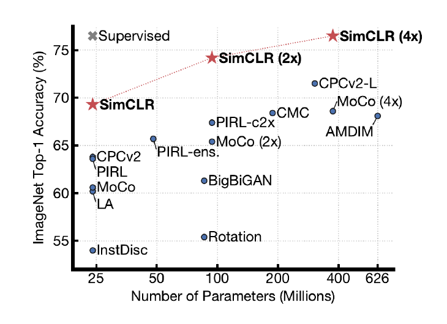

图 1. ImageNet 线性分类器的 Top-1 精度，该分类器使用不同的自监督方法（在 ImageNet 上预训练）学习的表示进行训练。灰色十字叉表示受监督的 ResNet-50。我们的方法 SimCLR 以粗体显示。

>Figure 1. ImageNet Top-1 accuracy of linear classifiers trained on representations learned with different self-supervised meth- ods (pretrained on ImageNet). Gray cross indicates supervised ResNet-50. Our method, SimCLR, is shown in bold.

然而，像素级的生成计算量很大，对于表示学习可能不是必需的。判别方法使用类似于监督学习的目标函数来学习表示，但训练网络执行代理任务，其中输入和标签都来自未标记的数据集。许多此类方法都依赖启发式方法来设计代理任务（Doersch et al., 2015; Zhang et al., 2016; Noroozi & Favaro, 2016; Gidaris et al., 2018），这可能会限制学习出的表示的一般性。基于潜在空间对比学习的判别方法最近显示出巨大的希望，实现了最先进的结果（Hadsell 等人，2006；Dosovitskiy 等人，2014；Oord 等人，2018；Bachman 等人., 2019)。

>However, pixel-level generation is computationally expen- sive and may not be necessary for representation learning. Discriminative approaches learn representations using objec- tive functions similar to those used for supervised learning, but train networks to perform pretext tasks where both the in- puts and labels are derived from an unlabeled dataset. Many such approaches have relied on heuristics to design pretext tasks (Doersch et al., 2015; Zhang et al., 2016; Noroozi & Favaro, 2016; Gidaris et al., 2018), which could limit the generality of the learned representations. Discriminative approaches based on contrastive learning in the latent space have recently shown great promise, achieving state-of-the- art results (Hadsell et al., 2006; Dosovitskiy et al., 2014; Oord et al., 2018; Bachman et al., 2019).

在这项工作中，我们引入了一个简单的框架用于视觉表示的对比学习，我们称之为 SimCLR。 SimCLR 不仅优于以前的工作（图 1），而且更简单，既不需要专门的架构（Bachman 等人，2019；Hénaff 等人，2019），也不需要 memory bank（Wu 等人， 2018；Tian 等人，2019；He 等人，2019；Misra 和 van der Maaten，2019）。

>In this work, we introduce a simple framework for con- trastive learning of visual representations, which we call SimCLR. Not only does SimCLR outperform previous work (Figure 1), but it is also simpler, requiring neither special- ized architectures (Bachman et al., 2019; Hénaff et al., 2019) nor a memory bank (Wu et al., 2018; Tian et al., 2019; He et al., 2019; Misra & van der Maaten, 2019).

为了了解是什么能够实现良好的对比表示学习，我们系统地研究了我们的架构主要的部分，并表明：

>In order to understand what enables good contrastive repre- sentation learning, we systematically study the major com- ponents of our framework and show that:

多个数据增强操作的组合对于定义产生有效表示的对比预测任务至关重要。此外，与监督学习相比，无监督对比学习受益于更强的数据增强。

> • Composition of multiple data augmentation operations is crucial in defining the contrastive prediction tasks that yield effective representations. In addition, unsupervised contrastive learning benefits from stronger data augmen- tation than supervised learning.

• 在表示和对比损失之间引入可学习的非线性变换大大提高了学习表示的质量。

>• Introducing a learnable nonlinear transformation be- tween the representation and the contrastive loss substan- tially improves the quality of the learned representations.

• 具有对比交叉熵损失的表示学习受益于归一化嵌入和适当调整的温度参数。

>• Representation learning with contrastive cross entropy loss benefits from normalized embeddings and an appro- priately adjusted temperature parameter.

• 与监督学习相比，对比学习受益于更大的 batch 规模和更长的训练时间。与监督学习一样，对比学习也受益于更深、更广的网络。

>• Contrastive learning benefits from larger batch sizes and longer training compared to its supervised counterpart. Like supervised learning, contrastive learning benefits from deeper and wider networks.

我们结合这些发现，在 ImageNet ILSVRC-2012（Russakovsky et al., 2015）上实现了自我监督和半监督学习的最新技术。在线性评估协议(linear evaluation protocol)下，SimCLR 实现了 76.5% 的 top-1 准确率，比之前的最新技术提高了 7%（Hénaff 等人，2019 年）。当仅使用 1% 的 ImageNet 标签进行微调时，SimCLR 实现了 85.8% 的 top-5 准确率，相对提高了 10%（Hénaff 等人，2019 年）。当在其他自然图像分类数据集上进行微调时，SimCLR 在 12 个数据集中的 10 个数据集上的表现与强监督基线（Kornblith 等人，2019）相当或更好。

>We combine these findings to achieve a new state-of-the-art in self-supervised and semi-supervised learning on Ima- geNet ILSVRC-2012 (Russakovsky et al., 2015). Under the linear evaluation protocol, SimCLR achieves 76.5% top-1 accuracy, which is a 7% relative improvement over previous state-of-the-art (Hénaff et al., 2019). When fine-tuned with only 1% of the ImageNet labels, SimCLR achieves 85.8% top-5 accuracy, a relative improvement of 10% (Hénaff et al., 2019). When fine-tuned on other natural image classifica- tion datasets, SimCLR performs on par with or better than a strong supervised baseline (Kornblith et al., 2019) on 10 out of 12 datasets.

## 2. 方法

>## 2. Method

### 2.1. 对比学习框架

>### 2.1. The Contrastive Learning Framework

受最近对比学习算法的启发（参见第 7 节的概述），SimCLR 通过潜在空间中的对比损失最大化同一数据示例的不同增强视图之间的一致性来学习表示。如图 2 所示，该框架包括以下四个主要组件。

>Inspired by recent contrastive learning algorithms (see Sec- tion 7 for an overview), SimCLR learns representations by maximizing agreement between differently augmented views of the same data example via a contrastive loss in the latent space. As illustrated in Figure 2, this framework comprises the following four major components.

• 一个随机数据增强模块，它随机转换任何给定的数据示例，得到同一示例的两个相关视图，表示为

 和

，我们将其视为正对。在这项工作中，我们依次应用三个简单的增强：随机裁剪，然后将大小调整回原始大小、随机颜色失真和随机高斯模糊。如第 3 节所示，随机裁剪和颜色失真的组合对于获得良好的性能至关重要。

>• A stochastic data augmentation module that transforms any given data example randomly resulting in two cor- related views of the same example, denoted ˜xi and ˜xj, which we consider as a positive pair. In this work, we sequentially apply three simple augmentations: random cropping followed by resize back to the original size, ran- dom color distortions, and random Gaussian blur. As shown in Section 3, the combination of random crop and color distortion is crucial to achieve a good performance.

• 一个神经网络基础编码器 f(·)，它从增强数据示例中提取表示向量。我们的框架允许在没有任何限制的情况下对网络架构进行各种选择。我们选择简单，采用常用的 ResNet (He et al., 2016)

>• A neural network base encoder f (·) that extracts repre- sentation vectors from augmented data examples. Our framework allows various choices of the network archi- tecture without any constraints. We opt for simplicity and adopt the commonly used ResNet (He et al., 2016)

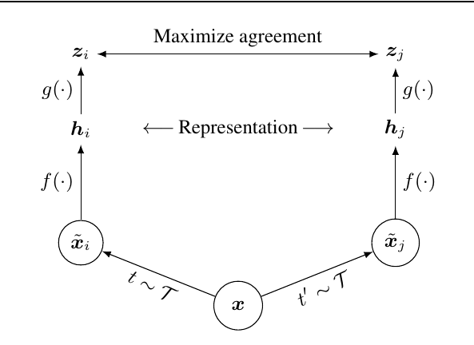

图 2. 视觉表示对比学习的简单框架。两个独立的数据增强算子从同一个增强族（t ~ T 和 t' ~ T ）中采样，并应用于每个数据示例以获得两个相关视图。基础编码器网络 f(·) 和投影头 g(·) 被训练以使用对比损失最大化一致性。训练完成后，我们丢弃投影头 g(·) 并使用编码器 f(·) 和表示 h 进行下游任务。

>Figure 2. A simple framework for contrastive learning of visual representations. Two separate data augmentation operators are sampled from the same family of augmentations (t ∼ T and t(cid:48) ∼ T ) and applied to each data example to obtain two correlated views. A base encoder network f(·) and a projection head g(·) are trained to maximize agreement using a contrastive loss. After training is completed, we throw away the projection head g(·) and use encoder f(·) and representation h for downstream tasks.

得到
=\operatorname{ResNet}\left(\tilde{\boldsymbol{x}}_i\right))
其中 

是平均池化层之后的输出。

>to obtain hi = f ( ˜xi) = ResNet( ˜xi) where hi ∈ Rd is the output after the average pooling layer.

• 一个小型神经网络投影头g(·)，将表示映射到应用对比损失的空间。我们使用具有一个隐藏层的 MLP 来获得 
=W^{(2)}%20\sigma\left(W^{(1)}%20\boldsymbol{h}_i\right))
，其中 σ 是 ReLU 非线性。如第 4 节所示，我们发现在 

 而非 

 上定义对比损失是有益的。

>• A small neural network projection head g(·) that maps representations to the space where contrastive loss is applied. We use a MLP with one hidden layer to obtain zi = g(hi) = W (2)σ(W (1)hi) where σ is a ReLU non- linearity. As shown in section 4, we find it beneficial to define the contrastive loss on zi’s rather than hi’s.

• 为对比预测任务定义的对比损失函数。给定一个集合

 包括一对正例 

 和 

，对比预测任务旨在为给定的

识别

中的  

 。

>• A contrastive loss function defined for a contrastive pre- diction task. Given a set { ˜xk} including a positive pair of examples ˜xi and ˜xj, the contrastive prediction task aims to identify ˜xj in { ˜xk}k(cid:54)=i for a given ˜xi.

我们从 N 个示例中随机抽取一个 minibatch，并在从 minibatch 派生的成对增强示例上定义对比预测任务，得到 2N 个数据点。我们没有明确地抽样负例。相反，给定一对正例，类似于 (Chen et al., 2017)，我们将 minibatch 中的其他 2(N - 1) 个增强示例视为负例。设
=\boldsymbol{u}^{\top}%20\boldsymbol{v}%20/\|\boldsymbol{u}\|\|\boldsymbol{v}\|)
表示 u 和 v之间的点积

 归一化的（即余弦相似度）。然后将正样本对 (i, j) 的损失函数定义为

>We randomly sample a minibatch of N examples and define the contrastive prediction task on pairs of augmented exam- ples derived from the minibatch, resulting in 2N data points. We do not sample negative examples explicitly. Instead, given a positive pair, similar to (Chen et al., 2017), we treat the other 2(N − 1) augmented examples within a minibatch as negative examples. Let sim(u, v) = u(cid:62)v/(cid:107)u(cid:107)(cid:107)v(cid:107) de- note the dot product between (cid:96)2 normalized u and v (i.e. cosine similarity). Then the loss function for a positive pair of examples (i, j) is defined as

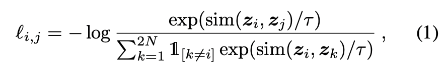

其中 

 是一个指示函数，当 

 和时评估为 1,  τ 表示温度参数。最终损失是在 mini-batch 中的 (i, j) 和 (j, i) 中的所有正对中计算的。这种损失已在以前的工作中使用（Sohn，2016；Wu 等人，2018；Oord 等人，2018）；为方便起见，我们将其称为 NT-Xent（归一化的温标交叉熵损失）.

>where 1[k(cid:54)=i] ∈ {0, 1} is an indicator function evaluating to 1 iff k (cid:54)= i and τ denotes a temperature parameter. The fi- nal loss is computed across all positive pairs, both (i, j) and (j, i), in a mini-batch. This loss has been used in previous work (Sohn, 2016; Wu et al., 2018; Oord et al., 2018); for convenience, we term it NT-Xent (the normalized temperature-scaled cross entropy loss).

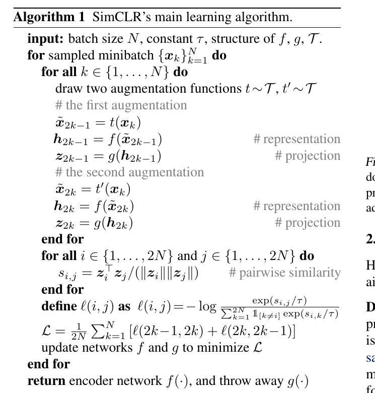

算法 1 总结了所提出的方法。

>Algorithm 1 summarizes the proposed method.

### 2.2.大批量训练

>### 2.2. Training with Large Batch Size

为简单起见，我们不使用 memory bank 训练模型（Wu 等人，2018；He 等人，2019）。相反，我们将训练 batch 大小 N 从 256 更改为 8192。大小为 8192 的 batch 为我们提供了来自两个增强视图的每个正对的 16382 个负样本。当使用具有线性学习率缩放的标准 SGD/Momentum 时，大 batch 大小的训练可能会不稳定（Goyal 等，2017）。为了稳定训练，我们对所有 batch 大小使用 LARS 优化器（You et al., 2017）。我们使用 Cloud TPU 训练我们的模型，使用 32 到 128 个内核，具体取决于 batch 大小。2

>To keep it simple, we do not train the model with a memory bank (Wu et al., 2018; He et al., 2019). Instead, we vary the training batch size N from 256 to 8192. A batch size of 8192 gives us 16382 negative examples per positive pair from both augmentation views. Training with large batch size may be unstable when using standard SGD/Momentum with linear learning rate scaling (Goyal et al., 2017). To stabilize the training, we use the LARS optimizer (You et al., 2017) for all batch sizes. We train our model with Cloud TPUs, using 32 to 128 cores depending on the batch size.2

**全局BN**。标准 ResNet 使用 batch 归一化（Ioffe & Szegedy，2015）。在具有数据并行性的分布式训练中，BN 均值和方差通常在每个设备本地聚合。在我们的对比学习中，由于正对是在同一设备中计算的，因此该模型可以利用局部信息泄漏来提高预测精度，而无需改进表示。我们通过在训练期间聚合所有设备的 BN 均值和方差来解决这个问题。其他方法包括跨设备打乱数据样本（He 等人，2019 年），或用layer norm替换 BN（Hénaff 等人，2019 年）。

>Global BN. Standard ResNets use batch normaliza- tion (Ioffe & Szegedy, 2015). In distributed training with data parallelism, the BN mean and variance are typically aggregated locally per device. In our contrastive learning, as positive pairs are computed in the same device, the model can exploit the local information leakage to improve pre- diction accuracy without improving representations. We ad- dress this issue by aggregating BN mean and variance over all devices during the training. Other approaches include shuffling data examples across devices (He et al., 2019), or replacing BN with layer norm (Hénaff et al., 2019).

使用 128 个 TPU v3 内核，训练我们的 ResNet-50 需要约 1.5 小时，batch 大小为 4096，持续 100 个 epoch。

>With 128 TPU v3 cores, it takes ∼1.5 hours to train our ResNet-50 with a batch size of 4096 for 100 epochs.

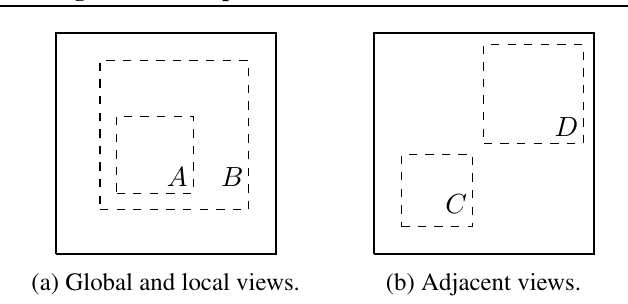

图 3. 实心矩形是图像，虚线矩形是随机裁剪的。通过随机裁剪图像，我们对包括全局到局部视图（B→A）或相邻视图（D→C）预测的对比预测任务进行采样。

>Figure 3. Solid rectangles are images, dashed rectangles are ran- dom crops. By randomly cropping images, we sample contrastive prediction tasks that include global to local view (B → A) or adjacent view (D → C) prediction.

### 2.3.评估协议

>### 2.3. Evaluation Protocol

在这里，我们为我们的实证研究制定了协议，旨在了解我们框架中的不同设计选择。

>Here we lay out the protocol for our empirical studies, which aim to understand different design choices in our framework.

**数据集和指标**。我们对无监督预训练（学习没有标签的编码器网络 f）的大部分研究都是使用 ImageNet ILSVRC-2012 数据集（Russakovsky et al., 2015）完成的。 CIFAR-10 上的一些额外的预训练实验 (Krizhevsky & Hinton, 2009) 可以在附录 B.9 中找到。我们还在用于迁移学习的各种数据集上测试预训练结果。为了评估学习的表示，我们遵循广泛使用的线性评估协议（Zhang et al., 2016; Oord et al., 2018; Bachman et al., 2019; Kolesnikov et al., 2019），其中线性分类器在冻结的基础网络上进行训练，测试准确度反应了模型的质量。除了线性评估之外，我们还与最先进的半监督和迁移学习进行了比较。

>Dataset and Metrics. Most of our study for unsupervised pretraining (learning encoder network f without labels) is done using the ImageNet ILSVRC-2012 dataset (Rus- sakovsky et al., 2015). Some additional pretraining experi- ments on CIFAR-10 (Krizhevsky & Hinton, 2009) can be found in Appendix B.9. We also test the pretrained results on a wide range of datasets for transfer learning. To evalu- ate the learned representations, we follow the widely used linear evaluation protocol (Zhang et al., 2016; Oord et al., 2018; Bachman et al., 2019; Kolesnikov et al., 2019), where a linear classifier is trained on top of the frozen base net- work, and test accuracy is used as a proxy for representation quality. Beyond linear evaluation, we also compare against state-of-the-art on semi-supervised and transfer learning.

**默认设置**。除非另有说明，否则对于数据增强，我们使用随机裁剪和调整大小（随机翻转）、颜色失真和高斯模糊（详见附录 A）。我们使用 ResNet-50 作为基础编码器网络，使用 2 层 MLP 投影头将表示投影到 128 维潜在空间。作为损失，我们使用 NT-Xent，使用 LARS 进行优化，学习率为 4.8 (= 0.3 × BatchSize/256)，权重衰减为 10−6。我们以 batch 大小 4096 训练 100 epoch 。 此外，我们在前 10 epoch 秒使用线性预热，并使用余弦衰减计划衰减学习率，无需重新启动（Loshchilov & Hutter, 2016）。

>Default setting. Unless otherwise specified, for data aug- mentation we use random crop and resize (with random flip), color distortions, and Gaussian blur (for details, see Appendix A). We use ResNet-50 as the base encoder net- work, and a 2-layer MLP projection head to project the representation to a 128-dimensional latent space. As the loss, we use NT-Xent, optimized using LARS with learning rate of 4.8 (= 0.3 × BatchSize/256) and weight decay of 10−6. We train at batch size 4096 for 100 epochs.3 Fur- thermore, we use linear warmup for the first 10 epochs, and decay the learning rate with the cosine decay schedule without restarts (Loshchilov & Hutter, 2016).

## 3.对比表示学习的数据增强

>### 3.Data Augmentation for Contrastive Representation Learning

数据增强定义了预测任务。虽然数据增强已广泛用于有监督和无监督的表示学习（Krizhevsky 等人，

>Data augmentation defines predictive tasks. While data augmentation has been widely used in both supervised and unsupervised representation learning (Krizhevsky et al.,

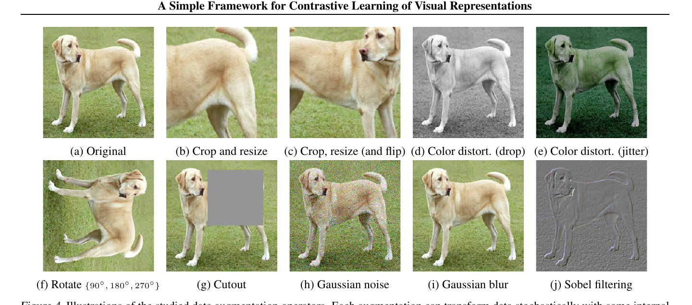

图 4. 研究的数据增强操作的插图。每个增强都可以使用一些内部参数（例如旋转度、噪声水平）随机变换数据。请注意，我们仅在消融中测试这些算子，用于训练我们模型的增强策略仅包括随机裁剪（带有翻转和调整大小）、颜色失真和高斯模糊（原图提供者：Von.grzanka）

>Figure 4. Illustrations of the studied data augmentation operators. Each augmentation can transform data stochastically with some internal parameters (e.g. rotation degree, noise level). Note that we only test these operators in ablation, the augmentation policy used to train our models only includes random crop (with flip and resize), color distortion, and Gaussian blur. (Original image cc-by: Von.grzanka)

2012； Hénaff 等人，2019 年； Bachman et al., 2019)，它还没有被认为是定义对比预测任务的系统方法。许多现有的方法通过改变架构来定义对比预测任务。例如，Hjelm 等人（2018）；巴赫曼等人（2019）通过限制网络架构中的感受野来实现全局到局部的视图预测，而 Oord 等人（2018）； Hénaff 等人（2019）通过固定的图像分割过程和上下文聚合网络实现相邻视图预测。我们表明，可以通过对目标图像执行简单的随机裁剪（调整大小）来避免这种复杂性，这会创建一系列包含上述两个的预测任务，如图 3. 这种简单的设计选择可以方便地将预测任务与其他组件（例如神经网络架构）分离。可以通过扩展增强系列并随机组合它们来定义更广泛的对比预测任务。

>2012; Hénaff et al., 2019; Bachman et al., 2019), it has not been considered as a systematic way to define the con- trastive prediction task. Many existing approaches define contrastive prediction tasks by changing the architecture. For example, Hjelm et al. (2018); Bachman et al. (2019) achieve global-to-local view prediction via constraining the receptive field in the network architecture, whereas Oord et al. (2018); Hénaff et al. (2019) achieve neighboring view prediction via a fixed image splitting procedure and a con- text aggregation network. We show that this complexity can be avoided by performing simple random cropping (with resizing) of target images, which creates a family of predic- tive tasks subsuming the above mentioned two, as shown in Figure 3. This simple design choice conveniently decouples the predictive task from other components such as the neural network architecture. Broader contrastive prediction tasks can be defined by extending the family of augmentations and composing them stochastically.

### 3.1.数据增强操作的组合对于学习良好的表示至关重要

>### 3.1. Composition of data augmentation operations is crucial for learning good representations

为了系统地研究数据增强的影响，我们在这里考虑几种常见的增强。一种类型的增强涉及数据的空间/几何变换，例如裁剪和调整大小（水平翻转）、旋转（Gidaris 等人，2018 年）和剪切（De-Vries & Taylor，2017 年）。另一种类型的增强涉及外观转换，例如颜色失真（包括颜色下降、亮度、对比度、饱和度、色调）（Howard，2013；Szegedy 等，2015）、高斯模糊和 Sobel 过滤。图 4 可视化了我们在这项工作中研究的增强。

>To systematically study the impact of data augmentation, we consider several common augmentations here. One type of augmentation involves spatial/geometric transformation of data, such as cropping and resizing (with horizontal flipping), rotation (Gidaris et al., 2018) and cutout (De- Vries & Taylor, 2017). The other type of augmentation involves appearance transformation, such as color distortion (including color dropping, brightness, contrast, saturation, hue) (Howard, 2013; Szegedy et al., 2015), Gaussian blur, and Sobel filtering. Figure 4 visualizes the augmentations that we study in this work.

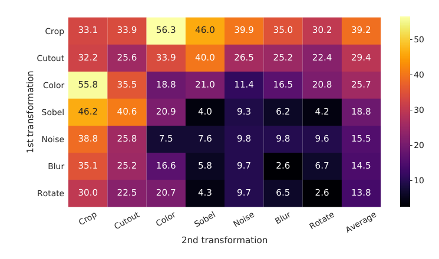

图 5. 单个或组合数据增强下的线性评估（ImageNet top-1 精度），仅应用于一个分支。对于除最后一列之外的所有列，对角线条目对应于单个变换，非对角线对应于两个变换的组合（按顺序应用）。最后一列反映了该行的平均值。

>Figure 5. Linear evaluation (ImageNet top-1 accuracy) under in- dividual or composition of data augmentations, applied only to one branch. For all columns but the last, diagonal entries corre- spond to single transformation, and off-diagonals correspond to composition of two transformations (applied sequentially). The last column reflects the average over the row.

为了理解单个数据增强的效果和增强组合的重要性，我们研究了我们的框架在单独或成对应用增强时的性能。由于 ImageNet 图像的大小不同，我们总是应用裁剪和调整图像大小（Krizhevsky et al., 2012; Szegedy et al., 2015），这使得在没有裁剪的情况下很难研究其他增强.为了消除这种混淆，我们考虑了一种用于这种消融实验的非对称数据转换设置。具体来说，我们总是首先随机裁剪图像并将它们调整为相同的分辨率，然后我们将目标转换仅应用于图 2 中框架的一个分支，而将另一个分支设为恒等分支（如 
=\boldsymbol{x}_i)
）。请注意，这种不对称的数据增量会损害性能。

>To understand the effects of individual data augmentations and the importance of augmentation composition, we in- vestigate the performance of our framework when applying augmentations individually or in pairs. Since ImageNet images are of different sizes, we always apply crop and re- size images (Krizhevsky et al., 2012; Szegedy et al., 2015), which makes it difficult to study other augmentations in the absence of cropping. To eliminate this confound, we consider an asymmetric data transformation setting for this ablation. Specifically, we always first randomly crop im- ages and resize them to the same resolution, and we then apply the targeted transformation(s) only to one branch of the framework in Figure 2,while leaving the other branch as the identity (i.e. t(xi) = xi). Note that this asymmet-ric data augmentation hurts the performance.

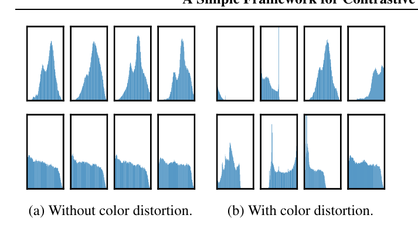

图 6. 两个不同图像（即两行）的不同裁剪的像素强度（在所有通道上）的直方图。第一行的图像来自图 4。所有轴具有相同的范围。

>Figure 6. Histograms of pixel intensities (over all channels) for different crops of two different images (i.e. two rows). The image for the first row is from Figure 4. All axes have the same range.

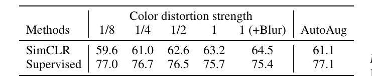

表 1. 在不同颜色失真强度（见附录 A）和其他数据转换下，使用线性评估和监督 ResNet-50 的无监督 ResNet-50 的 Top-1 准确度。强度 1 (+Blur) 是我们的默认数据增强策略。

>Table 1. Top-1 accuracy of unsupervised ResNet-50 using linear evaluation and supervised ResNet-505, under varied color distor- tion strength (see Appendix A) and other data transformations. Strength 1 (+Blur) is our default data augmentation policy.

尽管如此，这种设置不应实质性地改变单个数据增强或其组成的影响。

>Nonetheless, this setup should not substantively change the impact of individual data augmentations or their compositions.

图 5 显示了单个和组合变换下的线性评估结果。我们观察到没有单一的转换足以学习良好的表示，即使模型几乎可以完美地识别对比任务中的正对。在组合增强时，对比预测任务变得更难，但表示的质量显着提高。附录 B.2 提供了关于组成更广泛的增强集的进一步研究。

>Figure 5 shows linear evaluation results under individual and composition of transformations. We observe that no single transformation suffices to learn good representations, even though the model can almost perfectly identify the positive pairs in the contrastive task. When composing aug- mentations, the contrastive prediction task becomes harder, but the quality of representation improves dramatically. Ap- pendix B.2 provides a further study on composing broader set of augmentations.

一种增强组合脱颖而出：随机裁剪和随机颜色失真。我们推测，当仅使用随机裁剪作为数据增强时，一个严重的问题是图像中的大多数 patches 共享相似的颜色分布。图 6 显示仅颜色直方图就足以区分图像。神经网络可以利用这种捷径来解决预测任务。因此，为了学习可概括的特征，组合裁剪与颜色失真是至关重要的。

>One composition of augmentations stands out: random crop- ping and random color distortion. We conjecture that one serious issue when using only random cropping as data augmentation is that most patches from an image share a similar color distribution. Figure 6 shows that color his- tograms alone suffice to distinguish images. Neural nets may exploit this shortcut to solve the predictive task. There- fore, it is critical to compose cropping with color distortion in order to learn generalizable features.

### 3.2.对比学习比监督学习需要更强的数据增强

>### 3.2. Contrastive learning needs stronger data augmentation than supervised learning

为了进一步证明颜色增强的重要性，我们将颜色增强的强度调整为

>To further demonstrate the importance of the color aug- mentation, we adjust the strength of color augmentation as

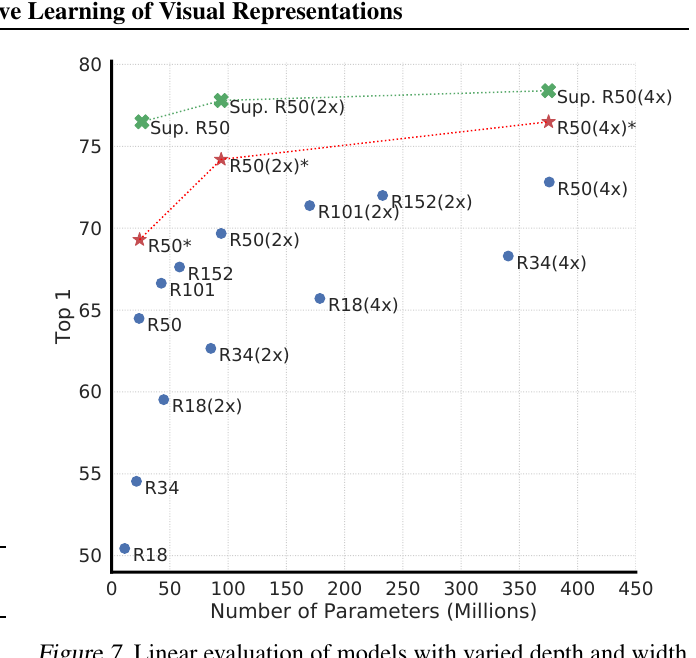

图 7. 具有不同深度和宽度的模型的线性评估。蓝点中的模型是我们训练了 100 epoch 的模型，红星中的模型是我们训练了 1000 epoch 的模型，绿色十字中的模型是训练了 90 epoch 的监督 ResNet（He et al., 2016 ）。

>Figure 7. Linear evaluation of models with varied depth and width. Models in blue dots are ours trained for 100 epochs, models in red stars are ours trained for 1000 epochs, and models in green crosses are supervised ResNets trained for 90 epochs7 (He et al., 2016).

如表 1 所示。更强的颜色增强显著提高了学习的无监督模型的线性评估。在这种情况下，AutoAugment (Cubuk et al., 2019) 是一种使用监督学习发现的复杂的增强策略，它并不比简单的裁剪 +（更强的）颜色失真效果更好。当使用相同的增强集训练监督模型时，我们观察到更强的颜色增强不会改善甚至损害它们的性能。因此，我们的实验表明，与监督学习相比，无监督对比学习受益于更强的（颜色）数据增强。尽管之前的工作报告说数据增强对自我监督学习很有用（Doersch 等人，2015；Bachman 等人，2019；Hénaff 等人，2019；Asano 等人，2019），但我们表明没有为监督学习带来准确性优势的数据增强 仍然可以极大地帮助对比学习。

>shown in Table 1. Stronger color augmentation substan- tially improves the linear evaluation of the learned unsuper- vised models. In this context, AutoAugment (Cubuk et al., 2019), a sophisticated augmentation policy found using su- pervised learning, does not work better than simple cropping + (stronger) color distortion. When training supervised mod- els with the same set of augmentations, we observe that stronger color augmentation does not improve or even hurts their performance. Thus, our experiments show that unsu- pervised contrastive learning benefits from stronger (color) data augmentation than supervised learning. Although pre- vious work has reported that data augmentation is useful for self-supervised learning (Doersch et al., 2015; Bachman et al., 2019; Hénaff et al., 2019; Asano et al., 2019), we show that data augmentation that does not yield accuracy benefits for supervised learning can still help considerably with contrastive learning.

## 4.编码器和头的架构

>## 4.Architectures for Encoder and Head

### 4.1.无监督对比学习从更大的模型中获益（更多）

>### 4.1. Unsupervised contrastive learning benefits (more) from bigger models

图 7 显示，可能不足为奇的是，增加深度和宽度都可以提高性能。虽然监督学习也有类似的发现（He et al., 2016），但我们发现监督模型和在无监督模型上训练的线性分类器之间的差距随着模型大小的增加而缩小，这表明无监督学习比监督模型更能从更大的模型中受益.

>Figure 7 shows, perhaps unsurprisingly, that increasing depth and width both improve performance. While similar findings hold for supervised learning (He et al., 2016), we find the gap between supervised models and linear classifiers trained on unsupervised models shrinks as the model size increases, suggesting that unsupervised learning benefits more from bigger models than its supervised counterpart.

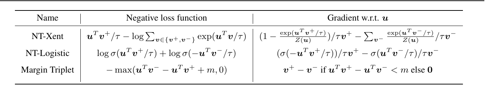

表 2. 负损失函数及其梯度。所有输入向量，即 

，都被 

 归一化。 NT-Xent 是“Normalized Temperature-scaled Cross Entropy”的缩写。不同的损失函数对正负样本施加不同的权重。

>Table 2. Negative loss functions and their gradients. All input vectors, i.e. u, v+, v−, are (cid:96)2 normalized. NT-Xent is an abbreviation for “Normalized Temperature-scaled Cross Entropy”. Different loss functions impose different weightings of positive and negative examples.

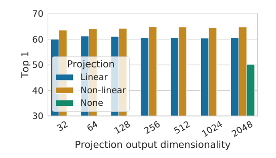

图 8. 具有不同投影头 g(·) 和 z = g(h) 的各种维度的表示的线性评估。表示 h（投影前）在这里是 2048 维的。

>Figure 8. Linear evaluation of representations with different pro- jection heads g(·) and various dimensions of z = g(h). The representation h (before projection) is 2048-dimensional here.

### 4.2.非线性投影头提高了前一层的表示质量

>### 4.2. A nonlinear projection head improves the representation quality of the layer before it

然后我们研究包括投影头的重要性，即 g(h)。图 8 显示了对头部使用三种不同架构的线性评估结果：（1）恒等映射； (2) 线性投影，如之前的几种方法所使用的 (Wu et al., 2018)； (3) 带有一个附加隐藏层（和 ReLU 激活）的默认非线性投影，类似于 Bachman 等人（2019）。我们观察到非线性投影优于线性投影（+3%），并且比无投影（>10%）好得多。当使用投影头时，无论输出尺寸如何，都可以观察到类似的结果。此外，即使使用非线性投影，投影头之前的层 h 仍然比之后的层 z = g(h) 好得多（>10%），这表明投影头之前的隐藏层是比之后的层更好的表示。

>We then study the importance of including a projection head, i.e. g(h). Figure 8 shows linear evaluation results using three different architecture for the head: (1) identity mapping; (2) linear projection, as used by several previous approaches (Wu et al., 2018); and (3) the default nonlinear projection with one additional hidden layer (and ReLU acti- vation), similar to Bachman et al. (2019). We observe that a nonlinear projection is better than a linear projection (+3%), and much better than no projection (>10%). When a pro- jection head is used, similar results are observed regardless of output dimension. Furthermore, even when nonlinear projection is used, the layer before the projection head, h, is still much better (>10%) than the layer after, z = g(h), which shows that the hidden layer before the projection head is a better representation than the layer after.

我们推测在非线性投影之前采用表示的重要性 是由于对比损失引起的信息损失。特别是，z = g(h) 被训练为对数据转换保持不变。因此，g 可以删除可能对下游任务有用的信息，例如对象的颜色或方向。通过利用非线性变换 g(·)，可以在 h 中形成和维护更多信息。为了验证这一假设，我们进行了使用 h 或 g(h) 的实验来学习预测在训练前应用的转换。这里我们设置
=W^{(2)}%20\sigma\left(W^{(1)}%20h\right))
，具有相同的输入和输出维度（即 2048）。表 3 显示 h 包含有关应用的转换的更多信息，而 g(h) 丢失了信息。进一步分析可以见附录 B.4。

>We conjecture that the importance of using the representa- tion before the nonlinear projection is due to loss of informa- tion induced by the contrastive loss. In particular, z = g(h) is trained to be invariant to data transformation. Thus, g can remove information that may be useful for the downstream task, such as the color or orientation of objects. By leverag- ing the nonlinear transformation g(·), more information can be formed and maintained in h. To verify this hypothesis, we conduct experiments that use either h or g(h) to learn to predict the transformation applied during the pretraining. Here we set g(h) = W (2)σ(W (1)h), with the same input and output dimensionality (i.e. 2048). Table 3 shows h contains much more information about the transformation applied, while g(h) loses information. Further analysis can be found in Appendix B.4.

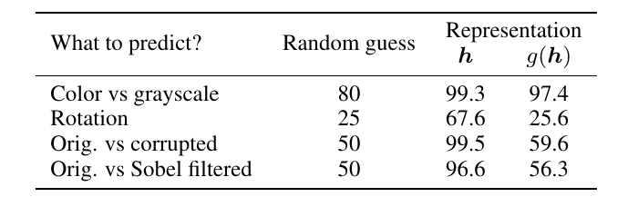

表 3. 在不同的表示上训练额外的 MLP 以预测应用的转换的准确性。除了裁剪和颜色增强之外，我们还在最后三行的预训练期间额外且独立地添加了旋转（{0°、90°、180°、270°} 之一）、高斯噪声和 Sobel 过滤变换。 h 和 g(h) 的维数相同，即 2048。

>Table 3. Accuracy of training additional MLPs on different repre- sentations to predict the transformation applied. Other than crop and color augmentation, we additionally and independently add rotation (one of {0◦, 90◦, 180◦, 270◦}), Gaussian noise, and So- bel filtering transformation during the pretraining for the last three rows. Both h and g(h) are of the same dimensionality, i.e. 2048.

## 5. 损失函数和批量大小

>## 5. Loss Functions and Batch Size

### 5.1.具有可调温度的归一化交叉熵损失比其他方法效果更好

>### 5.1.Normalized cross entropy loss with adjustable temperature works better than alternatives

我们将 NT-Xent 损失与其他常用的对比损失函数进行比较，例如logistic损失 (Mikolov et al., 2013) 和margin损失 (Schroff et al., 2015)。表 2 显示了目标函数以及损失函数输入的梯度。查看梯度，我们观察到 1) 

 归一化（即余弦相似度）以及温度有效地加权不同的样本，并且适当的温度可以帮助模型从硬负样本（hard negatives）中学习； 2）与交叉熵不同，其他目标函数不通过它们的相对硬度来衡量负值。因此，必须对这些损失函数应用半硬负挖掘（semi-hard negative mining） (Schroff et al., 2015)：而不是计算所有损失项的梯度，可以使用半硬负项计算梯度（即，那些在损失范围内并且距离最近，但比正例更远的）。

>We compare the NT-Xent loss against other commonly used contrastive loss functions, such as logistic loss (Mikolov et al., 2013), and margin loss (Schroff et al., 2015). Table 2 shows the objective function as well as the gradient to the input of the loss function. Looking at the gradient, we observe 1) (cid:96)2 normalization (i.e. cosine similarity) along with temperature effectively weights different examples, and an appropriate temperature can help the model learn from hard negatives; and 2) unlike cross-entropy, other objec- tive functions do not weigh the negatives by their relative hardness. As a result, one must apply semi-hard negative mining (Schroff et al., 2015) for these loss functions: in- stead of computing the gradient over all loss terms, one can compute the gradient using semi-hard negative terms (i.e., those that are within the loss margin and closest in distance, but farther than positive examples).

为了使比较公平，我们对所有损失函数使用相同的

归一化，我们调整超参数，并报告它们的最佳结果。 表 4 表明，虽然（半硬）负挖掘有帮助，最好的结果仍然比我们默认的 NT-Xent 损失差很多。

>To make the comparisons fair, we use the same (cid:96)2 normaliza- tion for all loss functions, and we tune the hyperparameters, and report their best results.8 Table 4 shows that, while (semi-hard) negative mining helps, the best result is still much worse than our default NT-Xent loss.

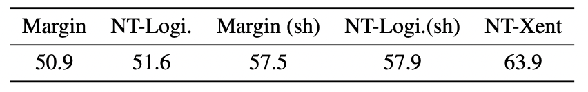

表 4. 使用不同损失函数训练的模型的线性评估（top-1）。 “sh”表示使用半硬负挖掘。

>Table 4. Linear evaluation (top-1) for models trained with different loss functions. “sh” means using semi-hard negative mining.

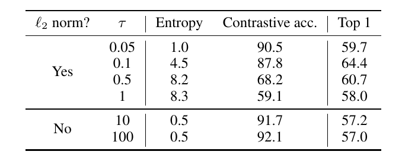

表 5. 使用 

 范数和温度 τ 的不同选择对 NT-Xent 损失进行训练的模型的线性评估。对比分布超过 4096 个示例。

>Table 5. Linear evaluation for models trained with different choices of (cid:96)2 norm and temperature τ for NT-Xent loss. The contrastive distribution is over 4096 examples.

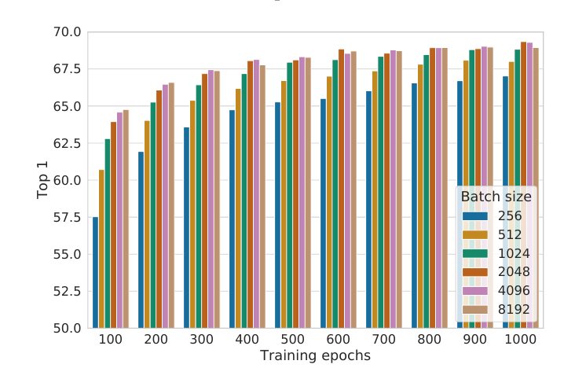

图 9. 使用不同 batch 大小和 epoch 训练的线性评估模型 (ResNet-50)。每个bar都是从头开始运行的。

>Figure 9. Linear evaluation models (ResNet-50) trained with differ- ent batch size and epochs. Each bar is a single run from scratch.10

接下来，我们在默认的 NT-Xent 损失中测试

  归一化（即余弦相似度 vs  点积）和温度 τ 的重要性。表 5 表明，如果没有标准化和适当的温度缩放，性能会明显变差。没有

 归一化，对比任务的准确率更高，但在线性评估下得到的表示更差。

>We next test the importance of the (cid:96)2 normalization (i.e. cosine similarity vs dot product) and temperature τ in our default NT-Xent loss. Table 5 shows that without normal- ization and proper temperature scaling, performance is sig- nificantly worse. Without (cid:96)2 normalization, the contrastive task accuracy is higher, but the resulting representation is worse under linear evaluation.

### 5.2.较大的 batch 规模和较长的训练时间对对比学习的好处（更多）

>### 5.2. Contrastive learning benefits (more) from larger batch sizes and longer training

图 9 显示了当针对不同数量的 batch 训练模型时 epoch 大小的影响。我们发现，当训练 epoch 的数量较少（例如 100 epoch）时，较大的 batch 尺寸比较小的尺寸具有显着优势。随着更多的训练steps/epoch，不同 batch 大小之间的差距会减小或消失，前提是 batch 是随机重新采样的。相比之下

>Figure 9 shows the impact of batch size when models are trained for different numbers of epochs. We find that, when the number of training epochs is small (e.g. 100 epochs), larger batch sizes have a significant advantage over the smaller ones. With more training steps/epochs, the gaps between different batch sizes decrease or disappear, pro- vided the batches are randomly resampled. In contrast to

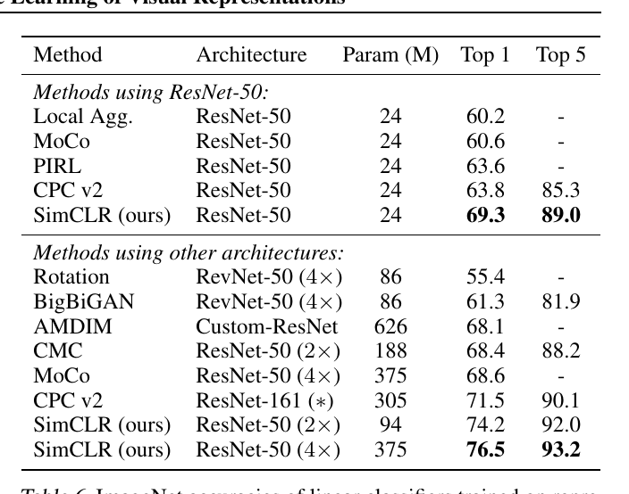

表 6. 使用不同自监督方法学习的表示训练的线性分类器的 ImageNet 准确度。

>Table 6. ImageNet accuracies of linear classifiers trained on repre- sentations learned with different self-supervised methods.

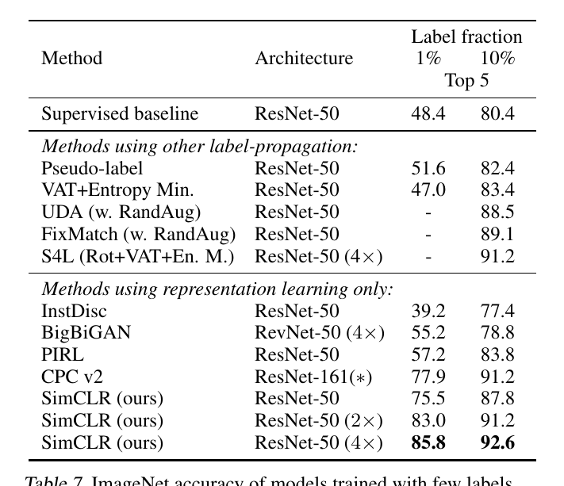

表 7. 使用少量标签训练的模型的 ImageNet 准确度。

>Table 7. ImageNet accuracy of models trained with few labels.

监督学习 (Goyal et al., 2017)，在对比学习中，较大的 batch 大小会提供更多的负样本，从而促进收敛（即在给定的准确度下采取更少的 epochs 和steps）。训练时间更长也会提供更多的负例，从而改善结果。在附录 B.1 中，提供了更长训练步骤的结果。

>supervised learning (Goyal et al., 2017), in contrastive learn- ing, larger batch sizes provide more negative examples, facilitating convergence (i.e. taking fewer epochs and steps for a given accuracy). Training longer also provides more negative examples, improving the results. In Appendix B.1, results with even longer training steps are provided.

## 6. 与最先进的比较

>## 6. Comparison with State-of-the-art

在本小节中，类似于 Kolesnikov 等人（2019）；He等人(2019)，我们在 3 个不同的隐藏层宽度（宽度乘数为 1×、2× 和 4×）中使用 ResNet-50。为了更好地收敛，我们这里的模型训练了 1000 epoch 秒。

>In this subsection, similar to Kolesnikov et al. (2019); He et al. (2019), we use ResNet-50 in 3 different hidden layer widths (width multipliers of 1×, 2×, and 4×). For better convergence, our models here are trained for 1000 epochs.

**线性评估**。表 6 将我们的结果与之前的方法进行了比较（Zhuang et al., 2019; He et al., 2019; Misra & van der Maaten, 2019; Hénaff et al., 2019; Kolesnikov et al., 2019; Donahue & Simonyan, 2019; Bachman et al.,

>Linear evaluation. Table 6 compares our results with previ- ous approaches (Zhuang et al., 2019; He et al., 2019; Misra & van der Maaten, 2019; Hénaff et al., 2019; Kolesnikov et al., 2019; Donahue & Simonyan, 2019; Bachman et al.,

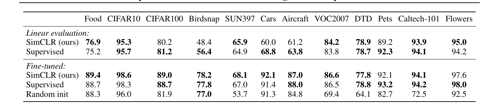

表 8. 对于在 ImageNet 上预训练的 ResNet-50 (4×) 模型，我们的自我监督方法的迁移学习性能与 12 个自然图像分类数据集的监督基线的比较。结果并不比最好的差（p > 0.05，置换检验）以粗体显示。有关标准 ResNet-50 的实验细节和结果，请参见附录 B.8。

>Table 8. Comparison of transfer learning performance of our self-supervised approach with supervised baselines across 12 natural image classification datasets, for ResNet-50 (4×) models pretrained on ImageNet. Results not significantly worse than the best (p > 0.05, permutation test) are shown in bold. See Appendix B.8 for experimental details and results with standard ResNet-50.

2019; Tian et al., 2019) 在线性评估设置中（见附录 B.6）。表 1 显示了不同方法之间的更多数值比较。与以前需要专门设计架构的方法相比，我们能够使用标准网络获得更好的结果。使用我们的 ResNet-50 (4×) 获得的最佳结果可以匹配监督预训练的 ResNet-50。

>2019; Tian et al., 2019) in the linear evaluation setting (see Appendix B.6). Table 1 shows more numerical compar- isons among different methods. We are able to use standard networks to obtain substantially better results compared to previous methods that require specifically designed archi- tectures. The best result obtained with our ResNet-50 (4×) can match the supervised pretrained ResNet-50.

**半监督学习**。我们关注 Zhai 等人（2019）并以类平衡的方式对标记的 ILSVRC-12 训练数据集的 1% 或 10% 进行采样（每类分别为 ~12.8 和 ~128 个图像）。 我们只是在没有正则化的情况下在标记数据上微调整个基础网络（参见附录 B.5）。表 7 显示了我们的结果与最近方法的比较（Zhai 等人，2019；Xie 等人，2019；Sohn 等人，2020；Wu 等人，2018；Donahue 和 Simonyan，2019；Misra 和 van der Maaten，2019 年；Hénaff 等人，2019 年）。由于对超参数（包括增强）的密集搜索，来自 (Zhai et al., 2019) 的监督基线非常强大。同样，我们的方法显着改进了 1% 和 10% 的标签。有趣的是，在完整的 ImageNet 上微调我们预训练的 ResNet-50（2×，4×）也比从头开始训练要好得多（高达 2%，参见附录 B.2）。

>Semi-supervised learning. We follow Zhai et al. (2019) and sample 1% or 10% of the labeled ILSVRC-12 training datasets in a class-balanced way (∼12.8 and ∼128 images per class respectively). 11 We simply fine-tune the whole base network on the labeled data without regularization (see Appendix B.5). Table 7 shows the comparisons of our results against recent methods (Zhai et al., 2019; Xie et al., 2019; Sohn et al., 2020; Wu et al., 2018; Donahue & Simonyan, 2019; Misra & van der Maaten, 2019; Hénaff et al., 2019). The supervised baseline from (Zhai et al., 2019) is strong due to intensive search of hyper-parameters (including augmentation). Again, our approach significantly improves over state-of-the-art with both 1% and 10% of the labels. Interestingly, fine-tuning our pretrained ResNet-50 (2×, 4×) on full ImageNet are also significantly better then training from scratch (up to 2%, see Appendix B.2).

**迁移学习**。我们在线性评估（固定特征提取器）和微调设置中评估了 12 个自然图像数据集的迁移学习性能。继 Kornblith 等人之后(2019)，我们为每个模型-数据集组合执行超参数调整，并在验证集上选择最佳超参数。表 8 显示了 ResNet-50 (4×) 模型的结果。经过微调后，我们的自我监督模型在 5 个数据集上显着优于监督基线，而监督基线仅在 2 个数据集（即 Pets 和 Flowers）上更优。在其余 5 个数据集上，模型在统计上是相关的。附录 B.8 提供了完整的实验细节以及标准 ResNet-50 架构的结果。

>Transfer learning. We evaluate transfer learning perfor- mance across 12 natural image datasets in both linear evalu- ation (fixed feature extractor) and fine-tuning settings. Fol- lowing Kornblith et al. (2019), we perform hyperparameter tuning for each model-dataset combination and select the best hyperparameters on a validation set. Table 8 shows results with the ResNet-50 (4×) model. When fine-tuned, our self-supervised model significantly outperforms the su- pervised baseline on 5 datasets, whereas the supervised baseline is superior on only 2 (i.e. Pets and Flowers). On the remaining 5 datasets, the models are statistically tied. Full experimental details as well as results with the standard ResNet-50 architecture are provided in Appendix B.8.

## 7. 相关工作

>## 7. Related Work

在小的变换下使图像表示彼此一致的想法可以追溯到 Becker & Hinton (1992)。我们通过利用数据增强、网络架构和对比损失方面的最新进展来扩展它。类似的一致性想法，但对于类标签预测，已经在其他环境中进行了探索，例如半监督学习（Xie et al., 2019; Berthelot et al., 2019）。

>The idea of making representations of an image agree with each other under small transformations dates back to Becker & Hinton (1992). We extend it by leveraging recent ad- vances in data augmentation, network architecture and con- trastive loss. A similar consistency idea, but for class label prediction, has been explored in other contexts such as semi- supervised learning (Xie et al., 2019; Berthelot et al., 2019).

**手工的代理任务**。最近自我监督学习的复兴始于人工设计的代理任务，例如相对 patch 预测 (Doersch et al., 2015)、解决拼图游戏 (Noroozi & Favaro, 2016)、着色 (Zhang et al., 2016)。 , 2016) 和旋转预测 (Gidaris et al., 2018; Chen et al., 2019)。尽管通过更大的网络和更长的训练可以获得良好的结果（Kolesnikov 等人，2019 年），但这些代理任务在某种程度上依赖于临时启发式，这限制了学习表示的普遍性。

>Handcrafted pretext tasks. The recent renaissance of self- supervised learning began with artificially designed pretext tasks, such as relative patch prediction (Doersch et al., 2015), solving jigsaw puzzles (Noroozi & Favaro, 2016), coloriza- tion (Zhang et al., 2016) and rotation prediction (Gidaris et al., 2018; Chen et al., 2019). Although good results can be obtained with bigger networks and longer train- ing (Kolesnikov et al., 2019), these pretext tasks rely on somewhat ad-hoc heuristics, which limits the generality of learned representations.

**对比视觉表征学习**。追溯到 Hadsell 等人（2006），这些方法通过对比正对和负对来学习表示。沿着这些思路，Dosovitskiy 等人（2014）提出将每个实例视为由特征向量（以参数形式）表示的类。吴等人(2018) 提出使用 memory bank 来存储实例类表示向量，这种方法在最近的几篇论文中采用和扩展（Zhuang et al., 2019; Tian et al., 2019; He et al., 2019; Misra和van der Maaten，2019）。其他工作探索了使用 in-batch 样本代替 memory bank 进行负采样（Doersch & Zisserman，2017；Ye 等人，2019; Ji et al., 2019).

>Contrastive visual representation learning. Dating back to Hadsell et al. (2006), these approaches learn represen- tations by contrasting positive pairs against negative pairs. Along these lines, Dosovitskiy et al. (2014) proposes to treat each instance as a class represented by a feature vector (in a parametric form). Wu et al. (2018) proposes to use a memory bank to store the instance class representation vector, an approach adopted and extended in several recent papers (Zhuang et al., 2019; Tian et al., 2019; He et al., 2019; Misra & van der Maaten, 2019). Other work explores the use of in-batch samples for negative sampling instead of a memory bank (Doersch & Zisserman, 2017; Ye et al., 2019; Ji et al., 2019).

最近的文献试图将他们方法的成功与潜在表示之间的互信息最大化联系起来（Oord 等人，2018；Hénaff 等人，2019；Hjelm 等人，2018；Bachman 等人，2019）。然而，尚不清楚对比方法的成功是由互信息决定的，还是由特定形式的不同的。我们的框架相对于以前的工作的优越性不是由任何单一的设计选择来解释的，而是由它们的组成来解释的。我们在附录 C 中提供了我们的设计选择与之前工作的全面比较。

>Recent literature has attempted to relate the success of their methods to maximization of mutual information between latent representations (Oord et al., 2018; Hénaff et al., 2019; Hjelm et al., 2018; Bachman et al., 2019). However, it is not clear if the success of contrastive approaches is determined by the mutual information, or by the specific form of the We note that almost all individual components of our frame- work have appeared in previous work, although the specific instantiations may be different. The superiority of our frame- work relative to previous work is not explained by any single design choice, but by their composition. We provide a com- prehensive comparison of our design choices with those of previous work in Appendix C.

## 8. 结论

>## 8. Conclusion

在这项工作中，我们提出了一个简单的框架及其用于对比视觉表示学习的实例化。我们仔细研究了它的组成部分，并展示了不同设计选择的效果。通过结合我们的发现，我们比以前的自我监督、半监督和迁移学习方法有了很大的改进。

>In this work, we present a simple framework and its in- stantiation for contrastive visual representation learning. We carefully study its components, and show the effects of different design choices. By combining our findings, we improve considerably over previous methods for self- supervised, semi-supervised, and transfer learning.

我们的方法与 ImageNet 上的标准监督学习的不同之处仅在于数据增强的选择、在网络末端使用非线性头部以及损失函数。这个简单框架的优势表明，尽管最近关注度激增，但自我监督学习仍然被低估了。

>Our approach differs from standard supervised learning on ImageNet only in the choice of data augmentation, the use of a nonlinear head at the end of the network, and the loss func- tion. The strength of this simple framework suggests that, despite a recent surge in interest, self-supervised learning remains undervalued.

我们要感谢 Xiaohua Zhai、Rafael Müller 和 Yani Ioannou 对草稿的反馈。我们也感谢多伦多和其他地方的谷歌研究团队的普遍支持。

>We would like to thank Xiaohua Zhai, Rafael Müller and Yani Ioannou for their feedback on the draft. We are also grateful for general support from Google Research teams in Toronto and elsewhere.

