# Multiscale Vision Transformers

> Haoqi Fan *, 1 Bo Xiong *, 1 Karttikeya Mangalam *, 1, 2
>  Yanghao Li *, 1 Zhicheng Yan 1 Jitendra Malik 1, 2 Christoph Feichtenhofer *, 1
>
> 1Facebook AI Research	2UC Berkeley

## Abstract

我们通过将多尺度特征层次结构的开创性思想与transformer模型联系起来，提出了用于视频和图像识别的多尺度视觉变换器 (MViT)。多尺度transformer有几个通道分辨率尺度阶段。从输入分辨率和较小的通道维度开始，阶段分层扩展通道容量，同时降低空间分辨率。这创建了一个多尺度特征金字塔，早期层以高空间分辨率运行以模拟简单的低级视觉信息，而更深层则以空间粗糙但复杂的高维特征进行建模。我们评估了这种基础架构先验，用于为各种视频识别任务建模视觉信号的密集性质，在这些任务中，它优于依赖大规模外部预训练的并发vision transformer，并且计算和参数成本高出 5-10 倍。我们进一步去除了时间维度，并将我们的模型应用于图像分类，它优于先前在vision transformer上的工作。代码位于：https://github.com/facebookresearch/SlowFast。

>We present Multiscale Vision Transformers (MViT) for video and image recognition, by connecting the seminal idea of multiscale feature hierarchies with transformer models. Multiscale Transformers have several channel-resolution scale stages. Starting from the input resolution and a small channel dimension, the stages hierarchically expand the channel capacity while reducing the spatial resolution. This creates a multiscale pyramid of features with early layers operating at high spatial resolution to model simple low-level visual information, and deeper layers at spatially coarse, but complex, high-dimensional features. We evaluate this fundamental architectural prior for modeling the dense nature of visual signals for a variety of video recognition tasks where it outperforms concurrent vision transformers that rely on large scale external pre-training and are 5-10× more costly in computation and parameters. We further remove the temporal dimension and apply our model for image classification where it outperforms prior work on vision transformers. Code is available at: https: //github.com/facebookresearch/SlowFast.

## 1.Introduction

我们从计算机视觉神经网络模型的知识史开始。基于他们对猫和猴子视觉皮层的研究，Hubel 和 Wiesel [55] 开发了一种视觉通路的层次模型，其中较低区域的神经元（例如 V1）响应定向边缘和条形等特征，而较高区域的神经元则响应更具体的特征。刺激。 Fukushima 提出了 Neocognitron [32]，这是一种由 Hubel 和 Wiesel 的层次结构明确推动的用于模式识别的神经网络架构。他的模型具有简单单元和复杂单元的交替层，因此结合了下采样和移位不变性，从而结合了卷积结构。 LeCun 等人。 [65] 采取了额外的步骤，使用反向传播来训练这个网络的权重。但是已经建立了视觉处理层次的主要方面：（i）随着处理层次的增加，空间分辨率降低，（ii）不同“通道”的数量增加，每个通道对应于更专业的功能。

>Introduction We begin with the intellectual history of neural network models for computer vision. Based on their studies of cat and monkey visual cortex, Hubel and Wiesel [55] developed a hierarchical model of the visual pathway with neurons in lower areas such as V1 responding to features such as oriented edges and bars, and in higher areas to more specific stimuli. Fukushima proposed the Neocognitron [32], a neural network architecture for pattern recognition explicitly motivated by Hubel and Wiesel’s hierarchy. His model had alternating layers of simple cells and complex cells, thus incorporating downsampling, and shift invariance, thus incorporating convolutional structure. LeCun et al. [65] took the additional step of using backpropagation to train the weights of this network. But already the main aspects of hierarchy of visual processing had been established: (i) Reduction in spatial resolution as one goes up the processing hierarchy and (ii) Increase in the number of different “channels”, with each channel corresponding to ever more specialized features.

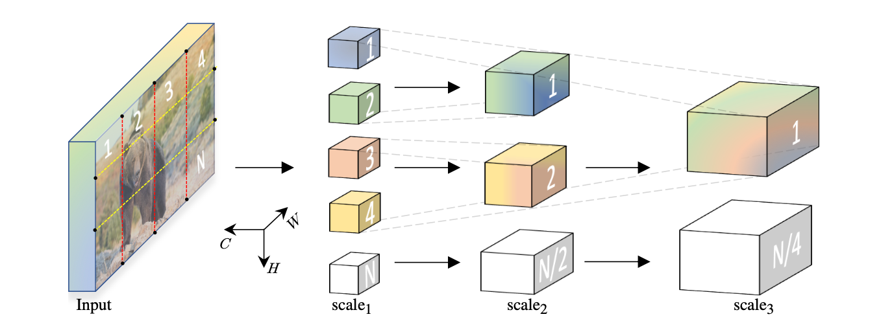

图 1. 多尺度视觉Transformers学习从密集（空间）和简单（通道）到粗糙和复杂特征的层次结构。几个分辨率通道规模阶段逐渐增加中间潜在序列的通道容量，同时减少其长度，从而降低空间分辨率。

>Figure 1. Multiscale Vision Transformers learn a hierarchy from dense (in space) and simple (in channels) to coarse and complex features. Several resolution-channel scale stages progressively increase the channel capacity of the intermediate latent sequence while reducing its length and thereby spatial resolution.

与此同时，计算机视觉社区开发了多尺度处理，有时称为“金字塔”策略，其中包括 Rosenfeld 和 Thurston [85]、Burt 和 Adelson [8]、Koenderink [61] 等关键论文。有两个动机（i）通过在较低分辨率下工作来降低计算需求，以及（ii）在较低分辨率下更好地理解“上下文”，然后可以指导更高分辨率下的处理（这是如今网络能够很深来来好处的前决条件）。

>In a parallel development, the computer vision community developed multiscale processing, sometimes called “pyramid” strategies, with Rosenfeld and Thurston [85], Burt and Adelson [8], Koenderink [61], among the key papers. There were two motivations (i) To decrease the computing requirements by working at lower resolutions and (ii) A better sense of “context” at the lower resolutions, which could then guide the processing at higher resolutions (this is a precursor to the benefit of “depth” in today’s neural networks.)

Transformer [98] 架构允许学习定义在集合上的任意函数，并且在语言理解 [26] 和机器翻译 [7] 等序列任务中取得了可扩展的成功。从根本上说，Transformer使用具有两个基本操作的块。首先，是用于建模元素间关系的注意力操作[4]。其次，是一个多层感知器（MLP），它对元素内的关系进行建模。将这些操作与归一化 [2] 和残差连接 [44] 交织在一起，可以让 Transformer 泛化到各种各样的任务。

>The Transformer [98] architecture allows learning arbitrary functions defined over sets and has been scalably successful in sequence tasks such as language comprehension [26] and machine translation [7]. Fundamentally, a transformer uses blocks with two basic operations. First, is an attention operation [4] for modeling inter-element relations. Second, is a multi-layer perceptron (MLP), which models relations within an element. Intertwining these operations with normalization [2] and residual connections [44] allows transformers to generalize to a wide variety of tasks.

最近，Transformer 已应用于关键的计算机视觉任务，例如图像分类。本着架构普遍主义的精神，vision Transformer [25, 95] 在各种数据和计算机制中处理卷积模型的性能。通过仅具有以 2D 卷积精神“patchifies”输入的第一层，然后是一堆transformer块，vision Transformer旨在展示Transformer架构的强大功能，却使用很少归纳偏置。

>Recently, transformers have been applied to key computer vision tasks such as image classification. In the spirit of architectural universalism, vision transformers [25, 95] approach performance of convolutional models across a variety of data and compute regimes. By only having a first layer that ‘patchifies’ the input in spirit of a 2D convolution, followed by a stack of transformer blocks, the vision transformer aims to showcase the power of the transformer architecture using little inductive bias.

在本文中，我们的目的是将多尺度特征层次的开创性思想与transformer模型联系起来。我们假设分辨率和通道缩放的基本视觉原理对于跨各种视觉识别任务的transformer模型可能是有益的。

>In this paper, our intention is to connect the seminal idea of multiscale feature hierarchies with the transformer model. We posit that the fundamental vision principle of resolution and channel scaling, can be beneficial for transformer models across a variety of visual recognition tasks.

我们提出了多尺度视觉转换器 (MViT)，这是一种用于对图像和视频等视觉数据进行建模的transformer架构。考虑如图 1 所示的输入图像。与在整个网络中保持恒定通道容量和分辨率的传统transformer不同，多尺度transformer具有多个通道分辨率“尺度”阶段。从图像分辨率和小通道维度出发，各个阶段在降低空间分辨率的同时，分层扩展了通道容量。这在transformer网络内部创建了一个多尺度的特征激活金字塔，有效地将transformer的原理与多尺度特征层次结构联系起来。

>We present Multiscale Vision Transformers (MViT), a transformer architecture for modeling visual data such as images and videos. Consider an input image as shown in Fig. 1. Unlike conventional transformers, which maintain a constant channel capacity and resolution throughout the network, Multiscale Transformers have several channel-resolution ‘scale’ stages. Starting from the image resolution and a small channel dimension, the stages hierarchically expand the channel capacity while reducing the spatial resolution. This creates a multiscale pyramid of feature activations inside the transformer network, effectively connecting the principles of transformers with multi scale feature hierarchies.

我们的概念理念为视觉transformer模型提供了有效的设计优势。由于轻量级通道容量，我们架构的早期层可以在高空间分辨率下对简单的低级视觉信息进行建模。反过来，更深层可以有效地关注空间上粗糙但复杂的高级特征，以对视觉语义进行建模。我们的多尺度transformer的基本优势来自视觉信号的极其密集的性质，这种现象对于视频中捕获的时空视觉信号更为明显。

>Our conceptual idea provides an effective design advantage for vision transformer models. The early layers of our architecture can operate at high spatial resolution to model simple low-level visual information, due to the lightweight channel capacity. In turn, the deeper layers can effectively focus on spatially coarse but complex high-level features to model visual semantics. The fundamental advantage of our multiscale transformer arises from the extremely dense nature of visual signals, a phenomenon that is even more pronounced for space-time visual signals captured in video.

我们设计的一个值得注意的好处是视频多尺度模型中存在强烈的隐含时间偏差。我们证明，在自然视频上训练的视觉transformer模型 [25] 在对带有打乱帧的视频进行测试时不会出现性能下降。这表明这些模型没有有效地使用时间信息，而是严重依赖外观。相比之下，当在打乱帧上测试我们的 MViT 模型时，我们观察到显着的精度下降，这表明对时间信息的强烈使用。

>A noteworthy benefit of our design is the presence of strong implicit temporal bias in video multiscale models. We show that vision transformer models [25] trained on natural video suffer no performance decay when tested on videos with shuffled frames. This indicates that these models are not effectively using the temporal information and instead rely heavily on appearance. In contrast, when testing our MViT models on shuffled frames, we observe significant accuracy decay, indicating strong use of temporal information.

我们在本文中的重点是视频识别，我们为视频任务设计和评估 MViT（Kinetics [59, 10]、Charades [86]、SSv2 [38] 和 AVA [39]）。 MViT 比并发视频transformers[78, 6, 1] 提供了显着的性能提升，无需任何外部预训练数据。

>Our focus in this paper is video recognition, and we design and evaluate MViT for video tasks (Kinetics [59, 10], Charades [86], SSv2 [38] and AVA [39]). MViT provides a significant performance gain over concurrent video transformers [78, 6, 1], without any external pre-training data.

在图 A.4 中，我们展示了当改变 MViT 中使用的时间剪辑的数量时，视频级推理的计算/准确性权衡。纵轴表示 Kinetics-400 的准确度，横轴表示不同模型、MViT 和并发 ViT [25] 视频变体：VTN [78]、TimeSformer [6]、ViViT [1] 的总体推理成本。为了达到与 MViT 相似的准确度水平，这些模型需要更多的计算和参数（例如，ViViT-L [1] 在相同的准确度下具有 6.8 倍更高的 FLOP 和 8.5 倍的参数，更多的分析在 §A.1 中）并且需要更大的在 ImageNet-21K 上扩展外部预训练（它包含的标签比 Kinetics-400 多 60 倍）。

>In Fig. A.4 we show the computation/accuracy trade-off for video-level inference, when varying the number of temporal clips used in MViT. The vertical axis shows accuracy on Kinetics-400 and the horizontal axis the overall inference cost in FLOPs for different models, MViT and concurrent ViT [25] video variants: VTN [78], TimeSformer [6], ViViT [1]. To achieve similar accuracy level as MViT, these models require significant more computation and parameters (e.g. ViViT-L [1] has 6.8× higher FLOPs and 8.5× more parameters at equal accuracy, more analysis in §A.1) and need large-scale external pre-training on ImageNet-21K (which contains around 60× more labels than Kinetics-400).

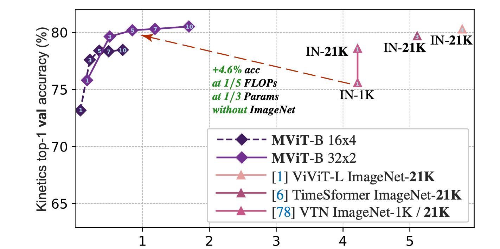

图 2. Kinetics-400 在 MViT 曲线中显示的每个视频的不同推理剪辑数量的**准确性/复杂性权衡**。基于并发视觉transformer的方法 [78,6,1] 需要超过 5 倍的计算量和 ImageNet-21K (IN-21K) 上的大规模外部预训练，才能实现等效的 MViT 精度。

>Figure 2. **Accuracy/complexity trade-off** on Kinetics-400 for varying # of inference clips per video shown in MViT curves. Concurrent vision-transformer based methods [78,6,1] require over 5× more computation and large-scale external pre-training on ImageNet-21K (IN-21K), to achieve equivalent MViT accuracy.

我们进一步将我们的架构应用于 ImageNet [21] 上的图像分类任务，通过简单地去除在 Kinetics 上的消融实验中发现的视频模型的时间维度，并显示出比用于图像识别的单尺度视觉transformer的显着收益。

>We further apply our architecture to an image classification task on ImageNet [21], by simply removing the temporal dimension of the video model found with ablation experiments on Kinetics, and show significant gains over single-scale vision transformers for image recognition.

## 2.Related Work

**卷积网络（ConvNets）**。 ConvNets 结合了下采样、移位不变性和共享权重，是图像 [65, 62, 88, 90, 46, 12, 15, 34, 93, 81, 41] 和视频 [87] 计算机视觉任务的事实上的标准主干, 31, 11, 79, 69, 106, 96, 30, 105, 35, 29, 117, 57]。

>**Convolutional networks (ConvNets).** Incorporating downsampling, shift invariance, and shared weights, ConvNets are de-facto standard backbones for computer vision tasks for image [65, 62, 88, 90, 46, 12, 15, 34, 93, 81, 41] and video [87, 31, 11, 79, 69, 106, 96, 30, 105, 35, 29, 117, 57].

**卷积网络中的自注意力**。自注意力机制已被用于图像理解 [82、114、52]、无监督对象识别 [74] 以及视觉和语言 [77、66]。自注意力操作和卷积网络的混合体也被应用于图像理解[51]和视频识别[101]。

>**Self-attention in ConvNets**. Self-attention mechanisms has been used for image understanding [82, 114, 52], unsupervised object recognition [74] as well as vision and language [77, 66]. Hybrids of self-attention operations and convolutional networks have also been applied to image understanding [51] and video recognition [101].

**视觉Transformers**。当前将 Transformers [98] 应用于视觉任务的大部分热情始于 Vision Transformer (ViT) [25] 和 Detection Transformer [9]。我们直接在 [25] 的基础上构建了一个允许通道扩展和分辨率下采样的分级模型。 DeiT [95] 提出了一种数据有效的方法来训练 ViT。我们的训练配置建立在相同设置下的 DeiT 之上，并将我们的图像分类模型与 DeiT 进行比较。

>**Vision Transformers.** Much of current enthusiasm in application of Transformers [98] to vision tasks commences with the Vision Transformer (ViT) [25] and Detection Transformer [9]. We build directly upon [25] with a staged model allowing channel expansion and resolution downsampling. DeiT [95] proposes a data efficient approach to training ViT. Our training recipe builds on, and we compare our image classification models to, DeiT under identical settings.

一个新兴的工作线程旨在将Transformers应用于视觉任务，例如对象检测 [5]、语义分割 [115、99]、3D 重建 [72]、姿势估计 [107]、生成建模 [14]、图像检索 [27] ]，医学图像分割[13,97,111]，点云[40]，视频实例分割[103]，对象重新识别[47]，视频检索[33]，视频对话[64]，视频对象检测[ 110] 和多模式任务 [73, 23, 80, 53, 108]。另一类工作尝试使用学习的离散化token序列对视觉数据进行建模 [104, 83, 14, 109, 18]。

>An emerging thread of work aims at applying transformers to vision tasks such as object detection [5], semantic segmentation [115, 99], 3D reconstruction [72], pose estimation [107], generative modeling [14], image retrieval [27], medical image segmentation [13, 97, 111], point clouds [40], video instance segmentation [103], object re-identification [47], video retrieval [33], video dialogue [64], video object detection [110] and multi-modal tasks [73, 23, 80, 53, 108]. A separate line of works attempts at modeling visual data with learnt discretized token sequences [104, 83, 14, 109, 18].

**高效的Transformers**。最近的工作 [100, 60, 17, 94, 20, 16, 67] 降低了二次方的注意力的复杂性，使Transformers对自然语言处理应用程序更有效，这是对我们方法的补充。三项并行工作提出了一种基于 ViT 的视频架构 [78, 6, 1]。然而，这些方法依赖于对大量外部数据（如 ImageNet21K [21]）进行预训练，因此使用 vanilla ViT [25] 时的适应性极小。相比之下，我们的 MViT 为transformers引入了多尺度特征层次结构，允许在没有大规模外部数据的情况下对密集的视觉输入进行有效建模。

>**Efficient Transformers.** Recent works [100, 60, 17, 94, 20, 16, 67] reduce the quadratic attention complexity to make transformers more efficient for natural language processing applications, which is complementary to our approach. Three concurrent works propose a ViT-based architecture for video [78, 6, 1]. However, these methods rely on pretraining on vast amount of external data such as ImageNet21K [21], and thus use the vanilla ViT [25] with minimal adaptations. In contrast, our MViT introduces multiscale feature hierarchies for transformers, allowing effective modeling of dense visual input without large-scale external data.

## 3.Multiscale Vision Transformer (MViT)

我们通用的 Multiscale Transformer 架构建立在阶段划分这样的核心概念之上。每个阶段由多个具有特定时空分辨率和通道维度的transformer块组成。 Multiscale Transformers 的主要思想是逐步扩展通道容量，同时汇集从网络输入到输出的分辨率。

>Our generic Multiscale Transformer architecture builds on the core concept of stages. Each stage consists of multiple transformer blocks with specific space-time resolution and channel dimension. The main idea of Multiscale Transformers is to progressively expand the channel capacity, while pooling the resolution from input to output of the network.

### 3.1. Multi Head Pooling Attention

我们首先描述了 Multi Head Pooling Attention (MHPA)，这是一种自注意力算子，它可以在Transformers块中实现灵活的分辨率建模，从而允许 Multiscale Transformers 在逐渐变化的时空分辨率下运行。与原始多头注意 (MHA) 算子 [98] 相比，其中通道维度和时空分辨率保持固定，MHPA 池化潜在张量序列以减少参与输入的序列长度（分辨率）。图 3 显示了这个概念。

>We first describe Multi Head Pooling Attention (MHPA), a self attention operator that enables flexible resolution modeling in a transformer block allowing Multiscale Transformers to operate at progressively changing spatiotemporal resolution. In contrast to original Multi Head Attention (MHA) operators [98], where the channel dimension and the spatiotemporal resolution remains fixed, MHPA pools the sequence of latent tensors to reduce the sequence length (resolution) of the attended input. Fig. 3 shows the concept.

具体来说，考虑一个序列长度为 L 的 D 维输入张量 X，

。在 MHA [25] 之后，MHPA 将输入 X 投影到中间查询张量 

，键张量

 和值张量

线性运算 :

>Concretely, consider a D dimensional input tensor X of sequence length L, X ∈ RL×D . Following MHA [25], MHPA projects the input X into intermediate query tensor ˆ ∈ RL×D , key tensor K ˆ ∈ RL×D and value tensor Vˆ ∈ Q RL×D with linear operations ˆ = XWQ Q

/ 权重为 

，维度为 D × D。然后将获得的中间张量按序列长度进行池化，池化算子

如下所述。

>/ with weights WQ , WK , WV of dimensions D × D. The obtained intermediate tensors are then pooled in sequence length, with a pooling operator P as described below.

**池化算子**。在处理输入之前，中间的 

 张量与池化算子
)
进行池化，这是我们的 MHPA 以及我们的多尺度 Transformer 架构的基石。

>**Pooling Operator.** Before attending the input, the intermeˆ K, ˆ Vˆ are pooled with the pooling operator diate tensors Q, P(·; Θ) which is the cornerstone of our MHPA and, by extension, of our Multiscale Transformer architecture.

算子 
)
 沿每个维度对输入张量执行池化核计算。将 Θ 展开表示为 
)
，算子使用尺寸为

的池化内核 k，对应尺寸为 

 的步幅 s 和对应尺寸为

的填充，以减少由尺寸

 到 

，

>The operator P(·; Θ) performs a pooling kernel computation on the input tensor along each of the dimensions. Unpacking Θ as Θ := (k, s, p), the operator employs a pooling kernel k of dimensions kT × kH × kW , a stride s of corresponding dimensions sT × sH × sW and a padding p of corresponding dimensions pT × pH × pW to reduce an input tensor of dimensions L = T × H × W to L   ˜ = L + 2p − k + 1 L s ˜ given by,

方程应用在每个坐标方向上。合并后的张量再次被展平，产生
%20\in%20\mathbb{R}^{\tilde{L}%20\times%20D})
  的输出， 减少了序列长度到

。

> with the equation applying coordinate-wise. The pooled tensor is flattened again yielding the output of P(Y ; Θ) ∈ ˜ ˜ = T˜ × H ˜ ×W ˜. RL×D with reduced sequence length.

默认情况下，我们在池化注意力算子中使用具有形状保持填充 p 的重叠核 k，因此输出张量
)
 的序列长度，

经历了整体减少sT sH sw 倍。

>  By default we use overlapping kernels k with shapepreserving padding p in our pooling attention operators, so ˜ , the sequence length of the output tensor P(Y ; Θ), that L experiences an overall reduction by a factor of sT sH sW .

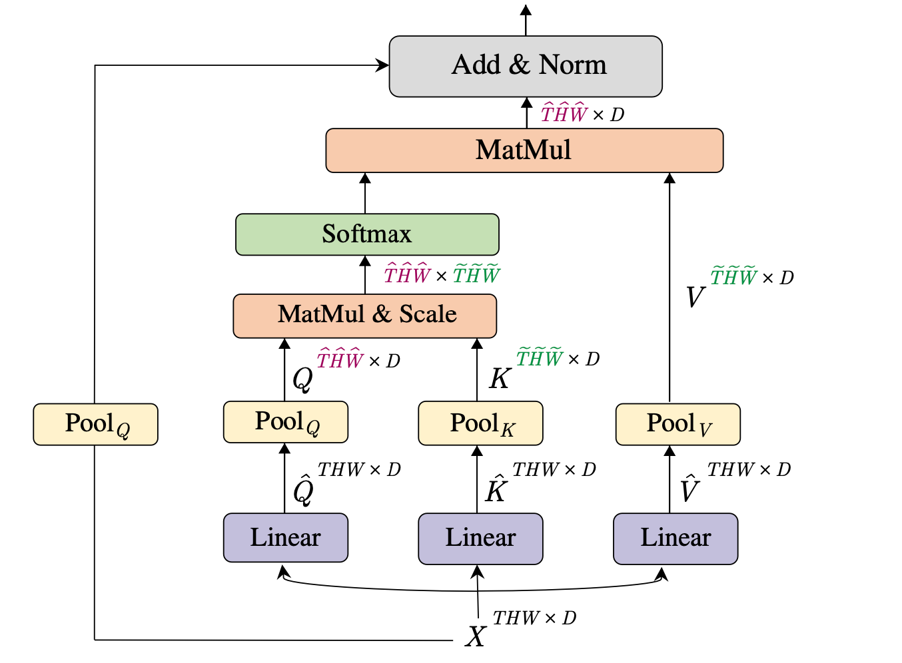

图 3. **Pooling Attention** 是一种灵活的注意力机制，(i) 的 允许通过池化查询
)
获得降低输入
)
的时空分辨率
)
  ，并/或 (ii) 通过池化键
)
和值
)
 的方式 计算减少长度 
)
序列，来计算注意力。

>X Figure 3. **Pooling Attention** is a flexible attention mechanism that ˆW ˆ ) of (i) allows obtaining the reduced space-time resolution (TˆH ˆ ΘQ ), and/or the input (T HW ) by pooling the query, Q = P(Q; ˜W ˜ ) by pooling the (ii) computes attention on a reduced length (T˜H ˆ ˆ key, K = P(K; ΘK ), and value, V = P(V ; ΘV ), sequences.

**池化注意力**。池化算子
)
 独立地应用于所有中间张量 

， 

， 

，其中选择了池化内核 k、步长 s 和填充 p。注意到 θ 产生预注意向量 
)
, 
)
, 
)
,减少了序列长度。现在在这些缩短的向量上计算注意力，

> Pooling Attention. The pooling operator P (·; Θ) is applied ˆ K ˆ and Vˆ independently to all the intermediate tensors Q, with chosen pooling kernels k, stride s and padding p. Deˆ ΘQ ), noting θ yielding the pre-attention vectors Q = P(Q; ˆ ΘK ) and V = P(Vˆ ; ΘV ) with reduced seK = P(K; quence lengths. Attention is now computed on these shortened vectors, with the operation,

自然地, 该操作在池化算子上引入约束 

. 总之, 池化注意力被计算为,

> Naturally, the operation induces the constraints sK ≡ sV on the pooling operators. In summary, pooling attention is computed as,

其中 

 是按行对内积矩阵进行归一化。因此，池化注意力操作的输出有随着查询向量 Q 在 P(·) 中的缩短化，它的 Q 序列长度减少了步长因子

 。

>where d is normalizing the inner product matrix row-wise. The output of the Pooling attention operation thus has its Q Q sequence length reduced by a stride factor of sQ T sH sW following the shortening of the query vector Q in P(·).

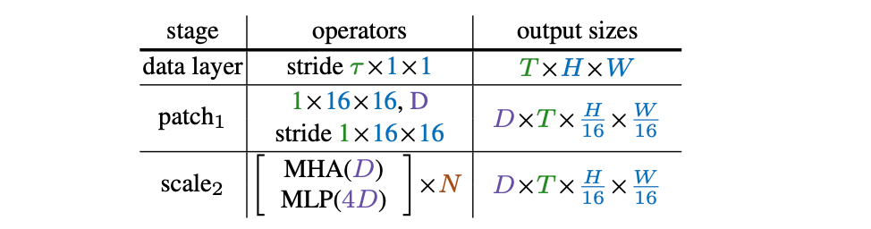

表 1. **Vision Transformers (ViT)** 基础模型从一个数据层开始，该数据层以速率 τ ×1×1 到 T ×H×W 分辨率对视觉输入进行采样，其中 T 是 H 高和 W 宽的帧数。第一层，将patch1 投影（形状为 1×16×16）以形成一个序列，由一堆 N 个transformer块（stage2）H×W）处理。在统一的通道尺寸 (D) 和分辨率
)
。

>Table 1. **Vision Transformers (ViT)** base model starts from a data layer that samples visual input with rate τ ×1×1 to T ×H×W resolution, where T is the number of frames H height and W width. The first layer, patch1 projects patches (of shape 1×16×16) to form a sequence, processed by a stack of N transformer blocks (stage2 ) H ×W ). at uniform channel dimension (D) and resolution (T × 16 16

**多头**。如在 [98] 中，可以通过考虑 h 个头来并行化计算，其中每个头在 D 维输入张量 X 的 D/h 通道的非重叠子集上执行汇集注意力。

>**Multiple heads.** As in [98] the computation can be parallelized by considering h heads where each head is performing the pooling attention on a non overlapping subset of D/h channels of the D dimensional input tensor X.

**计算分析**。由于注意力计算是关于序列长度、汇集键、查询和值张量 的二次方，这对 Multiscale Transformer 模型的基本计算和内存要求具有显着优势。用 

、

 和 

 表示序列长度缩减因子，我们有

Computational Analysis. Since attention computation scales quadratically w.r.t. the sequence length, pooling the key, query and value tensors has dramatic benefits on the fundamental compute and memory requirements of the Multiscale Transformer model. Denoting the sequence length reduction factors by fQ , fK and fV we have

考虑到
)
的输入张量具有 D × T × H × W 维度，MHPA 的运行时间复杂度为每个头 
\right))
并且内存复杂度为
\right))
。

> Considering the input tensor to P(; Θ) to have dimensions D × T × H × W , the run-time complexity of MHPA is O(T HW D/h(D + T HW/fQ fK )) per head and the memory complexity is O(T HW h(D/h + T HW/fQ fK )).

通道数 D 和序列长度项 

之间的这种权衡为我们的设计选择提供了有关架构参数的信息，例如头数和层宽。我们建议读者阅读补充材料，详细分析和讨论时间记忆复杂度权衡。

>This trade-off between the number of channels D and sequence length term T HW/fQ fK informs our design choices about architectural parameters such as number of heads and width of layers. We refer the reader to the supplement for a detailed analysis and discussions on the timememory complexity trade-off.

### 3.2. Multiscale Transformer Networks

建立在 Multi Head Pooling Attention（第 3.1 节）之上，我们描述了仅使用 MHPA 和 MLP 层进行视觉表示学习的 Multiscale Transformer 模型。首先，我们简要回顾一下为我们的设计提供信息的 Vision Transformer 模型。

> Networks Building upon Multi Head Pooling Attention (Sec. 3.1), we describe the Multiscale Transformer model for visual representation learning using exclusively MHPA and MLP layers. First, we present a brief review of the Vision Transformer Model that informs our design.

**之前的**：**视觉Transformer (ViT)**。 Vision Transformer (ViT) 架构 [25] 首先将分辨率为 T ×H×W 的输入视频切割成大小为 1×16×16的非重叠块，其中 T 是帧数 H 是高度，W 是宽度，然后在扁平图像块上逐点应用线性层，以将它们投影到Transformer的潜在维度 D 中。这等效于具有相同内核大小和步幅为 1×16×16 的卷积，并在表 1 中的模型定义中显示为 patch1 阶段。

>Preliminaries: Vision Transformer (ViT). The Vision Transformer (ViT) architecture [25] starts by dicing the input video of resolution T ×H×W , where T is the number of frames H the height and W the width, into non-overlapping patches of size 1×16×16 each, followed by point-wise application of linear layer on the flattened image patches to to project them into the latent dimension, D, of the transformer. This is equivalent to a convolution with equal kernel size and stride of 1×16×16 and is shown as patch1 stage in the model definition in Table 1.

接下来，将位置嵌入

添加到投影的每个元素长度为 L ，D维的序列，来编码位置信息并打破排列不变性。一个可学习的类嵌入被附加到投影的图像块上。

>Next, a positional embedding E ∈ RL×D is added to each element of the projected sequence of length L with dimension D to encode the positional information and break permutation invariance.

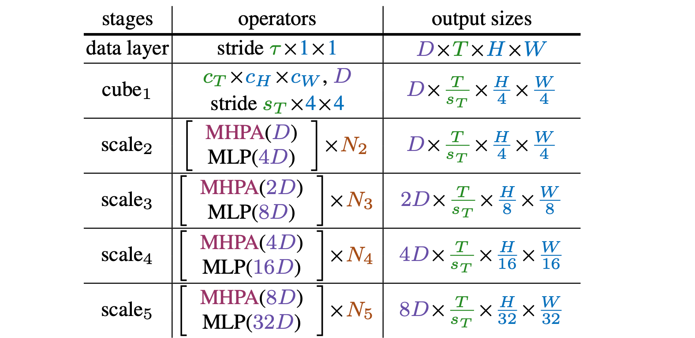

表 2. **多尺度视觉Transformers** (MViT) 基础模型。层 cube 

 ，将密集的时空立方体（形状为 

 ）投影到 D 通道，以将时空分辨率降低到 

。随后的阶段使用 MHPA 逐步向下采样此分辨率（在阶段开始时），同时增加 MLP 层中的通道尺寸（在阶段结束时）。每个阶段由 N* 个transformer块组成，用 [括号] 表示。

>Table 2. Multiscale Vision Transformers (MViT) base model. Layer cube1 , projects dense space-time cubes (of shape ct ×cy ×cw ) to D channels to reduce spatio-temporal resolution to sTT × H . ×W 4 4 The subsequent stages progressively down-sample this resolution (at beginning of a stage) with MHPA while simultaneously increasing the channel dimension, in MLP layers, (at the end of a stage). Each stage consists of N∗ transformer blocks, denoted in [brackets].

然后由一堆 N 个transformer块顺序处理得到的长度为 L + 1 的序列，每个transformer块执行注意 (MHA [98])、多层感知器 (MLP) 和层归一化 (LN [3]) 操作。考虑到 X 是模块的输入，单个transformer模块的输出 Block(X) 由 下式计算得出。

> A learnable class embedding is appended to the projected image patches. The resulting sequence of length of L + 1 is then processed sequentially by a stack of N transformer blocks, each one performing attention (MHA [98]), multi-layer perceptron (MLP) and layer normalization (LN [3]) operations. Considering X to be the input of the block, the output of a single transformer block, Block(X) is computed by

N个连续块之后的结果序列被层归一化，并且类嵌入被提取并通过线性层来预测所需的输出（例如分类）。默认情况下，MLP 的隐藏维度是 4D。详情请参阅 [25, 98]。

> The resulting sequence after N consecutive blocks is layernormalized and the class embedding is extracted and passed through a linear layer to predict the desired output (e.g. class). By default, the hidden dimension of the MLP is 4D. We refer the reader to [25, 98] for details.

在文章的上下文中，值得注意的是，ViT 在所有块中保持恒定的通道容量和空间分辨率（见表 1）。

> In context of the present paper, it is noteworthy that ViT maintains a constant channel capacity and spatial resolution throughout all the blocks (see Table 1).

**多尺度Vision Transformers (MViT)**。我们的关键概念是逐步提高通道分辨率（即维度），同时降低整个网络的时空分辨率（即序列长度）。通过设计，我们的 MViT 架构在早期层中具有精细粒度的时空（和粗粒度通道）分辨率，在后期层中被上采样/下采样到粗时空（和精细通道）分辨率。 MViT 如表 2 所示。

> **Multiscale Vision Transformers (MViT).** Our key concept is to progressively grow the channel resolution (i.e. dimension), while simultaneously reducing the spatiotemporal resolution (i.e. sequence length) throughout the network. By design, our MViT architecture has fine spacetime (and coarse channel) resolution in early layers that is up-/downsampled to a coarse spacetime (and fine channel) resolution in late layers. MViT is shown in Table 2.

**尺度阶段**。尺度阶段被定义为一组 N 个Transformers块，它们各自在相同的尺度上运行，跨通道和时空维度 D×T ×H×W 具有相同的分辨率。在输入端（表 2 中的cube 

），我们将patches（或cube，如果它们具有时间维度）投影到更小的通道维度（例如，比典型的 ViT 模型小 8 倍），但序列很长（例如 4×4 =比典型的 ViT 模型密度高 16 倍；参见表 1)。

>**Scale stages.** A scale stage is defined as a set of N transformer blocks that operate on the same scale with identical resolution across channels and space-time dimensions D×T ×H×W . At the input (cube1 in Table 2), we project the patches (or cubes if they have a temporal extent) to a smaller channel dimension (e.g. 8× smaller than a typical ViT model), but long sequence (e.g. 4×4 = 16× denser than a typical ViT model; cf. Table 1).

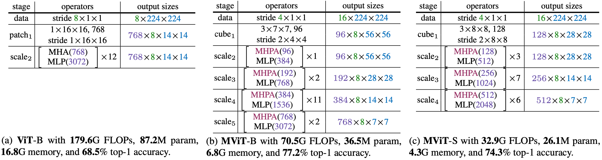

表3. 将ViT-B与MViT的两个实例进行比较，MViT-S在(c)，MViT-B在(b)。MViT-S在较低的空间分辨率下运行，缺乏第一个高分辨率阶段。Top-1精度对应于K400上的5-Center视图测试。FLOPs对应于单个推理片段，而内存是指4个片段的训练批次。MViT-B的一般结构见表2。

>Table 3. Comparing ViT-B to two instantiations of MViT with varying complexity, MViT-S in (c) and MViT-B in (b). MViT-S operates at a lower spatial resolution and lacks a first high-resolution stage. The top-1 accuracy corresponds to 5-Center view testing on K400. FLOPs correspond to a single inference clip, and memory is for a training batch of 4 clips. See Table 2 for the general MViT-B structure.

在阶段转换（例如表 2 中的 scale1 到 scale2 到），处理序列的通道维度被上采样，而序列的长度被下采样。这有效地降低了底层视觉数据的时空分辨率，同时允许网络将处理后的信息同化为更复杂的特征。

> At a stage transition (e.g. scale1 to scale2 to in Table 2), the channel dimension of the processed sequence is upsampled while the length of the sequence is down-sampled. This effectively reduces the spatio-temporal resolution of the underlying visual data while allowing the network to assimilate the processed information in more complex features.

**通道拓展**。当从一个阶段过渡到下一个阶段时，我们通过将前一阶段的最终 MLP 层的输出增加一个与该阶段引入的分辨率变化相关的因子来扩展通道维度。具体来说，如果我们将时空分辨率下采样 4 倍，我们会将通道维度增加 2 倍。例如，scale3 到 scale4 将分辨率从表 2 中的 2D× sTT × H 8 × 8 更改为 4D× sT × 16 × 16。这大致保留了跨阶段的计算复杂度，并且类似于 ConvNet 设计原则 [87, 45]。

> **Channel expansion.** When transitioning from one stage to the next, we expand the channel dimension by increasing the output of the final MLP layer in the previous stage by a factor that is relative to the resolution change introduced at the stage. Concretely, if we down-sample the space-time resolution by 4×, we increase the channel dimension by 2×. For example, scale3 to scale4 changes resoT T H T lution from 2D× sTT × H 8 × 8 to 4D× sT × 16 × 16 in Table 2. This roughly preserves the computational complexity across stages, and is similar to ConvNet design principles [87, 45].

**查询池化**。池化注意力操作不仅在键和值向量的长度方面提供了灵活性，而且在查询的长度以及输出序列方面也提供了灵活性。将查询向量 
)
有内核
)
，这使得序列减少

倍。因为，我们的目的是在阶段开始时降低分辨率，然后在整个阶段保持该分辨率，所以只有每个阶段的第一个池化注意力算子以非退化查询步长 

 运行，所有其他算子都被限制为 
)
。

> **Query pooling.** The pooling attention operation affords flexibility not only in the length of key and value vectors but also in the length of the query, and thereby output, sequence. Pooling the query vector P(Q; k; p; s) with a kernel Q Q s ≡ (sQ T , sH , sW ) leads to sequence reduction by a factor of Q Q sT · sH · sQ W . Since, our intention is to decrease resolution at the beginning of a stage and then preserve this resolution throughout the stage, only the first pooling attention operator of each stage operates at non-degenerate query stride sQ > 1, with all other operators constrained to sQ ≡ (1, 1, 1).

**键值池化**。与查询池化不同，更改键 K 和值 V 张量的序列长度不会更改输出序列长度，因此也不会更改时空分辨率。然而，它们在池化注意力算子的整体计算要求中起着关键作用。

> **Key-Value pooling**. Unlike Query pooling, changing the sequence length of key K and value V tensors, does not change the output sequence length and, hence, the space-time resolution. However, they play a key role in overall computational requirements of the pooling attention operator.

我们将 K、V 和 Q 池化的使用解耦，Q 池化用于每个阶段的第一层，而 K、V 池化用于所有其他层。由于 key 和 value 张量的序列长度需要相同才能进行注意力权重计算，因此在 K 和 value V 张量上使用的池化步幅需要相同。在我们的默认设置中，我们将所有池化参数 (k; p; s) 限制为相同，即一个阶段内的

，但在不同尺度的阶段上，S会有适应性的变化。

> We decouple the usage of K, V and Q pooling, with Q pooling being used in the first layer of each stage and K, V pooling being employed in all other layers. Since the sequence length of key and value tensors need to be identical to allow attention weight calculation, the pooling stride used on K and value V tensors needs to be identical. In our default setting, we constrain all pooling parameters (k; p; s) to be identical i.e. ΘK ≡ ΘV within a stage, but vary s adaptively w.r.t. to the scale across stages.

>**Key-Value pooling**. Unlike Query pooling, changing the sequence length of key K and value V tensors, does not change the output sequence length and, hence, the space-time resolution. However, they play a key role in overall computational requirements of the pooling attention operator.

**跳过连接**。由于残差块内的通道维度和序列长度发生变化，我们将跳过连接池化以适应其两端之间的维度不匹配。 MHPA 通过将查询池运算符 
)
添加到残差路径来处理这种不匹配。如图 3 所示，我们不是直接将 MHPA 的输入 X 添加到输出，而是将输入 X 池化后添加到输出，从而将分辨率与参与查询 Q 匹配。

> Skip connections. Since the channel dimension and sequence length change inside a residual block, we pool the skip connection to adapt to the dimension mismatch between its two ends. MHPA handles this mismatch by adding the query pooling operator P(·; ΘQ ) to the residual path. As shown in Fig. 3, instead of directly adding the input X of MHPA to the output, we add the pooled input X to the output, thereby matching the resolution to attended query Q.

为了处理阶段变化之间的通道维度不匹配，我们使用一个额外的线性层，该层对我们的 MHPA 操作的层归一化输出进行操作。请注意，这与对未归一化信号进行操作的其他（保留分辨率的）跳过连接不同。

> For handling the channel dimension mismatch between stage changes, we employ an extra linear layer that operates on the layer-normalized output of our MHPA operation. Note that this differs from the other (resolution-preserving) skipconnections that operate on the un-normalized signal.

### 3.3. Network instantiation details

表 3 显示了视觉Transformers [25] 和我们的多尺度视觉Transformers的基本模型的具体实例。 ViT-Base [25]（表 3b）最初将输入投影到形状为 1×16×16、维度 D = 768 的patches，然后堆叠 N = 12 个Transformers块。对于 8×224×224 输入，所有层的分辨率都固定为 768×8×14×14。序列长度（时空分辨率 + 类token）为 8 · 14 · 14 + 1 = 1569。

> Table 3 shows concrete instantiations of the base models for Vision Transformers [25] and our Multiscale Vision Transformers. ViT-Base [25] (Table 3b) initially projects the input to patches of shape 1×16×16 with dimension D = 768, followed by stacking N = 12 transformer blocks. With an 8×224×224 input the resolution is fixed to 768×8×14×14 throughout all layers. The sequence length (spacetime resolution + class token) is 8 · 14 · 14 + 1 = 1569.

我们的 MViT-Base（表 3b）由 4 个尺度阶段组成，每个阶段都有几个通道尺寸一致的Transformers块。 MViT-B 最初将输入投影到 D = 96 的通道维度，其中重叠的时空立方体形状为 3×7×7。得到的长度为 8 * 56 * 56 + 1 = 25089 的序列每增加一个阶段就减少 4 倍，在 

，最终序列长度为 8 * 7 * 7 + 1 = 393  。同时，通道维度在每个阶段上采样 2 倍，在 

增加到 768。请注意，所有池化操作以及分辨率下采样仅在数据序列上执行，而不涉及已处理的类token嵌入。

> Our MViT-Base (Table 3b) is comprised of 4 scale stages, each having several transformer blocks of consistent channel dimension. MViT-B initially projects the input to a channel dimension of D = 96 with overlapping space-time cubes of shape 3×7×7. The resulting sequence of length 8 ∗ 56 ∗ 56 + 1 = 25089 is reduced by a factor of 4 for each additional stage, to a final sequence length of 8 ∗ 7 ∗ 7 + 1 = 393 at scale4 . In tandem, the channel dimension is up-sampled by a factor of 2 at each stage, increasing to 768 at scale4 . Note that all pooling operations, and hence the resolution downsampling, is performed only on the data sequence without involving the processed class token embedding.

我们在 

阶段将 MHPA 头数设置为 h = 1，并随着通道维度增加头数（每个头的通道数 D/h 保持一致为 96）。

> At each stage transition, the previous stage output MLP dimension is increased by 2× and MHPA pools on Q tensors with sQ = (1, 2, 2) at the input of the next stage.

在每个阶段转换中，前一阶段的输出 MLP 的维度增加 2 倍，并且在下一阶段的输入处具有 
)
 的 Q 张量上的 MHPA 池化。

> We set the number of MHPA heads to h = 1 in the scale1 stage and increase the number of heads with the channel dimension (channels per-head D/h remain consistent at 96).

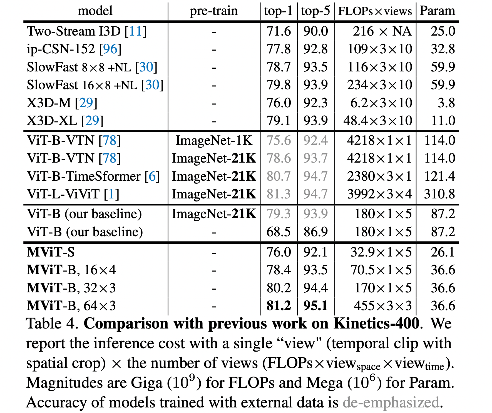

**表 4. 与 Kinetics-400 先前工作的比较**。我们使用单个“视图”（具有空间裁剪的时间剪辑）×视图数量（FLOPs×viewspace ×viewtime）报告推理成本。FLOPs 的量级是 Giga (

 )，Param 的量级是 Mega (

 )。使用外部数据进行训练的模型的准确性用灰色表示不强调。

>Table 4. Comparison with previous work on Kinetics-400. We report the inference cost with a single “view" (temporal clip with spatial crop) × the number of views (FLOPs×viewspace ×viewtime ). Magnitudes are Giga (109 ) for FLOPs and Mega (106 ) for Param. Accuracy of models trained with external data is de-emphasized.

我们在所有 MHPA 块中使用 K、V 池化，其中

和 
)
在 scale 

中并在跨阶段的尺度时自适应地衰减这个步幅 ，使得 K、V 张量在所有块中具有一致的尺度。

>We employ K, V pooling in all MHPA blocks, with ΘK ≡ ΘV and sQ = (1, 8, 8) in scale1 and adaptively decay this stride w.r.t. to the scale across stages such that the K, V tensors have consistent scale across all blocks.

## 4. Experiments: Video Recognition

**数据集**。我们使用 Kinetics-400 [59] (K400)（约 240k 个训练视频，400 个类）和 Kinetics-600 [11]。我们进一步评估了SomethingSomething-v2 [38]、Charades [86]和AVA [39]的迁移学习性能。我们报告了验证集的 top-1 和 top-5 分类准确率 (%)、单个空间中心裁剪剪辑的计算成本（以 FLOP 为单位）以及使用的剪辑数量。

> **Datasets.** We use Kinetics-400 [59] (K400) (∼240k training videos in 400 classes) and Kinetics-600 [11]. We further assess transfer learning performance for on SomethingSomething-v2 [38], Charades [86], and AVA [39]. We report top-1 and top-5 classification accuracy (%) on the validation set, computational cost (in FLOPs) of a single, spatially center-cropped clip and the number of clips used.

**训练**。默认情况下，所有模型都是从 Kinetics 上的随机初始化（“从头开始”）训练的，而不使用 ImageNet [22] 或其他预训练。我们的训练方法和增强遵循 [30,95]。对于 Kinetics，我们训练了 200 个 epoch，其中包含 2 次重复增强 [50] 次重复。

>**Training.** By default, all models are trained from random initialization (“from scratch”) on Kinetics, without using ImageNet [22] or other pre-training. Our training recipe and augmentations follow [30,95]. For Kinetics, we train for 200 epochs with 2 repeated augmentation [50] repetitions.

我们使用 [30] 中训练配置的 30 epoch版本报告了从 ImageNet 微调的 ViT 基线。对于时间域，我们从全长视频中采样一个剪辑，网络的输入是时间步长为 τ 的 T 帧；表示为 T × τ [30]。

> We report ViT baselines that are fine-tuned from ImageNet, using a 30-epoch version of the training recipe in [30]. For the temporal domain, we sample a clip from the fulllength video, and the input to the network are T frames with a temporal stride of τ ; denoted as T × τ [30].

**推理**。我们在 [30, 29] 之后应用了两种测试策略：（i）在时间上，均匀地从视频中采样 K 个剪辑（例如 K=5），将较短的空间边缩放到 256 像素，并采用 224×224 的中心裁剪;（ ii)，时间上同(i)，但是需要3个224×224的crop来覆盖更长的空间轴。我们对所有单个预测的分数进行平均。所有实现细节都在 §D 中。

>**Inference**. We apply two testing strategies following [30, 29]: (i) Temporally, uniformly samples K clips (e.g. K=5) from a video, scales the shorter spatial side to 256 pixels and takes a 224×224 center crop, and (ii), the same as (i) temporally, but take 3 crops of 224×224 to cover the longer spatial axis. We average the scores for all individual predictions. All implementation specifics are in §D.

### 4.1. Main Results

**Kinetics-400**。表 4 与之前的工作进行了比较。从上到下，它有四个部分，我们依次讨论它们。

> **Kinetics-400.** Table 4 compares to prior work. From topto-bottom, it has four sections and we discuss them in turn.

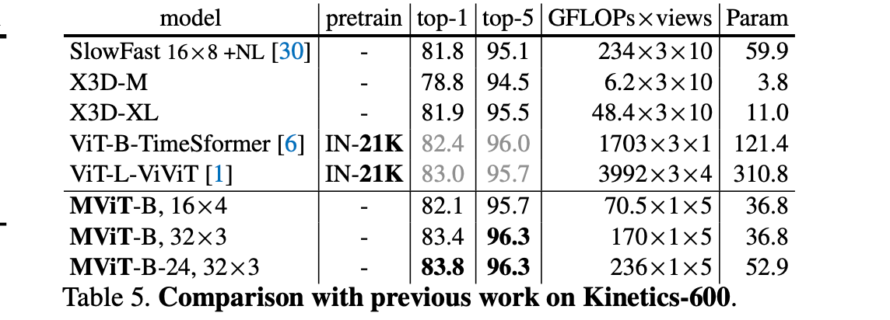

表 4第一个部分显示了使用卷积网络的现有技术。

> The first Table 4 section shows prior art using ConvNets.

第二部分展示了使用 Vision Transformers [25] 进行视频分类 [78, 6] 的同期工作。这两种方法都依赖于 ImageNet 预训练的基础模型。 ViT-BVTN [78] 实现了 75.6% 的 top-1 准确率，仅通过将预训练从 ImageNet-1K 更改为 ImageNet-21K 就提高了 3% 至 78.6%。 ViT-B-TimeSformer [6] 显示在 VTN 之上又增加了 2.1%，代价是 7140G FLOPs 和 121.4M 参数。 ViViT 通过更大的 ViT-L 模型进一步提高了准确性。

> The second section shows concurrent work using Vision Transformers [25] for video classification [78, 6]. Both approaches rely on ImageNet pre-trained base models. ViT-BVTN [78] achieves 75.6% top-1 accuracy, which is boosted by 3% to 78.6% by merely changing the pre-training from ImageNet-1K to ImageNet-21K. ViT-B-TimeSformer [6] shows another 2.1% gain on top of VTN, at higher cost of 7140G FLOPs and 121.4M parameters. ViViT improves accuracy further with an even larger ViT-L model.

表 4 中的第三部分显示了我们的 ViT 基线。我们首先列出了我们的 ViT-B，它也在 ImageNet-21K 上进行了预训练，达到了 79.3%，因此比 ViT-BTimeSformer 低 1.4%，但 FLOP 少 4.4 倍，参数少 1.4 倍。该结果表明，简单地微调 ImageNet-21K [25] 中的现成 ViT-B 模型就可以提供强大的基线。然而，使用相同的微调的配置从头开始训练这个模型将导致只有 34.3%。使用我们的“从头开始训练”配置将产生 68.5% 的 ViT-B 模型，使用相同的 1×5、空间×时间、视频级推理视图。

> The third section in Table 4 shows our ViT baselines. We first list our ViT-B, also pre-trained on the ImageNet-21K, which achieves 79.3%, thereby being 1.4% lower than ViT-BTimeSformer, but is with 4.4× fewer FLOPs and 1.4× fewer parameters. This result shows that simply fine-tuning an off-the-shelf ViT-B model from ImageNet-21K [25] provides a strong baseline on Kinetics. However, training this model from-scratch with the same fine-tuning recipe will result in 34.3%. Using our “training-from-scratch” recipe will produce 68.5% for this ViT-B model, using the same 1×5, spatial × temporal, views for video-level inference.

表 4 的最后一部分列出了我们的 MViT 结果。我们所有的模型都是使用这个配置从头开始训练的，没有任何外部预训练。我们的小型模型 MViT-S结果为76.0%，同时相对轻量级，具有 26.1M 参数和 32.9×5=164.5G FLOPs，在相同的训练/验证设置中以 5.5 倍的计算量超过 ViT-B +7.5%。

> The final section of Table 4 lists our MViT results. All our models are trained-from-scratch using this recipe, without any external pre-training. Our small model, MViT-S produces 76.0% while being relatively lightweight with 26.1M param and 32.9×5=164.5G FLOPs, outperforming ViT-B by +7.5% at 5.5× less compute in identical train/val setting.

我们的基本模型 MViT-B 在相同设置下结果为78.4%，比 ViT-B 提高 +9.9% 的准确度，同时具有 2.6×/2.4×更少的 FLOPs/参数。将帧采样从 16×4 更改为 32×3 时，性能提高到 80.2%。最后，我们采用这个模型并在 5 个 epoch 和更长的 64 帧输入中对其进行微调，在对时间位置嵌入进行插值后，使用 3 个空间和 3 个时间视图进行推理，达到 81.2% top-1（如果一个片段有更多的帧，用更少的时间视图进行测试就足够了）。更多的定量和定性结果在 §A 中。

> Our base model, MViT-B provides 78.4%, a +9.9% accuracy boost over ViT-B under identical settings, while having 2.6×/2.4×fewer FLOPs/parameters. When changing the frame sampling from 16×4 to 32×3 performance increases to 80.2%. Finally, we take this model and fine-tune it for 5 epochs with longer 64 frame input, after interpolating the temporal positional embedding, to reach 81.2% top-1 using 3 spatial and 3 temporal views for inference (it is sufficient test with fewer temporal views if a clip has more frames). Further quantitative and qualitative results are in §A.

**Kinetics-600** [11] 是 Kinetics 的更大版本。结果在表 5 中。我们从头开始训练 MViT，没有任何预训练。 MViT-B, 16×4 达到 82.1% 的 top-1 准确率。我们进一步训练了一个具有更长采样时间的更深的 24 层模型，MViT-B-24, 32×3，以研究这个更大数据集上的模型规模。 MViT 通过 5 个剪辑中心裁剪测试实现了 83.4% 的最新技术水平，同时与依赖于大规模 ImageNet-21K 预训练的 ViT-L-ViViT [1] 相比，FLOP 少 56.0 倍，参数少 8.4 倍训练。

>Kinetics-600 [11] is a larger version of Kinetics. Results are in Table 5. We train MViT from-scratch, without any pre-training. MViT-B, 16×4 achieves 82.1% top-1 accuracy. We further train a deeper 24-layer model with longer sampling, MViT-B-24, 32×3, to investigate model scale on this larger dataset. MViT achieves state-of-the-art of 83.4% with 5-clip center crop testing while having 56.0× fewer FLOPs and 8.4× fewer parameters than ViT-L-ViViT [1] which relies on large-scale ImageNet-21K pre-training.

模型 pretrain top-1 top-5 FLOPs×views Param TSM-RGB [71] IN-1K+K400 63.3 88.2 62.4×3×2 42.9 IN-1K 64.7 89.4 67×1×1 24.6 MSNet [63] TEA [68] IN-1K 65.1 89.9 70×3×10 ViT-B-TimeSformer [6] IN-21K 62.5 1703×3×1 121.4 ViT-B（我们的基线） IN-21K 63.5 88.3 180×3×1 87.2 SlowFast R50, 8 ×8 [30] 61.9 87.0 65.7×3×1 34.1 63.1 87.6 106×3×1 53.3 SlowFast R101, 8×8 [30] K400 MViT-B, 16×4 64.7 89.2 70.5×3×1 36.6 MViT-B, 32×3 67.1 90.8 170×3×1 36.6 MViT-B，64×3 67.7 90.9 455×3×1 36.6 MViT-B，16×4 66.2 90.2 70.5×3×1 36.6 K600 MViT-B，32×3 67.8 91.3 170×3×1 36.6 68.7 91.5 236×3×1 53.2 MViT-B-24, 32×3

>model pretrain top-1 top-5 FLOPs×views Param TSM-RGB [71] IN-1K+K400 63.3 88.2 62.4×3×2 42.9 IN-1K 64.7 89.4 67×1×1 24.6 MSNet [63] TEA [68] IN-1K 65.1 89.9 70×3×10 ViT-B-TimeSformer [6] IN-21K 62.5 1703×3×1 121.4 ViT-B (our baseline) IN-21K 63.5 88.3 180×3×1 87.2 SlowFast R50, 8×8 [30] 61.9 87.0 65.7×3×1 34.1 63.1 87.6 106×3×1 53.3 SlowFast R101, 8×8 [30] K400 MViT-B, 16×4 64.7 89.2 70.5×3×1 36.6 MViT-B, 32×3 67.1 90.8 170×3×1 36.6 MViT-B, 64×3 67.7 90.9 455×3×1 36.6 MViT-B, 16×4 66.2 90.2 70.5×3×1 36.6 K600 MViT-B, 32×3 67.8 91.3 170×3×1 36.6 68.7 91.5 236×3×1 53.2 MViT-B-24, 32×3

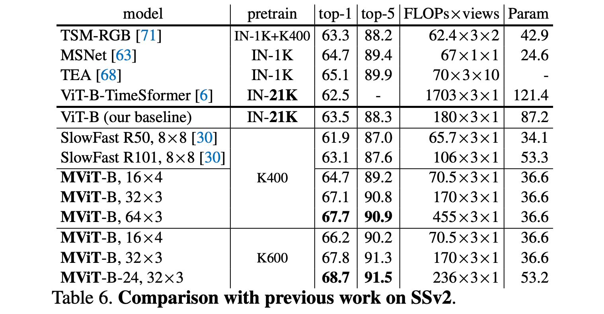

**Something-Something-v2** (SSv2) [38] 是一个包含对象交互视频的数据集，这被称为“时间建模”任务。表 6 将我们的方法与最先进的方法进行了比较。我们首先报告一个使用 ImageNet-21K 预训练的简单 ViT-B（我们的基线）。我们的 16 帧 MViT-B 的 top-1 准确率为 64.7%，优于具有相同设置（K400 预训练和 3×1 视图测试）的 SlowFast R101 [30]。使用更多的输入帧，我们的 MViT-B 达到 67.7%，更深的 MViT-B-24 使用上面的 K600 预训练模型达到 68.7%。一般来说，表 6 验证了 MViT 的时间建模能力。

> **Something-Something-v2** (SSv2) [38] is a dataset with videos containing object interactions, which is known as a ‘temporal modeling‘ task. Table 6 compares our method with the state-of-the-art. We first report a simple ViT-B (our baseline) that uses ImageNet-21K pre-training. Our MViT-B with 16 frames has 64.7% top-1 accuracy, which is better than the SlowFast R101 [30] which shares the same setting (K400 pre-training and 3×1 view testing). With more input frames, our MViT-B achieves 67.7% and the deeper MViT-B-24 achieves 68.7% using our K600 pre-trained model of above. In general, Table 6 verifies the capability of temporal modeling for MViT.

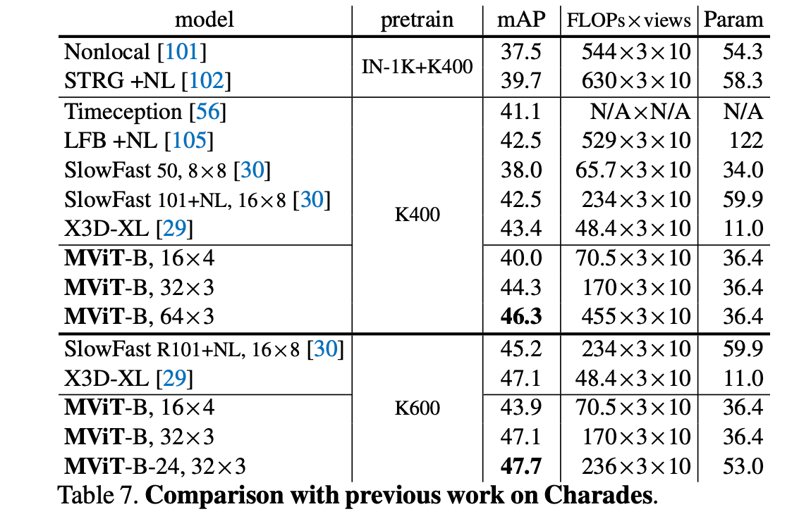

**Charades** [86] 是一个具有更长范围活动的数据集。我们在表 7 中验证了我们的模型。在相似的 FLOP 和参数下，我们的 MViT-B 16×4 比 SlowFast R50 [30] 取得了更好的结果（+2.0 mAP）。如表所示，通过增加输入帧和 MViT-B 层数以及使用 K600 预训练模型，进一步提高了 MViT-B 的性能。

> **Charades** [86] is a dataset with longer range activities. We validate our model in Table 7. With similar FLOPs and parameters, our MViT-B 16×4 achieves better results (+2.0 mAP) than SlowFast R50 [30]. As shown in the Table, the performance of MViT-B is further improved by increasing the number of input frames and MViT-B layers and using K600 pre-trained models.

**AVA** [39] 是一个用于对人类行为进行时空定位的数据集。我们在这个检测任务上验证了我们的 MViT。有关 MViT 检测架构的详细信息，请参见 §D.2。表 8 显示了我们的 MViT 模型与 SlowFast [30] 和 X3D [29] 相比的结果。我们观察到，使用相同的预训练和测试策略，MViT-B 可以与 SlowFast 和 X3D 竞争。

> **AVA** [39] is a dataset with for spatiotemporal-localization of human actions. We validate our MViT on this detection task. Details about the detection architecture of MViT can be found in §D.2. Table 8 shows the results of our MViT models compared with SlowFast [30] and X3D [29]. We observe that MViT-B can be competitive to SlowFast and X3D using the same pre-training and testing strategy.

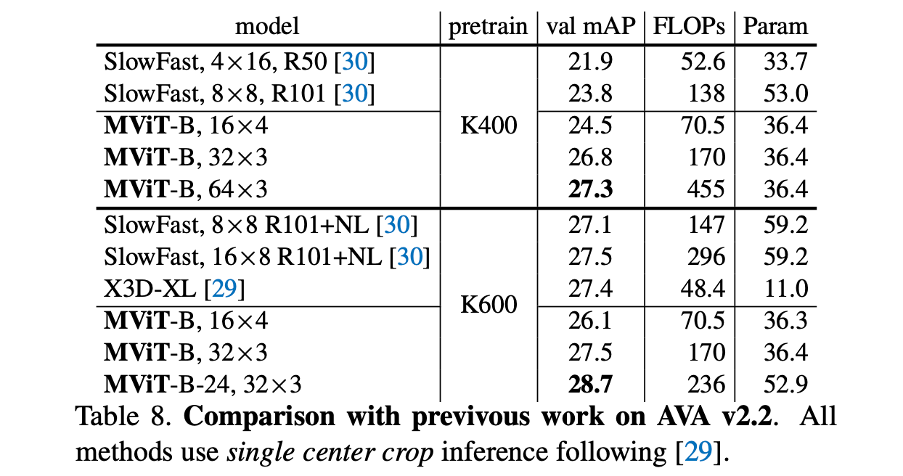

表 8. 与之前 AVA v2.2 工作的比较。所有方法都使用 [29] 之后的单中心裁剪推断。

>Table 8. Comparison with previvous work on AVA v2.2. All methods use single center crop inference following [29].

### 4.2. Ablations on Kinetics

我们使用 5clip center 224×224 作物测试对 Kinetics-400 (K400) 进行消融。我们展示了空间大小为 2242 的单个剪辑输入的 top-1 精度 (Acc) 以及以 GFLOP 为单位测量的计算复杂度。推理计算成本与使用固定数量的 5 个剪辑成正比（以 T ×τ =16×4 采样粗略覆盖推断视频。）我们还报告了 M(106 ) 中的参数和 G(109 ) 中的训练 GPU 内存批量大小为 4。默认情况下，所有 MViT 消融都使用 MViT-B，T ×τ =16×4 和 MHSA 中的最大池化。

>We carry out ablations on Kinetics-400 (K400) using 5clip center 224×224 crop testing. We show top-1 accuracy (Acc), as well as computational complexity measured in GFLOPs for a single clip input of spatial size 2242 . Inference computational cost is proportional as a fixed number of 5 clips is used (to roughly cover the inferred videos with T ×τ =16×4 sampling.) We also report Parameters in M(106 ) and training GPU memory in G(109 ) for a batch size of 4. By default all MViT ablations are with MViT-B, T ×τ =16×4 and max-pooling in MHSA.

>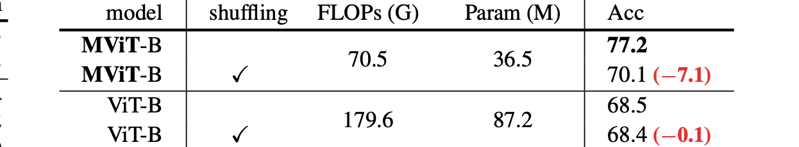

表 9. 推理中的打乱帧。 MViT-B 对于混洗的时间输入严重下降（-7.1%），但 ViT-B 模型似乎忽略了时间信息，因为准确度保持相似（-0.1%）。

>Table 9. Shuffling frames in inference. MViT-B severely drops (−7.1%) for shuffled temporal input, but ViT-B models appear to ignore temporal information as accuracy remains similar (−0.1%).

**打乱帧**。表 9 显示了在测试期间及时随机打乱输入帧的结果。所有模型都在没有任何打乱的情况下进行训练，并且具有时间嵌入。我们注意到，我们的 MViT-B 架构在改组推理帧时的准确度显着下降了 -7.1%（77.2 → 70.1）。相比之下，ViT-B 在打乱输入的时间顺序方面出奇的稳健。

> Frame shuffling. Table 9 shows results for randomly shuffling the input frames in time during testing. All models are trained without any shuffling and have temporal embeddings. We notice that our MViT-B architecture suffers a significant accuracy drop of -7.1% (77.2 → 70.1) for shuffling inference frames. By contrast, ViT-B is surprisingly robust for shuffling the temporal order of the input.

这表明 ViT 对视频的原始应用不会对时间信息进行建模，并且 ViT-B 中的时间位置嵌入似乎被完全忽略了。我们还使用表 4 中 79.3% 的 ImageNet-21K 预训练 ViT-B 验证了这一点，它在混洗测试帧方面具有相同的 79.3% 的准确度，这表明它在 Kinetics 中隐式地执行了帧包视频分类。

>This indicates that a naïve application of ViT to video does not model temporal information, and the temporal positional embedding in ViT-B seems to be fully ignored. We also verified this with the 79.3% ImageNet-21K pre-trained ViT-B of Table 4, which has the same accuracy of 79.3% for shuffling test frames, suggesting that it implicitly performs bag-of-frames video classification in Kinetics.

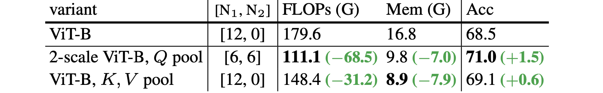

表 10. **ViTB 上的查询（规模阶段）和键值池化**。在 ViT-B 中引入一个额外的分辨率级可将精度提高 +1.5%。池化 K、V 提供 +0.6% 的准确度。这两种技术都可以显着节省 FLOPs/内存。

>Table 10. Query (scale stage) and Key-Value pooling on ViTB. Introducing a single extra resolution stage into ViT-B boosts accuracy by +1.5%. Pooling K, V provides +0.6% accuracy. Both techniques allow dramatic FLOPs/memory savings.

**ViT 中的两个阶段**。我们提供了一个简单的实验来消除 ViT-B 上规模阶段设计的有效性。为此，我们在 ViT-B 模型中添加了一个单一的规模阶段。为了隔离 ViT 中不同尺度的影响，我们不改变这个实验的通道维度。我们通过在 6 个 Transformer 块之后使用
)
执行 Q-Pooling 来做到这一点（参见表 3）。表 10 显示了结果。在 ViT-B 基线中添加单个缩放阶段可将准确度提高 +1.5%，同时将 FLOP 和内存成本降低 38% 和 41%。池化键值张量降低了计算和内存成本，同时略微提高了准确性。

>**Two scales in ViT.** We provide a simple experiment that ablates the effectiveness of scale-stage design on ViT-B. For this we add a single scale stage to the ViT-B model. To isolate the effect of having different scales in ViT, we do not alter the channel dimensionality for this experiment. We do so by performing Q-Pooling with sQ ≡ (1, 2, 2) after 6 Transformer blocks (cf. Table 3). Table 10 shows the results. Adding a single scale stage to the ViT-B baseline boosts accuracy by +1.5% while deceasing FLOPs and memory cost by 38% and 41%. Pooling Key-Value tensors reduces compute and memory cost while slightly increasing accuracy.

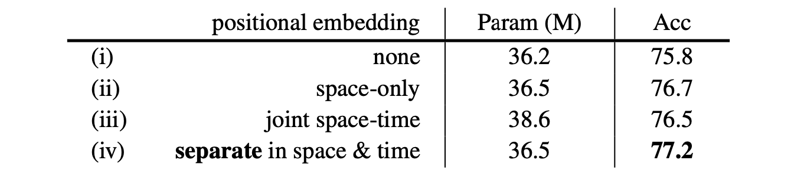

表 11. **单独时空位置嵌入的效果**。主干：MViT-B，16×4。所有变体的 FLOP 为 70.5G。

>Table 11. **Effect of separate space-time positional embedding**. Backbone: MViT-B, 16×4. FLOPs are 70.5G for all variants.

**在 MViT 中分离空间和时间嵌入**。在表 11 中，我们使用 (i) 无、(ii) 仅空间、(iii) 联合时空和 (iv) 单独的空间和时间（我们的默认值）位置嵌入进行消融。我们观察到，没有嵌入 (i) 比仅使用空间嵌入 (ii) 的精度下降 -0.9%，这大致相当于联合时空嵌入 (iii)。我们的单独时空嵌入 (iv) 是最好的，并且参数也比联合时空嵌入少 2.1M。

>**Separate space & time embeddings in MViT**. In Table 11, we ablate using (i) none, (ii) space-only, (iii) joint space-time, and (iv) a separate space and time (our default), positional embeddings. We observe that no embedding (i) decays accuracy by -0.9% over using just a spatial one (ii) which is roughly equivalent to a joint spatiotemporal one (iii). Our separate space-time embedding (iv) is best, and also has 2.1M fewer parameters than a joint spacetime embedding.

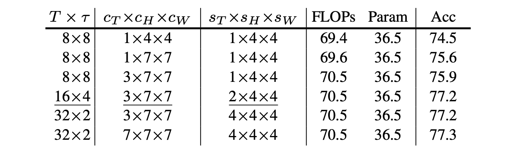

表 12. **输入采样**：我们改变采样率 

，大小 

 和 

 的跨度，投影时空立方体的 cube 

 层。时间范围 

的立方体是有益的。我们的默认设置带有下划线。

>Table 12. **Input sampling**: We vary sampling rate T × τ , the size c=cT ×cH ×cW and stride of s=sT ×sH ×sW the cube1 layer that projects space-time cubes. Cubes with temporal extent cT > 1 are beneficial. Our default setting is underlined.

**输入采样率**。表 12 显示了不同立方核大小 c 和采样步长 s 的结果（参见表 2）。我们观察到，采样块 

的性能比 

的采样立方体的性能差。此外，采样两倍多的帧，T = 16，两倍的立方体步长，

，保持成本不变，但提高性能+1.3%（75.9% → 77.2%）。此外，对重叠输入立方体 s < c 进行采样可以实现更好的信息流并提高性能。虽然 

是有帮助的，但非常大的时间内核大小 
)
 并不能进一步提高性能。

> **Input Sampling Rate.** Table 12 shows results for different cubification kernel size c and sampling stride s (cf. Table 2). We observe that sampling patches, cT = 1, performs worse than sampling cubes with cT > 1. Further, sampling twice as many frames, T = 16, with twice the cube stride, sT = 2, keeps the cost constant but boosts performance by +1.3% (75.9% → 77.2%). Also, sampling overlapping input cubes s < c allows better information flow and benefits performance. While cT > 1 helps, very large temporal kernel size (cT = 7) doesn’t futher improve performance.

**阶段分布**。表 13 中的消融显示了在每个单独的比例级中分配transformer块数量的结果。transformer块的总数，N = 16 是一致的。我们观察到，在早期阶段拥有更多块会增加记忆力，并且更多块稍后阶段架构的参数。将大部分块转移到 scale4 阶段（表 13 中的 V5 和 V6 变体）实现了最佳权衡。

> **Stage distribution.** The ablation in Table 13 shows the results for distributing the number of transformer blocks in each individual scale stage. The overall number of transformer blocks, N =16 is consistent. We observe that having more blocks in early stages increases memory and having more blocks later stages the parameters of the architecture. Shifting the majority of blocks to the scale4 stage (Variant V5 and V6 in Table 13) achieves the best trade-off.

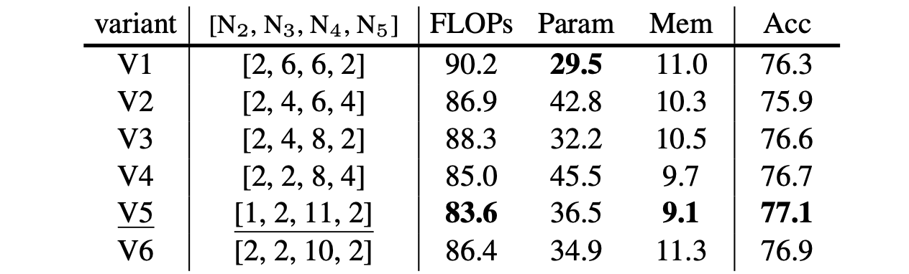

表 13. 比例块：我们将阶段配置消融为 MViT-B 阶段中的块数 N（即池 Q 的位置）。transformer块的总数是恒定的，N = 16。

>Table 13. Scale blocks: We ablate the stage configuration as the number of blocks N in stages of MViT-B (i.e. where to pool Q). The overall number of transformer blocks is constant with N =16.

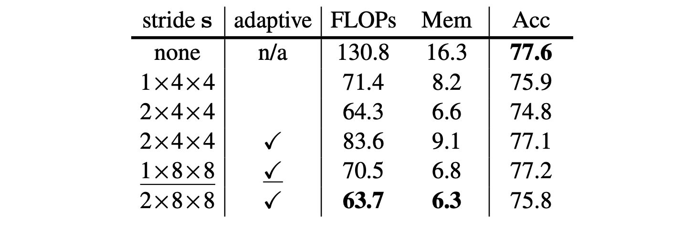

表 14. **键值池化**：改变步幅

，用于池化 K 和 V。 “自适应”减少步幅 w.r.t.阶段分辨率。

>Table 14. **Key-Value pooling:** Vary stride s = sT × sH × sW , for pooling K and V . “adaptive” reduces stride w.r.t. stage resolution.

**键值池化**。表 14 中的消融分析了池化步幅 

 ，用于池化 K 和 V 张量。在这里，我们比较了使用 stride 对于阶段分辨率的“自适应”池化。并在所有阶段保持 K、V 分辨率固定，而不是在每个块使用相同步幅的非自适应版本。首先，我们将不使用 K、V 池化的基线与所有阶段的固定步幅为 2×4×4 的非自适应池化进行比较：这将准确度从 77.6% 降低到 74.8（并将 FLOPs 和内存减少了 50% 以上） ）。在 scale1 阶段使用 1×8×8、在 scale2 中为 1×4×4、在 scale3 中使用 1×2×2 的自适应步幅可提供 77.2% 的最佳准确度，同时仍保留 FLOP 和内存。

>**Key-Value pooling.** The ablation in Table 14 analyzes the pooling stride s = sT × sH × sW , for pooling K and V tensors. Here, we compare an “adaptive” pooling that uses a stride w.r.t. stage resolution, and keeps the K, V resolution fixed across all stages, against a non-adaptive version that uses the same stride at every block. First, we compare the baseline which uses no K, V pooling with non-adaptive pooling with a fixed stride of 2×4×4 across all stages: this drops accuracy from 77.6% to 74.8 (and reduces FLOPs and memory by over 50%). Using an adaptive stride that is 1×8×8 in the scale1 stage, 1×4×4 in scale2 , and 1×2×2 in scale3 gives the best accuracy of 77.2% while still preserving most of the efficiency gains in FLOPs and memory.

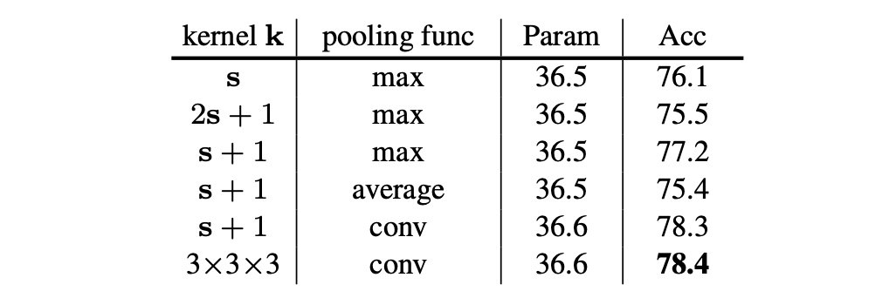

表 15. **池化函数**：将内核 k 作为步幅 s 的函数变化。函数是平均或最大池化和 conv，这是一个可学习的通道卷积。

>Table 15. **Pooling function**: Varying the kernel k as a function of stride s. Functions are average or max pooling and conv which is a learnable, channel-wise convolution.

**池化函数**。表 15 中的消融着眼于内核大小，步幅 s 和池化函数 (max/average/conv)。首先，我们看到具有等效的内核和步幅 k=s 提供 76.1%，将内核大小增加到 k=2s+1 会衰减到 75.5%，但使用内核 k=s+1 会带来 77.2% 的明显收益。这表明重叠池是有效的，但过大的重叠 (2s+1) 会造成伤害。

>Pooling function. The ablation in Table 15 looks at the kernel size k w.r.t. the stride s, and the pooling function (max/average/conv). First, we see that having equivalent kernel and stride k=s provides 76.1%, increasing the kernel size to k=2s+1 decays to 75.5%, but using a kernel k=s+1 gives a clear benefit of 77.2%. This indicates that overlapping pooling is effective, but a too large overlap (2s+1) hurts.

其次，我们研究平均值而不是最大池，并观察到准确率从 77.2% 下降到 75.4%。

> Second, we investigate average instead of max-pooling and observe that accuracy decays by from 77.2% to 75.4%.

第三，我们通过可学习的通道卷积，在 LN后。此变体比最大池化 +1.2%，用于 §4.1 和 §5 中的所有实验。

> Third, we use conv-pooling by a learnable, channelwise convolution followed by LN. This variant has +1.2% over max pooling and is used for all experiments in §4.1 and §5.

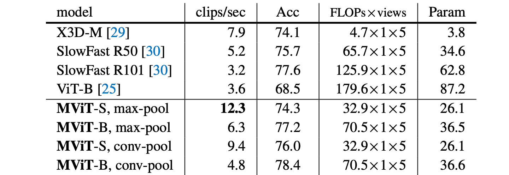

表 16. **Kinetics-400 的速度-准确度权衡**。训练吞吐量以剪辑/秒为单位。 MViT 快速而准确。

>Table 16. **Speed-Accuracy tradeoff on Kinetics-400.** Training throughput is measured in clips/s. MViT is fast and accurate.

**速度-准确度权衡**。在表 16 中，我们分析了 MViT 模型及其对应的视觉transformer(ViT [25]) 和 ConvNets (SlowFast 8×8 R50、SlowFast 8×8 R101 [30] 和 X3D) 的速度/准确度权衡-L [29]）。我们将训练吞吐量测量为单个 M40 GPU 上每秒的视频剪辑数量。

> **Speed-Accuracy tradeoff.** In Table 16, we analyze the speed/accuracy trade-off of our MViT models, along with their counterparts vision transformer (ViT [25]) and ConvNets (SlowFast 8×8 R50, SlowFast 8×8 R101 [30], & X3D-L [29]). We measure training throughput as the number of video clips per second on a single M40 GPU.

我们观察到 MViT-S 和 MViT-B 模型不仅比 ViT-B 基线模型和卷积模型更准确，而且速度更快。具体而言，MViT-S 的吞吐速度（剪辑/秒）提高了 3.4 倍，准确率提高了 5.8%（Acc），参数（参数）比 ViT-B 少了 3.3 倍。在 MHSA 中使用 conv 而不是 maxpooling，我们观察到卷积和附加参数更新的训练速度降低了 20%。

>We observe that both MViT-S and MViT-B models are not only significantly more accurate but also much faster than both the ViT-B baseline and convolutional models. Concretely, MViT-S has 3.4× higher throughput speed (clips/s), is +5.8% more accurate (Acc), and has 3.3× fewer parameters (Param) than ViT-B. Using a conv instead of maxpooling in MHSA, we observe a training speed reduction of ∼20% for convolution and additional parameter updates.

## 5.Experiments: Image Recognition

图像识别我们将我们的视频模型应用于静态图像识别，方法是在 ImageNet-1K [22] 上使用单帧 T = 1 的视频模型。训练。我们的配置与 DeiT [95] 相同，并在补充材料中进行了总结。训练时间为 300 epochs，训练时间越长，结果越好 [95]。

>We apply our video models on static image recognition by using them with single frame, T = 1, on ImageNet-1K [22]. Training. Our recipe is identical to DeiT [95] and summarized in the supplementary material. Training is for 300 epochs and results improve for training longer [95].

### 5.1.Main Results

对于本实验，我们采用我们的模型，这些模型是通过消融研究设计的，用于 Kinetics 上的视频分类，并简单地去除了时间维度。然后我们在 ImageNet 上训练和验证它们（“从头开始”）。

> For this experiment, we take our models which were designed by ablation studies for video classification on Kinetics and simply remove the temporal dimension. Then we train and validate them (“from scratch”) on ImageNet.

表 17 显示了与以前工作的比较。从上到下，该表包含 RegNet [81] 和 EfficientNet [93] 作为 ConvNet 示例，以及 DeiT [95]，其中 DeiT-B 与 ViT-B [25] 相同，但使用 [95] 中的改进配置进行训练.因此，这是我们有兴趣比较的视觉transformer对应物。

> Table 17 shows the comparison with previous work. From top to bottom, the table contains RegNet [81] and EfficientNet [93] as ConvNet examples, and DeiT [95], with DeiT-B being identical to ViT-B [25] but trained with the improved recipe in [95]. Therefore, this is the vision transformer counterpart we are interested in comparing to.

表 17 的底部显示了我们的多尺度视觉transformer (MViT) 模型的结果。

> The bottom section in Table 17 shows results for our Multiscale Vision Transformer (MViT) models.

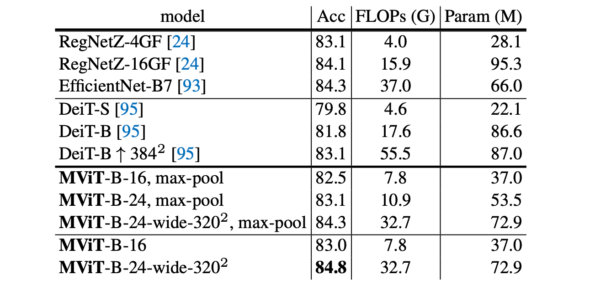

表 17. 与 ImageNet 上先前工作的比较。 RegNet 和 EfficientNet 是使用不同训练方案的 ConvNet 示例。 DeiT/MViT 基于 ViT 并使用相同的配置 [95]。

>Table 17. Comparison to prior work on ImageNet. RegNet and EfficientNet are ConvNet examples that use different training recipes. DeiT/MViT are ViT-based and use identical recipes [95].

我们展示了不同深度的模型，MViT-B-Depth，（16、24 和 32），其中 MViT-B-16 是我们的基础模型，更深的变体是通过在每个尺度上重复块数 N∗ 来简单地创建的阶段（参见表 3b）。 “宽”表示更大的通道维度 D = 112。我们所有的模型都使用与 DeiT [95] 相同的配置进行训练。我们进行了以下观察：

> We show models of different depth, MViT-B-Depth, (16, 24, and 32), where MViT-B-16 is our base model and the deeper variants are simply created by repeating the number of blocks N∗ in each scale stage (cf. Table 3b). “wide” denotes a larger channel dimension of D = 112. All our models are trained using the identical recipe as DeiT [95]. We make the following observations:

（i）我们的轻量级 MViT-B-16 实现了 82.5% 的 top-1 准确率，只有 7.8 GFLOPs，比 DeiT-B 对应物高出 +0.7%，计算成本更低（2.3×更少的 FLOPs 和参数）。如果我们使用 conv 而不是 max-pooling，这个数字会增加 +0.5% 到 83.0%。

> (i) Our lightweight MViT-B-16 achieves 82.5% top-1 accuracy, with only 7.8 GFLOPs, which outperforms the DeiT-B counterpart by +0.7% with lower computation cost (2.3×fewer FLOPs and Parameters). If we use conv instead of max-pooling, this number is increased by +0.5% to 83.0%.

(ii) 我们更深的模型 MViT-B-24 在计算量略有增加的情况下提供了 +0.6% 的准确度增益。

> (ii) Our deeper model MViT-B-24, provides a gain of +0.6% accuracy at slight increase in computation.

(iii) 更大的模型，MViT-B-24-wide，输入分辨率 3202 达到 84.3%，对应于 +1.2% 的增益，比 DeiT-B↑3842 少 1.7 倍的 FLOP。使用卷积而不是最大池将其提升到 84.8%。这些结果表明，多尺度视觉Transformers比视觉Transformers有架构优势。

>(iii) A larger model, MViT-B-24-wide with input resolution 3202 reaches 84.3%, corresponding to a +1.2% gain, at 1.7×fewer FLOPs, over DeiT-B↑3842 . Using convolutional, instead of max-pooling elevates this to 84.8%. These results suggest that Multiscale Vision Transformers have an architectural advantage over Vision Transformers.

## 6.Conclusion

我们提出了多尺度视觉Transformers，旨在将多尺度特征层次的基本概念与Transformers模型联系起来。 MViT 分层扩展了特征复杂性，同时降低了视觉分辨率。在经验评估中，MViT 在视频和图像识别方面显示出优于单尺度视觉Transformers的基本优势。我们希望我们的方法能够促进视觉识别方面的进一步研究。

>Conclusion We have presented Multiscale Vision Transformers that aim to connect the fundamental concept of multiscale feature hierarchies with the transformer model. MViT hierarchically expands the feature complexity while reducing visual resolution. In empirical evaluation, MViT shows a fundamental advantage over single-scale vision transformers for video and image recognition. We hope that our approach will foster further research in visual recognition.

## Appendix

在本附录中，§A 包含对 Kinetics (§A.1) 和 ImageNet (§A.2) 的进一步消融，§C 包含对 MHPA 计算复杂性的分析，§B 包含 MViT 和 ViT 模型中的定性观察。 §D 包含以下实施细节：Kinetics (§D.1)、AVA (§D.2)、Charades (§D.3)、SSv2 (§D.4) 和 ImageNet (§D.5)。

>In this appendix, §A contains further ablations for Kinetics (§A.1) & ImageNet (§A.2), §C contains an analysis on computational complexity of MHPA, and §B qualitative observations in MViT and ViT models. §D contains additional implementation details for: Kinetics (§D.1), AVA (§D.2), Charades (§D.3), SSv2 (§D.4), and ImageNet (§D.5).

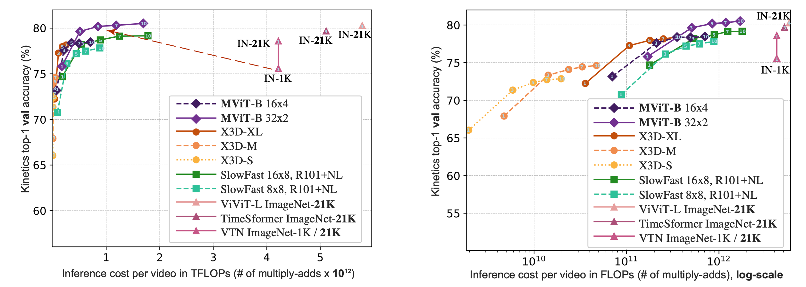

图 A.4。每段视频中不同#推理片段的K400-val的准确度/复杂度权衡。前1名的准确率（纵轴）是通过K-中心片段测试得到的，其中时间片段的数量K∈{1，3，5，7，10}显示在每条曲线上。横轴衡量的是每个视频的全部推理开销。左边的图显示的是线性，右边的图是对数（log）尺度。

>Figure A.4. Accuracy/complexity trade-off on K400-val for varying # of inference clips per video. The top-1 accuracy (vertical axis) is obtained by K-Center clip testing where the number of temporal clips K ∈ {1, 3, 5, 7, 10} is shown in each curve. The horizontal axis measures the full inference cost per video. The left-sided plots show a linear and the right plots a logarithmic (log) scale.

### A. Additional Results

#### A.1. Ablations: Kinetics Action Classification

**分类推理成本**。本着 [29] 的精神，我们的目标是为使用更少的测试片段进行有效的视频级推理的效果提供进一步的消融。在图 A.4 中，我们分析了在改变使用的时间剪辑数量时对视频的完整推理的权衡。纵轴显示 K400-val 上的 top-1 准确度，横轴显示不同模型系列的 FLOP 中的总体推理成本：MViT、X3D [29]、SlowFast [30] 和并发 ViT 模型、VTN [78] ViT -B-TimeSformer [6] ViT-L-ViViT [1]，在 ImageNet-21K 上预训练。

> **Inference cost.** In the spirit of [29] we aim to provide further ablations for the effect of using fewer testing clips for efficient video-level inference. In Fig. A.4 we analyze the trade-off for the full inference of a video, when varying the number of temporal clips used. The vertical axis shows the top-1 accuracy on K400-val and the horizontal axis the overall inference cost in FLOPs for different model families: MViT, X3D [29], SlowFast [30], and concurrent ViT models, VTN [78] ViT-B-TimeSformer [6] ViT-L-ViViT [1], pre-trained on ImageNet-21K.

我们首先在图 A.4 的左图中将 MViT 与基于 Transformer 的并发方法进行比较。所有这些方法，VTN [78]、TimeSformer [6] 和 ViViT [1]，都在 ImageNet-21K 上进行预训练，并使用 ViT [25] 模型并对其进行修改。这些方法的推理 FLOP 比具有同等性能的 MViT 模型高约 5-10 倍；例如，ViT-L-ViViT [1] 使用 4 个 1446G FLOP（即 5.78 TFLOP）的片段，每个片段产生 80.3% 的准确率，而 MViT-B，32×3 使用 5 个 170G FLOP 的片段（即 0.85 TFLOP）产生 80.2 ％ 准确性。因此，与并发 ViViT-L [1] 相比，MViT-L 可以在 6.8 倍的 FLOP（和 8.5 倍的参数）下提供相似的精度。更重要的是，MViT 结果是在没有外部数据的情况下实现的。所有并发的基于 Transformer 的工作 [78, 6, 1] 都需要大规模的 ImageNet-21K 才能具有竞争力，并且性能会显着下降（-3% 准确度，参见图 A.4 中的 IN-1K for VTN [78]） .这些工作进一步报告了没有 ImageNet 初始化的训练失败。

> We first compare MViT with concurrent Transformerbased methods in the left plot in Fig. A.4. All these methods, VTN [78], TimeSformer [6] and ViViT [1], pre-train on ImageNet-21K and use the ViT [25] model with modifications on top of it. The inference FLOPs of these methods are around 5-10×higher than MViT models with equivalent performance; for example, ViT-L-ViViT [1] uses 4 clips of 1446G FLOPs (i.e. 5.78 TFLOPs) each to produce 80.3% accuracy while MViT-B, 32×3 uses 5 clips of 170G FLOPs (i.e. 0.85 TFLOPs) to produce 80.2% accuracy. Therefore, MViT-L can provide similar accuracy at 6.8× lower FLOPs (and 8.5× lower parameters), than concurrent ViViT-L [1]. More importantly, the MViT result is achieved without external data. All concurrent Transformer based works [78, 6, 1] require the huge scale ImageNet-21K to be competitive, and the performance degrades significantly (-3% accuracy, see IN-1K in Fig. A.4 for VTN [78]). These works further report failure of training without ImageNet initialization.

图 A.4 右侧的图显示了同样的图，对数刻度应用于 FLOPs 轴。使用这种缩放可以更清楚地观察到较小的模型卷积模型（X3D-S 和 X3D-M）仍然可以在乘加运算方面提供更有效的推理，并且 MViT-B 计算/准确性权衡类似于 X3D-XL。

> The plot in Fig. A.4 right shows this same plot with a logarithmic scale applied to the FLOPs axis. Using this scaling it is clearer to observe that smaller models convolutional models (X3D-S and X3D-M) can still provide more efficient inference in terms of multiply-add operations and MViT-B compute/accuracy trade-off is similar to X3D-XL.

**跳过连接的消融**。回想一下，在 MViT 的每个 scalestage 转换中，我们通过增加前一阶段的 MLP 层的输出维度来扩展通道维度；因此，不可能直接应用原始的跳过连接设计 [25]，因为输入通道维度 (Din) 与输出通道维度 (Dout) 不同。我们为此消融了三种策略：（a）首先使用层归一化对输入进行归一化，然后扩展其通道维度以将输出维度与线性层匹配（图 A.5a）；这是我们的默认设置。 (b) 通过使用线性层匹配维度直接扩展输入的通道维度（图 A.5b）。 （c）阶段转换没有跳跃连接（图A.5c）。

>**Ablations on skip-connections**. Recall that, at each scalestage transition in MViT, we expand the channel dimension by increasing the output dimension of the previous stages’ MLP layer; therefore, it is not possible to directly apply the original skip-connection design [25], because the input channel dimension (Din ) differs from the output channel dimension (Dout ). We ablate three strategies for this: (a) First normalize the input with layer normalization and then expand its channel dimension to match the output dimension with a linear layer (Fig. A.5a); this is our default. (b) Directly expand the channel dimension of the input by using a linear layer to match the dimension (Fig. A.5b). (c) No skip-connection for stage-transitions (Fig. A.5c).

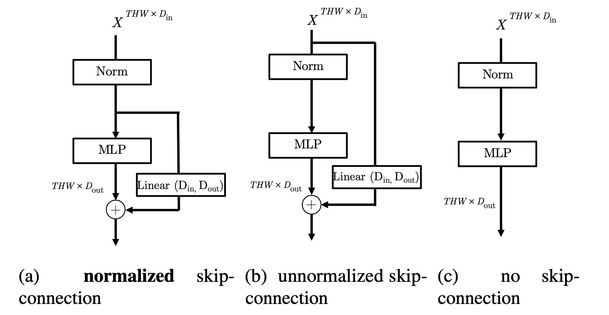

图 A.5。在阶段转换时跳过连接。三种用于扩展通道维度的跳跃连接变体：（a）首先使用层归一化（Norm）对输入进行归一化，然后扩展其通道维度； (b) 直接扩展输入的通道维度； (c) 在阶段转换时没有跳跃连接。

>Figure A.5. Skip-connections at stage-transitions. Three skipconnection variants for expanding channel dimensions: (a) first normalize the input with layer normalization (Norm) and then expand its channel dimension; (b) directly expand the channel dimension of the input; (c) no skip-connection at stage-transitions.

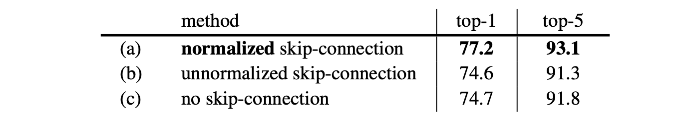

>Table A.1. Skip-connections at stage-transitions on K400. We use our base model, MViT-B 16×4. Normalizing the skipconnection at channel expansion is essential for good performance.

表 A.1 显示了所有 3 种变体的 Kinetics-400 消融。我们默认使用归一化跳过连接 (a) 以 77.2% 的 top-1 准确度获得最佳结果，而在通道扩展后使用非归一化跳过连接 (b) 显着衰减到 74.6% 并且对所有不使用跳过连接stage-transitions (c) 也有类似的结果。我们假设为了扩展通道维度，标准化信号对于促进优化至关重要，并在所有其他实验中将此设计用作我们的默认设置。

Table A.1 shows the Kinetics-400 ablations for all 3 variants. Our default of using a normalized skip-connection (a) obtains the best results with 77.2% top-1 accuracy, while using an un-normalized skip-connection after channel expansion (b) decays significantly to 74.6% and using no skipconnection for all stage-transitions (c) has a similar result. We hypothesize that for expanding the channel dimension, normalizing the signal is essential to foster optimization, and use this design as our default in all other experiments.

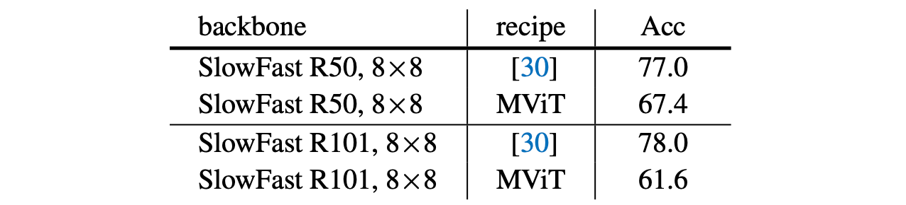

表 A.2。在 Kinetics-400 上使用 MViT 配置的 SlowFast 模型。默认配置使用原始论文中的配置。在 10×3 视图上评估准确性。

>Table A.2. SlowFast models with MViT recipe on Kinetics-400. The default recipe is using the recipe from the original paper. Accuracy is evaluated on 10×3 views.

**使用 MViT 配置的 SlowFast**。为了调查我们的训练方案是否可以使 ConvNet 模型受益，我们将与 MViT 相同的增强和训练方案应用于表 A.2 中的 SlowFast。结果表明，SlowFast 模型不会直接从 MViT 配置中受益，需要更多的研究来了解将我们的从头开始训练的配置应用于 ConvNets 的效果，因为似乎更高容量的 ConvNets (R101) 在使用我们的配置时表现更差。

>**SlowFast with MViT recipe**. To investigate if our training recipe can benefit ConvNet models, we apply the same augmentations and training recipe as for MViT to SlowFast in Table A.2. The results suggest that SlowFast models do not benefit from the MViT recipe directly and more studies are required to understand the effect of applying our trainingfrom-scratch recipe to ConvNets, as it seems higher capacity ConvNets (R101) perform worse when using our recipe.

#### A.2. Ablations: ImageNet Image Classification

我们使用具有 16 层的 MViT-B-16 模型在 ImageNet 上进行消融，并展示了 top-1 准确度 (Acc) 以及以 GFLOP（浮点运算）测量的计算复杂度。我们还报告了 的参数
)
并在内存为 
)
 的GPU 中训练，批量大小为 512。

>We carry out ablations on ImageNet with the MViT-B-16 model with 16 layers, and show top-1 accuracy (Acc) as well as computational complexity measured in GFLOPs (floatingpoint operations). We also report Parameters in M(106 ) and training GPU memory in G(109 ) for a batch size of 512. s

表 A.3。 **ImageNet：键值池化**：我们改变步幅 

，用于池化 K 和 V。我们使用“自适应”池化来减少对于阶段分辨率的步幅 。

>Table A.3. **ImageNet: Key-Value pooling**: We vary stride sH × sW , for pooling K and V . We use “adaptive” pooling that reduces stride w.r.t. stage resolution.

**用于图像分类的键值池化**。表 A.3 中的消融分析了池化步幅

 ，用于池化 K 和 V 张量。在这里，我们使用默认的“自适应”使用关于池化级分辨率步幅，并在所有级上保持 K、V 分辨率固定。

> **Key-Value pooling for image classification**. The ablation in Table A.3 analyzes the pooling stride s = sH × sW , for pooling K and V tensors. Here, we use our default ‘adaptive’ pooling that uses a stride w.r.t. stage resolution, and keeps the K, V resolution fixed across all stages.

首先，我们将使用固定步长为 4×4 的池化的基线与步长为 8×8 的模型进行比较：这将准确率从 82.5% 降低到 81.6%，并将 FLOPs 和内存减少了 0.6G 和 2.9G。

> First, we compare the baseline which uses pooling with a fixed stride of 4×4 with a model has a stride of 8×8: this drops accuracy from 82.5% to 81.6%, and reduces FLOPs and memory by 0.6G and 2.9G.

其次，我们将步幅减小到 2×2，这显着增加了 FLOP 和内存，但性能比我们默认的 4×4 步幅差 0.7%。

> Second, we reduce the stride to 2×2, which increases FLOPs and memory significantly but performs 0.7% worse than our default stride of 4×4.

第三，我们完全移除了 K、V 池化，这使 FLOPs 增加了 33%，内存消耗增加了 45%，同时提供的准确度低于我们的默认值。

> Third, we remove the K, V pooling completely which increases FLOPs by 33% and memory consumption by 45%, while providing lower accuracy than our default.

总体而言，结果表明我们的 K、V 池化是一种有效的技术，可以提高图像分类的准确性并降低成本（FLOPs/memory）。

>Overall, the results show that our K, V pooling is an effective technique to increase accuracy and decrease cost (FLOPs/memory) for image classification.

### B. Qualitative Experiments: Kinetics

在图 A.6 中，我们绘制了 Multiscale Transformer 模型及其 Vision Transformer 对应物的所有层的所有头部的平均注意力距离，在随机权重初始化时，以及在训练后收敛时。每个头代表图中的一个点（ViT-B 有更多头）。两个模型都使用完全相同的权重初始化方案，注意力特征的差异纯粹源于 MViT 中的多尺度骨架。我们观察到，MViT 模型中注意力距离的动态范围比初始化时的 ViT 大 4 倍左右（A.6a 与 A.6b）。这标志着源自 MViT 多尺度设计的强感应偏置。另请注意，虽然在初始化时，ViT 中的每一层都具有大致相同的平均注意力距离，但 MViT 层具有显着不同的平均注意力特征，表明对全局和局部特征的不同偏好。

> In Figure A.6, we plot the mean attention distance for all heads across all the layers of our Multiscale Transformer model and its Vision Transformer counterpart, at initialization with random weights, and at convergence after training. Each head represents a point in the plots (ViT-B has more heads). Both the models use the exact same weight initialization scheme and the difference in the attention signature stems purely from the multiscale skeleton in MViT. We observe that the dynamic range of attention distance is about 4× larger in the MViT model than ViT at initialization itself (A.6a vs. A.6b). This signals the strong inductive bias stemming from the multiscale design of MViT. Also note that while at initialization, every layer in ViT has roughly the same mean attention distance, the MViT layers have strikingly different mean attention signatures indicating distinct predilections towards global and local features.

图 A.6 的底行显示了收敛的视觉Transformer(A.6c) 和多尺度视觉Transformer (A.6d) 模型的相同图。

> The bottom row of Fig. A.6 shows the same plot for a converged Vision Transformer (A.6c) and Multiscale Vision Transformer (A.6d) model.

我们注意到训练后两个模型之间的趋势非常不同。虽然 ViT 模型 (A.6c) 的跨层注意力距离持续增加，但 MViT 模型 (A.6d) 根本不是单调的。此外，ViT 模型中的头部内变化随着深度饱和而减小，而对于 MViT，即使在较高层中，不同的头部仍然关注不同的特征。这表明 ViT 模型中的一些容量可能确实被冗余计算浪费了，而倾斜的 MViT 头更明智地利用他们的计算。值得注意的是，与 MViT 的位置分布相比，ViT 模型中的整体注意力距离特征有更大的增量（在图 A.6a 中的初始化和 A.6c 中的收敛之间）。

>We notice very different trends between the two models after training. While the ViT model (A.6c) has a consistent increase in attention distance across layers, the MViT model (A.6d) is not monotonic at all. Further, the intra-head variation in the ViT model decreases as the depth saturates, while, for MViT, different heads are still focusing on different features even in the higher layers. This suggests that some of the capacity in the ViT model might indeed be wasted with redundant computation while the lean MViT heads are more judiciously utilizing their compute. Noticeable is further a larger delta (between initialization in Fig. A.6a and convergence in A.6c) in the overall attention distance signature in the ViT model, compared to MViT’s location distribution.

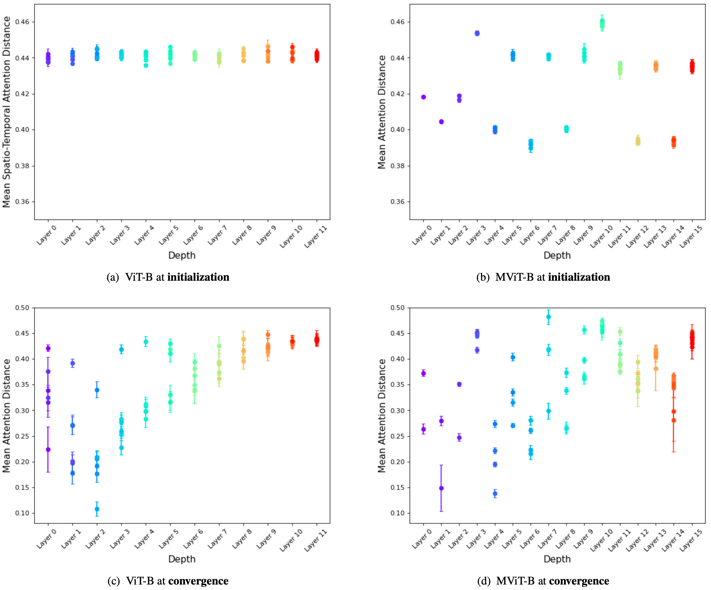

图A.6. 视觉Transformer（a）/（c）和多尺度视觉Transformer（b）/（d）在初始化/融合时各层的平均注意距离。每一点显示了一个层中每个头的归一化平均注意距离（由注意分数加权，1.0为最大可能距离）。MViT在整个网络层次中关注近和远的特征。

>Figure A.6. Mean attention distance across layers at initialization/convergence for Vision Transformer (a)/(c) & Multiscale Vision Transformers (b)/(d). Each point shows the normalized average attention distance (weighted by the attention scores, with 1.0 being maximum possible distance) for each head in a layer. MViT attends close and distant features throughout the network hierarchy.

### C. Computational Analysis Since

由于注意力在计算和内存复杂性方面是二次方的，因此将键、查询和值向量池化对池化算子的基本计算和内存需求有直接的好处，进而对完整的多尺度 Transformer 模型有好处。考虑一个尺寸为 T × H × W 和相应序列长度 L = T · H · W 的输入张量。此外，假设键、查询和值步长为 

 、 

 和 

 。如第二节所述。在主论文 3.1 中，每个向量都会经历一个时空分辨率下采样，下采样是它们相应步幅的一个因子。等效地，查询、键和值向量的序列长度将分别减少 

 、 

 和 

 的因子，其中，

>attention is quadratic in compute and memory complexity, pooling the key, query and value vectors have direct benefits on the fundamental compute and memory requirements of the pooling operator and by extension, on the complete Multiscale Transformer model. Consider an input tensor of dimensions T × H × W and corresponding sequence length L = T · H · W . Further, assume the key, query and value strides to be sK , sQ and sV . As described in Sec. 3.1 in main paper, each of the vectors would experience a sptio-temporal resolution downsampling by a factor of their corresponding strides. Equivalently, the sequence length of query, key and value vectors would be reduced by a factor of f Q , f K and f V respectively, where,

**计算复杂度**。使用这些较短的序列可以相应地降低池化注意力算子的空间和运行时复杂性。考虑到键、查询和值向量在池化后具有序列长度 

、

 和 

，计算键、查询和值嵌入的总体运行时复杂度为
)
每头，其中 h 是 MHPA 中的头数。此外，计算完整注意力矩阵和具有减少序列长度的值向量的加权和的运行时复杂度为每个头 
)
。池化的计算复杂度为

>**Computational complexity**. Using these shorter sequences yields a corresponding reduction in space and runtime complexities for the pooling attention operator. Considering key, query and value vectors to have sequence lengths L/fk , L/fq and L/fv after pooling, the overall runtime complexity of computing the key, query and value embeddings is O(T HW D2 /h) per head, where h is the number of heads in MHPA. Further, the runtime complexity for calculating the full attention matrix and the weighed sum of value vectors with reduced sequence lengths is O(T 2 H 2 W 2 D/fq fh h) per head. Computational complexity for pooling is

与注意力计算的二次复杂度相比可以忽略不计，因此可以在渐近符号中忽略。因此，MHPA 的最终运行时复杂度为
\right))
。

>  which is negligible compared to the quadratic complexity of the attention computation and hence can be ignored in asymptotic notation. Thus, the final runtime complexity of MHPA is O(T HW D(D + T HW/fq fk )).

**内存复杂度**。存储序列本身和其他类似大小的张量的空间复杂度是
)
。存储完整注意力矩阵的复杂度为 
)
。因此 MHPA 的总空间复杂度为 
\right))
.

> **Memory complexity.** The space complexity for storing the sequence itself and other tensors of similar sizes is O(T HW D). Complexity for storing the full attention matrix is O(T 2 H 2 W 2 h/fq fk ). Thus the total space complexity of MHPA is O(T HW h(D/h + T HW/fq fk )).

**设计选择**。注意通道数 D 和序列长度项 

在空间和运行时复杂度上的权衡。这种多头池注意力的权衡为 Multiscale Transformer 架构的两个关键设计选择提供了依据。

> **Design choice.** Note the trade-off between the number of channels D and the sequence length term T HW/fq fk in both space and runtime complexity. This tradeoff in multi head pooling attention informs two critical design choices of Multiscale Transformer architecture.

首先，由于 

 减小，有效时空分辨率随层而降低，通道容量增加以保持每个阶段的计算时间（FLOPs）大致相同。

> First, as the effective spatio-temporal resolution decreases with layers because of diminishing T HW/fq fk , the channel capacity is increased to keep the computational time spent (FLOPs) roughly the same for each stage.

其次，对于固定的通道维度 D，由于 
)
项，较高数量的头 h 会导致更大的内存需求。因此，Multiscale Transformer 从少量头开始，随着分辨率因子 

 的减小而增加，以保持 
)
的效果大致恒定。

> Second, for a fixed channel dimension, D, higher number of heads h cause a prohibitively larger memory requirement because of the (D + h ∗ T HW/fq fk ) term. Hence, Multiscale Transformer starts with a small number of heads which is increased as the resolution factor T HW/fq fk decreases, to hold the effect of (D + h ∗ T HW/fq fk ) roughly constant.

### D. Additional Implementation Details

我们使用 PySlowFast [28] 实现我们的模型。代码和模型可在以下网址获得：https://github.com/facebookresearch/SlowFast。

>D. Additional Implementation Details We implement our model with PySlowFast [28]. Code and models are available at: https://github.com/ facebookresearch/SlowFast.

