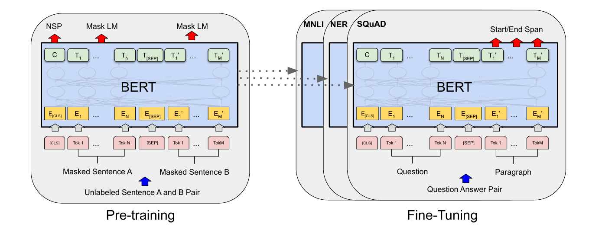
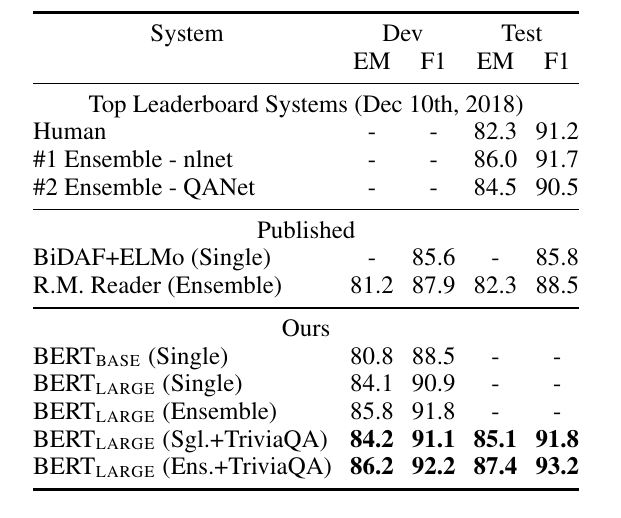
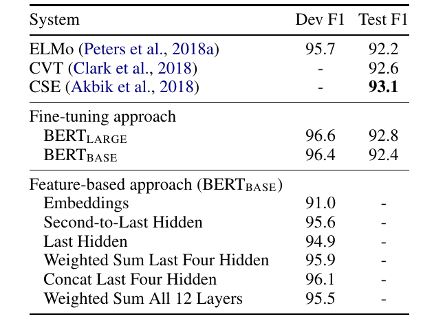

# BERT: Pre-training of Deep Bidirectional Transformers for Language Understanding

>Jacob Devlin   Ming-Wei Chang Kenton Lee   Kristina Toutanova
>
>Google AI Language

>{jacobdevlin,mingweichang,kentonl,kristout}@google.com

## 摘要

>## Abstract

我们引入了一种称为 BERT 的新语言表示模型，它代表来自 Transformers 的双向编码器表示。与最近的语言表示模型 (Peters et al., 2018a; Radford et al., 2018) 不同，BERT 旨在通过联合调节所有层中的左右上下文来预训练未标记文本的深度双向表示。因此，预训练的 BERT 模型可以仅通过一个额外的输出层进行fine-tune，从而为广泛的任务（例如问答和语言推理）创建最先进的模型，而无需大量的特定于任务的架构修改。

>We introduce a new language representa- tion model called BERT, which stands for Bidirectional Encoder Representations from Transformers. Unlike recent language repre- sentation models (Peters et al., 2018a; Rad- ford et al., 2018), BERT is designed to pre- train deep bidirectional representations from unlabeled text by jointly conditioning on both left and right context in all layers. As a re- sult, the pre-trained BERT model can be fine- tuned with just one additional output layer to create state-of-the-art models for a wide range of tasks, such as question answering and language inference, without substantial task- specific architecture modifications.

BERT 在概念上很简单，在经验上很强大。它在 11 个自然语言处理任务上获得了新的最先进的结果，包括将 GLUE 分数推至 80.5%（7.7% 点绝对改进），MultiNLI 准确率达到 86.7%（4.6% 绝对改进），SQuAD v1 .1 问题回答测试 F1 达到 93.2（1.5 分的绝对提高）和 SQuAD v2.0 测试 F1 达到 83.1（5.1 分的绝对提高）。

>BERT is conceptually simple and empirically powerful. It obtains new state-of-the-art re- sults on eleven natural language processing tasks, including pushing the GLUE score to 80.5% (7.7% point absolute improvement), MultiNLI accuracy to 86.7% (4.6% absolute improvement), SQuAD v1.1 question answer- ing Test F1 to 93.2 (1.5 point absolute im- provement) and SQuAD v2.0 Test F1 to 83.1 (5.1 point absolute improvement).

## 1 简介

>## 1 Introduction

语言模型预训练已被证明可有效改善许多自然语言处理任务（Dai 和 Le，2015 年；Peters 等人，2018a；Radford 等人，2018 年；Howard 和 Ruder，2018 年）。这些包括句子级任务，例如自然语言推理（Bowman 等人，2015 年；Williams 等人，2018 年）和释义（Dolan 和 Brockett，2005 年），旨在通过整体分析来预测句子之间的关系，以及 token 级任务，如命名实体识别和问答，其中模型需要在 token 级产生细粒度输出（Tjong Kim Sang 和 De Meulder，2003 年；Rajpurkar 等人， 2016 年）。

> Language model pre-training has been shown to be effective for improving many natural language processing tasks (Dai and Le, 2015; Peters et al., 2018a; Radford et al., 2018; Howard and Ruder, 2018). These include sentence-level tasks such as natural language inference (Bowman et al., 2015; Williams et al., 2018) and paraphrasing (Dolan and Brockett, 2005), which aim to predict the re- lationships between sentences by analyzing them holistically, as well as token-level tasks such as named entity recognition and question answering, where models are required to produce fine-grained output at the token level (Tjong Kim Sang and De Meulder, 2003; Rajpurkar et al., 2016).

将预训练语言表示应用于下游任务有两种现有策略：基于特征的和 fine-tuning。基于特征的方法，例如 ELMo (Peters et al., 2018a)，使用特定于任务的架构，其中包括预训练表示作为附加特征。 fine-tuning 方法，例如生成式预训练 Transformer (OpenAI GPT)（Radford 等人，2018 年），引入了最小的任务特定参数，并通过简单地 fine-tuning 所有预训练参数来对下游任务进行训练。这两种方法在预训练期间共享相同的目标函数，在函数中它们使用单向语言模型来学习通用语言表示。

>There are two existing strategies for apply- ing pre-trained language representations to down- stream tasks: feature-based and fine-tuning. The feature-based approach, such as ELMo (Peters et al., 2018a), uses task-specific architectures that include the pre-trained representations as addi- tional features. The fine-tuning approach, such as the Generative Pre-trained Transformer (OpenAI GPT) (Radford et al., 2018), introduces minimal task-specific parameters, and is trained on the downstream tasks by simply fine-tuning all pre- trained parameters. The two approaches share the same objective function during pre-training, where they use unidirectional language models to learn general language representations.

我们认为当前的技术限制了预训练表示的能力，特别是对于 fine-tuning 方法。主要限制是标准语言模型是单向的，这限制了可以在预训练期间使用的体系结构的选择。例如，在 OpenAI GPT 中，作者使用从左到右的架构，其中每个 token 只能关注 tokens 的自我注意层中的前一个 Transformer（Vaswani 等人， 2017）。这种限制对于句子级任务不是最优的，并且在将基于fine-tune的方法应用于token级任务（例如问答）时可能非常有害，其中从两个方向结合上下文至关重要.

>We argue that current techniques restrict the power of the pre-trained representations, espe- cially for the fine-tuning approaches. The ma- jor limitation is that standard language models are unidirectional, and this limits the choice of archi- tectures that can be used during pre-training. For example, in OpenAI GPT, the authors use a left-to- right architecture, where every token can only at- tend to previous tokens in the self-attention layers of the Transformer (Vaswani et al., 2017). Such re- strictions are sub-optimal for sentence-level tasks, and could be very harmful when applying fine- tuning based approaches to token-level tasks such as question answering, where it is crucial to incor- porate context from both directions.

在本文中，我们通过提出 BERT：来自 fine-tuning 的双向编码器表示来改进基于 Transformer 的方法。 BERT 通过使用“mask语言模型”(MLM) 预训练目标来缓解前面提到的单向性约束，其灵感来自完形填空任务 (Taylor, 1953)。mask语言模型从输入中随机mask一些 tokens，目标是仅根据其上下文预测mask词的原始词汇表 ID。与从左到右的语言模型预训练不同，MLM 目标使表示能够融合左右上下文，这使我们能够预训练深度双向 Transformer。除了mask语言模型，我们还使用“下一句预测”任务联合预训练文本对表示。我们论文的贡献如下：

>In this paper, we improve the fine-tuning based approaches by proposing BERT: Bidirectional Encoder Representations from Transformers. BERT alleviates the previously mentioned unidi- rectionality constraint by using a “masked lan- guage model” (MLM) pre-training objective, in- spired by the Cloze task (Taylor, 1953). The masked language model randomly masks some of the tokens from the input, and the objective is to predict the original vocabulary id of the masked word based only on its context. Unlike left-to- right language model pre-training, the MLM ob- jective enables the representation to fuse the left and the right context, which allows us to pre- train a deep bidirectional Transformer. In addi- tion to the masked language model, we also use a “next sentence prediction” task that jointly pre- trains text-pair representations. The contributions of our paper are as follows:

• 我们证明了双向预训练对语言表征的重要性。不像 Radford 等人(2018)，它使用单向语言模型进行预训练，BERT 使用mask语言模型来启用预训练的深度双向表示。这也与 Peters 等人形成对比(2018a)，他使用浅层 concatenation 的独立训练的从左到右和从右到左的 LM。

>• We demonstrate the importance of bidirectional pre-training for language representations. Un- like Radford et al. (2018), which uses unidirec- tional language models for pre-training, BERT uses masked language models to enable pre- trained deep bidirectional representations. This is also in contrast to Peters et al. (2018a), which uses a shallow concatenation of independently trained left-to-right and right-to-left LMs.

• 我们表明，预训练表示减少了对许多精心设计的任务特定架构的需求。 BERT 是第一个基于fine-tune的表示模型，它在大量句子级和 token 级任务上实现了最先进的性能，优于许多特定于任务的架构。

>• We show that pre-trained representations reduce the need for many heavily-engineered task- specific architectures. BERT is the first fine- tuning based representation model that achieves state-of-the-art performance on a large suite of sentence-level and token-level tasks, outper- forming many task-specific architectures.

• BERT 提升了十一项 NLP 任务的最新技术水平。代码和预训练模型可在 https://github.com/google-research/bert 获得。

>• BERT advances the state of the art for eleven NLP tasks. The code and pre-trained mod- els are available at https://github.com/google-research/bert.

## 2 相关工作

>## 2 Related Work

预训练通用语言表示具有悠久的历史，我们在本节中简要回顾最广泛使用的方法。

>There is a long history of pre-training general lan- guage representations, and we briefly review the most widely-used approaches in this section.

### 2.1 无监督的基于特征的方法学习

> ### 2.1 Unsupervised Feature-based Approaches

广泛适用的单词表示几十年来一直是一个活跃的研究领域，包括非神经（Brown et al., 1992; Ando and Zhang, 2005; Blitzer et al., 2006）和神经（ Mikolov 等人，2013 年；Pennington 等人，2014 年）方法。预训练词嵌入是现代 NLP 系统不可或缺的一部分，与从头开始学习的嵌入相比有显着改进（Turian 等人，2010）。为了预训练词嵌入向量，使用了从左到右的语言建模目标（Mnih 和 Hinton，2009），以及在左右语境中区分正确词和错误词的目标（Mikolov 等人., 2013).

> Learning widely applicable representations of words has been an active area of research for decades, including non-neural (Brown et al., 1992; Ando and Zhang, 2005; Blitzer et al., 2006) and neural (Mikolov et al., 2013; Pennington et al., 2014) methods. Pre-trained word embeddings are an integral part of modern NLP systems, of- fering significant improvements over embeddings learned from scratch (Turian et al., 2010). To pre- train word embedding vectors, left-to-right lan- guage modeling objectives have been used (Mnih and Hinton, 2009), as well as objectives to dis- criminate correct from incorrect words in left and right context (Mikolov et al., 2013).

这些方法已被推广到更粗粒度，例如句子嵌入（Kiros 等人，2015 年；Logeswaran 和 Lee，2018 年）或段落嵌入（Le 和 Mikolov，2014 年）。为了训练句子表示，之前的工作使用目标对候选的下一个句子进行排名（Jernite 等人，2017 年；Logeswaran 和 Lee，2018 年），在给定前一个句子的表示的情况下，从左到右生成下一个句子单词（ Kiros 等人，2015 年），或对自动编码器产生的目标去噪（Hill 等人，2016 年）。

>These approaches have been generalized to coarser granularities, such as sentence embed- dings (Kiros et al., 2015; Logeswaran and Lee, 2018) or paragraph embeddings (Le and Mikolov, 2014). To train sentence representations, prior work has used objectives to rank candidate next sentences (Jernite et al., 2017; Logeswaran and Lee, 2018), left-to-right generation of next sen- tence words given a representation of the previous sentence (Kiros et al., 2015), or denoising auto- encoder derived objectives (Hill et al., 2016).

ELMo 及其前身 (Peters et al., 2017, 2018a) 从不同的维度概括了传统的词嵌入研究。他们从从左到右和从右到左的语言模型中提取上下文相关的特征。每个 token 的上下文表示是从左到右和从右到左表示的 concatenation。当将上下文词嵌入与现有的特定于任务的架构相结合时，ELMo 提升了几个主要 NLP 基准（Peters 等人，2018a）的技术水平，包括问答（Rajpurkar 等人，2016）、情感分析（Socher等人，2013 年）和命名实体识别（Tjong Kim Sang 和 De Meulder，2003 年）。 Melamud 等人(2016) 提出通过使用 LSTM 从左右上下文预测单个单词的任务来学习上下文表示。与 ELMo 类似，他们的模型是基于特征的，而不是深度双向的。费杜斯等人(2018) 表明完形填空任务可用于提高文本生成模型的鲁棒性。

>ELMo and its predecessor (Peters et al., 2017, 2018a) generalize traditional word embedding re- search along a different dimension. They extract context-sensitive features from a left-to-right and a right-to-left language model. The contextual rep- resentation of each token is the concatenation of the left-to-right and right-to-left representations. When integrating contextual word embeddings with existing task-specific architectures, ELMo advances the state of the art for several major NLP benchmarks (Peters et al., 2018a) including ques- tion answering (Rajpurkar et al., 2016), sentiment analysis (Socher et al., 2013), and named entity recognition (Tjong Kim Sang and De Meulder, 2003). Melamud et al. (2016) proposed learning contextual representations through a task to pre- dict a single word from both left and right context using LSTMs. Similar to ELMo, their model is feature-based and not deeply bidirectional. Fedus et al. (2018) shows that the cloze task can be used to improve the robustness of text generation mod- els.

### 2.2 无监督fine-tune方法

>### 2.2 Unsupervised Fine-tuning Approaches

与基于特征的方法一样，第一种在这个方向上的方法仅从未标记的文本中预训练词嵌入参数（Collobert 和 Weston，2008）。

>As with the feature-based approaches, the first works in this direction only pre-trained word em- bedding parameters from unlabeled text (Col- lobert and Weston, 2008).

最近，生成上下文 token 表示的句子或文档编码器已经从未标记的文本和 fine-tuned 中进行了预训练，用于受监督的下游任务（Dai 和 Le，2015 年；Howard 和 Ruder，2018 年；Radford 等人， 2018）。这些方法的优点是需要从头开始学习的参数很少。至少部分由于这一优势，OpenAI GPT（Radford 等人，2018 年）在 GLUE 基准测试（Wang 等人，2018a）中的许多句子级任务上取得了先前最先进的结果。从左向右的语言模型和 auto-encoder 目标已用于预训练此类模型（Howard 和 Ruder，2018 年；Radford 等人，2018 年；Dai 和 Le，2015 年）。

>More recently, sentence or document encoders which produce contextual token representations have been pre-trained from unlabeled text and fine-tuned for a supervised downstream task (Dai and Le, 2015; Howard and Ruder, 2018; Radford et al., 2018). The advantage of these approaches is that few parameters need to be learned from scratch. At least partly due to this advantage, OpenAI GPT (Radford et al., 2018) achieved pre- viously state-of-the-art results on many sentence- level tasks from the GLUE benchmark (Wang et al., 2018a). Left-to-right language model-ing and auto-encoder objectives have been used for pre-training such models (Howard and Ruder, 2018; Radford et al., 2018; Dai and Le, 2015).

图 1：BERT 的整体预训练和 fine-tuning 程序。除了输出层之外，相同的架构用于预训练和 fine-tuning。相同的预训练模型参数用于为不同的下游任务初始化模型。在 fine-tuning 期间，所有参数都被 fine-tuned。[CLS] 是在每个输入示例前面添加的特殊符号，[SEP] 是特殊分隔符 token（例如分隔问题/答案）。

>Figure 1: Overall pre-training and fine-tuning procedures for BERT. Apart from output layers, the same architec- tures are used in both pre-training and fine-tuning. The same pre-trained model parameters are used to initialize models for different down-stream tasks. During fine-tuning, all parameters are fine-tuned. [CLS] is a special symbol added in front of every input example, and [SEP] is a special separator token (e.g. separating ques- tions/answers).

### 2.3 从监督数据迁移学习

>### 2.3 Transfer Learning from Supervised Data

也有工作显示从具有大型数据集的监督任务进行有效迁移，例如自然语言推理 (Conneau et al., 2017) 和机器翻译 (McCann et al., 2017)。计算机视觉研究也证明了从大型预训练模型进行迁移学习的重要性，其中有效的方法是 fine-tune 使用 ImageNet 预训练的模型（Deng 等人，2009 年；Yosinski 等人， 2014）。

>There has also been work showing effective trans- fer from supervised tasks with large datasets, such as natural language inference (Conneau et al., 2017) and machine translation (McCann et al., 2017). Computer vision research has also demon- strated the importance of transfer learning from large pre-trained models, where an effective recipe is to fine-tune models pre-trained with Ima- geNet (Deng et al., 2009; Yosinski et al., 2014).

## 3 BERT

>## 3 BERT

我们在本节中介绍了 BERT 及其详细实现。我们的框架有两个步骤：预训练和fine-tuning。在预训练期间，模型在不同的预训练任务上使用未标记数据进行训练。fine-tune时，BERT 模型首先使用预训练参数进行初始化，所有参数都使用来自下游任务的标记数据 fine-tuned。每个下游任务都有单独的 fine-tuned 模型，即使它们是使用相同的预训练参数初始化的。图 1 中的问答示例将作为本节的运行示例。

>We introduce BERT and its detailed implementa- tion in this section. There are two steps in our framework: pre-training and fine-tuning. Dur- ing pre-training, the model is trained on unlabeled data over different pre-training tasks. For fine- tuning, the BERT model is first initialized with the pre-trained parameters, and all of the param- eters are fine-tuned using labeled data from the downstream tasks. Each downstream task has sep- arate fine-tuned models, even though they are ini- tialized with the same pre-trained parameters. The question-answering example in Figure 1 will serve as a running example for this section.

BERT 的一个显着特征是其跨不同任务的统一架构。预训练架构和最终下游架构之间的差异很小。

>A distinctive feature of BERT is its unified ar- chitecture across different tasks. There is mini- mal difference between the pre-trained architec- ture and the final downstream architecture.

**模型架构**  BERT 的模型架构是基于 Vaswani 等人描述的原始实现的多层双向 Transformer 编码器(2017) 并在 tensor2tensor 库中发布。因为 Transformer 的使用变得很普遍，我们的实现与原始实现几乎相同，我们将省略对模型架构的详尽背景描述并推荐读者参考 Vaswani 等人(2017) 以及一些优秀的指南，例如“The Annotated Transformer”。

>Model Architecture BERT’s model architec- ture is a multi-layer bidirectional Transformer en- coder based on the original implementation de- scribed in Vaswani et al. (2017) and released in the tensor2tensor library.1 Because the use of Transformers has become common and our im- plementation is almost identical to the original, we will omit an exhaustive background descrip- tion of the model architecture and refer readers to Vaswani et al. (2017) as well as excellent guides such as “The Annotated Transformer.”2

在这项工作中，我们将层数（即 Transformer 块）表示为 L，将隐藏大小表示为 H，并将自注意力头的数量表示为 A. 我们主要报告两种模型大小的结果：BERT

（ L=12，H=768，A=12，总参数=110M）和 BERT

（L=24，H=1024，A=16，总参数=340M）。

>In this work, we denote the number of layers (i.e., Transformer blocks) as L, the hidden size as H, and the number of self-attention heads as A.3 We primarily report results on two model sizes: BERTBASE (L=12, H=768, A=12, Total Param- eters=110M) and BERTLARGE (L=24, H=1024, A=16, Total Parameters=340M).

出于比较目的，选择 BERT

 使其具有与 OpenAI GPT 相同的模型大小。然而，至关重要的是，BERT Transformer 使用双向自注意力，而 GPT Transformer 使用受限自注意力，其中每个 token 只能关注其左侧的上下文。

> BERTBASE was chosen to have the same model size as OpenAI GPT for comparison purposes. Critically, however, the BERT Transformer uses bidirectional self-attention, while the GPT Trans- former uses constrained self-attention where every token can only attend to context to its left.

**输入/输出表示**  为了使 BERT 处理各种下游任务，我们的输入表示能够明确地在一个 token 序列中表示单个句子和一对句子（例如，<Question, Answer>）。在本文中，“句子”可以是任意span的连续文本，而不是实际的语言句子。 “序列”是指 BERT 的输入 token 序列，它可以是单个句子或两个句子组合在一起。

>Input/Output Representations To make BERT handle a variety of down-stream tasks, our input representation is able to unambiguously represent both a single sentence and a pair of sentences (e.g., h Question, Answer i) in one token sequence. Throughout this work, a “sentence” can be an arbi- trary span of contiguous text, rather than an actual linguistic sentence. A “sequence” refers to the in- put token sequence to BERT, which may be a sin- gle sentence or two sentences packed together.

我们使用具有 30,000 个token词汇表的 WordPiece 嵌入（Wu 等人，2016 年）。每个序列的第一个token总是一个特殊的分类token（[CLS]）。对应于该token的最终隐藏状态用作分类任务的聚合序列表示。句子对被打包成一个序列。我们以两种方式区分句子。首先，我们用特殊token ([SEP]) 将它们分开。其次，我们向每个token添加一个学习嵌入，指示它是属于句子 A 还是句子 B。如图 1 所示，我们将输入嵌入表示为 E，特殊 [CLS] token的最终隐藏向量为 

 ，第 

个输入token的最终隐藏向量为

。

>We use WordPiece embeddings (Wu et al., 2016) with a 30,000 token vocabulary. The first token of every sequence is always a special clas- sification token ([CLS]). The final hidden state corresponding to this token is used as the ag- gregate sequence representation for classification tasks. Sentence pairs are packed together into a single sequence. We differentiate the sentences in two ways. First, we separate them with a special token ([SEP]). Second, we add a learned embed- ding to every token indicating whether it belongs to sentence A or sentence B. As shown in Figure 1, we denote input embedding as E, the final hidden vector of the special [CLS] token as C 2 RH , and the final hidden vector for the ith input token as Ti 2 RH .

对于给定的 token，其输入表示是通过对相应的 token、段和位置嵌入求和来构建的。这种结构的可视化可以在图 2 中看到。

>For a given token, its input representation is constructed by summing the corresponding token, segment, and position embeddings. A visualiza- tion of this construction can be seen in Figure 2.

### 3.1 预训练BERT

>### 3.1 Pre-training BERT

与彼得斯等人不同(2018a) 和 Radford 等人(2018)，我们不使用传统的从左到右或从右到左的语言模型来预训练 BERT。相反，我们使用本节中描述的两个无监督任务对 BERT 进行预训练。此步骤显示在图 1 的左侧部分。

>Unlike Peters et al. (2018a) and Radford et al. (2018), we do not use traditional left-to-right or right-to-left language models to pre-train BERT. Instead, we pre-train BERT using two unsuper- vised tasks, described in this section. This step is presented in the left part of Figure 1.

**任务 #1：Masked LM** 凭直觉，我们有理由相信深度双向模型比从左到右的模型或从左到右和从右到右的浅层 concatenation 更强大。向左模型。不幸的是，标准的条件语言模型只能从左到右或从右到左进行训练，因为双向条件会让每个词间接地“看到自己”，并且模型可以简单地在多层上下文预测目标词。

>Task #1: Masked LM Intuitively, it is reason- able to believe that a deep bidirectional model is strictly more powerful than either a left-to-right model or the shallow concatenation of a left-to- right and a right-to-left model. Unfortunately, standard conditional language models can only be trained left-to-right or right-to-left, since bidirec- tional conditioning would allow each word to in- directly “see itself”, and the model could trivially predict the target word in a multi-layered context.

为了训练深度双向表示，我们简单地随机mask一定比例的输入 tokens，然后预测那些mask的 tokens。我们将此过程称为“mask LM”(MLM)，尽管它在文献中通常被称为完形填空任务 (Taylor, 1953)。在这种情况下，与mask tokens 对应的最终隐藏向量被馈送到词汇表上的输出 softmax，就像在标准 LM 中一样。在我们所有的实验中，我们随机mask每个序列中所有 WordPiece token的 15%。与denoising auto-encoders (Vincent et al., 2008) 相比，我们只预测mask词而不是重建整个输入。

>In order to train a deep bidirectional representa- tion, we simply mask some percentage of the input tokens at random, and then predict those masked tokens. We refer to this procedure as a “masked LM” (MLM), although it is often referred to as a Cloze task in the literature (Taylor, 1953). In this case, the final hidden vectors corresponding to the mask tokens are fed into an output softmax over the vocabulary, as in a standard LM. In all of our experiments, we mask 15% of all WordPiece to- kens in each sequence at random. In contrast to denoising auto-encoders (Vincent et al., 2008), we only predict the masked words rather than recon- structing the entire input.

虽然这允许我们获得双向预训练模型，但缺点是我们在预训练和 fine-tuning 之间造成了不匹配，因为 [MASK] token 没有出现在 fine-tuning 期间。为了减轻这种情况，我们并不总是用实际的 [MASK] token 替换“mask”词。训练数据生成器随机选择 token 位置的 15% 进行预测。如果选择第 i 个 token，我们将第 i 个 token 替换为 (1)  80% 的可能为[MASK] token (2) 10% 的可能为随机 token  ( 3) 10% 的可能第 i 个token不变 。然后，T

 将用于预测具有交叉熵损失的原始 token。我们在附录 C.2 中比较了此过程的变体。

>Although this allows us to obtain a bidirec- tional pre-trained model, a downside is that we are creating a mismatch between pre-training and fine-tuning, since the [MASK] token does not ap- pear during fine-tuning. To mitigate this, we do not always replace “masked” words with the ac- tual [MASK] token. The training data generator chooses 15% of the token positions at random for prediction. If the i-th token is chosen, we replace the i-th token with (1) the [MASK] token 80% of the time (2) a random token 10% of the time (3) the unchanged i-th token 10% of the time. Then, Ti will be used to predict the original token with cross entropy loss. We compare variations of this procedure in Appendix C.2.

**任务#2：下一句预测（NSP）** 许多重要的下游任务，如问答（QA）和自然语言推理（NLI），都是基于理解两个句子之间的关系，这不是直接的通过语言建模捕获。为了训练一个理解句子关系的模型，我们预训练了一个二值化的下一句预测任务，该任务可以从任何单语语料库中简单地生成。具体来说，当为每个预训练示例选择句子 A 和 B 时，50% 的可能 B 是 A 之后的实际下一个句子（标记为 IsNext），50% 的时间是语料库中的随机句子（标记为 NotNext）。正如我们在图 1 中所示，C 用于下一句预测 (NSP)。 尽管它很简单，但我们在第 5.1 节中证明了针对此任务的预训练对 QA 和 NLI 都非常有益。

>Task #2: Next Sentence Prediction (NSP) Many important downstream tasks such as Ques- tion Answering (QA) and Natural Language Infer- ence (NLI) are based on understanding the rela- tionship between two sentences, which is not di- rectly captured by language modeling. In order to train a model that understands sentence rela- tionships, we pre-train for a binarized next sen- tence prediction task that can be trivially gener- ated from any monolingual corpus. Specifically, when choosing the sentences A and B for each pre- training example, 50% of the time B is the actual next sentence that follows A (labeled as IsNext), and 50% of the time it is a random sentence from the corpus (labeled as NotNext). As we show in Figure 1, C is used for next sentence predic- tion (NSP).5 Despite its simplicity, we demon- strate in Section 5.1 that pre-training towards this task is very beneficial to both QA and NLI. 6

图 2：BERT 输入表示。输入嵌入是 token 嵌入、段嵌入和位置嵌入的总和。

>Figure 2: BERT input representation. The input embeddings are the sum of the token embeddings, the segmenta- tion embeddings and the position embeddings.

NSP 任务与 Jernite 等人使用的表示学习目标密切相关(2017) 以及 Logeswaran 和 Lee (2018)。然而，在之前的工作中，只有句子嵌入被转移到下游任务，其中 BERT 转移所有参数以初始化结束任务模型参数。

>The NSP task is closely related to representation- learning objectives used in Jernite et al. (2017) and Logeswaran and Lee (2018). However, in prior work, only sentence embeddings are transferred to down-stream tasks, where BERT transfers all pa- rameters to initialize end-task model parameters.

**预训练数据** 预训练过程在很大程度上遵循了关于语言模型预训练的现有文献。对于预训练语料库，我们使用 BooksCorpus（800M 词）（Zhu et al., 2015）和英语维基百科（2,500M 词）。对于维基百科，我们只提取文本段落并忽略列表、表格和标题。为了提取长的连续序列，使用文档级语料库而不是诸如 Billion Word Benchmark (Chelba et al., 2013) 之类的打乱句子级语料库至关重要。

>Pre-training data The pre-training procedure largely follows the existing literature on language model pre-training. For the pre-training corpus we use the BooksCorpus (800M words) (Zhu et al., 2015) and English Wikipedia (2,500M words). For Wikipedia we extract only the text passages and ignore lists, tables, and headers. It is criti- cal to use a document-level corpus rather than a shuffled sentence-level corpus such as the Billion Word Benchmark (Chelba et al., 2013) in order to extract long contiguous sequences.

### 3.2 fine-tune BERT

>### 3.2 Fine-tuning BERT

fine-tune很简单，因为 Transformer 中的自注意力机制允许 BERT 通过交换适当的输入和输出来模拟许多下游任务——无论它们涉及单个文本还是文本对。对于涉及文本对的应用，一种常见的模式是在独立编码文本对之前应用双向交叉注意力，例如 Parikh 等人(2016);徐等(2017)。 BERT 使用自注意力机制来统一这两个阶段，因为使用自注意力编码 concatenated 文本对有效地包括两个句子之间的双向交叉注意力。

>Fine-tuning is straightforward since the self- attention mechanism in the Transformer al- lows BERT to model many downstream tasks— whether they involve single text or text pairs—by swapping out the appropriate inputs and outputs. For applications involving text pairs, a common pattern is to independently encode text pairs be- fore applying bidirectional cross attention, such as Parikh et al. (2016); Seo et al. (2017). BERT instead uses the self-attention mechanism to unify these two stages, as encoding a concatenated text pair with self-attention effectively includes bidi- rectional cross attention between two sentences.

对于每项任务，我们只需将任务特定的输入和输出插入 BERT，然后端到端fine-tune所有参数。在输入端，来自预训练的句子 A 和句子 B 类似于（1）释义中的句子对，（2）蕴含中的假设-前提对，（3）问答中的问题-段落对，以及(4) 一个在文本分类或序列token中的退化的文本-

对。在输出端，token 表示被馈送到 token 级任务的输出层，例如序列标记或问题回答，[CLS] 表示被馈送到输出层进行分类，例如蕴含或情感分析。

>For each task, we simply plug in the task- specific inputs and outputs into BERT and fine- tune all the parameters end-to-end. At the in- put, sentence A and sentence B from pre-training are analogous to (1) sentence pairs in paraphras- ing, (2) hypothesis-premise pairs in entailment, (3) question-passage pairs in question answering, and (4) a degenerate text-? pair in text classification or sequence tagging. At the output, the token rep- resentations are fed into an output layer for token- level tasks, such as sequence tagging or question answering, and the [CLS] representation is fed into an output layer for classification, such as en- tailment or sentiment analysis.

与预训练相比，fine-tuning 相对便宜。从完全相同的预训练模型开始，在单个 Cloud TPU 上最多可在 1 小时内或在 GPU 上数小时内复制本文中的所有结果。我们描述了任务- 具体细节在第 4 节的相应小节中。更多细节可以在附录 A.5 中找到。

>Compared to pre-training, fine-tuning is rela- tively inexpensive. All of the results in the pa- per can be replicated in at most 1 hour on a sin- gle Cloud TPU, or a few hours on a GPU, starting from the exact same pre-trained model.7 We de- scribe the task-specific details in the correspond- ing subsections of Section 4. More details can be found in Appendix A.5.

## 4 实验

>## 4 Experiments

在本节中，我们将介绍 BERT fine-tuning 在 11 个 NLP 任务上的结果。

>In this section, we present BERT fine-tuning re- sults on 11 NLP tasks.

### 4.1 GLUE

> ### 4.1 GLUE

通用语言理解评估 (GLUE) 基准 (Wang et al., 2018a) 是多种自然语言理解任务的集合。 GLUE 数据集的详细描述包含在附录 B.1 中。

>The General Language Understanding Evaluation (GLUE) benchmark (Wang et al., 2018a) is a col- lection of diverse natural language understanding tasks. Detailed descriptions of GLUE datasets are included in Appendix B.1.

对于 GLUE 上的 fine-tune，我们表示输入序列（对于单个句子或句子对），如第 3 节所述，并使用对应于第一个输入 token ([CLS]) 的最终隐藏向量 

作为聚合表示。 fine-tuning 期间引入的唯一新参数是分类层权重 

 ，其中 K 是标签的数量。我们用 C 和 W 计算标准分类损失，即 
\right))
。

>To fine-tune on GLUE, we represent the input sequence (for single sentence or sentence pairs) as described in Section 3, and use the final hid- den vector C 2 RH corresponding to the first input token ([CLS]) as the aggregate representa- tion. The only new parameters introduced during fine-tuning are classification layer weights W 2 RK⇥H , where K is the number of labels. We com- pute a standard classification loss with C and W , i.e., log(softmax(CW T )).

表 1：GLUE 测试结果，由评估服务器 (https://gluebenchmark.com/leaderboard) 评分。每个任务下面的数字表示训练样本的数量。 “Average”列与官方 GLUE 分数略有不同，因为我们排除了有问题的 WNLI 集。BERT 和 OpenAI GPT 是单一模型、单一任务。 QQP 和 MRPC 报告了 F1 分数，STS-B 报告了 Spearman 相关性，其他任务报告了准确性分数。我们排除了使用 BERT 作为其组件之一的条目。

>Table 1: GLUE Test results, scored by the evaluation server (https://gluebenchmark.com/leaderboard). The number below each task denotes the number of training examples. The “Average” column is slightly different than the official GLUE score, since we exclude the problematic WNLI set.8 BERT and OpenAI GPT are single- model, single task. F1 scores are reported for QQP and MRPC, Spearman correlations are reported for STS-B, and accuracy scores are reported for the other tasks. We exclude entries that use BERT as one of their components.

我们对所有 GLUE 任务的数据使用 batch 大小 32 和 fine-tune 3 epochs。对于每个任务，我们在Dev set上选择了最好的 fine-tuning 学习率（在 5e-5、4e-5、3e-5 和 2e-5 中）。此外，对于 BERT

，我们发现fine-tune有时在小数据集上不稳定，因此我们运行了几次随机重启并选择了Dev set上的最佳模型。通过随机重启，我们使用相同的预训练 checkpoint 但执行不同的 fine-tuning 数据打乱和分类层初始化。

>We use a batch size of 32 and fine-tune for 3 epochs over the data for all GLUE tasks. For each task, we selected the best fine-tuning learning rate (among 5e-5, 4e-5, 3e-5, and 2e-5) on the Dev set. Additionally, for BERTLARGE we found that fine- tuning was sometimes unstable on small datasets, so we ran several random restarts and selected the best model on the Dev set. With random restarts, we use the same pre-trained checkpoint but per- form different fine-tuning data shuffling and clas- sifier layer initialization.9

结果如表 1 所示。BERT

 和 BERT

 在所有任务上的表现都明显优于所有系统，与现有技术相比，平均准确率分别提高了 4.5% 和 7.0%。请注意，除了注意mask之外，BERT

 和 OpenAI GPT 在模型架构方面几乎相同。对于最大和最广泛报告的 GLUE 任务 MNLI，BERT 获得了 4.6% 的绝对精度提升。在写这篇文章时，在官方 GLUE 排行榜上，BERT

 获得 80.5 分，而 OpenAI GPT 获得72.8分。

>Results are presented in Table 1. Both BERTBASE and BERTLARGE outperform all sys- tems on all tasks by a substantial margin, obtaining 4.5% and 7.0% respective average accuracy im- provement over the prior state of the art. Note that BERTBASE and OpenAI GPT are nearly identical in terms of model architecture apart from the at- tention masking. For the largest and most widely reported GLUE task, MNLI, BERT obtains a 4.6% absolute accuracy improvement. On the official GLUE leaderboard10, BERTLARGE obtains a score of 80.5, compared to OpenAI GPT, which obtains 72.8 as of the date of writing.

我们发现 BERT

  在所有任务中都明显优于 BERT

 ，尤其是那些训练数据很少的任务。模型大小的影响在第 5.2 节中进行了更彻底的探讨。

>We find that BERTLARGE significantly outper- forms BERTBASE across all tasks, especially those with very little training data. The effect of model size is explored more thoroughly in Section 5.2.

### 4.2 SQuAD v1.1

>### 4.2 SQuAD v1.1

斯坦福问答数据集 (SQuAD v1.1) 是 10 万个众包问答对的集合（Rajpurkar 等人，2016 年）。给定一个问题和一段来自包含答案的维基百科，任务是预测文章中答案文本的span。

>The Stanford Question Answering Dataset (SQuAD v1.1) is a collection of 100k crowd- sourced question/answer pairs (Rajpurkar et al., 2016). Given a question and a passage from Wikipedia containing the answer, the task is to predict the answer text span in the passage.

如图 1 所示，在问答任务中，我们将输入问题和文章表示为单个打包序列，问题使用 A 嵌入，文章使用 B 嵌入。在 fine-tuning 期间，我们只引入了一个起始向量 

 和一个结束向量

。单词 i 作为答案span开始的概率的计算方法为 

 和 S 之间的点积，然后是段落中所有单词的 softmax：

。类似的公式用于答案span的结尾。从位置 i 到位置 j 的候选span的得分定义为

，其中

的最大得分span作为最后预测。训练目标是正确开始和结束位置的对数似然之和。我们 fine-tune 为 3 epochs，学习率为 5e-5，batch 大小为 32。

>As shown in Figure 1, in the question answer- ing task, we represent the input question and pas- sage as a single packed sequence, with the ques- tion using the A embedding and the passage using the B embedding. We only introduce a start vec- tor S 2 RH and an end vector E 2 RH during fine-tuning. The probability of word i being the start of the answer span is computed as a dot prod- uct between Ti and S followed by a softmax over all of the words in the paragraph: Pi = eS·Ti .  The analogous formula is used for the end of the answer span. The score of a candidate span from position i to position j is defined as S·Ti + E·Tj, and the maximum scoring span where j  i is used as a prediction. The training objective is the sum of the log-likelihoods of the correct start and end positions. We fine-tune for 3 epochs with a learning rate of 5e-5 and a batch size of 32.

表 2 显示了顶级排行榜条目以及顶级已发布系统的结果（Seo 等人，2017 年；Clark 和 Gardner，2018 年；Peters 等人，2018a；Hu 等人，2018 年）。 SQuAD 排行榜的顶级结果没有可用的最新公共系统描述，并且在训练他们的系统时允许使用任何公共数据。因此，我们首先在 TriviaQA（Joshi 等人，2017 年）上 fine-tuning，然后在 SQuAD 上 fine-tuning，在我们的系统中使用适度的数据增强。

>Table 2 shows top leaderboard entries as well as results from top published systems (Seo et al., 2017; Clark and Gardner, 2018; Peters et al., 2018a; Hu et al., 2018). The top results from the SQuAD leaderboard do not have up-to-date public system descriptions available,11 and are allowed to use any public data when training their systems. We therefore use modest data augmentation in our system by first fine-tuning on TriviaQA (Joshi et al., 2017) befor fine-tuning on SQuAD.

我们表现最好的系统在ensemble方面比顶级排行榜系统高出 +1.5 F1，在单个系统中高出 +1.3 F1。事实上，我们的单一 BERT 模型在 F1 分数方面优于顶级 ensemble 系统。在没有TriviaQA微调数据的情况下，我们只损失了0.1-0.4个F1，仍然以很大的优势超过了所有现有系统。

>Our best performing system outperforms the top leaderboard system by +1.5 F1 in ensembling and +1.3 F1 as a single system. In fact, our single BERT model outperforms the top ensemble sys- tem in terms of F1 score. Without TriviaQA fine-tuning data, we only lose 0.1-0.4 F1, still outper- forming all existing systems by a wide margin.

表 2：SQuAD 1.1 结果。 BERT ensemble 是集成 7x 个模型的系统，它使用不同的预训练check- points和 fine-tuning 种子。

>Table 2: SQuAD 1.1 results. The BERT ensemble is 7x systems which use different pre-training check- points and fine-tuning seeds.

表 3：SQuAD 2.0 结果。我们排除了使用 BERT 作为其组件之一的条目。

>Table 3: SQuAD 2.0 results. We exclude entries that use BERT as one of their components.

### 4.3 SQuAD v2.0

>### 4.3 SQuAD v2.0

SQuAD 2.0 任务扩展了 SQuAD 1.1 问题定义，允许在提供的段落中不存在简短答案的可能性，使问题更加现实。

>The SQuAD 2.0 task extends the SQuAD 1.1 problem definition by allowing for the possibility that no short answer exists in the provided para- graph, making the problem more realistic.

我们使用一种简单的方法来扩展 SQuAD v1.1 BERT 模型来完成这项任务。我们将没有答案的问题视为在 [CLS] token处具有开始和结束的答案范围。开始和结束答案span位置的概率空间被扩展到包括 [CLS] token 的位置。对于预测，我们将无答案span的分数：

 = S·C + E·C 与最佳非空span的分数

进行比较。当

 时，我们预测一个非空答案，其中在Dev set上选择阈值 

以最大化 F1。我们没有为这个模型使用 TriviaQA 数据。我们 fine-tuned 为 2 epochs，学习率为 5e-5，batch 大小为 48。

>We use a simple approach to extend the SQuAD v1.1 BERT model for this task. We treat ques- tions that do not have an answer as having an an- swer span with start and end at the [CLS] to- ken. The probability space for the start and end answer span positions is extended to include the position of the [CLS] token. For prediction, we compare the score of the no-answer span: snull = S·C + E·C to the score of the best non-null span ˆsi,j = maxjiS·Ti + E·Tj. We predict a non-null answer when ˆsi,j > snull + ⌧ , where the thresh- old ⌧ is selected on the dev set to maximize F1. We did not use TriviaQA data for this model. We fine-tuned for 2 epochs with a learning rate of 5e-5 and a batch size of 48.

表 4：SWAG 开发和测试精度。 †正如 SWAG 论文中所报告的那样，人类的表现是通过 100 个样本来衡量的。

>Table 4: SWAG Dev and Test accuracies. †Human per- formance is measured with 100 samples, as reported in the SWAG paper.

表 3 显示了与之前的排行榜条目和发表的最好工作（Sun et al., 2018; Wang et al., 2018b）相比的结果，其不包括使用 BERT 作为其组件之一的系统。我们观察到 F1 比之前的最佳系统提高了 +5.1。

>The results compared to prior leaderboard en- tries and top published work (Sun et al., 2018; Wang et al., 2018b) are shown in Table 3, exclud- ing systems that use BERT as one of their com- ponents. We observe a +5.1 F1 improvement over the previous best system.

### 4.4 SWAG

>### 4.4 SWAG

The Situations With Adversarial Generations (SWAG) 数据集包含 113k 个句子对完成示例，用于评估基于常识的推理（Zellers 等人，2018 年）。给定一个句子，任务是在四个选项中选择最合理的延续。

>The Situations With Adversarial Generations (SWAG) dataset contains 113k sentence-pair com- pletion examples that evaluate grounded common- sense inference (Zellers et al., 2018). Given a sen- tence, the task is to choose the most plausible con- tinuation among four choices.

当在 SWAG 数据集上fine-tuning 时，我们构建了四个输入序列，每个序列包含给定句子（句子 A）的 concatenation 和一个可能的延续（句子 B）。唯一引入的任务特定参数是一个向量，其与 [CLS] token 表示 C 的点积表示每个选择的分数，该分数用 softmax 层归一化。

>When fine-tuning on the SWAG dataset, we construct four input sequences, each containing the concatenation of the given sentence (sentence A) and a possible continuation (sentence B). The only task-specific parameters introduced is a vec- tor whose dot product with the [CLS] token rep- resentation C denotes a score for each choice which is normalized with a softmax layer.

我们 fine-tune 模型为 3 epochs，学习率为 2e-5，batch 大小为 16。结果如表 4 所示。BERT

 比作者的baseline ESIM+ELMo 系统增长 27.1%，比OpenAI GPT 增长 8.3%。

>We fine-tune the model for 3 epochs with a learning rate of 2e-5 and a batch size of 16. Re- sults are presented in Table 4. BERTLARGE out- performs the authors’ baseline ESIM+ELMo sys- tem by +27.1% and OpenAI GPT by 8.3%.

# 5 消融研究

># 5 Ablation Studies

在本节中，我们对 BERT 的多个方面进行消融实验，以更好地了解它们的相对重要性。 其他消融研究可以在附录 C 中找到。

>In this section, we perform ablation experiments over a number of facets of BERT in order to better understand their relative importance. Additional ablation studies can be found in Appendix C.

表 5：使用 BERT

 架构对预训练任务进行消融。 “No NSP”是在没有下一句预测任务的情况下训练的。 “LTR & No NSP”被训练为一个从左到右的 LM，没有下一句预测，就像 OpenAI GPT。 “+ BiLSTM”在 fine-tuning 期间在“LTR + No NSP”模型之上添加了一个随机初始化的 BiLSTM。

>Table 5: Ablation over the pre-training tasks using the BERTBASE architecture. “No NSP” is trained without the next sentence prediction task. “LTR & No NSP” is trained as a left-to-right LM without the next sentence prediction, like OpenAI GPT. “+ BiLSTM” adds a ran- domly initialized BiLSTM on top of the “LTR + No NSP” model during fine-tuning.

### 5.1 预训练任务的效果

>### 5.1 Effect of Pre-training Tasks

我们通过使用与 BERT

 完全相同的预训练数据、fine-tuning 方案和超参数评估两个预训练目标，证明了 BERT 深度双向性的重要性：

>We demonstrate the importance of the deep bidi- rectionality of BERT by evaluating two pre- training objectives using exactly the same pre- training data, fine-tuning scheme, and hyperpa- rameters as BERTBASE:

**No NSP**：使用“masked LM”（MLM）训练但没有“下一句预测”（NSP）任务的双向模型。

> No NSP: A bidirectional model which is trained using the “masked LM” (MLM) but without the “next sentence prediction” (NSP) task.

**LTR & No NSP**：使用标准的从左到右 (LTR) LM 而不是 MLM 训练的左上下文模型。从左到右的约束也应用于 fine-tuning，因为移除它会引入预训练/fine-tune 不匹配，从而降低下游性能。此外，该模型是在没有 NSP 任务的情况下进行预训练的。这可以直接与 OpenAI GPT 相比较，但是这是使用我们更大的训练数据集、我们的输入表示和我们的 fine-tuning 方案。

> LTR & No NSP: A left-context-only model which is trained using a standard Left-to-Right (LTR) LM, rather than an MLM. The left-only constraint was also applied at fine-tuning, because removing it introduced a pre-train/fine-tune mismatch that degraded downstream performance. Additionally, this model was pre-trained without the NSP task. This is directly comparable to OpenAI GPT, but using our larger training dataset, our input repre- sentation, and our fine-tuning scheme.

我们首先检查 NSP 任务带来的影响。在表 5 中，我们表明移除 NSP 会显着影响 QNLI、MNLI 和 SQuAD 1.1 的性能。接下来，我们通过比较“No NSP”和“LTR & No NSP”来评估训练双向表示的影响。 LTR 模型在所有任务上的表现都比 MLM 模型差，在 MRPC 和 SQuAD 上有较大下降。

>We first examine the impact brought by the NSP task. In Table 5, we show that removing NSP hurts performance significantly on QNLI, MNLI, and SQuAD 1.1. Next, we evaluate the impact of training bidirectional representations by com- paring “No NSP” to “LTR & No NSP”. The LTR model performs worse than the MLM model on all tasks, with large drops on MRPC and SQuAD.

对于 SQuAD，直觉上很明显 LTR 模型在 token 预测中表现不佳，因为 token 级隐藏状态没有右侧上下文。为了真诚地尝试加强 LTR 系统，我们在顶部添加了一个随机初始化的 BiLSTM。这确实显着改善了 SQuAD 的结果，但结果仍然比预训练的双向模型差得多。 BiLSTM 会损害 GLUE 任务的性能。

>For SQuAD it is intuitively clear that a LTR model will perform poorly at token predictions, since the token-level hidden states have no right- side context. In order to make a good faith at- tempt at strengthening the LTR system, we added a randomly initialized BiLSTM on top. This does significantly improve results on SQuAD, but the results are still far worse than those of the pre- trained bidirectional models. The BiLSTM hurts performance on the GLUE tasks.

我们认识到，也可以训练单独的 LTR 和 RTL 模型，并将每个 token 表示为两个模型的 concatenation，就像 ELMo 所做的那样。但是：(a) 这比单个双向模型贵两倍； (b) 这对于 QA 之类的任务来说是不直观的，因为 RTL 模型无法将问题的答案作为条件； (c) 它严格来说不如深度双向模型强大，因为它可以在每一层同时使用左右上下文。

>We recognize that it would also be possible to train separate LTR and RTL models and represent each token as the concatenation of the two mod- els, as ELMo does. However: (a) this is twice as expensive as a single bidirectional model; (b) this is non-intuitive for tasks like QA, since the RTL model would not be able to condition the answer on the question; (c) this it is strictly less powerful than a deep bidirectional model, since it can use both left and right context at every layer.

### 5.2 模型大小的影响

>### 5.2 Effect of Model Size

在本节中，我们探讨了模型大小对 fine-tuning 任务准确性的影响。我们训练了许多具有不同层数、隐藏单元和注意力头的 BERT 模型，同时使用与之前描述的相同的超参数和训练过程。

>In this section, we explore the effect of model size on fine-tuning task accuracy. We trained a number of BERT models with a differing number of layers, hidden units, and attention heads, while otherwise using the same hyperparameters and training pro- cedure as described previously.

选定 GLUE 任务的结果显示在表 6. 在此表中，我们报告了 fine-tuning 的 5 次随机重启的平均Dev set准确度。我们可以看到，较大的模型会导致所有四个数据集的精确度得到严格提高，即使对于只有 3,600 个token训练样本且与预训练任务有很大不同的 MRPC 也是如此。同样令人惊讶的是，我们能够在相对于现有文献已经相当大的模型之上实现如此显着的改进。例如，在论文Vaswani et al. (2017) 中最大的 Transformer 是 (L=6, H=1024, A=16) ，编码器有 100M 个参数，我们在文献中发现的最大 Transformer 是 (L=64, H=512, A=2)，有 235M 个参数 (Al-Rfou et al., 2018)。相比之下，BERT

 包含 110M 参数，BERT

 包含 340M 参数。

>Results on selected GLUE tasks are shown in Table 6. In this table, we report the average Dev Set accuracy from 5 random restarts of fine-tuning. We can see that larger models lead to a strict ac- curacy improvement across all four datasets, even for MRPC which only has 3,600 labeled train- ing examples, and is substantially different from the pre-training tasks. It is also perhaps surpris- ing that we are able to achieve such significant improvements on top of models which are al- ready quite large relative to the existing literature. For example, the largest Transformer explored in Vaswani et al. (2017) is (L=6, H=1024, A=16) with 100M parameters for the encoder, and the largest Transformer we have found in the literature is (L=64, H=512, A=2) with 235M parameters (Al-Rfou et al., 2018). By contrast, BERTBASE contains 110M parameters and BERTLARGE con- tains 340M parameters.

众所周知，增加模型的规模将导致大规模任务的持续改进，如机器翻译和语言建模，这可以通过表6所示的保持训练数据的LM perplexity度来证明。然而，我们认为这是第一项令人信服地证明，只要模型经过充分的预训练，扩展到极端的模型规模也会导致在非常小的规模任务上的巨大改进。Peters等人（2018b）对将预训练的bi-LM大小从两层增加到四层对下游任务的影响提出了不同的结果，Melamud等人（2016）提到，将隐藏层大小从200层增加到600层有帮助，但进一步增加到1000层并没有带来进一步改善。这两项研究都采用了基于特征的方法--我们假设，当模型直接在下游任务上进行微调，并且只使用非常少的运行初始化的额外参数时，即使下游任务数据非常少，任务规格模型也能从更大、更具表现力的预训练表征中受益。

>It has long been known that increasing the model size will lead to continual improvements on large-scale tasks such as machine translation and language modeling, which is demonstrated by the LM perplexity of held-out training data shown in Table 6. However, we believe that this is the first work to demonstrate convinc- ingly that scaling to extreme model sizes also leads to large improvements on very small scale tasks, provided that the model has been sufficiently pre-trained. Peters et al. (2018b) presented mixed results on the downstream task impact of increasing the pre-trained bi-LM size from two to four layers and Melamud et al. (2016) men- tioned in passing that increasing hidden dimen- sion size from 200 to 600 helped, but increasing further to 1,000 did not bring further improve- ments. Both of these prior works used a feature- based approach — we hypothesize that when the model is fine-tuned directly on the downstream tasks and uses only a very small number of ran- domly initialized additional parameters, the task- specific models can benefit from the larger, more expressive pre-trained representations even when downstream task data is very small.

### 5.3 BERT 基于特征的方法

>### 5.3 Feature-based Approach with BERT

到目前为止呈现的所有 BERT 结果都使用了 fine-tuning 方法，其中将一个简单的分类层添加到预训练模型中，并且所有参数在下游任务上联合 fine-tuned。然而，从预训练模型中提取固定特征的基于特征的方法具有一定的优势。首先，并非所有任务都可以轻松地用 Transformer 编码器架构表示，因此需要添加特定于任务的模型架构。其次，预先计算训练数据的昂贵表示一次，然后在该表示之上使用更便宜的模型运行许多实验，这在计算上有很大的好处。

>All of the BERT results presented so far have used the fine-tuning approach, where a simple classifi- cation layer is added to the pre-trained model, and all parameters are jointly fine-tuned on a down- stream task. However, the feature-based approach, where fixed features are extracted from the pre- trained model, has certain advantages. First, not all tasks can be easily represented by a Trans- former encoder architecture, and therefore require a task-specific model architecture to be added. Second, there are major computational benefits to pre-compute an expensive representation of the training data once and then run many experiments with cheaper models on top of this representation.

在本节中，我们通过将 BERT 应用于 CoNLL-2003 命名实体识别 (NER) 任务（Tjong Kim Sang 和 De Meulder，2003）来比较这两种方法。在 BERT 的输入中，我们使用了一个保留大小写的 WordPiece 模型，并且我们包含了数据提供的最大文档上下文。按照标准做法，我们将其制定为token任务但不使用 CRF输出层。我们使用第一个子 token 的表示作为 NER 标签集上 token 级分类器的输入。

>In this section, we compare the two approaches by applying BERT to the CoNLL-2003 Named Entity Recognition (NER) task (Tjong Kim Sang and De Meulder, 2003). In the input to BERT, we use a case-preserving WordPiece model, and we include the maximal document context provided by the data. Following standard practice, we for- mulate this as a tagging task but do not use a CRF layer in the output. We use the representation of the first sub-token as the input to the token-level classifier over the NER label set.

表 6：BERT 模型大小的消融。 #L = 层数； #H = 隐藏尺寸； #A = 注意头的数量。 “LM (ppl)”是保留训练数据的mask LM perplexity。

>Table 6: Ablation over BERT model size. #L = the number of layers; #H = hidden size; #A = number of at- tention heads. “LM (ppl)” is the masked LM perplexity of held-out training data.

表 7：CoNLL-2003 命名实体识别结果。使用Dev set选择超参数。报告的Dev和Test分数是使用这些超参数对 5 次随机重启进行平均的。

>Table 7: CoNLL-2003 Named Entity Recognition re- sults. Hyperparameters were selected using the Dev set. The reported Dev and Test scores are averaged over 5 random restarts using those hyperparameters.

为了与 fine-tuning 方法消融对比，我们在没有 fine-tuning 任何 BERT 参数的情况下，从一个或多个层中提取激活来应用基于特征的方法。这些上下文embeddings用作于随机初始化的两层 768 维 BiLSTM 的输入，后接分类层。

>To ablate the fine-tuning approach, we apply the feature-based approach by extracting the activa- tions from one or more layers without fine-tuning any parameters of BERT. These contextual em- beddings are used as input to a randomly initial- ized two-layer 768-dimensional BiLSTM before the classification layer.

结果如表 7 所示。BERT

 的表现与最先进的方法相比具有竞争力。性能最好的方法 concatenates 从预训练的 token 的前四个隐藏层中提取 Transformer 表示，F1仅比 fine-tuning 整个模型落后 0.3 。这表明 BERT 对于fine-tune和基于特征的方法都是有效的。

>Results are presented in Table 7. BERTLARGE performs competitively with state-of-the-art meth- ods. The best performing method concatenates the token representations from the top four hidden lay- ers of the pre-trained Transformer, which is only 0.3 F1 behind fine-tuning the entire model. This demonstrates that BERT is effective for both fine- tuning and feature-based approaches.

## 6 结论

>## 6 Conclusion

最近由于语言模型的迁移学习而带来的经验性改进表明，丰富的、无监督的预训练是许多语言理解系统的一个组成部分。特别是，这些结果使低资源任务也能从深度单向架构中受益。我们的主要贡献是将这些发现进一步推广到深度双向架构中，使同一预训练模型能够成功地处理一系列广泛的NLP任务。

>Recent empirical improvements due to transfer learning with language models have demonstrated that rich, unsupervised pre-training is an integral part of many language understanding systems. In particular, these results enable even low-resource tasks to benefit from deep unidirectional architec- tures. Our major contribution is further general- izing these findings to deep bidirectional architec- tures, allowing the same pre-trained model to suc-cessfully tackle a broad set of NLP tasks.

## 附录 "BERT：用于语言理解的深度双向变换器的预训练"

>## Appendix for “BERT: Pre-training of Deep Bidirectional Transformers for Language Understanding”

我们将附录分为三个部分：

>We organize the appendix into three sections:

• BERT 的其他实施细节在附录 A 中介绍；

> • Additional implementation details for BERT are presented in Appendix A;

• 附录B 中提供了我们实验的更多详细信息；和

> • Additional details for our experiments are presented in Appendix B; and

• 附录 C 中介绍了其他消融研究。

>• Additional ablation studies are presented in Appendix C.

我们为 BERT 提供了额外的消融研究，包括：

>We present additional ablation studies for BERT including:

– 训练步骤数的影响；和

> – Effect of Number of Training Steps; and

– 不同mask处理的消融实验

> – Ablation for Different Masking Proce- dures.

## A BERT 的其他详细信息

>## A Additional Details for BERT

### A.1 预训练任务说明

>### A.1 Illustration of the Pre-training Tasks

我们在下面提供了预训练任务的示例。

>We provide examples of the pre-training tasks in the following.

**Masked LM 和 Masking 处理** 假设未token的句子是 my dog is hairy，在随机mask过程中我们选择了第 4 个 token（对应于 hairy），我们的mask程序可以进一步说明为：

>Masked LM and the Masking Procedure As- suming the unlabeled sentence is my dog is hairy, and during the random masking procedure we chose the 4-th token (which corresponding to hairy), our masking procedure can be further il- lustrated by

• 80% 的可能：用 [MASK] token 替换单词，例如，my dog is hairy ! my dog is [MASK]

>• 80% of the time: Replace the word with the [MASK] token, e.g., my dog is hairy ! my dog is [MASK]

• 10% 的可能：用随机词替换单词，例如，my dog is hairy ! my dog is apple

>• 10% of the time: Replace the word with a random word, e.g., my dog is hairy ! my dog is apple

• 10% 的可能：保持单词不变，例如，my dog is hairy ! my dog is hairy.  这样做的目的是使表示偏向实际观察到的词。

>• 10% of the time: Keep the word un- changed, e.g., my dog is hairy ! my dog is hairy. The purpose of this is to bias the representation towards the actual observed word.

这个过程的优点是 Transformer 编码器不知道它会被要求预测哪些词或哪些词已被随机词替换，因此它被迫保持每个输入token的分布式上下文表示。此外，由于随机替换仅发生在所有token的 1.5%（即 15% 的 10%）中，这似乎不会损害模型的语言理解能力。在 C.2 节中，我们评估了此过程的影响。

>The advantage of this procedure is that the Transformer encoder does not know which words it will be asked to predict or which have been re- placed by random words, so it is forced to keep a distributional contextual representation of ev- ery input token. Additionally, because random replacement only occurs for 1.5% of all tokens (i.e., 10% of 15%), this does not seem to harm the model’s language understanding capability. In Section C.2, we evaluate the impact this proce- dure.

与标准语言模型训练相比，masked LM 仅对每个 tokens 中 batch 的 15% 进行预测，表明可能需要更多的预训练步骤来使模型收敛。在 C.1 节中，我们证明了 MLM 确实比从左到右的模型（预测每个 token）收敛速度稍慢，但 MLM 模型的经验改进远远超过增加的训练成本。

>Compared to standard langauge model training, the masked LM only make predictions on 15% of tokens in each batch, which suggests that more pre-training steps may be required for the model to converge. In Section C.1 we demonstrate that MLM does converge marginally slower than a left- to-right model (which predicts every token), but the empirical improvements of the MLM model far outweigh the increased training cost.

图 3：预训练模型架构的差异。 BERT 使用双向 Transformer。 OpenAI GPT 使用从左到右的 Transformer。 ELMo 使用独立训练的从左到右和从右到左 LSTM 的 concatenation 来为下游任务生成特征。在这三者中，只有 BERT 表示在所有层中都以左右上下文为联合条件。除了架构差异之外，BERT 和 OpenAI GPT 是 fine-tuning 方法，而 ELMo 是基于特征的方法。

>Figure 3: Differences in pre-training model architectures. BERT uses a bidirectional Transformer. OpenAI GPT uses a left-to-right Transformer. ELMo uses the concatenation of independently trained left-to-right and right-to- left LSTMs to generate features for downstream tasks. Among the three, only BERT representations are jointly conditioned on both left and right context in all layers. In addition to the architecture differences, BERT and OpenAI GPT are fine-tuning approaches, while ELMo is a feature-based approach.

**下一句预测** 下一句预测任务可以用下面的例子来说明。

>Next Sentence Prediction The next sentence prediction task can be illustrated in the following examples.

### A.2 预训练过程

>### A.2 Pre-training Procedure

为了生成每个训练输入序列，我们从语料库中抽取两个文本片段，我们将其称为“句子”，尽管它们通常比单个句子长得多（但也可以更短）。第一个句子接收 A embedding，第二个句子接收 B embedding。 50% 的可能 B 是 A 之后的实际下一句，50% 的时间是随机句子，这是为“下一句预测”任务完成的。它们被采样，使得组合长度为 

  512 tokens。 LM masking 在 WordPiece tokenization 之后应用，统一mask率为 15％，并且没有特别考虑部分词片。

>To generate each training input sequence, we sam- ple two spans of text from the corpus, which we refer to as “sentences” even though they are typ- ically much longer than single sentences (but can be shorter also). The first sentence receives the A embedding and the second receives the B embed- ding. 50% of the time B is the actual next sentence that follows A and 50% of the time it is a random sentence, which is done for the “next sentence pre- diction” task. They are sampled such that the com- bined length is  512 tokens. The LM masking is applied after WordPiece tokenization with a uni- form masking rate of 15%, and no special consid- eration given to partial word pieces.

我们使用 256 个序列的 batch 大小（256 个序列 * 512 tokens = 128,000 tokens/batch）训练 1,000,000 步，这大约在 33 亿词语料库中可以跑 40 个 epochs。我们使用学习率为 1e-4、

 = 0.9、

 = 0.999、L2 权重衰减为 0.01、前 10,000 步的学习率 warmup 和学习率线性衰减的 Adam。我们在所有层上使用 0.1 的 dropout 概率。我们使用 gelu 激活（Hendrycks 和 Gimpel，2016）而不是标准的 relu，遵循 OpenAI GPT。训练损失是平均mask LM 似然与平均下一句预测似然之和。

>We train with batch size of 256 sequences (256 sequences * 512 tokens = 128,000 tokens/batch) for 1,000,000 steps, which is approximately 40 epochs over the 3.3 billion word corpus. We use Adam with learning rate of 1e-4, 1 = 0.9, 2 = 0.999, L2 weight decay of 0.01, learning rate warmup over the first 10,000 steps, and linear decay of the learning rate. We use a dropout prob- ability of 0.1 on all layers. We use a gelu acti- vation (Hendrycks and Gimpel, 2016) rather than the standard relu, following OpenAI GPT. The training loss is the sum of the mean masked LM likelihood and the mean next sentence prediction likelihood.

BERT

 的训练是在 Pod 配置的 4 个 Cloud TPU 上进行的（总共 16 个 TPU 芯片）。BERT

 的训练是在 16 个 Cloud TPU（总共 64 个 TPU 芯片）上进行的。每个预训练需要 4 天才能完成。

>Training of BERTBASE was performed on 4 Cloud TPUs in Pod configuration (16 TPU chips total).13 Training of BERTLARGE was performed on 16 Cloud TPUs (64 TPU chips total). Each pre- training took 4 days to complete.

较长的序列的代价不成比例，因为注意力是序列长度的二次方。为了加快我们实验中的预训练，我们对 90% 的步骤使用序列长度为 128 的模型进行预训练。然后，我们训练 512 序列剩余的 10% 的步骤来学习位置嵌入。

>Longer sequences are disproportionately expen- sive because attention is quadratic to the sequence length. To speed up pretraing in our experiments, we pre-train the model with sequence length of 128 for 90% of the steps. Then, we train the rest 10% of the steps of sequence of 512 to learn the positional embeddings.

### A.3 fine-tune过程

>### A.3 Fine-tuning Procedure

对于 fine-tuning，大多数模型超参数与预训练相同，但 batch 大小、学习率和训练epochs次数 除外。 dropout 概率始终保持在 0.1。最佳超参数值是特定于任务的，但我们发现以下可能值范围适用于所有任务：

>For fine-tuning, most model hyperparameters are the same as in pre-training, with the exception of the batch size, learning rate, and number of train- ing epochs. The dropout probability was always kept at 0.1. The optimal hyperparameter values are task-specific, but we found the following range of possible values to work well across all tasks:

•**批大小**：16、32

•**学习率(Adam)**：5e-5, 3e-5, 2e-5

•**epoch数**：2,3,4

>• Batch size: 16, 32
>
>• Learning rate (Adam): 5e-5, 3e-5, 2e-5
>
> • Number of epochs: 2, 3, 4

我们还观察到，与小数据集相比，大数据集（例如，100k+ token的训练样本）对超参数选择的敏感度要低得多。fine-tune通常非常快，因此简单地对上述参数进行详尽搜索并选择在开发数据集上表现最佳的模型是合理的。

>We also observed that large data sets (e.g., 100k+ labeled training examples) were far less sensitive to hyperparameter choice than small data sets. Fine-tuning is typically very fast, so it is rea- sonable to simply run an exhaustive search over the above parameters and choose the model that performs best on the development set.

### A.4 BERT、ELMo 和 OpenAI GPT

>### A.4 Comparison of BERT, ELMo ,and OpenAI GPT

在这里，我们研究了最近流行的表示学习模型的差异，包括 ELMo、OpenAI GPT 和 BERT。模型架构之间的比较如图 3 所示。请注意，除了架构差异之外，BERT 和 OpenAI GPT 是fine-tune方法，而 ELMo 是基于特征的方法。

>Here we studies the differences in recent popular representation learning models including ELMo, OpenAI GPT and BERT. The comparisons be- tween the model architectures are shown visually in Figure 3. Note that in addition to the architec- ture differences, BERT and OpenAI GPT are fine- tuning approaches, while ELMo is a feature-based approach.

与 BERT 最具可比性的现有预训练方法是 OpenAI GPT，它在大型文本语料库上训练从左到右的 Transformer LM。事实上，BERT 中的许多设计决策都是有意做出的，以使其尽可能接近 GPT，以便可以将这两种方法进行最低限度的比较。这项工作的核心论点是，双向性和第 3.1 节中介绍的两个预训练任务占了大部分经验改进，但我们确实注意到 BERT 和 GPT 的训练方式之间存在其他几个差异：

>The most comparable existing pre-training method to BERT is OpenAI GPT, which trains a left-to-right Transformer LM on a large text cor- pus. In fact, many of the design decisions in BERT were intentionally made to make it as close to GPT as possible so that the two methods could be minimally compared. The core argument of this work is that the bi-directionality and the two pre- training tasks presented in Section 3.1 account for the majority of the empirical improvements, but we do note that there are several other differences between how BERT and GPT were trained:

• GPT 在 BooksCorpus（8 亿词）上训练； BERT 在 BooksCorpus（8 亿词）和维基百科（25 亿词）上进行训练。

>• GPT is trained on the BooksCorpus (800M words); BERT is trained on the BooksCor- pus (800M words) and Wikipedia (2,500M words).

• GPT 使用句子分隔符（[SEP]）和分类token（[CLS]），它们仅在fine-tuning 时间引入； BERT 在预训练期间学习 [SEP]、[CLS] 和句子 A/B 嵌入。

>• GPT uses a sentence separator ([SEP]) and classifier token ([CLS]) which are only in- troduced at fine-tuning time; BERT learns [SEP], [CLS] and sentence A/B embed- dings during pre-training.

• GPT 训练了 1M 步，batch 大小为 32,000 个单词； BERT 训练了1M 步，batch 大小为 128,000 个单词。

>• GPT was trained for 1M steps with a batch size of 32,000 words; BERT was trained for 1M steps with a batch size of 128,000 words.

• GPT 对所有fine-tuning 实验使用相同的学习率5e-5； BERT 选择在开发数据集上表现最佳的任务特定 fine-tuning 学习率。

> • GPT used the same learning rate of 5e-5 for all fine-tuning experiments; BERT chooses a task-specific fine-tuning learning rate which performs the best on the development set.

为了隔离这些差异的影响，我们在第 5.1 节中进行了消融实验，证明大部分改进实际上来自两个预训练任务及其启用的双向性。

>To isolate the effect of these differences, we per- form ablation experiments in Section 5.1 which demonstrate that the majority of the improvements are in fact coming from the two pre-training tasks and the bidirectionality they enable.

### A.5 在不同任务Fine-tuning的说明

>### A.5 Illustrations of Fine-tuning on Different Tasks

任务 fine-tuning BERT 在不同任务上的图示如图 4 所示。我们的任务特定模型是通过将 BERT 与一个额外的输出层相结合而形成的，因此需要从头开始学习最少数量的参数。在这些任务中，(a) 和 (b) 是序列级任务，而 (c) 和 (d) 是 token 级任务。图中E表示输入embedding，

表示token i的上下文表示，[CLS]是分类输出的特殊符号，[SEP]是分隔非连续token的特殊符号序列。

>Tasks The illustration of fine-tuning BERT on different tasks can be seen in Figure 4. Our task-specific models are formed by incorporating BERT with one additional output layer, so a minimal num- ber of parameters need to be learned from scratch. Among the tasks, (a) and (b) are sequence-level tasks while (c) and (d) are token-level tasks. In the figure, E represents the input embedding, Ti represents the contextual representation of token i, [CLS] is the special symbol for classification out- put, and [SEP] is the special symbol to separate non-consecutive token sequences.

## B 详细的实验设置

>## B Detailed Experimental Setup

### B.1 GLUE 基准实验的详细说明

>### B.1 Detailed Descriptions for the GLUE Benchmark Experiments.

我们在表 1 中的 GLUE 结果来自 https://gluebenchmark.com/leaderboard 和 https://blog.openai.com/language-unsupervised。 GLUE 基准包括以下数据集，其描述最初由于 Wang 等人(2018a)提出：

>Our GLUE results in Table1 are obtained from https://gluebenchmark.com/ leaderboard and https://blog. openai.com/language-unsupervised. The GLUE benchmark includes the following datasets, the descriptions of which were originally summarized in Wang et al. (2018a):

**MNLI** Multi-Genre Natural Language Inference 是一项大规模的众包蕴含分类任务（Williams 等人，2018 年）。给定一对句子，目标是预测第二句相对于第一句是蕴含、矛盾还是中性。

>MNLI Multi-Genre Natural Language Inference is a large-scale, crowdsourced entailment classifi- cation task (Williams et al., 2018). Given a pair of sentences, the goal is to predict whether the sec- ond sentence is an entailment, contradiction, or neutral with respect to the first one.

**QQP** Quora Question Pairs 对是一项二元分类任务，其目标是确定在 Quora 上提出的两个问题在语义上是否等价（Chen 等人，2018 年）。

>QQP Quora Question Pairs is a binary classifi- cation task where the goal is to determine if two questions asked on Quora are semantically equiv- alent (Chen et al., 2018).

**QNLI** Question Natural Language Inference是Stanford Question Answering Dataset  (Rajpurkar et al., 2016) 的一个版本，已转换为二元分类任务 (Wang et al., 2018a)。正例是包含正确答案的（问题，句子）对，负例是同一段落中不包含答案的（问题，句子）。

>QNLI Question Natural Language Inference is a version of the Stanford Question Answering Dataset (Rajpurkar et al., 2016) which has been converted to a binary classification task (Wang et al., 2018a). The positive examples are (ques- tion, sentence) pairs which do contain the correct answer, and the negative examples are (question, sentence) from the same paragraph which do not contain the answer.

图 4：在不同任务上fine-tune BERT 的图示。

>Figure 4: Illustrations of Fine-tuning BERT on Different Tasks.

**SST-2** Stanford Sentiment Treebank 是一个二元单句分类任务，由从电影评论中提取的句子和情感的人工注释组成（Socher et al., 2013).

>SST-2 The Stanford Sentiment Treebank is a binary single-sentence classification task consist- ing of sentences extracted from movie reviews with human annotations of their sentiment (Socher et al., 2013).

**CoLA** The Corpus of Linguistic Acceptability 是一个二元单句分类任务，其目标是预测英语句子在语言上是否“可接受”（Warstadt et al., 2018).

>CoLA The Corpus of Linguistic Acceptability is a binary single-sentence classification task, where the goal is to predict whether an English sentence is linguistically “acceptable” or not (Warstadt et al., 2018).

**STS-B** The Semantic Textual Similarity Benchmark 是从新闻标题和其他来源中提取的句子对的集合 (Cer et al., 2017)。他们用 1 到 5 的分数进行注释，表示这两个句子在语义上的相似程度。

>STS-B The Semantic Textual Similarity Bench- mark is a collection of sentence pairs drawn from news headlines and other sources (Cer et al., 2017). They were annotated with a score from 1 to 5 denoting how similar the two sentences are in terms of semantic meaning.

**MRPC** Microsoft Research Paraphrase Corpus 由自动从在线新闻源中提取的句子对组成，并带有人工注释以判断句子对中的句子是否在语义上等同（Dolan 和 Brockett，2005 年）。

>MRPC Microsoft Research Paraphrase Corpus consists of sentence pairs automatically extracted from online news sources, with human annotations for whether the sentences in the pair are semanti- cally equivalent (Dolan and Brockett, 2005).

**RTE** Recognizing Textual Entailment是一种类似于 MNLI 的二元蕴含任务，但训练数据要少得多 (Bentivogli et al., 2009)。

>RTE Recognizing Textual Entailment is a bi- nary entailment task similar to MNLI, but with much less training data (Bentivogli et al., 2009).14

**WNLI** Winograd NLI 是一个小型自然语言推理数据集 (Levesque et al., 2011)。 GLUE 网页指出，此数据集的构建存在问题，并且提交给 GLUE 的每个经过训练的系统的性能都低于预测多数类的 65.1 baseline准确度。因此，为了对 OpenAI GPT 公平，我们排除了这个集合。对于我们的 GLUE 提交，我们总是预测主要类别。

>WNLI Winograd NLI is a small natural lan- guage inference dataset (Levesque et al., 2011). The GLUE webpage notes that there are issues with the construction of this dataset, 15 and every trained system that’s been submitted to GLUE has performed worse than the 65.1 baseline accuracy of predicting the majority class. We therefore ex- clude this set to be fair to OpenAI GPT. For our GLUE submission, we always predicted the ma- jority class.

## C 额外的消融研究

>## C Additional Ablation Studies

### C.1 训练步数的影响

>### C.1 Effect of Number of Training Steps

图 5 显示了从经过 k 步预训练的 checkpoint fine-tune后的 MNLI Dev 精度。这使我们能够回答以下问题：

>Figure 5 presents MNLI Dev accuracy after fine- tuning from a checkpoint that has been pre-trained for k steps. This allows us to answer the following questions:

1. 问题：BERT 真的需要如此大量的预训练（128,000 词/batch * 1,000,000 步）才能达到fine-tuning 的高准确率吗？回答：是的，与 500k 步相比，在 1M 步上训练时，BERT

 在 MNLI 上的准确率提高了近 1.0%。

>1. Question: Does BERT really need such a large amount of pre-training (128,000 words/batch * 1,000,000 steps) to achieve high fine-tuning accuracy? Answer: Yes, BERTBASE achieves almost 1.0% additional accuracy on MNLI when trained on 1M steps compared to 500k steps.

2. 问题：MLM 预训练是否比 LTR 预训练收敛得慢，因为每个 batch 中只有 15% 的词被预测，而不是每个词？

答：MLM 模型确实比 LTR 模型收敛稍慢。然而，就绝对准确性而言，MLM 模型几乎立即开始就优于 LTR 模型。

>2. Question: Does MLM pre-training converge slower than LTR pre-training, since only 15% of words are predicted in each batch rather than every word?
>
>   Answer: The MLM model does converge slightly slower than the LTR model. How- ever, in terms of absolute accuracy the MLM model begins to outperform the LTR model almost immediately.

### C.2 不同mask的消融

>### C.2 Ablation for Different Masking

在 3.1 节中，我们提到 BERT 在使用mask语言模型 (MLM) 目标进行预训练时使用混合策略来mask目标 tokens。以下是评估不同mask策略效果的消融研究。

>In Section 3.1, we mention that BERT uses a mixed strategy for masking the target tokens when pre-training with the masked language model (MLM) objective. The following is an ablation study to evaluate the effect of different masking strategies.

图 5：消融训练步骤数。这显示了 fine-tuning 之后的 MNLI 精度，从已经预训练 k 步的模型参数开始。 x 轴是 k 的值。

> Figure 5: Ablation over number of training steps. This shows the MNLI accuracy after fine-tuning, starting from model parameters that have been pre-trained for k steps. The x-axis is the value of k.

请注意，mask策略的目的是减少预训练和 fine-tuning 之间的不匹配，因为 [MASK] 符号从未出现在 fine-tuning 阶段。我们报告了 MNLI 和 NER 的Dev集结果。对于 NER，我们报告了 fine-tuning 和基于特征的方法，因为我们预计基于特征的方法的不匹配会被放大，因为模型没有机会调整表示。

>Note that the purpose of the masking strategies is to reduce the mismatch between pre-training and fine-tuning, as the [MASK] symbol never ap- pears during the fine-tuning stage. We report the Dev results for both MNLI and NER. For NER, we report both fine-tuning and feature-based ap- proaches, as we expect the mismatch will be am- plified for the feature-based approach as the model will not have the chance to adjust the representa- tions.

表 8：不同mask策略的消融。

>Table 8: Ablation over different masking strategies.

结果如表 8 所示。在表中，MASK 表示我们将目标 token 替换为 MLM 的 [MASK] 符号； SAME 表示我们保持目标 token 不变； RND 意味着我们将目标 token 替换为另一个随机 token。

>The results are presented in Table 8. In the table, MASK means that we replace the target token with the [MASK] symbol for MLM; SAME means that we keep the target token as is; RND means that we replace the target token with another random token.

表格左侧部分的数字表示在 MLM 预训练期间使用的特定策略的概率（BERT 使用 80%、10%、10%）。论文的右侧部分代表Dev set结果。对于基于特征的方法，我们concat将 BERT 的最后 4 层作为特征，这在 5.3 节中被证明是最好的方法。

>The numbers in the left part of the table repre- sent the probabilities of the specific strategies used during MLM pre-training (BERT uses 80%, 10%, 10%). The right part of the paper represents the Dev set results. For the feature-based approach, we concatenate the last 4 layers of BERT as the features, which was shown to be the best approach in Section 5.3.

从表中可以看出 fine-tuning 对于不同的mask策略具有惊人的鲁棒性。然而，正如预期的那样，在将基于特征的方法应用于 NER 时，仅使用 MASK 策略会出现问题。有趣的是，只使用RND策略的表现也比我们的策略差很多。

>From the table it can be seen that fine-tuning is surprisingly robust to different masking strategies. However, as expected, using only the MASK strat- egy was problematic when applying the feature- based approach to NER. Interestingly, using only the RND strategy performs much worse than our strategy as well.
