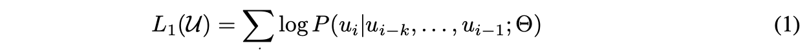
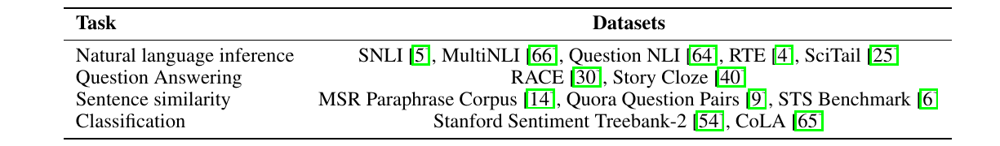

# Improving Language Understanding by Generative Pre-Training

>Alec Radford   OpenAI   alec@openai.com
>
>Karthik Narasimhan   OpenAI   karthikn@openai.com
>
>Tim Salimans   OpenAI    tim@openai.com
>
>Ilya Sutskever   OpenAI    ilyasu@openai.com

## 摘要

>## Abstract

自然语言理解包括范围广泛的不同任务，例如文本蕴含、问题回答、语义相似性评估和文档分类。尽管大量未标记的文本语料库很丰富，但用于学习这些特定任务的标记数据却很少，这使得经过判别训练的模型充分发挥作用具有挑战性。我们证明，通过在各种未标记文本语料库上对语言模型进行生成式预训练，然后对每个特定任务进行判别 fine-tuning，可以实现这些任务的巨大收益。与以前的方法相比，我们在 fine-tuning 期间使用任务感知输入转换来实现有效迁移，同时需要对模型架构进行最少的更改。我们证明了我们的方法在广泛的自然语言理解基准上的有效性。我们的通用任务不可知模型优于使用为每项任务专门设计的架构的判别式训练模型，显着改进了所研究的 12 项任务中的 9 项的最新技术水平。例如，我们在常识推理（Stories Cloze Test）、问题回答（RACE）和文本蕴含（MultiNLI）方面实现了 8.9% 的绝对改进，以及 1.5% 的绝对改进。

>Natural language understanding comprises a wide range of diverse tasks such as textual entailment, question answering, semantic similarity assessment, and document classification. Although large unlabeled text corpora are abundant, labeled data for learning these specific tasks is scarce, making it challenging for discriminatively trained models to perform adequately. We demonstrate that large gains on these tasks can be realized by generative pre-training of a language model on a diverse corpus of unlabeled text, followed by discriminative fine-tuning on each specific task. In contrast to previous approaches, we make use of task-aware input transformations during fine-tuning to achieve effective transfer while requiring minimal changes to the model architecture. We demonstrate the effectiveness of our approach on a wide range of benchmarks for natural language understanding. Our general task-agnostic model outperforms discriminatively trained models that use architectures specifically crafted for each task, significantly improving upon the state of the art in 9 out of the 12 tasks studied. For instance, we achieve absolute improvements of 8.9% on commonsense reasoning (Stories Cloze Test), 5.7% on question answering (RACE), and 1.5% on textual entailment (MultiNLI).

## 1 简介

>## 1 Introduction

从原始文本中有效学习的能力对于减轻自然语言处理 (NLP) 中对监督学习的依赖至关重要。大多数深度学习方法需要大量手动标记的数据，这限制了它们在许多缺乏注释资源的领域中的适用性 [61]。在这些情况下，可以利用未标记数据中的语言信息的模型提供了一种有价值的替代方法来收集更多的注释，而收集注释可能既耗时又昂贵。此外，即使在有大量监督的情况下，以无监督方式学习良好的表示也可以显着提高性能。迄今为止，最令人信服的证据是广泛使用预训练word embeddings [10、39、42] 来提高一系列 NLP 任务的性能 [8、11、26、45]。

>The ability to learn effectively from raw text is crucial to alleviating the dependence on supervised learning in natural language processing (NLP). Most deep learning methods require substantial amounts of manually labeled data, which restricts their applicability in many domains that suffer from a dearth of annotated resources [61]. In these situations, models that can leverage linguistic information from unlabeled data provide a valuable alternative to gathering more annotation, which can be time-consuming and expensive. Further, even in cases where considerable supervision is available, learning good representations in an unsupervised fashion can provide a significant performance boost. The most compelling evidence for this so far has been the extensive use of pre- trained word embeddings [10, 39, 42] to improve performance on a range of NLP tasks [8, 11, 26, 45].

然而，由于两个主要原因，利用来自未标记文本的超过单词级别的信息具有挑战性。首先，尚不清楚哪种类型的优化目标在学习对迁移有用的文本表示方面最有效。最近的研究着眼于各种目标，例如语言建模 [44]、机器翻译 [38] 和语篇连贯 [22]，每种方法在不同任务上都优于其他方法。 其次，对于最有效的方法还没有达成共识将这些学习到的表示转移到目标任务。现有技术包括对模型架构 [43、44] 进行特定于任务的更改、使用复杂的学习方案 [21] 和添加辅助学习目标 [50]。这些不确定性使得开发有效的语言处理半监督学习方法变得困难。

> Leveraging more than word-level information from unlabeled text, however, is challenging for two main reasons. First, it is unclear what type of optimization objectives are most effective at learning text representations that are useful for transfer. Recent research has looked at various objectives such as language modeling [44], machine translation [38], and discourse coherence [22], with each method outperforming the others on different tasks.1 Second, there is no consensus on the most effective way to transfer these learned representations to the target task. Existing techniques involve a combination of making task-specific changes to the model architecture [43, 44], using intricate learning schemes [21] and adding auxiliary learning objectives [50]. These uncertainties have made it difficult to develop effective semi-supervised learning approaches for language processing.

在本文中，我们结合无监督预训练和监督 fine-tuning 探索了一种用于语言理解任务的半监督方法。我们的目标是学习一种通用表示，这种表示几乎不需要适应各种任务。我们假设可以访问大量未标记文本和几个带有手动注释训练样本（目标任务）的数据集。我们的设置不要求这些目标任务与未标记的语料库位于同一域中。我们采用两阶段训练流程。首先，我们在未标记数据上使用语言建模目标来学习神经网络模型的初始参数。随后，我们使用相应的监督目标使这些参数适应目标任务。

>In this paper, we explore a semi-supervised approach for language understanding tasks using a combination of unsupervised pre-training and supervised fine-tuning. Our goal is to learn a universal representation that transfers with little adaptation to a wide range of tasks. We assume access to a large corpus of unlabeled text and several datasets with manually annotated training examples (target tasks). Our setup does not require these target tasks to be in the same domain as the unlabeled corpus. We employ a two-stage training procedure. First, we use a language modeling objective on the unlabeled data to learn the initial parameters of a neural network model. Subsequently, we adapt these parameters to a target task using the corresponding supervised objective.

对于我们的模型架构，我们使用 Transformer [62]，它已被证明在机器翻译 [62]、文档生成 [34] 和句法解析 [29] 等各种任务中表现出色。与循环网络等替代方案相比，这种模型选择为我们提供了更结构化的记忆来处理文本中的长期依赖关系，从而在不同任务中产生稳健的迁移性能。在迁移过程中，我们利用源自遍历式方法 [52] 的特定于任务的输入自适应，它将结构化文本输入处理为 tokens 的单个连续序列。正如我们在实验中所展示的那样，这些调整使我们能够对通过预训练模型的架构进行最小的更改进行有效地 fine-tune 。

>For our model architecture, we use the Transformer [62], which has been shown to perform strongly on various tasks such as machine translation [62], document generation [34], and syntactic parsing [29]. This model choice provides us with a more structured memory for handling long-term dependencies in text, compared to alternatives like recurrent networks, resulting in robust transfer performance across diverse tasks. During transfer, we utilize task-specific input adaptations derived from traversal-style approaches [52], which process structured text input as a single contiguous sequence of tokens. As we demonstrate in our experiments, these adaptations enable us to fine-tune effectively with minimal changes to the architecture of the pre-trained model.

我们在四种类型的语言理解任务上评估了我们的方法——自然语言推理、问答、语义相似性和文本分类。我们的通用任务不可知模型优于采用为每项任务专门设计的架构的判别式训练模型，显着改进了所研究的 12 项任务中的 9 项的最新技术水平。例如，我们在常识推理（Stories Cloze Test）[40]、问题回答（RACE）[30]、文本蕴含（MultiNLI）[66] 和 5.5% 方面实现了 8.9% 的绝对改进。最近介绍了 GLUE 多任务基准 [64]。我们还分析了预训练模型在四种不同设置下的 zero-shot 行为，并证明它获得了对下游任务有用的语言知识。

>We evaluate our approach on four types of language understanding tasks – natural language inference, question answering, semantic similarity, and text classification. Our general task-agnostic model outperforms discriminatively trained models that employ architectures specifically crafted for each task, significantly improving upon the state of the art in 9 out of the 12 tasks studied. For instance, we achieve absolute improvements of 8.9% on commonsense reasoning (Stories Cloze Test) [40], 5.7% on question answering (RACE) [30], 1.5% on textual entailment (MultiNLI) [66] and 5.5% on the recently introduced GLUE multi-task benchmark [64]. We also analyzed zero-shot behaviors of the pre-trained model on four different settings and demonstrate that it acquires useful linguistic knowledge for downstream tasks.

## 2 相关工作

>## 2 Related Work

**NLP 的半监督学习**我们的工作大致属于自然语言的半监督学习类别。这种范式引起了人们的极大兴趣，应用于序列标记 [24、33、57] 或文本分类 [41、70] 等任务。最早的方法使用未标记的数据来计算单词级别或短语级别的统计信息，然后将其用作监督模型中的特征 [33]。在过去的几年中，研究人员已经证明了使用word embeddings [11、39、42] 的好处，这些词是在未标记的语料库上训练的，可以提高各种任务的性能 [8、11、26、45]。然而，这些方法主要传递单词级别的信息，而我们的目标是捕获更高级别的语义。

>Semi-supervised learning for NLP Our work broadly falls under the category of semi-supervised learning for natural language. This paradigm has attracted significant interest, with applications to tasks like sequence labeling [24, 33, 57] or text classification [41, 70]. The earliest approaches used unlabeled data to compute word-level or phrase-level statistics, which were then used as features in a supervised model [33]. Over the last few years, researchers have demonstrated the benefits of using word embeddings [11, 39, 42], which are trained on unlabeled corpora, to improve performance on a variety of tasks [8, 11, 26, 45]. These approaches, however, mainly transfer word-level information, whereas we aim to capture higher-level semantics.

最近的方法研究了从未标记的数据中学习和利用超过单词级的语义。短语级或句子级 embeddings 可以使用未标记的语料库进行训练，已用于将文本编码为适合各种目标任务的向量表示 [28, 32, 1, 36, 22, 12, 56, 31].

>Recent approaches have investigated learning and utilizing more than word-level semantics from unlabeled data. Phrase-level or sentence-level embeddings, which can be trained using an unlabeled corpus, have been used to encode text into suitable vector representations for various target tasks [28, 32, 1, 36, 22, 12, 56, 31].

**无监督预训练** 无监督预训练是半监督学习的一种特殊情况，其目标是找到一个好的初始化点而不是修改监督学习目标。早期的工作探索了该技术在图像分类 [20、49、63] 和回归任务 [3] 中的应用。随后的研究 [15] 表明，预训练作为一种正则化方案，可以在深度神经网络中实现更好的泛化。在最近的工作中，该方法已被用于帮助训练深度神经网络执行各种任务，如图像分类 [69]、语音识别 [68]、实体消歧 [17] 和机器翻译 [48]。

>Unsupervised pre-training Unsupervised pre-training is a special case of semi-supervised learning where the goal is to find a good initialization point instead of modifying the supervised learning objective. Early works explored the use of the technique in image classification [20, 49, 63] and regression tasks [3]. Subsequent research [15] demonstrated that pre-training acts as a regularization scheme, enabling better generalization in deep neural networks. In recent work, the method has been used to help train deep neural networks on various tasks like image classification [69], speech recognition [68], entity disambiguation [17] and machine translation [48].

与我们最接近的工作涉及使用语言建模目标对神经网络进行预训练，然后在监督下将其 fine-tuning 用于目标任务。Dai等[13] 以及 Howard 和 Ruder [21] 遵循这种方法来改进文本分类。然而，尽管预训练阶段有助于捕获一些语言信息，但他们对 LSTM 模型的使用将他们的预测能力限制在一个小范围内。相比之下，我们对 transformer 网络的选择使我们能够捕捉更远距离的语言结构，正如我们的实验所证明的那样。此外，我们还展示了我们的模型在更广泛的任务中的有效性，包括自然语言推理、释义检测和故事完成。其他方法 [43、44、38] 使用来自预训练语言或机器翻译模型的隐藏表示作为辅助特征，同时在目标任务上训练监督模型。这涉及每个单独的目标任务的大量新参数，而我们需要在迁移过程中对模型架构进行最少的更改。

>The closest line of work to ours involves pre-training a neural network using a language modeling objective and then fine-tuning it on a target task with supervision. Dai et al. [13] and Howard and Ruder [21] follow this method to improve text classification. However, although the pre-training phase helps capture some linguistic information, their usage of LSTM models restricts their prediction ability to a short range. In contrast, our choice of transformer networks allows us to capture longer- range linguistic structure, as demonstrated in our experiments. Further, we also demonstrate the effectiveness of our model on a wider range of tasks including natural language inference, paraphrase detection and story completion. Other approaches [43, 44, 38] use hidden representations from a pre-trained language or machine translation model as auxiliary features while training a supervised model on the target task. This involves a substantial amount of new parameters for each separate target task, whereas we require minimal changes to our model architecture during transfer.

**辅助训练目标** 添加辅助无监督训练目标是半监督学习的另一种形式。 Collobert 和 Weston [10] 的早期工作使用了各种各样的辅助 NLP 任务，例如 POS 标记、分块、命名实体识别和语言建模来改进语义角色标记。最近，Rei [50] 在他们的目标任务目标中添加了一个辅助语言建模目标，并展示了在序列标记任务上的性能提升。我们的实验还使用了一个辅助目标，但正如我们所展示的，无监督预训练已经学习了与目标任务相关的几个语言方面。

>Auxiliary training objectives Adding auxiliary unsupervised training objectives is an alternative form of semi-supervised learning. Early work by Collobert and Weston [10] used a wide variety of auxiliary NLP tasks such as POS tagging, chunking, named entity recognition, and language modeling to improve semantic role labeling. More recently, Rei [50] added an auxiliary language modeling objective to their target task objective and demonstrated performance gains on sequence labeling tasks. Our experiments also use an auxiliary objective, but as we show, unsupervised pre-training already learns several linguistic aspects relevant to target tasks.

## 3 框架

>## 3 Framework

我们的训练过程包括两个阶段。第一阶段是在大量文本语料库上学习高容量语言模型。接下来是 fine-tuning 阶段，在此阶段我们使模型适应带有标记数据的判别任务。

>Our training procedure consists of two stages. The first stage is learning a high-capacity language model on a large corpus of text. This is followed by a fine-tuning stage, where we adapt the model to a discriminative task with labeled data.

### 3.1 无监督预训练

>### 3.1 Unsupervised pre-training

给定 tokens 

，我们使用标准语言建模目标来最大化以下likelihood：

>Given an unsupervised corpus of tokens U = {u1, . . . , un}, we use a standard language modeling objective to maximize the following likelihood:

其中 k 是上下文窗口的大小，条件概率 P 使用参数为 

 的神经网络建模。这些参数使用随机梯度下降 [51] 进行训练。

>where k is the size of the context window, and the conditional probability P is modeled using a neural network with parameters Θ. These parameters are trained using stochastic gradient descent [51].

在我们的实验中，我们为语言模型使用多层 Transformer 解码器 [34]，这是 transformer [62] 的变体。该模型在输入上下文 tokens 上应用多头自注意力操作，然后是位置前馈层，以在目标 tokens 上产生输出分布：

>In our experiments, we use a multi-layer Transformer decoder [34] for the language model, which is a variant of the transformer [62]. This model applies a multi-headed self-attention operation over the input context tokens followed by position-wise feedforward layers to produce an output distribution over target tokens:

其中
)
是token的上下文向量，n是层数，

是token embedding矩阵，

是位置embedding矩阵。

>where U = (u−k, . . . , u−1) is the context vector of tokens, n is the number of layers, We is the token embedding matrix, and Wp is the position embedding matrix.

### 3.2 监督 fine-tuning

>### 3.2 Supervised fine-tuning

在使用等式1中的目标训练模型之后。我们调整参数以适应监督目标任务。我们假设有一个带标签的数据集 

，其中每个实例都由一系列输入 tokens, 

, 以及标签 y组成。输入通过我们预训练的模型来获得最终的 transformer 块的激活 

，然后将其馈送到带有参数 

 的附加线性输出层以预测 y：

>After training the model with the objective in Eq. 1, we adapt the parameters to the supervised target task. We assume a labeled dataset C, where each instance consists of a sequence of input tokens, x1, . . . , xm, along with a label y. The inputs are passed through our pre-trained model to obtain the final transformer block’s activation hml, which is then fed into an added linear output layer with parameters Wy to predict y:

这为我们提供了以下最大化目标：

>This gives us the following objective to maximize:

我们还发现，将语言建模作为 fine-tuning 的辅助目标通过 (a) 改进监督模型的泛化，以及 (b) 加速收敛来帮助学习。这与之前的工作 [50、43] 一致，他们还观察到这种辅助目标的性能有所提高。具体来说，我们优化了以下目标（权重为 λ）：

>We additionally found that including language modeling as an auxiliary objective to the fine-tuning helped learning by (a) improving generalization of the supervised model, and (b) accelerating convergence. This is in line with prior work [50, 43], who also observed improved performance with such an auxiliary objective. Specifically, we optimize the following objective (with weight λ):

总的来说，我们在 fine-tuning 期间唯一需要的额外参数是 

 和用于分隔符 embeddings 的 tokens（在下面的第 3.3 节中描述）。

>Overall, the only extra parameters we require during fine-tuning are Wy, and embeddings for delimiter tokens (described below in Section 3.3).

图 1：（左）Transformer 本工作中使用的架构和训练目标。（右）fine-tuning 在不同任务上的输入转换。我们将所有结构化输入转换为 token 序列以供我们的预训练模型处理，然后是线性+softmax 层。

>Figure 1: (left) Transformer architecture and training objectives used in this work. (right) Input transformations for fine-tuning on different tasks. We convert all structured inputs into token sequences to be processed by our pre-trained model, followed by a linear+softmax layer.

### 3.3 特定于任务的输入转换

>### 3.3 Task-specific input transformations

对于某些任务，如文本分类，我们可以直接 fine-tune 我们的模型，如上所述。某些其他任务，如问题回答或文本蕴含，具有结构化输入，例如有序的句子对，或文档、问题和答案的三元组。由于我们的预训练模型是在连续的文本序列上训练的，因此我们需要进行一些修改才能将其应用于这些任务。以前的工作提出了在迁移表示之上的学习任务特定架构 [44]。这种方法重新引入了大量特定于任务的定制，并且不对这些额外的架构组件使用迁移学习。相反，我们使用遍历式方法 [52]，我们将结构化输入转换为我们的预训练模型可以处理的有序序列。这些输入转换使我们能够避免跨任务对架构进行大量更改。我们在下面提供了这些输入转换的简要描述，图 1 提供了一个直观的说明。 所有转换都包括添加随机初始化的开始和结束tokens (⟨s⟩, ⟨e⟩)。

>For some tasks, like text classification, we can directly fine-tune our model as described above. Certain other tasks, like question answering or textual entailment, have structured inputs such as ordered sentence pairs, or triplets of document, question, and answers. Since our pre-trained model was trained on contiguous sequences of text, we require some modifications to apply it to these tasks. Previous work proposed learning task specific architectures on top of transferred representations [44]. Such an approach re-introduces a significant amount of task-specific customization and does not use transfer learning for these additional architectural components. Instead, we use a traversal-style approach [52], where we convert structured inputs into an ordered sequence that our pre-trained model can process. These input transformations allow us to avoid making extensive changes to the architecture across tasks. We provide a brief description of these input transformations below and Figure 1 provides a visual illustration. All transformations include adding randomly initialized start and end tokens (⟨s⟩, ⟨e⟩).

**文本蕴涵** 对于蕴涵任务，我们 concatenate 建立前提 

 和假设 

 token 序列，中间有一个分隔符 token ($)。

>Textual entailment For entailment tasks, we concatenate the premise p and hypothesis h token sequences, with a delimiter token ($) in between.

**相似性** 对于相似性任务，被比较的两个句子没有固有的顺序。为了反映这一点，我们修改输入序列以包含两种可能的句子顺序（中间有一个分隔符）并独立处理每个以产生两个序列表示

，它们在被馈送到线性输出层之前按元素添加。

>Similarity For similarity tasks, there is no inherent ordering of the two sentences being compared. To reflect this, we modify the input sequence to contain both possible sentence orderings (with a delimiter in between) and process each independently to produce two sequence representations hml which are added element-wise before being fed into the linear output layer.

**问答和常识推理** 对于这些任务，我们得到了一个上下文文档 

、一个问题 

 和一组可能的答案 

。我们concatenate用每个可能的答案输入文档上下文和问题，在它们之间添加一个分隔符token以获得

。这些序列中的每一个都使用我们的模型独立处理，然后通过 softmax 层归一化以产生可能答案的输出分布。

>Question Answering and Commonsense Reasoning For these tasks, we are given a context document z, a question q, and a set of possible answers {ak}. We concatenate the document context and question with each possible answer, adding a delimiter token in between to get [z; q; $; ak]. Each of these sequences are processed independently with our model and then normalized via a softmax layer to produce an output distribution over possible answers.

## 4 实验

>## 4 Experiments

### 4.1 设置

>### 4.1 Setup

无监督预训练我们使用 BooksCorpus 数据集 [71] 来训练语言模型。它包含 7,000 多本独特的未出版书籍，这些书籍来自各种类型，包括冒险、奇幻和浪漫。至关重要的是，它包含很长一段连续的文本，这使得生成模型能够学习以长范围信息为条件。另一个数据集 1B Word Benchmark 被类似的方法 ELMo [44] 使用，其大小大致相同，但在句子级别进行了打乱——破坏了长范围结构。 我们的语言模型在这个语料库上达到了 18.4 的非常低的token级别perplexity。

>Unsupervised pre-training We use the BooksCorpus dataset [71] for training the language model. It contains over 7,000 unique unpublished books from a variety of genres including Adventure, Fantasy, and Romance. Crucially, it contains long stretches of contiguous text, which allows the generative model to learn to condition on long-range information. An alternative dataset, the 1B Word Benchmark, which is used by a similar approach, ELMo [44], is approximately the same size but is shuffled at a sentence level - destroying long-range structure. Our language model achieves a very low token level perplexity of 18.4 on this corpus.

表 1：我们实验中使用的不同任务和数据集的列表。

>Table 1: A list of the different tasks and datasets used in our experiments.

**模型规格** 我们的模型在很大程度上遵循原始 transformer 工作 [62]。我们训练了一个 12 层解码器 transformer 和 masked 个自注意力头（768 维状态和 12 个注意力头）。对于位置feed-forward 网络，我们使用了 3072 维内部状态。我们使用 Adam 优化方案 [27]，最大学习率为 2.5e-4。在前 2000 次更新中，学习率从零开始线性增加，并使用余弦 schedule 退火到 0。我们在 512 epochs 的 64 个随机采样的连续序列的 minibatches 上训练 100 tokens。由于 layernorm [2] 在整个模型中被广泛使用，因此 N (0, 0.02) 的简单权重初始化就足够了。我们使用具有 40,000 个合并 [53] 和残差 embedding 的字节对编码 (BPE) 词汇表，以及速率为 0.1 的注意力 dropout 用于正则化。我们还采用了 [37] 中提出的 L2 正则化的修改版本，所有非偏置或增益权重上的 w = 0.01。对于激活函数，我们使用了高斯误差线性单元 (GELU) [18]。我们使用学习位置 embeddings 而不是原始工作中提出的正弦版本。我们使用 ftfy library 清理 BooksCorpus 中的原始文本，标准化一些标点符号和空格，并使用 spaCy tokenizer.

>Model specifications Our model largely follows the original transformer work [62]. We trained a 12-layer decoder-only transformer with masked self-attention heads (768 dimensional states and 12 attention heads). For the position-wise feed-forward networks, we used 3072 dimensional inner states. We used the Adam optimization scheme [27] with a max learning rate of 2.5e-4. The learning rate was increased linearly from zero over the first 2000 updates and annealed to 0 using a cosine schedule. We train for 100 epochs on minibatches of 64 randomly sampled, contiguous sequences of 512 tokens. Since layernorm [2] is used extensively throughout the model, a simple weight initialization of N (0, 0.02) was sufficient. We used a bytepair encoding (BPE) vocabulary with 40,000 merges [53] and residual, embedding, and attention dropouts with a rate of 0.1 for regularization. We also employed a modified version of L2 regularization proposed in [37], with w = 0.01 on all non bias or gain weights. For the activation function, we used the Gaussian Error Linear Unit (GELU) [18]. We used learned position embeddings instead of the sinusoidal version proposed in the original work. We use the ftfy library2 to clean the raw text in BooksCorpus, standardize some punctuation and whitespace, and use the spaCy tokenizer.3

**Fine-tuning细节** 除非特别说明，否则我们重复使用无监督预训练的超参数设置。我们以 0.1 的比率将 dropout 添加到分类器中。对于大多数任务，我们使用 6.25e-5 的学习率和 32 的 batch 大小。我们的模型快速finetune，3个 epochs 的训练对于大多数情况来说就足够了。我们使用线性学习率衰减 schedule，warmup 超过 0.2% ，进行训练。 λ 设置为 0.5。

>Fine-tuning details Unless specified, we reuse the hyperparameter settings from unsupervised pre-training. We add dropout to the classifier with a rate of 0.1. For most tasks, we use a learning rate of 6.25e-5 and a batchsize of 32. Our model finetunes quickly and 3 epochs of training was sufficient for most cases. We use a linear learning rate decay schedule with warmup over 0.2% of training. λ was set to 0.5.

### 4.2 监督 fine-tuning

>### 4.2 Supervised fine-tuning

我们对各种监督任务进行实验，包括自然语言推理、问答、语义相似性和文本分类。其中一些任务可作为我们最近发布的 GLUE 多任务基准测试 [64] 的一部分使用。图 1 提供了所有任务和数据集的概览。

>We perform experiments on a variety of supervised tasks including natural language inference, question answering, semantic similarity, and text classification. Some of these tasks are available as part of the recently released GLUE multi-task benchmark [64], which we make use of. Figure 1 provides an overview of all the tasks and datasets.

**自然语言推理** 自然语言推理（NLI）的任务，也称为识别文本蕴含，涉及阅读一对句子，并从蕴含、矛盾或中性中判断它们之间的关系。尽管最近有很多兴趣[58、35、44]，但由于存在各种各样的现象，如词汇蕴涵、共指以及词汇和句法歧义，这项任务仍然具有挑战性。我们评估了五个不同来源的数据集，包括图像说明 (SNLI)、转录语音、通俗小说和政府报告 (MNLI)、维基百科文章 (QNLI)、科学考试 (SciTail) 或新闻文章 (RTE)。

>Natural Language Inference The task of natural language inference (NLI), also known as recog- nizing textual entailment, involves reading a pair of sentences and judging the relationship between them from one of entailment, contradiction or neutral. Although there has been a lot of recent interest [58, 35, 44], the task remains challenging due to the presence of a wide variety of phenomena like lexical entailment, coreference, and lexical and syntactic ambiguity. We evaluate on five datasets with diverse sources, including image captions (SNLI), transcribed speech, popular fiction, and government reports (MNLI), Wikipedia articles (QNLI), science exams (SciTail) or news articles (RTE).

表 2 详细列出了我们的模型和以前最先进的方法在不同 NLI 任务上的各种结果。我们的方法在五个数据集中的四个上明显优于baseline，与之前的最佳结果相比，MNLI 的绝对改进高达 1.5%，SciTail 的绝对改进高达 5%，QNLI 的绝对改进高达 5.8%，SNLI 的绝对改进高达 0.6%。这表明我们的模型能够更好地推理多个句子，并处理语言歧义的各个方面。在 RTE 上，我们评估的较小数据集之一（2490 个样本），我们达到了 56% 的准确率，低于多任务 biLSTM 模型报告的 61.7%。鉴于我们的方法在更大的 NLI 数据集上的强大性能，我们的模型很可能也会从多任务训练中受益，但我们目前尚未对此进行探索。

>Table 2 details various results on the different NLI tasks for our model and previous state-of-the-art approaches. Our method significantly outperforms the baselines on four of the five datasets, achieving absolute improvements of upto 1.5% on MNLI, 5% on SciTail, 5.8% on QNLI and 0.6% on SNLI over the previous best results. This demonstrates our model’s ability to better reason over multiple sentences, and handle aspects of linguistic ambiguity. On RTE, one of the smaller datasets we evaluate on (2490 examples), we achieve an accuracy of 56%, which is below the 61.7% reported by a multi-task biLSTM model. Given the strong performance of our approach on larger NLI datasets, it is likely our model will benefit from multi-task training as well but we have not explored this currently.

表 2：自然语言推理任务的实验结果，将我们的模型与当前最先进的方法进行比较。 5x 表示 ensemble 的 5 个模型。所有数据集都使用准确性作为评估指标。

>Table 2: Experimental results on natural language inference tasks, comparing our model with current state-of-the-art methods. 5x indicates an ensemble of 5 models. All datasets use accuracy as the evaluation metric.

表 3：问答和常识推理的结果，将我们的模型与当前最先进的方法进行比较。9x 表示 ensemble 9 个模型。

>Table 3: Results on question answering and commonsense reasoning, comparing our model with current state-of-the-art methods.. 9x means an ensemble of 9 models.

**问答和常识推理** 另一个需要单句和多句推理的任务是问答。我们使用最近发布的 RACE 数据集 [30]，该数据集由英语段落和中学和高中考试的相关问题组成。该语料库已被证明包含比 CNN [19] 或 SQuaD [47] 等其他数据集更多的推理类型问题，为我们的模型提供了完美的评估，该模型经过训练可以处理长范围上下文。此外，我们还对故事完形填空测试 [40] 进行了评估，该测试涉及从两个选项中选择多句故事的正确结尾。在这些任务上，我们的模型再次以显着的优势超越了之前的最佳结果——在 Story Cloze 上高达 8.9%，在 RACE 上总体上高达 5.7%。这证明了我们的模型有效处理长范围上下文的能力。

>Question answering and commonsense reasoning Another task that requires aspects of single and multi-sentence reasoning is question answering. We use the recently released RACE dataset [30], consisting of English passages with associated questions from middle and high school exams. This corpus has been shown to contain more reasoning type questions that other datasets like CNN [19] or SQuaD [47], providing the perfect evaluation for our model which is trained to handle long-range contexts. In addition, we evaluate on the Story Cloze Test [40], which involves selecting the correct ending to multi-sentence stories from two options. On these tasks, our model again outperforms the previous best results by significant margins - up to 8.9% on Story Cloze, and 5.7% overall on RACE. This demonstrates the ability of our model to handle long-range contexts effectively.

**语义相似性** 语义相似性（或释义检测）任务涉及预测两个句子在语义上是否等价。挑战在于识别概念的改写、理解否定和处理句法歧义。我们为此任务使用了三个数据集——Microsoft Paraphrase语料库 (MRPC) [14]（从新闻来源收集）、Quora Question Pairs (QQP) 数据集 [9] 和Semantic Textual Similarity benchmark (STS-B) [6 ].我们在三个语义相似性任务（表 4）中的两个上获得了最先进的结果，在 STS-B 上获得了 1 分的绝对增益。 QQP 的性能增量非常显着，与单任务 BiLSTM + ELMo + Attn 相比绝对提高了 4.2%。

>Semantic Similarity Semantic similarity (or paraphrase detection) tasks involve predicting whether two sentences are semantically equivalent or not. The challenges lie in recognizing rephrasing of concepts, understanding negation, and handling syntactic ambiguity. We use three datasets for this task – the Microsoft Paraphrase corpus (MRPC) [14] (collected from news sources), the Quora Question Pairs (QQP) dataset [9], and the Semantic Textual Similarity benchmark (STS-B) [6]. We obtain state-of-the-art results on two of the three semantic similarity tasks (Table 4) with a 1 point absolute gain on STS-B. The performance delta on QQP is significant, with a 4.2% absolute improvement over Single-task BiLSTM + ELMo + Attn.

**分类** 最后，我们还评估了两个不同的文本分类任务。The Corpus of Linguistic Acceptability (CoLA) [65] 包含对句子是否符合语法的专业判断，并测试训练模型的先天语言偏差。另一方面，The Stanford Sentiment Treebank(SST-2) [54] 是标准的二元分类任务。我们的模型在 CoLA 上获得了 45.4 分，这比之前的最佳成绩 35.0 有了很大的飞跃，展示了我们的模型学习到的先天语言偏见。该模型还在 SST-2 上达到了 91.3% 的准确率，这与最先进的结果具有竞争力。我们还在 GLUE 基准测试中获得了 72.8 的总分，这明显优于之前的最佳成绩 68.9。

>Classification Finally, we also evaluate on two different text classification tasks. The Corpus of Linguistic Acceptability (CoLA) [65] contains expert judgements on whether a sentence is grammatical or not, and tests the innate linguistic bias of trained models. The Stanford Sentiment Treebank (SST-2) [54], on the other hand, is a standard binary classification task. Our model obtains an score of 45.4 on CoLA, which is an especially big jump over the previous best result of 35.0, showcasing the innate linguistic bias learned by our model. The model also achieves 91.3% accuracy on SST-2, which is competitive with the state-of-the-art results. We also achieve an overall score of 72.8 on the GLUE benchmark, which is significantly better than the previous best of 68.9.

表 4：语义相似性和分类结果，将我们的模型与当前最先进的方法进行比较。此表中的所有任务评估都是使用 GLUE 基准完成的（mc=Mathews相关系数，acc=准确度，pc=Pearson相关系数）

>Table 4: Semantic similarity and classification results, comparing our model with current state-of-the- art methods. All task evaluations in this table were done using the GLUE benchmark. (mc= Mathews correlation, acc=Accuracy, pc=Pearson correlation)

总的来说，我们的方法在我们评估的 12 个数据集中的 9 个中取得了新的最先进的结果，在许多情况下优于 ensembles。我们的结果还表明，我们的方法适用于不同大小的数据集，从较小的数据集（例如 STS-B（≈5.7k 训练样本））到最大的数据集 – SNLI（≈550k 训练样本）。

>Overall, our approach achieves new state-of-the-art results in 9 out of the 12 datasets we evaluate on, outperforming ensembles in many cases. Our results also indicate that our approach works well across datasets of different sizes, from smaller datasets such as STS-B (≈5.7k training examples) – to the largest one – SNLI (≈550k training examples).

## 5 分析

>## 5 Analysis

**迁层数的影响** 我们观察了从无监督预训练迁移到监督目标任务中，迁移训练的层数的影响。图 2（左）说明了我们的方法在 MultiNLI 和 RACE 上的性能与迁移层数的关系。我们观察到标准结果，即迁移 embeddings 提高了性能，并且每个 transformer 层为 MultiNLI 上的完全迁移提供了高达 9% 的进一步收益。这表明预训练模型中的每一层都包含用于解决目标任务的有用功能。

>Impact of number of layers transferred We observed the impact of transferring a variable number of layers from unsupervised pre-training to the supervised target task. Figure 2(left) illustrates the performance of our approach on MultiNLI and RACE as a function of the number of layers transferred. We observe the standard result that transferring embeddings improves performance and that each transformer layer provides further benefits up to 9% for full transfer on MultiNLI. This indicates that each layer in the pre-trained model contains useful functionality for solving target tasks.

图 2：（左）从 RACE 和 MultiNLI 上的预训练语言模型迁移更多层的效果。（右）绘图显示 zero-shot 在不同任务上的性能随 LM 预训练更新的变化。每个任务的性能在随机猜测baseline和单个模型的当前最先进技术之间范围内进行标准化。

>Figure 2: (left) Effect of transferring increasing number of layers from the pre-trained language model on RACE and MultiNLI. (right) Plot showing the evolution of zero-shot performance on different tasks as a function of LM pre-training updates. Performance per task is normalized between a random guess baseline and the current state-of-the-art with a single model.

表 5：对不同任务的各种模型消融分析。Avg.  score 是所有结果的未加权平均值（mc=Mathews相关系数，acc=准确度，pc=Pearson相关系数）

>Table 5: Analysis of various model ablations on different tasks. Avg. score is a unweighted average of all the results. (mc= Mathews correlation, acc=Accuracy, pc=Pearson correlation)

**Zero-shot行为** 我们想更好地理解为什么语言模型预训练transformer是有效的。一个假设是，底层生成模型学习执行我们评估的许多任务，以提高其语言建模能力，并且与 LSTM 相比，更结构化的transformer 的注意力记忆有助于迁移。我们设计了一系列启发式解决方案，这些解决方案使用底层生成模型在没有监督finetuning的情况下执行任务。我们在图 2（右）的生成预训练过程中可视化了这些启发式解决方案的有效性。我们观察到这些启发式方法的性能是稳定的，并且在训练过程中稳步增加，这表明生成预训练支持学习各种任务相关功能。我们还观察到 LSTM 在其 zero-shot 性能中表现出更高的差异，这表明 Transformer 架构的归纳偏置有助于迁移。

>Zero-shot Behaviors We’d like to better understand why language model pre-training of transform- ers is effective. A hypothesis is that the underlying generative model learns to perform many of the tasks we evaluate on in order to improve its language modeling capability and that the more structured  attentional memory of the transformer assists in transfer compared to LSTMs. We designed a series of heuristic solutions that use the underlying generative model to perform tasks without supervised finetuning. We visualize the effectiveness of these heuristic solutions over the course of generative pre-training in Fig 2(right). We observe the performance of these heuristics is stable and steadily increases over training suggesting that generative pretraining supports the learning of a wide variety of task relevant functionality. We also observe the LSTM exhibits higher variance in its zero-shot performance suggesting that the inductive bias of the Transformer architecture assists in transfer.

对于 CoLA（语言可接受性），样本评分为生成模型分配的平均 token 对数概率，并通过阈值进行预测。对于 SST-2（情感分析），我们将 token 非常附加到每个样本，并将语言模型的输出分布限制为仅正面和负面单词，并猜测它分配更高概率的 token 作为预测。对于 RACE（问答），我们选择生成模型在以文档和问题为条件时分配最高平均 token 对数概率的答案。对于 DPRD [46]（winograd schemas），我们用两个可能的指代词替换定代词，并预测生成模型在替换后为序列的其余部分分配更高平均 token 对数概率的分辨率。

>For CoLA (linguistic acceptability), examples are scored as the average token log-probability the generative model assigns and predictions are made by thresholding. For SST-2 (sentiment analysis), we append the token very to each example and restrict the language model’s output distribution to only the words positive and negative and guess the token it assigns higher probability to as the prediction. For RACE (question answering), we pick the answer the generative model assigns the highest average token log-probability when conditioned on the document and question. For DPRD [46] (winograd schemas), we replace the definite pronoun with the two possible referrents and predict the resolution that the generative model assigns higher average token log-probability to the rest of the sequence after the substitution.

**消融研究** 我们进行了三种不同的消融研究（表 5）。首先，我们在 fine-tuning 期间检查了我们的方法在没有辅助 LM 目标的情况下的性能。我们观察到辅助目标有助于 NLI 任务和 QQP。总的来说，趋势表明较大的数据集受益于辅助目标，但较小的数据集则没有。其次，我们通过将其与使用相同框架的单层 2048 单元 LSTM 进行比较来分析 Transformer 的效果。当使用 LSTM 而不是 Transformer 时，我们观察到平均分数下降了 5.6。 LSTM 仅在一个数据集——MRPC 上优于 Transformer。最后，我们还与直接在监督目标任务上训练的 transformer 架构进行了比较，无需预训练。我们观察到，缺乏预训练会影响所有任务的性能，与我们的完整模型相比，性能下降了 14.8%。

>Ablation studies We perform three different ablation studies (Table 5). First, we examine the performance of our method without the auxiliary LM objective during fine-tuning. We observe that the auxiliary objective helps on the NLI tasks and QQP. Overall, the trend suggests that larger datasets benefit from the auxiliary objective but smaller datasets do not. Second, we analyze the effect of the Transformer by comparing it with a single layer 2048 unit LSTM using the same framework. We observe a 5.6 average score drop when using the LSTM instead of the Transformer. The LSTM only outperforms the Transformer on one dataset – MRPC. Finally, we also compare with our transformer architecture directly trained on supervised target tasks, without pre-training. We observe that the lack of pre-training hurts performance across all the tasks, resulting in a 14.8% decrease compared to our full model.

## 6 结论

>## 6 Conclusion

我们引入了一个框架，用于通过生成预训练和判别 fine-tuning 使用单一任务不可知模型实现强大的自然语言理解。通过对具有长段连续文本的多样化语料库进行预训练，我们的模型获得了重要的世界知识和处理长范围依赖关系的能力，然后成功地转移到解决判别任务，如问题回答、语义相似性评估、蕴含确定和文本分类，改进了我们研究的 12 个数据集中的 9 个的最新技术水平。使用无监督（预）训练来提高判别任务的性能一直是机器学习研究的一个重要目标。我们的工作表明，实现显着的性能提升确实是可能的，并提供了关于哪种模型 (Transformers) 和数据集（具有长范围依赖性的文本）最适合这种方法的提示。我们希望这将有助于对自然语言理解和其他领域的无监督学习进行新的研究，进一步提高我们对无监督学习如何以及何时工作的理解。

>We introduced a framework for achieving strong natural language understanding with a single task-agnostic model through generative pre-training and discriminative fine-tuning. By pre-training on a diverse corpus with long stretches of contiguous text our model acquires significant world knowledge and ability to process long-range dependencies which are then successfully transferred to solving discriminative tasks such as question answering, semantic similarity assessment, entailment determination, and text classification, improving the state of the art on 9 of the 12 datasets we study. Using unsupervised (pre-)training to boost performance on discriminative tasks has long been an important goal of Machine Learning research. Our work suggests that achieving significant performance gains is indeed possible, and offers hints as to what models (Transformers) and data sets (text with long range dependencies) work best with this approach. We hope that this will help enable new research into unsupervised learning, for both natural language understanding and other domains, further improving our understanding of how and when unsupervised learning works.

