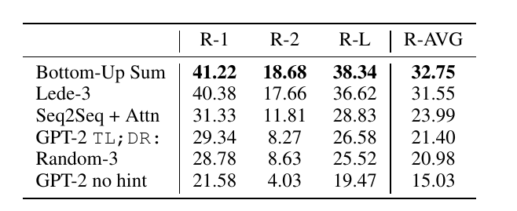
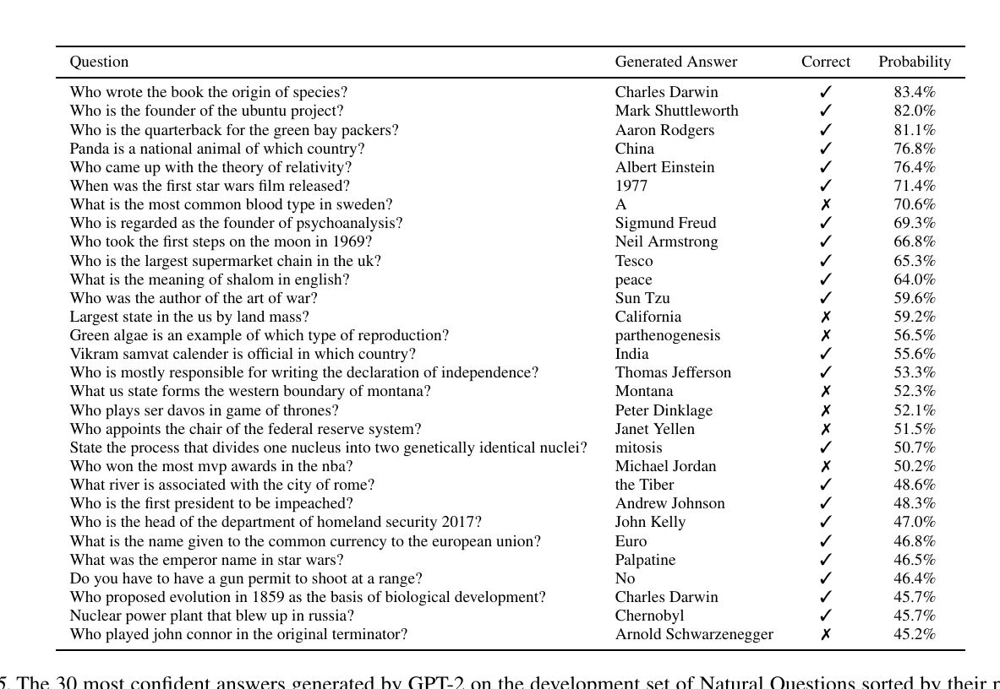

# Language Models are Unsupervised Multitask Learners

>Alec Radford    Jeffrey Wu   Rewon Child     David Luan    Dario Amodei    Ilya Sutskever

## 摘要

>## Abstract

自然语言处理任务，例如问答、机器翻译、阅读理解和摘要，通常通过对任务特定数据集的监督学习来处理。我们证明，当在一个名为 WebText 的数百万网页的新数据集上训练时，语言模型在没有任何明确监督的情况下开始学习这些任务。当以文档加问题为条件时，语言模型生成的答案在 CoQA 数据集上达到 55 F1 - 达到或超过 4 个baseline系统中的 3 个的表现，而无需使用 127,000 多个训练样本。语言模型的容量对于 zero-shot 任务迁移的成功至关重要，并且增加它可以跨任务以对数线性方式提高性能。我们最大的模型 GPT-2 是一个 1.5B 参数的Transformer，它在 zero-shot 设置中的 8 个测试语言建模数据集中的 7 个上取得了最先进的结果，但仍然没有达到WebText的要求。该模型的样本反映了这些改进，并包含共同的文本段落。这些发现为建立语言处理系统提供了一条有希望的道路，该系统可以从自然发生的演示中学习执行任务。

>Natural language processing tasks, such as ques- tion answering, machine translation, reading com- prehension, and summarization, are typically approached with supervised learning on task- specific datasets. We demonstrate that language models begin to learn these tasks without any ex- plicit supervision when trained on a new dataset of millions of webpages called WebText. When conditioned on a document plus questions, the an- swers generated by the language model reach 55 F1 on the CoQA dataset - matching or exceeding the performance of 3 out of 4 baseline systems without using the 127,000+ training examples. The capacity of the language model is essential to the success of zero-shot task transfer and in- creasing it improves performance in a log-linear fashion across tasks. Our largest model, GPT-2, is a 1.5B parameter Transformer that achieves state of the art results on 7 out of 8 tested lan- guage modeling datasets in a zero-shot setting but still underfits WebText. Samples from the model reflect these improvements and contain co- herent paragraphs of text. These findings suggest a promising path towards building language pro- cessing systems which learn to perform tasks from their naturally occurring demonstrations.

## 1.简介

>## 1. Introduction

机器学习系统现在通过结合使用大型数据集、高容量模型和监督学习（Krizhevsky et al., 2012）（Sutskever et al., 2014）（Amodei et等人，2016 年）。然而，这些系统脆弱且对数据分布 (Recht et al., 2018) 和任务规范 (Kirkpatrick et al., 2017) 的微小变化敏感。目前的系统被更好地描述为狭隘的专家而不是称职的多面手。我们希望转向可以执行许多任务的更通用的系统——最终不需要为每个任务手动创建和标记训练数据集。

>Machine learning systems now excel (in expectation) at tasks they are trained for by using a combination of large datasets, high-capacity models, and supervised learning (Krizhevsky et al., 2012) (Sutskever et al., 2014) (Amodei et al., 2016). Yet these systems are brittle and sensitive to slight changes in the data distribution (Recht et al., 2018) and task specification (Kirkpatrick et al., 2017). Current sys- tems are better characterized as narrow experts rather than competent generalists. We would like to move towards more general systems which can perform many tasks – eventually without the need to manually create and label a training dataset for each one.

创建 ML 系统的主要方法是收集训练样本的数据集，这些样本展示了所需任务的正确行为，训练系统模仿这些行为，然后测试其在独立同分布 (IID) 保留样本上的性能。这对在狭义专家上取得进展起到了很好的作用。但是，captioning模型（Lake 等人，2017 年）、阅读理解系统（Jia & Liang，2017 年）和图像分类器（Alcorn 等人，2018 年）在可能输入的多样性和多样性方面经常出现不稳定的行为，这突出了一些这种方法的缺点。

>The dominant approach to creating ML systems is to col- lect a dataset of training examples demonstrating correct behavior for a desired task, train a system to imitate these behaviors, and then test its performance on independent and identically distributed (IID) held-out examples. This has served well to make progress on narrow experts. But the often erratic behavior of captioning models (Lake et al., 2017), reading comprehension systems (Jia & Liang, 2017), and image classifiers (Alcorn et al., 2018) on the diversity and variety of possible inputs highlights some of the short- comings of this approach.

我们怀疑单域数据集上单任务训练的普遍存在是导致当前系统中观察到的泛化能力不足的主要原因。使用当前架构向健壮的系统迈进可能需要在广泛的领域和任务上进行训练和测量性能。最近，已经提出了几个基准，例如 GLUE (Wang et al., 2018) 和 decaNLP (McCann et al., 2018) 开始研究这一点。

>Our suspicion is that the prevalence of single task training on single domain datasets is a major contributor to the lack of generalization observed in current systems. Progress towards robust systems with current architectures is likely to require training and measuring performance on a wide range of domains and tasks. Recently, several benchmarks have been proposed such as GLUE (Wang et al., 2018) and decaNLP (McCann et al., 2018) to begin studying this.

多任务学习 (Caruana, 1997) 是一个很有前途的框架，可以提高整体表现。然而，NLP 中的多任务训练仍处于初期阶段。最近的工作报告了适度的性能改进（Yogatama 等人，2019），迄今为止大的两项工作分别训练了 10 对和 17 对（数据集，目标）（McCann 等人，2018）（Bowman等人，2018 年）。从元学习的角度来看，每个（数据集、目标）对都是从数据集和目标的分布中采样的单个训练样本。当前的 ML 系统需要成百上千个样本来归纳出泛化良好的函数。这表明，多任务训练需要尽可能多的有效训练对才能实现其当前方法的预期。继续将数据集的创建和目标的设计扩展到可能需要的程度，以用当前的技术强行达到目标，这将是非常困难的。这激发了探索执行多任务学习的额外设置。

>Multitask learning (Caruana, 1997) is a promising frame- work for improving general performance. However, mul- titask training in NLP is still nascent. Recent work re- ports modest performance improvements (Yogatama et al., 2019) and the two most ambitious efforts to date have trained on a total of 10 and 17 (dataset, objective) pairs respectively (McCann et al., 2018) (Bowman et al., 2018). From a meta-learning perspective, each (dataset, objective) pair is a single training example sampled from the distribution of datasets and objectives. Current ML systems need hundreds to thousands of examples to induce functions which generalize well. This suggests that multitask training many need just as many effective training pairs to realize its promise with current approaches. It will be very difficult to continue to scale the creation of datasets and the design of objectives to the degree that may be re- quired to brute force our way there with current techniques. This motivates exploring additional setups for performing multitask learning.

图 1.在许多NLP任务上，WebText LMs的zero-shot任务性能是模型大小的函数。阅读理解结果是在 CoQA (Reddy et al., 2018) 上，翻译是在 WMT-14 Fr-En (Artetxe et al., 2017) 上，summarization是在 CNN, Daily Mail (See et al., 2017) 上，问答是在 Natural Questions（Kwiatkowski 等人，2019 年）上，。第 3 节包含每个结果的详细描述。

>Figure 1. Zero-shot task performance of WebText LMs as a function of model size on many NLP tasks. Reading Comprehension results are on CoQA (Reddy et al., 2018), translation on WMT-14 Fr-En (Artetxe et al., 2017), summarization on CNN and Daily Mail (See et al., 2017), and Question Answering on Natural Questions (Kwiatkowski et al., 2019). Section 3 contains detailed descriptions of each result.

目前在语言任务上表现最好的系统利用预训练和监督微调的组合。这种方法有很长的历史，并有向更灵活的迁移形式发展的趋势。首先，学习词向量并将其用作特定于任务的架构的输入（Mikolov 等人，2013 年）（Collobert 等人，2011 年），然后迁移到循环网络的上下文表示（Dai & Le，2015 年） (Peters et al., 2018)，最近的工作表明不再需要特定于任务的架构，迁移许多自注意力块就足够了 (Radford et al., 2018) (Devlin et al., 2018)。

>The current best performing systems on language tasks utilize a combination of pre-training and supervised fine- tuning. This approach has a long history with a trend to- wards more flexible forms of transfer. First, word vectors were learned and used as inputs to task-specific architec- tures (Mikolov et al., 2013) (Collobert et al., 2011), then the contextual representations of recurrent networks were transferred (Dai & Le, 2015) (Peters et al., 2018), and re- cent work suggests that task-specific architectures are no longer necessary and transferring many self-attention blocks is sufficient (Radford et al., 2018) (Devlin et al., 2018).

这些方法仍然需要监督训练才能执行任务。当只有很少或没有监督数据可用时，另一行工作证明了语言模型执行特定任务的前景，例如常识推理（Schwartz 等人，2017 年）和情感分析（Radford 等人，2017 年）。

>These methods still require supervised training in order to perform a task. When only minimal or no supervised data is available, another line of work has demonstrated the promise of language models to perform specific tasks, such as commonsense reasoning (Schwartz et al., 2017) and sentiment analysis (Radford et al., 2017).

在本文中，我们将这两条工作线联系起来，并延续了更通用的迁移方法的趋势。我们演示了语言模型可以在 zero-shot 设置中执行下游任务——无需任何参数或架构修改。我们通过强调语言模型在 zero-shot 设置中执行各种任务的能力来证明这种方法显示了潜力。我们根据任务取得有希望的、有竞争力的和最先进的结果。

>In this paper, we connect these two lines of work and con- tinue the trend of more general methods of transfer. We demonstrate language models can perform down-stream tasks in a zero-shot setting – without any parameter or archi- tecture modification. We demonstrate this approach shows potential by highlighting the ability of language models to perform a wide range of tasks in a zero-shot setting. We achieve promising, competitive, and state of the art results depending on the task.

## 2.方法

>## 2. Approach

我们方法的核心是语言建模。语言建模通常被构建为来自一组样本
)
 的无监督分布估计，每个样本由可变长度的符号序列
)
 组成。由于语言具有自然的顺序，因此通常将符号的联合概率因式分解为条件概率的乘积 (Jelinek & Mercer, 1980) (Bengio et al., 2003)：

>At the core of our approach is language modeling. Lan- guage modeling is usually framed as unsupervised distri- bution estimation from a set of examples (x1, x2, ..., xn) each composed of variable length sequences of symbols (s1, s2, ..., sn). Since language has a natural sequential or- dering, it is common to factorize the joint probabilities over symbols as the product of conditional probabilities (Jelinek & Mercer, 1980) (Bengio et al., 2003):

这种方法允许从 
)
以及形式为
)
的任何条件进行易于处理的采样和估计。近年来，可以计算这些条件概率的模型的表达能力有了显着提高，例如 Transformer（Vaswani et al., 2017).

>This approach allows for tractable sampling from and es- timation of p(x) as well as any conditionals of the form p(sn−k, ..., sn|s1, ..., sn−k−1). In recent years, there have been significant improvements in the expressiveness of mod- els that can compute these conditional probabilities, such as self-attention architectures like the Transformer (Vaswani et al., 2017).

学习执行单个任务可以在概率框架中表示为估计条件分布 

(output|input)。由于通用系统应该能够执行许多不同的任务，即使对于相同的输入，它也应该不仅以输入为条件，而且以要执行的任务为条件。也就是说，它应该对  

(output|input, task) 建模。这已经在多任务和元学习环境中得到了不同的形式化。任务调节通常在架构级别实现，例如 (Kaiser et al., 2017) 中的任务特定编码器和解码器，或在算法级别实现，例如 MAML 的内外循环优化框架 (Finn et al., 2017) ).但正如 McCann 等人所举例说明的那样(2018)，语言提供了一种灵活的方式来将任务、输入和输出指定为一系列符号。例如，翻译训练样本可以写成序列(translate to french, english text, french text)。同样，阅读理解训练样本可以写成(answer the question, document, question, answer)。实验证明，训练一个单一的模型，即MQAN，来推断和执行这种格式的例子的许多不同任务是可能的。

>Learning to perform a single task can be expressed in a probabilistic framework as estimating a conditional distri- bution p(output|input). Since a general system should be able to perform many different tasks, even for the same input, it should condition not only on the input but also on the task to be performed. That is, it should model p(output|input, task). This has been variously formalized in multitask and meta-learning settings. Task conditioning is often implemented at an architectural level, such as the task specific encoders and decoders in (Kaiser et al., 2017) or at an algorithmic level such as the inner and outer loop optimization framework of MAML (Finn et al., 2017). But as exemplified in McCann et al. (2018), language provides a flexible way to specify tasks, inputs, and outputs all as a sequence of symbols. For example, a translation training example can be written as the sequence (translate to french, english text, french text). Like- wise, a reading comprehension training example can be written as (answer the question, document, question, answer). McCann et al. (2018) demon-strated it was possible to train a single model, the MQAN, to infer and perform many different tasks on examples with this type of format.

原则上，语言建模也能够学习 McCann 等人的任务（2018）而不需要明确监督哪些符号是要预测的输出。由于监督目标与无监督目标相同，但仅在序列的一个子集上进行评估，因此无监督目标的全局最小值也是监督目标的全局最小值。在这个有技巧设置的环境中，密度估计作为原则训练目标的担忧在（Sutskever 等人，2015 年）中被搁置。相反，问题变成了我们是否能够在实践中优化无监督目标以收敛。初步实验证实，足够大的语言模型能够在这种技巧的的设置中执行多任务学习，但学习速度比显式监督方法慢得多。

>Language modeling is also able to, in principle, learn the tasks of McCann et al. (2018) without the need for explicit supervision of which symbols are the outputs to be pre- dicted. Since the supervised objective is the the same as the unsupervised objective but only evaluated on a subset of the sequence, the global minimum of the unsupervised objective is also the global minimum of the supervised objective. In this slightly toy setting, the concerns with density estimation as a principled training objective discussed in (Sutskever et al., 2015) are side stepped. The problem instead becomes whether we are able to, in practice, optimize the unsuper- vised objective to convergence. Preliminary experiments confirmed that sufficiently large language models are able to perform multitask learning in this toy-ish setup but learning is much slower than in explicitly supervised approaches.

虽然从上面描述的良好的设置到 "野外语言 "的混乱，这是一个很大的进步，但 Weston（2016 年）认为，在对话的背景下，需要开发能够直接从自然语言中学习的系统并展示了理论证据——通过使用teacher模型的输出的前向预测来学习没有奖励信号的 QA 任务。虽然对话是一种有吸引力的方法，但我们担心它过于严格。互联网包含大量信息，这些信息无需交互式通信即可被动获取。我们的推测是，具有足够能力的语言模型将开始学习推断和执行自然语言序列中展示的任务，以便更好地预测它们，而不管它们的获得方法如何。如果一个语言模型能够做到这一点，那么它实际上就是在执行无监督的多任务学习。我们通过分析语言模型在 zero-shot 设置中针对各种任务的性能来测试是否属于这种情况。

>While it is a large step from the well-posed setup described above to the messiness of “language in the wild”, Weston (2016) argues, in the context of dialog, for the need to develop systems capable of learning from natural language directly and demonstrated a proof of concept – learning a QA task without a reward signal by using forward prediction of a teacher’s outputs. While dialog is an attractive approach, we worry it is overly restrictive. The internet contains a vast amount of information that is passively available without the need for interactive communication. Our speculation is that a language model with sufficient capacity will begin to learn to infer and perform the tasks demonstrated in natural language sequences in order to better predict them, regardless of their method of procurement. If a language model is able to do this it will be, in effect, performing unsupervised multitask learning. We test whether this is the case by analyzing the performance of language models in a zero-shot setting on a wide variety of tasks.

### 2.1. 训练数据集

>### 2.1. Training Dataset

大多数先前的工作都是在单一文本域上训练语言模型，例如新闻文章 (Jozefowicz et al., 2016)、Wikipedia (Merity et al., 2016) 或小说书籍 (Kiros et al., 2015)。我们的方法促使构建尽可能大和多样化的数据集，以便在尽可能多的领域和上下文中收集任务的自然语言演示。

>Most prior work trained language models on a single do- main of text, such as news articles (Jozefowicz et al., 2016), Wikipedia (Merity et al., 2016), or fiction books (Kiros et al., 2015). Our approach motivates building as large and diverse a dataset as possible in order to collect natural lan- guage demonstrations of tasks in as varied of domains and contexts as possible.

多样化且几乎无限的文本的一个有前途的来源是网络抓取，例如 Common Crawl。虽然这些档案比当前的语言建模数据集大很多数量级，但它们存在严重的数据质量问题。 Trinh & Le (2018) 在他们的常识推理工作中使用了 Common Crawl，但注意到大量文档“其内容大多难以理解”。我们在Common Crawl的最初实验中也发现了类似的数据问题。Trinh和Le（2018）的最佳结果是使用Common Crawl的一个小子样本实现的，其中只包括与他们的目标数据集（Winograd Schema Challenge）最相似的文档。虽然这是一种提高特定任务性能的实用方法，但我们希望避免提前对要执行的任务做出假设。

>A promising source of diverse and nearly unlimited text is web scrapes such as Common Crawl. While these archives are many orders of magnitude larger than current language modeling datasets, they have significant data quality issues. Trinh & Le (2018) used Common Crawl in their work on commonsense reasoning but noted a large amount of doc- uments “whose content are mostly unintelligible”. We ob- served similar data issues in our initial experiments with Common Crawl. Trinh & Le (2018)’s best results were achieved using a small subsample of Common Crawl which included only documents most similar to their target dataset, the Winograd Schema Challenge. While this is a pragmatic approach to improve performance on a specific task, we want to avoid making assumptions about the tasks to be performed ahead of time.

表 1. 在整个 WebText 训练集中发现的自然发生的英语到法语和法语到英语翻译的样本。

>Table 1. Examples of naturally occurring demonstrations of En- glish to French and French to English translation found throughout the WebText training set.

相反，我们创建了一个强调文档质量的新网络抓取。为此，我们只抓取了人工策划/过滤的网页。手动过滤完整的网络抓取将非常昂贵，因此作为起点，我们从社交媒体平台 Reddit 抓取所有出站链接，该平台至少获得了 3 个karma。这可以被认为是其他用户是否觉得该链接有趣、有教育意义或只是有趣的启发式指标。

>Instead, we created a new web scrape which emphasizes document quality. To do this we only scraped web pages which have been curated/filtered by humans. Manually filtering a full web scrape would be exceptionally expensive so as a starting point, we scraped all outbound links from Reddit, a social media platform, which received at least 3 karma. This can be thought of as a heuristic indicator for whether other users found the link interesting, educational, or just funny.

生成的数据集 WebText 包含这 4500 万个链接的文本子集。为了从 HTML 响应中提取文本，我们结合使用了 Dragnet（Peters & Lecocq，2013）和 Newspaper 内容提取器。本文中呈现的所有结果均使用 WebText 的初步版本，该版本不包括 2017 年 12 月之后创建的链接，并且在重复数据删除和一些基于启发式的清理之后包含略超过 800 万个文档，总共 40 GB 的文本。我们从 WebText 中删除了所有维基百科文档，因为它是其他数据集的通用数据源，并且由于训练数据与测试评估任务重复可能会使分析复杂化。

>The resulting dataset, WebText, contains the text subset of these 45 million links. To extract the text from HTML responses we use a combination of the Dragnet (Peters & Lecocq, 2013) and Newspaper1 content extractors. All re- sults presented in this paper use a preliminary version of WebText which does not include links created after Dec 2017 and which after de-duplication and some heuristic based cleaning contains slightly over 8 million documents for a total of 40 GB of text. We removed all Wikipedia documents from WebText since it is a common data source for other datasets and could complicate analysis due to over- lapping training data with test evaluation tasks.

### 2.2. 输入表示

>### 2.2. Input Representation

通用语言模型 (LM) 应该能够计算（并生成）任何字符串的概率。当前的大规模 LM 包括预处理步骤，例如小写字母、token 化和词表外 tokens，这些步骤限制了可建模字符串的空间。虽然将 Unicode 字符串处理为 UTF-8 字节序列可以很好地满足这一要求，例如 Gillick 等人的工作（2015 年），当前的字节级 LM 在大规模数据集（例如One Billion Word Benchmark）上与字级 LM 没有竞争力（Al-Rfou 等人，2018 年）。我们在自己尝试在 WebText 上训练标准字节级 LM 时观察到类似的性能差距。

>A general language model (LM) should be able to compute the probability of (and also generate) any string. Current large scale LMs include pre-processing steps such as lower- casing, tokenization, and out-of-vocabulary tokens which restrict the space of model-able strings. While processing Unicode strings as a sequence of UTF-8 bytes elegantly ful- fills this requirement as exemplified in work such as Gillick et al. (2015), current byte-level LMs are not competitive with word-level LMs on large scale datasets such as the One Billion Word Benchmark (Al-Rfou et al., 2018). We observed a similar performance gap in our own attempts to train standard byte-level LMs on WebText.

字节对编码 (BPE)（Sennrich 等人，2015 年）是字符和词级语言建模之间的实用中间方法，它有效地在频繁符号序列的词级输入和不常见符号序列的字符级输入之间进行插值。尽管名称如此，参考 BPE 实现通常在 Unicode 代码点而不是字节序列上运行。这些实现需要包括 Unicode 符号的完整空间，以便对所有 Unicode 字符串进行建模。在添加任何多符号 tokens 之前，这将导致基础词汇量超过 130,000。与 BPE 经常使用的 32,000 到 64,000 个 token 词汇表相比，这个数字大得令人望而却步。相比之下，BPE 的字节级版本只需要大小为 256 的基本词汇表。然而，直接将 BPE 应用于字节序列会导致次优合并，因为 BPE 使用基于贪婪频率的启发式方法来构建 token 词汇表.我们观察到 BPE 包括许多版本的常用词，例如dog，因为它们出现在许多变体中，例如dog. dog! dog?   这导致有限词汇槽和模型容量的次优分配。为了避免这种情况，我们阻止 BPE 合并任何字节序列的跨字符类别。我们为空格添加了一个例外，它显着提高了压缩效率，同时只在多个词汇 tokens 中添加了最少的单词碎片。

>Byte Pair Encoding (BPE) (Sennrich et al., 2015) is a practical middle ground between character and word level language modeling which effectively interpolates between word level inputs for frequent symbol sequences and char- acter level inputs for infrequent symbol sequences. Despite its name, reference BPE implementations often operate on Unicode code points and not byte sequences. These imple- mentations would require including the full space of Uni- code symbols in order to model all Unicode strings. This would result in a base vocabulary of over 130,000 before any multi-symbol tokens are added. This is prohibitively large compared to the 32,000 to 64,000 token vocabularies often used with BPE. In contrast, a byte-level version of BPE only requires a base vocabulary of size 256. However, directly applying BPE to the byte sequence results in sub- optimal merges due to BPE using a greedy frequency based heuristic for building the token vocabulary. We observed BPE including many versions of common words like dog since they occur in many variations such as dog. dog! dog? . This results in a sub-optimal allocation of limited vocabulary slots and model capacity. To avoid this, we pre- vent BPE from merging across character categories for any byte sequence. We add an exception for spaces which sig- nificantly improves the compression efficiency while adding only minimal fragmentation of words across multiple vocab tokens.

这种输入表示允许我们将词级 LM 的经验优势与字节级方法的通用性结合起来。由于我们的方法可以为任何 Unicode 字符串分配一个概率，这使我们能够在任何数据集上评估我们的 LM，而不管预处理、token 化或词汇大小。

>This input representation allows us to combine the empirical benefits of word-level LMs with the generality of byte-level approaches. Since our approach can assign a probability to any Unicode string, this allows us to evaluate our LMs on any dataset regardless of pre-processing, tokenization, or vocab size.

### 2.3. 模型

>### 2.3. Model

我们为我们的 LM 使用基于 Transformer（Vaswani 等人，2017）的架构。该模型在很大程度上遵循 OpenAI GPT 模型（Radford 等人，2018 年）的细节，具有很少的修改。 Layer normalization (Ba et al., 2016) 被移动到每个子块的输入，类似于预激活残差网络 (He et al., 2016)，并且在最终的自注意力之后添加了额外的层归一化块。使用修改后的初始化，该初始化考虑了具有模型深度的残差路径上的累积。我们在初始化时将残差层的权重缩放为

 倍，其中 N 是残差层的数量。词汇量扩大到 50,257。我们还将context size 从 512 增加到 1024 tokens，并使用更大的 512 的batch 大小 。

>We use a Transformer (Vaswani et al., 2017) based archi- tecture for our LMs. The model largely follows the details of the OpenAI GPT model (Radford et al., 2018) with a  few modifications. Layer normalization (Ba et al., 2016) was moved to the input of each sub-block, similar to a pre-activation residual network (He et al., 2016) and an additional layer normalization was added after the final self- attention block. A modified initialization which accounts for the accumulation on the residual path with model depth is used. We scale the weights of residual layers at initial- ization by a factor of 1/√N where N is the number of residual layers. The vocabulary is expanded to 50,257. We also increase the context size from 512 to 1024 tokens and a larger batchsize of 512 is used.

表 2. 4 种模型尺寸的架构超参数。

>Table 2. Architecture hyperparameters for the 4 model sizes.

## 3. 实验

>## 3. Experiments

我们对四个 LM 进行了训练和基准测试，这些 LM 具有近似对数均匀间隔的大小。表 2 总结了这些架构。最小的模型相当于原始 GPT，第二小的相当于 BERT 的最大模型（Devlin 等人，2018）。我们称为 GPT-2 的最大模型的参数比 GPT 多一个数量级。每个模型的学习率都是手动调整的，以便在 WebText 的 5% 保留样本上获得最佳perplexity。所有模型仍然欠拟合 Web-Text ，且保留样本的perplexity在给定更多训练时间的情况下有所改善。

>We trained and benchmarked four LMs with approximately log-uniformly spaced sizes. The architectures are summa- rized in Table 2. The smallest model is equivalent to the original GPT, and the second smallest equivalent to the largest model from BERT (Devlin et al., 2018). Our largest model, which we call GPT-2, has over an order of magni- tude more parameters than GPT. The learning rate of each model was manually tuned for the best perplexity on a 5% held-out sample of WebText. All models still underfit Web- Text and held-out perplexity has as of yet improved given more training time.

### 3.1. 语言建模

>### 3.1. Language Modeling

作为 zero-shot 任务迁移的第一步，我们有兴趣了解 WebText LM 在 zero-shot 域迁移中如何执行他们接受训练的主要任务——语言建模。由于我们的模型在字节级别上运行并且不需要有损预处理或 token 化，因此我们可以在任何语言模型基准上对其进行评估。语言建模数据集的结果通常报告为一定的数量，该数量是每个规范预测单元的平均负对数概率的缩放或取幂版本——通常是一个字符、一个字节或一个单词。我们通过根据 WebText LM 计算数据集的对数概率并除以规范单元数来评估相同的数量。对于这些数据集中的许多数据集，WebText LM 将在测试中显着分布不均，必须预测积极标准化的文本、token 化部分， 如断开的标点符号和缩略语，打乱的句子，甚至在WebText中极为罕见的字符串<UNK>--在400亿字节中只出现26次。我们使用可逆的反tokenizer在表 3 中报告了我们的主要结果，它尽可能多地删除了这些token化/预处理部分。由于这些反tokenizer是可逆的，我们仍然可以计算数据集的对数概率，它们可以被认为是域适应的一种简单形式。我们观察到使用这些反tokenizer的 GPT-2 的perplexity增加了 2.5 到 5。

>As an initial step towards zero-shot task transfer, we are interested in understanding how WebText LM’s perform at zero-shot domain transfer on the primary task they are trained for – language modeling. Since our model operates on a byte level and does not require lossy pre-processing or tokenization, we can evaluate it on any language model benchmark. Results on language modeling datasets are commonly reported in a quantity which is a scaled or ex- ponentiated version of the average negative log probability per canonical prediction unit - usually a character, a byte, or a word. We evaluate the same quantity by computing the log-probability of a dataset according to a WebText LM and dividing by the number of canonical units. For many of these datasets, WebText LMs would be tested significantly out- of-distribution, having to predict aggressively standardized text, tokenization artifacts such as disconnected punctuation and contractions, shuffled sentences, and even the string <UNK> which is extremely rare in WebText - occurring only 26 times in 40 billion bytes. We report our main re- sults in Table 3 using invertible de-tokenizers which remove as many of these tokenization / pre-processing artifacts as possible. Since these de-tokenizers are invertible, we can still calculate the log probability of a dataset and they can be thought of as a simple form of domain adaptation. We observe gains of 2.5 to 5 perplexity for GPT-2 with these de-tokenizers.

表 3. 许多数据集的zero-shot结果。没有对这些结果中的任何一个进行训练或 fine-tuning。 PTB 和 WikiText-2 结果来自 (Gong et al., 2018)。 CBT 结果来自 (Bajgar et al., 2016)。 LAMBADA 准确度结果来自 (Hoang et al., 2018)，LAMBADA perplexity结果来自 (Grave et al., 2016)。其他结果来自 (Dai et al., 2019)。

>Table 3. Zero-shot results on many datasets. No training or fine-tuning was performed for any of these results. PTB and WikiText-2 results are from (Gong et al., 2018). CBT results are from (Bajgar et al., 2016). LAMBADA accuracy result is from (Hoang et al., 2018) and LAMBADA perplexity result is from (Grave et al., 2016). Other results are from (Dai et al., 2019).

WebText LM 可以很好地跨域和数据集迁移，改进了 zero-shot 设置中 8 个数据集中的 7 个的最新技术水平。在 Penn Treebank 和 WikiText-2 等只有 1 到 2 百万个训练tokens的小型数据集上发现到了很大的改进 。在为测量长期依赖性而创建的数据集上也发现到了重大改进，例如 LAMBADA（Paperno 等人，2016 年）和 Children’s Book Test（Hill 等人，2015 年）。我们的模型仍然比之前在One Billion Word Benchmark（Chelba 等人，2013 年）上的工作差得多。这可能是由于它既是最大的数据集又具有一些最具破坏性的预处理——1BW 的句子级打乱删除了所有long-range结构。

>WebText LMs transfer well across domains and datasets, improving the state of the art on 7 out of the 8 datasets in a zero-shot setting. Large improvements are noticed on small datasets such as Penn Treebank and WikiText-2 which have only 1 to 2 million training tokens. Large improvements are also noticed on datasets created to measure long-term dependencies like LAMBADA (Paperno et al., 2016) and the Children’s Book Test (Hill et al., 2015). Our model is still significantly worse than prior work on the One Billion Word Benchmark (Chelba et al., 2013). This is likely due to a combination of it being both the largest dataset and having some of the most destructive pre-processing - 1BW’s sentence level shuffling removes all long-range structure.

### 3.2。Children’s Book Test

>### 3.2. Children’s Book Test

图 2.  Children’s Book Test的表现与模型容量的关系。人类表现来自 Bajgar 等人(2016)，而不是原始论文中低得多的估计。

> Figure 2. Performance on the Children’s Book Test as a function of model capacity. Human performance are from Bajgar et al. (2016), instead of the much lower estimates from the original paper.

Children’s Book Test (CBT)（Hill 等人，2015 年）的创建是为了检查 LM 在不同词类上的表现：命名实体、名词、动词和介词。 CBT 不是将perplexity报告为评估指标，而是报告自动构建的完形填空测试的准确性，其中的任务是预测遗漏单词的 10 种可能选择中的哪一种是正确的。遵循原始论文中介绍的 LM 方法，我们根据 LM 计算每个选择和以该选择为条件的句子的其余部分的概率，并预测概率最高的那个。如图 2 所示，性能随着模型大小的增加而稳步提高，并缩小了该测试中与人类性能的大部分差距。数据重复分析显示 CBT test set books之一，Rudyard Kipling 的 The Jungle Book，在 WebText 中，因此我们报告了验证集上没有明显重复的结果。 GPT-2 在普通名词上达到了 93.3% 的新水平，在命名实体上达到了 89.1% 的新水平。应用反tokenizer从 CBT 中移除 PTB 风格的 token 化部分。

>The Children’s Book Test (CBT) (Hill et al., 2015) was created to examine the performance of LMs on different cat- egories of words: named entities, nouns, verbs, and preposi- tions. Rather than reporting perplexity as an evaluation met- ric, CBT reports accuracy on an automatically constructed cloze test where the task is to predict which of 10 possible choices for an omitted word is correct. Following the LM approach introduced in the original paper, we compute the probability of each choice and the rest of the sentence con- ditioned on this choice according to the LM, and predict the one with the highest probability. As seen in Figure 2 performance steadily improves as model size is increased and closes the majority of the gap to human performance on this test. Data overlap analysis showed one of the CBT test set books, The Jungle Book by Rudyard Kipling, is in WebText, so we report results on the validation set which has no significant overlap. GPT-2 achieves new state of the art results of 93.3% on common nouns and 89.1% on named entities. A de-tokenizer was applied to remove PTB style tokenization artifacts from CBT.

### 3.3. LAMBADA

>### 3.3. LAMBADA

LAMBADA 数据集（Paperno 等人，2016 年）测试了系统对文本中的远程依赖建模的能力。任务是预测句子的最后一个单词，这需要至少 50 tokens 的上下文才能让人类成功预测。 GPT-2 将现有技术的perplexity从 99.8（Grave 等人，2016 年）提高到 8.6，并将 LM 在此测试中的准确度从 19%（Dehghani 等人，2018 年）提高到 52.66%。调查 GPT-2 的错误表明大多数预测是句子的有效延续，但不是有效的最终词。这表明 LM 没有使用额外的有用约束，即单词必须是句子的结尾。添加一个停用词过滤器作为对此的近似，进一步将准确性提高到 63.24%，将此任务的整体技术水平提高了 4%。先前的技术水平（Hoang 等人，2018 年）使用了不同的受限预测设置，其中模型的输出仅限于出现在上下文中的单词。对于GPT-2来说，这种限制是有害而无益的，因为19%的答案不在上下文中。我们使用未经预处理的数据集版本。

>The LAMBADA dataset (Paperno et al., 2016) tests the ability of systems to model long-range dependencies in text. The task is to predict the final word of sentences which require at least 50 tokens of context for a human to successfully predict. GPT-2 improves the state of the art from 99.8 (Grave et al., 2016) to 8.6 perplexity and increases the accuracy of LMs on this test from 19% (Dehghani et al., 2018) to 52.66%. Investigating GPT-2’s errors showed most predictions are valid continuations of the sentence, but are not valid final words. This suggests that the LM is not using the additional useful constraint that the word must be the final of the sentence. Adding a stop-word filter as an approximation to this further increases accuracy to 63.24%, improving the overall state of the art on this task by 4%. The previous state of the art (Hoang et al., 2018) used a different restricted prediction setting where the outputs of the model were constrained to only words that appeared in the context. For GPT-2, this restriction is harmful rather than helpful since 19% of answers are not in context. We use a version of the dataset without preprocessing.

### 3.4.  Winograd Schema挑战

>### 3.4. Winograd Schema Challenge

图 3. Winograd Schema Challenge 的性能与模型容量的关系。

>Figure 3. Performance on the Winograd Schema Challenge as a function of model capacity.

Winograd Schema 挑战（Levesque 等人，2012 年）旨在通过衡量系统解决文本歧义的能力来衡量系统执行常识推理的能力。最近，Trinh & Le (2018) 通过以更高的概率预测歧义的解决，证明了使用 LM 在应对这一挑战方面取得了重大进展。我们遵循他们的问题表述，并使用图 3 中的完整和部分评分技术可视化我们模型的性能。GPT-2 将最先进的准确度提高了 7%，达到 70.70%。数据集非常小，只有 273 个样本，因此我们建议参见 Trichelair 等人(2018) 帮助了解这一结果的背景。

>The Winograd Schema challenge (Levesque et al., 2012) was constructed to measure the capability of a system to perform commonsense reasoning by measuring its ability to resolve ambiguities in text. Recently Trinh & Le (2018) demonstrated significant progress on this challenge using LMs, by predicting the resolution of the ambiguity with higher probability. We follow their problem formulation and visualize the performance of our models with both full and partial scoring techniques in Figure 3. GPT-2 improves state of the art accuracy by 7%, achieving 70.70%. The dataset is quite small with only 273 examples so we recommend reading Trichelair et al. (2018) to help contextualize this result.

### 3.5. 阅读理解

>### 3.5. Reading Comprehension

对话问答数据集 (CoQA) Reddy 等(2018) 包含来自 7 个不同领域的文档，以及提问者和回答者之间关于该文档的自然语言对话。 CoQA 测试阅读理解能力以及模型回答依赖于对话历史的问题（例如“为什么？”）的能力。

>The Conversation Question Answering dataset (CoQA) Reddy et al. (2018) consists of documents from 7 different domains paired with natural language dialogues between a question asker and a question answerer about the document. CoQA tests reading comprehension capabilities and also the ability of models to answer questions that depend on conversation history (such as “Why?”).

当以文档、相关对话的历史和最终的 token A 为条件时，从 GPT-2 进行贪婪解码：在development set上达到 55 F1。这匹配或超过了 4 个baseline系统中的 3 个的性能，而没有使用这些baseline训练的 127,000 多个手动收集的问题答案对。有监督的 SOTA，基于 BERT 的系统（Devlin 等人，2018），正在接近人类的 89 F1 表现。虽然 GPT-2 的性能对于没有任何监督训练的系统来说是令人兴奋的，但对其答案和错误的一些检查表明 GPT-2 经常使用简单的基于检索的启发式方法，例如用文档中的名字回答 who 问题。

>Greedy decoding from GPT-2 when conditioned on a doc- ument, the history of the associated conversation, and a final token A: achieves 55 F1 on the development set. This matches or exceeds the performance of 3 out of 4 base- line systems without using the 127,000+ manually collected question answer pairs those baselines were trained on. The supervised SOTA, a BERT based system (Devlin et al., 2018), is nearing the 89 F1 performance of humans. While GPT-2’s performance is exciting for a system without any su- pervised training, some inspection of its answers and errors suggests GPT-2 often uses simple retrieval based heuristics such as answer with a name from the document in response to a who question.

表 4. 根据 CNN 和Daily Mail数据集上的 ROUGE F1 指标测量的摘要表现。 Bottom-Up Sum 是来自 (Gehrmann et al., 2018) 的 SOTA 模型

>Table 4. Summarization performance as measured by ROUGE F1 metrics on the CNN and Daily Mail dataset. Bottom-Up Sum is the SOTA model from (Gehrmann et al., 2018)

### 3.6. 摘要

>### 3.6. Summarization

我们测试了 GPT-2 在 CNN 和Daily Mail 数据集上执行摘要的能力（Nallapati 等人，2016 年）。为了诱导摘要行为，我们在文章之后添加文本 TL;DR: 并使用 Top-k 随机抽样（Fan 等人，2018 年）生成 100 tokens，其中 k = 2，这减少了重复并鼓励更抽象摘要而不是贪婪解码。我们使用这 100 个 tokens 中的前 3 个生成的句子作为摘要。虽然从质量上讲，这些生成类似于摘要，如表 14 所示，但它们通常关注文章中的最新内容或混淆特定细节，例如有多少辆汽车卷入车祸或帽子或衬衫上是否有徽标。在通常报告的 ROUGE 1,2,L 指标上，生成的摘要仅仅是开始接近经典神经baseline的性能，并且仅勉强优于从文章中选择 3 个随机句子。当任务提示被移除时，GPT-2 的性能在聚合指标上下降了 6.4 分，这证明了在具有自然语言的语言模型中调用任务特定行为的能力。

>We test GPT-2’s ability to perform summarization on the CNN and Daily Mail dataset (Nallapati et al., 2016). To in- duce summarization behavior we add the text TL;DR: after the article and generate 100 tokens with Top-k random sam- pling (Fan et al., 2018) with k = 2 which reduces repetition and encourages more abstractive summaries than greedy de- coding. We use the first 3 generated sentences in these 100 tokens as the summary. While qualitatively the generations resemble summaries, as shown in Table 14, they often focus on recent content from the article or confuse specific details such as how many cars were involved in a crash or whether a logo was on a hat or shirt. On the commonly reported ROUGE 1,2,L metrics the generated summaries only begin to approach the performance of classic neural baselines and just barely outperforms selecting 3 random sentences from the article. GPT-2’s performance drops by 6.4 points on the aggregate metric when the task hint is removed which demonstrates the ability to invoke task specific behavior in a language model with natural language.

### 3.7.翻译

>### 3.7. Translation

我们测试 GPT-2 是否已经开始学习如何将一种语言翻译成另一种语言。为了帮助它推断这是所需的任务，我们将语言模型置于english sentence = french sentence 格式的样本对的上下文中，然后在english sentence = 的最终提示之后， 我们从模型中采样贪心解码并使用第一个生成的句子作为翻译。在 WMT-14 英法测试集上，GPT-2 获得 5 BLEU分数， 比以前的无监督词语翻译工作中提到的用双语词典逐词替换的方法略差（Conneau等人，2017b）。在 WMT-14 法语-英语测试集上，GPT-2 能够利用其非常强大的英语语言模型表现得更好，达到 11.5 BLEU。这优于 (Artetxe et al., 2017) 和 (Lample et al., 2017) 的几个无监督机器翻译baseline，但仍比当前最好的无监督机器翻译方法的 33.5 BLEU 差很多 (Artetxe et al., 2019)。这项任务的表现令我们感到惊讶，因为我们故意从 WebText 中删除非英语网页作为过滤步骤。为了证实这一点，我们在 WebText 上运行了一个字节级语言检测器，它仅检测到 10MB 的法语数据，比之前无监督机器翻译研究中常见的单语法语语料库小大约 500 倍。

>We test whether GPT-2 has begun to learn how to translate from one language to another. In order to help it infer that this is the desired task, we condition the language model on a context of example pairs of the format english sentence = french sentence and then after a fi- nal prompt of english sentence = we sample from the model with greedy decoding and use the first generated sentence as the translation. On the WMT-14 English-French test set, GPT-2 gets 5 BLEU, which is slightly worse than a word-by-word substitution with a bilingual lexicon in- ferred in previous work on unsupervised word translation (Conneau et al., 2017b). On the WMT-14 French-English test set, GPT-2 is able to leverage its very strong English language model to perform significantly better, achieving 11.5 BLEU. This outperforms several unsupervised machine translation baselines from (Artetxe et al., 2017) and (Lample et al., 2017) but is still much worse than the 33.5 BLEU of the current best unsupervised machine translation approach (Artetxe et al., 2019). Performance on this task was sur- prising to us, since we deliberately removed non-English webpages from WebText as a filtering step. In order to con- firm this, we ran a byte-level language detector2 on WebText which detected only 10MB of data in the French language which is approximately 500x smaller than the monolingual French corpus common in prior unsupervised machine trans- lation research.

表 5. GPT-2 在自然问题development set上生成的 30 个最有置信度的答案，根据 GPT-2 按概率排序。根据第 4 节中描述的过程，这些问题都没有出现在 WebText 中。

>Table 5. The 30 most confident answers generated by GPT-2 on the development set of Natural Questions sorted by their probability according to GPT-2. None of these questions appear in WebText according to the procedure described in Section 4.

### 3.8. 问答

>### 3.8. Question Answering

测试语言模型中包含哪些信息的一种潜在方法是评估它为事实式问题生成正确答案的频率。由于缺乏高质量的评估数据集，之前在神经系统中展示这种行为，其中所有信息都存储在神经会话模型（Vinyals＆Le，2015）等参数中，报告了定性结果。最近推出的 Natural Questions 数据集（Kwiatkowski 等人，2019）是一个很有前途的资源，可以更定量地测试这一点。与翻译类似，语言模型的上下文中植入了样本问答对，这有助于模型推断数据集的简短回答风格。当使用 SQUAD 等阅读理解数据集上常用的精确匹配指标进行评估时，GPT-2 正确回答了 4.1% 的问题。作为比较点，最小的模型不超过一个非常简单的baseline的 1.0% 的准确度，它返回每个问题类型（谁、什么、在哪里等）的最常见答案。 GPT-2 正确回答了 5.3 倍的问题，这表明模型容量是迄今为止神经系统在此类任务上表现不佳的一个主要因素。 GPT-2 分配给其生成的答案的概率经过了很好的校准，GPT-2 在它最有置信的 1% 问题上的准确率为 63.1%。GPT-2 在development set上生成的 30 个最有置信的答案问题如表 5 所示。GPT-2 的性能仍然比混合信息检索和提取文档问答的开放域问答系统的 30% 到 50% 差很多很多（Alberti 等人，2019） .

>A potential way to test what information is contained within a language model is to evaluate how often it generates the correct answer to factoid-style questions. Previous showcas- ing of this behavior in neural systems where all information is stored in parameters such as A Neural Conversational Model (Vinyals & Le, 2015) reported qualitative results due to the lack of high-quality evaluation datasets. The recently introduced Natural Questions dataset (Kwiatkowski et al., 2019) is a promising resource to test this more quantita- tively. Similar to translation, the context of the language model is seeded with example question answer pairs which helps the model infer the short answer style of the dataset. GPT-2 answers 4.1% of questions correctly when evalu- ated by the exact match metric commonly used on reading comprehension datasets like SQUAD.3 As a comparison point, the smallest model does not exceed the 1.0% accu- racy of an incredibly simple baseline which returns the most common answer for each question type (who, what, where, etc...). GPT-2 answers 5.3 times more questions correctly, suggesting that model capacity has been a major factor in the poor performance of neural systems on this kind of task as of yet. The probability GPT-2 assigns to its generated answers is well calibrated and GPT-2 has an accuracy of 63.1% on the 1% of questions it is most confident in. The 30 most confident answers generated by GPT-2 on develop- ment set questions are shown in Table 5. The performance of GPT-2 is still much, much, worse than the 30 to 50% range of open domain question answering systems which hybridize information retrieval with extractive document question answering (Alberti et al., 2019).

表 6. 测试集 8 grams与训练集重复的百分比。

>Table 6. Percentage of test set 8 grams overlapping with training sets.

## 4. 泛化性与记忆性

>## 4. Generalization vs Memorization

最近在计算机视觉方面的工作表明，常见的图像数据集包含大量接近重复的图像。例如，CIFAR-10 在训练图像和测试图像之间有 3.3% 的重复（Barz & Denzler，2019）。这导致过度报告机器学习系统的泛化性能。随着数据集大小的增加，这个问题变得越来越有可能，这表明 WebText 可能会发生类似的现象。因此，重要的是要分析有多少测试数据也出现在训练数据中。

>Recent work in computer vision has shown that common im- age datasets contain a non-trivial amount of near-duplicate images. For instance CIFAR-10 has 3.3% overlap between train and test images (Barz & Denzler, 2019). This results in an over-reporting of the generalization performance of ma- chine learning systems. As the size of datasets increases this issue becomes increasingly likely which suggests a similar phenomena could be happening with WebText. Therefore it is important to analyze how much test data also shows up in the training data.

为了研究这一点，我们创建了包含 8-grams WebText 训练集 tokens 的Bloom过滤器。为了提高召回，字符串被规范化为仅包含小写字母数字单词，并以单个空格作为分隔符。Bloom过滤器的构造使得假正率的上限为 

 。我们通过生成 1M 个字符串进一步验证了低假正率，过滤器发现了其中的零个。

>To study this we created Bloom filters containing 8-grams of WebText training set tokens. To improve recall, strings were normalized to contain only lower-cased alphanumeric words with a single space as a delimiter. The Bloom filters were constructed such that the false positive rate is upper bounded by 1108 . We further verified the low false positive rate by generating 1M strings, of which zero were found by the filter.

这些 Bloom 过滤器让我们可以计算给定数据集，该数据集中 8-gram 的百分比也出现在 WebText 训练集中。表 6 显示了对常见 LM 基准测试集的重复分析。普通 LM 数据集的测试集与 Web-Text 训练有 1-6% 的重复，平均重复为 3.2%。有些令人惊讶的是，许多数据集与它们自己的训练拆分有更大的重复，平均重复率为 5.9%。

>These Bloom filters let us calculate, given a dataset, the percentage of 8-grams from that dataset that are also found in the WebText training set. Table 6 shows this overlap anal- ysis for the test sets of common LM benchmarks. Common LM datasets’ test sets have between 1-6% overlap with Web- Text train, with an average of overlap of 3.2%. Somewhat surprisingly, many datasets have larger overlaps with their own training splits, with an average of 5.9% overlap.

我们的方法针对召回进行了优化，虽然手动检查重复显示了许多常用短语，但由于重复数据，存在许多更长的匹配。这不是 WebText 独有的。例如，我们发现 WikiText-103 的测试集有一篇文章也在训练数据集中。由于测试集中只有 60 篇文章，因此至少有 1.6% 的重复。 更令人担忧的是，根据我们的程序，1BW 与其自己的训练集有近 13.2% 的重复。

>Our approach optimizes for recall, and while manual inspec- tion of the overlaps shows many common phrases, there are many longer matches that are due to duplicated data. This is not unique to WebText. For instance, we discovered that the test set of WikiText-103 has an article which is also in the training dataset. Since there are only 60 articles in the test set there is at least an overlap of 1.6%.4 Potentially more worryingly, 1BW has an overlap of nearly 13.2% with its own training set according to our procedure.

对于 Winograd Schema Challenge，我们只发现了 10 个与 WebText 训练集有任何 8-gram 重复的模式。其中，2 个是虚假匹配。 在剩下的8个中，只有1个模式出现在任何上下文中，泄露了答案。

>For the Winograd Schema Challenge, we found only 10 schemata which had any 8-gram overlaps with the WebText training set. Of these, 2 were spurious matches. Of the remaining 8, only 1 schema appeared in any contexts that gave away the answer.

对于 CoQA，新闻领域中大约 15% 的文档已经在 WebText 中，并且该模型在这些方面的性能提高了大约 3 F1。 CoQA 的 development set指标报告了 5 个不同领域的平均性能，并且由于各个领域之间的重复，我们测得大约 0.5-1.0 F1 的增益。但是，由于 CoQA 在 WebText 中的链接截止日期之后发布，因此 WebText 中没有实际的训练问题或答案。

>For CoQA, about 15% of documents in the news domain are already in WebText and the model performs about 3 F1 better on these. CoQA’s development set metric reports the average performance over 5 different domains and we measure a gain of about 0.5-1.0 F1 due to overlap across the various domains. However, no actual training questions or answers are in WebText since CoQA was released after the cutoff date for links in WebText.

在 LAMBADA 上，平均重复率为 1.2%。 GPT-2 在重复度大于 15% 的样本上表现出大约 2 倍的perplexity。在排除所有具有任何重复的样本时重新计算指标会导致perplexity从 8.6 变为 8.7，并将准确度从 63.2% 降低到 62.9%。总体结果的这种非常小的变化可能是由于 200 个样本中只有 1 个具有显着重复。

>On LAMBADA, the average overlap is 1.2%. GPT-2 per- forms about 2 perplexity better on examples with greater than 15% overlap. Recalculating metrics when excluding all examples with any overlap shifts results from 8.6 to 8.7 perplexity and reduces accuracy from 63.2% to 62.9%. This very small change in overall results is likely due to only 1 in 200 examples having significant overlap.

总的来说，我们的分析表明 WebText 训练数据和特定评估数据集之间的数据重复为报告的结果提供了一个小但一致的好处。然而，对于大多数数据集，我们没有注意到比标准训练和测试集之间已经存在的重复明显更大的重复，如表 6 突出显示的那样。

>Overall, our analysis suggests that data overlap between WebText training data and specific evaluation datasets pro- vides a small but consistent benefit to reported results. How- ever, for most datasets we do not notice significantly larger overlaps than those already existing between standard train- ing and test sets, as Table 6 highlights.

理解和量化高度相似的文本如何影响性能是一个重要的研究问题。更好的重复数据删除技术，如可扩展的模糊匹配，也有助于更好地回答这些问题。目前，我们建议在为新的 NLP 数据集创建训练和测试拆分期间，使用基于 n-gram 重复的去重作为重要的验证步骤和健全性检查。

>Understanding and quantifying how highly similar text im- pacts performance is an important research question. Better de-duplication techniques such as scalable fuzzy matching could also help better answer these questions. For now, we recommend the use of n-gram overlap based de-duplication as an important verification step and sanity check during the creation of training and test splits for new NLP datasets.

确定 WebText LM 的性能是否归因于记忆的另一种可能方法是检查它们在自己的保留集上的性能。如图 4 所示，WebText 在训练集和测试集上的性能相似，并且随着模型大小的增加一起提高。这表明即使是 GPT-2 在许多方面仍然对 WebText 欠拟合。

>Another potential way of determining whether the perfor- mance of WebText LMs is attributable to memorization is inspecting their performance on their own held-out set. As shown in Figure 4, performance on both the training and test sets of WebText are similar and improve together as model size is increased. This suggests even GPT-2 is still underfitting on WebText in many ways.

GPT-2 还能够撰写有关发现会说话的独角兽的新闻文章。表 13 中提供了一个样本。

>GPT-2 is also able to write news articles about the discovery of talking unicorns. An example is provided in Table 13.

## 5. 相关工作

>## 5. Related Work

图 4. 在 WebText 上训练的 LM 的性能作为模型大小的函数。

>Figure 4. The performance of LMs trained on WebText as a func- tion of model size.

这项工作的一个重要部分是测量在更大数据集上训练的更大语言模型的性能。类似于 Jozefowicz 等人的工作(2016) 在 1 Billion Word Benchmark上扩展了基于 RNN 的语言模型。 Bajgar 等人(2016) 之前还通过从Project Gutenberg中创建一个更大的训练数据集来补充标准训练数据集，从而改进了 Children’s Book Test的结果。 Hestness 等人(2017) 对各种深度学习模型的性能如何随模型容量和数据集大小而变化进行了全面分析。我们的实验虽然跨任务干扰更大，但表明类似的趋势适用于目标的子任务并继续进入 1B+ 参数范围。

> A significant portion of this work measured the performance of larger language models trained on larger datasets. This is similar to the work of Jozefowicz et al. (2016) which scaled RNN based language models on the 1 Billion Word Benchmark. Bajgar et al. (2016) also previously improved results on the Children’s Book Test by creating a much larger training dataset out of Project Gutenberg to supplement the standard training dataset. Hestness et al. (2017) conducted a thorough analysis of how the performance of various deep learning models changes as a function of both model capac- ity and dataset size. Our experiments, while much noisier across tasks, suggest similar trends hold for sub-tasks of an objective and continue into the 1B+ parameter regime.

之前已经记录了生成模型中有趣的学习功能，例如 RNN 语言模型中的单元格执行线宽跟踪和引用/评论检测 Karpathy 等人(2015)。对我们的工作更有启发性的是 Liu 等人的观察(2018) 训练生成维基百科文章的模型也学会了在语言之间翻译名称。

>Interesting learned functionality in generative models has been documented before such as the cells in an RNN language model performing line-width tracking and quote/comment detection Karpathy et al. (2015). More in- spirational to our work was the observation of Liu et al. (2018) that a model trained to generate Wikipedia articles also learned to translate names between languages.

之前的工作探索了过滤和构建大型网页文本语料库的替代方法，例如 iWeb Corpus （Davies，2018）。

>Previous work has explored alternative approaches to filter- ing and constructing a large text corpus of web pages, such as the iWeb Corpus (Davies, 2018).

在语言任务的预训练方法方面已经进行了大量工作。除了介绍中提到的那些之外，GloVe (Pennington et al., 2014) 将词向量表示学习扩展到所有 Common Crawl。 Skip-thought Vectors (Kiros et al., 2015) 是一项关于文本深度表示学习的有影响力的早期工作。麦肯等人(2017) 探索了从机器翻译模型派生的表示的使用，Howard & Ruder (2018) 改进了基于 RNN 的 fine-tuning 方法（Dai & Le, 2015）(Conneau et al., 2017a) 研究了通过自然语言推理模型学习的表征的迁移性能，并且 (Subramanian et al., 2018) 探索了大规模多任务训练。

>There has been extensive work on pre-training methods for language tasks. In addition to those mentioned in the introduction, GloVe (Pennington et al., 2014) scaled word vector representation learning to all of Common Crawl. An influential early work on deep representation learning for text was Skip-thought Vectors (Kiros et al., 2015). McCann et al. (2017) explored the use of representations derived from machine translation models and Howard & Ruder (2018) improved the RNN based fine-tuning approaches of (Dai & Le, 2015). (Conneau et al., 2017a) studied the transfer performance of representations learned by natural language inference models and (Subramanian et al., 2018) explored large-scale multitask training.

(Ramachandran et al., 2016) 证明了 seq2seq 模型受益于使用预训练语言模型作为编码器和解码器进行初始化。最近的工作表明，LM 预训练在 fine-tune 困难的生成任务（如聊天对话和基于对话的问答系统）时也很有帮助（Wolf 等人，2019 年）（Dinan 等人，2018 年） .

>(Ramachandran et al., 2016) demonstrated that seq2seq mod- els benefit from being initialized with pre-trained language models as encoders and decoders. More recent work has shown that LM pre-training is helpful when fine-tuned for difficult generation tasks like chit-chat dialog and dialog based question answering systems as well (Wolf et al., 2019) (Dinan et al., 2018).

## 6. 讨论

>## 6. Discussion

许多研究致力于学习（Hill 等人，2016 年）、理解（Levy 和 Goldberg，2014 年）和批判性地评估（Wieting 和 Kiela，2019 年）监督和无监督预训练方法的表示。我们的结果表明，无监督任务学习是另一个有前途的研究领域。这些发现可能有助于解释下游 NLP 任务的预训练技术的广泛成功，因为我们表明，在极限情况下，其中一种预训练技术开始学习直接执行任务，而无需监督适应或修改。

>Much research has been dedicated to learning (Hill et al., 2016), understanding (Levy & Goldberg, 2014), and criti- cally evaluating (Wieting & Kiela, 2019) the representations of both supervised and unsupervised pre-training methods. Our results suggest that unsupervised task learning is an additional promising area of research to explore. These findings potentially help explain the widespread success of pre-training techniques for down-stream NLP tasks as we show that, in the limit, one of these pre-training techniques begins to learn to perform tasks directly without the need for supervised adaption or modification.

在阅读理解方面，GPT-2 的性能与 zero-shot 环境中的监督baseline相比具有竞争力。然而，在总结等其他任务上，虽然它在定性地执行任务，但根据定量指标，其性能仍然只是初步的。虽然作为一项研究结果具有启发性，但就实际应用而言，GPT-2 的 zero-shot 性能仍远未达到可用状态。

>On reading comprehension the performance of GPT-2 is competitive with supervised baselines in a zero-shot setting. However, on other tasks such as summarization, while it is qualitatively performing the task, its performance is still only rudimentary according to quantitative metrics. While suggestive as a research result, in terms of practical applica- tions, the zero-shot performance of GPT-2 is still far from use-able.

我们研究了 WebText LM 在许多规范 NLP 任务上的 zero-shot 性能，但还有许多其他任务可以评估。毫无疑问，在许多实际任务中，GPT-2 的性能仍然不比随机任务好。即使在我们评估的常见任务上，例如问答和翻译，语言模型只有在具有足够的能力时才开始优于普通的baseline。

>We have studied the zero-shot performance of WebText LMs on many canonical NLP tasks, but there are many addi- tional tasks that could be evaluated. There are undoubtedly many practical tasks where the performance of GPT-2 is still no better than random. Even on common tasks that we evaluated on, such as question answering and translation, language models only begin to outperform trivial baselines when they have sufficient capacity.

虽然 zero-shot 性能为 GPT-2 在许多任务上的潜在性能建立了baseline，但尚不清楚微调的上限在哪里。在某些任务上，GPT-2 的完全抽象输出与基于提取pointer network（Vinyals 等人，2015 年）的输出有很大不同，后者是目前许多问答和阅读理解数据集的最新技术。我们计划研究 decaNLP 和 GLUE 等基准的微调，特别是因为尚不清楚 GPT-2 的额外训练数据和容量是否足以克服 BERT（ 德夫林等人，2018 年） 所展示的单向表示的低效率。

>While zero-shot performance establishes a baseline of the potential performance of GPT-2 on many tasks, it is not clear where the ceiling is with finetuning. On some tasks, GPT-2’s fully abstractive output is a significant departure from the extractive pointer network (Vinyals et al., 2015) based outputs which are currently state of the art on many question answering and reading comprehension datasets. Given the prior success of fine-tuning GPT, we plan to in- vestigate fine-tuning on benchmarks such as decaNLP and GLUE, especially since it is unclear whether the additional training data and capacity of GPT-2 is sufficient to over- come the inefficiencies of uni-directional representations demonstrated by BERT (Devlin et al., 2018).

## 7.结论

>## 7. Conclusion

当一个大型语言模型在足够大和多样化的数据集上进行训练时，它能够在许多领域和数据集上表现良好。 GPT-2 zero-shot 在 8 个经过测试的语言建模数据集中的 7 个上达到了最先进的性能。该模型能够在 zero-shot 设置中执行的任务的多样性表明，经过训练以最大化充分变化的文本语料库的可能性的高容量模型开始学习如何在不需要明确监督的情况下执行数量惊人的任务。

>When a large language model is trained on a sufficiently large and diverse dataset it is able to perform well across many domains and datasets. GPT-2 zero-shots to state of the art performance on 7 out of 8 tested language model- ing datasets. The diversity of tasks the model is able to perform in a zero-shot setting suggests that high-capacity models trained to maximize the likelihood of a sufficiently varied text corpus begin to learn how to perform a surprising amount of tasks without the need for explicit supervision.5

感谢所有编写文本、共享链接并为 WebText 中的内容点赞的人。数以百万计的人参与了 GPT-2 训练所依据的数据的创建。还要感谢所有在训练基础设施方面帮助我们的 Google 员工，包括 Zak Stone、JS Riehl、Jonathan Hseu、Russell Power、Youlong Cheng、Noam Shazeer、Solomon Boulos、Michael Banfield、Aman Gupta、Daniel Sohn 等。最后感谢为本文草稿提供反馈的人员：Jacob Steinhardt、Sam Bowman、Geoffrey Irving 和 Madison May。

>Thanks to everyone who wrote the text, shared the links, and upvoted the content in WebText. Many millions of people were involved in creating the data that GPT-2 was trained on. Also thanks to all the Googlers who helped us with training infrastructure, including Zak Stone, JS Riehl, Jonathan Hseu, Russell Power, Youlong Cheng, Noam Shazeer, Solomon Boulos, Michael Banfield, Aman Gupta, Daniel Sohn, and many more. Finally thanks to the people who gave feedback on drafts of the paper: Jacob Steinhardt, Sam Bowman, Geoffrey Irving, and Madison May.
