# Attention Is All You Need

> Ashish Vaswani∗ Google Brain
avaswani@google.com
Llion Jones∗ Google Research
llion@google.com
Noam Shazeer∗ Google Brain
noam@google.com
Niki Parmar∗ Google Research
nikip@google.com
Jakob Uszkoreit∗
Google Research
usz@google.com
Aidan N. Gomez∗ † University of Toronto aidan@cs.toronto.edu
Łukasz Kaiser∗ Google Brain
lukaszkaiser@google.com
Illia Polosukhin∗ ‡ illia.polosukhin@gmail.com

#### Abstract

主流的序列转换模型基于复杂的循环或卷积神经网络，包括编码器和解码器。性能最好的模型还通过注意力机制连接编码器和解码器。我们提出了一种新的简单网络架构 Transformer，它完全基于注意力机制，完全摒弃了RNN和卷积。对两个机器翻译任务的实验表明，这些模型在质量上更优越，同时更具有可并行性，并且需要的训练时间显着减少。我们的模型在 WMT 2014 英德翻译任务上实现了 28.4 BLEU，比现有的最佳结果（包括集成）提高了 2 BLEU 以上。在 WMT 2014 英法翻译任务中，我们的模型在 8 个 GPU 上训练 3.5 天后，建立了一个新的单模型 state-of-the-art BLEU 得分 41.8，这只是最好的训练成本的一小部分文献中的模型。不论小数据还是大数据训练集，我们通过成功地将 Transformer 应用于英语片段解析，并且在其它任务上也能很好地通用。

>The dominant sequence transduction models are based on complex recurrent or convolutional neural networks that include an encoder and a decoder. The best performing models also connect the encoder and decoder through an attention mechanism. We propose a new simple network architecture, the Transformer, based solely on attention mechanisms, dispensing with recurrence and convolutions entirely. Experiments on two machine translation tasks show these models to be superior in quality while being more parallelizable and requiring significantly less time to train. Our model achieves 28.4 BLEU on the WMT 2014 English- to-German translation task, improving over the existing best results, including ensembles, by over 2 BLEU. On the WMT 2014 English-to-French translation task, our model establishes a new single-model state-of-the-art BLEU score of 41.8 after training for 3.5 days on eight GPUs, a small fraction of the training costs of the best models from the literature. We show that the Transformer generalizes well to other tasks by applying it successfully to English constituency parsing both with large and limited training data.

#### 1 Introduction

循环神经网络、长短期记忆 [13] 和门控循环 [7] 神经网络，已典型地牢固确立为序列建模、循环模型和转导问题，例如语言建模和机器翻译 [35,2,5]。此后，许多努力继续推动循环语言模型和编码器-解码器架构的发展[38,24,15]。

> Recurrent neural networks, long short-term memory [13] and gated recurrent [7] neural networks in particular, have been firmly established as state of the art approaches in sequence modeling and transduction problems such as language modeling and machine translation [35, 2, 5]. Numerous efforts have since continued to push the boundaries of recurrent language models and encoder-decoder architectures [38, 24, 15].

循环模型通常沿输入和输出序列的符号位置进行计算。将位置与计算时间的步骤对齐，它们生成一系列隐藏状态 

，作为先前隐藏状态 

和位置 t 输入的函数。这种固有的顺序性质排除了训练示例中的并行化，这在更长的序列长度下变得至关重要，因为内存限制限制了样本之间的批处理。最近的工作通过分解技巧 [21] 和条件计算 [32] 显着提高了计算效率，同时在后者的情况下也提高了模型性能。然而，顺序计算的基本约束仍然存在。

>Recurrent models typically factor computation along the symbol positions of the input and output sequences. Aligning the positions to steps in computation time, they generate a sequence of hidden states ht, as a function of the previous hidden state ht  1 and the input for position t. This inherently sequential nature precludes parallelization within training examples, which becomes critical at longer sequence lengths, as memory constraints limit batching across examples. Recent work has achieved significant improvements in computational efficiency through factorization tricks [21] and conditional computation [32], while also improving model performance in case of the latter. The fundamental constraint of sequential computation, however, remains.

注意机制已成为各种任务中序列建模和转换模型的组成部分，允许对依赖关系进行建模，而无需考虑它们在输入或输出序列中的距离 [2, 19]。然而，除了少数情况[27]，这种注意力机制是与循环网络结合使用。

>Attention mechanisms have become an integral part of compelling sequence modeling and transduc- tion models in various tasks, allowing modeling of dependencies without regard to their distance in the input or output sequences [2, 19]. In all but a few cases [27], however, such attention mechanisms are used in conjunction with a recurrent network.

在这项工作中，我们提出了 Transformer，这是一种避免重复的模型架构，而是完全依赖注意力机制来表达输入和输出之间的全局依赖关系。在八个 P100 GPU 上经过短短 12 小时的训练后，Transformer 可以实现更多的并行化，并且可以在翻译质量方面达到新的水平。

>In this work we propose the Transformer, a model architecture eschewing recurrence and instead relying entirely on an attention mechanism to draw global dependencies between input and output. The Transformer allows for significantly more parallelization and can reach a new state of the art in translation quality after being trained for as little as twelve hours on eight P100 GPUs.

#### 2 Background

减少顺序计算量的目标，也催生了扩展神经 GPU [16]、ByteNet [18] 和 ConvS2S [9] 的基础，它们都使用卷积神经网络作为基本构建块，并行计算所有输入的隐藏表示和输出位置。在这些模型中，关联来自两个任意输入或输出位置的信号所需的操作数量随着位置之间的距离而增长，对于 ConvS2S 呈线性增长，而对于 ByteNet 则呈对数增长。这使得学习远距离位置之间的依赖关系变得更加困难[12]。在 Transformer 中，它被减少到恒定量级的复杂度，尽管由于平均注意力加权位置而降低了有效分辨率，但我们使用多头注意力来抵消这种影响，如 3.2 节所述。

>The goal of reducing sequential computation also forms the foundation of the Extended Neural GPU [16], ByteNet [18] and ConvS2S [9], all of which use convolutional neural networks as basic building block, computing hidden representations in parallel for all input and output positions. In these models, the number of operations required to relate signals from two arbitrary input or output positions grows in the distance between positions, linearly for ConvS2S and logarithmically for ByteNet. This makes it more difficult to learn dependencies between distant positions [12]. In the Transformer this is reduced to a constant number of operations, albeit at the cost of reduced effective resolution due to averaging attention-weighted positions, an effect we counteract with Multi-Head Attention as described in section 3.2.

自注意力，有时称为内部注意力，是一种将单个序列的不同位置关联起来以计算序列表示的注意力机制。自注意力已成功用于各种任务，包括阅读理解、抽象摘要、文本蕴涵和学习任务无关的句子表示 [4, 27, 28, 22]。

>Self-attention, sometimes called intra-attention is an attention mechanism relating different positions of a single sequence in order to compute a representation of the sequence. Self-attention has been used successfully in a variety of tasks including reading comprehension, abstractive summarization, textual entailment and learning task-independent sentence representations [4, 27, 28, 22].

端到端记忆网络基于循环注意机制而不是序列对齐循环，并且已被证明在简单语言问答和语言建模任务中表现良好[34]。

>End-to-end memory networks are based on a recurrent attention mechanism instead of sequence- aligned recurrence and have been shown to perform well on simple-language question answering and language modeling tasks [34].

然而，据我们所知，Transformer 是第一个完全依赖自注意力来计算其输入和输出表示而不使用序列对齐 RNN 或卷积的转换模型。在接下来的部分中，我们将描述 Transformer，激发自注意力并讨论其相对于 [17、18] 和 [9] 等模型的优势。

>To the best of our knowledge, however, the Transformer is the first transduction model relying entirely on self-attention to compute representations of its input and output without using sequence- aligned RNNs or convolution. In the following sections, we will describe the Transformer, motivate self-attention and discuss its advantages over models such as [17, 18] and [9].

#### 3 Model Architecture

大多数竞争性神经序列转导模型具有编码器-解码器结构 [5, 2, 35]。在这里，编码器将符号表示的输入序列
)
映射到连续表示的序列 
)
。给定 z，解码器然后一次生成一个元素的符号输出序列 
)
。在每个步骤中，模型都是自回归的 [10]，在生成下一个时步时，将先前生成的表示作为附加输入。

>Most competitive neural sequence transduction models have an encoder-decoder structure [5, 2, 35]. Here, the encoder maps an input sequence of symbol representations (x1; :::; xn) to a sequence of continuous representations z = (z1; :::; zn). Given z, the decoder then generates an output sequence (y1; :::; ym) of symbols one element at a time. At each step the model is auto-regressive [10], consuming the previously generated symbols as additional input when generating the next.

Transformer 遵循这种整体架构，对编码器和解码器使用堆叠的自注意力和逐点全连接层，分别如图 1 的左半部分和右半部分所示。

>The Transformer follows this overall architecture using stacked self-attention and point-wise, fully connected layers for both the encoder and decoder, shown in the left and right halves of Figure 1, respectively.

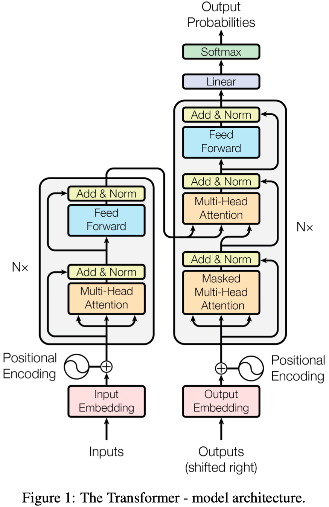

##### 3.1 Encoder and Decoder Stacks

**编码器**：编码器由 N = 6 个相同层的堆栈组成。每层有两个子层。第一个是多头自注意机制，第二个是简单的、按位置的全连接前馈网络。我们在两个子层中的每一个周围使用残差连接 [11]，然后进行层归一化（layer normalization） [1]。即每个子层的输出为LayerNorm(x + Sublayer(x))，其中Sublayer(x)是子层自己实现的函数。为了促进这些残差连接，模型中的所有子层以及嵌入层都会产生维度 

 = 512 的输出。

>**Encoder**: The encoder is composed of a stack of N = 6 identical layers. Each layer has two sub-layers. The first is a multi-head self-attention mechanism, and the second is a simple, position- wise fully connected feed-forward network. We employ a residual connection [11] around each of the two sub-layers, followed by layer normalization [1]. That is, the output of each sub-layer is LayerNorm(x + Sublayer(x)), where Sublayer(x) is the function implemented by the sub-layer itself. To facilitate these residual connections, all sub-layers in the model, as well as the embedding layers, produce outputs of dimension 

 = 512.

**解码器**：解码器也是由N = 6个相同层的堆栈组成。除了每个编码器层中的两个子层之外，解码器还插入了第三个子层，该子层对编码器堆栈的输出执行多头注意力。与编码器类似，我们在每个子层周围使用残差连接，然后进行层归一化(layer normalization)。我们还修改了解码器堆栈中的自注意力子层，以防止位置关注后续位置。这种掩码使得，输出的嵌入在特定位置上被抵消，确保对位置 i 的预测只能依赖于位置小于 i 的已知输出。

>**Decoder**: The decoder is also composed of a stack of N =6identical layers. In addition to the two sub-layers in each encoder layer, the decoder inserts a third sub-layer, which performs multi-head attention over the output of the encoder stack. Similar to the encoder, we employ residual connections around each of the sub-layers, followed by layer normalization. We also modify the self-attention sub-layer in the decoder stack to prevent positions from attending to subsequent positions. This masking, combined with fact that the output embeddings are offset by one position, ensures that the predictions for position i can depend only on the known outputs at positions less than i.

##### 3.2 Attention

注意力函数可以描述为将查询和一组键值对映射到输出，其中查询（query）、键（keys）、值（values）和输出都是向量。输出计算为值的加权和，其中分配给每个值的权重由查询与相应键的一致性函数计算。

>An attention function can be described as mapping a query and a set of key-value pairs to an output, where the query, keys, values, and output are all vectors. The output is computed as a weighted sum of the values, where the weight assigned to each value is computed by a compatibility function of the query with the corresponding key.

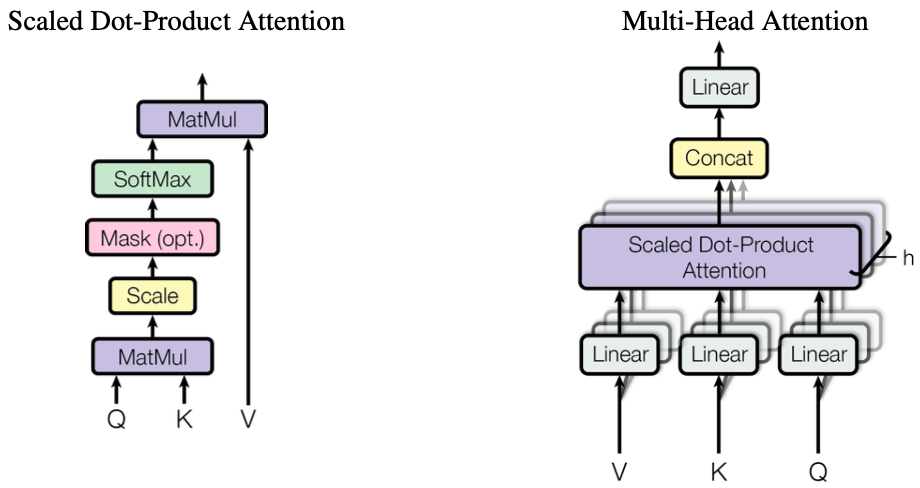

图 2：（左）按比例缩放的点积注意力。 （右）多头注意力由多个并行运行的注意力层组成。

>Figure 2: (left) Scaled Dot-Product Attention. (right) Multi-Head Attention consists of several attention layers running in parallel.

###### 3.2.1 Scaled Dot-Product Attention

我们将我们的特别关注称为“Scaled Dot-Product Attention”（图 2）。输入由维度 

的查询和键以及维度 

的值组成。我们使用所有键计算查询的点积，将每个键除以 

，并应用 softmax 函数来获得值的权重。

>We call our particular attention "Scaled Dot-Product Attention" (Figure 2). The input consists of queries and keys of dimension dk, p and values of dimension dv. We compute the dot products of the query with all keys, divide each by dk, and apply a softmax function to obtain the weights on the values.

在实践中，我们将一组查询合并到矩阵 Q 中，同时计算他们的的注意力函数。键和值也同样地合并在矩阵 K 和 V 中。我们将输出矩阵计算表示为：

>In practice, we compute the attention function on a set of queries simultaneously, packed together into a matrix Q. The keys and values are also packed together into matrices K and V. We compute the matrix of outputs as:

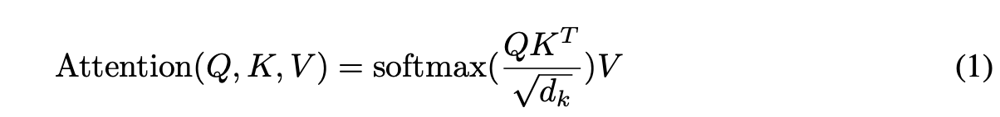

两个最常用的attention方法是加法attention[2]和点积（乘法）attention。点积注意力与我们的算法相同，除了 

的比例因子。 加法attention 使用具有单个隐藏层的前馈网络计算一致性函数。虽然两者在理论上的复杂度相似，但点积注意力在实践中更快且更节省空间，因为它可以使用高度优化的矩阵乘法代码来实现。

>The two most commonly used attention functions are additive attention [2], and dot-product (multi- plicative) attention. Dot-product attention is identical to our algorithm, except for the scaling factor of p1 . Additive attention computes the compatibility function using a feed-forward network with dk a single hidden layer. While the two are similar in theoretical complexity, dot-product attention is much faster and more space-efficient in practice, since it can be implemented using highly optimized matrix multiplication code.

虽然对于较小的 

 值，这两种机制的性能相似，但加法注意力优于点积注意力，而无需对较大的 

 值进行缩放 [3]。我们猜想对于较大的 

 值，点积的量级会非常巨大，而用 softmax 函数会使其处于具有极小梯度的区域 。为了抵消这种影响，我们将点积按 

缩放。

>While for small values of dk the two mechanisms perform similarly, additive attention outperforms dot product attention without scaling for larger values of dk [3]. We suspect that for large values of dk, the dot products grow large in magnitude, pushing the softmax function into regions where it has extremely small gradients 4. To counteract this effect, we scale the dot products by p1 . dk

##### 3.2.2 Multi-Head Attention

与使用 

 维度的键、值和查询执行单个注意函数不同，我们发现将查询、键和值分别线性投影到  

、 

 和  

 维度上的不同学习线性投影是有益的。然后，在每个查询、键和值的投影版本上，我们并行执行注意功能，产生  

 维输出值。这些被连接起来并再次线性投影，产生最终值，如图 2 所示。

>Instead of performing a single attention function with dmodel-dimensional keys, values and queries, we found it beneficial to linearly project the queries, keys and values h times with different, learned linear projections to dk, dk and dv dimensions, respectively. On each of these projected versions of queries, keys and values we then perform the attention function in parallel, yielding dv-dimensional output values. These are concatenated and once again projected, resulting in the final values, as depicted in Figure 2.

5 多头注意力允许模型共同关注来自不同位置的不同表示子空间的信息。对于单个注意力头，平均化会抑制这一点。

>5 Multi-head attention allows the model to jointly attend to information from different representation subspaces at different positions. With a single attention head, averaging inhibits this.

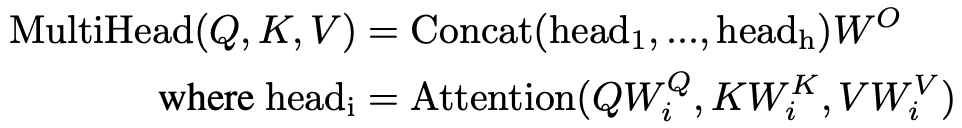

其中投影是参数矩阵

, 

> Where the projections are parameter matrices WiQ ∈ Rdmodel ×dk , WiK ∈ Rdmodel ×dk , WiV ∈ Rdmodel ×dv andWO ∈Rhdv×dmodel.

在这项工作中，我们使用 h = 8 个并行注意力层或头。对于其中的每一个，我们使用 

。由于每个头的维度减少，总计算复杂度类似于具有全维度的单头注意力。

>In this work we employ h = 8 parallel attention layers, or heads. For each of these we use dk =dv =dmodel=h = 64. Due to the reduced dimension of each head, the total computational cost is similar to that of single-head attention with full dimensionality.

##### 3.2.3 Applications of Attention in our Model

Transformer 在三个方面使用多头注意力 attention:

- 在“编码器-解码器注意力”层中，查询来自前一个解码器层，记忆键和值来自编码器的输出。这允许解码器中的每个位置参与输入序列中的所有位置。这模仿了序列到序列模型中典型的编码器-解码器注意机制，例如 [38, 2, 9]。

- 编码器包含自注意力层。在自注意力层中，所有的键、值和查询都来自同一个地方，在这种情况下，是编码器中前一层的输出。编码器中的每个位置都可以关注编码器上一层中的所有位置。

- 类似地，解码器中的自注意力层允许解码器中的每个位置关注解码器中直到并包括该位置的所有位置。我们需要防止解码器中的信息向左流动，以保持自回归特性。我们通过屏蔽掉（设置为 

）softmax 输入中对应于禁止连接的所有值，在scaled点积注意力内部实现这一点。请参见图 2。

>The Transformer uses multi-head attention in three different ways:
>
>- In "encoder-decoder attention" layers, the queries come from the previous decoder layer, and the memory keys and values come from the output of the encoder. This allows every position in the decoder to attend over all positions in the input sequence. This mimics the typical encoder-decoder attention mechanisms in sequence-to-sequence models such as [38, 2, 9]. 
>
>- The encoder contains self-attention layers. In a self-attention layer all of the keys, values and queries come from the same place, in this case, the output of the previous layer in the encoder. Each position in the encoder can attend to all positions in the previous layer of the encoder. 
>- Similarly, self-attention layers in the decoder allow each position in the decoder to attend to all positions in the decoder up to and including that position. We need to prevent leftward information flow in the decoder to preserve the auto-regressive property. We implement this inside of scaled dot-product attention by masking out (setting to  1) all values in the input of the softmax which correspond to illegal connections. See Figure 2.

##### 3.3 Position-wise Feed-Forward Networks

除了注意力子层之外，我们的编码器和解码器中的每一层都包含一个完全连接的前馈网络，该网络分别且相同地应用于每个位置。这包括两个线性变换，中间有一个 ReLU 激活。

>In addition to attention sub-layers, each of the layers in our encoder and decoder contains a fully connected feed-forward network, which is applied to each position separately and identically. This consists of two linear transformations with a ReLU activation in between.

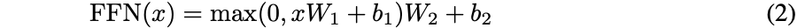

虽然线性变换在不同位置上是相同的，但它们在层与层之间使用不同的参数。另一种描述方式是内核大小为 1 的两个卷积。输入和输出的维度为 

，内层的维度为 

。

>While the linear transformations are the same across different positions, they use different parameters from layer to layer. Another way of describing this is as two convolutions with kernel size 1. The dimensionality of input and output is dmodel = 512, and the inner-layer has dimensionality dff = 2048.

##### 3.4 Embeddings and Softmax

与其他序列转换模型类似，我们使用学习嵌入将输入tokens和输出tokens转换为维度 

 的向量。我们还使用通常的学习线性变换和 softmax 函数将解码器输出转换为预测的下一个tokens概率。在我们的模型中，我们在两个嵌入层和 pre-softmax 线性变换之间共享相同的权重矩阵，类似于 [30]。在嵌入层中，我们将这些权重乘以 

。

>Similarly to other sequence transduction models, we use learned embeddings to convert the input tokens and output tokens to vectors of dimension dmodel. We also use the usual learned linear transfor- mation and softmax function to convert the decoder output to predicted next-token probabilities. In our model, we share the same weight matrix between the two embedding layers and the pre-softmax linear transformation, similar to [30]. In the embedding layers, we multiply those weights by dmodel.

##### 3.5 Positional Encoding

由于我们的模型不包含rnn和卷积，为了让模型利用序列的顺序，我们必须加入一些关于序列中的token的的相对或绝对位置的信息.

>Since our model contains no recurrence and no convolution, in order for the model to make use of the order of the sequence, we must inject some information about the relative or absolute position of the tokens in the sequence.

表 1：不同层类型的最大路径长度、每层复杂性和最小顺序操作数。 n 是序列长度，d 是表示维度，k 是卷积的核大小，r 是受限自注意中的邻域大小。

>Table 1: Maximum path lengths, per-layer complexity and minimum number of sequential operations for different layer types. n is the sequence length, d is the representation dimension, k is the kernel size of convolutions and r the size of the neighborhood in restricted self-attention.

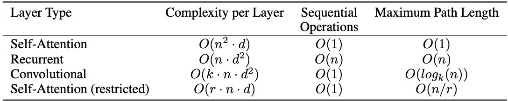

为此，我们在编码器和解码器堆栈底部的输入嵌入中添加“位置编码”。位置编码与嵌入具有相同的维度 

，因此可以将两者相加。位置编码有很多选择，学习的和固定的 [9]。

>To this end, we add "positional encodings" to the input embeddings at the bottoms of the encoder and decoder stacks. The positional encodings have the same dimension dmodel as the embeddings, so that the two can be summed. There are many choices of positional encodings, learned and fixed [9].

在这项工作中，我们使用不同频率的正弦和余弦函数：

> In this work, we use sine and cosine functions of different frequencies:

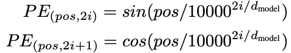

其中 pos 是位置，i 是维度。也就是说，位置编码的每个维度对应一个正弦曲线。波长形成从 

 到 10000 *

 的几何级数。我们选择这个函数是因为我们假设它可以让模型轻松学习通过相对位置来参与，因为对于任何固定的偏移量 k，

可以表示为 

 的线性函数。

>where pos is the position and i is the dimension. That is, each dimension of the positional encoding corresponds to a sinusoid. The wavelengths form a geometric progression from 2 to 10000  2. We chose this function because we hypothesized it would allow the model to easily learn to attend by relative positions, since for any fixed offset k, PEpos+k can be represented as a linear function of PEpos.

我们还尝试使用学习的位置嵌入 [9]，发现这两个版本产生了几乎相同的结果（见表 3 行 (E)）。我们选择了正弦版本，因为它可以让模型推断出比训练期间遇到的序列长度更长的序列长度。

>We also experimented with using learned positional embeddings [9] instead, and found that the two versions produced nearly identical results (see Table 3 row (E)). We chose the sinusoidal version because it may allow the model to extrapolate to sequence lengths longer than the ones encountered during training.

#### 4 Why Self-Attention

在本节中，我们将自注意力层的各个方面与循环层和卷积层进行比较，这些层通常用于将一个可变长度的符号表示序列 
)
 映射到另一个等长序列
)
, 其中 

，例如典型序列转导编码器或解码器中的隐藏层。为了说明我们对自注意力的优势，我们考虑了三个方面。

>In this section we compare various aspects of self-attention layers to the recurrent and convolu- tional layers commonly used for mapping one variable-length sequence of symbol representations d (x1; :::; xn) to another sequence of equal length (z1; :::; zn), with xi; zi 2 R , such as a hidden layer in a typical sequence transduction encoder or decoder. Motivating our use of self-attention we consider three desiderata.

一是每层的总计算复杂度。另一个是可以并行化的计算量，以所需的最小顺序操作数来衡量。

>One is the total computational complexity per layer. Another is the amount of computation that can be parallelized, as measured by the minimum number of sequential operations required.

第三个是网络中远程依赖关系之间的路径长度。学习长程依赖是许多序列转导任务中的关键挑战。影响学习这种依赖性的能力的一个关键因素是前向和后向信号必须在网络中遍历的路径长度。输入和输出序列中任意位置组合之间的这些路径越短，就越容易学习远程依赖[12]。因此，我们还比较了由不同层类型组成的网络中任意两个输入和输出位置之间的最大路径长度。

>The third is the path length between long-range dependencies in the network. Learning long-range dependencies is a key challenge in many sequence transduction tasks. One key factor affecting the ability to learn such dependencies is the length of the paths forward and backward signals have to traverse in the network. The shorter these paths between any combination of positions in the input and output sequences, the easier it is to learn long-range dependencies [12]. Hence we also compare the maximum path length between any two input and output positions in networks composed of the different layer types.

如表 1 所示，自注意力层将所有位置与恒定数量的顺序执行操作连接起来，而循环层需要 O(n) 顺序操作。在计算复杂度方面，当序列长度 n 小于表示维数 d 时，self-attention 层比循环层更快，这通常是机器翻译中最先进模型使用的句子表示的情况，例如 word-piece [38] 和 byte-pair [31] 表示。为了提高涉及非常长序列的任务的计算性能，self-attention 可以限制为仅考虑大小为 r 的邻域 输入序列以各自的输出位置为中心。这会将最大路径长度增加到 O(n/r)。我们计划在未来的工作中进一步研究这种方法。

>As noted in Table 1, a self-attention layer connects all positions with a constant number of sequentially executed operations, whereas a recurrent layer requires O(n) sequential operations. In terms of computational complexity, self-attention layers are faster than recurrent layers when the sequence length n is smaller than the representation dimensionality d, which is most often the case with sentence representations used by state-of-the-art models in machine translations, such as word-piece [38] and byte-pair [31] representations. To improve computational performance for tasks involving very long sequences, self-attention could be restricted to considering only a neighborhood of size r in the input sequence centered around the respective output position. This would increase the maximum path length to O(n/r). We plan to investigate this approach further in future work.

内核宽度 k < n 的单个卷积层不会连接所有输入和输出位置对。这样做需要在连续内核的情况下堆叠 O(n/k) 卷积层，或者在扩张卷积的情况下需要 
\right))
[18]，从而增加任意两个位置之间最长路径的长度在网络中。卷积层通常比循环层更昂贵，高出 k 倍。然而，可分离卷积 [6] 将复杂度显着降低到 
)
。然而，即使 k = n，可分离卷积的复杂度也等于自注意力层和逐点前馈层的组合，这是我们在模型中采用的方法。

>A single convolutional layer with kernel width k < n does not connect all pairs of input and output positions. Doing so requires a stack of O(n/k) convolutional layers in the case of contiguous kernels, or O(logk(n)) in the case of dilated convolutions [18], increasing the length of the longest paths between any two positions in the network. Convolutional layers are generally more expensive than recurrent layers, by a factor of k. Separable convolutions [6], however, decrease the complexity considerably, to O(k  n  d+nd2). Even with k = n, however, the complexity of a separable convolution is equal to the combination of a self-attention layer and a point-wise feed-forward layer, the approach we take in our model.

作为附带的好处，self-attention 可以产生更多可解释的模型。我们从我们的模型中检查注意力分布，并在附录中展示和讨论示例。不仅单个注意力头清楚地学习执行不同的任务，而且许多似乎表现出与句子的句法和语义结构相关的行为。

>As side benefit, self-attention could yield more interpretable models. We inspect attention distributions from our models and present and discuss examples in the appendix. Not only do individual attention heads clearly learn to perform different tasks, many appear to exhibit behavior related to the syntactic and semantic structure of the sentences.

#### 5 Training

本节描述了我们模型的训练机制。

> This section describes the training regime for our models.

##### 5.1 Training Data and Batching

我们在由大约 450 万个句子对组成的标准 WMT 2014 英语-德语数据集上进行了训练。句子使用字节对编码 [3] 进行编码，该编码具有大约 37000 个标记的共享源-目标词汇表。对于英语-法语，我们使用了更大的 WMT 2014 英语-法语数据集，该数据集由 3600 万个句子组成，并将tokens拆分为 32000 个单词词汇表 [38]。句子对按近似的序列长度分批在一起。每个训练批次包含一组句子对，其中包含大约 25000 个源tokens和 25000 个目标tokens。

>We trained on the standard WMT 2014 English-German dataset consisting of about 4.5 million sentence pairs. Sentences were encoded using byte-pair encoding [3], which has a shared source- target vocabulary of about 37000 tokens. For English-French, we used the significantly larger WMT 2014 English-French dataset consisting of 36M sentences and split tokens into a 32000 word-piece vocabulary [38]. Sentence pairs were batched together by approximate sequence length. Each training batch contained a set of sentence pairs containing approximately 25000 source tokens and 25000 target tokens.

##### 5.2 Hardware and Schedule

我们在一台配备 8 个 NVIDIA P100 GPU 的机器上训练我们的模型。对于我们使用整篇论文中描述的超参数的基础模型，每个训练步骤大约需要 0.4 秒。我们对基础模型进行了总共 100,000 步或 12 小时的训练。对于我们的大型模型，（在表 3 的最后一行进行了描述），步进时间为 1.0 秒。大型模型训练了 300,000 步（3.5 天）。

>We trained our models on one machine with 8 NVIDIA P100 GPUs. For our base models using the hyperparameters described throughout the paper, each training step took about 0.4 seconds. We trained the base models for a total of 100,000 steps or 12 hours. For our big models,(described on the bottom line of table 3), step time was 1.0 seconds. The big models were trained for 300,000 steps (3.5 days).

##### 5.3 Optimizer

我们使用了 β1 = 0.9、β2 = 0.98 和 ε = 10−9 的 Adam 优化器 [20]。 我们根据以下公式在训练过程中改变学习率：

> We used the Adam optimizer [20] with β1 = 0.9, β2 = 0.98 and ε = 10−9. We varied the learning rate over the course of training, according to the formula:

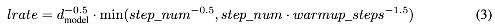

这对应于在第一个 warmup_steps 训练步骤中线性增加学习率，然后根据步数的平方根倒数按比例减少学习率。我们使用了 warmup_steps = 4000。

>This corresponds to increasing the learning rate linearly for the first warmup_steps training steps, and decreasing it thereafter proportionally to the inverse square root of the step number. We used warmup_steps = 4000.

##### 5.4 Regularization

**Residual Dropout** 我们将 dropout [33] 应用于每个子层的输出，然后将其添加到子层输入并进行归一化。此外，我们将 dropout 应用于编码器和解码器堆栈中嵌入和位置编码的总和。对于基本模型，我们使用

的比率。

>**Residual Dropout** We apply dropout [33] to the output of each sub-layer, before it is added to the sub-layer input and normalized. In addition, we apply dropout to the sums of the embeddings and the positional encodings in both the encoder and decoder stacks. For the base model, we use a rate of Pdrop =0:1.

8 表 2：在 2014 年英语到德语和英语到法语的 newstest2014 测试中，Transformer 的 BLEU 分数比以前最先进的模型更好，而训练开销可以减小很多。

>8 Table 2: The Transformer achieves better BLEU scores than previous state-of-the-art models on the English-to-German and English-to-French newstest2014 tests at a fraction of the training cost.

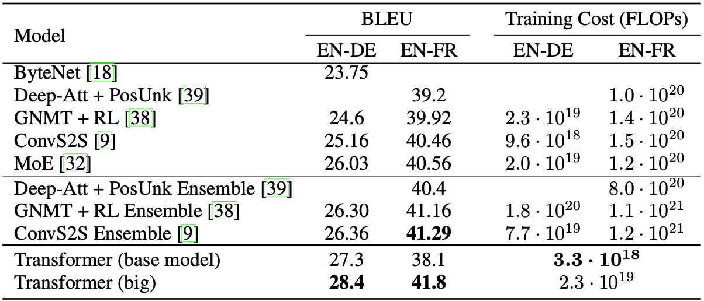

**标签平滑** 在训练过程中，我们采用了值

 [36] 的标签平滑。这会提升困惑度，因为模型会变得更加不确定，但会提高准确性和 BLEU 分数。

>**Label Smoothing** During training, we employed label smoothing of value ls = 0:1 [36]. This hurts perplexity, as the model learns to be more unsure, but improves accuracy and BLEU score.

#### 6 Results

##### 6.1 Machine Translation

在 WMT 2014 英德翻译任务中，大 Transformer 模型（表 2 中的 Transformer (big)）比之前报告的最佳模型（包括 ensembles）高出 2:0 BLEU 以上，建立了一个新的 最先进的 BLEU 得分 28.4。该模型的配置列于表 3 的最后一行。在 8 个 P100 GPU 上训练耗时 3.5 天。甚至我们的基础模型也超过了所有先前发布的模型和他们的集成，其训练开销只是任何相比较的模型的一小部分。

>On the WMT 2014 English-to-German translation task, the big transformer model (Transformer (big) in Table 2) outperforms the best previously reported models (including ensembles) by more than 2:0 BLEU, establishing a new state-of-the-art BLEU score of 28:4. The configuration of this model is listed in the bottom line of Table 3. Training took 3:5 days on 8 P100 GPUs. Even our base model surpasses all previously published models and ensembles, at a fraction of the training cost of any of the competitive models.

在 WMT 2014 英法翻译任务中，我们的大模型达到了 41.0 的 BLEU 分数，优于之前发布的所有单一模型，其训练成本低于之前最佳的模型的 1/4 。为英语到法语训练的 Transformer（大）模型使用 dropout 率 

，而不是 0.3。

>On the WMT 2014 English-to-French translation task, our big model achieves a BLEU score of 41:0, outperforming all of the previously published single models, at less than 1=4 the training cost of the previous state-of-the-art model. The Transformer (big) model trained for English-to-French used dropout rate Pdrop =0:1, instead of 0:3.

对于基本模型，我们使用通过平均最后 5 个检查点获得的单个模型，这些检查点以 10 分钟的间隔写入。对于大型模型，我们平均了最后 20 个检查点。我们使用束搜索，束大小为 4，长度惩罚 = 0.6 [38]。这些超参数是在对开发集进行实验后选择的。我们将推理期间的最大输出长度设置为输入长度 + 50，但在可能的情况下提前终止 [38]。

>For the base models, we used a single model obtained by averaging the last 5 checkpoints, which were written at 10-minute intervals. For the big models, we averaged the last 20 checkpoints. We used beam search with a beam size of 4 and length penalty  = 0:6 [38]. These hyperparameters were chosen after experimentation on the development set. We set the maximum output length during inference to input length + 50, but terminate early when possible [38].

表 2 总结了我们的结果，并将我们的翻译质量和训练成本与文献中的其他模型架构进行了比较。我们通过将训练时间、使用的 GPU 数量以及每个 GPU 的持续单精度浮点容量的估计值相乘来估计用于训练模型的浮点运算的数量。

>Table 2 summarizes our results and compares our translation quality and training costs to other model architectures from the literature. We estimate the number of floating point operations used to train a model by multiplying the training time, the number of GPUs used, and an estimate of the sustained single-precision floating-point capacity of each GPU 5.

##### 6.2 Model Variations

为了评估 Transformer 不同组件的重要性，我们以不同的方式改变了我们的基础模型，测量了开发集 newstest2013 上英德翻译性能的变化。我们使用了上一节中描述的束搜索，但没有检查点平均。我们在表 3 中展示了这些结果。

>To evaluate the importance of different components of the Transformer, we varied our base model in different ways, measuring the change in performance on English-to-German translation on the development set, newstest2013. We used beam search as described in the previous section, but no checkpoint averaging. We present these results in Table 3.

在表 3 行 (A) 中，我们改变了注意力头的数量以及注意力键和值维度，保持计算量不变，如第 3.2.2 节所述。虽然单头注意力比最佳设置差 0.9 BLEU，但质量也会因头过多而下降。

>In Table 3 rows (A), we vary the number of attention heads and the attention key and value dimensions, keeping the amount of computation constant, as described in Section 3.2.2. While single-head attention is 0.9 BLEU worse than the best setting, quality also drops off with too many heads.

表 3：Transformer 架构的变化。未列出的值与基本模型的值相同。所有指标都在英语到德语的翻译开发集 newstest2013 上。根据我们的字节对编码，列出的困惑是每个单词的，不应与每个单词的困惑进行比较。

>Table 3: Variations on the Transformer architecture. Unlisted values are identical to those of the base model. All metrics are on the English-to-German translation development set, newstest2013. Listed perplexities are per-wordpiece, according to our byte-pair encoding, and should not be compared to per-word perplexities.

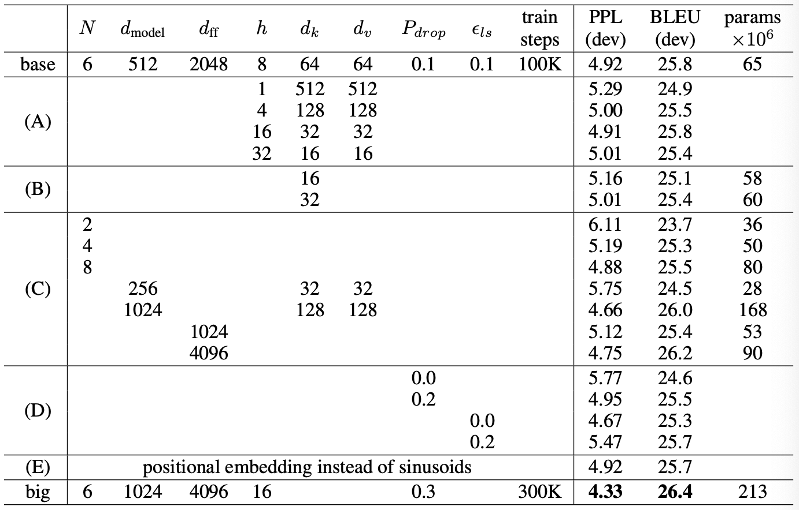

表 4：Transformer 很好地推广到英语选区解析（结果在WSJ  23）

> Table 4: The Transformer generalizes well to English constituency parsing (Results are on Section 23 of WSJ)

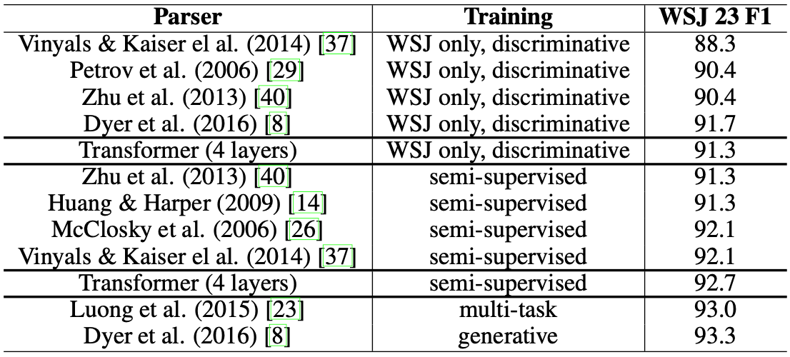

在表 3 行 (B) 中，我们观察到减小注意力键大小 

 会损害模型质量。这表明确定一致性并不容易，比点积更复杂的一致性功能可能是有益的。我们在行 (C) 和 (D) 中进一步观察到，正如预期的那样，更大的模型更好，并且 dropout 非常有助于避免过度拟合。在第 (E) 行中，我们用学习的位置嵌入 [9] 替换我们的正弦位置编码，并观察到与基本模型几乎相同的结果。

>In Table 3 rows (B), we observe that reducing the attention key size dk hurts model quality. This suggests that determining compatibility is not easy and that a more sophisticated compatibility function than dot product may be beneficial. We further observe in rows (C) and (D) that, as expected, bigger models are better, and dropout is very helpful in avoiding over-fitting. In row (E) we replace our sinusoidal positional encoding with learned positional embeddings [9], and observe nearly identical results to the base model.

##### 6.3 English Constituency Parsing

为了评估 Transformer 是否可以泛化到其他任务，我们对英语选区解析进行了实验。这项任务提出了具体的挑战：产出受制于强大的结构性约束并且明显长于输入。此外，RNN 序列到序列模型无法在小数据机制中获得最先进的结果 [37]。

>To evaluate if the Transformer can generalize to other tasks we performed experiments on English constituency parsing. This task presents specific challenges: the output is subject to strong structural  constraints and is significantly longer than the input. Furthermore, RNN sequence-to-sequence models have not been able to attain state-of-the-art results in small-data regimes [37].

我们在 Penn Treebank [25] 的华尔街日报 (WSJ) 部分训练了一个 

= 1024 的 4 层的transformer，大约 40K 训练句子。我们还在半监督环境中对其进行了训练，使用来自大约 1700 万个句子的更大的高置信度和 BerkleyParser 语料库 [37]。我们将 16K token的词汇表用于 WSJ 唯一设置，将 32K token词汇表用于半监督设置。

>We trained a 4-layer transformer with dmodel = 1024 on the Wall Street Journal (WSJ) portion of the Penn Treebank [25], about 40K training sentences. We also trained it in a semi-supervised setting, using the larger high-confidence and BerkleyParser corpora from with approximately 17M sentences [37]. We used a vocabulary of 16K tokens for the WSJ only setting and a vocabulary of 32K tokens for the semi-supervised setting.

我们只进行了少量实验来在第 22 部分开发集上，选择上的 dropout、注意力和残差（第 5.4 节）、学习率和束大小，所有其他参数与英德基础翻译模型保持不变。在推理过程中，我们将最大输出长度增加到输入长度 + 300。我们对 WSJ 和半监督设置都使用了 21 和 α=0.3 的光束大小。

>We performed only a small number of experiments to select the dropout, both attention and residual (section 5.4), learning rates and beam size on the Section 22 development set, all other parameters remained unchanged from the English-to-German base translation model. During inference, we increased the maximum output length to input length + 300. We used a beam size of 21 and  =0:3 for both WSJ only and the semi-supervised setting.

我们在表 4 中的结果表明，尽管缺乏针对特定任务的调整，但我们的模型表现得非常好，比除循环神经网络语法 [8] 之外的所有先前报告的模型产生了更好的结果。

>Our results in Table 4 show that despite the lack of task-specific tuning our model performs sur- prisingly well, yielding better results than all previously reported models with the exception of the Recurrent Neural Network Grammar [8].

与 RNN 序列到序列模型 [37] 相比，即使仅在 WSJ 40K 句子的训练集上进行训练，Transformer 也优于 Berkeley-Parser [29]。

>In contrast to RNN sequence-to-sequence models [37], the Transformer outperforms the Berkeley- Parser [29] even when training only on the WSJ training set of 40K sentences.

#### 7 Conclusion

在这项工作中，我们提出了 Transformer，这是第一个完全基于注意力的序列转导模型，用多头自注意力取代了编码器-解码器架构中最常用的循环层。

>In this work, we presented the Transformer, the first sequence transduction model based entirely on attention, replacing the recurrent layers most commonly used in encoder-decoder architectures with multi-headed self-attention.

对于翻译任务，Transformer 的训练速度明显快于基于循环或卷积层的架构。在 WMT 2014 英语到德语和 WMT 2014 英语到法语的翻译任务上，我们都达到了新的水平。在前一项任务中，我们最好的模型甚至优于所有先前报道的集成模型。

>For translation tasks, the Transformer can be trained significantly faster than architectures based on recurrent or convolutional layers. On both WMT 2014 English-to-German and WMT 2014 English-to-French translation tasks, we achieve a new state of the art. In the former task our best model outperforms even all previously reported ensembles.

我们对基于注意力的模型的未来感到兴奋，并计划将它们应用于其他任务。我们计划将 Transformer 扩展到涉及文本以外的输入和输出模式的问题，并研究局部的受限注意力机制，以有效处理图像、音频和视频等大型输入和输出。减少生成的顺序是我们的另一个研究目标。

>We are excited about the future of attention-based models and plan to apply them to other tasks. We plan to extend the Transformer to problems involving input and output modalities other than text and to investigate local, restricted attention mechanisms to efficiently handle large inputs and outputs such as images, audio and video. Making generation less sequential is another research goals of ours.

我们用于训练和评估模型的代码可在 https://github.com/tensorflow/tensor2tensor 获得。

>The code we used to train and evaluate our models is available at https://github.com/tensorflow/tensor2tensor.

致谢 我们感谢 Nal Kalchbrenner 和 Stephan Gouws 富有成效的评论、更正和启发。

>Acknowledgements We are grateful to Nal Kalchbrenner and Stephan Gouws for their fruitful comments, corrections and inspiration.

>[1] Jimmy Lei Ba, Jamie Ryan Kiros, and Geoffrey E Hinton. Layer normalization. arXiv preprint arXiv:1607.06450, 2016.

>[2] Dzmitry Bahdanau, Kyunghyun Cho, and Yoshua Bengio. Neural machine translation by jointly learning to align and translate. CoRR, abs/1409.0473, 2014.

>[3] Denny Britz, Anna Goldie, Minh-Thang Luong, and Quoc V. Le. Massive exploration of neural machine translation architectures. CoRR, abs/1703.03906, 2017.

>[4] Jianpeng Cheng, Li Dong, and Mirella Lapata. Long short-term memory-networks for machine reading. arXiv preprint arXiv:1601.06733, 2016.

>[5] Kyunghyun Cho, Bart van Merrienboer, Caglar Gulcehre, Fethi Bougares, Holger Schwenk, and Yoshua Bengio. Learning phrase representations using rnn encoder-decoder for statistical machine translation. CoRR, abs/1406.1078, 2014.

>[6] Francois Chollet. Xception: Deep learning with depthwise separable convolutions. arXiv preprint arXiv:1610.02357, 2016.

> [7] Junyoung Chung, Çaglar Gülçehre, Kyunghyun Cho, and Yoshua Bengio. Empirical evaluation of gated recurrent neural networks on sequence modeling. CoRR, abs/1412.3555, 2014.

>[8] Chris Dyer, Adhiguna Kuncoro, Miguel Ballesteros, and Noah A. Smith. Recurrent neural network grammars. In Proc. of NAACL, 2016.

>[9] Jonas Gehring, Michael Auli, David Grangier, Denis Yarats, and Yann N. Dauphin. Convolu- tional sequence to sequence learning. arXiv preprint arXiv:1705.03122v2, 2017.

>[10] Alex Graves. Generating sequences with recurrent neural networks. arXiv preprint arXiv:1308.0850, 2013.

>[11] Kaiming He, Xiangyu Zhang, Shaoqing Ren, and Jian Sun. Deep residual learning for im- age recognition. In Proceedings of the IEEE Conference on Computer Vision and Pattern Recognition, pages 770–778, 2016.

>[12] Sepp Hochreiter, Yoshua Bengio, Paolo Frasconi, and Jürgen Schmidhuber. Gradient flow in recurrent nets: the difficulty of learning long-term dependencies, 2001.

>[13] Sepp Hochreiter and Jürgen Schmidhuber. Long short-term memory. Neural computation, 9(8):1735–1780, 1997.

>[14] Zhongqiang Huang and Mary Harper. Self-training PCFG grammars with latent annotations across languages. In Proceedings of the 2009 Conference on Empirical Methods in Natural Language Processing, pages 832–841. ACL, August 2009.

>[15] Rafal Jozefowicz, Oriol Vinyals, Mike Schuster, Noam Shazeer, and Yonghui Wu. Exploring the limits of language modeling. arXiv preprint arXiv:1602.02410, 2016.

>[16] Łukasz Kaiser and Samy Bengio. Can active memory replace attention? In Advances in Neural Information Processing Systems, (NIPS), 2016.

>[17] Łukasz Kaiser and Ilya Sutskever. Neural GPUs learn algorithms. In International Conference on Learning Representations (ICLR), 2016.

>[18] Nal Kalchbrenner, Lasse Espeholt, Karen Simonyan, Aaron van den Oord, Alex Graves, and Ko- ray Kavukcuoglu. Neural machine translation in linear time. arXiv preprint arXiv:1610.10099v2, 2017.

>[19] Yoon Kim, Carl Denton, Luong Hoang, and Alexander M. Rush. Structured attention networks. In International Conference on Learning Representations, 2017.

>[21] Oleksii Kuchaiev and Boris Ginsburg. Factorization tricks for LSTM networks. arXiv preprint arXiv:1703.10722, 2017.

>[22] Zhouhan Lin, Minwei Feng, Cicero Nogueira dos Santos, Mo Yu, Bing Xiang, Bowen Zhou, and Yoshua Bengio. A structured self-attentive sentence embedding. arXiv preprint arXiv:1703.03130, 2017.

>[23] Minh-Thang Luong, Quoc V. Le, Ilya Sutskever, Oriol Vinyals, and Lukasz Kaiser. Multi-task sequence to sequence learning. arXiv preprint arXiv:1511.06114, 2015.

>[24] Minh-Thang Luong, Hieu Pham, and Christopher D Manning. Effective approaches to attention- based neural machine translation. arXiv preprint arXiv:1508.04025, 2015.

>[25] Mitchell P Marcus, Mary Ann Marcinkiewicz, and Beatrice Santorini. Building a large annotated corpus of english: The penn treebank. Computational linguistics, 19(2):313–330, 1993.

>[26] David McClosky, Eugene Charniak, and Mark Johnson. Effective self-training for parsing. In Proceedings of the Human Language Technology Conference of the NAACL, Main Conference, pages 152–159. ACL, June 2006.

> [27] Ankur Parikh, Oscar Täckström, Dipanjan Das, and Jakob Uszkoreit. A decomposable attention model. In Empirical Methods in Natural Language Processing, 2016.

>[28] Romain Paulus, Caiming Xiong, and Richard Socher. A deep reinforced model for abstractive summarization. arXiv preprint arXiv:1705.04304, 2017.

>[29] Slav Petrov, Leon Barrett, Romain Thibaux, and Dan Klein. Learning accurate, compact, and interpretable tree annotation. In Proceedings of the 21st International Conference on Computational Linguistics and 44th Annual Meeting of the ACL, pages 433–440. ACL, July 2006.

>[30] Ofir Press and Lior Wolf. Using the output embedding to improve language models. arXiv preprint arXiv:1608.05859, 2016.

>[31] Rico Sennrich, Barry Haddow, and Alexandra Birch. Neural machine translation of rare words with subword units. arXiv preprint arXiv:1508.07909, 2015.

>[32] Noam Shazeer, Azalia Mirhoseini, Krzysztof Maziarz, Andy Davis, Quoc Le, Geoffrey Hinton, and Jeff Dean. Outrageously large neural networks: The sparsely-gated mixture-of-experts layer. arXiv preprint arXiv:1701.06538, 2017.

>[33] Nitish Srivastava, Geoffrey E Hinton, Alex Krizhevsky, Ilya Sutskever, and Ruslan Salakhutdi- nov. Dropout: a simple way to prevent neural networks from overfitting. Journal of Machine Learning Research, 15(1):1929–1958, 2014.

>[34] Sainbayar Sukhbaatar, Arthur Szlam, Jason Weston, and Rob Fergus. End-to-end memory networks. In C. Cortes, N. D. Lawrence, D. D. Lee, M. Sugiyama, and R. Garnett, editors, Advances in Neural Information Processing Systems 28, pages 2440–2448. Curran Associates, Inc., 2015.

>[35] Ilya Sutskever, Oriol Vinyals, and Quoc VV Le. Sequence to sequence learning with neural networks. In Advances in Neural Information Processing Systems, pages 3104–3112, 2014.

>[36] Christian Szegedy, Vincent Vanhoucke, Sergey Ioffe, Jonathon Shlens, and Zbigniew Wojna. Rethinking the inception architecture for computer vision. CoRR, abs/1512.00567, 2015.

>[37] Vinyals & Kaiser, Koo, Petrov, Sutskever, and Hinton. Grammar as a foreign language. In Advances in Neural Information Processing Systems, 2015.

>[38] Yonghui Wu, Mike Schuster, Zhifeng Chen, Quoc V Le, Mohammad Norouzi, Wolfgang Macherey, Maxim Krikun, Yuan Cao, Qin Gao, Klaus Macherey, et al. Google’s neural machine translation system: Bridging the gap between human and machine translation. arXiv preprint arXiv:1609.08144, 2016.

>[39] Jie Zhou, Ying Cao, Xuguang Wang, Peng Li, and Wei Xu. Deep recurrent models with fast-forward connections for neural machine translation. CoRR, abs/1606.04199, 2016.

>[40] Muhua Zhu, Yue Zhang, Wenliang Chen, Min Zhang, and Jingbo Zhu. Fast and accurate shift-reduce constituent parsing. In Proceedings of the 51st Annual Meeting of the ACL (Volume 1: Long Papers), pages 434–443. ACL, August 2013.
